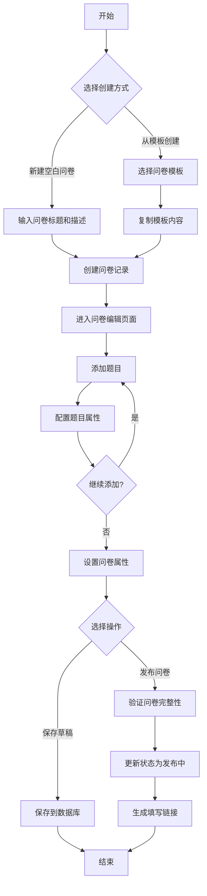
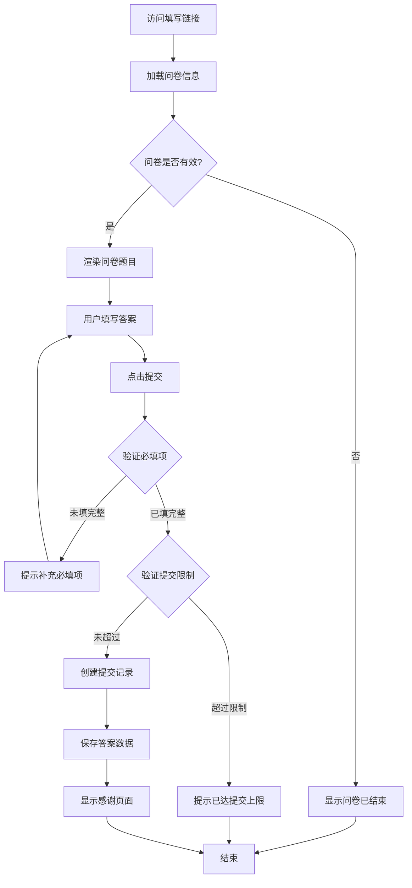
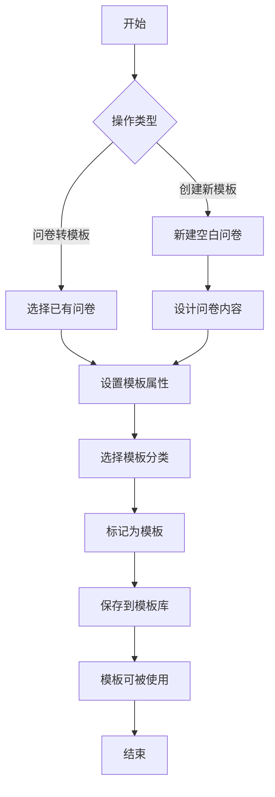

# 问卷系统开发设计文档

## 一、需求概述

在低代码平台中新增独立的问卷系统应用，实现问卷的创建、管理、分发和数据收集功能。系统支持从模板创建问卷，允许外部用户通过链接匿名填写，并提供基础的数据统计分析能力。

### 核心功能
1. 问卷管理：新建空白问卷、从模板创建、将问卷设为模板、查看填写情况、复制填写地址
2. 问卷填写：外部用户通过链接匿名填写问卷
3. 模板管理：创建、编辑、分类管理模板库
4. 题型支持：单选题、多选题、填空题、简答题
5. 填写记录：查看问卷填写记录

## 二、应用元数据结构

### 2.1 应用定义

创建独立应用 survey

### 2.2 菜单结构设计

采用树形菜单结构，包含以下主要菜单项：

#### 根菜单
- 问卷管理（目录）
  - 我的问卷（菜单，显示已创建的问卷列表）
  - 问卷模板（菜单，管理问卷模板）
- 填写记录（菜单，查看所有问卷的填写记录）

## 三、数据源设计

### 3.1 数据表设计

#### 问卷表（tb_survey）

存储问卷基本信息

| 字段名 | 字段类型 | 说明 | 约束 |
|--------|----------|------|------|
| f_id | varchar | 主键 | PK |
| f_title | varchar | 问卷标题 | NOT NULL |
| f_description | varchar | 问卷描述 | NULL |
| f_status | int | 问卷状态：0-草稿，1-发布中，2-已结束 | NOT NULL |
| f_is_template | bool | 是否为模板 | NOT NULL, 默认false |
| f_template_category | varchar | 模板分类 | NULL |
| f_source_template_id | varchar | 来源模板ID | NULL |
| f_allow_anonymous | bool | 允许匿名填写 | NOT NULL, 默认true |
| f_start_time | datetime | 开始时间 | NULL |
| f_end_time | datetime | 结束时间 | NULL |
| f_max_submissions | int | 最大提交次数限制，0表示不限制 | NULL |
| f_creator_id | varchar | 创建人ID | NULL |
| f_create_time | datetime | 创建时间 | NOT NULL |
| f_update_time | datetime | 更新时间 | NULL |

#### 题目表（tb_question）

存储问卷题目信息

| 字段名 | 字段类型 | 说明 | 约束 |
|--------|----------|------|------|
| f_id | varchar | 主键 | PK |
| f_survey_id | varchar | 所属问卷ID | NOT NULL, FK |
| f_question_type | int | 题目类型：1-单选，2-多选，3-填空，4-简答 | NOT NULL |
| f_title | varchar | 题目标题 | NOT NULL |
| f_description | varchar | 题目说明 | NULL |
| f_is_required | bool | 是否必填 | NOT NULL, 默认false |
| f_order | int | 题目排序号 | NOT NULL |
| f_create_time | datetime | 创建时间 | NOT NULL |

#### 选项表（tb_question_option）

存储单选题和多选题的选项

| 字段名 | 字段类型 | 说明 | 约束 |
|--------|----------|------|------|
| f_id | varchar | 主键 | PK |
| f_question_id | varchar | 所属题目ID | NOT NULL, FK |
| f_option_text | varchar | 选项文本 | NOT NULL |
| f_order | int | 选项排序号 | NOT NULL |
| f_create_time | datetime | 创建时间 | NOT NULL |

#### 填写记录表（tb_submission）

存储问卷填写记录

| 字段名 | 字段类型 | 说明 | 约束 |
|--------|----------|------|------|
| f_id | varchar | 主键 | PK |
| f_survey_id | varchar | 问卷ID | NOT NULL, FK |
| f_submitter_id | varchar | 填写人ID，匿名时为空 | NULL |
| f_submitter_name | varchar | 填写人姓名 | NULL |
| f_submit_time | datetime | 提交时间 | NOT NULL |
| f_ip_address | varchar | 提交IP地址 | NULL |
| f_is_complete | bool | 是否完整提交 | NOT NULL, 默认true |

#### 填写答案表（tb_answer）

存储具体答案内容

| 字段名 | 字段类型 | 说明 | 约束 |
|--------|----------|------|------|
| f_id | varchar | 主键 | PK |
| f_submission_id | varchar | 填写记录ID | NOT NULL, FK |
| f_question_id | varchar | 题目ID | NOT NULL, FK |
| f_answer_text | varchar | 文本答案（填空题、简答题） | NULL |
| f_selected_options | varchar[] | 选中的选项ID数组（单选题、多选题） | NULL |
| f_create_time | datetime | 创建时间 | NOT NULL |

## 四、页面设计

### 4.1 我的问卷页面（page_my_surveys）

#### 页面布局
采用列表布局（playout: 0），顶部操作区+表格列表

#### 数据源绑定
- 数据源类型：DB
- 绑定数据表：tb_survey
- 查询条件：f_is_template = false

#### 页面组件结构

**顶部操作区**
- 搜索框组件：搜索问卷标题
- 状态筛选下拉框：筛选草稿、发布中、已结束
- 新建空白问卷按钮
- 从模板创建按钮

**问卷列表表格**

表格列配置：

| 列名 | 字段 | 说明 | 宽度 |
|------|------|------|------|
| 问卷标题 | f_title | 可点击进入编辑 | 自适应 |
| 状态 | f_status | 显示文本映射 | 100px |
| 创建时间 | f_create_time | 格式化显示 | 150px |
| 提交数量 | - | 关联统计 | 100px |
| 操作 | - | 操作按钮组 | 300px |

操作列包含按钮：
- 编辑：进入问卷编辑页面
- 预览：查看问卷填写效果
- 复制链接：复制问卷填写地址
- 设为模板：将问卷转为模板
- 查看统计：进入数据统计页面
- 删除：删除问卷（需确认）

#### 页面交互逻辑

**新建空白问卷流程**
1. 点击"新建空白问卷"按钮
2. 弹出模态框，输入问卷标题和描述
3. 创建问卷记录（状态为草稿）
4. 跳转到问卷编辑页面

**从模板创建流程**
1. 点击"从模板创建"按钮
2. 弹出模板选择对话框，显示可用模板列表
3. 选择模板后确认
4. 复制模板内容创建新问卷
5. 跳转到问卷编辑页面

### 4.2 问卷编辑页面（page_survey_editor）

#### 页面布局
采用自定义布局（playout: 3）

#### 数据源绑定
- 主数据源：tb_survey（单条记录）
- 关联数据源：tb_question、tb_question_option

#### 页面结构

**左侧：题目类型面板**
- 单选题
- 多选题
- 填空题
- 简答题

支持拖拽题型到中间画布区域

**中间：问卷编辑画布**
- 问卷标题输入框
- 问卷描述文本域
- 题目列表区域（可排序、可删除）

**每个题目编辑卡片包含：**
- 题目类型标识
- 题目标题输入框
- 题目说明输入框
- 是否必填开关
- 选项编辑区（单选/多选题）
  - 选项文本输入框列表
  - 添加选项按钮
  - 删除选项按钮
- 题目上移/下移按钮
- 删除题目按钮

**右侧：问卷设置面板**
- 问卷状态选择（草稿/发布中/已结束）
- 允许匿名填写开关
- 开始时间选择
- 结束时间选择
- 最大提交次数输入框
- 保存按钮
- 发布按钮
- 预览按钮

#### 数据保存逻辑

**保存草稿**
- 验证问卷标题不为空
- 保存问卷基本信息到 tb_survey
- 保存所有题目到 tb_question
- 保存单选/多选题选项到 tb_question_option
- 清理已删除的题目和选项

**发布问卷**
- 验证至少包含一个题目
- 验证单选/多选题至少包含两个选项
- 更新问卷状态为"发布中"
- 生成问卷填写链接

### 4.3 问卷填写页面（page_survey_fill）

#### 页面布局
采用表单布局（playout: 1），适配移动端

#### 数据源绑定
- 只读数据源：tb_survey、tb_question、tb_question_option
- 写入数据源：tb_submission、tb_answer

#### 页面结构

**顶部区域**
- 问卷标题显示
- 问卷描述显示
- 必填项说明提示

**题目区域**
依次渲染每个题目，根据题目类型展示不同组件：

- 单选题：Radio 组件
- 多选题：Checkbox 组件
- 填空题：Input 组件
- 简答题：TextArea 组件

必填题目显示红色星号标识

**底部区域**
- 提交按钮

#### 填写提交逻辑

**页面加载**
1. 通过URL参数获取问卷ID
2. 查询问卷基本信息，验证问卷状态
3. 查询所有题目和选项
4. 渲染问卷内容

**提交验证**
1. 验证所有必填题目是否已填写
2. 验证问卷是否在有效期内
3. 验证是否超过最大提交次数限制

**数据保存**
1. 创建填写记录到 tb_submission
2. 保存每个题目的答案到 tb_answer
3. 提交成功后显示感谢页面

### 4.4 问卷模板页面（page_survey_templates）

#### 页面布局
采用卡片网格布局

#### 数据源绑定
- 数据源类型：DB
- 绑定数据表：tb_survey
- 查询条件：f_is_template = true

#### 页面结构

**顶部操作区**
- 模板分类筛选下拉框
- 搜索模板输入框
- 新建模板按钮

**模板卡片网格**

每个模板卡片显示：
- 模板标题
- 模板描述
- 模板分类标签
- 题目数量
- 创建时间
- 操作按钮：编辑、预览、使用模板、删除

#### 模板分类

预定义分类：
- 满意度调查
- 信息收集
- 活动报名
- 意见反馈
- 市场调研
- 其他

### 4.5 填写记录页面（page_submission_records）

#### 页面布局
采用列表布局

#### 数据源绑定
- 数据源类型：DB
- 绑定数据表：tb_submission

#### 页面结构

**筛选区**
- 问卷选择下拉框
- 时间范围选择器
- 完成状态筛选

**记录列表表格**

表格列配置：

| 列名 | 字段 | 说明 |
|------|------|------|
| 问卷标题 | f_survey_id | 关联显示 |
| 填写人 | f_submitter_name | 匿名显示"匿名用户" |
| 提交时间 | f_submit_time | 格式化显示 |
| IP地址 | f_ip_address | - |
| 完成状态 | f_is_complete | 是/否 |
| 操作 | - | 查看详情、删除 |

**详情查看**
- 点击"查看详情"弹出模态框
- 显示该次提交的所有题目和答案

## 五、业务流程设计

### 5.1 问卷创建流程

### 5.2 问卷填写流程

### 5.3 模板管理流程

