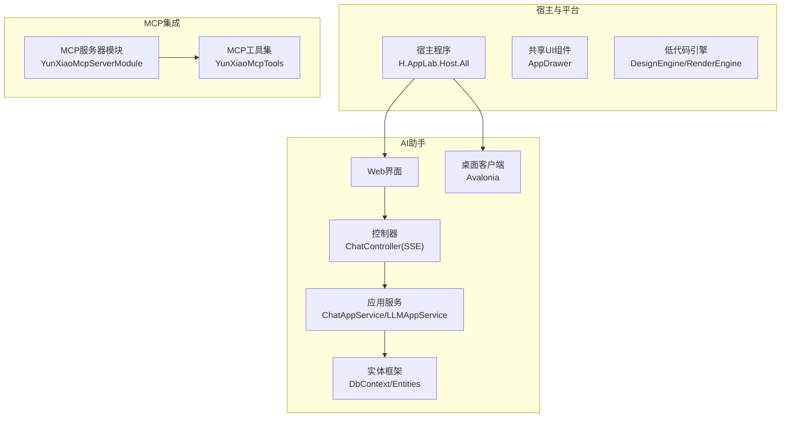
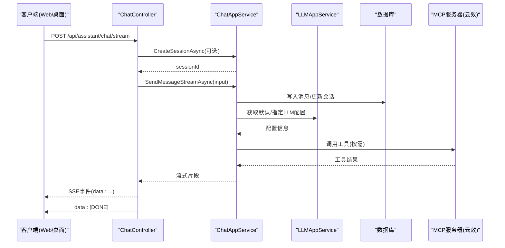
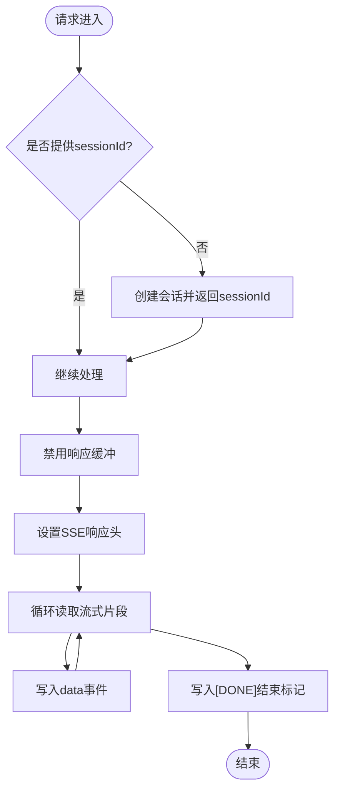
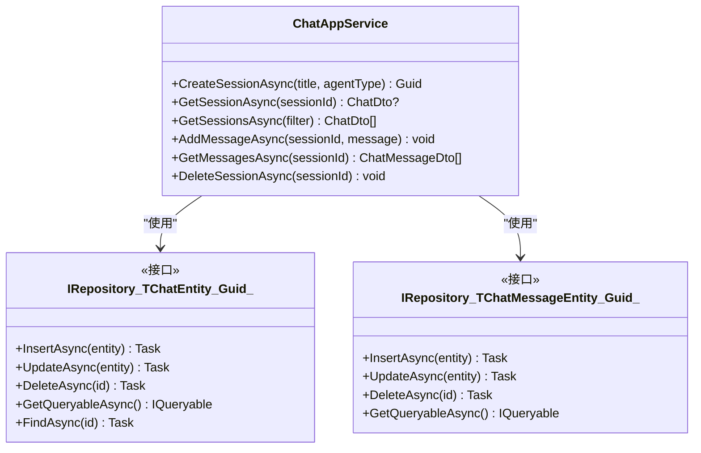
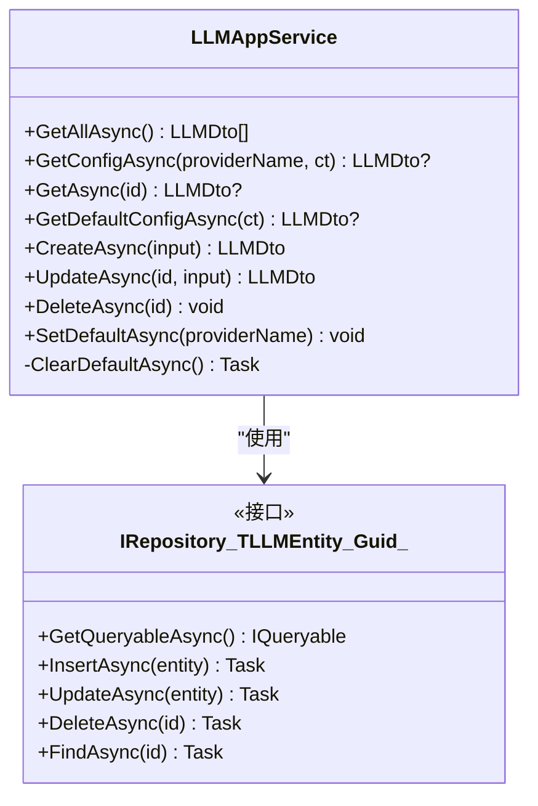
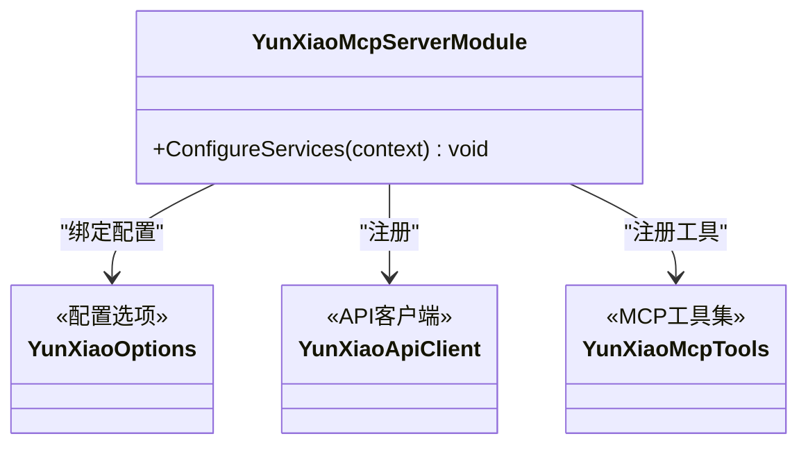
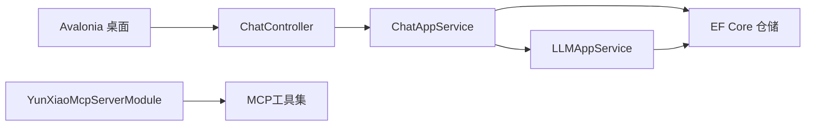

# AI助手服务

<cite>
**本文引用的文件**   
- [README.md](file://README.md)
- [Program.cs](file://src/Agent/Assistant/H.Assistant.Desktop/Program.cs)
- [ChatController.cs](file://src/Agent/Assistant/H.Assistant.Application/Controllers/ChatController.cs)
- [ChatAppService.cs](file://src/Agent/Assistant/H.Assistant.Application/Services/ChatAppService.cs)
- [LLMAppService.cs](file://src/Agent/Assistant/H.Assistant.Application/Services/LLMAppService.cs)
- [YunXiaoMcpServerModule.cs](file://src/Agent/McpServers/H.Mcp.YunXiao/YunXiaoMcpServerModule.cs)
</cite>

## 目录
1. [简介](#简介)
2. [项目结构](#项目结构)
3. [核心组件](#核心组件)
4. [架构总览](#架构总览)
5. [详细组件分析](#详细组件分析)
6. [依赖关系分析](#依赖关系分析)
7. [性能考虑](#性能考虑)
8. [故障排查指南](#故障排查指南)
9. [结论](#结论)
10. [附录](#附录)

## 简介
本文件为 AppLab AI 助手服务的全面技术文档，聚焦于 AI 助手的架构设计与核心功能，包括 MCP 协议集成、工具函数库、对话管理、AI 服务提供商集成（如百度文心、DeepSeek 等）、桌面端应用的开发与部署方式、智能体（Agent）的创建与配置流程、工具函数的开发指南与自定义扩展方法，以及实际对话场景示例与最佳实践建议。

## 项目结构
- 宿主与模块化架构
  - Host 层提供单体与单服务两种宿主模式，采用 Blazor Web App（Server + WebAssembly Client）。
  - Services 按限界上下文划分业务模块，遵循 Application.Contracts / Application / EntityFrameworkCore / Web 分层。
  - Components 提供共享 UI 组件（如 AppDrawer），统一导航与布局。
  - LowCode 包含设计引擎与渲染引擎，支持元数据驱动的页面与组件构建。
  - Tools 提供各服务的数据库迁移工具。
  - Utils 提供通用工具库（ABP 契约、HTTP 动态代理、Blazor 工具、ID 生成等）。

- AI 助手相关子模块
  - Agent/Assistant：应用服务、控制器、实体框架、Web 与 Desktop 客户端。
  - Agent/McpServers：MCP 协议服务器实现与工具注册（以云效为例）。

图表来源
- [README.md:1-74](file://README.md#L1-L74)

章节来源
- [README.md:1-74](file://README.md#L1-L74)

## 核心组件
- 会话与消息管理
  - ChatAppService：负责会话创建、查询、删除与消息增删查，维护会话状态与消息历史。
  - ChatController：提供 SSE 流式响应接口，处理会话自动创建、消息发送与流式返回。
- LLM 配置管理
  - LLMAppService：提供 LLM 提供商配置的 CRUD、默认配置设置与查询。
- MCP 协议集成
  - YunXiaoMcpServerModule：绑定配置、注册 HttpClient、API Client 与 MCP Server（Streamable HTTP 传输），并注册工具集合。
- 桌面端入口
  - Program.cs：基于 Avalonia 的桌面客户端启动入口。

章节来源
- [ChatAppService.cs:1-129](file://src/Agent/Assistant/H.Assistant.Application/Services/ChatAppService.cs#L1-L129)
- [ChatController.cs:1-79](file://src/Agent/Assistant/H.Assistant.Application/Controllers/ChatController.cs#L1-L79)
- [LLMAppService.cs:1-128](file://src/Agent/Assistant/H.Assistant.Application/Services/LLMAppService.cs#L1-L128)
- [YunXiaoMcpServerModule.cs:1-30](file://src/Agent/McpServers/H.Mcp.YunXiao/YunXiaoMcpServerModule.cs#L1-L30)
- [Program.cs:1-20](file://src/Agent/Assistant/H.Assistant.Desktop/Program.cs#L1-L20)

## 架构总览
AI 助手服务采用 ABP 模块化架构，结合 Blazor Web App 与 Avalonia 桌面客户端，通过 REST/SSE 与 MCP 协议对外暴露能力。核心流程如下：
- 前端（Web/桌面）调用 ChatController 的 SSE 接口。
- 控制器根据输入决定是否创建新会话，随后调用 ChatAppService 进行消息处理。
- ChatAppService 持久化消息与会话信息，并通过 LLMAppService 获取或更新 LLM 配置。
- MCP 服务器模块提供工具能力，供智能体在任务执行时调用外部系统（如云效）。

图表来源
- [ChatController.cs:1-79](file://src/Agent/Assistant/H.Assistant.Application/Controllers/ChatController.cs#L1-L79)
- [ChatAppService.cs:1-129](file://src/Agent/Assistant/H.Assistant.Application/Services/ChatAppService.cs#L1-L129)
- [LLMAppService.cs:1-128](file://src/Agent/Assistant/H.Assistant.Application/Services/LLMAppService.cs#L1-L128)
- [YunXiaoMcpServerModule.cs:1-30](file://src/Agent/McpServers/H.Mcp.YunXiao/YunXiaoMcpServerModule.cs#L1-L30)

## 详细组件分析

### 聊天控制器（SSE 流式响应）
- 职责
  - 接收前端消息请求，必要时创建新会话并返回 sessionId。
  - 禁用响应缓冲，设置 SSE 响应头，确保实时推送。
  - 调用 ChatAppService 的流式方法，逐块返回数据。
  - 异常处理：将错误封装为 SSE 事件返回。
- 关键点
  - 使用 IHttpResponseBodyFeature 禁用缓冲。
  - 设置 Cache-Control 与 Connection 头避免中间件压缩与连接关闭。
  - 结束标记 [DONE] 用于前端识别流结束。

图表来源
- [ChatController.cs:1-79](file://src/Agent/Assistant/H.Assistant.Application/Controllers/ChatController.cs#L1-L79)

章节来源
- [ChatController.cs:1-79](file://src/Agent/Assistant/H.Assistant.Application/Controllers/ChatController.cs#L1-L79)

### 会话与消息服务（ChatAppService）
- 职责
  - 会话生命周期管理：创建、查询、删除。
  - 消息管理：添加、查询；维护会话的最后消息时间与消息计数。
  - 数据映射：使用 AutoMapper 在实体与 DTO 之间转换。
- 关键点
  - 使用 IAsyncQueryableExecuter 执行异步查询。
  - 删除会话时级联删除其所有消息。
  - 新增消息后更新会话统计信息。

图表来源
- [ChatAppService.cs:1-129](file://src/Agent/Assistant/H.Assistant.Application/Services/ChatAppService.cs#L1-L129)

章节来源
- [ChatAppService.cs:1-129](file://src/Agent/Assistant/H.Assistant.Application/Services/ChatAppService.cs#L1-L129)

### LLM 配置服务（LLMAppService）
- 职责
  - 提供 LLM 提供商配置的增删改查与默认配置管理。
  - 支持按 ProviderName 获取配置、设置默认配置、批量清理默认项。
- 关键点
  - 使用 AutoMapper 进行实体与 DTO 映射。
  - 设置默认配置时先清除其他默认项，保证唯一性。
  - 支持可选字段（ApiKey、ApiSecret、BaseUrl）的增量更新。

图表来源
- [LLMAppService.cs:1-128](file://src/Agent/Assistant/H.Assistant.Application/Services/LLMAppService.cs#L1-L128)

章节来源
- [LLMAppService.cs:1-128](file://src/Agent/Assistant/H.Assistant.Application/Services/LLMAppService.cs#L1-L128)

### MCP 协议集成（云效示例）
- 职责
  - 绑定云效配置到选项对象。
  - 注册 HttpClient 与 API Client。
  - 启用 MCP Server（Streamable HTTP 传输）并注册工具集合。
- 关键点
  - 使用 AbpModule 进行服务注册。
  - 通过 WithTools<T>() 注入工具实现，供智能体调用。

图表来源
- [YunXiaoMcpServerModule.cs:1-30](file://src/Agent/McpServers/H.Mcp.YunXiao/YunXiaoMcpServerModule.cs#L1-L30)

章节来源
- [YunXiaoMcpServerModule.cs:1-30](file://src/Agent/McpServers/H.Mcp.YunXiao/YunXiaoMcpServerModule.cs#L1-L30)

### 桌面端应用（Avalonia）
- 职责
  - 作为 AI 助手的本地客户端入口，提供跨平台桌面体验。
- 关键点
  - 使用 Avalonia 构建桌面应用，支持平台检测与字体加载。
  - 日志输出至 Trace，便于调试。

章节来源
- [Program.cs:1-20](file://src/Agent/Assistant/H.Assistant.Desktop/Program.cs#L1-L20)

## 依赖关系分析
- 组件耦合与内聚
  - ChatController 与 ChatAppService 高内聚，专注于会话与消息流。
  - LLMAppService 独立管理 LLM 配置，降低对具体提供商实现的耦合。
  - MCP 模块通过 AbpModule 解耦工具注册，便于扩展新的 MCP 服务器。
- 外部依赖
  - ABP 框架提供模块化、仓储、映射与 DI。
  - EF Core 用于数据持久化。
  - Avalonia 用于桌面客户端。
  - ASP.NET Core 用于 Web API 与 SSE。

图表来源
- [ChatController.cs:1-79](file://src/Agent/Assistant/H.Assistant.Application/Controllers/ChatController.cs#L1-L79)
- [ChatAppService.cs:1-129](file://src/Agent/Assistant/H.Assistant.Application/Services/ChatAppService.cs#L1-L129)
- [LLMAppService.cs:1-128](file://src/Agent/Assistant/H.Assistant.Application/Services/LLMAppService.cs#L1-L128)
- [YunXiaoMcpServerModule.cs:1-30](file://src/Agent/McpServers/H.Mcp.YunXiao/YunXiaoMcpServerModule.cs#L1-L30)

章节来源
- [ChatController.cs:1-79](file://src/Agent/Assistant/H.Assistant.Application/Controllers/ChatController.cs#L1-L79)
- [ChatAppService.cs:1-129](file://src/Agent/Assistant/H.Assistant.Application/Services/ChatAppService.cs#L1-L129)
- [LLMAppService.cs:1-128](file://src/Agent/Assistant/H.Assistant.Application/Services/LLMAppService.cs#L1-L128)
- [YunXiaoMcpServerModule.cs:1-30](file://src/Agent/McpServers/H.Mcp.YunXiao/YunXiaoMcpServerModule.cs#L1-L30)

## 性能考虑
- SSE 流式响应
  - 禁用响应缓冲，减少延迟。
  - 设置合适的响应头避免中间件压缩与连接关闭。
- 异步与分页
  - 使用 IAsyncQueryableExecuter 提升查询性能。
  - 对大列表进行分页与过滤，减少内存占用。
- 配置缓存
  - LLM 配置可考虑缓存默认配置，减少频繁数据库访问。
- 资源管理
  - HttpClient 使用命名客户端，复用连接池。
  - 合理设置超时与重试策略。

## 故障排查指南
- SSE 连接问题
  - 检查响应头是否正确设置（Cache-Control、Connection）。
  - 确认服务端未启用压缩中间件导致 SSE 数据被截断。
- 会话与消息不一致
  - 验证 AddMessageAsync 后是否更新 LastMessageTime 与 MessageCount。
  - 删除会话时确保级联删除所有消息。
- LLM 配置错误
  - 检查默认配置是否唯一且有效。
  - 确认 ApiKey、ApiSecret、BaseUrl 等敏感字段正确传递。
- MCP 工具调用失败
  - 检查 HttpClient 与 API Client 配置。
  - 确认工具注册与参数映射正确。

章节来源
- [ChatController.cs:1-79](file://src/Agent/Assistant/H.Assistant.Application/Controllers/ChatController.cs#L1-L79)
- [ChatAppService.cs:1-129](file://src/Agent/Assistant/H.Assistant.Application/Services/ChatAppService.cs#L1-L129)
- [LLMAppService.cs:1-128](file://src/Agent/Assistant/H.Assistant.Application/Services/LLMAppService.cs#L1-L128)
- [YunXiaoMcpServerModule.cs:1-30](file://src/Agent/McpServers/H.Mcp.YunXiao/YunXiaoMcpServerModule.cs#L1-L30)

## 结论
AppLab AI 助手服务通过模块化架构与 ABP 框架实现了可扩展、易维护的 AI 助手平台。SSE 流式响应提升了用户体验，MCP 协议集成提供了强大的工具扩展能力。LLM 配置管理与会话/消息管理为核心功能，支持多提供商接入与桌面端应用。建议在后续迭代中加强配置缓存、错误监控与性能优化，以提升系统的稳定性与可用性。

## 附录
- 实际对话场景示例
  - 用户发起新对话：前端不传 sessionId，后端自动创建会话并返回 sessionId。
  - 流式回复：后端逐块返回文本片段，前端实时渲染。
  - 工具调用：智能体在执行任务时调用 MCP 工具（如云效 API），获取结果后继续生成回复。
- 最佳实践建议
  - 明确会话生命周期，及时清理过期会话。
  - 对 LLM 配置进行加密存储与权限控制。
  - 使用合理的超时与重试策略，避免长时间阻塞。
  - 对 SSE 连接进行心跳检测与重连机制。
  - 在 MCP 工具中做好参数校验与异常处理。