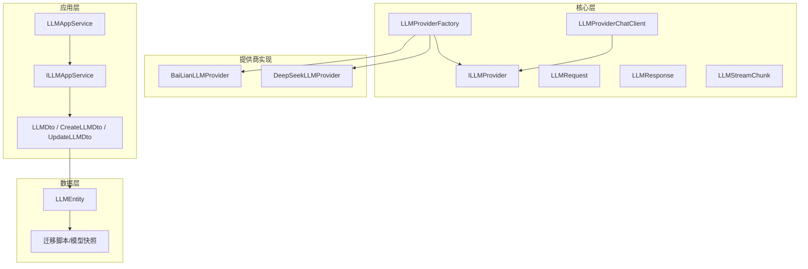
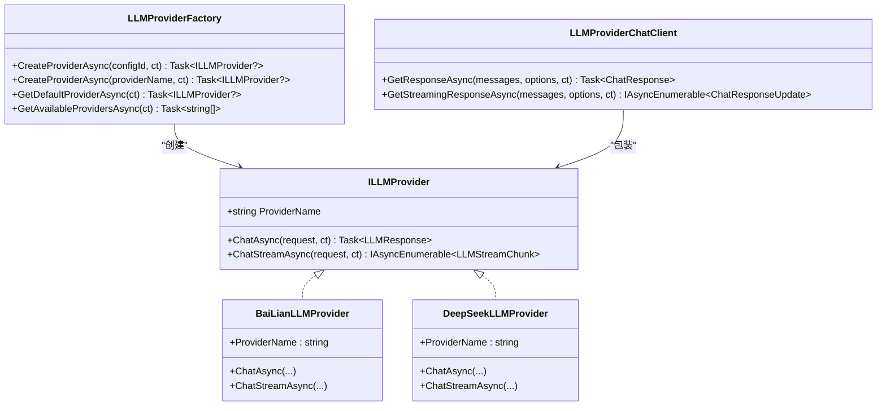
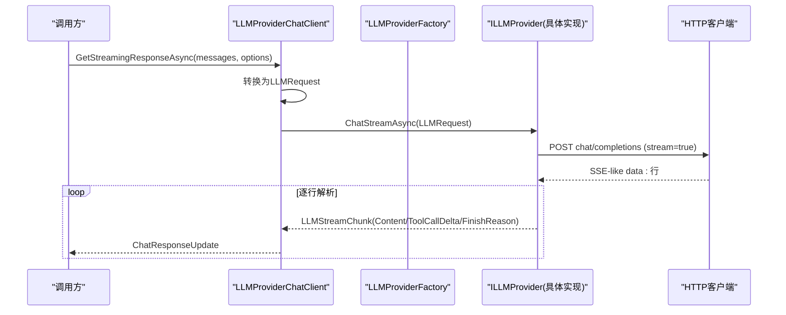
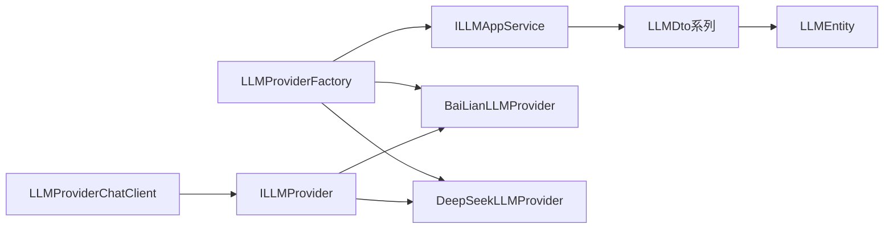

# AI服务提供商集成

<cite>
**本文引用的文件**   
- [LLMProviderFactory.cs](file://src/Agent/Assistant/H.Assistant.Core/LLM/LLMProviderFactory.cs)
- [ILLMProvider.cs](file://src/Agent/Assistant/H.Assistant.Core/LLM/ILLMProvider.cs)
- [BaiLianLLMProvider.cs](file://src/Agent/Assistant/H.Assistant.Core/LLM/Providers/BaiLianLLMProvider.cs)
- [DeepSeekLLMProvider.cs](file://src/Agent/Assistant/H.Assistant.Core/LLM/Providers/DeepSeekLLMProvider.cs)
- [LLMRequest.cs](file://src/Agent/Assistant/H.Assistant.Core/LLM/LLMRequest.cs)
- [LLMResponse.cs](file://src/Agent/Assistant/H.Assistant.Core/LLM/LLMResponse.cs)
- [LLMStreamChunk.cs](file://src/Agent/Assistant/H.Assistant.Core/LLM/LLMStreamChunk.cs)
- [LLMProviderChatClient.cs](file://src/Agent/Assistant/H.Assistant.Core/Agents/LLMProviderChatClient.cs)
- [LLMAppService.cs](file://src/Agent/Assistant/H.Assistant.Application/Services/LLMAppService.cs)
- [ILLMAppService.cs](file://src/Agent/Assistant/H.Assistant.Application.Contracts/Services/Llms/ILLMAppService.cs)
- [LLMDto.cs](file://src/Agent/Assistant/H.Assistant.Application.Contracts/Dtos/Llms/LLMDto.cs)
- [CreateLLMDto.cs](file://src/Agent/Assistant/H.Assistant.Application.Contracts/Dtos/Llms/CreateLLMDto.cs)
- [UpdateLLMDto.cs](file://src/Agent/Assistant/H.Assistant.Application.Contracts/Dtos/Llms/UpdateLLMDto.cs)
- [LLMEntity.cs](file://src/Agent/Assistant/H.Assistant.EntityFrameworkCore/Entities/LLMEntity.cs)
- [20260604021506_Init.cs](file://src/Tools/H.Assistant.DbMigrator/Migrations/20260604021506_Init.cs)
- [AssistantDbContextModelSnapshot.cs](file://src/Tools/H.Assistant.DbMigrator/Migrations/AssistantDbContextModelSnapshot.cs)
</cite>

## 目录
1. [简介](#简介)
2. [项目结构](#项目结构)
3. [核心组件](#核心组件)
4. [架构总览](#架构总览)
5. [详细组件分析](#详细组件分析)
6. [依赖关系分析](#依赖关系分析)
7. [性能考虑](#性能考虑)
8. [故障排查指南](#故障排查指南)
9. [结论](#结论)
10. [附录](#附录)

## 简介
本文件面向AI服务提供商集成，系统性说明本项目对百度文心（阿里云百炼DashScope）与DeepSeek的接入实现，统一接口设计、工厂模式应用、请求响应格式转换与流式响应处理，并提供自定义提供商扩展指南、配置模板、性能优化建议与故障恢复机制。读者无需深入源码即可理解整体设计与使用方式。

## 项目结构
围绕LLM能力，代码集中在H.Assistant.Core与相关Application/Contracts/EFCore模块中：
- 统一接口与数据模型：ILLMProvider、LLMRequest、LLMResponse、LLMStreamChunk
- 提供商实现：BaiLianLLMProvider、DeepSeekLLMProvider
- 工厂与适配：LLMProviderFactory、LLMProviderChatClient
- 配置服务与DTO：ILLMAppService、LLMAppService、LLMDto等
- 持久化实体与迁移：LLMEntity、迁移脚本与模型快照

图表来源 
- [LLMProviderFactory.cs:1-72](file://src/Agent/Assistant/H.Assistant.Core/LLM/LLMProviderFactory.cs#L1-L72)
- [ILLMProvider.cs:1-23](file://src/Agent/Assistant/H.Assistant.Core/LLM/ILLMProvider.cs#L1-L23)
- [BaiLianLLMProvider.cs:1-228](file://src/Agent/Assistant/H.Assistant.Core/LLM/Providers/BaiLianLLMProvider.cs#L1-L228)
- [DeepSeekLLMProvider.cs:1-228](file://src/Agent/Assistant/H.Assistant.Core/LLM/Providers/DeepSeekLLMProvider.cs#L1-L228)
- [LLMRequest.cs:1-58](file://src/Agent/Assistant/H.Assistant.Core/LLM/LLMRequest.cs#L1-L58)
- [LLMResponse.cs:1-29](file://src/Agent/Assistant/H.Assistant.Core/LLM/LLMResponse.cs#L1-L29)
- [LLMStreamChunk.cs:1-34](file://src/Agent/Assistant/H.Assistant.Core/LLM/LLMStreamChunk.cs#L1-L34)
- [LLMProviderChatClient.cs:1-78](file://src/Agent/Assistant/H.Assistant.Core/Agents/LLMProviderChatClient.cs#L1-L78)
- [LLMAppService.cs](file://src/Agent/Assistant/H.Assistant.Application/Services/LLMAppService.cs)
- [ILLMAppService.cs](file://src/Agent/Assistant/H.Assistant.Application.Contracts/Services/Llms/ILLMAppService.cs)
- [LLMDto.cs](file://src/Agent/Assistant/H.Assistant.Application.Contracts/Dtos/Llms/LLMDto.cs)
- [CreateLLMDto.cs](file://src/Agent/Assistant/H.Assistant.Application.Contracts/Dtos/Llms/CreateLLMDto.cs)
- [UpdateLLMDto.cs](file://src/Agent/Assistant/H.Assistant.Application.Contracts/Dtos/Llms/UpdateLLMDto.cs)
- [LLMEntity.cs](file://src/Agent/Assistant/H.Assistant.EntityFrameworkCore/Entities/LLMEntity.cs)
- [20260604021506_Init.cs:66-84](file://src/Tools/H.Assistant.DbMigrator/Migrations/20260604021506_Init.cs#L66-L84)
- [AssistantDbContextModelSnapshot.cs:300-337](file://src/Tools/H.Assistant.DbMigrator/Migrations/AssistantDbContextModelSnapshot.cs#L300-L337)

章节来源
- [LLMProviderFactory.cs:1-72](file://src/Agent/Assistant/H.Assistant.Core/LLM/LLMProviderFactory.cs#L1-L72)
- [ILLMProvider.cs:1-23](file://src/Agent/Assistant/H.Assistant.Core/LLM/ILLMProvider.cs#L1-L23)
- [BaiLianLLMProvider.cs:1-228](file://src/Agent/Assistant/H.Assistant.Core/LLM/Providers/BaiLianLLMProvider.cs#L1-L228)
- [DeepSeekLLMProvider.cs:1-228](file://src/Agent/Assistant/H.Assistant.Core/LLM/Providers/DeepSeekLLMProvider.cs#L1-L228)
- [LLMRequest.cs:1-58](file://src/Agent/Assistant/H.Assistant.Core/LLM/LLMRequest.cs#L1-L58)
- [LLMResponse.cs:1-29](file://src/Agent/Assistant/H.Assistant.Core/LLM/LLMResponse.cs#L1-L29)
- [LLMStreamChunk.cs:1-34](file://src/Agent/Assistant/H.Assistant.Core/LLM/LLMStreamChunk.cs#L1-L34)
- [LLMProviderChatClient.cs:1-78](file://src/Agent/Assistant/H.Assistant.Core/Agents/LLMProviderChatClient.cs#L1-L78)
- [20260604021506_Init.cs:66-84](file://src/Tools/H.Assistant.DbMigrator/Migrations/20260604021506_Init.cs#L66-L84)
- [AssistantDbContextModelSnapshot.cs:300-337](file://src/Tools/H.Assistant.DbMigrator/Migrations/AssistantDbContextModelSnapshot.cs#L300-L337)

## 核心组件
- 统一接口 ILLMProvider：定义 ProviderName、同步对话 ChatAsync、流式对话 ChatStreamAsync，屏蔽各厂商差异。
- 工厂 LLMProviderFactory：根据配置ID或ProviderName从配置服务加载配置并创建具体Provider实例；支持获取默认Provider与可用列表。
- 数据模型：
  - LLMRequest：包含模型名、消息列表、温度、最大Token数、工具定义等。
  - LLMResponse：包含内容、模型名、用量统计、工具调用结果。
  - LLMStreamChunk：流式增量，包含文本增量、工具调用增量与结束原因。
- 适配层 LLMProviderChatClient：将内部LLMRequest/Response转换为Microsoft.Extensions.AI的IChatClient协议，便于上层以统一聊天客户端调用。

章节来源
- [ILLMProvider.cs:1-23](file://src/Agent/Assistant/H.Assistant.Core/LLM/ILLMProvider.cs#L1-L23)
- [LLMProviderFactory.cs:1-72](file://src/Agent/Assistant/H.Assistant.Core/LLM/LLMProviderFactory.cs#L1-L72)
- [LLMRequest.cs:1-58](file://src/Agent/Assistant/H.Assistant.Core/LLM/LLMRequest.cs#L1-L58)
- [LLMResponse.cs:1-29](file://src/Agent/Assistant/H.Assistant.Core/LLM/LLMResponse.cs#L1-L29)
- [LLMStreamChunk.cs:1-34](file://src/Agent/Assistant/H.Assistant.Core/LLM/LLMStreamChunk.cs#L1-L34)
- [LLMProviderChatClient.cs:1-78](file://src/Agent/Assistant/H.Assistant.Core/Agents/LLMProviderChatClient.cs#L1-L78)

## 架构总览
系统采用“统一接口 + 工厂”解耦不同AI服务商，通过配置驱动动态选择Provider；同时提供IChatClient适配，使上层以标准聊天客户端调用任意后端。

图表来源 
- [ILLMProvider.cs:1-23](file://src/Agent/Assistant/H.Assistant.Core/LLM/ILLMProvider.cs#L1-L23)
- [BaiLianLLMProvider.cs:1-228](file://src/Agent/Assistant/H.Assistant.Core/LLM/Providers/BaiLianLLMProvider.cs#L1-L228)
- [DeepSeekLLMProvider.cs:1-228](file://src/Agent/Assistant/H.Assistant.Core/LLM/Providers/DeepSeekLLMProvider.cs#L1-L228)
- [LLMProviderFactory.cs:1-72](file://src/Agent/Assistant/H.Assistant.Core/LLM/LLMProviderFactory.cs#L1-L72)
- [LLMProviderChatClient.cs:1-78](file://src/Agent/Assistant/H.Assistant.Core/Agents/LLMProviderChatClient.cs#L1-L78)

## 详细组件分析

### 工厂与统一接口
- LLMProviderFactory负责：
  - 按configId或providerName从配置服务读取配置，校验启用状态与密钥后，基于ProviderName映射到具体实现类。
  - 提供默认Provider与可用Provider列表查询。
- ILLMProvider抽象了所有提供商的共同能力，确保上层只依赖接口而非具体实现。

章节来源
- [LLMProviderFactory.cs:1-72](file://src/Agent/Assistant/H.Assistant.Core/LLM/LLMProviderFactory.cs#L1-L72)
- [ILLMProvider.cs:1-23](file://src/Agent/Assistant/H.Assistant.Core/LLM/ILLMProvider.cs#L1-L23)

### 百度文心（阿里云百炼DashScope）集成
- 端点与认证：
  - 路径：chat/completions
  - 认证：Authorization Bearer ApiKey
- 请求构建：
  - 非流式：temperature、max_tokens随请求发送
  - 流式：stream=true，逐行解析data: JSON
- 响应映射：
  - 将QwenResponse/QwenChoice/QwenMessage映射为统一的LLMResponse
  - 支持tool_calls字段
- 流式处理：
  - 使用HttpCompletionOption.ResponseHeadersRead即时返回头部
  - 逐行读取SSE-like data:行，解析delta.content与delta.tool_calls增量

章节来源
- [BaiLianLLMProvider.cs:1-228](file://src/Agent/Assistant/H.Assistant.Core/LLM/Providers/BaiLianLLMProvider.cs#L1-L228)

### DeepSeek集成
- 端点与认证：
  - 路径：v1/chat/completions
  - 认证：Authorization Bearer ApiKey
- 请求构建与流式处理：
  - 与非流式参数与百炼类似，流式同样按data:行解析
- 响应映射：
  - 将DeepSeekResponse/Choice/Message映射为统一LLMResponse
  - 支持tool_calls字段

章节来源
- [DeepSeekLLMProvider.cs:1-228](file://src/Agent/Assistant/H.Assistant.Core/LLM/Providers/DeepSeekLLMProvider.cs#L1-L228)

### 请求与响应格式转换
- LLMRequest：
  - 包含model、messages、temperature、max_tokens、tools
  - Message支持role/content/tool_calls/tool_call_id
- LLMResponse：
  - 包含content、model、usageTokens、toolCalls
- LLMStreamChunk：
  - 包含content增量、toolCallDelta、finishReason
- LLMProviderChatClient：
  - 将Microsoft.Extensions.AI的ChatMessage/ChatOptions转换为LLMRequest
  - 将LLMResponse/流式chunk转换为ChatResponse/ChatResponseUpdate

章节来源
- [LLMRequest.cs:1-58](file://src/Agent/Assistant/H.Assistant.Core/LLM/LLMRequest.cs#L1-L58)
- [LLMResponse.cs:1-29](file://src/Agent/Assistant/H.Assistant.Core/LLM/LLMResponse.cs#L1-L29)
- [LLMStreamChunk.cs:1-34](file://src/Agent/Assistant/H.Assistant.Core/LLM/LLMStreamChunk.cs#L1-L34)
- [LLMProviderChatClient.cs:1-78](file://src/Agent/Assistant/H.Assistant.Core/Agents/LLMProviderChatClient.cs#L1-L78)

### 流式响应处理流程

图表来源 
- [LLMProviderChatClient.cs:1-78](file://src/Agent/Assistant/H.Assistant.Core/Agents/LLMProviderChatClient.cs#L1-L78)
- [BaiLianLLMProvider.cs:1-228](file://src/Agent/Assistant/H.Assistant.Core/LLM/Providers/BaiLianLLMProvider.cs#L1-L228)
- [DeepSeekLLMProvider.cs:1-228](file://src/Agent/Assistant/H.Assistant.Core/LLM/Providers/DeepSeekLLMProvider.cs#L1-L228)

### 配置与持久化
- 配置服务ILLMAppService/LLMAppService：
  - 提供按ID、名称、默认配置获取以及全量查询能力
- DTO与实体：
  - LLMDto/CreateLLMDto/UpdateLLMDto用于传输与编辑
  - LLMEntity持久化ProviderDisplayName、ProviderName、ApiKey、BaseUrl、Model、IsEnabled、IsDefault、MaxTokens、Temperature、TimeoutSeconds、ExtraConfig等
- 迁移与快照：
  - 迁移脚本定义了Llm表结构与字段约束
  - 模型快照反映当前数据库模型状态

章节来源
- [ILLMAppService.cs](file://src/Agent/Assistant/H.Assistant.Application.Contracts/Services/Llms/ILLMAppService.cs)
- [LLMAppService.cs](file://src/Agent/Assistant/H.Assistant.Application/Services/LLMAppService.cs)
- [LLMDto.cs](file://src/Agent/Assistant/H.Assistant.Application.Contracts/Dtos/Llms/LLMDto.cs)
- [CreateLLMDto.cs](file://src/Agent/Assistant/H.Assistant.Application.Contracts/Dtos/Llms/CreateLLMDto.cs)
- [UpdateLLMDto.cs](file://src/Agent/Assistant/H.Assistant.Application.Contracts/Dtos/Llms/UpdateLLMDto.cs)
- [LLMEntity.cs](file://src/Agent/Assistant/H.Assistant.EntityFrameworkCore/Entities/LLMEntity.cs)
- [20260604021506_Init.cs:66-84](file://src/Tools/H.Assistant.DbMigrator/Migrations/20260604021506_Init.cs#L66-L84)
- [AssistantDbContextModelSnapshot.cs:300-337](file://src/Tools/H.Assistant.DbMigrator/Migrations/AssistantDbContextModelSnapshot.cs#L300-L337)

## 依赖关系分析
- 工厂依赖配置服务ILLMAppService，避免硬编码配置来源。
- 具体Provider仅依赖HttpClient与JSON序列化，无外部框架耦合。
- ChatClient依赖Microsoft.Extensions.AI，作为上层统一入口。
- 配置层依赖EFCore实体与迁移，保证配置可持久化与版本演进。

图表来源 
- [LLMProviderFactory.cs:1-72](file://src/Agent/Assistant/H.Assistant.Core/LLM/LLMProviderFactory.cs#L1-L72)
- [ILLMAppService.cs](file://src/Agent/Assistant/H.Assistant.Application.Contracts/Services/Llms/ILLMAppService.cs)
- [LLMProviderChatClient.cs:1-78](file://src/Agent/Assistant/H.Assistant.Core/Agents/LLMProviderChatClient.cs#L1-L78)
- [LLMEntity.cs](file://src/Agent/Assistant/H.Assistant.EntityFrameworkCore/Entities/LLMEntity.cs)

章节来源
- [LLMProviderFactory.cs:1-72](file://src/Agent/Assistant/H.Assistant.Core/LLM/LLMProviderFactory.cs#L1-L72)
- [LLMProviderChatClient.cs:1-78](file://src/Agent/Assistant/H.Assistant.Core/Agents/LLMProviderChatClient.cs#L1-L78)

## 性能考虑
- 流式优先：
  - 使用ResponseHeadersRead减少首字节延迟
  - 逐行解析SSE-like data:行，避免等待完整响应体
- 连接复用：
  - 生产环境建议使用HttpClient单例或IHttpClientFactory管理连接池
- 超时控制：
  - 通过TimeoutSeconds与CancellationToken配合，避免长时间阻塞
- Token限制：
  - MaxTokens合理设置，避免超长响应导致内存压力
- 压缩与网络：
  - 服务端可启用响应压缩以减少传输体积（参考宿主配置中的压缩策略）

[本节为通用指导，不直接分析具体文件]

## 故障排查指南
- 常见错误：
  - 未注册Provider：当ProviderName不在映射表中会抛出异常，需检查配置ProviderName与工厂映射
  - 认证失败：检查ApiKey与BaseUrl是否正确，确认Authorization头已设置
  - 非成功状态码：捕获HttpResponseException并记录错误体以便定位
- 流式异常：
  - 断流或卡住：检查网络与服务器是否持续推送data:行，确认取消令牌生效
- 配置问题：
  - IsEnabled为false或缺少ApiKey时，工厂不会创建Provider
  - BaseUrl末尾缺少“/”可能导致相对路径拼接异常（实现中已做TrimEnd('/')+"/"处理）

章节来源
- [LLMProviderFactory.cs:1-72](file://src/Agent/Assistant/H.Assistant.Core/LLM/LLMProviderFactory.cs#L1-L72)
- [BaiLianLLMProvider.cs:1-228](file://src/Agent/Assistant/H.Assistant.Core/LLM/Providers/BaiLianLLMProvider.cs#L1-L228)
- [DeepSeekLLMProvider.cs:1-228](file://src/Agent/Assistant/H.Assistant.Core/LLM/Providers/DeepSeekLLMProvider.cs#L1-L228)

## 结论
本项目通过统一接口与工厂模式，将不同AI服务提供商抽象为一致的能力模型，既简化了上层调用，又提升了扩展性。结合流式响应与标准化数据模型，实现了高效、可扩展的LLM集成方案。新增提供商只需实现接口并在工厂中注册映射即可。

[本节为总结，不直接分析具体文件]

## 附录

### 自定义AI服务提供商开发指南
- 步骤概览：
  - 实现ILLMProvider接口，完成ChatAsync与ChatStreamAsync
  - 在LLMProviderFactory的CreateFromConfig中添加ProviderName映射
  - 在配置服务中新增对应配置项（ProviderName、ApiKey、BaseUrl、Model等）
- 认证配置：
  - 在构造函数中设置Authorization头与BaseAddress
  - 确保BaseUrl规范化，避免相对路径拼接问题
- 错误处理：
  - 对非成功状态码进行异常抛出并附带错误体
  - 流式处理中检查EndOfStream与取消令牌
- 示例要点（路径引用）：
  - 参考BaiLianLLMProvider与DeepSeekLLMProvider的实现模式

章节来源
- [ILLMProvider.cs:1-23](file://src/Agent/Assistant/H.Assistant.Core/LLM/ILLMProvider.cs#L1-L23)
- [LLMProviderFactory.cs:1-72](file://src/Agent/Assistant/H.Assistant.Core/LLM/LLMProviderFactory.cs#L1-L72)
- [BaiLianLLMProvider.cs:1-228](file://src/Agent/Assistant/H.Assistant.Core/LLM/Providers/BaiLianLLMProvider.cs#L1-L228)
- [DeepSeekLLMProvider.cs:1-228](file://src/Agent/Assistant/H.Assistant.Core/LLM/Providers/DeepSeekLLMProvider.cs#L1-L228)

### 使用示例与配置模板
- 使用示例（路径引用）：
  - 通过LLMProviderFactory创建Provider并按需调用ChatAsync或ChatStreamAsync
  - 或通过LLMProviderChatClient以IChatClient协议调用
- 配置模板（字段说明）：
  - ProviderDisplayName：显示名称
  - ProviderName：标识符（如bailian/deepseek）
  - ApiKey：访问密钥
  - ApiSecret：可选密钥
  - BaseUrl：API基础地址
  - Model：默认模型名
  - IsEnabled/IsDefault：启用与默认标记
  - MaxTokens/Temperature/TimeoutSeconds：生成参数与超时
  - ExtraConfig：扩展配置（JSON字符串）

章节来源
- [LLMProviderFactory.cs:1-72](file://src/Agent/Assistant/H.Assistant.Core/LLM/LLMProviderFactory.cs#L1-L72)
- [LLMProviderChatClient.cs:1-78](file://src/Agent/Assistant/H.Assistant.Core/Agents/LLMProviderChatClient.cs#L1-L78)
- [20260604021506_Init.cs:66-84](file://src/Tools/H.Assistant.DbMigrator/Migrations/20260604021506_Init.cs#L66-L84)
- [AssistantDbContextModelSnapshot.cs:300-337](file://src/Tools/H.Assistant.DbMigrator/Migrations/AssistantDbContextModelSnapshot.cs#L300-L337)