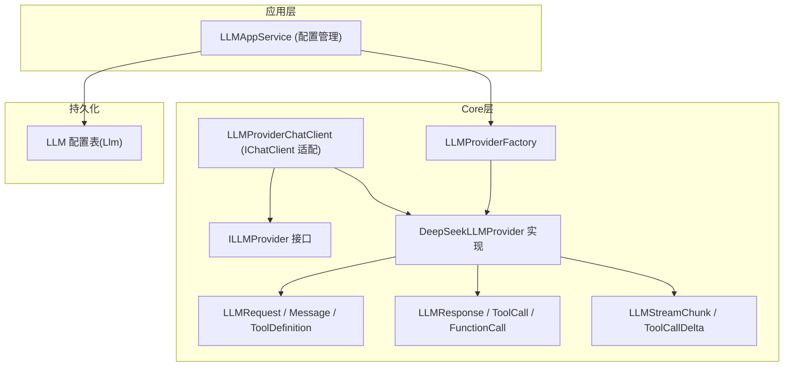
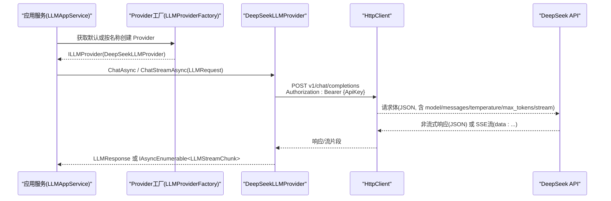
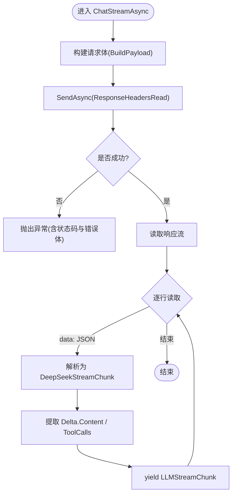
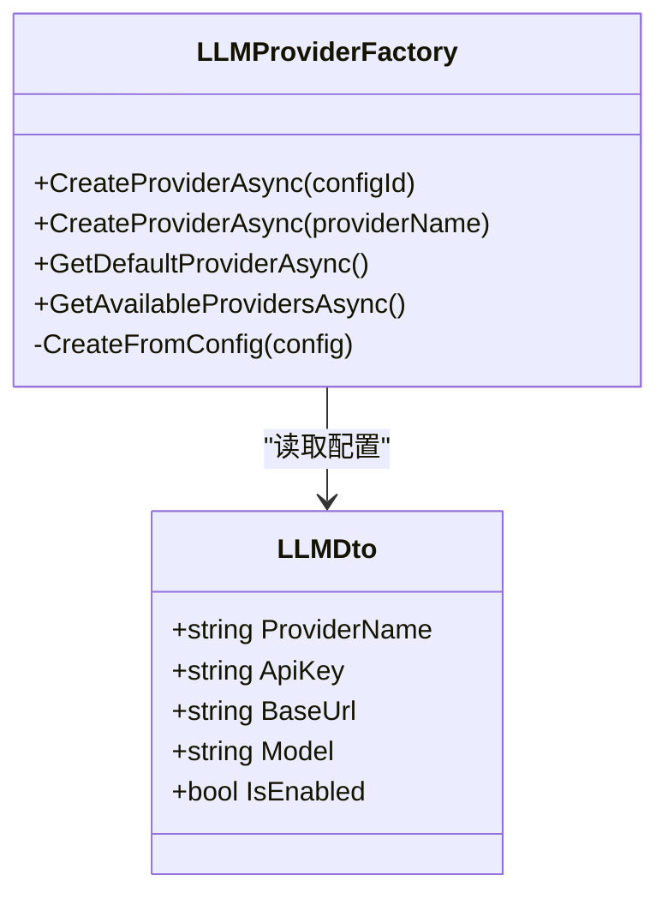
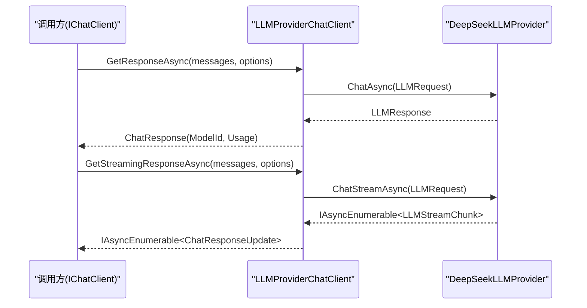
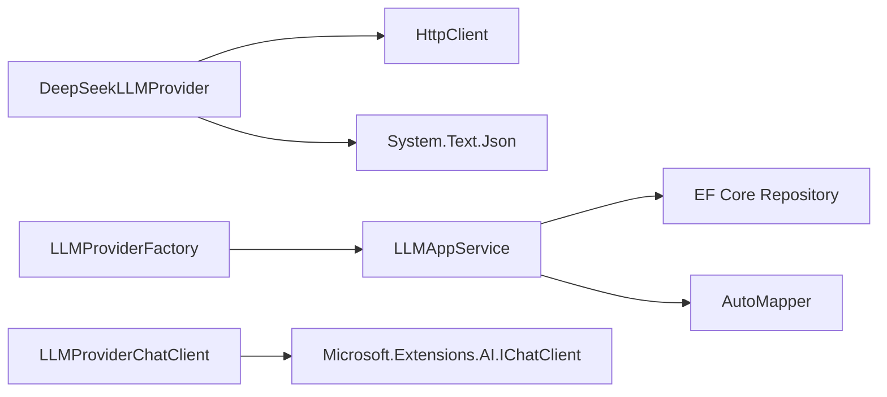

# DeepSeek集成

<cite>
**本文引用的文件**   
- [DeepSeekLLMProvider.cs](file://src/Agent/Assistant/H.Assistant.Core/LLM/Providers/DeepSeekLLMProvider.cs)
- [ILLMProvider.cs](file://src/Agent/Assistant/H.Assistant.Core/LLM/ILLMProvider.cs)
- [LLMRequest.cs](file://src/Agent/Assistant/H.Assistant.Core/LLM/LLMRequest.cs)
- [LLMResponse.cs](file://src/Agent/Assistant/H.Assistant.Core/LLM/LLMResponse.cs)
- [LLMStreamChunk.cs](file://src/Agent/Assistant/H.Assistant.Core/LLM/LLMStreamChunk.cs)
- [LLMProviderFactory.cs](file://src/Agent/Assistant/H.Assistant.Core/LLM/LLMProviderFactory.cs)
- [LLMProviderChatClient.cs](file://src/Agent/Assistant/H.Assistant.Core/Agents/LLMProviderChatClient.cs)
- [LLMAppService.cs](file://src/Agent/Assistant/H.Assistant.Application/Services/LLMAppService.cs)
- [20260604021506_Init.cs](file://src/Tools/H.Assistant.DbMigrator/Migrations/20260604021506_Init.cs)
</cite>

## 目录
1. [简介](#简介)
2. [项目结构](#项目结构)
3. [核心组件](#核心组件)
4. [架构总览](#架构总览)
5. [详细组件分析](#详细组件分析)
6. [依赖关系分析](#依赖关系分析)
7. [性能考虑](#性能考虑)
8. [故障排查指南](#故障排查指南)
9. [结论](#结论)
10. [附录](#附录)

## 简介
本文件面向在系统中集成 DeepSeek AI 服务提供商的开发者，围绕 DeepSeekLLMProvider 的实现细节与 API 调用方式展开，涵盖认证机制、请求参数处理、响应数据解析、流式对话原理与消息格式转换、配置与使用示例、错误处理与重试策略，以及性能调优与最佳实践。文档基于仓库中现有实现进行说明，确保内容与实际代码一致。

## 项目结构
与 DeepSeek 集成相关的核心代码位于 Assistant 模块的 Core 层与应用服务层：
- Core 层提供统一的 LLM Provider 接口、请求/响应模型、流式 chunk 定义、Provider 工厂与适配客户端。
- Application 层提供 LLM 配置的 CRUD 服务，供上层通过配置驱动 Provider 实例化。
- 数据库迁移脚本定义了 LLM 配置表结构，包含 ProviderName、ApiKey、BaseUrl、Model、Temperature、MaxTokens、TimeoutSeconds 等字段。

图表来源
- [DeepSeekLLMProvider.cs:1-228](file://src/Agent/Assistant/H.Assistant.Core/LLM/Providers/DeepSeekLLMProvider.cs#L1-L228)
- [ILLMProvider.cs:1-23](file://src/Agent/Assistant/H.Assistant.Core/LLM/ILLMProvider.cs#L1-L23)
- [LLMRequest.cs:1-58](file://src/Agent/Assistant/H.Assistant.Core/LLM/LLMRequest.cs#L1-L58)
- [LLMResponse.cs:1-29](file://src/Agent/Assistant/H.Assistant.Core/LLM/LLMResponse.cs#L1-L29)
- [LLMStreamChunk.cs:1-34](file://src/Agent/Assistant/H.Assistant.Core/LLM/LLMStreamChunk.cs#L1-L34)
- [LLMProviderFactory.cs:1-72](file://src/Agent/Assistant/H.Assistant.Core/LLM/LLMProviderFactory.cs#L1-L72)
- [LLMProviderChatClient.cs:1-78](file://src/Agent/Assistant/H.Assistant.Core/Agents/LLMProviderChatClient.cs#L1-L78)
- [LLMAppService.cs:1-128](file://src/Agent/Assistant/H.Assistant.Application/Services/LLMAppService.cs#L1-L128)
- [20260604021506_Init.cs:45-84](file://src/Tools/H.Assistant.DbMigrator/Migrations/20260604021506_Init.cs#L45-L84)

章节来源
- [DeepSeekLLMProvider.cs:1-228](file://src/Agent/Assistant/H.Assistant.Core/LLM/Providers/DeepSeekLLMProvider.cs#L1-L228)
- [LLMProviderFactory.cs:1-72](file://src/Agent/Assistant/H.Assistant.Core/LLM/LLMProviderFactory.cs#L1-L72)
- [LLMAppService.cs:1-128](file://src/Agent/Assistant/H.Assistant.Application/Services/LLMAppService.cs#L1-L128)
- [20260604021506_Init.cs:45-84](file://src/Tools/H.Assistant.DbMigrator/Migrations/20260604021506_Init.cs#L45-L84)

## 核心组件
- ILLMProvider：统一抽象，定义 ProviderName、同步聊天 ChatAsync、流式聊天 ChatStreamAsync。
- DeepSeekLLMProvider：基于 HTTP 的 DeepSeek 实现，负责鉴权（Bearer）、构建请求体、发送请求、解析响应与 SSE 流式增量。
- LLMRequest/LLMResponse/LLMStreamChunk：标准请求/响应/流式数据结构，支持工具调用（tool_calls）与增量。
- LLMProviderFactory：根据配置（ProviderName、ApiKey、BaseUrl、Model）创建具体 Provider 实例。
- LLMProviderChatClient：将 ILLMProvider 包装为 Microsoft.Extensions.AI 的 IChatClient，便于上层以统一方式调用。
- LLMAppService：对 LLM 配置进行增删改查，支持设置默认 Provider。

章节来源
- [ILLMProvider.cs:1-23](file://src/Agent/Assistant/H.Assistant.Core/LLM/ILLMProvider.cs#L1-L23)
- [DeepSeekLLMProvider.cs:1-228](file://src/Agent/Assistant/H.Assistant.Core/LLM/Providers/DeepSeekLLMProvider.cs#L1-L228)
- [LLMRequest.cs:1-58](file://src/Agent/Assistant/H.Assistant.Core/LLM/LLMRequest.cs#L1-L58)
- [LLMResponse.cs:1-29](file://src/Agent/Assistant/H.Assistant.Core/LLM/LLMResponse.cs#L1-L29)
- [LLMStreamChunk.cs:1-34](file://src/Agent/Assistant/H.Assistant.Core/LLM/LLMStreamChunk.cs#L1-L34)
- [LLMProviderFactory.cs:1-72](file://src/Agent/Assistant/H.Assistant.Core/LLM/LLMProviderFactory.cs#L1-L72)
- [LLMProviderChatClient.cs:1-78](file://src/Agent/Assistant/H.Assistant.Core/Agents/LLMProviderChatClient.cs#L1-L78)
- [LLMAppService.cs:1-128](file://src/Agent/Assistant/H.Assistant.Application/Services/LLMAppService.cs#L1-L128)

## 架构总览
下图展示了从应用层到 DeepSeek Provider 的完整调用链路，包括配置获取、Provider 实例化、HTTP 请求与流式响应处理。

图表来源
- [LLMProviderFactory.cs:1-72](file://src/Agent/Assistant/H.Assistant.Core/LLM/LLMProviderFactory.cs#L1-L72)
- [DeepSeekLLMProvider.cs:1-228](file://src/Agent/Assistant/H.Assistant.Core/LLM/Providers/DeepSeekLLMProvider.cs#L1-L228)
- [LLMAppService.cs:1-128](file://src/Agent/Assistant/H.Assistant.Application/Services/LLMAppService.cs#L1-L128)

## 详细组件分析

### DeepSeekLLMProvider 实现要点
- 认证机制
  - 构造时设置 Authorization 头为 Bearer {ApiKey}。
  - BaseAddress 自动补齐末尾斜杠，避免相对路径拼接问题。
- 请求构建
  - BuildPayload 组装 model、messages、temperature、max_tokens、stream、tools 等字段。
  - 非流式请求包含 temperature 与 max_tokens；流式请求设置 stream=true。
- 非流式响应解析
  - 读取 JSON 响应，提取 choices[0].message.content、model、usage.total_tokens、tool_calls。
- 流式响应处理
  - 使用 ResponseHeadersRead 立即返回响应头，逐行读取 data: JSON 片段。
  - 解析 delta.content、delta.tool_calls（函数名与参数增量），封装为 LLMStreamChunk 并 yield。
- 错误处理
  - 非成功状态码时读取错误体并抛出 HttpRequestException，包含状态码与错误信息。

图表来源
- [DeepSeekLLMProvider.cs:54-110](file://src/Agent/Assistant/H.Assistant.Core/LLM/Providers/DeepSeekLLMProvider.cs#L54-L110)

章节来源
- [DeepSeekLLMProvider.cs:1-228](file://src/Agent/Assistant/H.Assistant.Core/LLM/Providers/DeepSeekLLMProvider.cs#L1-L228)

### LLMProviderFactory 与配置驱动
- 根据配置 ID 或 ProviderName 获取配置，校验 IsEnabled 与 ApiKey 后创建对应 Provider。
- 支持 deepseek、bailian 等 Provider 名称映射。
- 提供 GetDefaultProviderAsync 与 GetAvailableProvidersAsync 方法。

图表来源
- [LLMProviderFactory.cs:1-72](file://src/Agent/Assistant/H.Assistant.Core/LLM/LLMProviderFactory.cs#L1-L72)

章节来源
- [LLMProviderFactory.cs:1-72](file://src/Agent/Assistant/H.Assistant.Core/LLM/LLMProviderFactory.cs#L1-L72)

### LLMProviderChatClient 适配 IChatClient
- 将 Microsoft.Extensions.AI 的 ChatMessage 转换为内部 Message，再构造 LLMRequest。
- 非流式调用 ChatAsync，返回 ChatResponse（含 ModelId、Usage）。
- 流式调用 ChatStreamAsync，将 LLMStreamChunk.Content 转为 ChatResponseUpdate 增量推送。

图表来源
- [LLMProviderChatClient.cs:1-78](file://src/Agent/Assistant/H.Assistant.Core/Agents/LLMProviderChatClient.cs#L1-L78)
- [DeepSeekLLMProvider.cs:29-110](file://src/Agent/Assistant/H.Assistant.Core/LLM/Providers/DeepSeekLLMProvider.cs#L29-L110)

章节来源
- [LLMProviderChatClient.cs:1-78](file://src/Agent/Assistant/H.Assistant.Core/Agents/LLMProviderChatClient.cs#L1-L78)

### 数据模型与消息格式
- Message：role（system/user/assistant/tool）、content、tool_calls、tool_call_id。
- ToolDefinition/FunctionDefinition：描述工具函数签名与参数。
- LLMRequest：model、messages、temperature、max_tokens、tools。
- LLMResponse：content、model、usageTokens、toolCalls。
- LLMStreamChunk：content、toolCallDelta、finishReason。

章节来源
- [LLMRequest.cs:1-58](file://src/Agent/Assistant/H.Assistant.Core/LLM/LLMRequest.cs#L1-L58)
- [LLMResponse.cs:1-29](file://src/Agent/Assistant/H.Assistant.Core/LLM/LLMResponse.cs#L1-L29)
- [LLMStreamChunk.cs:1-34](file://src/Agent/Assistant/H.Assistant.Core/LLM/LLMStreamChunk.cs#L1-L34)

### 配置与数据库
- LLM 配置表包含 ProviderName、ProviderDisplayName、ApiKey、ApiSecret、BaseUrl、Model、IsEnabled、IsDefault、MaxTokens、Temperature、TimeoutSeconds、ExtraConfig 等字段。
- LLMAppService 提供 GetAll、GetConfig、GetDefault、Create、Update、Delete、SetDefault 等方法。

章节来源
- [20260604021506_Init.cs:45-84](file://src/Tools/H.Assistant.DbMigrator/Migrations/20260604021506_Init.cs#L45-L84)
- [LLMAppService.cs:1-128](file://src/Agent/Assistant/H.Assistant.Application/Services/LLMAppService.cs#L1-L128)

## 依赖关系分析
- DeepSeekLLMProvider 依赖 HttpClient 与 System.Text.Json 进行 HTTP 通信与 JSON 序列化。
- LLMProviderFactory 依赖 ILLMAppService 获取配置。
- LLMProviderChatClient 依赖 Microsoft.Extensions.AI 的 IChatClient 接口，向上层屏蔽底层 Provider 差异。
- LLMAppService 依赖 EF Core Repository 与 AutoMapper 进行实体与 DTO 映射。

图表来源
- [DeepSeekLLMProvider.cs:1-228](file://src/Agent/Assistant/H.Assistant.Core/LLM/Providers/DeepSeekLLMProvider.cs#L1-L228)
- [LLMProviderFactory.cs:1-72](file://src/Agent/Assistant/H.Assistant.Core/LLM/LLMProviderFactory.cs#L1-L72)
- [LLMProviderChatClient.cs:1-78](file://src/Agent/Assistant/H.Assistant.Core/Agents/LLMProviderChatClient.cs#L1-L78)
- [LLMAppService.cs:1-128](file://src/Agent/Assistant/H.Assistant.Application/Services/LLMAppService.cs#L1-L128)

章节来源
- [DeepSeekLLMProvider.cs:1-228](file://src/Agent/Assistant/H.Assistant.Core/LLM/Providers/DeepSeekLLMProvider.cs#L1-L228)
- [LLMProviderFactory.cs:1-72](file://src/Agent/Assistant/H.Assistant.Core/LLM/LLMProviderFactory.cs#L1-L72)
- [LLMProviderChatClient.cs:1-78](file://src/Agent/Assistant/H.Assistant.Core/Agents/LLMProviderChatClient.cs#L1-L78)
- [LLMAppService.cs:1-128](file://src/Agent/Assistant/H.Assistant.Application/Services/LLMAppService.cs#L1-L128)

## 性能考虑
- 连接复用
  - 当前实现为每个 Provider 实例创建独立 HttpClient。建议在宿主中通过 IHttpClientFactory 注册命名 HttpClient，减少端口耗尽与连接开销。
- 超时与并发
  - 配置表中包含 TimeoutSeconds，可在 HttpClient 层面设置超时；合理控制并发请求数，避免上游限流。
- 流式传输
  - 使用 ResponseHeadersRead 与逐行读取 SSE，降低首字节延迟；注意在客户端侧及时消费增量，避免背压。
- 序列化与内存
  - 流式解析采用逐行读取与按需反序列化，减少大对象驻留；对于大量 tool_calls 增量，建议在上层做合并与去重。
- 缓存与降级
  - 对频繁使用的系统提示词与工具定义可缓存；当上游不可用时，提供降级策略（如切换至其他 Provider 或返回兜底回复）。

## 故障排查指南
- 认证失败
  - 检查 ApiKey 是否正确传入并在构造时设置为 Authorization: Bearer。
  - 确认 BaseUrl 正确且以“/”结尾，避免相对路径拼接错误。
- 网络与超时
  - 检查网络连通性与防火墙策略；适当增大 TimeoutSeconds。
- 响应解析异常
  - 确认上游返回 JSON 结构与字段名一致（choices、message、usage.total_tokens、tool_calls）。
  - 流式场景下检查 data: 前缀与 [DONE] 终止条件。
- 工具调用
  - 非流式：检查 response.choices[0].message.tool_calls 是否存在。
  - 流式：检查 delta.tool_calls 的 index、id、function.name、function.arguments 增量是否正确累积。

章节来源
- [DeepSeekLLMProvider.cs:29-110](file://src/Agent/Assistant/H.Assistant.Core/LLM/Providers/DeepSeekLLMProvider.cs#L29-L110)

## 结论
DeepSeekLLMProvider 提供了标准化的 LLM Provider 实现，支持同步与流式对话、工具调用增量、以及基于 Bearer 的认证。通过 LLMProviderFactory 与 LLMAppService，系统能够以配置驱动的方式动态选择与实例化 Provider。结合 IChatClient 适配，上层可以以统一接口调用不同后端。在生产环境中，建议优化 HttpClient 生命周期、完善超时与重试策略、加强错误日志与监控，以提升稳定性与性能。

## 附录

### 配置与使用示例（步骤）
- 配置 DeepSeek Provider
  - 在数据库中新增 LLM 配置记录，填写 ProviderName=deepseek、ApiKey、BaseUrl、Model、Temperature、MaxTokens、TimeoutSeconds 等。
  - 可通过 LLMAppService 的 CreateAsync/SetDefaultAsync 完成配置与默认设置。
- 获取 Provider
  - 使用 LLMProviderFactory.GetDefaultProviderAsync 或 CreateProviderAsync(providerName)。
- 同步调用
  - 通过 ILLMProvider.ChatAsync 发送 LLMRequest，获取 LLMResponse（Content、Model、UsageTokens、ToolCalls）。
- 流式调用
  - 通过 ILLMProvider.ChatStreamAsync 迭代 LLMStreamChunk，聚合 Content 与 ToolCallDelta。
- 使用 IChatClient 调用
  - 通过 LLMProviderChatClient 包装 Provider，调用 GetResponseAsync 或 GetStreamingResponseAsync。

章节来源
- [LLMAppService.cs:1-128](file://src/Agent/Assistant/H.Assistant.Application/Services/LLMAppService.cs#L1-L128)
- [LLMProviderFactory.cs:1-72](file://src/Agent/Assistant/H.Assistant.Core/LLM/LLMProviderFactory.cs#L1-L72)
- [LLMProviderChatClient.cs:1-78](file://src/Agent/Assistant/H.Assistant.Core/Agents/LLMProviderChatClient.cs#L1-L78)
- [DeepSeekLLMProvider.cs:1-228](file://src/Agent/Assistant/H.Assistant.Core/LLM/Providers/DeepSeekLLMProvider.cs#L1-L228)