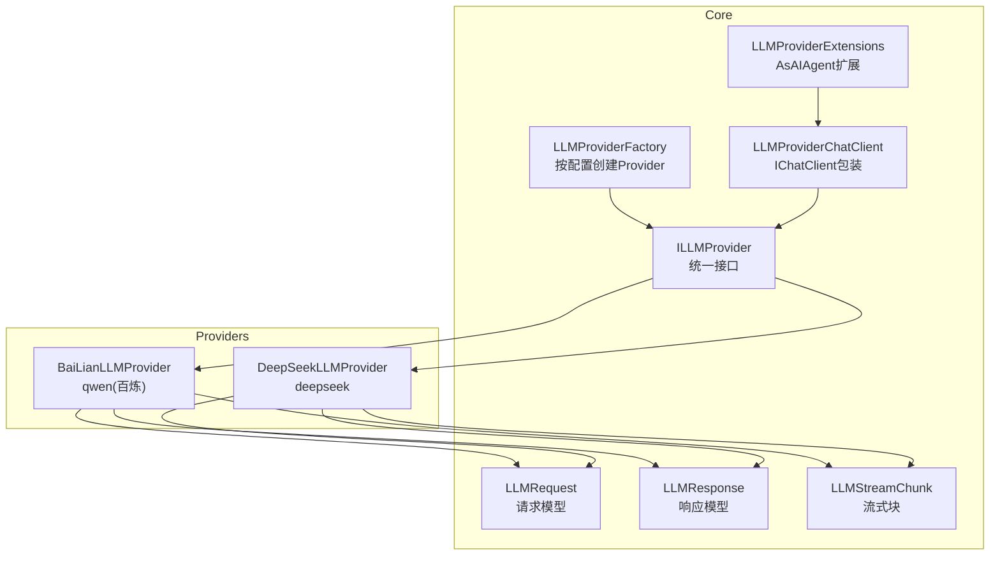
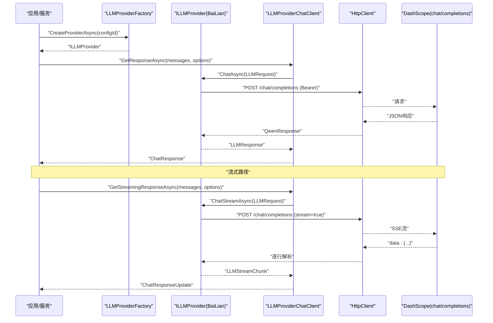
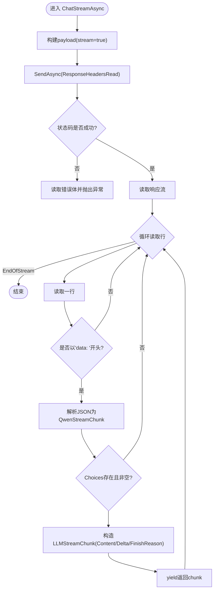
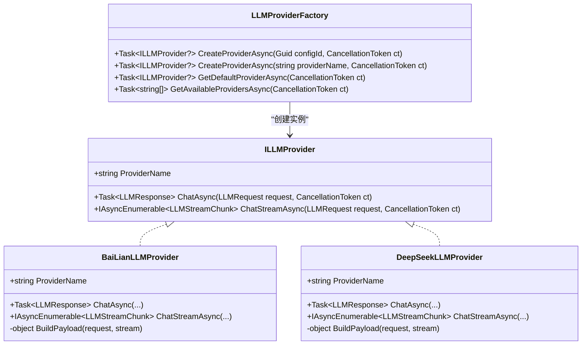
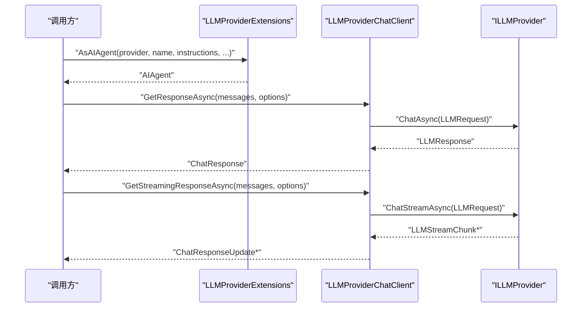
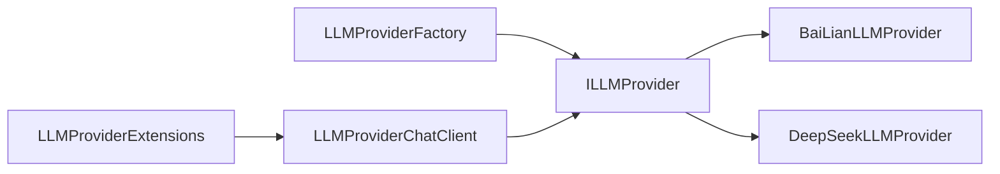

# 百度文心集成

<cite>
**本文引用的文件**   
- [BaiLianLLMProvider.cs](file://src/Agent/Assistant/H.Assistant.Core/LLM/Providers/BaiLianLLMProvider.cs)
- [ILLMProvider.cs](file://src/Agent/Assistant/H.Assistant.Core/LLM/ILLMProvider.cs)
- [LLMRequest.cs](file://src/Agent/Assistant/H.Assistant.Core/LLM/LLMRequest.cs)
- [LLMResponse.cs](file://src/Agent/Assistant/H.Assistant.Core/LLM/LLMResponse.cs)
- [LLMStreamChunk.cs](file://src/Agent/Assistant/H.Assistant.Core/LLM/LLMStreamChunk.cs)
- [LLMProviderFactory.cs](file://src/Agent/Assistant/H.Assistant.Core/LLM/LLMProviderFactory.cs)
- [LLMProviderChatClient.cs](file://src/Agent/Assistant/H.Assistant.Core/Agents/LLMProviderChatClient.cs)
- [LLMProviderExtensions.cs](file://src/Agent/Assistant/H.Assistant.Core/Agents/LLMProviderExtensions.cs)
- [DeepSeekLLMProvider.cs](file://src/Agent/Assistant/H.Assistant.Core/LLM/Providers/DeepSeekLLMProvider.cs)
</cite>

## 目录
1. [简介](#简介)
2. [项目结构](#项目结构)
3. [核心组件](#核心组件)
4. [架构总览](#架构总览)
5. [详细组件分析](#详细组件分析)
6. [依赖关系分析](#依赖关系分析)
7. [性能考虑](#性能考虑)
8. [故障排查指南](#故障排查指南)
9. [结论](#结论)
10. [附录](#附录)

## 简介
本文件面向“百度文心AI服务提供商”的集成与使用，重点说明 BaiLianLLMProvider 的实现原理、API调用方式、认证配置、请求格式转换与响应处理。文档还涵盖流式响应的实现机制、错误处理策略、统一LLM接口的集成方式（Microsoft.Extensions.AI）以及性能优化技巧，并提供常见问题的排查方法与故障恢复建议。

注意：仓库中实际实现的 Provider 名称为“qwen”，对应阿里云百炼（DashScope）OpenAI兼容接口；若需对接“百度文心”，可参考相同模式新增 Provider 实现。

## 项目结构
围绕 LLM 提供商的核心代码位于 H.Assistant.Core 模块下，包含统一的 Provider 接口、请求/响应模型、流式数据模型、工厂类以及将 Provider 适配到 Microsoft Agent Framework 的包装器。

图表来源
- [ILLMProvider.cs:1-23](file://src/Agent/Assistant/H.Assistant.Core/LLM/ILLMProvider.cs#L1-L23)
- [LLMProviderFactory.cs:1-72](file://src/Agent/Assistant/H.Assistant.Core/LLM/LLMProviderFactory.cs#L1-L72)
- [LLMRequest.cs:1-58](file://src/Agent/Assistant/H.Assistant.Core/LLM/LLMRequest.cs#L1-L58)
- [LLMResponse.cs:1-29](file://src/Agent/Assistant/H.Assistant.Core/LLM/LLMResponse.cs#L1-L29)
- [LLMStreamChunk.cs:1-34](file://src/Agent/Assistant/H.Assistant.Core/LLM/LLMStreamChunk.cs#L1-L34)
- [LLMProviderChatClient.cs:1-78](file://src/Agent/Assistant/H.Assistant.Core/Agents/LLMProviderChatClient.cs#L1-L78)
- [LLMProviderExtensions.cs:1-44](file://src/Agent/Assistant/H.Assistant.Core/Agents/LLMProviderExtensions.cs#L1-L44)
- [BaiLianLLMProvider.cs:1-228](file://src/Agent/Assistant/H.Assistant.Core/LLM/Providers/BaiLianLLMProvider.cs#L1-L228)
- [DeepSeekLLMProvider.cs:1-228](file://src/Agent/Assistant/H.Assistant.Core/LLM/Providers/DeepSeekLLMProvider.cs#L1-L228)

章节来源
- [ILLMProvider.cs:1-23](file://src/Agent/Assistant/H.Assistant.Core/LLM/ILLMProvider.cs#L1-L23)
- [LLMProviderFactory.cs:1-72](file://src/Agent/Assistant/H.Assistant.Core/LLM/LLMProviderFactory.cs#L1-L72)
- [BaiLianLLMProvider.cs:1-228](file://src/Agent/Assistant/H.Assistant.Core/LLM/Providers/BaiLianLLMProvider.cs#L1-L228)
- [DeepSeekLLMProvider.cs:1-228](file://src/Agent/Assistant/H.Assistant.Core/LLM/Providers/DeepSeekLLMProvider.cs#L1-L228)

## 核心组件
- ILLMProvider：定义统一的对话接口（同步与流式），暴露 ProviderName。
- LLMRequest/LLMResponse/LLMStreamChunk：标准化请求、响应与流式增量数据结构，支持 tool_calls 与工具参数增量。
- BaiLianLLMProvider：基于 OpenAI 兼容的 chat/completions 端点实现同步与流式调用，自动注入 Authorization Bearer Token，并构建 payload。
- LLMProviderFactory：根据配置（ProviderName、ApiKey、BaseUrl、Model）动态创建具体 Provider。
- LLMProviderChatClient：将 ILLMProvider 适配为 Microsoft.Extensions.AI 的 IChatClient，便于上层框架统一调用。
- LLMProviderExtensions：提供 AsAIAgent 扩展，将 Provider 直接转换为 AIAgent，支持指令、温度、最大输出长度与工具。

章节来源
- [ILLMProvider.cs:1-23](file://src/Agent/Assistant/H.Assistant.Core/LLM/ILLMProvider.cs#L1-L23)
- [LLMRequest.cs:1-58](file://src/Agent/Assistant/H.Assistant.Core/LLM/LLMRequest.cs#L1-L58)
- [LLMResponse.cs:1-29](file://src/Agent/Assistant/H.Assistant.Core/LLM/LLMResponse.cs#L1-L29)
- [LLMStreamChunk.cs:1-34](file://src/Agent/Assistant/H.Assistant.Core/LLM/LLMStreamChunk.cs#L1-L34)
- [LLMProviderFactory.cs:1-72](file://src/Agent/Assistant/H.Assistant.Core/LLM/LLMProviderFactory.cs#L1-L72)
- [LLMProviderChatClient.cs:1-78](file://src/Agent/Assistant/H.Assistant.Core/Agents/LLMProviderChatClient.cs#L1-L78)
- [LLMProviderExtensions.cs:1-44](file://src/Agent/Assistant/H.Assistant.Core/Agents/LLMProviderExtensions.cs#L1-L44)

## 架构总览
下图展示了从应用层到 Provider 的完整调用链路，包括同步与流式两种路径，以及与 Microsoft Agent Framework 的集成。

图表来源
- [LLMProviderFactory.cs:1-72](file://src/Agent/Assistant/H.Assistant.Core/LLM/LLMProviderFactory.cs#L1-L72)
- [LLMProviderChatClient.cs:1-78](file://src/Agent/Assistant/H.Assistant.Core/Agents/LLMProviderChatClient.cs#L1-L78)
- [BaiLianLLMProvider.cs:1-228](file://src/Agent/Assistant/H.Assistant.Core/LLM/Providers/BaiLianLLMProvider.cs#L1-L228)

## 详细组件分析

### BaiLianLLMProvider 实现原理
- 认证配置：在构造时设置 Authorization: Bearer {apiKey}，并初始化 BaseAddress（确保以“/”结尾）。
- 请求构建：BuildPayload 将 LLMRequest 映射为 OpenAI 兼容 JSON，包含 model、messages、temperature、max_tokens 或 stream=true，可选 tools。
- 同步调用：PostAsJsonAsync 发送请求，解析 QwenResponse，提取 content、model、usage.total_tokens、tool_calls。
- 流式调用：SendAsync + ResponseHeadersRead 读取 SSE 流，逐行解析 data: 前缀，跳过 [DONE]，将 delta.content 与 finish_reason 封装为 LLMStreamChunk；同时解析 tool_calls 增量。
- 错误处理：非成功状态码时读取错误体并抛出 HttpRequestException，便于上层捕获与重试。

图表来源
- [BaiLianLLMProvider.cs:54-110](file://src/Agent/Assistant/H.Assistant.Core/LLM/Providers/BaiLianLLMProvider.cs#L54-L110)

章节来源
- [BaiLianLLMProvider.cs:1-228](file://src/Agent/Assistant/H.Assistant.Core/LLM/Providers/BaiLianLLMProvider.cs#L1-L228)

### 统一接口与工厂
- ILLMProvider：抽象出 ProviderName、ChatAsync、ChatStreamAsync，屏蔽不同后端差异。
- LLMProviderFactory：通过配置服务获取 LLMDto，按 ProviderName 实例化具体 Provider（如 bailian/deepseek），并校验 IsEnabled 与 ApiKey。

图表来源
- [ILLMProvider.cs:1-23](file://src/Agent/Assistant/H.Assistant.Core/LLM/ILLMProvider.cs#L1-L23)
- [BaiLianLLMProvider.cs:1-228](file://src/Agent/Assistant/H.Assistant.Core/LLM/Providers/BaiLianLLMProvider.cs#L1-L228)
- [DeepSeekLLMProvider.cs:1-228](file://src/Agent/Assistant/H.Assistant.Core/LLM/Providers/DeepSeekLLMProvider.cs#L1-L228)
- [LLMProviderFactory.cs:1-72](file://src/Agent/Assistant/H.Assistant.Core/LLM/LLMProviderFactory.cs#L1-L72)

章节来源
- [ILLMProvider.cs:1-23](file://src/Agent/Assistant/H.Assistant.Core/LLM/ILLMProvider.cs#L1-L23)
- [LLMProviderFactory.cs:1-72](file://src/Agent/Assistant/H.Assistant.Core/LLM/LLMProviderFactory.cs#L1-L72)

### 与统一LLM接口（Microsoft.Extensions.AI）集成
- LLMProviderChatClient：将 ILLMProvider 的请求/响应映射到 ChatMessage/ChatOptions/ChatResponse/ChatResponseUpdate，支持同步与流式。
- LLMProviderExtensions.AsAIAgent：将 Provider 包装为 AIAgent，支持 instructions、temperature、maxOutputTokens 与工具列表。

图表来源
- [LLMProviderChatClient.cs:1-78](file://src/Agent/Assistant/H.Assistant.Core/Agents/LLMProviderChatClient.cs#L1-L78)
- [LLMProviderExtensions.cs:1-44](file://src/Agent/Assistant/H.Assistant.Core/Agents/LLMProviderExtensions.cs#L1-L44)

章节来源
- [LLMProviderChatClient.cs:1-78](file://src/Agent/Assistant/H.Assistant.Core/Agents/LLMProviderChatClient.cs#L1-L78)
- [LLMProviderExtensions.cs:1-44](file://src/Agent/Assistant/H.Assistant.Core/Agents/LLMProviderExtensions.cs#L1-L44)

### 数据模型与复杂度
- Message/ToolDefinition/FunctionDefinition：描述对话消息与函数工具定义，序列化时忽略 null 字段。
- LLMRequest/LLMResponse：标准请求/响应，包含 temperature、max_tokens、usage 统计与 tool_calls。
- LLMStreamChunk：流式增量，支持文本与工具参数增量，finish_reason 指示完成原因。
- 时间复杂度：流式解析为 O(N)（N为SSE行数），内存占用低（逐行处理）。

章节来源
- [LLMRequest.cs:1-58](file://src/Agent/Assistant/H.Assistant.Core/LLM/LLMRequest.cs#L1-L58)
- [LLMResponse.cs:1-29](file://src/Agent/Assistant/H.Assistant.Core/LLM/LLMResponse.cs#L1-L29)
- [LLMStreamChunk.cs:1-34](file://src/Agent/Assistant/H.Assistant.Core/LLM/LLMStreamChunk.cs#L1-L34)

## 依赖关系分析
- 耦合度：Provider 仅依赖 HttpClient 与 JSON 序列化，解耦良好。
- 外部依赖：DashScope/OpenAI兼容接口（chat/completions），Authorization Bearer 认证。
- 潜在循环依赖：无。工厂与 Provider 单向依赖。
- 接口契约：ILLMProvider 定义了稳定的同步与流式契约，便于替换实现。

图表来源
- [LLMProviderFactory.cs:1-72](file://src/Agent/Assistant/H.Assistant.Core/LLM/LLMProviderFactory.cs#L1-L72)
- [ILLMProvider.cs:1-23](file://src/Agent/Assistant/H.Assistant.Core/LLM/ILLMProvider.cs#L1-L23)
- [LLMProviderChatClient.cs:1-78](file://src/Agent/Assistant/H.Assistant.Core/Agents/LLMProviderChatClient.cs#L1-L78)
- [LLMProviderExtensions.cs:1-44](file://src/Agent/Assistant/H.Assistant.Core/Agents/LLMProviderExtensions.cs#L1-L44)

章节来源
- [LLMProviderFactory.cs:1-72](file://src/Agent/Assistant/H.Assistant.Core/LLM/LLMProviderFactory.cs#L1-L72)
- [ILLMProvider.cs:1-23](file://src/Agent/Assistant/H.Assistant.Core/LLM/ILLMProvider.cs#L1-L23)

## 性能考虑
- 流式传输：使用 ResponseHeadersRead 与逐行读取，避免等待整个响应体，降低首字节延迟与内存占用。
- 连接复用：建议在生产环境复用 HttpClient 实例（当前实现每次构造新实例，可在工厂或服务层优化）。
- 并发控制：对高并发场景，结合线程池与取消令牌（CancellationToken）管理资源释放。
- 序列化开销：尽量复用 JSON 选项与对象池（可扩展优化）。

[本节为通用指导，不直接分析具体文件]

## 故障排查指南
- 认证失败：检查 Authorization 头是否正确注入（Bearer {apiKey}），确认 BaseUrl 末尾带“/”。
- 网络错误：捕获 HttpRequestException，查看状态码与错误体，必要时增加重试与退避策略。
- 流式中断：检查 EndOfStream 与取消令牌，确保客户端及时消费增量并处理 [DONE]。
- 工具调用异常：核对 ToolCalls 增量字段（Index、Id、FunctionName、ArgumentsDelta）拼接逻辑。
- 默认 Provider 不可用：确认配置 IsEnabled 与 ApiKey 非空，ProviderName 匹配工厂映射。

章节来源
- [BaiLianLLMProvider.cs:29-52](file://src/Agent/Assistant/H.Assistant.Core/LLM/Providers/BaiLianLLMProvider.cs#L29-L52)
- [BaiLianLLMProvider.cs:54-110](file://src/Agent/Assistant/H.Assistant.Core/LLM/Providers/BaiLianLLMProvider.cs#L54-L110)
- [LLMProviderFactory.cs:47-58](file://src/Agent/Assistant/H.Assistant.Core/LLM/LLMProviderFactory.cs#L47-L58)

## 结论
BaiLianLLMProvider 提供了稳定、清晰的 OpenAI 兼容调用能力，并通过 ILLMProvider 统一接口与工厂机制实现了多 Provider 的可插拔集成。借助 LLMProviderChatClient 与 AsAIAgent 扩展，系统无缝接入 Microsoft Agent Framework，支持同步与流式调用、工具调用与参数增量。生产环境中建议优化 HttpClient 生命周期、增加重试与监控，以提升稳定性与性能。

[本节为总结性内容，不直接分析具体文件]

## 附录

### 配置示例（字段说明）
- ProviderName：标识 Provider，如“bailian”、“deepseek”等。
- ApiKey：鉴权密钥，用于 Authorization Bearer。
- BaseUrl：服务端基础地址，确保以“/”结尾。
- Model：默认模型名。
- IsEnabled/IsDefault：启用与默认标记。
- Temperature/MaxTokens：生成参数（也可在请求时覆盖）。
- TimeoutSeconds/ExtraConfig：超时与扩展配置。

章节来源
- [LLMProviderFactory.cs:47-58](file://src/Agent/Assistant/H.Assistant.Core/LLM/LLMProviderFactory.cs#L47-L58)

### 使用步骤（概览）
- 注册/配置 Provider：通过配置服务保存 Provider 配置（ProviderName、ApiKey、BaseUrl、Model）。
- 创建 Provider：使用 LLMProviderFactory.CreateProviderAsync 获取 ILLMProvider。
- 同步调用：通过 LLMProviderChatClient.GetResponseAsync 或直接调用 Provider.ChatAsync。
- 流式调用：通过 LLMProviderChatClient.GetStreamingResponseAsync 或直接调用 Provider.ChatStreamAsync。
- 集成 AIAgent：使用 LLMProviderExtensions.AsAIAgent 将 Provider 转为 AIAgent，传入指令与工具。

章节来源
- [LLMProviderFactory.cs:1-72](file://src/Agent/Assistant/H.Assistant.Core/LLM/LLMProviderFactory.cs#L1-L72)
- [LLMProviderChatClient.cs:1-78](file://src/Agent/Assistant/H.Assistant.Core/Agents/LLMProviderChatClient.cs#L1-L78)
- [LLMProviderExtensions.cs:1-44](file://src/Agent/Assistant/H.Assistant.Core/Agents/LLMProviderExtensions.cs#L1-L44)

### 常见问题与修复
- 无法建立连接：检查网络连通性与 BaseUrl 正确性。
- 401 未授权：确认 ApiKey 有效且 Authorization 头已注入。
- 流式无输出：确认 stream=true 且客户端正确处理 data: 行与 [DONE]。
- 工具调用参数不完整：检查增量拼接逻辑与 Index 一致性。

章节来源
- [BaiLianLLMProvider.cs:29-52](file://src/Agent/Assistant/H.Assistant.Core/LLM/Providers/BaiLianLLMProvider.cs#L29-L52)
- [BaiLianLLMProvider.cs:54-110](file://src/Agent/Assistant/H.Assistant.Core/LLM/Providers/BaiLianLLMProvider.cs#L54-L110)