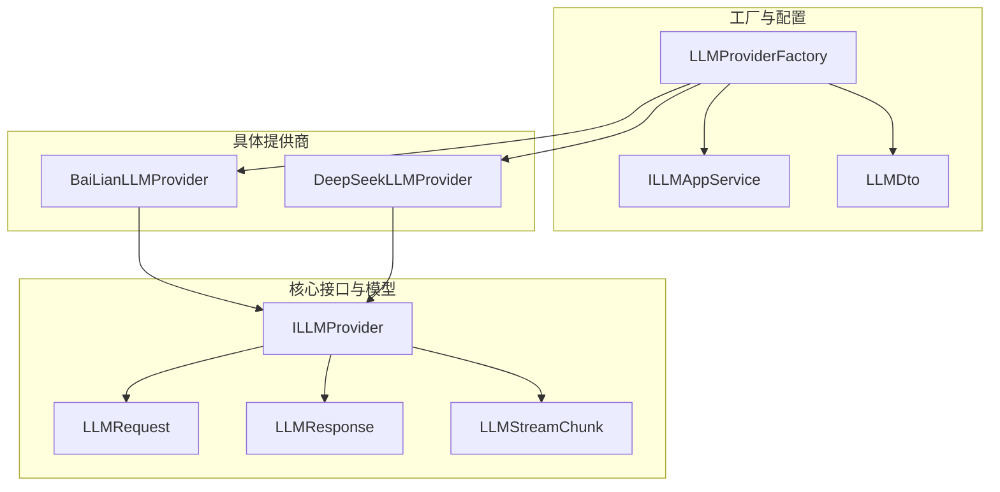
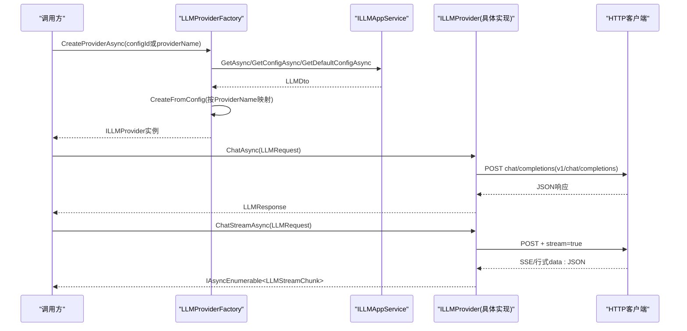
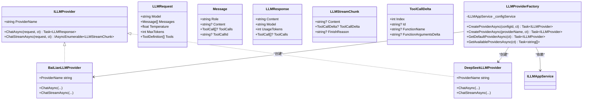
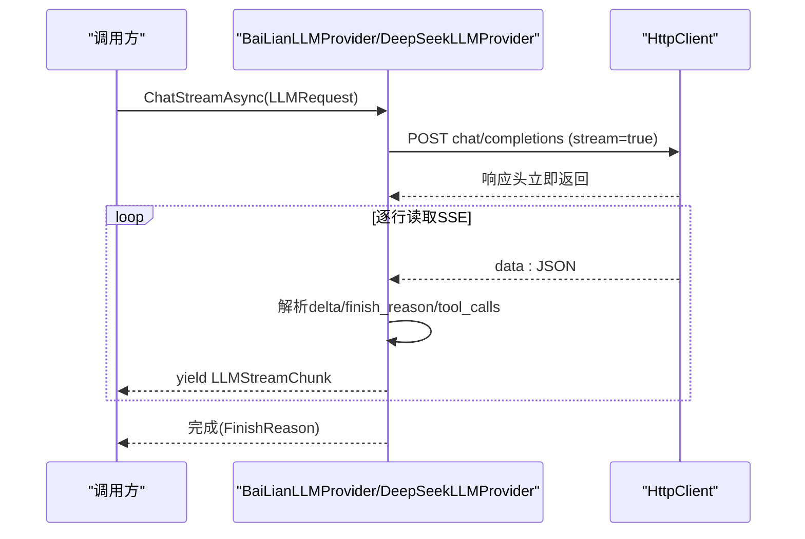
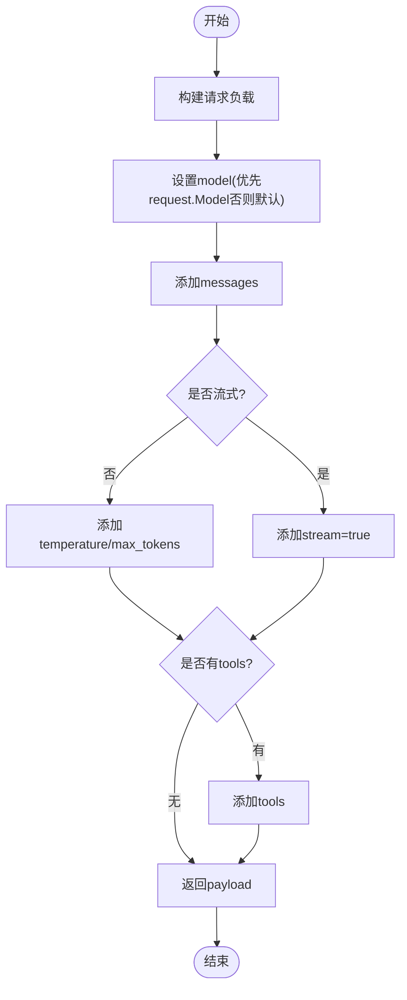
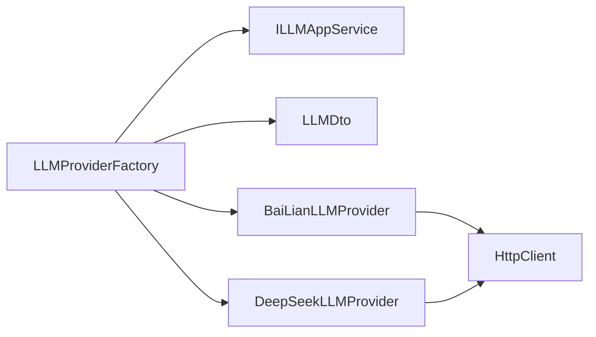

# 自定义提供商开发

<cite>
**本文档引用的文件**   
- [ILLMProvider.cs](file://src/Agent/Assistant/H.Assistant.Core/LLM/ILLMProvider.cs)
- [LLMRequest.cs](file://src/Agent/Assistant/H.Assistant.Core/LLM/LLMRequest.cs)
- [LLMResponse.cs](file://src/Agent/Assistant/H.Assistant.Core/LLM/LLMResponse.cs)
- [LLMStreamChunk.cs](file://src/Agent/Assistant/H.Assistant.Core/LLM/LLMStreamChunk.cs)
- [LLMProviderFactory.cs](file://src/Agent/Assistant/H.Assistant.Core/LLM/LLMProviderFactory.cs)
- [BaiLianLLMProvider.cs](file://src/Agent/Assistant/H.Assistant.Core/LLM/Providers/BaiLianLLMProvider.cs)
- [DeepSeekLLMProvider.cs](file://src/Agent/Assistant/H.Assistant.Core/LLM/Providers/DeepSeekLLMProvider.cs)
- [ILLMAppService.cs](file://src/Agent/Assistant/H.Assistant.Application.Contracts/Services/Llms/ILLMAppService.cs)
- [LLMDto.cs](file://src/Agent/Assistant/H.Assistant.Application.Contracts/Dtos/Llms/LLMDto.cs)
</cite>

## 目录
1. [简介](#简介)
2. [项目结构](#项目结构)
3. [核心组件](#核心组件)
4. [架构总览](#架构总览)
5. [详细组件分析](#详细组件分析)
6. [依赖关系分析](#依赖关系分析)
7. [性能考量](#性能考量)
8. [故障排查指南](#故障排查指南)
9. [结论](#结论)
10. [附录](#附录)

## 简介
本指南面向希望为系统接入自定义AI服务提供商的开发者。内容围绕 ILLMProvider 接口实现、LLMRequest/LLMResponse 数据结构设计、流式响应与工具调用（tool_calls）增量处理、认证配置、错误处理、性能优化以及测试验证等主题展开，提供从接口实现到工厂注册的全流程说明，并附带调试技巧与最佳实践。

## 项目结构
与自定义提供商相关的核心代码位于 H.Assistant.Core 的 LLM 模块中，包含统一接口、请求/响应模型、流式数据模型、工厂类以及若干具体提供商实现。配置服务接口与DTO位于 Application.Contracts 层，用于动态加载和创建 Provider。

图表来源
- [ILLMProvider.cs](file://src/Agent/Assistant/H.Assistant.Core/LLM/ILLMProvider.cs)
- [LLMRequest.cs](file://src/Agent/Assistant/H.Assistant.Core/LLM/LLMRequest.cs)
- [LLMResponse.cs](file://src/Agent/Assistant/H.Assistant.Core/LLM/LLMResponse.cs)
- [LLMStreamChunk.cs](file://src/Agent/Assistant/H.Assistant.Core/LLM/LLMStreamChunk.cs)
- [LLMProviderFactory.cs](file://src/Agent/Assistant/H.Assistant.Core/LLM/LLMProviderFactory.cs)
- [ILLMAppService.cs](file://src/Agent/Assistant/H.Assistant.Application.Contracts/Services/Llms/ILLMAppService.cs)
- [LLMDto.cs](file://src/Agent/Assistant/H.Assistant.Application.Contracts/Dtos/Llms/LLMDto.cs)
- [BaiLianLLMProvider.cs](file://src/Agent/Assistant/H.Assistant.Core/LLM/Providers/BaiLianLLMProvider.cs)
- [DeepSeekLLMProvider.cs](file://src/Agent/Assistant/H.Assistant.Core/LLM/Providers/DeepSeekLLMProvider.cs)

章节来源
- [ILLMProvider.cs](file://src/Agent/Assistant/H.Assistant.Core/LLM/ILLMProvider.cs)
- [LLMRequest.cs](file://src/Agent/Assistant/H.Assistant.Core/LLM/LLMRequest.cs)
- [LLMResponse.cs](file://src/Agent/Assistant/H.Assistant.Core/LLM/LLMResponse.cs)
- [LLMStreamChunk.cs](file://src/Agent/Assistant/H.Assistant.Core/LLM/LLMStreamChunk.cs)
- [LLMProviderFactory.cs](file://src/Agent/Assistant/H.Assistant.Core/LLM/LLMProviderFactory.cs)
- [ILLMAppService.cs](file://src/Agent/Assistant/H.Assistant.Application.Contracts/Services/Llms/ILLMAppService.cs)
- [LLMDto.cs](file://src/Agent/Assistant/H.Assistant.Application.Contracts/Dtos/Llms/LLMDto.cs)

## 核心组件
- ILLMProvider：统一抽象，定义 ProviderName、同步对话 ChatAsync(LLMRequest, CancellationToken)、流式对话 ChatStreamAsync(LLMRequest, CancellationToken)。
- LLMRequest：包含 Model、Messages、Temperature、MaxTokens、Tools；Message 支持 role/content/tool_calls/tool_call_id，兼容 OpenAI 协议的工具调用。
- LLMResponse：包含 Content、Model、UsageTokens、ToolCalls。
- LLMStreamChunk：流式 chunk，包含 Content、ToolCallDelta、FinishReason；ToolCallDelta 支持 Index、Id、FunctionName、FunctionArgumentsDelta 增量。
- LLMProviderFactory：根据配置（configId/providerName/default）创建具体 Provider，内部通过 LLMDto.ProviderName 映射到具体实现。
- ILLMAppService/LLMDto：配置服务接口与DTO，提供 GetAll/Get/GetConfig/GetDefault/Create/Update/Delete/SetDefault 等方法，供工厂读取配置。

章节来源
- [ILLMProvider.cs](file://src/Agent/Assistant/H.Assistant.Core/LLM/ILLMProvider.cs)
- [LLMRequest.cs](file://src/Agent/Assistant/H.Assistant.Core/LLM/LLMRequest.cs)
- [LLMResponse.cs](file://src/Agent/Assistant/H.Assistant.Core/LLM/LLMResponse.cs)
- [LLMStreamChunk.cs](file://src/Agent/Assistant/H.Assistant.Core/LLM/LLMStreamChunk.cs)
- [LLMProviderFactory.cs](file://src/Agent/Assistant/H.Assistant.Core/LLM/LLMProviderFactory.cs)
- [ILLMAppService.cs](file://src/Agent/Assistant/H.Assistant.Application.Contracts/Services/Llms/ILLMAppService.cs)
- [LLMDto.cs](file://src/Agent/Assistant/H.Assistant.Application.Contracts/Dtos/Llms/LLMDto.cs)

## 架构总览
下图展示了从上层调用到具体提供商的完整链路，包括配置获取、Provider 实例化、HTTP 请求与流式响应处理。

图表来源
- [LLMProviderFactory.cs](file://src/Agent/Assistant/H.Assistant.Core/LLM/LLMProviderFactory.cs)
- [ILLMAppService.cs](file://src/Agent/Assistant/H.Assistant.Application.Contracts/Services/Llms/ILLMAppService.cs)
- [BaiLianLLMProvider.cs](file://src/Agent/Assistant/H.Assistant.Core/LLM/Providers/BaiLianLLMProvider.cs)
- [DeepSeekLLMProvider.cs](file://src/Agent/Assistant/H.Assistant.Core/LLM/Providers/DeepSeekLLMProvider.cs)

## 详细组件分析

### ILLMProvider 接口规范
- ProviderName：唯一标识当前提供商名称，用于工厂映射与选择。
- ChatAsync(LLMRequest, CancellationToken)：同步对话，返回 LLMResponse。
- ChatStreamAsync(LLMRequest, CancellationToken)：流式对话，返回 IAsyncEnumerable<LLMStreamChunk>，需支持 tool_calls 增量。

章节来源
- [ILLMProvider.cs](file://src/Agent/Assistant/H.Assistant.Core/LLM/ILLMProvider.cs)

### LLMRequest 数据结构与扩展点
- Model：模型名称，若为空则使用默认模型。
- Messages：消息列表，role 可为 system/user/assistant/tool；content 为文本；assistant 可携带 tool_calls；tool 消息可携带 tool_call_id。
- Temperature/MaxTokens：采样参数与最大生成长度。
- Tools：函数定义列表，用于工具调用（OpenAI 协议兼容）。

扩展建议：
- 可在 Message 上增加可选字段以适配不同厂商的元数据（如 images/files 等），但需保持向后兼容。
- 在 LLMRequest 上增加 ExtraParameters 字典，便于透传厂商特有参数。

章节来源
- [LLMRequest.cs](file://src/Agent/Assistant/H.Assistant.Core/LLM/LLMRequest.cs)

### LLMResponse 数据结构与扩展点
- Content：最终生成的文本内容。
- Model：实际使用的模型名。
- UsageTokens：Token 用量统计。
- ToolCalls：工具调用列表（function name + arguments）。

扩展建议：
- 可增加 FinishReason、Usage 明细（prompt/completion tokens）等字段。
- 对 ToolCalls 增加更多元信息（如 index、id）以便流式拼接。

章节来源
- [LLMResponse.cs](file://src/Agent/Assistant/H.Assistant.Core/LLM/LLMResponse.cs)

### LLMStreamChunk 与 ToolCallDelta
- Content：文本增量。
- ToolCallDelta：工具调用增量，包含 Index、Id、FunctionName、FunctionArgumentsDelta。
- FinishReason：完成原因，如 stop 或 tool_calls。

章节来源
- [LLMStreamChunk.cs](file://src/Agent/Assistant/H.Assistant.Core/LLM/LLMStreamChunk.cs)

### LLMProviderFactory 工厂机制
- 支持按 configId、providerName、默认配置三种方式创建 Provider。
- CreateFromConfig 根据 LLMDto.ProviderName 映射到具体实现（如 bailian/deepseek）。
- GetAvailableProvidersAsync 返回所有启用的 Provider 名称。

章节来源
- [LLMProviderFactory.cs](file://src/Agent/Assistant/H.Assistant.Core/LLM/LLMProviderFactory.cs)
- [LLMDto.cs](file://src/Agent/Assistant/H.Assistant.Application.Contracts/Dtos/Llms/LLMDto.cs)

### 具体提供商实现示例

#### 阿里云百炼（BaiLianLLMProvider）
- ProviderName 固定为“qwen”。
- 同步调用：POST /chat/completions，解析 QwenResponse，构造 LLMResponse。
- 流式调用：POST /chat/completions + stream=true，逐行读取 data: JSON，解析 QwenStreamChunk，生成 LLMStreamChunk，支持 tool_calls 增量。
- 错误处理：非成功状态码时抛出 HttpRequestException，包含状态码与响应体。

章节来源
- [BaiLianLLMProvider.cs](file://src/Agent/Assistant/H.Assistant.Core/LLM/Providers/BaiLianLLMProvider.cs)

#### DeepSeek（DeepSeekLLMProvider）
- ProviderName 固定为“deepseek”。
- 同步调用：POST /v1/chat/completions，解析 DeepSeekResponse，构造 LLMResponse。
- 流式调用：POST /v1/chat/completions + stream=true，逐行读取 data: JSON，解析 DeepSeekStreamChunk，生成 LLMStreamChunk，支持 tool_calls 增量。
- 错误处理：非成功状态码时抛出 HttpRequestException，包含状态码与响应体。

章节来源
- [DeepSeekLLMProvider.cs](file://src/Agent/Assistant/H.Assistant.Core/LLM/Providers/DeepSeekLLMProvider.cs)

### 类图（代码级关系）

图表来源
- [ILLMProvider.cs](file://src/Agent/Assistant/H.Assistant.Core/LLM/ILLMProvider.cs)
- [LLMRequest.cs](file://src/Agent/Assistant/H.Assistant.Core/LLM/LLMRequest.cs)
- [LLMResponse.cs](file://src/Agent/Assistant/H.Assistant.Core/LLM/LLMResponse.cs)
- [LLMStreamChunk.cs](file://src/Agent/Assistant/H.Assistant.Core/LLM/LLMStreamChunk.cs)
- [LLMProviderFactory.cs](file://src/Agent/Assistant/H.Assistant.Core/LLM/LLMProviderFactory.cs)
- [BaiLianLLMProvider.cs](file://src/Agent/Assistant/H.Assistant.Core/LLM/Providers/BaiLianLLMProvider.cs)
- [DeepSeekLLMProvider.cs](file://src/Agent/Assistant/H.Assistant.Core/LLM/Providers/DeepSeekLLMProvider.cs)

### 序列图（流式调用流程）

图表来源
- [BaiLianLLMProvider.cs](file://src/Agent/Assistant/H.Assistant.Core/LLM/Providers/BaiLianLLMProvider.cs)
- [DeepSeekLLMProvider.cs](file://src/Agent/Assistant/H.Assistant.Core/LLM/Providers/DeepSeekLLMProvider.cs)

### 流程图（构建请求负载）

图表来源
- [BaiLianLLMProvider.cs](file://src/Agent/Assistant/H.Assistant.Core/LLM/Providers/BaiLianLLMProvider.cs)
- [DeepSeekLLMProvider.cs](file://src/Agent/Assistant/H.Assistant.Core/LLM/Providers/DeepSeekLLMProvider.cs)

## 依赖关系分析
- LLMProviderFactory 依赖 ILLMAppService 获取配置，再根据 LLMDto.ProviderName 映射到具体 Provider。
- 具体 Provider 依赖 HttpClient 发起HTTP请求，并解析各自API的响应结构。
- 配置 DTO（LLMDto）包含 ApiKey、BaseUrl、Model、IsEnabled、IsDefault 等关键配置项。

图表来源
- [LLMProviderFactory.cs](file://src/Agent/Assistant/H.Assistant.Core/LLM/LLMProviderFactory.cs)
- [ILLMAppService.cs](file://src/Agent/Assistant/H.Assistant.Application.Contracts/Services/Llms/ILLMAppService.cs)
- [LLMDto.cs](file://src/Agent/Assistant/H.Assistant.Application.Contracts/Dtos/Llms/LLMDto.cs)
- [BaiLianLLMProvider.cs](file://src/Agent/Assistant/H.Assistant.Core/LLM/Providers/BaiLianLLMProvider.cs)
- [DeepSeekLLMProvider.cs](file://src/Agent/Assistant/H.Assistant.Core/LLM/Providers/DeepSeekLLMProvider.cs)

章节来源
- [LLMProviderFactory.cs](file://src/Agent/Assistant/H.Assistant.Core/LLM/LLMProviderFactory.cs)
- [ILLMAppService.cs](file://src/Agent/Assistant/H.Assistant.Application.Contracts/Services/Llms/ILLMAppService.cs)
- [LLMDto.cs](file://src/Agent/Assistant/H.Assistant.Application.Contracts/Dtos/Llms/LLMDto.cs)

## 性能考量
- 流式响应：使用 ResponseHeadersRead 模式，收到响应头后立即返回，避免等待整个响应体，提升首字节延迟。
- 连接复用：在生产环境建议使用共享的 HttpClient 实例（通过 DI 注入），减少端口耗尽风险。
- 取消令牌：所有异步方法均支持 CancellationToken，确保超时与取消行为可控。
- Token 统计：合理设置 MaxTokens，避免过长输出导致内存与网络开销。
- 错误快速失败：对非成功状态码立即抛出异常，避免无效数据处理。

[本节为通用指导，不直接分析具体文件]

## 故障排查指南
- 认证失败：检查 ApiKey 是否正确设置，BaseAddress 是否以“/”结尾，确保相对路径拼接正确。
- 网络错误：关注 HttpRequestException 中的状态码与响应体，定位上游 API 错误。
- 流式中断：确认服务端是否持续推送 data: JSON，检查 EndOfStream 与 IsCancellationRequested。
- 工具调用不完整：核对 ToolCallDelta 的 Index、Id、FunctionName、FunctionArgumentsDelta 是否按序拼接。
- 配置问题：确认 LLMDto.IsEnabled、ApiKey、ProviderName 有效，且工厂映射存在对应实现。

章节来源
- [BaiLianLLMProvider.cs](file://src/Agent/Assistant/H.Assistant.Core/LLM/Providers/BaiLianLLMProvider.cs)
- [DeepSeekLLMProvider.cs](file://src/Agent/Assistant/H.Assistant.Core/LLM/Providers/DeepSeekLLMProvider.cs)
- [LLMProviderFactory.cs](file://src/Agent/Assistant/H.Assistant.Core/LLM/LLMProviderFactory.cs)

## 结论
通过统一的 ILLMProvider 接口与 LLMRequest/LLMResponse/LLMStreamChunk 数据结构，系统实现了多提供商的统一抽象与灵活扩展。结合 LLMProviderFactory 的动态创建机制与 ILLMAppService 的配置管理，开发者可以快速接入新的 AI 服务提供商，并在保证一致性的同时充分利用各厂商特性。遵循本文的最佳实践与调试技巧，可有效提升稳定性与性能。

[本节为总结性内容，不直接分析具体文件]

## 附录

### 自定义提供商开发步骤（从接口实现到工厂注册）
1. 新建类实现 ILLMProvider，定义 ProviderName 与两个方法（ChatAsync、ChatStreamAsync）。
2. 在构造函数中初始化 HttpClient，设置 Authorization 与 BaseAddress。
3. 实现 ChatAsync：构建请求负载，发送HTTP请求，解析响应为 LLMResponse。
4. 实现 ChatStreamAsync：使用流式传输，逐行解析 data: JSON，生成 LLMStreamChunk，支持 tool_calls 增量。
5. 在 LLMProviderFactory.CreateFromConfig 中添加新 ProviderName 的映射分支，指向你的实现类。
6. 通过 ILLMAppService 配置 LLMDto（ProviderName、ApiKey、BaseUrl、Model、IsEnabled、IsDefault）。
7. 使用 LLMProviderFactory 创建 Provider 实例并进行调用测试。

章节来源
- [ILLMProvider.cs](file://src/Agent/Assistant/H.Assistant.Core/LLM/ILLMProvider.cs)
- [LLMProviderFactory.cs](file://src/Agent/Assistant/H.Assistant.Core/LLM/LLMProviderFactory.cs)
- [ILLMAppService.cs](file://src/Agent/Assistant/H.Assistant.Application.Contracts/Services/Llms/ILLMAppService.cs)
- [LLMDto.cs](file://src/Agent/Assistant/H.Assistant.Application.Contracts/Dtos/Llms/LLMDto.cs)

### 认证配置与错误处理最佳实践
- 认证：在构造函数中将 ApiKey 设置为 Authorization Bearer 头，确保 BaseAddress 以“/”结尾。
- 错误处理：对非成功状态码抛出 HttpRequestException，包含状态码与响应体，便于上层捕获与展示。
- 超时与取消：所有异步方法接受 CancellationToken，并在循环中检查 IsCancellationRequested。

章节来源
- [BaiLianLLMProvider.cs](file://src/Agent/Assistant/H.Assistant.Core/LLM/Providers/BaiLianLLMProvider.cs)
- [DeepSeekLLMProvider.cs](file://src/Agent/Assistant/H.Assistant.Core/LLM/Providers/DeepSeekLLMProvider.cs)

### 流式响应与工具调用增量处理
- 流式：使用 IAsyncEnumerable<LLMStreamChunk> 逐步返回增量内容，提升用户体验。
- 工具调用：在 ToolCallDelta 中维护 Index、Id、FunctionName、FunctionArgumentsDelta，确保增量拼接正确。
- 完成原因：通过 FinishReason 判断是否结束（stop 或 tool_calls）。

章节来源
- [LLMStreamChunk.cs](file://src/Agent/Assistant/H.Assistant.Core/LLM/LLMStreamChunk.cs)
- [BaiLianLLMProvider.cs](file://src/Agent/Assistant/H.Assistant.Core/LLM/Providers/BaiLianLLMProvider.cs)
- [DeepSeekLLMProvider.cs](file://src/Agent/Assistant/H.Assistant.Core/LLM/Providers/DeepSeekLLMProvider.cs)

### 性能优化建议
- 使用共享 HttpClient（通过 DI 注入），避免频繁创建销毁。
- 合理设置 TimeoutSeconds（在 LLMDto 中），防止长时间阻塞。
- 控制 MaxTokens 与 Temperature，平衡质量与成本。
- 启用压缩（如 gzip）以减少网络传输开销（视上游 API 支持情况）。

[本节为通用指导，不直接分析具体文件]

### 测试与验证
- 单元测试：模拟 ILLMAppService 返回 LLMDto，验证工厂是否能正确创建 Provider。
- 集成测试：调用 ChatAsync 与 ChatStreamAsync，验证响应结构与流式增量。
- 错误场景：构造无效 ApiKey、错误 BaseUrl、超时等，验证异常处理逻辑。
- 工具调用：构造包含 Tools 的请求，验证 ToolCalls 与 ToolCallDelta 的正确性。

[本节为通用指导，不直接分析具体文件]