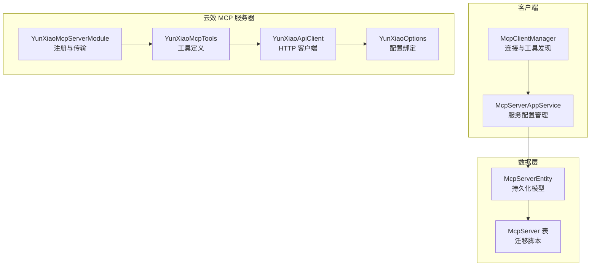
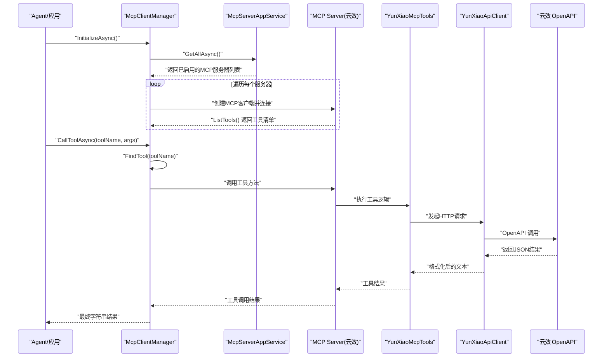
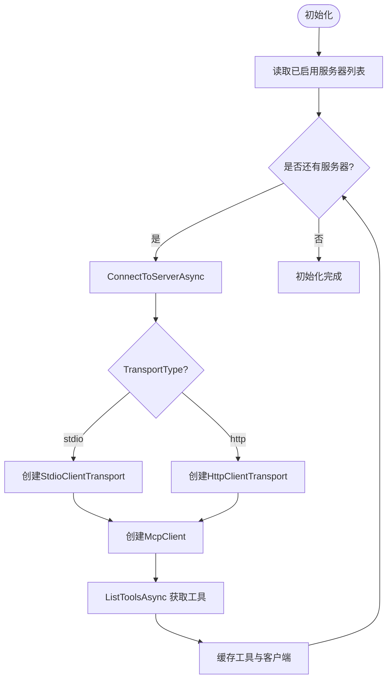
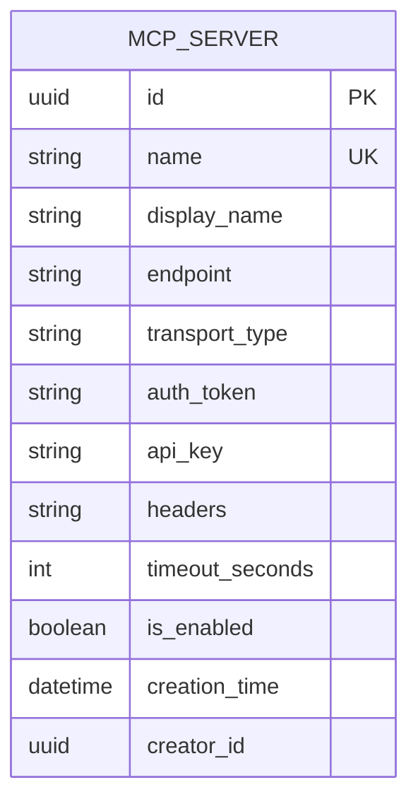
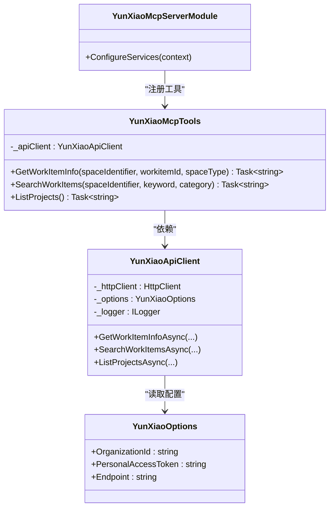
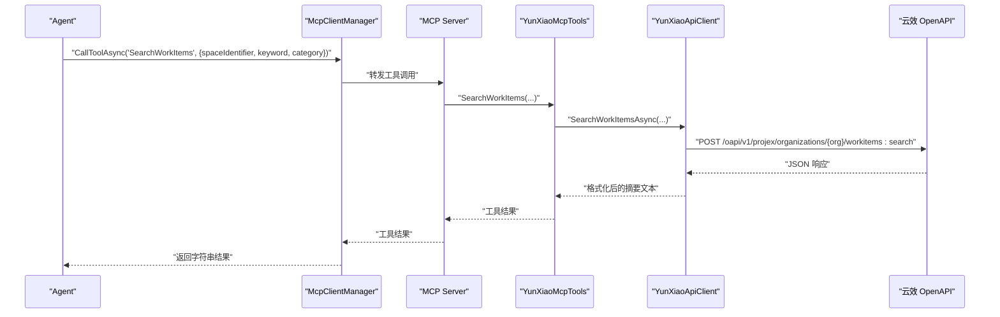
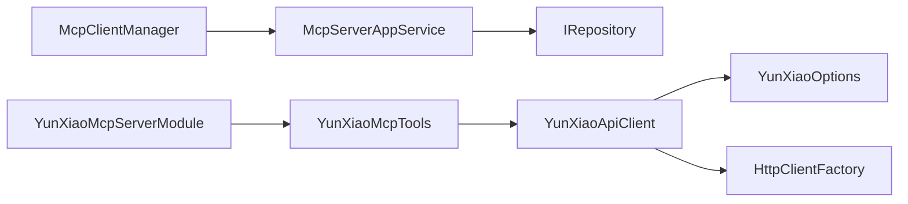

# MCP协议集成

<cite>
**本文引用的文件**
- [McpClientManager.cs](file://src/Agent/Assistant/H.Assistant.Core/Mcp/McpClientManager.cs)
- [McpServerAppService.cs](file://src/Agent/Assistant/H.Assistant.Application/Services/McpServerAppService.cs)
- [IMcpServerAppService.cs](file://src/Agent/Assistant/H.Assistant.Application.Contracts/Services/McpServers/IMcpServerAppService.cs)
- [McpServerDto.cs](file://src/Agent/Assistant/H.Assistant.Application.Contracts/Dtos/McpServers/McpServerDto.cs)
- [CreateMcpServerDto.cs](file://src/Agent/Assistant/H.Assistant.Application.Contracts/Dtos/McpServers/CreateMcpServerDto.cs)
- [McpServerEntity.cs](file://src/Agent/Assistant/H.Assistant.EntityFrameworkCore/Entities/McpServerEntity.cs)
- [20260607160151_McpServer.cs](file://src/Tools/H.Assistant.DbMigrator/Migrations/20260607160151_McpServer.cs)
- [YunXiaoMcpServerModule.cs](file://src/Agent/McpServers/H.Mcp.YunXiao/YunXiaoMcpServerModule.cs)
- [YunXiaoMcpTools.cs](file://src/Agent/McpServers/H.Mcp.YunXiao/YunXiaoMcpTools.cs)
- [YunXiaoApiClient.cs](file://src/Agent/McpServers/H.Mcp.YunXiao/YunXiaoApiClient.cs)
- [YunXiaoOptions.cs](file://src/Agent/McpServers/H.Mcp.YunXiao/YunXiaoOptions.cs)
</cite>

## 目录
1. [简介](#简介)
2. [项目结构](#项目结构)
3. [核心组件](#核心组件)
4. [架构总览](#架构总览)
5. [详细组件分析](#详细组件分析)
6. [依赖关系分析](#依赖关系分析)
7. [性能考虑](#性能考虑)
8. [故障排查指南](#故障排查指南)
9. [结论](#结论)
10. [附录](#附录)

## 简介
本文件面向在 AppLab 中集成与使用 Model Context Protocol（MCP）的开发者，系统性说明：
- MCP 协议在 AppLab 中的整体设计与实现要点
- YunXiao MCP 服务器的配置与使用方法
- MCP 客户端管理器的连接管理与工具发现机制
- 自定义 MCP 服务器开发指南（工具定义、参数处理、错误处理）
- API 调用示例与调试技巧
- 外部系统集成最佳实践与安全注意事项

## 项目结构
与 MCP 相关的代码主要分布在以下模块：
- 客户端侧：H.Assistant.Core/Mcp 下的 McpClientManager，负责连接、工具发现与调用
- 应用服务层：H.Assistant.Application/Services 下的 McpServerAppService，提供 MCP 服务的增删改查与启用开关
- 实体与迁移：H.Assistant.EntityFrameworkCore/Entities 与 DbMigrator/Migrations 下的 McpServerEntity 及数据库迁移
- 云效 MCP 服务器：H.Mcp.YunXiao 下的 Module、Tools、ApiClient、Options

**图表来源**
- [McpClientManager.cs:1-182](file://src/Agent/Assistant/H.Assistant.Core/Mcp/McpClientManager.cs#L1-L182)
- [McpServerAppService.cs:1-99](file://src/Agent/Assistant/H.Assistant.Application/Services/McpServerAppService.cs#L1-L99)
- [McpServerEntity.cs:1-55](file://src/Agent/Assistant/H.Assistant.EntityFrameworkCore/Entities/McpServerEntity.cs#L1-L55)
- [20260607160151_McpServer.cs:1-55](file://src/Tools/H.Assistant.DbMigrator/Migrations/20260607160151_McpServer.cs#L1-L55)
- [YunXiaoMcpServerModule.cs:1-30](file://src/Agent/McpServers/H.Mcp.YunXiao/YunXiaoMcpServerModule.cs#L1-L30)
- [YunXiaoMcpTools.cs:1-40](file://src/Agent/McpServers/H.Mcp.YunXiao/YunXiaoMcpTools.cs#L1-L40)
- [YunXiaoApiClient.cs:1-396](file://src/Agent/McpServers/H.Mcp.YunXiao/YunXiaoApiClient.cs#L1-L396)
- [YunXiaoOptions.cs:1-22](file://src/Agent/McpServers/H.Mcp.YunXiao/YunXiaoOptions.cs#L1-L22)

**章节来源**
- [McpClientManager.cs:1-182](file://src/Agent/Assistant/H.Assistant.Core/Mcp/McpClientManager.cs#L1-L182)
- [McpServerAppService.cs:1-99](file://src/Agent/Assistant/H.Assistant.Application/Services/McpServerAppService.cs#L1-L99)
- [McpServerEntity.cs:1-55](file://src/Agent/Assistant/H.Assistant.EntityFrameworkCore/Entities/McpServerEntity.cs#L1-L55)
- [20260607160151_McpServer.cs:1-55](file://src/Tools/H.Assistant.DbMigrator/Migrations/20260607160151_McpServer.cs#L1-L55)
- [YunXiaoMcpServerModule.cs:1-30](file://src/Agent/McpServers/H.Mcp.YunXiao/YunXiaoMcpServerModule.cs#L1-L30)
- [YunXiaoMcpTools.cs:1-40](file://src/Agent/McpServers/H.Mcp.YunXiao/YunXiaoMcpTools.cs#L1-L40)
- [YunXiaoApiClient.cs:1-396](file://src/Agent/McpServers/H.Mcp.YunXiao/YunXiaoApiClient.cs#L1-L396)
- [YunXiaoOptions.cs:1-22](file://src/Agent/McpServers/H.Mcp.YunXiao/YunXiaoOptions.cs#L1-L22)

## 核心组件
- McpClientManager：单例管理器，负责初始化时连接所有已启用的 MCP Server，发现工具并缓存；支持按名称查找工具并调用。
- McpServerAppService：对 McpServerEntity 进行 CRUD 与启用状态切换，供前端或配置中心维护 MCP 服务端点与认证信息。
- YunXiaoMcpServerModule：通过 Abp 模块注册 HttpClient、API Client 与 MCP Server（Streamable HTTP 传输），并暴露工具集合。
- YunXiaoMcpTools：以特性标注的方式声明 MCP 工具，描述参数与用途，内部委托给 YunXiaoApiClient 完成业务调用。
- YunXiaoApiClient：封装云效 OpenAPI 的 HTTP 请求、鉴权头、响应格式解析与错误处理。
- YunXiaoOptions：绑定配置项（企业标识、PAT、Endpoint）。

**章节来源**
- [McpClientManager.cs:1-182](file://src/Agent/Assistant/H.Assistant.Core/Mcp/McpClientManager.cs#L1-L182)
- [McpServerAppService.cs:1-99](file://src/Agent/Assistant/H.Assistant.Application/Services/McpServerAppService.cs#L1-L99)
- [YunXiaoMcpServerModule.cs:1-30](file://src/Agent/McpServers/H.Mcp.YunXiao/YunXiaoMcpServerModule.cs#L1-L30)
- [YunXiaoMcpTools.cs:1-40](file://src/Agent/McpServers/H.Mcp.YunXiao/YunXiaoMcpTools.cs#L1-L40)
- [YunXiaoApiClient.cs:1-396](file://src/Agent/McpServers/H.Mcp.YunXiao/YunXiaoApiClient.cs#L1-L396)
- [YunXiaoOptions.cs:1-22](file://src/Agent/McpServers/H.Mcp.YunXiao/YunXiaoOptions.cs#L1-L22)

## 架构总览
下图展示了从 Agent 到 MCP 服务器再到外部系统的完整调用链：

**图表来源**
- [McpClientManager.cs:27-104](file://src/Agent/Assistant/H.Assistant.Core/Mcp/McpClientManager.cs#L27-L104)
- [McpClientManager.cs:122-170](file://src/Agent/Assistant/H.Assistant.Core/Mcp/McpClientManager.cs#L122-L170)
- [McpServerAppService.cs:20-25](file://src/Agent/Assistant/H.Assistant.Application/Services/McpServerAppService.cs#L20-L25)
- [YunXiaoMcpServerModule.cs:24-27](file://src/Agent/McpServers/H.Mcp.YunXiao/YunXiaoMcpServerModule.cs#L24-L27)
- [YunXiaoMcpTools.cs:16-38](file://src/Agent/McpServers/H.Mcp.YunXiao/YunXiaoMcpTools.cs#L16-L38)
- [YunXiaoApiClient.cs:44-86](file://src/Agent/McpServers/H.Mcp.YunXiao/YunXiaoApiClient.cs#L44-L86)

## 详细组件分析

### McpClientManager（客户端管理器）
职责与流程：
- 启动时读取所有已启用的 MCP 服务器配置，建立连接并发现工具
- 支持多种传输类型（stdio、http），可附加自定义 Headers 与超时控制
- 提供获取全部工具、按名称查找工具、调用工具的接口
- 实现 IAsyncDisposable，确保资源释放

关键行为：
- InitializeAsync：拉取服务器列表，逐个 ConnectToServerAsync
- ConnectToServerAsync：根据 TransportType 选择 Stdio 或 HttpClient 传输，创建 McpClient 并 ListTools
- GetAllTools：聚合各服务器的工具为 AIFunction 列表
- FindTool：按工具名定位服务器与工具实例
- CallToolAsync：调用目标工具并捕获异常，返回友好错误消息

**图表来源**
- [McpClientManager.cs:27-104](file://src/Agent/Assistant/H.Assistant.Core/Mcp/McpClientManager.cs#L27-L104)

**章节来源**
- [McpClientManager.cs:1-182](file://src/Agent/Assistant/H.Assistant.Core/Mcp/McpClientManager.cs#L1-L182)

### McpServerAppService（服务配置管理）
职责：
- 提供 MCP 服务器的查询、创建、更新、删除与启用开关
- 校验唯一性（Name），映射 Entity 与 DTO

关键点：
- GetAllAsync：排序后返回 DTO 列表
- CreateAsync：重复名称抛出异常
- UpdateAsync/ToggleEnabledAsync：直接更新字段并持久化

**章节来源**
- [McpServerAppService.cs:1-99](file://src/Agent/Assistant/H.Assistant.Application/Services/McpServerAppService.cs#L1-L99)
- [IMcpServerAppService.cs:1-13](file://src/Agent/Assistant/H.Assistant.Application.Contracts/Services/McpServers/IMcpServerAppService.cs#L1-L13)

### 数据模型与数据库
- McpServerEntity：包含 Name、DisplayName、Endpoint、TransportType、AuthToken、ApiKey、Headers、TimeoutSeconds、IsEnabled 等字段
- 迁移脚本：创建 McpServer 表，设置主键、唯一索引与常用索引

**图表来源**
- [McpServerEntity.cs:1-55](file://src/Agent/Assistant/H.Assistant.EntityFrameworkCore/Entities/McpServerEntity.cs#L1-L55)
- [20260607160151_McpServer.cs:14-46](file://src/Tools/H.Assistant.DbMigrator/Migrations/20260607160151_McpServer.cs#L14-L46)

**章节来源**
- [McpServerEntity.cs:1-55](file://src/Agent/Assistant/H.Assistant.EntityFrameworkCore/Entities/McpServerEntity.cs#L1-L55)
- [20260607160151_McpServer.cs:1-55](file://src/Tools/H.Assistant.DbMigrator/Migrations/20260607160151_McpServer.cs#L1-L55)

### YunXiao MCP 服务器（工具与服务）
- YunXiaoMcpServerModule：绑定配置、注册 HttpClient、API Client，并通过 AddMcpServer().WithHttpTransport().WithTools<YunXiaoMcpTools>() 暴露工具
- YunXiaoMcpTools：以特性标注定义工具方法与参数描述，内部调用 YunXiaoApiClient
- YunXiaoApiClient：封装 OpenAPI 调用，包括鉴权头、请求构建、响应解析与错误处理
- YunXiaoOptions：绑定企业标识、PAT、Endpoint

**图表来源**
- [YunXiaoMcpServerModule.cs:1-30](file://src/Agent/McpServers/H.Mcp.YunXiao/YunXiaoMcpServerModule.cs#L1-L30)
- [YunXiaoMcpTools.cs:1-40](file://src/Agent/McpServers/H.Mcp.YunXiao/YunXiaoMcpTools.cs#L1-L40)
- [YunXiaoApiClient.cs:1-396](file://src/Agent/McpServers/H.Mcp.YunXiao/YunXiaoApiClient.cs#L1-L396)
- [YunXiaoOptions.cs:1-22](file://src/Agent/McpServers/H.Mcp.YunXiao/YunXiaoOptions.cs#L1-L22)

**章节来源**
- [YunXiaoMcpServerModule.cs:1-30](file://src/Agent/McpServers/H.Mcp.YunXiao/YunXiaoMcpServerModule.cs#L1-L30)
- [YunXiaoMcpTools.cs:1-40](file://src/Agent/McpServers/H.Mcp.YunXiao/YunXiaoMcpTools.cs#L1-L40)
- [YunXiaoApiClient.cs:1-396](file://src/Agent/McpServers/H.Mcp.YunXiao/YunXiaoApiClient.cs#L1-L396)
- [YunXiaoOptions.cs:1-22](file://src/Agent/McpServers/H.Mcp.YunXiao/YunXiaoOptions.cs#L1-L22)

### 工具调用序列（示例）
以“搜索工作项”为例，展示从 Agent 到云效 OpenAPI 的调用链：

**图表来源**
- [McpClientManager.cs:152-170](file://src/Agent/Assistant/H.Assistant.Core/Mcp/McpClientManager.cs#L152-L170)
- [YunXiaoMcpTools.cs:25-32](file://src/Agent/McpServers/H.Mcp.YunXiao/YunXiaoMcpTools.cs#L25-L32)
- [YunXiaoApiClient.cs:92-195](file://src/Agent/McpServers/H.Mcp.YunXiao/YunXiaoApiClient.cs#L92-L195)

## 依赖关系分析
- McpClientManager 依赖 IMcpServerAppService 获取服务器配置，依赖 ModelContextProtocol.Client 进行连接与工具发现
- McpServerAppService 依赖 IRepository<McpServerEntity> 进行数据访问
- YunXiaoMcpServerModule 依赖 IConfiguration、IHttpClientFactory、Abp 模块扩展来注册 MCP Server 与工具
- YunXiaoMcpTools 依赖 YunXiaoApiClient
- YunXiaoApiClient 依赖 IHttpClientFactory、IOptions<YunXiaoOptions> 与 ILogger

**图表来源**
- [McpClientManager.cs:1-25](file://src/Agent/Assistant/H.Assistant.Core/Mcp/McpClientManager.cs#L1-L25)
- [McpServerAppService.cs:1-18](file://src/Agent/Assistant/H.Assistant.Application/Services/McpServerAppService.cs#L1-L18)
- [YunXiaoMcpServerModule.cs:1-22](file://src/Agent/McpServers/H.Mcp.YunXiao/YunXiaoMcpServerModule.cs#L1-L22)
- [YunXiaoMcpTools.cs:1-14](file://src/Agent/McpServers/H.Mcp.YunXiao/YunXiaoMcpTools.cs#L1-L14)
- [YunXiaoApiClient.cs:1-38](file://src/Agent/McpServers/H.Mcp.YunXiao/YunXiaoApiClient.cs#L1-L38)

**章节来源**
- [McpClientManager.cs:1-25](file://src/Agent/Assistant/H.Assistant.Core/Mcp/McpClientManager.cs#L1-L25)
- [McpServerAppService.cs:1-18](file://src/Agent/Assistant/H.Assistant.Application/Services/McpServerAppService.cs#L1-L18)
- [YunXiaoMcpServerModule.cs:1-22](file://src/Agent/McpServers/H.Mcp.YunXiao/YunXiaoMcpServerModule.cs#L1-L22)
- [YunXiaoMcpTools.cs:1-14](file://src/Agent/McpServers/H.Mcp.YunXiao/YunXiaoMcpTools.cs#L1-L14)
- [YunXiaoApiClient.cs:1-38](file://src/Agent/McpServers/H.Mcp.YunXiao/YunXiaoApiClient.cs#L1-L38)

## 性能考虑
- 连接复用：McpClientManager 将客户端与工具缓存，避免重复连接与发现
- 超时控制：为每个连接设置超时时间，防止阻塞
- 传输选择：优先使用合适的传输类型（stdio 适合本地进程，http 适合远程服务）
- 日志与诊断：记录连接失败、工具调用异常，便于快速定位问题
- 序列化优化：YunXiaoApiClient 使用轻量 JSON 选项减少开销

[本节为通用指导，不直接分析具体文件]

## 故障排查指南
常见问题与排查步骤：
- 连接失败
  - 检查 Endpoint 是否为空或不正确
  - 确认 TransportType 与服务器端一致（stdio/http）
  - 查看日志中“连接失败”的详细信息
- 工具未找到
  - 确认工具名与服务器暴露的名称一致
  - 检查服务器是否成功 ListTools
- 调用异常
  - 查看工具调用异常日志，关注参数是否正确
  - 对于云效 API，检查 PAT 是否有效、组织 ID 是否正确
- 非 JSON 响应
  - 云效 API 可能返回 HTML（如认证失败），需检查鉴权头与 URL

**章节来源**
- [McpClientManager.cs:45-57](file://src/Agent/Assistant/H.Assistant.Core/Mcp/McpClientManager.cs#L45-L57)
- [McpClientManager.cs:165-169](file://src/Agent/Assistant/H.Assistant.Core/Mcp/McpClientManager.cs#L165-L169)
- [YunXiaoApiClient.cs:58-86](file://src/Agent/McpServers/H.Mcp.YunXiao/YunXiaoApiClient.cs#L58-L86)
- [YunXiaoApiClient.cs:147-195](file://src/Agent/McpServers/H.Mcp.YunXiao/YunXiaoApiClient.cs#L147-L195)

## 结论
AppLab 通过 McpClientManager 统一管理多 MCP 服务器连接与工具发现，结合 McpServerAppService 的配置管理能力，实现了灵活可扩展的 MCP 集成方案。YunXiao MCP 服务器作为示例，展示了如何以最小成本将外部系统能力暴露为 MCP 工具，供 Agent 调用。建议在生产环境中严格管理鉴权信息、合理设置超时与重试策略，并完善日志与监控。

[本节为总结性内容，不直接分析具体文件]

## 附录

### YunXiao MCP 服务器配置与使用
- 配置项（YunXiaoOptions）
  - OrganizationId：企业标识
  - PersonalAccessToken：个人访问令牌（PAT）
  - Endpoint：云效 OpenAPI 端点（默认 https://openapi-rdc.aliyuncs.com）
- 注册方式（YunXiaoMcpServerModule）
  - 绑定配置、注册 HttpClient、API Client
  - 使用 AddMcpServer().WithHttpTransport().WithTools<YunXiaoMcpTools>() 暴露工具

**章节来源**
- [YunXiaoOptions.cs:1-22](file://src/Agent/McpServers/H.Mcp.YunXiao/YunXiaoOptions.cs#L1-L22)
- [YunXiaoMcpServerModule.cs:11-28](file://src/Agent/McpServers/H.Mcp.YunXiao/YunXiaoMcpServerModule.cs#L11-L28)

### 自定义 MCP 服务器开发指南
- 工具定义
  - 使用 [McpServerToolType] 标注类，使用 [McpServerTool] 与 Description 标注方法与参数
  - 参数建议使用可选值与默认值，提升易用性
- 参数处理
  - 在服务端对输入进行必要校验，必要时返回结构化错误信息
- 错误处理
  - 在工具方法内捕获异常，返回用户友好的错误文本
  - 对外部 API 调用增加重试与降级策略（如备用接口）

**章节来源**
- [YunXiaoMcpTools.cs:6-38](file://src/Agent/McpServers/H.Mcp.YunXiao/YunXiaoMcpTools.cs#L6-L38)
- [YunXiaoApiClient.cs:235-250](file://src/Agent/McpServers/H.Mcp.YunXiao/YunXiaoApiClient.cs#L235-L250)

### API 调用示例（概念性）
- 获取工作项详情
  - 工具：GetWorkItemInfo
  - 参数：spaceIdentifier、workitemId、spaceType（可选）
- 搜索工作项
  - 工具：SearchWorkItems
  - 参数：spaceIdentifier、keyword（可选）、category（可选，默认 Req）
- 列出项目
  - 工具：ListProjects
  - 参数：无

提示：以上为工具调用概念示例，实际调用由 McpClientManager.CallToolAsync 完成。

**章节来源**
- [YunXiaoMcpTools.cs:16-38](file://src/Agent/McpServers/H.Mcp.YunXiao/YunXiaoMcpTools.cs#L16-L38)
- [McpClientManager.cs:152-170](file://src/Agent/Assistant/H.Assistant.Core/Mcp/McpClientManager.cs#L152-L170)

### 安全与最佳实践
- 鉴权
  - 使用 PAT 或 Token 进行认证，避免硬编码敏感信息
  - 通过配置注入与加密存储保护密钥
- 传输安全
  - 使用 HTTPS 与 TLS，限制网络访问范围
- 权限控制
  - 仅暴露必要的工具与方法，遵循最小权限原则
- 审计与监控
  - 记录工具调用与错误日志，接入集中式日志与告警

[本节为通用指导，不直接分析具体文件]