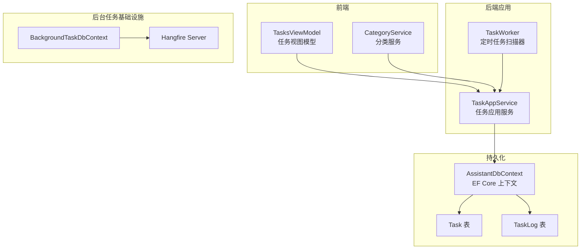
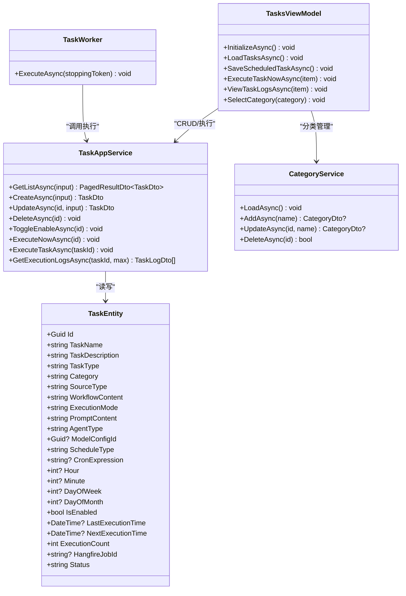
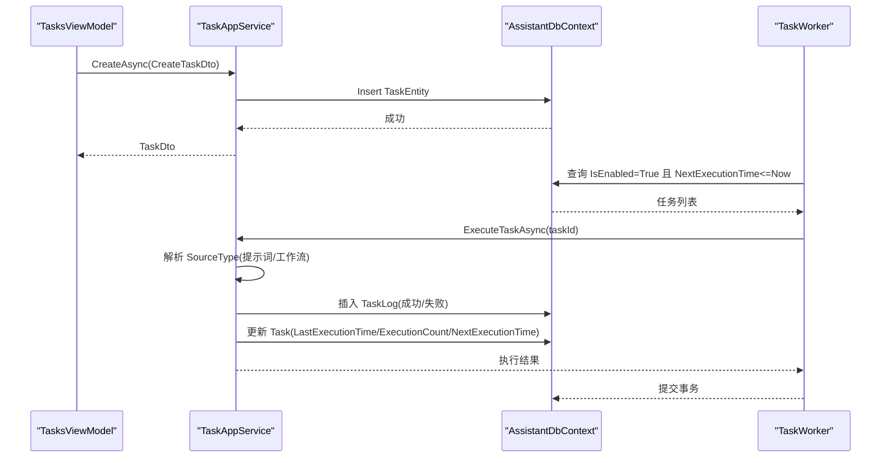
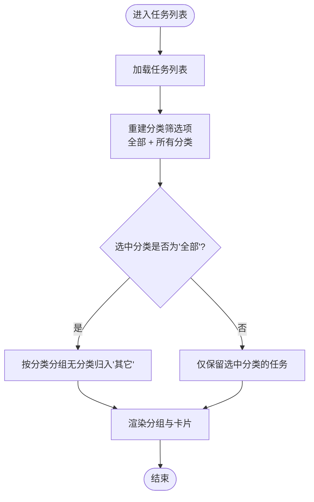
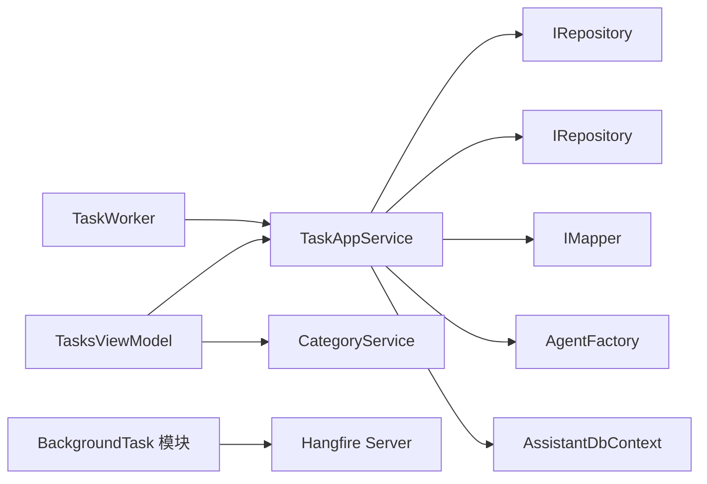

# 任务分类系统

<cite>
**本文引用的文件**   
- [README.md](file://README.md)
- [TaskEntity.cs](file://src/Agent/Assistant/H.Assistant.EntityFrameworkCore/Entities/TaskEntity.cs)
- [TaskAppService.cs](file://src/Agent/Assistant/H.Assistant.Application/Services/TaskAppService.cs)
- [TaskWorker.cs](file://src/Agent/Assistant/H.Assistant.Application/Workers/TaskWorker.cs)
- [TasksViewModel.cs](file://src/Host/H.AppLab.Desktop/ViewModels/TasksViewModel.cs)
- [CategoryService.cs](file://src/Host/H.AppLab.Desktop/Services/CategoryService.cs)
- [BackgroundJobEntity.cs](file://src/Services/BackgroundTask/H.BackgroundTask.EntityFrameworkCore/Entities/BackgroundJobEntity.cs)
- [BackgroundTaskDbContext.cs](file://src/Services/BackgroundTask/H.BackgroundTask.EntityFrameworkCore/BackgroundTaskDbContext.cs)
- [BackgroundTaskApplicationModule.cs](file://src/Services/BackgroundTask/H.BackgroundTask.Application/BackgroundTaskApplicationModule.cs)
</cite>

## 目录
1. [简介](#简介)
2. [项目结构](#项目结构)
3. [核心组件](#核心组件)
4. [架构总览](#架构总览)
5. [详细组件分析](#详细组件分析)
6. [依赖关系分析](#依赖关系分析)
7. [性能考量](#性能考量)
8. [故障排查指南](#故障排查指南)
9. [结论](#结论)
10. [附录](#附录)

## 简介
本文件围绕“任务分类系统”进行系统化文档化，聚焦于任务的分类管理、创建与执行、调度与日志记录等关键能力。该系统基于 .NET + Blazor 的模块化架构，采用应用服务层（Application）、实体仓储（EntityFrameworkCore）与前端视图模型（Desktop ViewModel）分层组织；同时提供后台 Worker 定时扫描待执行任务并触发执行，形成“界面—服务—执行器—持久化”的完整闭环。

## 项目结构
- 宿主与模块
  - Host：桌面端宿主与 Web 宿主，负责 UI 与路由、懒加载与 DI 组合。
  - Agent/Assistant：包含任务相关的领域模型、应用服务、工作进程与 EF Core 实体。
  - Services/BackgroundTask：通用后台任务基础设施（Hangfire 集成），用于更通用的作业调度与执行记录。
  - Utils：HTTP 动态代理、Blazor 工具、ID 生成等公共库。
- 代码组织方式
  - 按限界上下文划分业务模块，每个模块遵循 Application.Contracts / Application / EntityFrameworkCore / Web 的分层模式。
  - 共享 UI 组件位于 Components，如 AppDrawer 提供统一导航与抽屉能力。

章节来源
- [README.md:1-74](file://README.md#L1-L74)

## 核心组件
- 任务实体（TaskEntity）
  - 承载任务名称、描述、类型、分类、来源（提示词/工作流）、执行模式（手动/自动）、调度参数（Cron/日/周/月/一次性）、状态与执行统计等。
- 应用服务（TaskAppService）
  - 提供任务的增删改查、分页查询、启用/禁用、立即执行、执行日志获取、下次执行时间计算与工作流/提示词执行编排。
- 后台 Worker（TaskWorker）
  - 周期性扫描已启用且到达下次执行时间的任务，批量更新防重后逐个调用应用服务执行。
- 桌面端视图模型（TasksViewModel）
  - 维护任务列表、分类分组、筛选、创建/编辑对话框、执行日志查看与多选删除、分类 CRUD 等交互逻辑。
- 分类服务（CategoryService）
  - 通过 ICategoryAppService 对分类进行加载、新增、更新、删除，并在本地集合中同步状态。
- 后台任务基础设施（BackgroundTask）
  - 定义通用作业实体与数据库上下文，集成 Hangfire 作为作业存储与服务器，提供统一的作业调度与执行记录能力。

章节来源
- [TaskEntity.cs:1-120](file://src/Agent/Assistant/H.Assistant.EntityFrameworkCore/Entities/TaskEntity.cs#L1-L120)
- [TaskAppService.cs:1-453](file://src/Agent/Assistant/H.Assistant.Application/Services/TaskAppService.cs#L1-L453)
- [TaskWorker.cs:1-81](file://src/Agent/Assistant/H.Assistant.Application/Workers/TaskWorker.cs#L1-L81)
- [TasksViewModel.cs:1-800](file://src/Host/H.AppLab.Desktop/ViewModels/TasksViewModel.cs#L1-L800)
- [CategoryService.cs:1-90](file://src/Host/H.AppLab.Desktop/Services/CategoryService.cs#L1-L90)
- [BackgroundJobEntity.cs:1-62](file://src/Services/BackgroundTask/H.BackgroundTask.EntityFrameworkCore/Entities/BackgroundJobEntity.cs#L1-L62)
- [BackgroundTaskDbContext.cs:1-62](file://src/Services/BackgroundTask/H.BackgroundTask.EntityFrameworkCore/BackgroundTaskDbContext.cs#L1-L62)
- [BackgroundTaskApplicationModule.cs:1-57](file://src/Services/BackgroundTask/H.BackgroundTask.Application/BackgroundTaskApplicationModule.cs#L1-L57)

## 架构总览
下图展示了任务分类系统的整体架构与数据流向：前端通过视图模型调用应用服务接口，应用服务操作实体与仓储，后台 Worker 周期扫描并驱动执行，执行结果写入日志表。

图表来源
- [TaskAppService.cs:1-453](file://src/Agent/Assistant/H.Assistant.Application/Services/TaskAppService.cs#L1-L453)
- [TaskWorker.cs:1-81](file://src/Agent/Assistant/H.Assistant.Application/Workers/TaskWorker.cs#L1-L81)
- [BackgroundTaskDbContext.cs:1-62](file://src/Services/BackgroundTask/H.BackgroundTask.EntityFrameworkCore/BackgroundTaskDbContext.cs#L1-L62)
- [BackgroundTaskApplicationModule.cs:1-57](file://src/Services/BackgroundTask/H.BackgroundTask.Application/BackgroundTaskApplicationModule.cs#L1-L57)

## 详细组件分析

### 任务实体与数据模型
- TaskEntity
  - 关键字段：任务名、描述、类型、分类、来源（Prompt/Workflow）、执行模式（Manual/Auto）、调度类型（Once/Daily/Weekly/Monthly/Cron）、Cron 表达式、小时/分钟/星期/日期、是否启用、最后执行时间、下次执行时间、执行次数、Hangfire JobId、状态（Active/Paused/Completed）。
  - 设计要点：将“分类”作为字符串字段，便于前端快速分组与筛选；支持多种调度策略与执行模式；通过 NextExecutionTime 驱动 Worker 拾取。
- 相关迁移与索引
  - 迁移脚本中对 Task 表定义了 NextExecutionTime、IsEnabled+Status 等索引，提升查询与调度效率。

章节来源
- [TaskEntity.cs:1-120](file://src/Agent/Assistant/H.Assistant.EntityFrameworkCore/Entities/TaskEntity.cs#L1-L120)
- [20260604021506_Init.cs:119-132](file://src/Tools/H.Assistant.DbMigrator/Migrations/20260604021506_Init.cs#L119-L132)
- [20260607160151_McpServer.Designer.cs:565-601](file://src/Tools/H.Assistant.DbMigrator/Migrations/20260607160151_McpServer.Designer.cs#L565-L601)

### 任务应用服务（TaskAppService）
- 功能职责
  - 分页查询：支持过滤（名称/描述、状态、启用标志、分类）。
  - 创建/更新：根据执行模式设置 TaskType、NextExecutionTime；保存 SourceType、WorkflowContent、PromptContent、AgentType、ModelConfigId 等。
  - 启用/禁用：切换 IsEnabled 与 Status，并重新计算下次执行时间（非 Manual）。
  - 立即执行：委托 ExecuteTaskAsync。
  - 执行编排：根据 SourceType 选择提示词或工作流执行；工作流步骤串联，上一步结果注入下一步上下文。
  - 日志记录：成功/失败均写入 TaskLog 表，并更新 LastExecutionTime、ExecutionCount、NextExecutionTime。
- 复杂度与优化
  - 查询使用 AsQueryable 与异步执行器，避免内存排序与全量加载。
  - 批量更新 NextExecutionTime 防止重复拾取。
  - 工作流执行顺序处理，保证上下文传递。

章节来源
- [TaskAppService.cs:1-453](file://src/Agent/Assistant/H.Assistant.Application/Services/TaskAppService.cs#L1-L453)

### 后台 Worker（TaskWorker）
- 行为流程
  - 每分钟扫描一次：查找 IsEnabled=真、Status=Active、NextExecutionTime<=当前时间的任务。
  - 先批量更新 NextExecutionTime 为远将来时间，防止并发重复拾取。
  - 逐个调用 TaskAppService.ExecuteTaskAsync 执行任务，异常捕获不影响其他任务。
- 健壮性
  - 异常隔离：单个任务失败不影响整体扫描循环。
  - 日志输出：记录发现数量与执行详情。

章节来源
- [TaskWorker.cs:1-81](file://src/Agent/Assistant/H.Assistant.Application/Workers/TaskWorker.cs#L1-L81)

### 桌面端视图模型（TasksViewModel）
- 主要职责
  - 初始化：加载分类、可用 Agent、任务列表。
  - 分类筛选与分组：构建 FilterCategories，按分类分组显示，“其它”组置后。
  - 任务 CRUD：创建/编辑对话框，校验提示词或工作流步骤，保存后刷新列表。
  - 执行控制：启用/禁用、立即执行、删除。
  - 执行日志：分页加载、多选删除、全选/取消全选。
  - 分类管理：新增、重命名、删除，并同步更新任务中的分类字段。
- 交互细节
  - 使用 ObservableObject 与 RelayCommand 实现响应式 UI。
  - 分类选项来源于 CategoryService，确保前后端一致。

章节来源
- [TasksViewModel.cs:1-800](file://src/Host/H.AppLab.Desktop/ViewModels/TasksViewModel.cs#L1-L800)

### 分类服务（CategoryService）
- 功能
  - LoadAsync：从 ICategoryAppService 拉取分类列表并填充本地集合。
  - AddAsync/UpdateAsync/DeleteAsync：调用后端 API 完成分类 CRUD，并同步本地集合。
- 设计要点
  - 简单封装，屏蔽 HTTP 调用细节，集中错误处理。

章节来源
- [CategoryService.cs:1-90](file://src/Host/H.AppLab.Desktop/Services/CategoryService.cs#L1-L90)

### 后台任务基础设施（BackgroundTask）
- 背景
  - BackgroundJobEntity：通用作业定义，支持 API/SQL 两种执行类型，支持 Cron/计划时间、连接串、请求头/体等。
  - BackgroundTaskDbContext：定义作业与执行记录表结构及索引。
  - BackgroundTaskApplicationModule：配置 Hangfire 存储与启动内置作业服务器。
- 适用场景
  - 当需要更通用的作业调度与执行记录时，可复用该模块；任务分类系统也可与之结合扩展。

章节来源
- [BackgroundJobEntity.cs:1-62](file://src/Services/BackgroundTask/H.BackgroundTask.EntityFrameworkCore/Entities/BackgroundJobEntity.cs#L1-L62)
- [BackgroundTaskDbContext.cs:1-62](file://src/Services/BackgroundTask/H.BackgroundTask.EntityFrameworkCore/BackgroundTaskDbContext.cs#L1-L62)
- [BackgroundTaskApplicationModule.cs:1-57](file://src/Services/BackgroundTask/H.BackgroundTask.Application/BackgroundTaskApplicationModule.cs#L1-L57)

### 类图（任务相关）

图表来源
- [TaskEntity.cs:1-120](file://src/Agent/Assistant/H.Assistant.EntityFrameworkCore/Entities/TaskEntity.cs#L1-L120)
- [TaskAppService.cs:1-453](file://src/Agent/Assistant/H.Assistant.Application/Services/TaskAppService.cs#L1-L453)
- [TaskWorker.cs:1-81](file://src/Agent/Assistant/H.Assistant.Application/Workers/TaskWorker.cs#L1-L81)
- [TasksViewModel.cs:1-800](file://src/Host/H.AppLab.Desktop/ViewModels/TasksViewModel.cs#L1-L800)
- [CategoryService.cs:1-90](file://src/Host/H.AppLab.Desktop/Services/CategoryService.cs#L1-L90)

### 序列图（任务执行流程）

图表来源
- [TaskWorker.cs:1-81](file://src/Agent/Assistant/H.Assistant.Application/Workers/TaskWorker.cs#L1-L81)
- [TaskAppService.cs:1-453](file://src/Agent/Assistant/H.Assistant.Application/Services/TaskAppService.cs#L1-L453)

### 流程图（分类筛选与分组）

图表来源
- [TasksViewModel.cs:1-800](file://src/Host/H.AppLab.Desktop/ViewModels/TasksViewModel.cs#L1-L800)

## 依赖关系分析
- 组件耦合
  - TasksViewModel 依赖 TaskAppService 与 CategoryService，解耦了 HTTP 调用细节。
  - TaskAppService 依赖 EF Core 仓储与映射器，内部还依赖 AgentFactory（由 Assistant.Core 提供）以执行提示词/工作流。
  - TaskWorker 依赖 ITaskAppService 与 DbContext，独立于 UI 层。
- 外部依赖
  - Hangfire（BackgroundTask 模块）提供通用作业调度能力，可与任务系统结合扩展。
  - ABP 基础契约与 HttpClient 动态代理（Utils）简化前后端交互。

图表来源
- [TaskAppService.cs:1-453](file://src/Agent/Assistant/H.Assistant.Application/Services/TaskAppService.cs#L1-L453)
- [TaskWorker.cs:1-81](file://src/Agent/Assistant/H.Assistant.Application/Workers/TaskWorker.cs#L1-L81)
- [BackgroundTaskApplicationModule.cs:1-57](file://src/Services/BackgroundTask/H.BackgroundTask.Application/BackgroundTaskApplicationModule.cs#L1-L57)

章节来源
- [TaskAppService.cs:1-453](file://src/Agent/Assistant/H.Assistant.Application/Services/TaskAppService.cs#L1-L453)
- [TaskWorker.cs:1-81](file://src/Agent/Assistant/H.Assistant.Application/Workers/TaskWorker.cs#L1-L81)
- [BackgroundTaskApplicationModule.cs:1-57](file://src/Services/BackgroundTask/H.BackgroundTask.Application/BackgroundTaskApplicationModule.cs#L1-L57)

## 性能考量
- 查询优化
  - 使用 AsQueryable 与异步执行器，避免内存排序与全量加载。
  - 对 NextExecutionTime、IsEnabled+Status 建立索引，提高调度扫描效率。
- 执行优化
  - Worker 批量更新 NextExecutionTime 防止重复拾取。
  - 工作流步骤串行执行，注意长耗时步骤的超时与重试策略。
- 前端优化
  - 按需加载程序集（WebAssembly 懒加载），减少初始包体积。
  - 分类筛选在客户端进行，降低服务端压力。

[本节为通用指导，不直接分析具体文件]

## 故障排查指南
- 任务未执行
  - 检查 IsEnabled 与 Status 是否为 Active。
  - 确认 NextExecutionTime 是否正确计算且小于等于当前时间。
  - 查看 Worker 日志是否拾取到任务。
- 执行失败
  - 查看 TaskLog 表的 ErrorMessage 与 Result。
  - 检查 Agent 实例创建与模型配置是否正确。
- 分类问题
  - 确认 CategoryService 是否正确加载与同步。
  - 检查分类是否存在重复名称导致更新失败。

章节来源
- [TaskWorker.cs:1-81](file://src/Agent/Assistant/H.Assistant.Application/Workers/TaskWorker.cs#L1-L81)
- [TaskAppService.cs:1-453](file://src/Agent/Assistant/H.Assistant.Application/Services/TaskAppService.cs#L1-L453)
- [CategoryService.cs:1-90](file://src/Host/H.AppLab.Desktop/Services/CategoryService.cs#L1-L90)

## 结论
任务分类系统以清晰的层次结构与明确的职责边界实现了任务的分类管理、创建与执行、调度与日志记录。通过 Worker 与 TaskAppService 的配合，保证了调度的可靠性与执行的可观测性；前端通过 TasksViewModel 与 CategoryService 提供了友好的交互体验。未来可结合 BackgroundTask 模块进一步扩展作业调度能力，或在执行编排中引入更多 Agent 能力。

[本节为总结，不直接分析具体文件]

## 附录
- 开发环境准备与启动说明参见 README。
- 数据库迁移工具位于 Tools 目录下，按服务分别运行 DbMigrator。

章节来源
- [README.md:1-74](file://README.md#L1-L74)