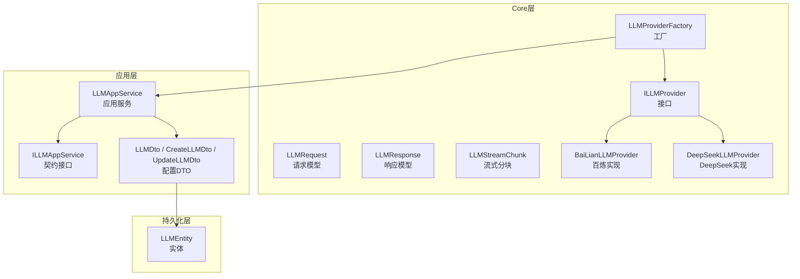
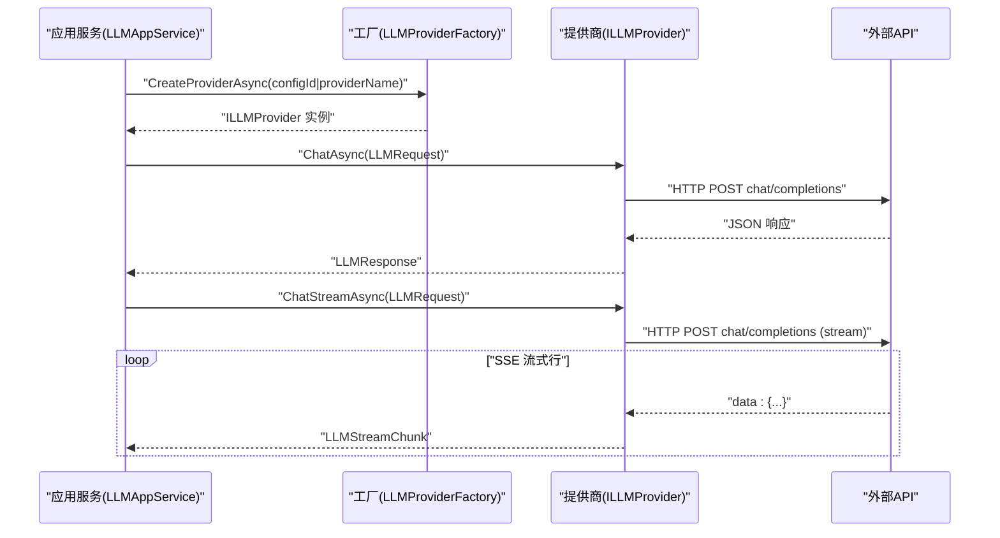
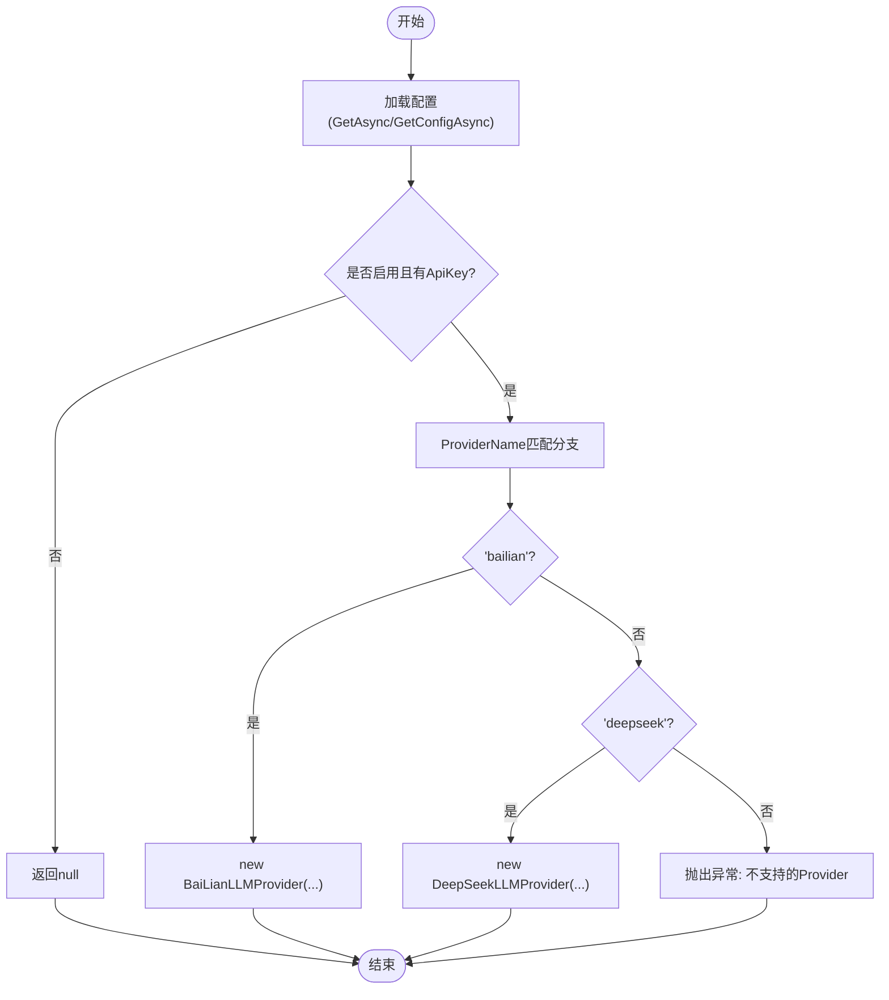
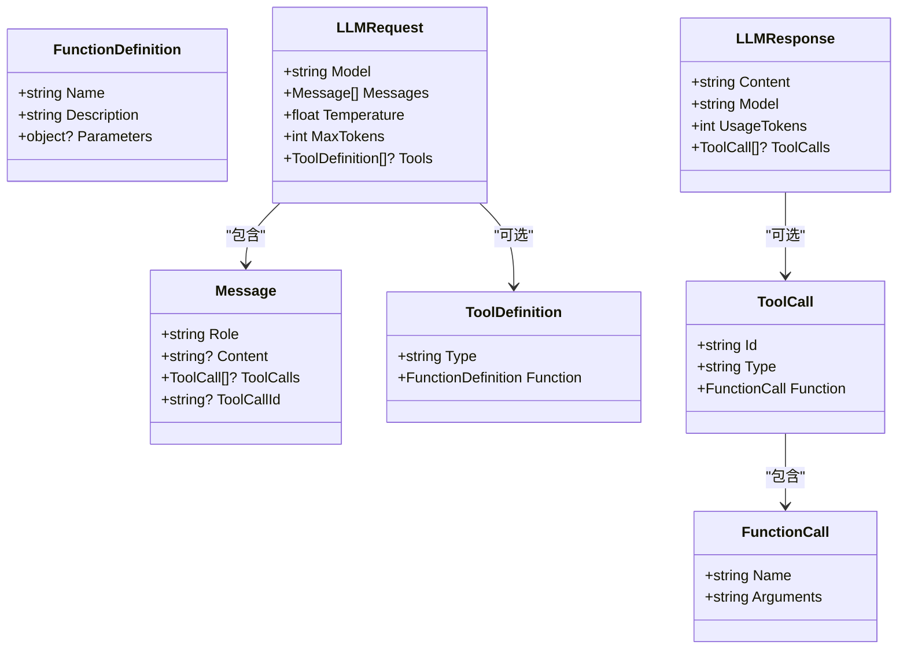
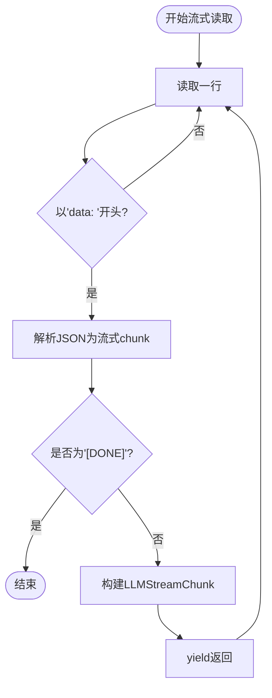
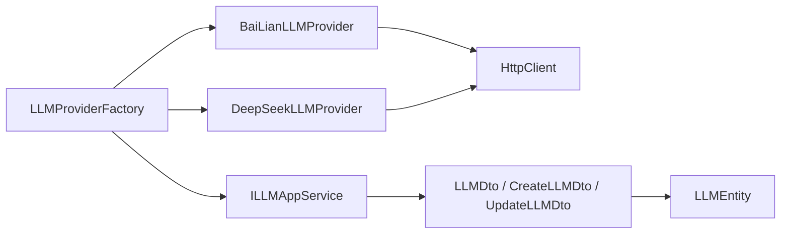

# LLM提供商集成

<cite>
**本文引用的文件**   
- [ILLMProvider.cs](file://src/Agent/Assistant/H.Assistant.Core/LLM/ILLMProvider.cs)
- [LLMProviderFactory.cs](file://src/Agent/Assistant/H.Assistant.Core/LLM/LLMProviderFactory.cs)
- [BaiLianLLMProvider.cs](file://src/Agent/Assistant/H.Assistant.Core/LLM/Providers/BaiLianLLMProvider.cs)
- [DeepSeekLLMProvider.cs](file://src/Agent/Assistant/H.Assistant.Core/LLM/Providers/DeepSeekLLMProvider.cs)
- [LLMRequest.cs](file://src/Agent/Assistant/H.Assistant.Core/LLM/LLMRequest.cs)
- [LLMResponse.cs](file://src/Agent/Assistant/H.Assistant.Core/LLM/LLMResponse.cs)
- [LLMStreamChunk.cs](file://src/Agent/Assistant/H.Assistant.Core/LLM/LLMStreamChunk.cs)
- [LLMAppService.cs](file://src/Agent/Assistant/H.Assistant.Application/Services/LLMAppService.cs)
- [LLMDto.cs](file://src/Agent/Assistant/H.Assistant.Application.Contracts/Dtos/Llms/LLMDto.cs)
- [CreateLLMDto.cs](file://src/Agent/Assistant/H.Assistant.Application.Contracts/Dtos/Llms/CreateLLMDto.cs)
- [UpdateLLMDto.cs](file://src/Agent/Assistant/H.Assistant.Application.Contracts/Dtos/Llms/UpdateLLMDto.cs)
- [ILLMAppService.cs](file://src/Agent/Assistant/H.Assistant.Application.Contracts/Services/Llms/ILLMAppService.cs)
- [LLMEntity.cs](file://src/Agent/Assistant/H.Assistant.EntityFrameworkCore/Entities/LLMEntity.cs)
</cite>

## 目录
1. [简介](#简介)
2. [项目结构](#项目结构)
3. [核心组件](#核心组件)
4. [架构总览](#架构总览)
5. [详细组件分析](#详细组件分析)
6. [依赖关系分析](#依赖关系分析)
7. [性能考虑](#性能考虑)
8. [故障排查指南](#故障排查指南)
9. [结论](#结论)
10. [附录：新提供商集成指南与配置示例](#附录新提供商集成指南与配置示例)

## 简介
本文件面向需要在系统中集成新的LLM提供商的开发者，围绕统一接口、工厂注册发现机制、请求/响应数据模型以及流式传输进行系统化说明。文档重点包括：
- ILLMProvider 接口的设计与抽象层次
- LLMProviderFactory 的提供商注册与发现机制
- BaiLianLLMProvider 与 DeepSeekLLMProvider 的实现差异
- LLMRequest / LLMResponse 的数据模型设计
- 流式响应处理与 LLMStreamChunk 的分块传输机制
- 新增提供商的完整接入步骤与配置要点

## 项目结构
LLM相关代码位于 Assistant 模块的 Core 层与应用层之间，采用“接口定义 + 具体实现 + 工厂”的分层组织方式：
- 接口与数据模型：H.Assistant.Core/LLM
- 具体提供商实现：H.Assistant.Core/LLM/Providers
- 应用服务与DTO：H.Assistant.Application 与 H.Assistant.Application.Contracts
- 持久化实体：H.Assistant.EntityFrameworkCore/Entities

图表来源
- [ILLMProvider.cs:1-23](file://src/Agent/Assistant/H.Assistant.Core/LLM/ILLMProvider.cs#L1-L23)
- [LLMRequest.cs:1-58](file://src/Agent/Assistant/H.Assistant.Core/LLM/LLMRequest.cs#L1-L58)
- [LLMResponse.cs:1-29](file://src/Agent/Assistant/H.Assistant.Core/LLM/LLMResponse.cs#L1-L29)
- [LLMStreamChunk.cs:1-34](file://src/Agent/Assistant/H.Assistant.Core/LLM/LLMStreamChunk.cs#L1-L34)
- [LLMProviderFactory.cs:1-72](file://src/Agent/Assistant/H.Assistant.Core/LLM/LLMProviderFactory.cs#L1-L72)
- [BaiLianLLMProvider.cs:1-228](file://src/Agent/Assistant/H.Assistant.Core/LLM/Providers/BaiLianLLMProvider.cs#L1-L228)
- [DeepSeekLLMProvider.cs:1-228](file://src/Agent/Assistant/H.Assistant.Core/LLM/Providers/DeepSeekLLMProvider.cs#L1-L228)
- [LLMAppService.cs](file://src/Agent/Assistant/H.Assistant.Application/Services/LLMAppService.cs)
- [ILLMAppService.cs](file://src/Agent/Assistant/H.Assistant.Application.Contracts/Services/Llms/ILLMAppService.cs)
- [LLMDto.cs](file://src/Agent/Assistant/H.Assistant.Application.Contracts/Dtos/Llms/LLMDto.cs)
- [CreateLLMDto.cs](file://src/Agent/Assistant/H.Assistant.Application.Contracts/Dtos/Llms/CreateLLMDto.cs)
- [UpdateLLMDto.cs](file://src/Agent/Assistant/H.Assistant.Application.Contracts/Dtos/Llms/UpdateLLMDto.cs)
- [LLMEntity.cs](file://src/Agent/Assistant/H.Assistant.EntityFrameworkCore/Entities/LLMEntity.cs)

章节来源
- [ILLMProvider.cs:1-23](file://src/Agent/Assistant/H.Assistant.Core/LLM/ILLMProvider.cs#L1-L23)
- [LLMProviderFactory.cs:1-72](file://src/Agent/Assistant/H.Assistant.Core/LLM/LLMProviderFactory.cs#L1-L72)
- [LLMRequest.cs:1-58](file://src/Agent/Assistant/H.Assistant.Core/LLM/LLMRequest.cs#L1-L58)
- [LLMResponse.cs:1-29](file://src/Agent/Assistant/H.Assistant.Core/LLM/LLMResponse.cs#L1-L29)
- [LLMStreamChunk.cs:1-34](file://src/Agent/Assistant/H.Assistant.Core/LLM/LLMStreamChunk.cs#L1-L34)

## 核心组件
- ILLMProvider：统一的LLM提供商抽象，提供同步对话与流式对话能力，并暴露 ProviderName 用于识别。
- LLMRequest / LLMResponse：标准化的请求与响应模型，包含消息、工具定义、调用结果与用量统计。
- LLMStreamChunk：流式响应的最小单元，支持文本增量与工具调用的增量字段。
- LLMProviderFactory：根据配置（configId 或 providerName）动态创建具体提供商实例，并提供默认与可用列表查询。

章节来源
- [ILLMProvider.cs:1-23](file://src/Agent/Assistant/H.Assistant.Core/LLM/ILLMProvider.cs#L1-L23)
- [LLMRequest.cs:1-58](file://src/Agent/Assistant/H.Assistant.Core/LLM/LLMRequest.cs#L1-L58)
- [LLMResponse.cs:1-29](file://src/Agent/Assistant/H.Assistant.Core/LLM/LLMResponse.cs#L1-L29)
- [LLMStreamChunk.cs:1-34](file://src/Agent/Assistant/H.Assistant.Core/LLM/LLMStreamChunk.cs#L1-L34)
- [LLMProviderFactory.cs:1-72](file://src/Agent/Assistant/H.Assistant.Core/LLM/LLMProviderFactory.cs#L1-L72)

## 架构总览
系统通过应用服务获取LLM配置，再由工厂按配置创建具体提供商实例，最终调用其同步或流式接口完成对话。

图表来源
- [LLMProviderFactory.cs:1-72](file://src/Agent/Assistant/H.Assistant.Core/LLM/LLMProviderFactory.cs#L1-L72)
- [BaiLianLLMProvider.cs:1-228](file://src/Agent/Assistant/H.Assistant.Core/LLM/Providers/BaiLianLLMProvider.cs#L1-L228)
- [DeepSeekLLMProvider.cs:1-228](file://src/Agent/Assistant/H.Assistant.Core/LLM/Providers/DeepSeekLLMProvider.cs#L1-L228)

## 详细组件分析

### ILLMProvider 接口设计
- 抽象目标：屏蔽不同LLM提供商的差异，向上层暴露一致的对话与流式接口。
- 关键成员：
  - ProviderName：标识提供商名称，便于工厂路由与选择。
  - ChatAsync：同步对话，返回标准化响应。
  - ChatStreamAsync：流式对话，返回 IAsyncEnumerable<LLMStreamChunk>，支持 tool_calls 增量。

章节来源
- [ILLMProvider.cs:1-23](file://src/Agent/Assistant/H.Assistant.Core/LLM/ILLMProvider.cs#L1-L23)

### LLMProviderFactory 注册与发现机制
- 输入来源：通过 ILLMAppService 读取配置（GetAsync、GetConfigAsync、GetDefaultConfigAsync、GetAllAsync）。
- 创建策略：基于 ProviderName 的小写匹配，映射到具体实现类（bailian -> BaiLianLLMProvider，deepseek -> DeepSeekLLMProvider）。
- 可用性校验：仅启用且包含有效 ApiKey 的配置才会被创建为可用提供商。
- 扩展点：在 CreateFromConfig 中增加新的分支即可接入新提供商。

图表来源
- [LLMProviderFactory.cs:1-72](file://src/Agent/Assistant/H.Assistant.Core/LLM/LLMProviderFactory.cs#L1-L72)

章节来源
- [LLMProviderFactory.cs:1-72](file://src/Agent/Assistant/H.Assistant.Core/LLM/LLMProviderFactory.cs#L1-L72)

### BaiLianLLMProvider 实现要点
- 端点路径：chat/completions
- 认证方式：Authorization: Bearer {apiKey}
- 流式协议：SSE，逐行解析 data: {...}，遇到 [DONE] 结束
- ToolCalls：支持增量字段，映射到 ToolCallDelta
- 错误处理：非成功状态码时抛出 HttpRequestException，附带状态码与响应体

章节来源
- [BaiLianLLMProvider.cs:1-228](file://src/Agent/Assistant/H.Assistant.Core/LLM/Providers/BaiLianLLMProvider.cs#L1-L228)

### DeepSeekLLMProvider 实现要点
- 端点路径：v1/chat/completions
- 认证方式：Authorization: Bearer {apiKey}
- 流式协议：SSE，逐行解析 data: {...}，遇到 [DONE] 结束
- ToolCalls：支持增量字段，映射到 ToolCallDelta
- 错误处理：非成功状态码时抛出 HttpRequestException，附带状态码与响应体

章节来源
- [DeepSeekLLMProvider.cs:1-228](file://src/Agent/Assistant/H.Assistant.Core/LLM/Providers/DeepSeekLLMProvider.cs#L1-L228)

### 数据模型：LLMRequest / LLMResponse
- Message：role（system/user/assistant/tool）、content、tool_calls、tool_call_id
- ToolDefinition / FunctionDefinition：描述函数型工具
- LLMRequest：model、messages、temperature、max_tokens、tools
- LLMResponse：content、model、usageTokens、toolCalls

图表来源
- [LLMRequest.cs:1-58](file://src/Agent/Assistant/H.Assistant.Core/LLM/LLMRequest.cs#L1-L58)
- [LLMResponse.cs:1-29](file://src/Agent/Assistant/H.Assistant.Core/LLM/LLMResponse.cs#L1-L29)

章节来源
- [LLMRequest.cs:1-58](file://src/Agent/Assistant/H.Assistant.Core/LLM/LLMRequest.cs#L1-L58)
- [LLMResponse.cs:1-29](file://src/Agent/Assistant/H.Assistant.Core/LLM/LLMResponse.cs#L1-L29)

### 流式响应与分块传输：LLMStreamChunk
- Content：文本增量
- ToolCallDelta：工具调用增量（index、id、functionName、functionArgumentsDelta）
- FinishReason：完成原因（stop | tool_calls）
- 传输协议：SSE，逐行读取 data: 前缀，跳过 [DONE]

图表来源
- [LLMStreamChunk.cs:1-34](file://src/Agent/Assistant/H.Assistant.Core/LLM/LLMStreamChunk.cs#L1-L34)
- [BaiLianLLMProvider.cs:1-228](file://src/Agent/Assistant/H.Assistant.Core/LLM/Providers/BaiLianLLMProvider.cs#L1-L228)
- [DeepSeekLLMProvider.cs:1-228](file://src/Agent/Assistant/H.Assistant.Core/LLM/Providers/DeepSeekLLMProvider.cs#L1-L228)

章节来源
- [LLMStreamChunk.cs:1-34](file://src/Agent/Assistant/H.Assistant.Core/LLM/LLMStreamChunk.cs#L1-L34)

## 依赖关系分析
- 工厂依赖应用服务接口 ILLMAppService，用于读取配置与默认提供商。
- 具体提供商依赖 HttpClient 发起HTTP请求，使用 System.Text.Json 进行序列化/反序列化。
- DTO 与实体用于配置的持久化与传输。

图表来源
- [LLMProviderFactory.cs:1-72](file://src/Agent/Assistant/H.Assistant.Core/LLM/LLMProviderFactory.cs#L1-L72)
- [LLMAppService.cs](file://src/Agent/Assistant/H.Assistant.Application/Services/LLMAppService.cs)
- [ILLMAppService.cs](file://src/Agent/Assistant/H.Assistant.Application.Contracts/Services/Llms/ILLMAppService.cs)
- [LLMDto.cs](file://src/Agent/Assistant/H.Assistant.Application.Contracts/Dtos/Llms/LLMDto.cs)
- [CreateLLMDto.cs](file://src/Agent/Assistant/H.Assistant.Application.Contracts/Dtos/Llms/CreateLLMDto.cs)
- [UpdateLLMDto.cs](file://src/Agent/Assistant/H.Assistant.Application.Contracts/Dtos/Llms/UpdateLLMDto.cs)
- [LLMEntity.cs](file://src/Agent/Assistant/H.Assistant.EntityFrameworkCore/Entities/LLMEntity.cs)

章节来源
- [LLMProviderFactory.cs:1-72](file://src/Agent/Assistant/H.Assistant.Core/LLM/LLMProviderFactory.cs#L1-L72)
- [ILLMAppService.cs](file://src/Agent/Assistant/H.Assistant.Application.Contracts/Services/Llms/ILLMAppService.cs)
- [LLMAppService.cs](file://src/Agent/Assistant/H.Assistant.Application/Services/LLMAppService.cs)

## 性能考虑
- 流式传输：使用 ResponseHeadersRead 与 IAsyncEnumerable 降低首字节延迟，提升交互体验。
- JSON 序列化：System.Text.Json 的按需序列化减少内存占用。
- 连接复用：建议在生产环境注入共享的 HttpClient 实例，避免频繁创建销毁带来的端口耗尽风险。
- 取消令牌：所有异步方法均支持 CancellationToken，便于超时与取消控制。

[本节为通用指导，不直接分析具体文件]

## 故障排查指南
- 常见错误：
  - 未启用或未配置 ApiKey：工厂将返回 null，需检查配置 DTO 的 IsEnabled 与 ApiKey。
  - 不支持的 ProviderName：工厂会抛出参数异常，需在 CreateFromConfig 中添加对应分支。
  - HTTP 错误：非成功状态码会抛出 HttpRequestException，需检查 Endpoint、BaseUrl、Authorization 头与网络连通性。
- 调试建议：
  - 打印请求负载与响应体，确认 payload 结构与字段命名是否符合目标API规范。
  - 流式模式下，检查 SSE 行是否以 data: 开头，以及是否收到 [DONE] 终止信号。

章节来源
- [LLMProviderFactory.cs:1-72](file://src/Agent/Assistant/H.Assistant.Core/LLM/LLMProviderFactory.cs#L1-L72)
- [BaiLianLLMProvider.cs:1-228](file://src/Agent/Assistant/H.Assistant.Core/LLM/Providers/BaiLianLLMProvider.cs#L1-L228)
- [DeepSeekLLMProvider.cs:1-228](file://src/Agent/Assistant/H.Assistant.Core/LLM/Providers/DeepSeekLLMProvider.cs#L1-L228)

## 结论
通过 ILLMProvider 的统一抽象与 LLMProviderFactory 的动态创建机制，系统实现了多LLM提供商的可插拔集成。标准化的数据模型与流式传输设计，使得上层业务无需关心底层差异，即可获得一致、高效的对话体验。新增提供商只需遵循接口契约并在工厂中注册即可快速接入。

[本节为总结，不直接分析具体文件]

## 附录：新提供商集成指南与配置示例
- 步骤概览
  1. 新建提供商实现类，实现 ILLMProvider，提供 ProviderName、ChatAsync、ChatStreamAsync。
  2. 在 LLMProviderFactory.CreateFromConfig 中增加新的 ProviderName 分支，映射到新实现类。
  3. 通过 ILLMAppService 添加配置（ProviderName、ApiKey、BaseUrl、Model），并确保 IsEnabled 为 true。
  4. 验证同步与流式调用是否正常，关注错误处理与取消令牌。

- 配置项说明（来自DTO与实体）
  - ProviderName：提供商名称（如 bailian、deepseek）
  - ApiKey：鉴权密钥
  - BaseUrl：API基础地址
  - Model：默认模型名
  - IsEnabled：是否启用
  - Temperature / MaxTokens：生成参数（可在请求中覆盖）

- 参考文件
  - 接口与工厂：ILLMProvider.cs、LLMProviderFactory.cs
  - 现有实现：BaiLianLLMProvider.cs、DeepSeekLLMProvider.cs
  - 数据模型：LLMRequest.cs、LLMResponse.cs、LLMStreamChunk.cs
  - 配置服务与DTO：ILLMAppService.cs、LLMAppService.cs、LLMDto.cs、CreateLLMDto.cs、UpdateLLMDto.cs
  - 持久化实体：LLMEntity.cs

章节来源
- [ILLMProvider.cs:1-23](file://src/Agent/Assistant/H.Assistant.Core/LLM/ILLMProvider.cs#L1-L23)
- [LLMProviderFactory.cs:1-72](file://src/Agent/Assistant/H.Assistant.Core/LLM/LLMProviderFactory.cs#L1-L72)
- [BaiLianLLMProvider.cs:1-228](file://src/Agent/Assistant/H.Assistant.Core/LLM/Providers/BaiLianLLMProvider.cs#L1-L228)
- [DeepSeekLLMProvider.cs:1-228](file://src/Agent/Assistant/H.Assistant.Core/LLM/Providers/DeepSeekLLMProvider.cs#L1-L228)
- [LLMRequest.cs:1-58](file://src/Agent/Assistant/H.Assistant.Core/LLM/LLMRequest.cs#L1-L58)
- [LLMResponse.cs:1-29](file://src/Agent/Assistant/H.Assistant.Core/LLM/LLMResponse.cs#L1-L29)
- [LLMStreamChunk.cs:1-34](file://src/Agent/Assistant/H.Assistant.Core/LLM/LLMStreamChunk.cs#L1-L34)
- [ILLMAppService.cs](file://src/Agent/Assistant/H.Assistant.Application.Contracts/Services/Llms/ILLMAppService.cs)
- [LLMAppService.cs](file://src/Agent/Assistant/H.Assistant.Application/Services/LLMAppService.cs)
- [LLMDto.cs](file://src/Agent/Assistant/H.Assistant.Application.Contracts/Dtos/Llms/LLMDto.cs)
- [CreateLLMDto.cs](file://src/Agent/Assistant/H.Assistant.Application.Contracts/Dtos/Llms/CreateLLMDto.cs)
- [UpdateLLMDto.cs](file://src/Agent/Assistant/H.Assistant.Application.Contracts/Dtos/Llms/UpdateLLMDto.cs)
- [LLMEntity.cs](file://src/Agent/Assistant/H.Assistant.EntityFrameworkCore/Entities/LLMEntity.cs)