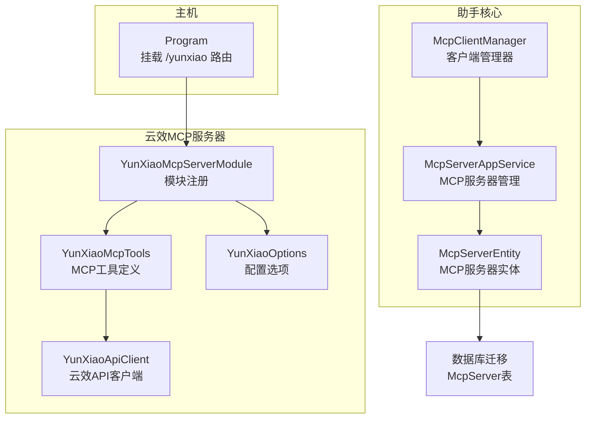
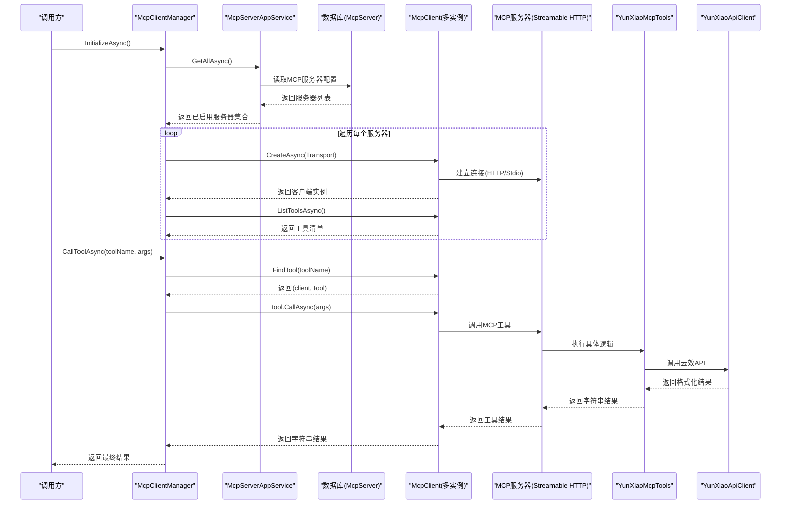
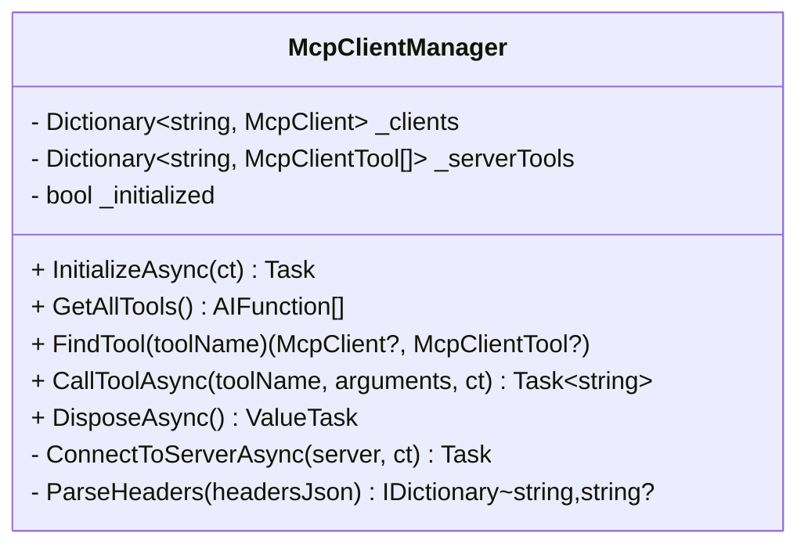
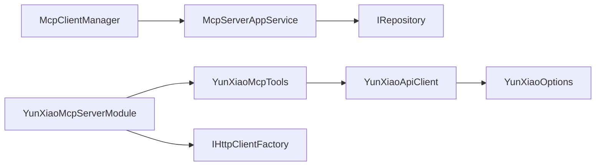

# MCP客户端管理

<cite>
**本文引用的文件**
- [McpClientManager.cs](file://src/Agent/Assistant/H.Assistant.Core/Mcp/McpClientManager.cs)
- [McpServerAppService.cs](file://src/Agent/Assistant/H.Assistant.Application/Services/McpServerAppService.cs)
- [McpServerEntity.cs](file://src/Agent/Assistant/H.Assistant.EntityFrameworkCore/Entities/McpServerEntity.cs)
- [20260607160151_McpServer.cs](file://src/Tools/H.Assistant.DbMigrator/Migrations/20260607160151_McpServer.cs)
- [YunXiaoMcpServerModule.cs](file://src/Agent/McpServers/H.Mcp.YunXiao/YunXiaoMcpServerModule.cs)
- [YunXiaoApiClient.cs](file://src/Agent/McpServers/H.Mcp.YunXiao/YunXiaoApiClient.cs)
- [YunXiaoMcpTools.cs](file://src/Agent/McpServers/H.Mcp.YunXiao/YunXiaoMcpTools.cs)
- [YunXiaoOptions.cs](file://src/Agent/McpServers/H.Mcp.YunXiao/YunXiaoOptions.cs)
- [Program.cs](file://src/Host/H.AppLab.Host.All/H.AppLab.Host.All/Program.cs)
</cite>

## 目录
1. [简介](#简介)
2. [项目结构](#项目结构)
3. [核心组件](#核心组件)
4. [架构总览](#架构总览)
5. [详细组件分析](#详细组件分析)
6. [依赖关系分析](#依赖关系分析)
7. [性能考虑](#性能考虑)
8. [故障排查指南](#故障排查指南)
9. [结论](#结论)
10. [附录：新MCP服务器集成指南与配置示例](#附录新mcp服务器集成指南与配置示例)

## 简介
本文件面向MCP（Model Context Protocol）客户端管理，系统性阐述McpClientManager的客户端生命周期管理与连接发现机制，说明MCP协议的消息格式与通信流程，解释YunXiaoMcpServer对第三方服务（云效）的集成实现，并给出MCP服务器的动态发现、注册与健康检查/自动重连策略建议。同时提供新MCP服务器集成的开发指南和配置示例，帮助开发者快速扩展新的MCP工具提供方。

## 项目结构
围绕MCP客户端管理的代码主要分布在以下模块：
- 客户端管理器：负责初始化、连接、工具发现与调用
- 应用服务：负责MCP服务器配置的CRUD与启用状态管理
- 数据实体与迁移：持久化MCP服务器元信息（名称、端点、传输类型、认证头、超时等）
- 第三方集成示例（云效）：通过MCP Server暴露工具，封装HTTP API访问与结果格式化
- 主机程序：挂载MCP路由，对外暴露MCP服务

图表来源
- [McpClientManager.cs:1-182](file://src/Agent/Assistant/H.Assistant.Core/Mcp/McpClientManager.cs#L1-L182)
- [McpServerAppService.cs:1-99](file://src/Agent/Assistant/H.Assistant.Application/Services/McpServerAppService.cs#L1-L99)
- [McpServerEntity.cs:1-55](file://src/Agent/Assistant/H.Assistant.EntityFrameworkCore/Entities/McpServerEntity.cs#L1-L55)
- [YunXiaoMcpServerModule.cs:1-30](file://src/Agent/McpServers/H.Mcp.YunXiao/YunXiaoMcpServerModule.cs#L1-L30)
- [YunXiaoMcpTools.cs:1-40](file://src/Agent/McpServers/H.Mcp.YunXiao/YunXiaoMcpTools.cs#L1-L40)
- [YunXiaoApiClient.cs:1-396](file://src/Agent/McpServers/H.Mcp.YunXiao/YunXiaoApiClient.cs#L1-L396)
- [YunXiaoOptions.cs:1-22](file://src/Agent/McpServers/H.Mcp.YunXiao/YunXiaoOptions.cs#L1-L22)
- [Program.cs:80-90](file://src/Host/H.AppLab.Host.All/H.AppLab.Host.All/Program.cs#L80-L90)
- [20260607160151_McpServer.cs:1-55](file://src/Tools/H.Assistant.DbMigrator/Migrations/20260607160151_McpServer.cs#L1-L55)

章节来源
- [McpClientManager.cs:1-182](file://src/Agent/Assistant/H.Assistant.Core/Mcp/McpClientManager.cs#L1-L182)
- [McpServerAppService.cs:1-99](file://src/Agent/Assistant/H.Assistant.Application/Services/McpServerAppService.cs#L1-L99)
- [McpServerEntity.cs:1-55](file://src/Agent/Assistant/H.Assistant.EntityFrameworkCore/Entities/McpServerEntity.cs#L1-L55)
- [YunXiaoMcpServerModule.cs:1-30](file://src/Agent/McpServers/H.Mcp.YunXiao/YunXiaoMcpServerModule.cs#L1-L30)
- [YunXiaoApiClient.cs:1-396](file://src/Agent/McpServers/H.Mcp.YunXiao/YunXiaoApiClient.cs#L1-L396)
- [YunXiaoMcpTools.cs:1-40](file://src/Agent/McpServers/H.Mcp.YunXiao/YunXiaoMcpTools.cs#L1-L40)
- [YunXiaoOptions.cs:1-22](file://src/Agent/McpServers/H.Mcp.YunXiao/YunXiaoOptions.cs#L1-L22)
- [Program.cs:80-90](file://src/Host/H.AppLab.Host.All/H.AppLab.Host.All/Program.cs#L80-L90)
- [20260607160151_McpServer.cs:1-55](file://src/Tools/H.Assistant.DbMigrator/Migrations/20260607160151_McpServer.cs#L1-L55)

## 核心组件
- McpClientManager：集中管理多个MCP客户端的生命周期，按配置连接各MCP服务器，发现并缓存工具列表，提供统一的工具查找与调用入口。
- McpServerAppService：提供MCP服务器配置的增删改查与启用/禁用能力，供前端或管理界面维护服务器元数据。
- McpServerEntity：持久化MCP服务器元数据，包括名称、显示名、端点、传输类型、认证头、超时、是否启用等。
- YunXiaoMcpServerModule：将云效MCP服务器以Streamable HTTP方式注册到依赖注入容器，绑定配置、HttpClient与MCP工具。
- YunXiaoMcpTools：声明式暴露MCP工具方法，封装云效工作项查询、搜索与项目列表获取。
- YunXiaoApiClient：基于IHttpClientFactory访问云效OpenAPI，统一设置BaseAddress与认证头，处理响应格式与错误日志。
- Program：在主机中挂载MCP路由，使外部可通过指定路径访问MCP服务。

章节来源
- [McpClientManager.cs:1-182](file://src/Agent/Assistant/H.Assistant.Core/Mcp/McpClientManager.cs#L1-L182)
- [McpServerAppService.cs:1-99](file://src/Agent/Assistant/H.Assistant.Application/Services/McpServerAppService.cs#L1-L99)
- [McpServerEntity.cs:1-55](file://src/Agent/Assistant/H.Assistant.EntityFrameworkCore/Entities/McpServerEntity.cs#L1-L55)
- [YunXiaoMcpServerModule.cs:1-30](file://src/Agent/McpServers/H.Mcp.YunXiao/YunXiaoMcpServerModule.cs#L1-L30)
- [YunXiaoMcpTools.cs:1-40](file://src/Agent/McpServers/H.Mcp.YunXiao/YunXiaoMcpTools.cs#L1-L40)
- [YunXiaoApiClient.cs:1-396](file://src/Agent/McpServers/H.Mcp.YunXiao/YunXiaoApiClient.cs#L1-L396)
- [Program.cs:80-90](file://src/Host/H.AppLab.Host.All/H.AppLab.Host.All/Program.cs#L80-L90)

## 架构总览
下图展示MCP客户端与服务器之间的交互流程，以及云效MCP工具的调用链路。

图表来源
- [McpClientManager.cs:30-104](file://src/Agent/Assistant/H.Assistant.Core/Mcp/McpClientManager.cs#L30-L104)
- [McpClientManager.cs:152-170](file://src/Agent/Assistant/H.Assistant.Core/Mcp/McpClientManager.cs#L152-L170)
- [McpServerAppService.cs:20-25](file://src/Agent/Assistant/H.Assistant.Application/Services/McpServerAppService.cs#L20-L25)
- [YunXiaoMcpTools.cs:16-38](file://src/Agent/McpServers/H.Mcp.YunXiao/YunXiaoMcpTools.cs#L16-L38)
- [YunXiaoApiClient.cs:44-86](file://src/Agent/McpServers/H.Mcp.YunXiao/YunXiaoApiClient.cs#L44-L86)

## 详细组件分析

### McpClientManager：客户端生命周期与连接池
- 生命周期
  - InitializeAsync：从McpServerAppService拉取所有服务器配置，过滤IsEnabled=true的条目，逐个ConnectToServerAsync建立连接并ListToolsAsync发现工具。
  - DisposeAsync：释放所有McpClient实例，清空内部字典。
- 连接与传输
  - 根据TransportType选择Stdio或HttpClientTransport；支持自定义Headers JSON解析与ConnectionTimeout。
- 工具发现与调用
  - 维护serverName -> tools映射，FindTool按名称定位工具与对应客户端；CallToolAsync统一调用并捕获异常返回友好消息。
- 健壮性
  - 单个服务器连接失败不影响其他服务器；初始化失败记录日志但不中断整体流程。

图表来源
- [McpClientManager.cs:11-182](file://src/Agent/Assistant/H.Assistant.Core/Mcp/McpClientManager.cs#L11-L182)

章节来源
- [McpClientManager.cs:30-104](file://src/Agent/Assistant/H.Assistant.Core/Mcp/McpClientManager.cs#L30-L104)
- [McpClientManager.cs:125-170](file://src/Agent/Assistant/H.Assistant.Core/Mcp/McpClientManager.cs#L125-L170)

### McpServerAppService：MCP服务器配置管理
- 功能
  - GetAllAsync：读取全部MCP服务器并按Name排序返回DTO。
  - CreateAsync/UpdateAsync/DeleteAsync/ToggleEnabledAsync：完成服务器配置的CRUD与启用开关。
- 数据映射
  - MapToDto将实体字段映射为DTO，包含Endpoint、TransportType、AuthToken、ApiKey、Headers、TimeoutSeconds、IsEnabled等。

章节来源
- [McpServerAppService.cs:20-79](file://src/Agent/Assistant/H.Assistant.Application/Services/McpServerAppService.cs#L20-L79)
- [McpServerAppService.cs:81-97](file://src/Agent/Assistant/H.Assistant.Application/Services/McpServerAppService.cs#L81-L97)

### McpServerEntity与数据库迁移：MCP服务器元数据模型
- 字段
  - Name（唯一）、DisplayName、Endpoint、TransportType、AuthToken、ApiKey、Headers、TimeoutSeconds、IsEnabled、CreationTime、CreatorId。
- 索引
  - IsEnabled、Name（唯一）。
- 用途
  - 作为MCP服务器配置的数据源，被McpServerAppService读写，被McpClientManager消费用于连接。

章节来源
- [McpServerEntity.cs:8-54](file://src/Agent/Assistant/H.Assistant.EntityFrameworkCore/Entities/McpServerEntity.cs#L8-L54)
- [20260607160151_McpServer.cs:14-46](file://src/Tools/H.Assistant.DbMigrator/Migrations/20260607160151_McpServer.cs#L14-L46)

### YunXiaoMcpServerModule：第三方服务集成模块
- 配置绑定
  - 将YunXiaoOptions绑定到配置节“YunXiao”，包含OrganizationId、PersonalAccessToken、Endpoint。
- 服务注册
  - 使用IHttpClientFactory注册命名HttpClient“YunXiao”。
  - 注册YunXiaoApiClient单例/瞬态（此处为Transient）。
  - 使用AddMcpServer().WithHttpTransport().WithTools<YunXiaoMcpTools>()暴露MCP工具。

章节来源
- [YunXiaoMcpServerModule.cs:9-28](file://src/Agent/McpServers/H.Mcp.YunXiao/YunXiaoMcpServerModule.cs#L9-L28)
- [YunXiaoOptions.cs:3-21](file://src/Agent/McpServers/H.Mcp.YunXiao/YunXiaoOptions.cs#L3-L21)

### YunXiaoMcpTools：MCP工具定义
- 工具方法
  - GetWorkItemInfo：获取工作项详情，参数spaceIdentifier、workitemId、spaceType。
  - SearchWorkItems：搜索工作项列表，支持keyword与category筛选。
  - ListProjects：获取当前企业下的项目列表。
- 返回值
  - 均返回字符串，便于AI消费结构化摘要与完整JSON。

章节来源
- [YunXiaoMcpTools.cs:16-38](file://src/Agent/McpServers/H.Mcp.YunXiao/YunXiaoMcpTools.cs#L16-L38)

### YunXiaoApiClient：云效API客户端
- 认证与基础配置
  - BaseAddress指向Endpoint，默认请求头添加x-yunxiao-token（PAT），Accept为application/json。
- 接口实现
  - GetWorkItemInfoAsync：GET工作项详情，校验HTML响应，格式化输出。
  - SearchWorkItemsAsync：POST搜索，兼容数组或对象包裹响应，提取分页总数头。
  - ListProjectsAsync：GET项目列表，失败时回退备用接口路径，统一格式化。
- 错误处理
  - 非成功状态码记录错误日志并返回友好提示；HTML响应视为认证或URL问题。

章节来源
- [YunXiaoApiClient.cs:24-38](file://src/Agent/McpServers/H.Mcp.YunXiao/YunXiaoApiClient.cs#L24-L38)
- [YunXiaoApiClient.cs:44-86](file://src/Agent/McpServers/H.Mcp.YunXiao/YunXiaoApiClient.cs#L44-L86)
- [YunXiaoApiClient.cs:92-195](file://src/Agent/McpServers/H.Mcp.YunXiao/YunXiaoApiClient.cs#L92-L195)
- [YunXiaoApiClient.cs:201-250](file://src/Agent/McpServers/H.Mcp.YunXiao/YunXiaoApiClient.cs#L201-L250)

### Program：主机路由挂载
- 在Web应用中挂载MCP路由，允许匿名访问，路径为/yunxiao。

章节来源
- [Program.cs:87-89](file://src/Host/H.AppLab.Host.All/H.AppLab.Host.All/Program.cs#L87-L89)

## 依赖关系分析
- McpClientManager依赖IMcpServerAppService获取服务器配置，依赖McpClient进行连接与工具调用。
- McpServerAppService依赖IRepository<McpServerEntity>进行数据存取。
- YunXiaoMcpServerModule依赖IConfiguration、IHttpClientFactory与MCP框架扩展。
- YunXiaoMcpTools依赖YunXiaoApiClient。
- YunXiaoApiClient依赖IHttpClientFactory与YunXiaoOptions。

图表来源
- [McpClientManager.cs:19-25](file://src/Agent/Assistant/H.Assistant.Core/Mcp/McpClientManager.cs#L19-L25)
- [McpServerAppService.cs:13-18](file://src/Agent/Assistant/H.Assistant.Application/Services/McpServerAppService.cs#L13-L18)
- [YunXiaoMcpServerModule.cs:11-21](file://src/Agent/McpServers/H.Mcp.YunXiao/YunXiaoMcpServerModule.cs#L11-L21)
- [YunXiaoMcpTools.cs:9-14](file://src/Agent/McpServers/H.Mcp.YunXiao/YunXiaoMcpTools.cs#L9-L14)
- [YunXiaoApiClient.cs:24-31](file://src/Agent/McpServers/H.Mcp.YunXiao/YunXiaoApiClient.cs#L24-L31)

章节来源
- [McpClientManager.cs:19-25](file://src/Agent/Assistant/H.Assistant.Core/Mcp/McpClientManager.cs#L19-L25)
- [McpServerAppService.cs:13-18](file://src/Agent/Assistant/H.Assistant.Application/Services/McpServerAppService.cs#L13-L18)
- [YunXiaoMcpServerModule.cs:11-21](file://src/Agent/McpServers/H.Mcp.YunXiao/YunXiaoMcpServerModule.cs#L11-L21)
- [YunXiaoMcpTools.cs:9-14](file://src/Agent/McpServers/H.Mcp.YunXiao/YunXiaoMcpTools.cs#L9-L14)
- [YunXiaoApiClient.cs:24-31](file://src/Agent/McpServers/H.Mcp.YunXiao/YunXiaoApiClient.cs#L24-L31)

## 性能考虑
- 连接复用
  - 使用IHttpClientFactory管理HttpClient，避免套接字耗尽与DNS刷新问题。
- 超时控制
  - McpClientManager为每个连接设置ConnectionTimeout，防止阻塞初始化。
- 工具发现缓存
  - 启动时一次性ListToolsAsync并缓存，减少重复网络开销。
- 异步与取消
  - 全链路支持CancellationToken，提升可取消性与资源释放效率。
- 序列化优化
  - YunXiaoApiClient使用JsonSerializerOptions减少不必要的属性写入，降低序列化开销。

[本节为通用性能建议，不直接分析具体文件]

## 故障排查指南
- 连接失败
  - 检查Endpoint是否正确、TransportType是否匹配（HTTP/Stdio）。
  - 查看McpClientManager日志中的警告与错误信息。
- 工具未找到
  - 确认服务器已启用且成功连接；检查工具名称是否一致。
- 云效API错误
  - 检查PersonalAccessToken是否有效、OrganizationId是否正确。
  - 若返回HTML而非JSON，通常为认证失败或URL不正确。
- 超时问题
  - 调整McpServerEntity.TimeoutSeconds或McpClientManager的连接超时。

章节来源
- [McpClientManager.cs:45-57](file://src/Agent/Assistant/H.Assistant.Core/Mcp/McpClientManager.cs#L45-L57)
- [McpClientManager.cs:165-170](file://src/Agent/Assistant/H.Assistant.Core/Mcp/McpClientManager.cs#L165-L170)
- [YunXiaoApiClient.cs:58-86](file://src/Agent/McpServers/H.Mcp.YunXiao/YunXiaoApiClient.cs#L58-L86)

## 结论
McpClientManager提供了健壮的MCP客户端生命周期管理与工具发现机制，结合McpServerAppService与McpServerEntity实现了灵活的服务器配置管理。YunXiaoMcpServerModule与YunXiaoMcpTools展示了如何以MCP协议暴露第三方服务工具，并通过YunXiaoApiClient稳定地访问云效API。建议在后续版本中增强健康检查与自动重连策略，以提升系统的鲁棒性与可用性。

[本节为总结性内容，不直接分析具体文件]

## 附录：新MCP服务器集成指南与配置示例

### 新增MCP服务器步骤
- 创建模块
  - 新建AbpModule，绑定配置、注册HttpClient与MCP Server及工具类。
- 定义工具类
  - 使用[McpServerTool]与Description注解声明工具方法与参数描述。
- 配置选项
  - 定义YunXiaoOptions类似的配置类，绑定到配置节。
- 主机挂载
  - 在Program中确保MCP路由已挂载（如/yunxiao）。

章节来源
- [YunXiaoMcpServerModule.cs:9-28](file://src/Agent/McpServers/H.Mcp.YunXiao/YunXiaoMcpServerModule.cs#L9-L28)
- [YunXiaoMcpTools.cs:16-38](file://src/Agent/McpServers/H.Mcp.YunXiao/YunXiaoMcpTools.cs#L16-L38)
- [Program.cs:87-89](file://src/Host/H.AppLab.Host.All/H.AppLab.Host.All/Program.cs#L87-L89)

### 配置示例（YunXiao）
- 配置节名称：YunXiao
- 必填字段
  - OrganizationId：企业标识
  - PersonalAccessToken：个人访问令牌
  - Endpoint：云效API端点（默认https://openapi-rdc.aliyuncs.com）

章节来源
- [YunXiaoOptions.cs:5-21](file://src/Agent/McpServers/H.Mcp.YunXiao/YunXiaoOptions.cs#L5-L21)

### 健康检查与自动重连策略（建议）
- 健康检查
  - 定期调用MCP服务器的ListTools或轻量Ping接口，记录状态与延迟。
  - 对失败的服务器标记为不可用，停止分配流量。
- 自动重连
  - 当检测到连接断开或工具调用失败时，触发指数退避重连。
  - 重连成功后恢复工具发现与调用。
- 监控与告警
  - 记录连接状态、重试次数、失败原因，接入日志与监控系统。

[本节为概念性建议，不直接分析具体文件]