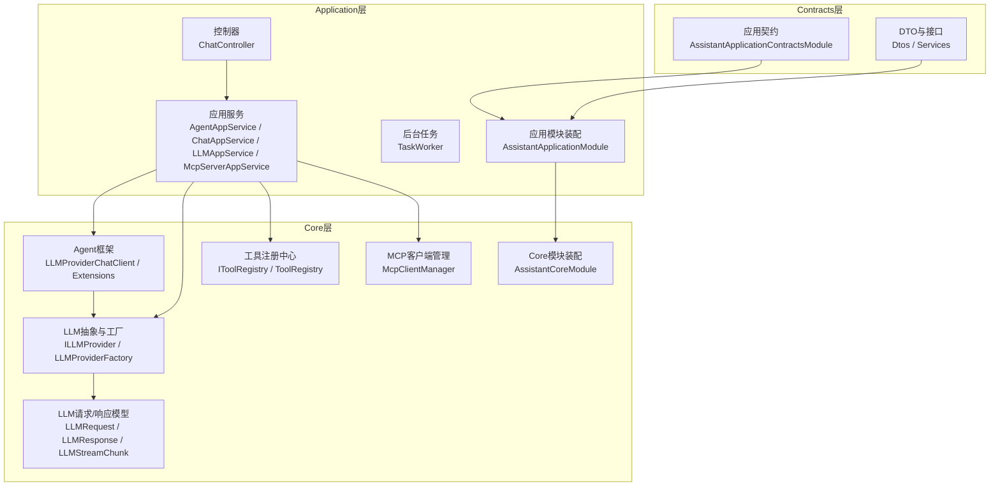
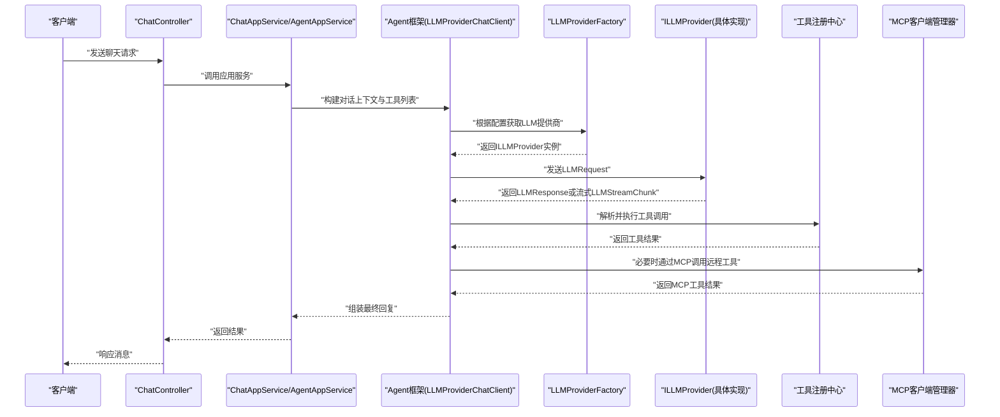
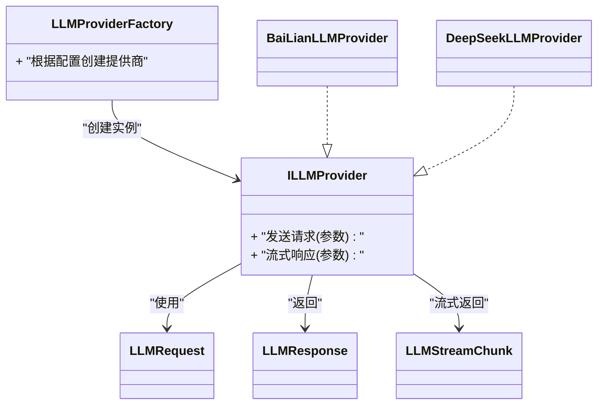
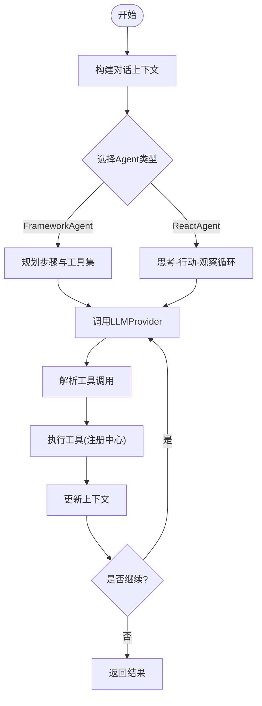
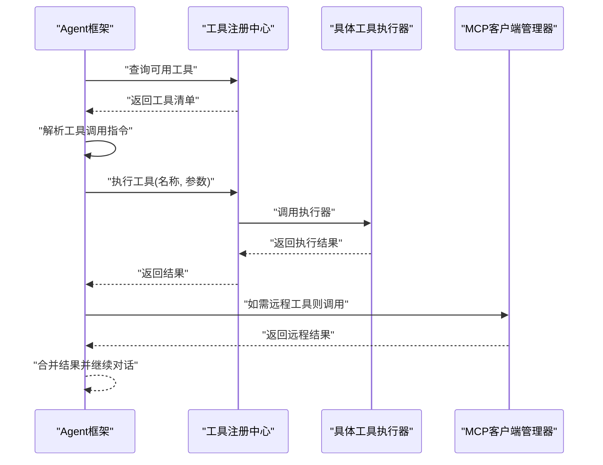
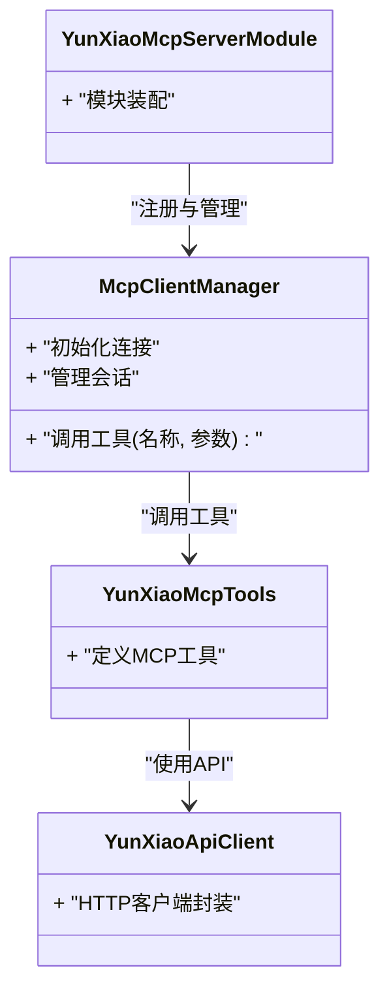
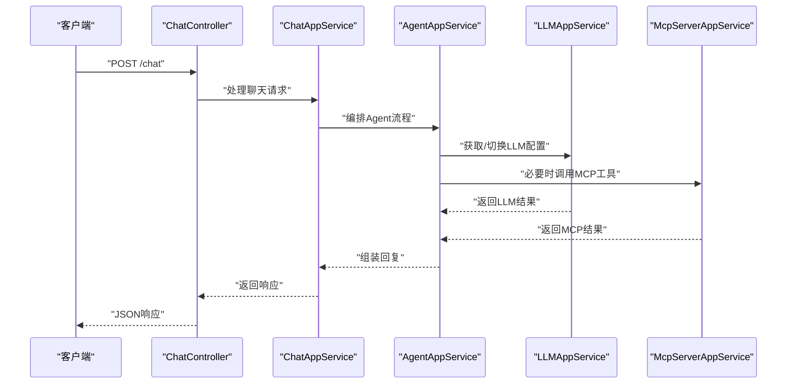
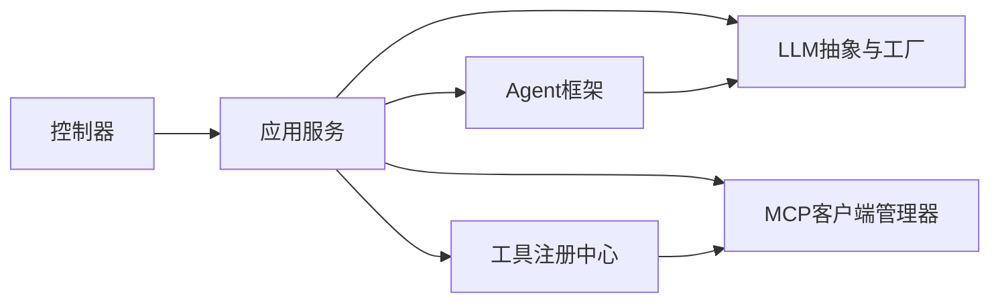

# 助手架构设计

<cite>
**本文引用的文件**   
- [AssistantApplicationModule.cs](file://src/Agent/Assistant/H.Assistant.Application/AssistantApplicationModule.cs)
- [ChatController.cs](file://src/Agent/Assistant/H.Assistant.Application/Controllers/ChatController.cs)
- [AgentAppService.cs](file://src/Agent/Assistant/H.Assistant.Application/Services/AgentAppService.cs)
- [ChatAppService.cs](file://src/Agent/Assistant/H.Assistant.Application/Services/ChatAppService.cs)
- [LLMAppService.cs](file://src/Agent/Assistant/H.Assistant.Application/Services/LLMAppService.cs)
- [McpServerAppService.cs](file://src/Agent/Assistant/H.Assistant.Application/Services/McpServerAppService.cs)
- [TaskWorker.cs](file://src/Agent/Assistant/H.Assistant.Application/Workers/TaskWorker.cs)
- [AssistantCoreModule.cs](file://src/Agent/Assistant/H.Assistant.Core/AssistantCoreModule.cs)
- [ILLMProvider.cs](file://src/Agent/Assistant/H.Assistant.Core/LLM/ILLMProvider.cs)
- [LLMProviderFactory.cs](file://src/Agent/Assistant/H.Assistant.Core/LLM/LLMProviderFactory.cs)
- [LLMRequest.cs](file://src/Agent/Assistant/H.Assistant.Core/LLM/LLMRequest.cs)
- [LLMResponse.cs](file://src/Agent/Assistant/H.Assistant.Core/LLM/LLMResponse.cs)
- [LLMStreamChunk.cs](file://src/Agent/Assistant/H.Assistant.Core/LLM/LLMStreamChunk.cs)
- [BaiLianLLMProvider.cs](file://src/Agent/Assistant/H.Assistant.Core/LLM/Providers/BaiLianLLMProvider.cs)
- [DeepSeekLLMProvider.cs](file://src/Agent/Assistant/H.Assistant.Core/LLM/Providers/DeepSeekLLMProvider.cs)
- [LLMProviderChatClient.cs](file://src/Agent/Assistant/H.Assistant.Core/Agents/LLMProviderChatClient.cs)
- [LLMProviderExtensions.cs](file://src/Agent/Assistant/H.Assistant.Core/Agents/LLMProviderExtensions.cs)
- [YunXiaoMcpTools.cs](file://src/Agent/McpServers/H.Mcp.YunXiao/YunXiaoMcpTools.cs)
- [YunXiaoApiClient.cs](file://src/Agent/McpServers/H.Mcp.YunXiao/YunXiaoApiClient.cs)
- [YunXiaoMcpServerModule.cs](file://src/Agent/McpServers/H.Mcp.YunXiao/YunXiaoMcpServerModule.cs)
</cite>

## 目录
1. [简介](#简介)
2. [项目结构](#项目结构)
3. [核心组件](#核心组件)
4. [架构总览](#架构总览)
5. [详细组件分析](#详细组件分析)
6. [依赖关系分析](#依赖关系分析)
7. [性能考虑](#性能考虑)
8. [故障排查指南](#故障排查指南)
9. [结论](#结论)
10. [附录](#附录)

## 简介
本文件面向AI助手服务的架构设计与实现，围绕Core层、Application层与Contracts层的职责划分进行系统化说明。重点阐述智能体（Agent）框架的设计模式（如FrameworkAgent与ReactAgent的实现思路）、LLM提供商的抽象与扩展机制、工具函数的注册与执行流程，以及MCP客户端管理器的作用与工作流。文档包含架构图与数据流图，帮助开发者快速理解各组件间的交互关系与扩展点。

## 项目结构
助手服务采用分层模块化架构：
- Contracts层：定义DTO、接口契约与模块标记类，供应用层与外部调用方使用。
- Application层：编排业务用例，暴露控制器与服务，协调Core能力与外部系统。
- Core层：封装领域能力与基础设施抽象，包括Agent框架、LLM抽象、工具注册中心、MCP客户端管理等。

**图示来源** 
- [AssistantApplicationModule.cs:1-48](file://src/Agent/Assistant/H.Assistant.Application/AssistantApplicationModule.cs#L1-L48)
- [AssistantCoreModule.cs:1-12](file://src/Agent/Assistant/H.Assistant.Core/AssistantCoreModule.cs#L1-L12)

**章节来源**
- [AssistantApplicationModule.cs:1-48](file://src/Agent/Assistant/H.Assistant.Application/AssistantApplicationModule.cs#L1-L48)
- [AssistantCoreModule.cs:1-12](file://src/Agent/Assistant/H.Assistant.Core/AssistantCoreModule.cs#L1-L12)

## 核心组件
- 应用模块装配（AssistantApplicationModule）
  - 负责注册LLMProviderFactory、工具注册中心（单例）、MCP客户端管理器（单例）、Agent工厂（瞬态）与定时任务Worker。
  - 通过AutoMapper配置映射，统一DTO转换。
- 控制器与应用服务
  - ChatController对外暴露聊天入口；AgentAppService、ChatAppService、LLMAppService、McpServerAppService分别承担智能体编排、对话流程、LLM管理与MCP服务器管理的用例编排。
- Core能力
  - Agent框架：基于LLMProviderChatClient与扩展方法提供统一的对话与工具调用能力。
  - LLM抽象：ILLMProvider定义统一接口，LLMProviderFactory按配置选择具体实现；LLMRequest/LLMResponse/LLMStreamChunk描述请求与流式响应模型。
  - 工具注册中心：集中管理工具元数据与执行器，支持动态发现与执行。
  - MCP客户端管理器：统一管理MCP服务端连接与工具调用。

**章节来源**
- [AssistantApplicationModule.cs:1-48](file://src/Agent/Assistant/H.Assistant.Application/AssistantApplicationModule.cs#L1-L48)
- [ChatController.cs](file://src/Agent/Assistant/H.Assistant.Application/Controllers/ChatController.cs)
- [AgentAppService.cs](file://src/Agent/Assistant/H.Assistant.Application/Services/AgentAppService.cs)
- [ChatAppService.cs](file://src/Agent/Assistant/H.Assistant.Application/Services/ChatAppService.cs)
- [LLMAppService.cs](file://src/Agent/Assistant/H.Assistant.Application/Services/LLMAppService.cs)
- [McpServerAppService.cs](file://src/Agent/Assistant/H.Assistant.Application/Services/McpServerAppService.cs)
- [TaskWorker.cs](file://src/Agent/Assistant/H.Assistant.Application/Workers/TaskWorker.cs)

## 架构总览
整体架构遵循“应用编排—核心能力—外部集成”的分层模式：
- 控制器与应用服务作为编排层，接收用户请求并驱动Core能力。
- Core层提供Agent框架、LLM抽象、工具注册与MCP客户端管理，屏蔽底层差异。
- 外部集成包括LLM提供商与MCP服务端（如云小MCP），通过抽象与工厂机制解耦。

**图示来源** 
- [ChatController.cs](file://src/Agent/Assistant/H.Assistant.Application/Controllers/ChatController.cs)
- [ChatAppService.cs](file://src/Agent/Assistant/H.Assistant.Application/Services/ChatAppService.cs)
- [AgentAppService.cs](file://src/Agent/Assistant/H.Assistant.Application/Services/AgentAppService.cs)
- [LLMProviderChatClient.cs](file://src/Agent/Assistant/H.Assistant.Core/Agents/LLMProviderChatClient.cs)
- [LLMProviderFactory.cs](file://src/Agent/Assistant/H.Assistant.Core/LLM/LLMProviderFactory.cs)
- [ILLMProvider.cs](file://src/Agent/Assistant/H.Assistant.Core/LLM/ILLMProvider.cs)
- [LLMRequest.cs](file://src/Agent/Assistant/H.Assistant.Core/LLM/LLMRequest.cs)
- [LLMResponse.cs](file://src/Agent/Assistant/H.Assistant.Core/LLM/LLMResponse.cs)
- [LLMStreamChunk.cs](file://src/Agent/Assistant/H.Assistant.Core/LLM/LLMStreamChunk.cs)

## 详细组件分析

### LLM提供商抽象与扩展机制
- ILLMProvider定义统一的对话与流式输出接口，屏蔽不同厂商的差异。
- LLMProviderFactory根据配置选择具体实现（如百炼、DeepSeek等）。
- 新增提供商只需实现ILLMProvider并通过工厂注册即可接入。

**图示来源** 
- [ILLMProvider.cs](file://src/Agent/Assistant/H.Assistant.Core/LLM/ILLMProvider.cs)
- [LLMProviderFactory.cs](file://src/Agent/Assistant/H.Assistant.Core/LLM/LLMProviderFactory.cs)
- [BaiLianLLMProvider.cs](file://src/Agent/Assistant/H.Assistant.Core/LLM/Providers/BaiLianLLMProvider.cs)
- [DeepSeekLLMProvider.cs](file://src/Agent/Assistant/H.Assistant.Core/LLM/Providers/DeepSeekLLMProvider.cs)
- [LLMRequest.cs](file://src/Agent/Assistant/H.Assistant.Core/LLM/LLMRequest.cs)
- [LLMResponse.cs](file://src/Agent/Assistant/H.Assistant.Core/LLM/LLMResponse.cs)
- [LLMStreamChunk.cs](file://src/Agent/Assistant/H.Assistant.Core/LLM/LLMStreamChunk.cs)

**章节来源**
- [ILLMProvider.cs](file://src/Agent/Assistant/H.Assistant.Core/LLM/ILLMProvider.cs)
- [LLMProviderFactory.cs](file://src/Agent/Assistant/H.Assistant.Core/LLM/LLMProviderFactory.cs)
- [BaiLianLLMProvider.cs](file://src/Agent/Assistant/H.Assistant.Core/LLM/Providers/BaiLianLLMProvider.cs)
- [DeepSeekLLMProvider.cs](file://src/Agent/Assistant/H.Assistant.Core/LLM/Providers/DeepSeekLLMProvider.cs)
- [LLMRequest.cs](file://src/Agent/Assistant/H.Assistant.Core/LLM/LLMRequest.cs)
- [LLMResponse.cs](file://src/Agent/Assistant/H.Assistant.Core/LLM/LLMResponse.cs)
- [LLMStreamChunk.cs](file://src/Agent/Assistant/H.Assistant.Core/LLM/LLMStreamChunk.cs)

### 智能体(Agent)框架：FrameworkAgent与ReactAgent
- FrameworkAgent：以框架化方式组织对话轮次，维护上下文、工具集与策略，适合复杂多步推理场景。
- ReactAgent：基于“思考-行动-观察”循环，强调即时工具调用与反馈，适合快速响应与外部系统集成。
- LLMProviderChatClient与扩展方法为两类Agent提供统一的LLM调用与工具执行能力。

**图示来源** 
- [LLMProviderChatClient.cs](file://src/Agent/Assistant/H.Assistant.Core/Agents/LLMProviderChatClient.cs)
- [LLMProviderExtensions.cs](file://src/Agent/Assistant/H.Assistant.Core/Agents/LLMProviderExtensions.cs)

**章节来源**
- [LLMProviderChatClient.cs](file://src/Agent/Assistant/H.Assistant.Core/Agents/LLMProviderChatClient.cs)
- [LLMProviderExtensions.cs](file://src/Agent/Assistant/H.Assistant.Core/Agents/LLMProviderExtensions.cs)

### 工具函数注册与执行机制
- 工具注册中心（IToolRegistry/ToolRegistry）集中管理工具元数据与执行器，支持动态注册与发现。
- Agent在对话过程中解析LLM输出的工具调用指令，交由注册中心执行并回写结果到上下文。
- 可结合MCP客户端管理器调用远程工具，增强工具生态。

**图示来源** 
- [AssistantApplicationModule.cs:1-48](file://src/Agent/Assistant/H.Assistant.Application/AssistantApplicationModule.cs#L1-L48)

**章节来源**
- [AssistantApplicationModule.cs:1-48](file://src/Agent/Assistant/H.Assistant.Application/AssistantApplicationModule.cs#L1-L48)

### MCP客户端管理器与云小MCP集成
- McpClientManager统一管理MCP服务端连接与会话，提供工具调用的统一入口。
- 云小MCP示例展示了如何定义MCP工具、API客户端与模块装配，便于扩展更多MCP服务端。

**图示来源** 
- [YunXiaoMcpTools.cs](file://src/Agent/McpServers/H.Mcp.YunXiao/YunXiaoMcpTools.cs)
- [YunXiaoApiClient.cs](file://src/Agent/McpServers/H.Mcp.YunXiao/YunXiaoApiClient.cs)
- [YunXiaoMcpServerModule.cs](file://src/Agent/McpServers/H.Mcp.YunXiao/YunXiaoMcpServerModule.cs)

**章节来源**
- [YunXiaoMcpTools.cs](file://src/Agent/McpServers/H.Mcp.YunXiao/YunXiaoMcpTools.cs)
- [YunXiaoApiClient.cs](file://src/Agent/McpServers/H.Mcp.YunXiao/YunXiaoApiClient.cs)
- [YunXiaoMcpServerModule.cs](file://src/Agent/McpServers/H.Mcp.YunXiao/YunXiaoMcpServerModule.cs)

### 应用服务与控制器协作
- ChatController作为HTTP入口，将请求转发至ChatAppService/AgentAppService。
- LLMAppService负责LLM配置与生命周期管理；McpServerAppService负责MCP服务端相关操作。
- TaskWorker作为后台任务，处理异步任务与调度。

**图示来源** 
- [ChatController.cs](file://src/Agent/Assistant/H.Assistant.Application/Controllers/ChatController.cs)
- [ChatAppService.cs](file://src/Agent/Assistant/H.Assistant.Application/Services/ChatAppService.cs)
- [AgentAppService.cs](file://src/Agent/Assistant/H.Assistant.Application/Services/AgentAppService.cs)
- [LLMAppService.cs](file://src/Agent/Assistant/H.Assistant.Application/Services/LLMAppService.cs)
- [McpServerAppService.cs](file://src/Agent/Assistant/H.Assistant.Application/Services/McpServerAppService.cs)
- [TaskWorker.cs](file://src/Agent/Assistant/H.Assistant.Application/Workers/TaskWorker.cs)

**章节来源**
- [ChatController.cs](file://src/Agent/Assistant/H.Assistant.Application/Controllers/ChatController.cs)
- [ChatAppService.cs](file://src/Agent/Assistant/H.Assistant.Application/Services/ChatAppService.cs)
- [AgentAppService.cs](file://src/Agent/Assistant/H.Assistant.Application/Services/AgentAppService.cs)
- [LLMAppService.cs](file://src/Agent/Assistant/H.Assistant.Application/Services/LLMAppService.cs)
- [McpServerAppService.cs](file://src/Agent/Assistant/H.Assistant.Application/Services/McpServerAppService.cs)
- [TaskWorker.cs](file://src/Agent/Assistant/H.Assistant.Application/Workers/TaskWorker.cs)

## 依赖关系分析
- 应用层依赖Core层提供的Agent框架、LLM抽象、工具注册与MCP管理。
- Core层通过工厂与接口解耦具体实现，便于扩展新的LLM提供商与MCP服务端。
- 模块装配确保服务生命周期正确（单例/瞬态）与依赖注入生效。

**图示来源** 
- [AssistantApplicationModule.cs:1-48](file://src/Agent/Assistant/H.Assistant.Application/AssistantApplicationModule.cs#L1-L48)
- [AssistantCoreModule.cs:1-12](file://src/Agent/Assistant/H.Assistant.Core/AssistantCoreModule.cs#L1-L12)

**章节来源**
- [AssistantApplicationModule.cs:1-48](file://src/Agent/Assistant/H.Assistant.Application/AssistantApplicationModule.cs#L1-L48)
- [AssistantCoreModule.cs:1-12](file://src/Agent/Assistant/H.Assistant.Core/AssistantCoreModule.cs#L1-L12)

## 性能考虑
- 流式响应：利用LLMStreamChunk实现增量输出，降低首字延迟，提升用户体验。
- 单例与瞬态：工具注册中心与MCP客户端管理器使用单例减少连接开销；Agent工厂使用瞬态避免状态污染。
- 并发与超时：在LLM调用与MCP工具执行中设置合理超时与重试策略，避免阻塞。
- 缓存与批处理：对频繁使用的工具结果与LLM提示词进行缓存，提高吞吐。

[本节为通用指导，不直接分析具体文件]

## 故障排查指南
- LLM调用失败
  - 检查LLMProviderFactory配置与具体实现是否正确注册。
  - 查看LLMRequest/LLMResponse错误码与异常信息。
- 工具执行异常
  - 确认工具已在注册中心正确注册且参数匹配。
  - 若涉及MCP工具，检查MCP客户端连接状态与远端可用性。
- 对话中断或无响应
  - 检查Agent框架上下文是否被正确维护。
  - 确认后台任务Worker是否正常调度与日志记录。

**章节来源**
- [LLMProviderFactory.cs](file://src/Agent/Assistant/H.Assistant.Core/LLM/LLMProviderFactory.cs)
- [LLMRequest.cs](file://src/Agent/Assistant/H.Assistant.Core/LLM/LLMRequest.cs)
- [LLMResponse.cs](file://src/Agent/Assistant/H.Assistant.Core/LLM/LLMResponse.cs)
- [TaskWorker.cs](file://src/Agent/Assistant/H.Assistant.Application/Workers/TaskWorker.cs)

## 结论
该助手架构通过清晰的层次划分与抽象设计，实现了可扩展的智能体框架、灵活的LLM提供商接入与强大的工具生态。应用层专注用例编排，Core层提供稳定可靠的基础能力，配合MCP客户端管理器打通外部系统。开发者可按需扩展新的LLM提供商与MCP服务端，快速构建多样化的AI助手应用。

[本节为总结性内容，不直接分析具体文件]

## 附录
- 扩展新LLM提供商
  - 实现ILLMProvider接口，并在工厂中注册对应配置。
- 扩展MCP工具
  - 参考云小MCP示例，定义工具元数据与API客户端，完成模块装配。
- 自定义Agent策略
  - 基于LLMProviderChatClient与扩展方法，实现特定工作流与工具编排逻辑。

[本节为补充说明，不直接分析具体文件]