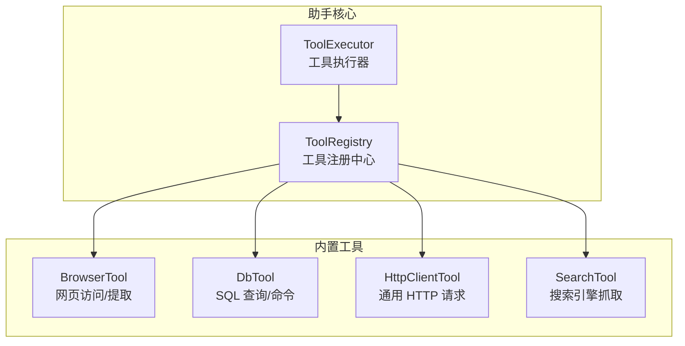
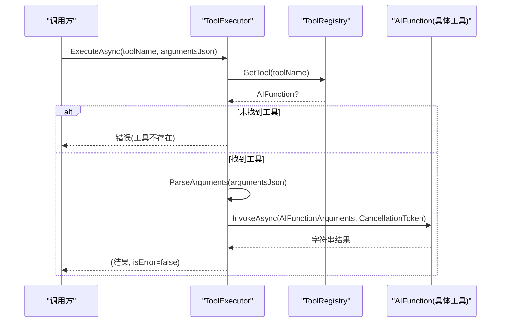
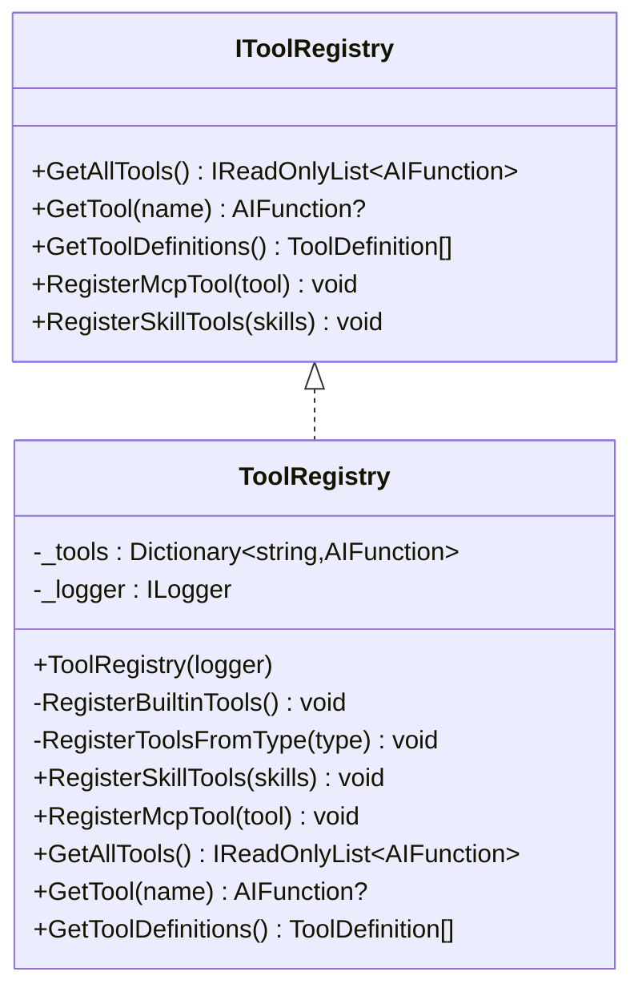
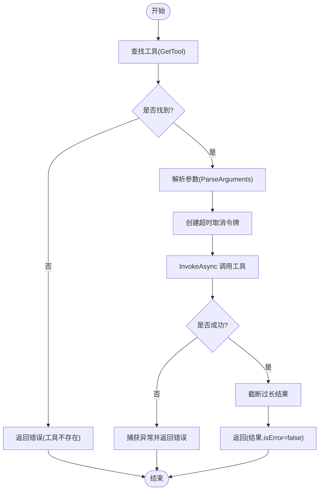
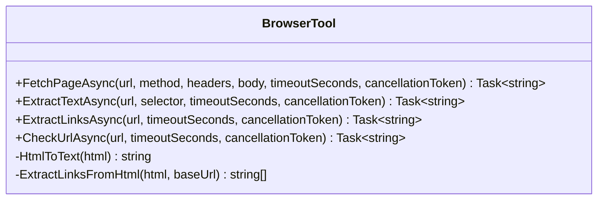
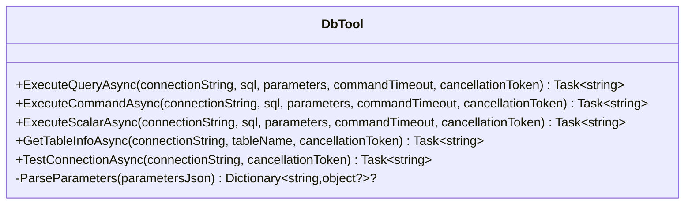
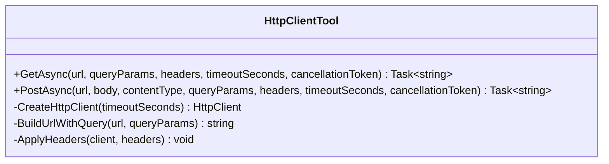
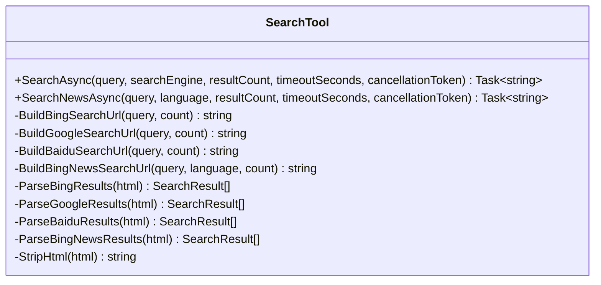
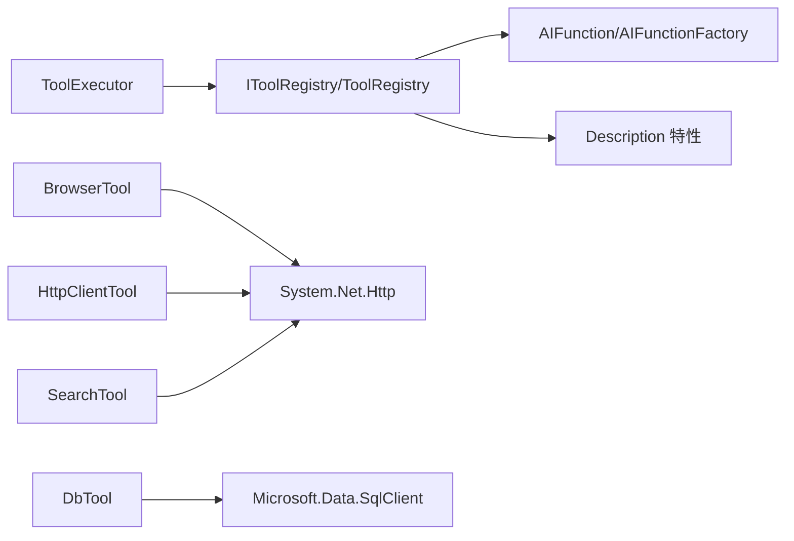

# 工具系统架构

<cite>
**本文引用的文件**   
- [IToolRegistry.cs](file://src/Agent/Assistant/H.Assistant.Core/Tools/IToolRegistry.cs)
- [ToolRegistry.cs](file://src/Agent/Assistant/H.Assistant.Core/Tools/ToolRegistry.cs)
- [ToolExecutor.cs](file://src/Agent/Assistant/H.Assistant.Core/Agents/ToolExecutor.cs)
- [BrowserTool.cs](file://src/Agent/Assistant/H.Assistant.Core/Tools/BrowserTool.cs)
- [DbTool.cs](file://src/Agent/Assistant/H.Assistant.Core/Tools/DbTool.cs)
- [HttpClientTool.cs](file://src/Agent/Assistant/H.Assistant.Core/Tools/HttpClientTool.cs)
- [SearchTool.cs](file://src/Agent/Assistant/H.Assistant.Core/Tools/SearchTool.cs)
</cite>

## 目录
1. [简介](#简介)
2. [项目结构](#项目结构)
3. [核心组件](#核心组件)
4. [架构总览](#架构总览)
5. [详细组件分析](#详细组件分析)
6. [依赖关系分析](#依赖关系分析)
7. [性能考虑](#性能考虑)
8. [故障排查指南](#故障排查指南)
9. [结论](#结论)
10. [附录：自定义工具开发最佳实践](#附录自定义工具开发最佳实践)

## 简介
本文件面向“工具系统”的架构与实现，重点阐述以下方面：
- IToolRegistry 接口的工具注册与管理机制
- ToolExecutor 的工具执行引擎与参数解析逻辑
- 内置工具 BrowserTool、DbTool、HttpClientTool、SearchTool 的实现原理
- 工具的权限控制与安全沙箱机制（基于现有代码的分析与建议）
- 异步执行与错误处理策略
- 自定义工具开发的完整示例与最佳实践

## 项目结构
工具系统位于 Assistant 核心模块中，围绕 Microsoft.Extensions.AI 的 AIFunction 能力构建。关键目录与职责如下：
- Tools：定义工具接口与具体工具实现（浏览器、数据库、HTTP 客户端、搜索等）
- Agents：包含工具执行器，负责查找工具、解析参数、调用并返回结果
- 注册中心：ToolRegistry 提供反射扫描、技能动态加载、MCP 工具注入等能力

**图示来源** 
- [ToolRegistry.cs:14-42](file://src/Agent/Assistant/H.Assistant.Core/Tools/ToolRegistry.cs#L14-L42)
- [ToolExecutor.cs:10-29](file://src/Agent/Assistant/H.Assistant.Core/Agents/ToolExecutor.cs#L10-L29)
- [BrowserTool.cs:11-29](file://src/Agent/Assistant/H.Assistant.Core/Tools/BrowserTool.cs#L11-L29)
- [DbTool.cs:11-20](file://src/Agent/Assistant/H.Assistant.Core/Tools/DbTool.cs#L11-L20)
- [HttpClientTool.cs:10-20](file://src/Agent/Assistant/H.Assistant.Core/Tools/HttpClientTool.cs#L10-L20)
- [SearchTool.cs:10-25](file://src/Agent/Assistant/H.Assistant.Core/Tools/SearchTool.cs#L10-L25)

**章节来源**
- [ToolRegistry.cs:14-42](file://src/Agent/Assistant/H.Assistant.Core/Tools/ToolRegistry.cs#L14-L42)
- [ToolExecutor.cs:10-29](file://src/Agent/Assistant/H.Assistant.Core/Agents/ToolExecutor.cs#L10-L29)

## 核心组件
- IToolRegistry：定义工具注册中心的契约，包括获取全部工具、按名称检索、生成 OpenAI 格式工具定义、注册 MCP 工具、从技能定义批量注册工具。
- ToolRegistry：实现上述契约，支持：
  - 内置工具反射注册（扫描带 Description 特性的 public static 方法）
  - 技能动态注册（通过类型名反射加载并扫描方法）
  - MCP 工具注入（直接注册 AIFunction）
  - 生成 ToolDefinition 列表（用于 LLM tools 参数）
- ToolExecutor：工具执行引擎，负责：
  - 根据工具名查找 AIFunction
  - 解析 JSON 参数为字典
  - 设置超时与取消令牌
  - 调用 AIFunction.InvokeAsync 并统一截断过长结果
  - 捕获异常并返回结构化错误信息

**章节来源**
- [IToolRegistry.cs:9-35](file://src/Agent/Assistant/H.Assistant.Core/Tools/IToolRegistry.cs#L9-L35)
- [ToolRegistry.cs:14-204](file://src/Agent/Assistant/H.Assistant.Core/Tools/ToolRegistry.cs#L14-L204)
- [ToolExecutor.cs:10-102](file://src/Agent/Assistant/H.Assistant.Core/Agents/ToolExecutor.cs#L10-L102)

## 架构总览
下图展示了从上层调用到工具执行的端到端流程，以及注册中心如何发现与暴露工具。

**图示来源** 
- [ToolExecutor.cs:34-82](file://src/Agent/Assistant/H.Assistant.Core/Agents/ToolExecutor.cs#L34-L82)
- [ToolRegistry.cs:151-157](file://src/Agent/Assistant/H.Assistant.Core/Tools/ToolRegistry.cs#L151-L157)

## 详细组件分析

### IToolRegistry 与 ToolRegistry：工具注册与管理
- 注册方式
  - 内置工具：构造时自动扫描指定类型的 public static 方法，要求方法标注 Description 特性，使用 AIFunctionFactory.Create 生成 AIFunction。
  - 技能工具：根据 SkillDto 中的 ImplementationClass 动态加载类型，扫描所有 public 方法（含静态与实例），同样要求 Description 特性。
  - MCP 工具：直接接收外部传入的 AIFunction 进行注册。
- 工具发现与导出
  - GetAllTools：返回已注册的全部 AIFunction。
  - GetTool(name)：按名称检索。
  - GetToolDefinitions()：将 AIFunction 转换为 OpenAI 风格的 ToolDefinition，参数 schema 来自 JsonSchema。
- 错误与日志
  - 注册失败会记录警告日志，不影响其他工具注册。

**图示来源** 
- [IToolRegistry.cs:9-35](file://src/Agent/Assistant/H.Assistant.Core/Tools/IToolRegistry.cs#L9-L35)
- [ToolRegistry.cs:14-204](file://src/Agent/Assistant/H.Assistant.Core/Tools/ToolRegistry.cs#L14-L204)

**章节来源**
- [ToolRegistry.cs:28-78](file://src/Agent/Assistant/H.Assistant.Core/Tools/ToolRegistry.cs#L28-L78)
- [ToolRegistry.cs:83-140](file://src/Agent/Assistant/H.Assistant.Core/Tools/ToolRegistry.cs#L83-L140)
- [ToolRegistry.cs:145-181](file://src/Agent/Assistant/H.Assistant.Core/Tools/ToolRegistry.cs#L145-L181)

### ToolExecutor：工具执行引擎与参数解析
- 执行流程
  - 通过 IToolRegistry.GetTool 获取 AIFunction
  - 解析 JSON 参数为字典（大小写不敏感）
  - 创建超时取消令牌（默认 60 秒）
  - 调用 AIFunction.InvokeAsync，统一截断过长结果（默认 4000 字符）
  - 捕获 OperationCanceledException 与一般异常，返回错误信息
- 参数解析
  - 使用 System.Text.Json 反序列化为 Dictionary<string, object?>
  - 空或非法 JSON 返回 null，由 AIFunction 自身校验或报错

**图示来源** 
- [ToolExecutor.cs:34-82](file://src/Agent/Assistant/H.Assistant.Core/Agents/ToolExecutor.cs#L34-L82)
- [ToolExecutor.cs:87-101](file://src/Agent/Assistant/H.Assistant.Core/Agents/ToolExecutor.cs#L87-L101)

**章节来源**
- [ToolExecutor.cs:34-82](file://src/Agent/Assistant/H.Assistant.Core/Agents/ToolExecutor.cs#L34-L82)
- [ToolExecutor.cs:87-101](file://src/Agent/Assistant/H.Assistant.Core/Agents/ToolExecutor.cs#L87-L101)

### BrowserTool：网页访问与内容提取
- 功能
  - FetchPageAsync：GET/POST 访问网页，支持自定义头与超时，返回状态码、描述、内容与最终 URL
  - ExtractTextAsync：抓取 HTML 并转为文本（简单去标签），可选 CSS 选择器提示（当前为占位说明）
  - ExtractLinksAsync：提取页面链接并限制数量
  - CheckUrlAsync：HEAD 检查 URL 可达性
- 实现要点
  - 使用静态 HttpClient，配置自动解压、重定向、Cookie 与 User-Agent
  - 所有方法均支持 CancellationToken 与超时控制
  - 输出 JSON 禁用非 ASCII 转义，确保中文正常显示

**图示来源** 
- [BrowserTool.cs:11-278](file://src/Agent/Assistant/H.Assistant.Core/Tools/BrowserTool.cs#L11-L278)

**章节来源**
- [BrowserTool.cs:31-89](file://src/Agent/Assistant/H.Assistant.Core/Tools/BrowserTool.cs#L31-L89)
- [BrowserTool.cs:91-136](file://src/Agent/Assistant/H.Assistant.Core/Tools/BrowserTool.cs#L91-L136)
- [BrowserTool.cs:138-176](file://src/Agent/Assistant/H.Assistant.Core/Tools/BrowserTool.cs#L138-L176)
- [BrowserTool.cs:178-222](file://src/Agent/Assistant/H.Assistant.Core/Tools/BrowserTool.cs#L178-L222)

### DbTool：数据库访问与 SQL 操作
- 功能
  - ExecuteQueryAsync：执行 SELECT 查询，返回行集合
  - ExecuteCommandAsync：执行 INSERT/UPDATE/DELETE，返回影响行数
  - ExecuteScalarAsync：执行标量查询，返回单个值
  - GetTableInfoAsync：查询 INFORMATION_SCHEMA 获取表结构与列信息
  - TestConnectionAsync：测试连接并返回服务器版本与数据库名
- 实现要点
  - 使用 Microsoft.Data.SqlClient 的 SqlConnection/SqlCommand
  - 支持参数化查询（JSON 参数字典）
  - 所有方法支持 CancellationToken 与 CommandTimeout

**图示来源** 
- [DbTool.cs:11-305](file://src/Agent/Assistant/H.Assistant.Core/Tools/DbTool.cs#L11-L305)

**章节来源**
- [DbTool.cs:13-71](file://src/Agent/Assistant/H.Assistant.Core/Tools/DbTool.cs#L13-L71)
- [DbTool.cs:73-117](file://src/Agent/Assistant/H.Assistant.Core/Tools/DbTool.cs#L73-L117)
- [DbTool.cs:119-163](file://src/Agent/Assistant/H.Assistant.Core/Tools/DbTool.cs#L119-L163)
- [DbTool.cs:165-247](file://src/Agent/Assistant/H.Assistant.Core/Tools/DbTool.cs#L165-L247)
- [DbTool.cs:249-284](file://src/Agent/Assistant/H.Assistant.Core/Tools/DbTool.cs#L249-L284)

### HttpClientTool：通用 HTTP 客户端
- 功能
  - GetAsync：发送 GET 请求，支持查询参数与自定义头
  - PostAsync：发送 POST 请求，支持 Body、Content-Type、查询参数与自定义头
- 实现要点
  - 每次请求创建独立 HttpClient（避免连接复用问题）
  - 支持自动解压与重定向
  - 对 Content-Type 的 charset 进行兼容处理

**图示来源** 
- [HttpClientTool.cs:10-121](file://src/Agent/Assistant/H.Assistant.Core/Tools/HttpClientTool.cs#L10-L121)

**章节来源**
- [HttpClientTool.cs:12-36](file://src/Agent/Assistant/H.Assistant.Core/Tools/HttpClientTool.cs#L12-L36)
- [HttpClientTool.cs:38-71](file://src/Agent/Assistant/H.Assistant.Core/Tools/HttpClientTool.cs#L38-L71)
- [HttpClientTool.cs:73-119](file://src/Agent/Assistant/H.Assistant.Core/Tools/HttpClientTool.cs#L73-L119)

### SearchTool：网络搜索与新闻抓取
- 功能
  - SearchAsync：支持 Google/Bing/Baidu 搜索，返回标题、URL、摘要
  - SearchNewsAsync：通过 Bing 新闻搜索，返回新闻结果
- 实现要点
  - 使用正则表达式解析 HTML（简化版，建议配合专用 API）
  - 支持语言与结果数量控制
  - 输出 JSON 禁用非 ASCII 转义

**图示来源** 
- [SearchTool.cs:10-362](file://src/Agent/Assistant/H.Assistant.Core/Tools/SearchTool.cs#L10-L362)

**章节来源**
- [SearchTool.cs:27-80](file://src/Agent/Assistant/H.Assistant.Core/Tools/SearchTool.cs#L27-L80)
- [SearchTool.cs:82-123](file://src/Agent/Assistant/H.Assistant.Core/Tools/SearchTool.cs#L82-L123)
- [SearchTool.cs:148-198](file://src/Agent/Assistant/H.Assistant.Core/Tools/SearchTool.cs#L148-L198)
- [SearchTool.cs:202-247](file://src/Agent/Assistant/H.Assistant.Core/Tools/SearchTool.cs#L202-L247)
- [SearchTool.cs:252-294](file://src/Agent/Assistant/H.Assistant.Core/Tools/SearchTool.cs#L252-L294)
- [SearchTool.cs:299-342](file://src/Agent/Assistant/H.Assistant.Core/Tools/SearchTool.cs#L299-L342)

## 依赖关系分析
- ToolExecutor 依赖 IToolRegistry 以获取 AIFunction
- ToolRegistry 依赖 Microsoft.Extensions.AI 的 AIFunction/AIFunctionFactory 与 System.ComponentModel.Description 特性
- 各工具类依赖 .NET 基础库（System.Net.Http、System.Text.Json、Microsoft.Data.SqlClient）

**图示来源** 
- [ToolExecutor.cs:10-29](file://src/Agent/Assistant/H.Assistant.Core/Agents/ToolExecutor.cs#L10-L29)
- [ToolRegistry.cs:1-8](file://src/Agent/Assistant/H.Assistant.Core/Tools/ToolRegistry.cs#L1-L8)
- [BrowserTool.cs:1-6](file://src/Agent/Assistant/H.Assistant.Core/Tools/BrowserTool.cs#L1-L6)
- [DbTool.cs:1-6](file://src/Agent/Assistant/H.Assistant.Core/Tools/DbTool.cs#L1-L6)
- [HttpClientTool.cs:1-6](file://src/Agent/Assistant/H.Assistant.Core/Tools/HttpClientTool.cs#L1-L6)
- [SearchTool.cs:1-6](file://src/Agent/Assistant/H.Assistant.Core/Tools/SearchTool.cs#L1-L6)

**章节来源**
- [ToolExecutor.cs:10-29](file://src/Agent/Assistant/H.Assistant.Core/Agents/ToolExecutor.cs#L10-L29)
- [ToolRegistry.cs:1-8](file://src/Agent/Assistant/H.Assistant.Core/Tools/ToolRegistry.cs#L1-L8)

## 性能考虑
- 工具结果长度限制：ToolExecutor 默认截断至 4000 字符，避免大响应阻塞上下文
- 超时与取消：
  - ToolExecutor 单次执行默认 60 秒超时
  - 各工具内部也设置了合理的超时与 CancellationToken 传播
- HTTP 客户端：
  - BrowserTool 使用静态 HttpClient，减少连接开销
  - HttpClientTool 每次新建 HttpClient，避免连接池竞争（在高并发场景可考虑改用 IHttpClientFactory）
- 数据库连接：
  - DbTool 每次执行打开/关闭连接，适合短生命周期；高频调用建议连接池或长连接管理

[本节为通用指导，无需引用具体文件]

## 故障排查指南
- 工具未找到
  - 现象：执行时报错“工具未找到”，并列出可用工具
  - 排查：确认工具名是否正确、是否已通过 ToolRegistry.Register* 系列方法注册
- 参数解析失败
  - 现象：参数为空或反序列化异常
  - 排查：检查 argumentsJson 是否为合法 JSON，键名是否与工具方法参数一致（大小写不敏感）
- 执行超时
  - 现象：抛出 OperationCanceledException，返回超时消息
  - 排查：增加 ExecutionTimeoutSeconds 或工具方法自身的 timeoutSeconds
- 网络请求失败
  - 现象：返回“请求失败”消息
  - 排查：检查目标 URL、代理、SSL 验证、Content-Type、Header 合法性
- 数据库连接失败
  - 现象：连接错误或命令执行失败
  - 排查：检查 connectionString、权限、防火墙、SQL 语法与参数绑定

**章节来源**
- [ToolExecutor.cs:34-82](file://src/Agent/Assistant/H.Assistant.Core/Agents/ToolExecutor.cs#L34-L82)
- [BrowserTool.cs:85-89](file://src/Agent/Assistant/H.Assistant.Core/Tools/BrowserTool.cs#L85-L89)
- [HttpClientTool.cs:32-36](file://src/Agent/Assistant/H.Assistant.Core/Tools/HttpClientTool.cs#L32-L36)
- [DbTool.cs:67-71](file://src/Agent/Assistant/H.Assistant.Core/Tools/DbTool.cs#L67-L71)

## 结论
该工具系统以 IToolRegistry 为中心，结合 ToolExecutor 的统一执行框架，实现了灵活、可扩展的工具注册与调用机制。内置工具覆盖网页访问、数据库操作、HTTP 客户端与搜索等常见场景，具备完善的异步与错误处理能力。通过反射与特性驱动的方式，开发者可以便捷地扩展自定义工具，并在安全边界内运行。

[本节为总结，无需引用具体文件]

## 附录：自定义工具开发最佳实践
- 基本步骤
  - 新建一个类（可为静态类），在其中定义公开方法
  - 为每个方法添加 Description 特性，描述方法与参数
  - 在 ToolRegistry 中通过 RegisterSkillTools 或 RegisterMcpTool 注册（若为内置类型则自动注册）
- 参数设计
  - 使用简单类型（string/int/double/bool）与 IDictionary<string,string> 作为参数
  - 复杂对象可通过 JSON 字符串传递，并在方法内反序列化
- 异步与取消
  - 方法签名应返回 Task<string>，并支持 CancellationToken
  - 合理设置超时，避免长时间阻塞
- 错误处理
  - 捕获异常并返回结构化错误消息（如“❌ 失败原因”）
  - 保证返回值始终为字符串，便于统一处理
- 安全与权限
  - 当前代码未实现细粒度权限控制与沙箱隔离
  - 建议在调用层（如应用服务或中间件）对用户角色与工具白名单进行校验
  - 对敏感操作（数据库、网络）进行输入校验与输出过滤
  - 如需沙箱，可考虑进程隔离或受限运行时环境

[本节为通用指导，无需引用具体文件]