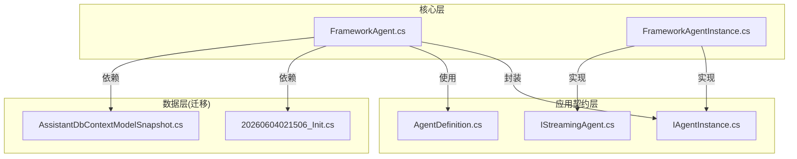
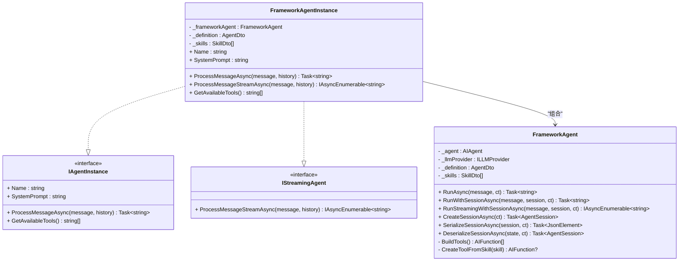
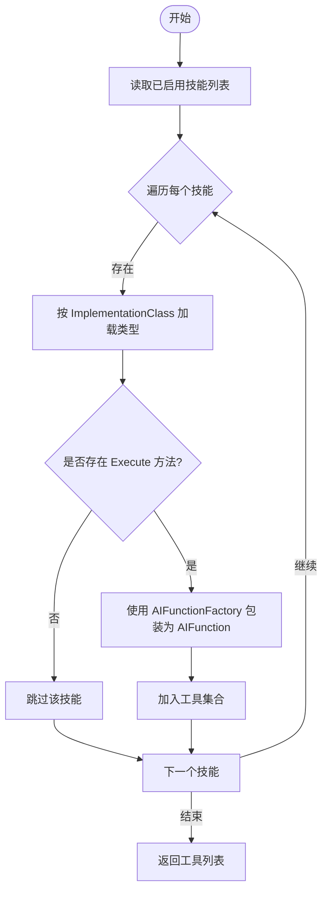
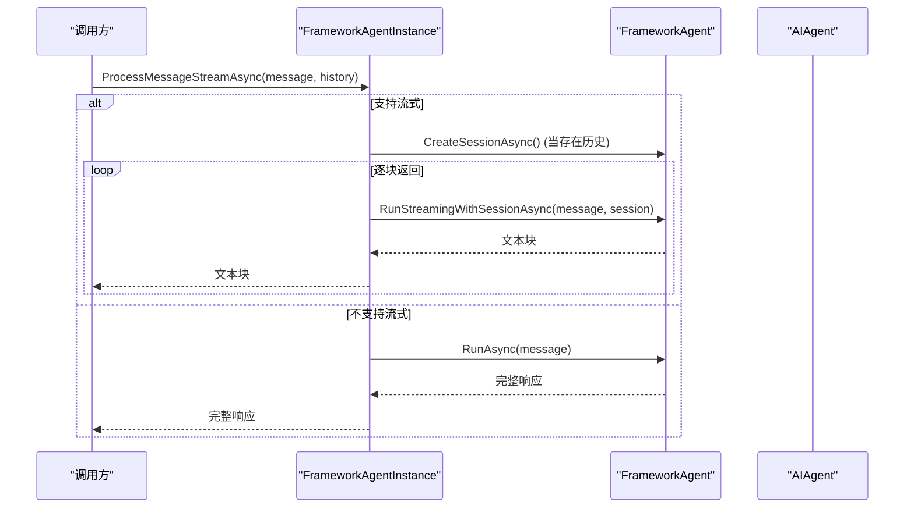
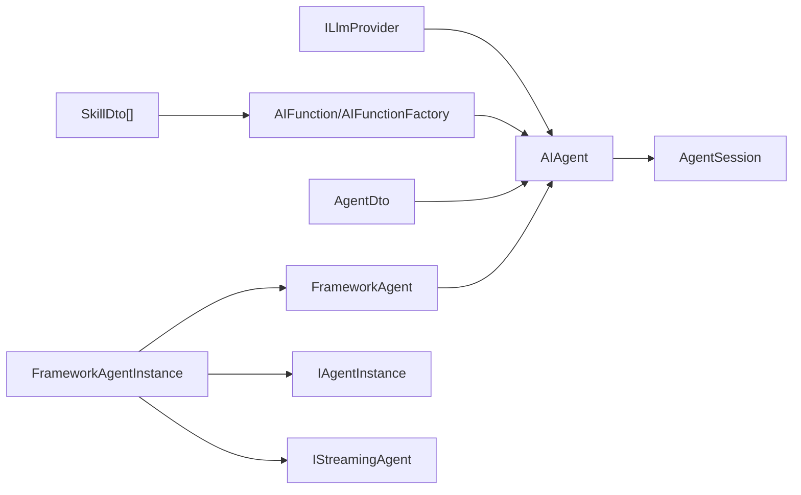

# FrameworkAgent智能体实现

<cite>
**本文引用的文件**   
- [FrameworkAgent.cs](file://src/Agent/Assistant/H.Assistant.Core/Agents/FrameworkAgent.cs)
- [FrameworkAgentInstance.cs](file://src/Agent/Assistant/H.Assistant.Core/Agents/FrameworkAgentInstance.cs)
- [IAgentInstance.cs](file://src/Agent/Assistant/H.Assistant.Application.Contracts/Services/Agents/IAgentInstance.cs)
- [IStreamingAgent.cs](file://src/Agent/Assistant/H.Assistant.Application.Contracts/Services/Agents/IStreamingAgent.cs)
- [AgentDefinition.cs](file://src/Agent/Assistant/H.Assistant.Application.Contracts/Dtos/Agents/AgentDefinition.cs)
- [20260604021506_Init.cs](file://src/Tools/H.Assistant.DbMigrator/Migrations/20260604021506_Init.cs)
- [AssistantDbContextModelSnapshot.cs](file://src/Tools/H.Assistant.DbMigrator/Migrations/AssistantDbContextModelSnapshot.cs)
</cite>

## 目录
1. [简介](#简介)
2. [项目结构](#项目结构)
3. [核心组件](#核心组件)
4. [架构总览](#架构总览)
5. [详细组件分析](#详细组件分析)
6. [依赖关系分析](#依赖关系分析)
7. [性能考虑](#性能考虑)
8. [故障排查指南](#故障排查指南)
9. [结论](#结论)
10. [附录：配置与使用示例](#附录配置与使用示例)

## 简介
本文件围绕基于 Microsoft Agent Framework 的 FrameworkAgent 智能体实现，系统性阐述其设计原理、核心功能与运行模式。重点覆盖以下方面：
- AIAgent 的集成方式与工具系统构建机制
- 技能（Skill）的动态发现与注册流程
- 三种运行模式 RunAsync、RunWithSessionAsync、RunStreamingWithSessionAsync 的区别与适用场景
- 会话管理机制：创建、序列化与反序列化
- 错误处理与异常管理策略
- 面向开发者的配置与使用指引（以代码片段路径形式提供）

## 项目结构
FrameworkAgent 相关代码位于 Assistant 模块的核心层与应用契约层，配合数据库迁移定义 Agent/Skill/Chat 等实体，支撑运行时动态加载与持久化能力。

图表来源
- [FrameworkAgent.cs:1-166](file://src/Agent/Assistant/H.Assistant.Core/Agents/FrameworkAgent.cs#L1-L166)
- [FrameworkAgentInstance.cs:1-72](file://src/Agent/Assistant/H.Assistant.Core/Agents/FrameworkAgentInstance.cs#L1-L72)
- [IAgentInstance.cs:1-13](file://src/Agent/Assistant/H.Assistant.Application.Contracts/Services/Agents/IAgentInstance.cs#L1-L13)
- [IStreamingAgent.cs:1-13](file://src/Agent/Assistant/H.Assistant.Application.Contracts/Services/Agents/IStreamingAgent.cs#L1-L13)
- [AgentDefinition.cs:1-13](file://src/Agent/Assistant/H.Assistant.Application.Contracts/Dtos/Agents/AgentDefinition.cs#L1-L13)
- [20260604021506_Init.cs:81-235](file://src/Tools/H.Assistant.DbMigrator/Migrations/20260604021506_Init.cs#L81-L235)
- [AssistantDbContextModelSnapshot.cs:96-133](file://src/Tools/H.Assistant.DbMigrator/Migrations/AssistantDbContextModelSnapshot.cs#L96-L133)

章节来源
- [FrameworkAgent.cs:1-166](file://src/Agent/Assistant/H.Assistant.Core/Agents/FrameworkAgent.cs#L1-L166)
- [FrameworkAgentInstance.cs:1-72](file://src/Agent/Assistant/H.Assistant.Core/Agents/FrameworkAgentInstance.cs#L1-L72)
- [IAgentInstance.cs:1-13](file://src/Agent/Assistant/H.Assistant.Application.Contracts/Services/Agents/IAgentInstance.cs#L1-L13)
- [IStreamingAgent.cs:1-13](file://src/Agent/Assistant/H.Assistant.Application.Contracts/Services/Agents/IStreamingAgent.cs#L1-L13)
- [AgentDefinition.cs:1-13](file://src/Agent/Assistant/H.Assistant.Application.Contracts/Dtos/Agents/AgentDefinition.cs#L1-L13)
- [20260604021506_Init.cs:81-235](file://src/Tools/H.Assistant.DbMigrator/Migrations/20260604021506_Init.cs#L81-L235)
- [AssistantDbContextModelSnapshot.cs:96-133](file://src/Tools/H.Assistant.DbMigrator/Migrations/AssistantDbContextModelSnapshot.cs#L96-L133)

## 核心组件
- FrameworkAgent：基于 Microsoft Agent Framework 的 Agent 实现，负责：
  - 通过 ILLMProvider 创建 AIAgent，并注入 SystemPrompt、Temperature、MaxTokens 与工具列表
  - 暴露三种运行模式：单次对话、带会话多轮对话、流式多轮对话
  - 会话生命周期管理：创建、序列化、反序列化
  - 工具系统：从 SkillDto 动态发现并注册为 AIFunction
- FrameworkAgentInstance：对外暴露统一接口 IAgentInstance/IStreamingAgent，屏蔽底层细节，支持流式与非流式降级
- 接口契约：IAgentInstance、IStreamingAgent 定义统一的 Agent 实例交互模型
- 数据契约：AgentDefinition 描述 Agent 元信息；SkillDto/AgentDto 由上层装配传入

章节来源
- [FrameworkAgent.cs:12-166](file://src/Agent/Assistant/H.Assistant.Core/Agents/FrameworkAgent.cs#L12-L166)
- [FrameworkAgentInstance.cs:9-72](file://src/Agent/Assistant/H.Assistant.Core/Agents/FrameworkAgentInstance.cs#L9-L72)
- [IAgentInstance.cs:6-12](file://src/Agent/Assistant/H.Assistant.Application.Contracts/Services/Agents/IAgentInstance.cs#L6-L12)
- [IStreamingAgent.cs:6-12](file://src/Agent/Assistant/H.Assistant.Application.Contracts/Services/Agents/IStreamingAgent.cs#L6-L12)
- [AgentDefinition.cs:6-12](file://src/Agent/Assistant/H.Assistant.Application.Contracts/Dtos/Agents/AgentDefinition.cs#L6-L12)

## 架构总览
FrameworkAgent 将 LLM 提供者抽象为 ILLMProvider，并通过 AsAIAgent 构造 AIAgent，结合工具系统与会话管理，形成“提示词+工具+上下文”的统一执行环境。

图表来源
- [FrameworkAgent.cs:12-166](file://src/Agent/Assistant/H.Assistant.Core/Agents/FrameworkAgent.cs#L12-L166)
- [FrameworkAgentInstance.cs:9-72](file://src/Agent/Assistant/H.Assistant.Core/Agents/FrameworkAgentInstance.cs#L9-L72)
- [IAgentInstance.cs:6-12](file://src/Agent/Assistant/H.Assistant.Application.Contracts/Services/Agents/IAgentInstance.cs#L6-L12)
- [IStreamingAgent.cs:6-12](file://src/Agent/Assistant/H.Assistant.Application.Contracts/Services/Agents/IStreamingAgent.cs#L6-L12)

## 详细组件分析

### FrameworkAgent：设计与实现要点
- 初始化阶段
  - 接收 ILLMProvider、AgentDto、List<SkillDto>
  - 调用 BuildTools 生成 AIFunction 列表
  - 通过 llmProvider.AsAIAgent(name, instructions, temperature, maxTokens, tools) 创建 AIAgent
- 运行模式
  - RunAsync：单次对话，直接返回字符串结果
  - RunWithSessionAsync：多轮对话，传入 AgentSession 维持上下文
  - RunStreamingWithSessionAsync：流式多轮对话，逐块返回响应内容
- 会话管理
  - CreateSessionAsync：创建新会话
  - SerializeSessionAsync/DeserializeSessionAsync：状态序列化与反序列化，便于持久化或跨进程传递
- 工具系统
  - BuildTools：过滤 IsEnabled 的技能，逐一转换为 AIFunction
  - CreateToolFromSkill：按 ImplementationClass 反射加载类型，查找 Execute 方法，使用 AIFunctionFactory.Create 包装为工具，名称与描述来自 SkillDto

图表来源
- [FrameworkAgent.cs:104-164](file://src/Agent/Assistant/H.Assistant.Core/Agents/FrameworkAgent.cs#L104-L164)

章节来源
- [FrameworkAgent.cs:12-166](file://src/Agent/Assistant/H.Assistant.Core/Agents/FrameworkAgent.cs#L12-L166)

### FrameworkAgentInstance：统一入口与流式降级
- 职责
  - 暴露 IAgentInstance/IStreamingAgent 统一接口
  - 根据 conversationHistory 决定是否需要创建会话
  - 当 SupportsStreaming 为真时走流式通道，否则降级为非流式
- 关键行为
  - ProcessMessageAsync：有历史则创建会话并拼接历史消息，无历史则单次调用
  - ProcessMessageStreamAsync：优先流式，不支持时回退到非流式
  - GetAvailableTools：返回启用的技能显示名列表

图表来源
- [FrameworkAgentInstance.cs:28-62](file://src/Agent/Assistant/H.Assistant.Core/Agents/FrameworkAgentInstance.cs#L28-L62)
- [FrameworkAgent.cs:42-73](file://src/Agent/Assistant/H.Assistant.Core/Agents/FrameworkAgent.cs#L42-L73)

章节来源
- [FrameworkAgentInstance.cs:9-72](file://src/Agent/Assistant/H.Assistant.Core/Agents/FrameworkAgentInstance.cs#L9-L72)

### 运行模式对比与使用场景
- RunAsync
  - 特点：一次性请求，无上下文
  - 场景：简单问答、无需记忆的单次任务
- RunWithSessionAsync
  - 特点：携带 AgentSession，保持上下文
  - 场景：多轮对话、需要记忆的任务
- RunStreamingWithSessionAsync
  - 特点：流式输出，边生成边返回
  - 场景：实时聊天、长文本逐步渲染

章节来源
- [FrameworkAgent.cs:42-73](file://src/Agent/Assistant/H.Assistant.Core/Agents/FrameworkAgent.cs#L42-L73)

### 会话管理机制
- 创建：CreateSessionAsync
- 序列化：SerializeSessionAsync 返回 JsonElement，可用于存储或传输
- 反序列化：DeserializeSessionAsync 恢复会话状态
- 在 FrameworkAgentInstance 中，当存在 conversationHistory 时会创建会话，并将历史拼接后发送

章节来源
- [FrameworkAgent.cs:78-99](file://src/Agent/Assistant/H.Assistant.Core/Agents/FrameworkAgent.cs#L78-L99)
- [FrameworkAgentInstance.cs:28-49](file://src/Agent/Assistant/H.Assistant.Core/Agents/FrameworkAgentInstance.cs#L28-L49)

### 工具系统的动态发现与注册
- 数据来源：SkillDto 列表（包含 SkillName、Description、ImplementationClass、IsEnabled 等）
- 发现过程：按 IsEnabled 过滤，反射加载 ImplementationClass，定位 Execute 方法
- 注册过程：使用 AIFunctionFactory.Create 包装为 AIFunction，设置 Name 与 Description
- 失败处理：反射或方法缺失时返回 null，被忽略

章节来源
- [FrameworkAgent.cs:104-164](file://src/Agent/Assistant/H.Assistant.Core/Agents/FrameworkAgent.cs#L104-L164)

### 错误处理与异常管理策略
- 工具加载异常：CreateToolFromSkill 捕获异常并返回 null，避免影响整体初始化
- 流式降级：当 SupportsStreaming 为假时，自动降级为非流式 ProcessMessageAsync
- 建议增强：对 ILLMProvider 调用、AIAgent 调用增加超时与重试策略；对反射加载进行白名单校验与安全限制

章节来源
- [FrameworkAgent.cs:159-164](file://src/Agent/Assistant/H.Assistant.Core/Agents/FrameworkAgent.cs#L159-L164)
- [FrameworkAgentInstance.cs:43-62](file://src/Agent/Assistant/H.Assistant.Core/Agents/FrameworkAgentInstance.cs#L43-L62)

## 依赖关系分析
- 外部依赖
  - Microsoft.Agents.AI：AIAgent、AgentSession 等
  - Microsoft.Extensions.AI：AIFunction、AIFunctionFactory 等
  - ILLMProvider：抽象 LLM 提供方，用于 AsAIAgent 创建
- 内部依赖
  - AgentDto、SkillDto：运行时配置与技能元数据
  - IAgentInstance/IStreamingAgent：对外统一接口

图表来源
- [FrameworkAgent.cs:12-38](file://src/Agent/Assistant/H.Assistant.Core/Agents/FrameworkAgent.cs#L12-L38)
- [FrameworkAgentInstance.cs:9-23](file://src/Agent/Assistant/H.Assistant.Core/Agents/FrameworkAgentInstance.cs#L9-L23)

章节来源
- [FrameworkAgent.cs:12-38](file://src/Agent/Assistant/H.Assistant.Core/Agents/FrameworkAgent.cs#L12-L38)
- [FrameworkAgentInstance.cs:9-23](file://src/Agent/Assistant/H.Assistant.Core/Agents/FrameworkAgentInstance.cs#L9-L23)

## 性能考虑
- 工具反射开销：建议在启动时缓存已解析的类型与方法，减少重复反射
- 流式输出：优先使用 RunStreamingWithSessionAsync 以降低首字节延迟
- 会话复用：合理复用 AgentSession，避免频繁创建销毁
- 并发控制：对 ILLMProvider 调用进行限流与熔断，防止雪崩

[本节为通用指导，不直接分析具体文件]

## 故障排查指南
- 工具未生效
  - 检查 SkillDto.IsEnabled 是否为真
  - 确认 ImplementationClass 可被 Type.GetType 解析
  - 确认目标类型存在 Execute 方法
- 流式输出不可用
  - 检查 AgentDto.SupportsStreaming 标志
  - 确认 ILLMProvider 与 AIAgent 支持流式
- 会话丢失
  - 确保 SerializeSessionAsync/DeserializeSessionAsync 正确持久化与恢复
  - 注意跨进程/跨服务时的序列化兼容性

章节来源
- [FrameworkAgent.cs:123-164](file://src/Agent/Assistant/H.Assistant.Core/Agents/FrameworkAgent.cs#L123-L164)
- [FrameworkAgentInstance.cs:43-62](file://src/Agent/Assistant/H.Assistant.Core/Agents/FrameworkAgentInstance.cs#L43-L62)

## 结论
FrameworkAgent 通过 Microsoft Agent Framework 提供了标准化的 Agent 实现，具备清晰的运行模式划分、完善的会话管理与灵活的工具系统。结合 IAgentInstance/IStreamingAgent 的统一接口，可在不同场景下无缝切换单次、多轮与流式交互，满足多样化业务需求。

[本节为总结性内容，不直接分析具体文件]

## 附录：配置与使用示例
- 基本配置
  - 准备 AgentDto：设置 DisplayName、SystemPrompt、Temperature、MaxTokens、SupportsStreaming 等
  - 准备 SkillDto[]：至少包含 IsEnabled、DisplayName、Description、ImplementationClass、SkillName
  - 注入 ILLMProvider：指向具体的 LLM 提供方
- 使用示例（代码片段路径）
  - 创建 FrameworkAgent 实例：参考 [FrameworkAgent.cs:19-38](file://src/Agent/Assistant/H.Assistant.Core/Agents/FrameworkAgent.cs#L19-L38)
  - 单次对话：参考 [FrameworkAgent.cs:42-47](file://src/Agent/Assistant/H.Assistant.Core/Agents/FrameworkAgent.cs#L42-L47)
  - 多轮对话：参考 [FrameworkAgent.cs:52-59](file://src/Agent/Assistant/H.Assistant.Core/Agents/FrameworkAgent.cs#L52-L59)
  - 流式对话：参考 [FrameworkAgent.cs:64-73](file://src/Agent/Assistant/H.Assistant.Core/Agents/FrameworkAgent.cs#L64-L73)
  - 会话创建与序列化：参考 [FrameworkAgent.cs:78-99](file://src/Agent/Assistant/H.Assistant.Core/Agents/FrameworkAgent.cs#L78-L99)
  - 通过 FrameworkAgentInstance 统一调用：参考 [FrameworkAgentInstance.cs:28-62](file://src/Agent/Assistant/H.Assistant.Core/Agents/FrameworkAgentInstance.cs#L28-L62)

章节来源
- [FrameworkAgent.cs:19-73](file://src/Agent/Assistant/H.Assistant.Core/Agents/FrameworkAgent.cs#L19-L73)
- [FrameworkAgentInstance.cs:28-62](file://src/Agent/Assistant/H.Assistant.Core/Agents/FrameworkAgentInstance.cs#L28-L62)