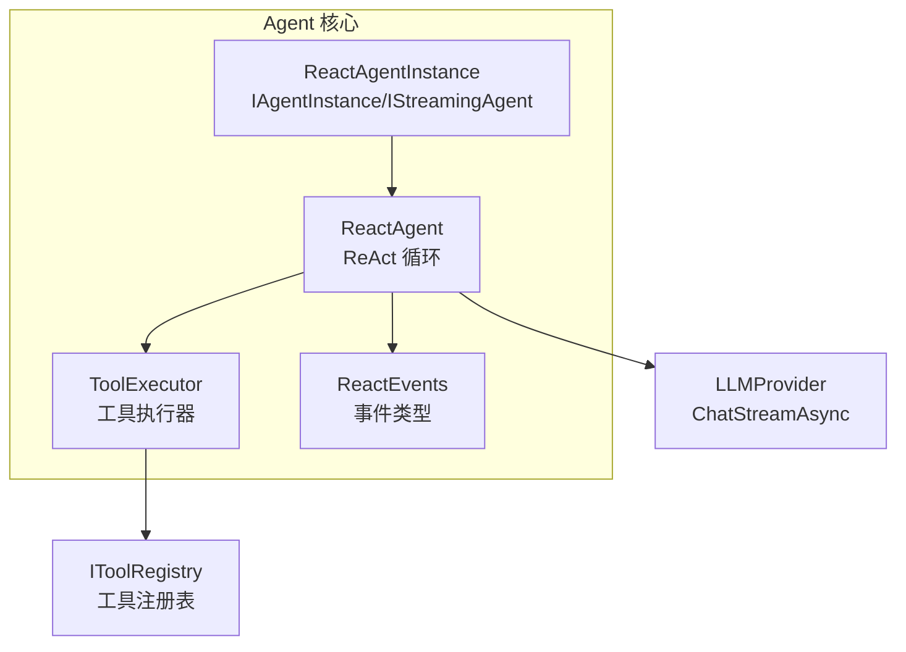
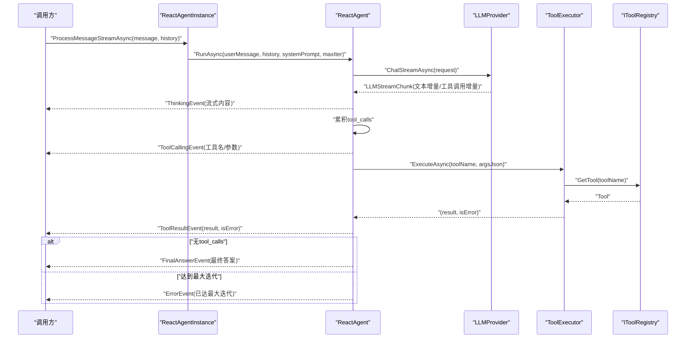
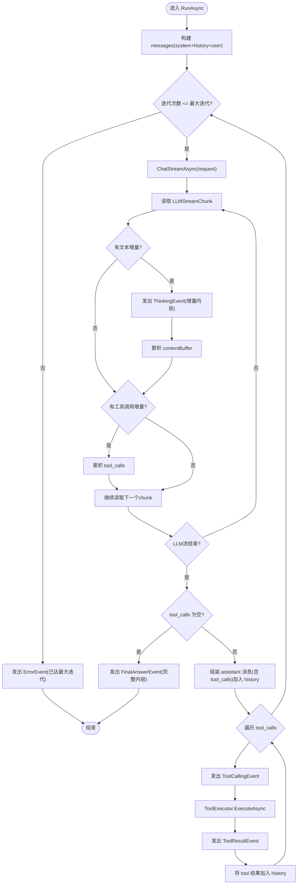
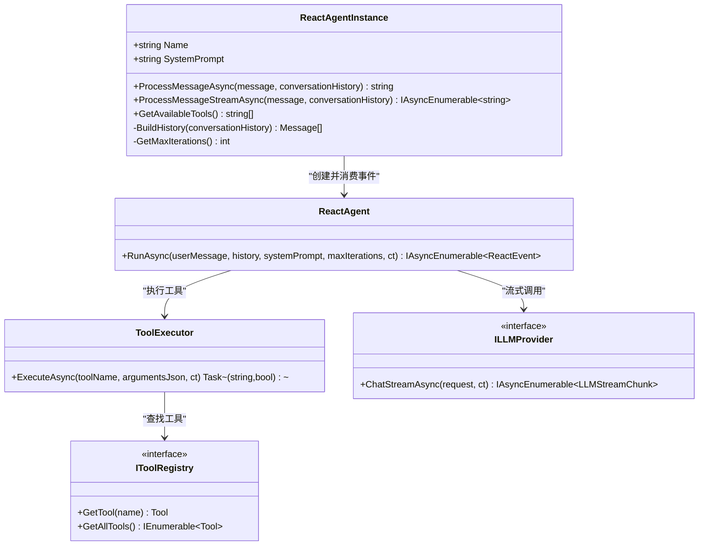
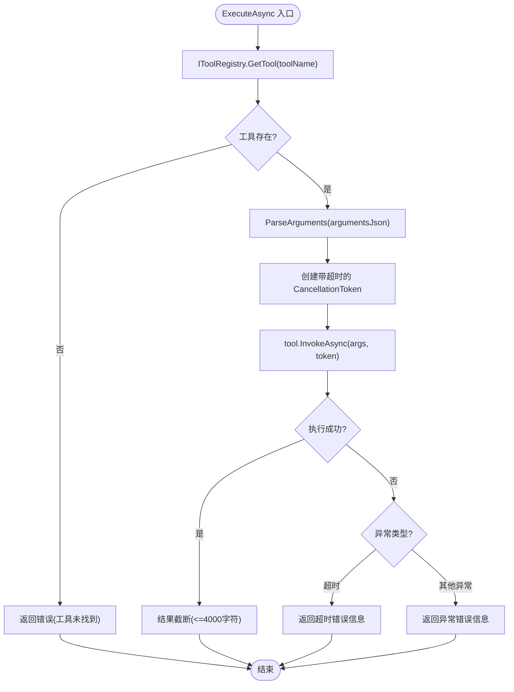
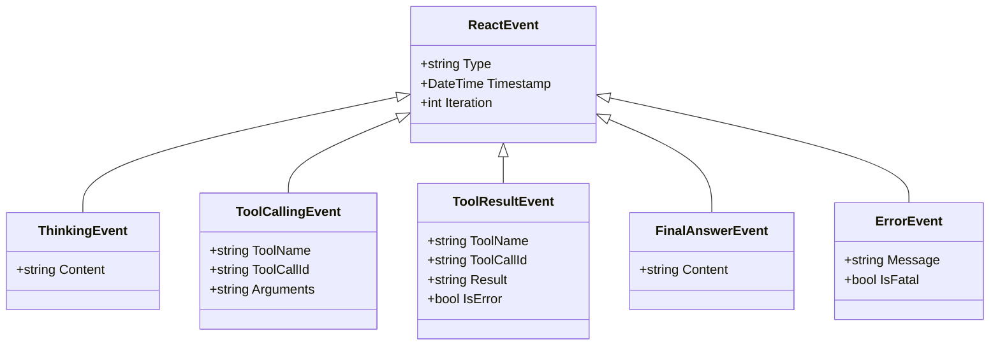
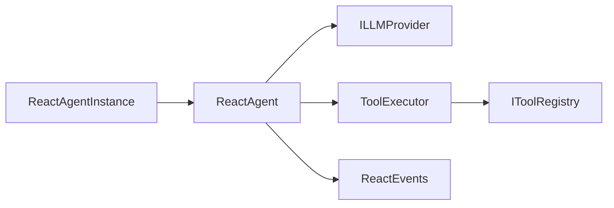
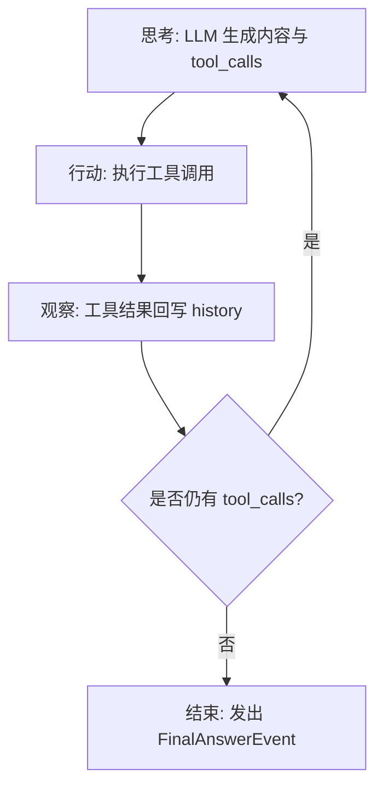

# ReactAgent智能体实现

<cite>
**本文引用的文件**   
- [ReactAgent.cs](file://src/Agent/Assistant/H.Assistant.Core/Agents/ReactAgent.cs)
- [ReactAgentInstance.cs](file://src/Agent/Assistant/H.Assistant.Core/Agents/ReactAgentInstance.cs)
- [ToolExecutor.cs](file://src/Agent/Assistant/H.Assistant.Core/Agents/ToolExecutor.cs)
- [ReactEvents.cs](file://src/Agent/Assistant/H.Assistant.Core/Agents/ReactEvents.cs)
</cite>

## 目录
1. [简介](#简介)
2. [项目结构](#项目结构)
3. [核心组件](#核心组件)
4. [架构总览](#架构总览)
5. [详细组件分析](#详细组件分析)
6. [依赖关系分析](#依赖关系分析)
7. [性能考量](#性能考量)
8. [故障排查指南](#故障排查指南)
9. [结论](#结论)
10. [附录](#附录)

## 简介
本文件面向基于 ReAct（Reasoning + Acting）模式的 ReactAgent 智能体，系统性阐述其设计理念、事件驱动架构、工具调用流程、上下文与状态管理、流式响应机制，以及扩展点与自定义处理器开发方法。文档以代码级分析为基础，辅以可视化图示，帮助读者从高层到细节全面理解该智能体的运行机制与最佳实践。

## 项目结构
ReactAgent 相关代码位于 Assistant 核心模块的 Agents 子目录中，主要包含以下文件：
- ReactAgent.cs：ReAct 循环的核心实现，负责思考-行动-观察迭代、流式事件推送、工具调用编排与上下文维护。
- ReactAgentInstance.cs：对外暴露 IAgentInstance 与 IStreamingAgent 接口，封装非流式与流式两种调用方式，并负责历史消息构建与最大迭代次数解析。
- ToolExecutor.cs：工具执行器，负责工具查找、参数解析、超时控制、异常处理与结果截断。
- ReactEvents.cs：定义 ReAct 事件类型（思考、工具调用、工具结果、最终回答、错误），作为事件驱动的数据载体。

图表来源
- [ReactAgent.cs:1-261](file://src/Agent/Assistant/H.Assistant.Core/Agents/ReactAgent.cs#L1-L261)
- [ReactAgentInstance.cs:1-156](file://src/Agent/Assistant/H.Assistant.Core/Agents/ReactAgentInstance.cs#L1-L156)
- [ToolExecutor.cs:1-102](file://src/Agent/Assistant/H.Assistant.Core/Agents/ToolExecutor.cs#L1-L102)
- [ReactEvents.cs:1-63](file://src/Agent/Assistant/H.Assistant.Core/Agents/ReactEvents.cs#L1-L63)

章节来源
- [ReactAgent.cs:1-261](file://src/Agent/Assistant/H.Assistant.Core/Agents/ReactAgent.cs#L1-L261)
- [ReactAgentInstance.cs:1-156](file://src/Agent/Assistant/H.Assistant.Core/Agents/ReactAgentInstance.cs#L1-L156)
- [ToolExecutor.cs:1-102](file://src/Agent/Assistant/H.Assistant.Core/Agents/ToolExecutor.cs#L1-L102)
- [ReactEvents.cs:1-63](file://src/Agent/Assistant/H.Assistant.Core/Agents/ReactEvents.cs#L1-L63)

## 核心组件
- ReactAgent：实现 ReAct 主循环，按“思考→行动→观察”迭代推进，使用 Channel 桥接 LLM 流式响应与 yield return 的事件推送；维护消息历史（system/history/user/assistant/tool）；在检测到 tool_calls 时触发工具执行并将结果回写 history，直至无工具调用或达到最大迭代次数。
- ReactAgentInstance：对外提供 ProcessMessageAsync（非流式）与 ProcessMessageStreamAsync（流式）两种入口；内部构造 ReactAgent 实例并消费事件，将事件序列化为 JSON 块返回给上层；支持从 Agent 元数据读取 maxIterations。
- ToolExecutor：通过 IToolRegistry 查找工具，解析 JSON 参数为字典，设置单次执行超时，捕获异常并返回统一的结果字符串（含错误信息），对过长结果进行截断。
- ReactEvents：定义事件基类与具体事件类型（ThinkingEvent、ToolCallingEvent、ToolResultEvent、FinalAnswerEvent、ErrorEvent），每个事件携带 Type、Timestamp、Iteration 等通用字段。

章节来源
- [ReactAgent.cs:1-261](file://src/Agent/Assistant/H.Assistant.Core/Agents/ReactAgent.cs#L1-L261)
- [ReactAgentInstance.cs:1-156](file://src/Agent/Assistant/H.Assistant.Core/Agents/ReactAgentInstance.cs#L1-L156)
- [ToolExecutor.cs:1-102](file://src/Agent/Assistant/H.Assistant.Core/Agents/ToolExecutor.cs#L1-L102)
- [ReactEvents.cs:1-63](file://src/Agent/Assistant/H.Assistant.Core/Agents/ReactEvents.cs#L1-L63)

## 架构总览
ReactAgent 采用事件驱动的异步流水线架构：LLM 流式输出通过 Channel 分片推送，ReactAgent 实时生成 ThinkingEvent；当出现 tool_calls 时，转换为 ToolCallingEvent 并交由 ToolExecutor 执行，随后产生 ToolResultEvent；若无 tool_calls，则发出 FinalAnswerEvent 结束本轮；若发生异常或达到最大迭代次数，则发出 ErrorEvent。

图表来源
- [ReactAgent.cs:39-248](file://src/Agent/Assistant/H.Assistant.Core/Agents/ReactAgent.cs#L39-L248)
- [ReactAgentInstance.cs:78-104](file://src/Agent/Assistant/H.Assistant.Core/Agents/ReactAgentInstance.cs#L78-L104)
- [ToolExecutor.cs:34-82](file://src/Agent/Assistant/H.Assistant.Core/Agents/ToolExecutor.cs#L34-L82)

## 详细组件分析

### ReactAgent 组件分析
- 设计要点
  - 使用 IAsyncEnumerable 与 Channel 实现高吞吐流式处理，避免 try-catch 与 yield return 冲突。
  - 维护 messages 列表作为上下文，包含 system、history、user、assistant、tool 角色消息，确保 LLM 具备完整对话背景。
  - 对 LLM 响应中的 tool_calls 进行增量累积，保证跨 chunk 的工具调用完整性。
  - 每轮迭代结束后根据是否包含 tool_calls 决定继续还是终止。
- 关键流程
  - 初始化 messages（system + history + user）。
  - 发起 ChatStreamAsync，后台任务写入 Channel，主循环读取并分发事件。
  - 累积 tool_calls，组装 assistant 消息加入 history。
  - 逐个执行工具，记录 ToolCallingEvent 与 ToolResultEvent，将 tool 结果追加到 history。
  - 超过最大迭代次数时发出 ErrorEvent。
- 复杂度与性能
  - 时间复杂度：O(I × (C + T))，I 为迭代次数，C 为 LLM 响应 chunk 数，T 为工具调用数量。
  - 空间复杂度：O(M + S)，M 为消息历史大小，S 为累积的 tool_calls 与内容缓冲。
  - 使用 Channel 解耦生产者（LLM 流）与消费者（事件推送），降低阻塞风险。

图表来源
- [ReactAgent.cs:39-248](file://src/Agent/Assistant/H.Assistant.Core/Agents/ReactAgent.cs#L39-L248)

章节来源
- [ReactAgent.cs:1-261](file://src/Agent/Assistant/H.Assistant.Core/Agents/ReactAgent.cs#L1-L261)

### ReactAgentInstance 组件分析
- 职责边界
  - 非流式：收集所有事件，优先使用 ThinkingEvent 累积内容，若 FinalAnswerEvent 存在则覆盖；遇到致命错误时降级为错误提示。
  - 流式：将 ReactEvent 序列化为 JSON 字符串逐块返回，便于前端实时渲染。
- 上下文构建
  - BuildHistory 将字符串列表解析为 Message 列表，仅保留 user/assistant/system/tool 角色。
- 配置解析
  - GetMaxIterations 从 AgentDto.Metadata 中解析 maxIterations，默认值为 10。

图表来源
- [ReactAgentInstance.cs:1-156](file://src/Agent/Assistant/H.Assistant.Core/Agents/ReactAgentInstance.cs#L1-L156)
- [ReactAgent.cs:1-261](file://src/Agent/Assistant/H.Assistant.Core/Agents/ReactAgent.cs#L1-L261)
- [ToolExecutor.cs:1-102](file://src/Agent/Assistant/H.Assistant.Core/Agents/ToolExecutor.cs#L1-L102)

章节来源
- [ReactAgentInstance.cs:1-156](file://src/Agent/Assistant/H.Assistant.Core/Agents/ReactAgentInstance.cs#L1-L156)

### ToolExecutor 组件分析
- 工具查找与参数解析
  - 通过 IToolRegistry.GetTool 获取工具，未找到时返回可用工具列表的错误信息。
  - ParseArguments 将 JSON 字符串反序列化为字典，忽略大小写，失败时返回 null。
- 执行与容错
  - 使用 CancellationTokenSource 设置单次执行超时（默认 60 秒），区分外部取消与内部超时。
  - 捕获 OperationCanceledException 与一般异常，统一返回错误信息字符串。
- 结果处理
  - 将工具返回值转为字符串，超过最大长度（默认 4000）时截断并附加提示。

图表来源
- [ToolExecutor.cs:34-82](file://src/Agent/Assistant/H.Assistant.Core/Agents/ToolExecutor.cs#L34-L82)

章节来源
- [ToolExecutor.cs:1-102](file://src/Agent/Assistant/H.Assistant.Core/Agents/ToolExecutor.cs#L1-L102)

### ReactEvents 事件体系
- 事件基类 ReactEvent：包含 Type、Timestamp、Iteration，用于统一事件元数据。
- 具体事件类型：
  - ThinkingEvent：流式思考内容增量。
  - ToolCallingEvent：工具调用请求（名称、ID、参数）。
  - ToolResultEvent：工具执行结果（名称、ID、结果、是否错误）。
  - FinalAnswerEvent：最终回答（完整内容）。
  - ErrorEvent：错误信息（消息、是否致命）。

图表来源
- [ReactEvents.cs:1-63](file://src/Agent/Assistant/H.Assistant.Core/Agents/ReactEvents.cs#L1-L63)

章节来源
- [ReactEvents.cs:1-63](file://src/Agent/Assistant/H.Assistant.Core/Agents/ReactEvents.cs#L1-L63)

## 依赖关系分析
- 组件耦合
  - ReactAgent 依赖 ILLMProvider（流式聊天）、ToolExecutor（工具执行）、ILogger（日志）。
  - ReactAgentInstance 依赖 ILLMProvider、ToolExecutor、AgentDto（系统提示与元数据）。
  - ToolExecutor 依赖 IToolRegistry（工具注册表）。
- 外部集成点
  - ILLMProvider.ChatStreamAsync：LLM 服务接口，返回流式 LLMStreamChunk。
  - IToolRegistry：工具发现与调用接口，需由上层注入具体实现。
- 潜在循环依赖
  - 当前结构无循环依赖；事件类型与执行器解耦良好。

图表来源
- [ReactAgent.cs:1-261](file://src/Agent/Assistant/H.Assistant.Core/Agents/ReactAgent.cs#L1-L261)
- [ReactAgentInstance.cs:1-156](file://src/Agent/Assistant/H.Assistant.Core/Agents/ReactAgentInstance.cs#L1-L156)
- [ToolExecutor.cs:1-102](file://src/Agent/Assistant/H.Assistant.Core/Agents/ToolExecutor.cs#L1-L102)
- [ReactEvents.cs:1-63](file://src/Agent/Assistant/H.Assistant.Core/Agents/ReactEvents.cs#L1-L63)

章节来源
- [ReactAgent.cs:1-261](file://src/Agent/Assistant/H.Assistant.Core/Agents/ReactAgent.cs#L1-L261)
- [ReactAgentInstance.cs:1-156](file://src/Agent/Assistant/H.Assistant.Core/Agents/ReactAgentInstance.cs#L1-L156)
- [ToolExecutor.cs:1-102](file://src/Agent/Assistant/H.Assistant.Core/Agents/ToolExecutor.cs#L1-L102)
- [ReactEvents.cs:1-63](file://src/Agent/Assistant/H.Assistant.Core/Agents/ReactEvents.cs#L1-L63)

## 性能考量
- 流式处理与背压
  - 使用 Channel.CreateUnbounded 接收 LLM 流，避免阻塞主线程；生产者在后台任务中写入，消费者在主循环中读取。
- 内存占用
  - 消息历史随迭代增长，建议在上层限制 history 长度或定期裁剪。
  - 工具结果截断防止过大响应导致内存压力。
- 并发与取消
  - 支持 CancellationToken 贯穿 LLM 调用与工具执行，确保及时中断。
- 序列化开销
  - 流式输出使用 JsonSerializer 按需序列化事件，注意属性命名策略与编码选项以减少开销。

[本节为通用指导，不直接分析具体文件]

## 故障排查指南
- LLM 调用失败
  - 现象：收到 ErrorEvent，IsFatal=false，消息包含失败原因。
  - 排查：检查网络、模型可用性、请求格式（messages/tools）。
- 工具未找到
  - 现象：ToolExecutor 返回错误信息，包含可用工具列表。
  - 排查：确认 IToolRegistry 已正确注册工具名称。
- 工具执行超时
  - 现象：ToolExecutor 抛出 OperationCanceledException，返回超时错误信息。
  - 排查：优化工具逻辑或调整 ExecutionTimeoutSeconds。
- 达到最大迭代次数
  - 现象：ErrorEvent，IsFatal=true，提示已达到最大迭代次数。
  - 排查：检查 Prompt 与工具定义，必要时提高 maxIterations。

章节来源
- [ReactAgent.cs:151-160](file://src/Agent/Assistant/H.Assistant.Core/Agents/ReactAgent.cs#L151-L160)
- [ToolExecutor.cs:70-81](file://src/Agent/Assistant/H.Assistant.Core/Agents/ToolExecutor.cs#L70-L81)
- [ReactAgent.cs:241-247](file://src/Agent/Assistant/H.Assistant.Core/Agents/ReactAgent.cs#L241-L247)

## 结论
ReactAgent 通过 ReAct 模式实现了“思考-行动-观察”的闭环推理，结合事件驱动与流式响应，提供了高实时性与可扩展的智能体框架。ToolExecutor 与 IToolRegistry 解耦了工具执行与发现，ReactEvents 定义了清晰的事件契约。上层可通过 ReactAgentInstance 快速接入非流式与流式场景，并根据需要扩展事件处理器与工具集。

[本节为总结性内容，不直接分析具体文件]

## 附录

### 思考-行动-观察循环工作原理
- 思考：LLM 基于 messages 生成文本增量与可能的 tool_calls 增量。
- 行动：ReactAgent 将 tool_calls 转换为 ToolCallingEvent 并交由 ToolExecutor 执行。
- 观察：ToolExecutor 返回 ToolResultEvent，ReactAgent 将结果追加到 history，进入下一轮迭代。

[本图为概念性流程图，不映射具体源码文件]

### 自定义事件处理器与扩展点
- 扩展点
  - ILLMProvider：替换或增强 LLM 流式接口。
  - IToolRegistry：注册/注销工具，动态更新可用工具集。
  - ToolExecutor：自定义参数解析、执行策略、超时与重试。
- 自定义事件处理器
  - 在 ReactAgentInstance.ProcessMessageStreamAsync 中订阅事件流，按 Type 分支处理，可持久化、转发或聚合事件。
  - 建议在应用层实现 IEventHandler<T> 接口（如适用），并通过依赖注入注册。

[本节为通用指导，不直接分析具体文件]

### 实际项目中使用示例
- 非流式调用
  - 使用 ReactAgentInstance.ProcessMessageAsync，传入用户消息与历史，获取最终回答字符串。
- 流式调用
  - 使用 ReactAgentInstance.ProcessMessageStreamAsync，逐块接收 JSON 事件，前端实时渲染思考过程与工具调用状态。
- 上下文管理
  - 在上层维护 conversationHistory，限制长度以避免上下文溢出。
- 工具扩展
  - 在 IToolRegistry 中注册新工具，确保名称唯一且参数符合约定。

[本节为通用指导，不直接分析具体文件]