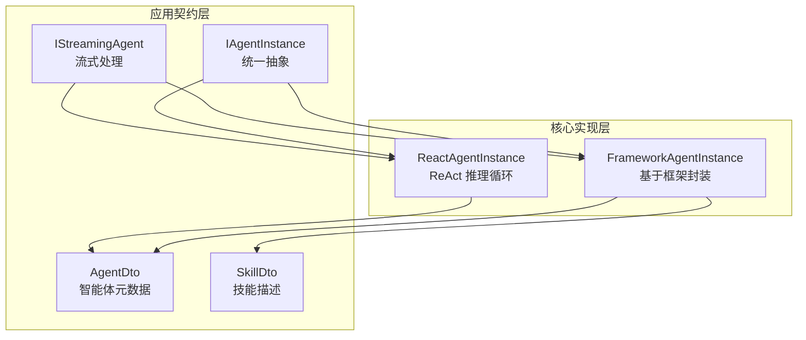
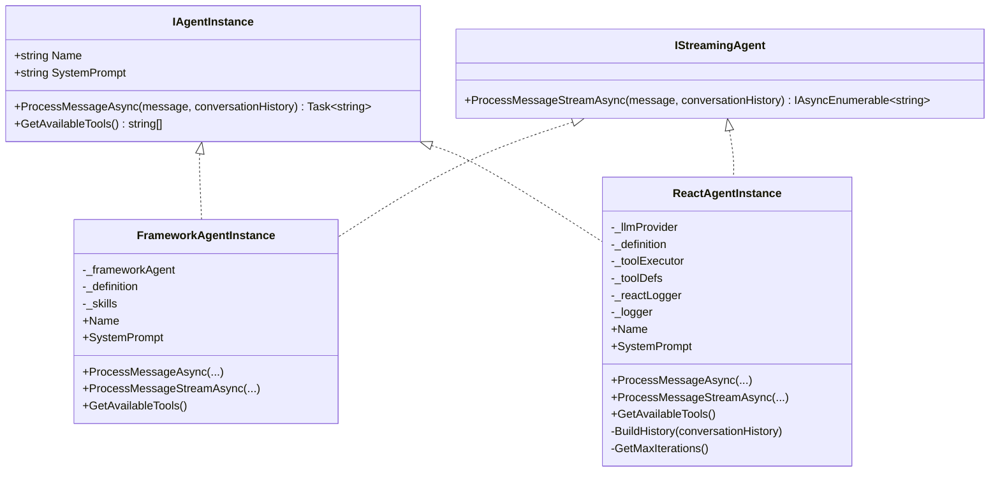
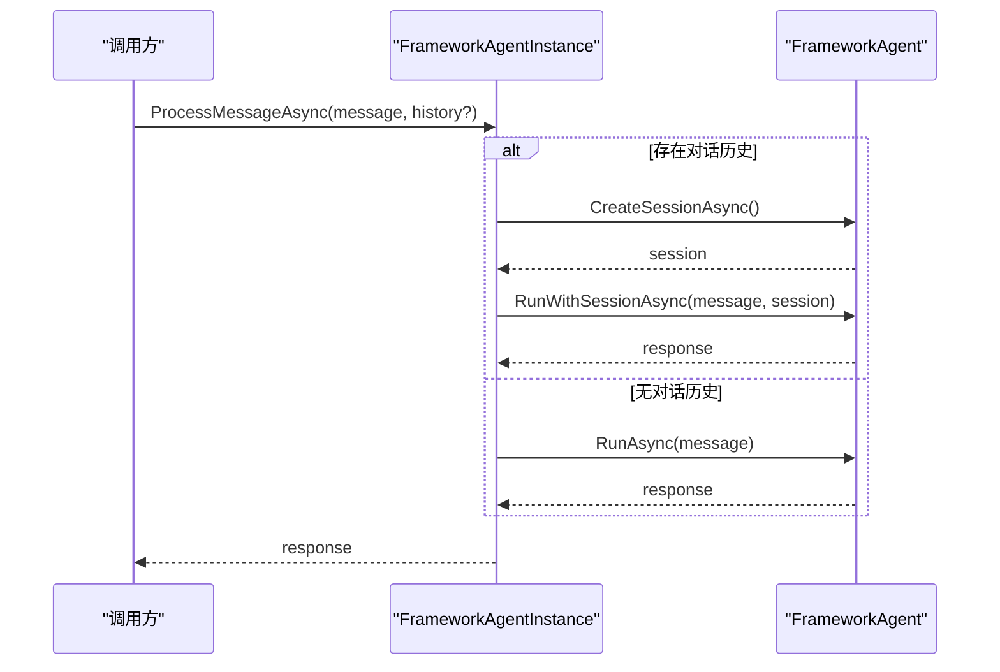
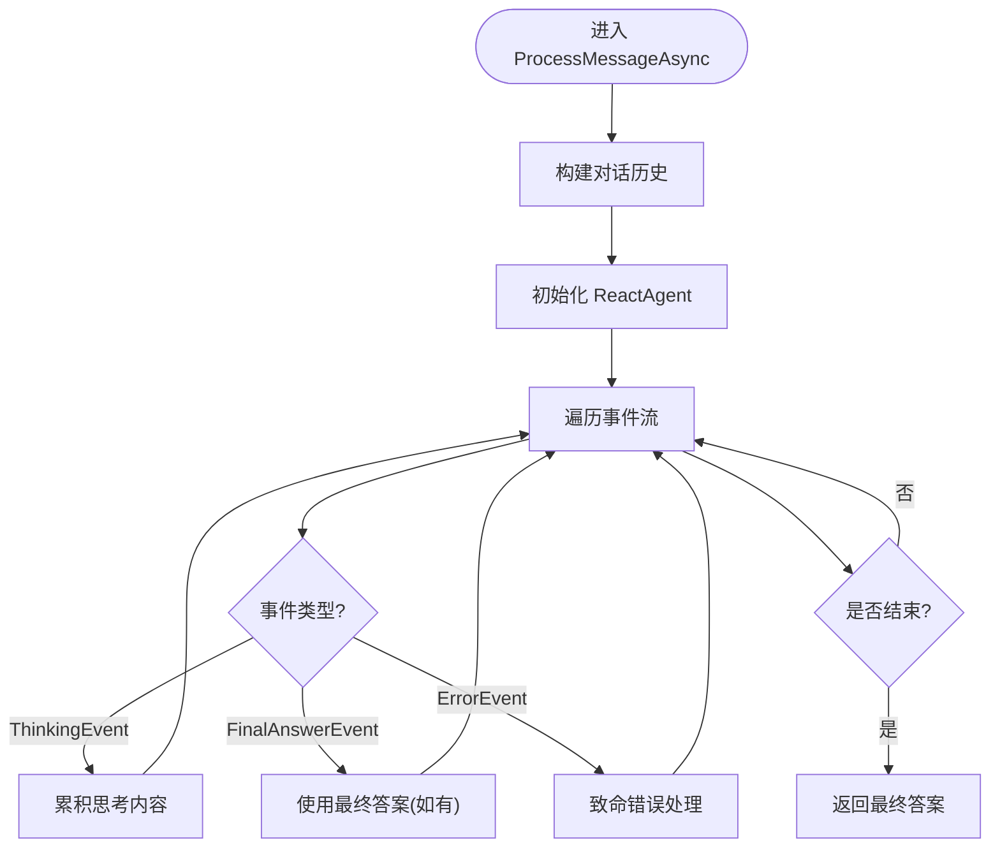
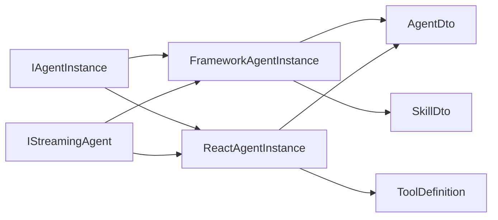

# 智能体实例管理

<cite>
**本文引用的文件**   
- [IAgentInstance.cs](file://src/Agent/Assistant/H.Assistant.Application.Contracts/Services/Agents/IAgentInstance.cs)
- [IStreamingAgent.cs](file://src/Agent/Assistant/H.Assistant.Application.Contracts/Services/Agents/IStreamingAgent.cs)
- [FrameworkAgentInstance.cs](file://src/Agent/Assistant/H.Assistant.Core/Agents/FrameworkAgentInstance.cs)
- [ReactAgentInstance.cs](file://src/Agent/Assistant/H.Assistant.Core/Agents/ReactAgentInstance.cs)
- [AgentDto.cs](file://src/Agent/Assistant/H.Assistant.Application.Contracts/Dtos/Agents/AgentDto.cs)
- [SkillDto.cs](file://src/Agent/Assistant/H.Assistant.Application.Contracts/Dtos/Skills/SkillDto.cs)
</cite>

## 目录
1. [简介](#简介)
2. [项目结构](#项目结构)
3. [核心组件](#核心组件)
4. [架构总览](#架构总览)
5. [详细组件分析](#详细组件分析)
6. [依赖关系分析](#依赖关系分析)
7. [性能考量](#性能考量)
8. [故障排查指南](#故障排查指南)
9. [结论](#结论)
10. [附录](#附录)

## 简介
本文件面向“智能体实例管理”的完整设计与实现，聚焦 IAgentInstance 统一抽象、FrameworkAgentInstance 与 ReactAgentInstance 两种具体实现的差异、生命周期管理（创建、初始化、运行、销毁）、状态管理与上下文传递、多线程并发安全与资源管理、实例缓存与复用机制，以及如何在应用服务中正确调用与管理智能体实例。文档同时提供代码级图示与最佳实践，帮助读者快速理解并扩展智能体能力。

## 项目结构
围绕智能体实例管理的核心代码主要分布在以下位置：
- 接口定义与应用契约：H.Assistant.Application.Contracts/Services/Agents
- 核心实现：H.Assistant.Core/Agents
- 数据模型：H.Assistant.Application.Contracts/Dtos

图表来源
- [IAgentInstance.cs:1-13](file://src/Agent/Assistant/H.Assistant.Application.Contracts/Services/Agents/IAgentInstance.cs#L1-L13)
- [IStreamingAgent.cs](file://src/Agent/Assistant/H.Assistant.Application.Contracts/Services/Agents/IStreamingAgent.cs)
- [FrameworkAgentInstance.cs:1-72](file://src/Agent/Assistant/H.Assistant.Core/Agents/FrameworkAgentInstance.cs#L1-L72)
- [ReactAgentInstance.cs:1-156](file://src/Agent/Assistant/H.Assistant.Core/Agents/ReactAgentInstance.cs#L1-L156)
- [AgentDto.cs](file://src/Agent/Assistant/H.Assistant.Application.Contracts/Dtos/Agents/AgentDto.cs)
- [SkillDto.cs](file://src/Agent/Assistant/H.Assistant.Application.Contracts/Dtos/Skills/SkillDto.cs)

章节来源
- [IAgentInstance.cs:1-13](file://src/Agent/Assistant/H.Assistant.Application.Contracts/Services/Agents/IAgentInstance.cs#L1-L13)
- [FrameworkAgentInstance.cs:1-72](file://src/Agent/Assistant/H.Assistant.Core/Agents/FrameworkAgentInstance.cs#L1-L72)
- [ReactAgentInstance.cs:1-156](file://src/Agent/Assistant/H.Assistant.Core/Agents/ReactAgentInstance.cs#L1-L156)
- [AgentDto.cs](file://src/Agent/Assistant/H.Assistant.Application.Contracts/Dtos/Agents/AgentDto.cs)
- [SkillDto.cs](file://src/Agent/Assistant/H.Assistant.Application.Contracts/Dtos/Skills/SkillDto.cs)

## 核心组件
- IAgentInstance：定义智能体实例的统一抽象，包括名称、系统提示、消息处理与可用工具列表查询。
- IStreamingAgent：定义流式消息处理能力，用于逐步返回中间结果或事件。
- FrameworkAgentInstance：基于 Microsoft Agent Framework 的封装，支持会话管理与流式/非流式处理。
- ReactAgentInstance：基于 ReAct 推理循环的实现，支持事件驱动的流式输出与非流式聚合输出。

章节来源
- [IAgentInstance.cs:1-13](file://src/Agent/Assistant/H.Assistant.Application.Contracts/Services/Agents/IAgentInstance.cs#L1-L13)
- [IStreamingAgent.cs](file://src/Agent/Assistant/H.Assistant.Application.Contracts/Services/Agents/IStreamingAgent.cs)
- [FrameworkAgentInstance.cs:1-72](file://src/Agent/Assistant/H.Assistant.Core/Agents/FrameworkAgentInstance.cs#L1-L72)
- [ReactAgentInstance.cs:1-156](file://src/Agent/Assistant/H.Assistant.Core/Agents/ReactAgentInstance.cs#L1-L156)

## 架构总览
智能体实例通过统一接口对外暴露能力，上层应用无需关心底层是框架封装还是 ReAct 推理循环。两种实现均支持：
- 非流式处理：一次性返回最终答案
- 流式处理：按事件或片段逐步返回内容
- 上下文传递：通过 conversationHistory 维护对话历史
- 工具发现：GetAvailableTools 返回当前实例可用的工具集合

图表来源
- [IAgentInstance.cs:1-13](file://src/Agent/Assistant/H.Assistant.Application.Contracts/Services/Agents/IAgentInstance.cs#L1-L13)
- [IStreamingAgent.cs](file://src/Agent/Assistant/H.Assistant.Application.Contracts/Services/Agents/IStreamingAgent.cs)
- [FrameworkAgentInstance.cs:1-72](file://src/Agent/Assistant/H.Assistant.Core/Agents/FrameworkAgentInstance.cs#L1-L72)
- [ReactAgentInstance.cs:1-156](file://src/Agent/Assistant/H.Assistant.Core/Agents/ReactAgentInstance.cs#L1-L156)

## 详细组件分析

### IAgentInstance 统一抽象
- 设计目的：为不同智能体实现提供一致的调用入口，屏蔽底层差异（框架封装 vs ReAct 推理）。
- 关键能力：
  - 名称与系统提示：便于 UI 展示与行为控制
  - 消息处理：支持可选的对话历史上下文
  - 工具发现：返回启用的工具名称列表

章节来源
- [IAgentInstance.cs:1-13](file://src/Agent/Assistant/H.Assistant.Application.Contracts/Services/Agents/IAgentInstance.cs#L1-L13)

### FrameworkAgentInstance 实现要点
- 基于 Microsoft Agent Framework 的封装，内部持有 FrameworkAgent 实例与 Agent 定义、技能列表。
- 非流式处理：当存在对话历史时，创建会话并拼接历史消息后执行；否则直接运行。
- 流式处理：若定义支持流式，则使用 RunStreamingWithSessionAsync；否则降级为非流式。
- 工具发现：从启用的技能中提取显示名称。

图表来源
- [FrameworkAgentInstance.cs:28-39](file://src/Agent/Assistant/H.Assistant.Core/Agents/FrameworkAgentInstance.cs#L28-L39)

章节来源
- [FrameworkAgentInstance.cs:1-72](file://src/Agent/Assistant/H.Assistant.Core/Agents/FrameworkAgentInstance.cs#L1-L72)

### ReactAgentInstance 实现要点
- 基于 ReAct 推理循环，内部持有 LLM 提供者、工具执行器、工具定义与日志记录器。
- 非流式处理：遍历事件流，累积 ThinkingEvent 内容，或在 FinalAnswerEvent 有内容时覆盖；错误事件在致命情况下生成错误文本。
- 流式处理：将每个事件序列化为 JSON 字符串逐块返回，包含类型、迭代次数及相关字段。
- 上下文构建：将字符串形式的对话历史解析为 Message 列表，仅保留合法角色。
- 最大迭代次数：从 Agent 元数据中读取 maxIterations，默认值为 10。

图表来源
- [ReactAgentInstance.cs:43-73](file://src/Agent/Assistant/H.Assistant.Core/Agents/ReactAgentInstance.cs#L43-L73)
- [ReactAgentInstance.cs:114-134](file://src/Agent/Assistant/H.Assistant.Core/Agents/ReactAgentInstance.cs#L114-L134)
- [ReactAgentInstance.cs:139-154](file://src/Agent/Assistant/H.Assistant.Core/Agents/ReactAgentInstance.cs#L139-L154)

章节来源
- [ReactAgentInstance.cs:1-156](file://src/Agent/Assistant/H.Assistant.Core/Agents/ReactAgentInstance.cs#L1-L156)

### 流式处理对比
- FrameworkAgentInstance：优先使用框架提供的流式 API；不支持时降级为非流式。
- ReactAgentInstance：始终将事件序列化为 JSON 片段返回，便于前端实时渲染与调试。

章节来源
- [FrameworkAgentInstance.cs:41-62](file://src/Agent/Assistant/H.Assistant.Core/Agents/FrameworkAgentInstance.cs#L41-L62)
- [ReactAgentInstance.cs:78-104](file://src/Agent/Assistant/H.Assistant.Core/Agents/ReactAgentInstance.cs#L78-L104)

## 依赖关系分析
- IAgentInstance 被两个具体实现依赖，形成多态调用入口。
- FrameworkAgentInstance 依赖 AgentDto 与 SkillDto，用于配置与工具发现。
- ReactAgentInstance 依赖 AgentDto 与 ToolDefinition，并通过 ToolExecutor 执行工具调用。
- IStreamingAgent 为流式能力提供统一抽象，两个实现均遵循该约定。

图表来源
- [IAgentInstance.cs:1-13](file://src/Agent/Assistant/H.Assistant.Application.Contracts/Services/Agents/IAgentInstance.cs#L1-L13)
- [IStreamingAgent.cs](file://src/Agent/Assistant/H.Assistant.Application.Contracts/Services/Agents/IStreamingAgent.cs)
- [FrameworkAgentInstance.cs:1-72](file://src/Agent/Assistant/H.Assistant.Core/Agents/FrameworkAgentInstance.cs#L1-L72)
- [ReactAgentInstance.cs:1-156](file://src/Agent/Assistant/H.Assistant.Core/Agents/ReactAgentInstance.cs#L1-L156)
- [AgentDto.cs](file://src/Agent/Assistant/H.Assistant.Application.Contracts/Dtos/Agents/AgentDto.cs)
- [SkillDto.cs](file://src/Agent/Assistant/H.Assistant.Application.Contracts/Dtos/Skills/SkillDto.cs)

章节来源
- [FrameworkAgentInstance.cs:1-72](file://src/Agent/Assistant/H.Assistant.Core/Agents/FrameworkAgentInstance.cs#L1-L72)
- [ReactAgentInstance.cs:1-156](file://src/Agent/Assistant/H.Assistant.Core/Agents/ReactAgentInstance.cs#L1-L156)

## 性能考量
- 流式优先：对于长响应或需要实时反馈的场景，优先使用流式接口以减少首字节延迟。
- 会话复用：FrameworkAgentInstance 在存在对话历史时创建会话，避免重复初始化开销。
- 事件序列化：ReactAgentInstance 的流式输出采用轻量 JSON 序列化，注意避免过大 payload。
- 工具过滤：GetAvailableTools 仅返回启用工具，减少无关信息传输。
- 迭代上限：ReactAgentInstance 通过 maxIterations 限制推理轮次，防止无限循环。

[本节为通用指导，不直接分析具体文件]

## 故障排查指南
- 流式未生效：检查 AgentDto.SupportsStreaming 标志；FrameworkAgentInstance 在不支持时会降级为非流式。
- 空响应：ReactAgentInstance 在无有效事件或 finalAnswer 为空时返回占位文本，需检查事件流与错误事件。
- 历史解析失败：确保 conversationHistory 每行以“角色:内容”格式提供，且角色为 user/assistant/system/tool。
- 工具不可用：确认 SkillDto.IsEnabled 或 ToolDefinition 已正确注册与启用。
- 迭代过多：调整 AgentDto.Metadata.maxIterations，避免过长推理导致超时。

章节来源
- [FrameworkAgentInstance.cs:41-62](file://src/Agent/Assistant/H.Assistant.Core/Agents/FrameworkAgentInstance.cs#L41-L62)
- [ReactAgentInstance.cs:78-104](file://src/Agent/Assistant/H.Assistant.Core/Agents/ReactAgentInstance.cs#L78-L104)
- [ReactAgentInstance.cs:114-134](file://src/Agent/Assistant/H.Assistant.Core/Agents/ReactAgentInstance.cs#L114-L134)
- [ReactAgentInstance.cs:139-154](file://src/Agent/Assistant/H.Assistant.Core/Agents/ReactAgentInstance.cs#L139-L154)

## 结论
IAgentInstance 提供了统一的智能体实例抽象，使上层应用可以透明地切换不同实现。FrameworkAgentInstance 与 ReactAgentInstance 分别适用于框架封装场景与 ReAct 推理场景，二者均支持流式与非流式处理、上下文传递与工具发现。通过合理的生命周期管理、并发安全策略与实例缓存机制，可以在高并发环境下稳定高效地运行智能体实例。

[本节为总结性内容，不直接分析具体文件]

## 附录

### 智能体实例生命周期管理
- 创建：由应用服务根据 AgentDto 选择具体实现并构造实例。
- 初始化：注入 LLM 提供者、工具执行器、日志等依赖；加载技能与工具定义。
- 运行：调用 ProcessMessageAsync 或 ProcessMessageStreamAsync 执行任务。
- 销毁：释放外部资源（如数据库连接、网络客户端），确保线程安全清理。

章节来源
- [FrameworkAgentInstance.cs:15-23](file://src/Agent/Assistant/H.Assistant.Core/Agents/FrameworkAgentInstance.cs#L15-L23)
- [ReactAgentInstance.cs:21-35](file://src/Agent/Assistant/H.Assistant.Core/Agents/ReactAgentInstance.cs#L21-L35)

### 状态管理与上下文传递机制
- 对话历史：通过 conversationHistory 参数传递，ReactAgentInstance 会将其解析为结构化消息列表。
- 会话状态：FrameworkAgentInstance 在存在历史时创建会话，保持上下文连续性。
- 元数据驱动：AgentDto.Metadata 可携带运行时配置（如 maxIterations）。

章节来源
- [ReactAgentInstance.cs:114-134](file://src/Agent/Assistant/H.Assistant.Core/Agents/ReactAgentInstance.cs#L114-L134)
- [FrameworkAgentInstance.cs:28-39](file://src/Agent/Assistant/H.Assistant.Core/Agents/FrameworkAgentInstance.cs#L28-L39)
- [ReactAgentInstance.cs:139-154](file://src/Agent/Assistant/H.Assistant.Core/Agents/ReactAgentInstance.cs#L139-L154)

### 多线程环境下的并发安全与资源管理
- 单例与共享：LLM 提供者与工具执行器通常为单例，需保证线程安全。
- 实例隔离：每次请求可创建独立实例以避免状态污染；或使用线程局部存储保存会话上下文。
- 资源释放：在实例销毁阶段释放网络连接、文件句柄等资源，避免泄漏。

[本节为通用指导，不直接分析具体文件]

### 实例缓存与复用机制
- 建议策略：对只读配置（如 AgentDto）进行缓存；对运行时实例按会话或用户维度缓存。
- 失效策略：设置 TTL 或变更触发失效；避免长时间占用内存。
- 并发访问：使用线程安全的缓存容器（如 ConcurrentDictionary）并提供锁粒度控制。

[本节为通用指导，不直接分析具体文件]

### 自定义智能体实例开发规范与最佳实践
- 实现 IAgentInstance：至少提供 Name、SystemPrompt、ProcessMessageAsync、GetAvailableTools。
- 可选流式：实现 IStreamingAgent 以提升交互体验。
- 上下文处理：尊重 conversationHistory 格式，必要时进行校验与转换。
- 错误处理：区分可恢复错误与致命错误，提供清晰的错误信息。
- 性能优化：避免阻塞操作，合理使用异步与流式；限制迭代次数与输出大小。

章节来源
- [IAgentInstance.cs:1-13](file://src/Agent/Assistant/H.Assistant.Application.Contracts/Services/Agents/IAgentInstance.cs#L1-L13)
- [IStreamingAgent.cs](file://src/Agent/Assistant/H.Assistant.Application.Contracts/Services/Agents/IStreamingAgent.cs)

### 在应用服务中正确使用与管理智能体实例
- 依赖注入：在服务中注入 IAgentInstance 的具体实现，或通过工厂方法按需创建。
- 调用方式：优先使用流式接口进行实时反馈；非流式用于批处理或离线任务。
- 上下文传递：在多次调用间维护 conversationHistory，确保对话连贯性。
- 监控与日志：记录关键事件与错误，便于问题定位与性能分析。

章节来源
- [FrameworkAgentInstance.cs:28-39](file://src/Agent/Assistant/H.Assistant.Core/Agents/FrameworkAgentInstance.cs#L28-L39)
- [ReactAgentInstance.cs:43-73](file://src/Agent/Assistant/H.Assistant.Core/Agents/ReactAgentInstance.cs#L43-L73)