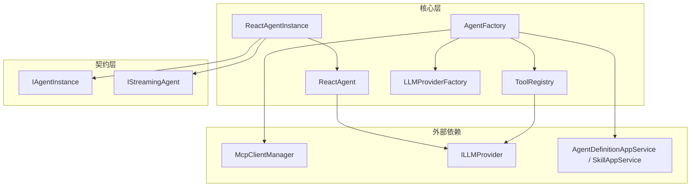
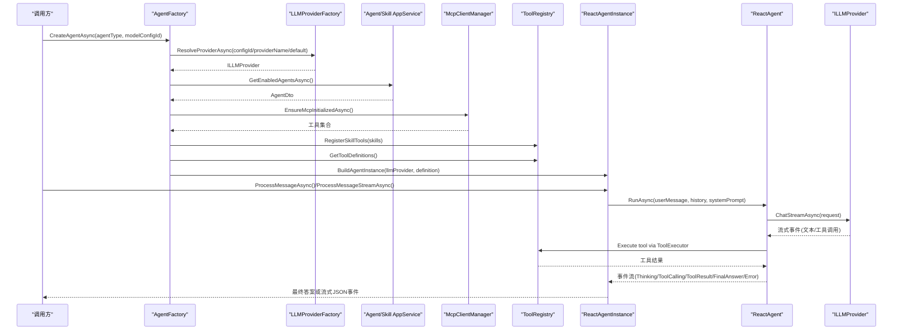
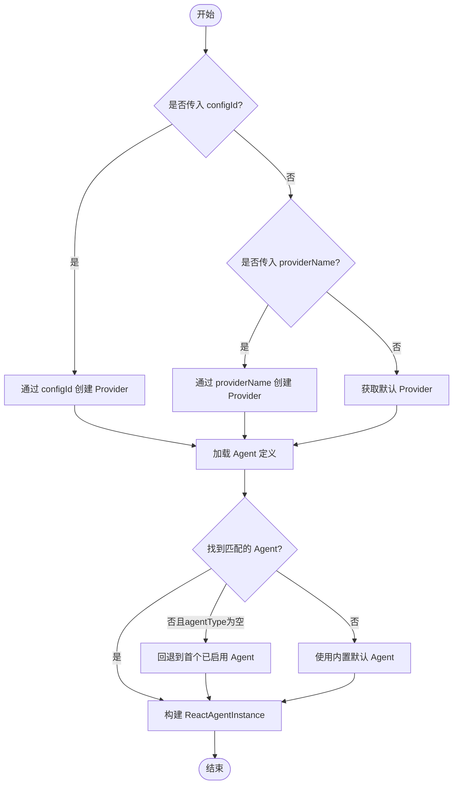
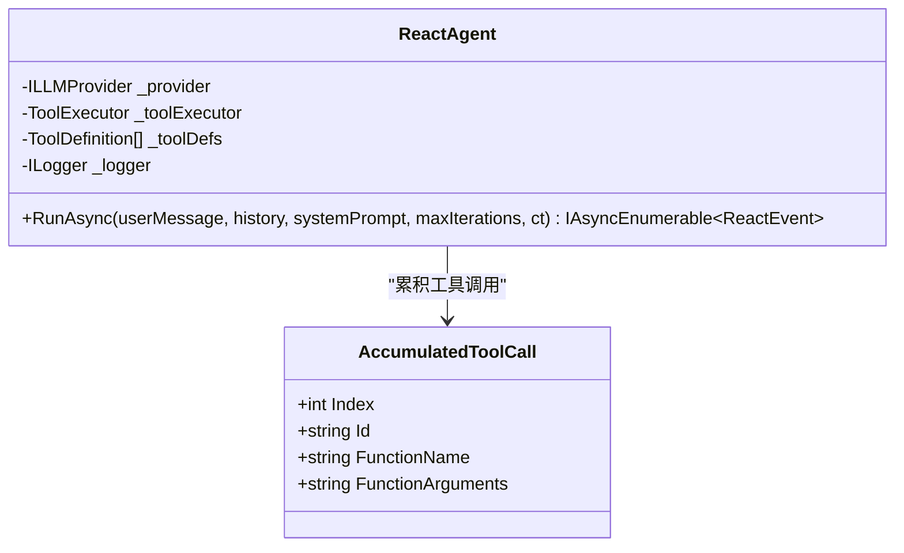
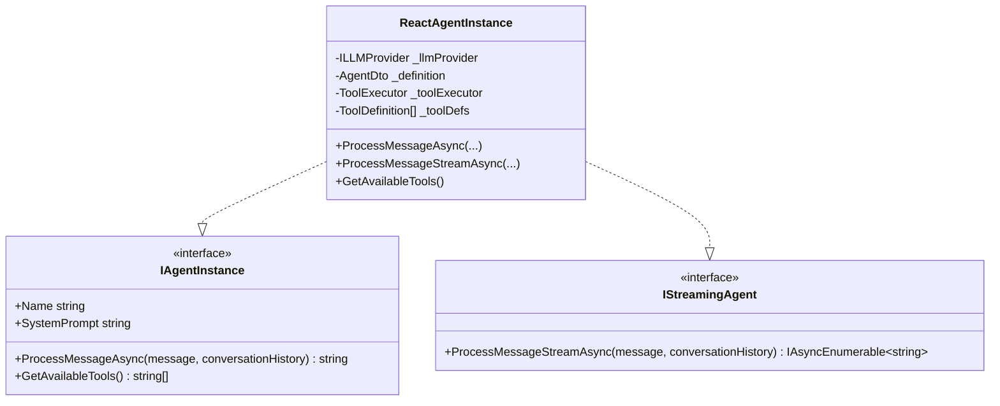
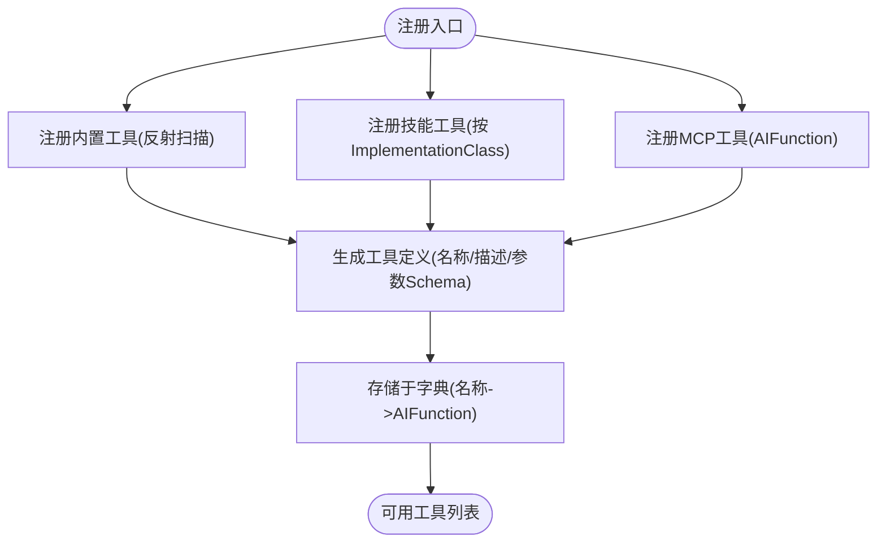
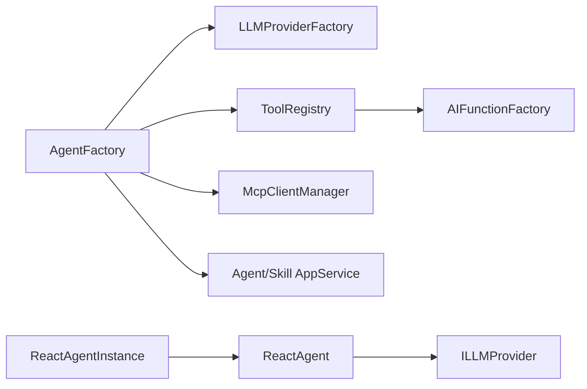

# 智能体工厂模式

<cite>
**本文引用的文件**   
- [AgentFactory.cs](file://src/Agent/Assistant/H.Assistant.Core/Agents/AgentFactory.cs)
- [ReactAgent.cs](file://src/Agent/Assistant/H.Assistant.Core/Agents/ReactAgent.cs)
- [ReactAgentInstance.cs](file://src/Agent/Assistant/H.Assistant.Core/Agents/ReactAgentInstance.cs)
- [ToolRegistry.cs](file://src/Agent/Assistant/H.Assistant.Core/Tools/ToolRegistry.cs)
- [LLMProviderFactory.cs](file://src/Agent/Assistant/H.Assistant.Core/LLM/LLMProviderFactory.cs)
- [IAgentInstance.cs](file://src/Agent/Assistant/H.Assistant.Application.Contracts/Services/Agents/IAgentInstance.cs)
- [IStreamingAgent.cs](file://src/Agent/Assistant/H.Assistant.Application.Contracts/Services/Agents/IStreamingAgent.cs)
- [AssistantCoreModule.cs](file://src/Agent/Assistant/H.Assistant.Core/AssistantCoreModule.cs)
</cite>

## 目录
1. [简介](#简介)
2. [项目结构](#项目结构)
3. [核心组件](#核心组件)
4. [架构总览](#架构总览)
5. [详细组件分析](#详细组件分析)
6. [依赖关系分析](#依赖关系分析)
7. [性能与缓存策略](#性能与缓存策略)
8. [故障排查指南](#故障排查指南)
9. [结论](#结论)
10. [附录：扩展与使用示例](#附录扩展与使用示例)

## 简介
本文件围绕 AgentFactory 的工厂设计模式与智能体创建机制，系统性阐述以下主题：
- 智能体类型的注册与发现机制
- 智能体配置的解析与验证过程
- 依赖注入容器的集成与生命周期管理
- 智能体的缓存策略与性能优化
- 插件化架构设计与扩展点
- 自定义智能体类型的注册与配置示例
- 在应用中正确配置和使用 AgentFactory 的最佳实践

## 项目结构
与智能体工厂相关的关键代码位于 Assistant 核心模块中，采用分层与模块化组织：
- 核心层（H.Assistant.Core）：包含 AgentFactory、ReactAgent、ReactAgentInstance、工具注册中心 ToolRegistry、LLM Provider 工厂等
- 应用契约层（H.Assistant.Application.Contracts）：定义 IAgentInstance、IStreamingAgent 等接口
- 模块装配（AssistantCoreModule）：负责 DI 容器中的服务注册与生命周期管理

图表来源
- [AgentFactory.cs:1-229](file://src/Agent/Assistant/H.Assistant.Core/Agents/AgentFactory.cs#L1-L229)
- [ReactAgent.cs:1-261](file://src/Agent/Assistant/H.Assistant.Core/Agents/ReactAgent.cs#L1-L261)
- [ReactAgentInstance.cs:1-156](file://src/Agent/Assistant/H.Assistant.Core/Agents/ReactAgentInstance.cs#L1-L156)
- [ToolRegistry.cs:1-204](file://src/Agent/Assistant/H.Assistant.Core/Tools/ToolRegistry.cs#L1-L204)
- [LLMProviderFactory.cs:1-72](file://src/Agent/Assistant/H.Assistant.Core/LLM/LLMProviderFactory.cs#L1-L72)

章节来源
- [AgentFactory.cs:1-229](file://src/Agent/Assistant/H.Assistant.Core/Agents/AgentFactory.cs#L1-L229)
- [ReactAgent.cs:1-261](file://src/Agent/Assistant/H.Assistant.Core/Agents/ReactAgent.cs#L1-L261)
- [ReactAgentInstance.cs:1-156](file://src/Agent/Assistant/H.Assistant.Core/Agents/ReactAgentInstance.cs#L1-L156)
- [ToolRegistry.cs:1-204](file://src/Agent/Assistant/H.Assistant.Core/Tools/ToolRegistry.cs#L1-L204)
- [LLMProviderFactory.cs:1-72](file://src/Agent/Assistant/H.Assistant.Core/LLM/LLMProviderFactory.cs#L1-L72)

## 核心组件
- AgentFactory：工厂类，负责根据类型和模型配置创建 ReactAgentInstance；解析并选择 LLM Provider；加载并组装技能工具；确保 MCP 工具初始化。
- ReactAgent：实现 ReAct 循环（思考→行动→观察），流式处理 LLM 响应，累积工具调用参数，执行工具并回写历史消息。
- ReactAgentInstance：对外暴露 IAgentInstance 与 IStreamingAgent，封装非流式与流式两种调用方式，维护系统提示词与最大迭代次数。
- ToolRegistry：工具注册中心，支持内置工具反射扫描、技能动态注册、MCP 工具注入，并提供工具定义生成。
- LLMProviderFactory：按配置 ID 或 ProviderName 创建具体 LLM Provider，支持默认 Provider 获取与可用 Provider 列表查询。

章节来源
- [AgentFactory.cs:1-229](file://src/Agent/Assistant/H.Assistant.Core/Agents/AgentFactory.cs#L1-L229)
- [ReactAgent.cs:1-261](file://src/Agent/Assistant/H.Assistant.Core/Agents/ReactAgent.cs#L1-L261)
- [ReactAgentInstance.cs:1-156](file://src/Agent/Assistant/H.Assistant.Core/Agents/ReactAgentInstance.cs#L1-L156)
- [ToolRegistry.cs:1-204](file://src/Agent/Assistant/H.Assistant.Core/Tools/ToolRegistry.cs#L1-L204)
- [LLMProviderFactory.cs:1-72](file://src/Agent/Assistant/H.Assistant.Core/LLM/LLMProviderFactory.cs#L1-L72)

## 架构总览
AgentFactory 作为统一入口，协调 LLM Provider 工厂、工具注册中心、MCP 客户端管理器与应用服务，完成智能体的实例化与运行。ReactAgent 驱动 ReAct 循环，ReactAgentInstance 提供面向应用的接口抽象。

图表来源
- [AgentFactory.cs:93-193](file://src/Agent/Assistant/H.Assistant.Core/Agents/AgentFactory.cs#L93-L193)
- [ReactAgent.cs:39-248](file://src/Agent/Assistant/H.Assistant.Core/Agents/ReactAgent.cs#L39-L248)
- [ReactAgentInstance.cs:43-104](file://src/Agent/Assistant/H.Assistant.Core/Agents/ReactAgentInstance.cs#L43-L104)
- [ToolRegistry.cs:159-181](file://src/Agent/Assistant/H.Assistant.Core/Tools/ToolRegistry.cs#L159-L181)
- [LLMProviderFactory.cs:20-42](file://src/Agent/Assistant/H.Assistant.Core/LLM/LLMProviderFactory.cs#L20-L42)

## 详细组件分析

### AgentFactory：工厂设计与智能体创建流程
- 职责
  - 解析并选择 LLM Provider（优先 configId，其次 providerName，最后默认）
  - 解析 Agent 定义（数据库已启用 Agent，为空时回退到首个或内置默认）
  - 确保 MCP 工具初始化并注册到 ToolRegistry
  - 构建 ReactAgentInstance，注入 ToolExecutor 与工具定义
- 关键方法
  - CreateAgentAsync：重载支持按 configId 或 providerName 创建
  - ResolveProviderAsync：按优先级选择 Provider
  - ResolveAgentDefinitionAsync：从应用服务获取已启用 Agent，空类型时回退
  - BuildAgentInstanceAsync：注册技能工具、获取工具定义、构造实例
  - GetAvailableAgentsAsync：返回可用 Agent 类型清单（含默认项）

图表来源
- [AgentFactory.cs:93-165](file://src/Agent/Assistant/H.Assistant.Core/Agents/AgentFactory.cs#L93-L165)

章节来源
- [AgentFactory.cs:93-227](file://src/Agent/Assistant/H.Assistant.Core/Agents/AgentFactory.cs#L93-L227)

### ReactAgent：ReAct 循环与流式处理
- 职责
  - 维护消息历史，组装 system prompt 与用户消息
  - 流式读取 LLM 响应，累积文本与工具调用增量
  - 执行工具调用，将结果写入历史，继续下一轮
  - 达到最大迭代次数或无工具调用时输出最终答案或错误事件
- 关键点
  - 使用 Channel 桥接 try-catch 与 yield return，保证异常安全与实时推送
  - 工具调用参数分片累积，避免 JSON 不完整导致的解析失败
  - 事件类型包括 ThinkingEvent、ToolCallingEvent、ToolResultEvent、FinalAnswerEvent、ErrorEvent

图表来源
- [ReactAgent.cs:12-34](file://src/Agent/Assistant/H.Assistant.Core/Agents/ReactAgent.cs#L12-L34)
- [ReactAgent.cs:253-259](file://src/Agent/Assistant/H.Assistant.Core/Agents/ReactAgent.cs#L253-L259)

章节来源
- [ReactAgent.cs:39-248](file://src/Agent/Assistant/H.Assistant.Core/Agents/ReactAgent.cs#L39-L248)

### ReactAgentInstance：接口封装与流式序列化
- 职责
  - 实现 IAgentInstance 与 IStreamingAgent
  - 非流式：收集所有事件，拼接最终答案
  - 流式：将事件序列化为 JSON 字符串逐块返回
  - 维护 SystemPrompt 与最大迭代次数（可从 Metadata 解析）
- 关键点
  - 历史消息以“角色:内容”字符串列表形式输入，内部转换为 Message 列表
  - 流式输出使用驼峰命名与宽松转义，便于前端消费

图表来源
- [IAgentInstance.cs](file://src/Agent/Assistant/H.Assistant.Application.Contracts/Services/Agents/IAgentInstance.cs)
- [IStreamingAgent.cs](file://src/Agent/Assistant/H.Assistant.Application.Contracts/Services/Agents/IStreamingAgent.cs)
- [ReactAgentInstance.cs:12-35](file://src/Agent/Assistant/H.Assistant.Core/Agents/ReactAgentInstance.cs#L12-L35)

章节来源
- [ReactAgentInstance.cs:43-104](file://src/Agent/Assistant/H.Assistant.Core/Agents/ReactAgentInstance.cs#L43-L104)
- [ReactAgentInstance.cs:114-154](file://src/Agent/Assistant/H.Assistant.Core/Agents/ReactAgentInstance.cs#L114-L154)

### ToolRegistry：工具注册中心与插件化
- 职责
  - 内置工具反射扫描（基于 DescriptionAttribute）
  - 技能动态注册（按 ImplementationClass 反射扫描 public/static 方法）
  - MCP 工具注入（外部 AIFunction）
  - 生成 ToolDefinition（名称、描述、参数 Schema）
- 关键点
  - 使用 AIFunctionFactory 创建可执行函数，支持静态与实例方法
  - 参数 Schema 由 JsonSchema 自动生成，映射 CLR 类型为 JSON Schema 类型

图表来源
- [ToolRegistry.cs:28-78](file://src/Agent/Assistant/H.Assistant.Core/Tools/ToolRegistry.cs#L28-L78)
- [ToolRegistry.cs:83-140](file://src/Agent/Assistant/H.Assistant.Core/Tools/ToolRegistry.cs#L83-L140)
- [ToolRegistry.cs:145-181](file://src/Agent/Assistant/H.Assistant.Core/Tools/ToolRegistry.cs#L145-L181)

章节来源
- [ToolRegistry.cs:1-204](file://src/Agent/Assistant/H.Assistant.Core/Tools/ToolRegistry.cs#L1-L204)

### LLMProviderFactory：Provider 选择与默认策略
- 职责
  - 按 configId 或 providerName 创建具体 Provider
  - 获取默认 Provider
  - 查询可用 Provider 名称列表
- 关键点
  - 不支持的 Provider 抛出异常，需确保配置有效
  - 仅启用的 Provider 且具备 ApiKey 才视为可用

章节来源
- [LLMProviderFactory.cs:20-70](file://src/Agent/Assistant/H.Assistant.Core/LLM/LLMProviderFactory.cs#L20-L70)

## 依赖关系分析
- AgentFactory 依赖：
  - LLMProviderFactory：用于创建 ILLMProvider
  - IAgentAppService / ISkillAppService：用于获取 Agent 定义与技能
  - IToolRegistry：用于注册与获取工具
  - McpClientManager：用于初始化并注入 MCP 工具
  - ILogger：多级别日志记录
- ReactAgent 依赖：
  - ILLMProvider：流式聊天接口
  - ToolExecutor：执行工具调用
  - ToolDefinition：工具元数据
- ReactAgentInstance 依赖：
  - IAgentInstance / IStreamingAgent：对外接口
  - AgentDto：智能体配置与元数据
- ToolRegistry 依赖：
  - AIFunctionFactory：反射生成可执行函数
  - 技能 ImplementationClass：运行时类型加载

图表来源
- [AgentFactory.cs:14-23](file://src/Agent/Assistant/H.Assistant.Core/Agents/AgentFactory.cs#L14-L23)
- [ReactAgent.cs:14-34](file://src/Agent/Assistant/H.Assistant.Core/Agents/ReactAgent.cs#L14-L34)
- [ToolRegistry.cs:1-23](file://src/Agent/Assistant/H.Assistant.Core/Tools/ToolRegistry.cs#L1-L23)

章节来源
- [AgentFactory.cs:14-64](file://src/Agent/Assistant/H.Assistant.Core/Agents/AgentFactory.cs#L14-L64)
- [ReactAgent.cs:14-34](file://src/Agent/Assistant/H.Assistant.Core/Agents/ReactAgent.cs#L14-L34)
- [ToolRegistry.cs:1-23](file://src/Agent/Assistant/H.Assistant.Core/Tools/ToolRegistry.cs#L1-L23)

## 性能与缓存策略
- 工具注册缓存
  - ToolRegistry 使用字典缓存已注册工具，避免重复反射与创建开销
  - 技能注册仅在首次构建 Agent 时进行，减少每次调用的反射成本
- MCP 初始化缓存
  - AgentFactory 使用 _mcpInitialized 标志位确保 MCP 客户端仅初始化一次
- LLM Provider 选择
  - 优先按 configId 精确匹配，其次按 providerName，最后回退默认，降低查找成本
- 流式处理
  - ReactAgent 使用 Channel 异步桥接，避免阻塞与异常传播，提升吞吐
- 建议优化
  - 对频繁使用的技能类与方法，可在启动时预编译 AIFunction，减少运行时反射
  - 对 ToolDefinition 生成结果进行缓存，避免重复序列化 JsonSchema
  - 对 LLMProvider 实例考虑按 ProviderName 做轻量级单例缓存（注意线程安全）

章节来源
- [ToolRegistry.cs:16-23](file://src/Agent/Assistant/H.Assistant.Core/Tools/ToolRegistry.cs#L16-L23)
- [AgentFactory.cs:69-88](file://src/Agent/Assistant/H.Assistant.Core/Agents/AgentFactory.cs#L69-L88)
- [ReactAgent.cs:77-103](file://src/Agent/Assistant/H.Assistant.Core/Agents/ReactAgent.cs#L77-L103)

## 故障排查指南
- LLM Provider 创建失败
  - 检查配置是否启用且包含 ApiKey
  - 确认 ProviderName 是否在支持列表中
- Agent 定义未找到
  - 确认数据库中是否存在已启用的 Agent
  - 若 agentType 为空，系统将回退到首个或内置默认
- MCP 初始化失败
  - 查看警告日志，确认 MCP 客户端连接与工具可用性
- 工具注册失败
  - 检查技能 ImplementationClass 是否正确加载
  - 确认方法带有 DescriptionAttribute 且签名合法
- 流式事件异常
  - 关注 ErrorEvent 的 IsFatal 标志，区分致命与非致命错误
  - 检查工具执行结果是否为错误标记

章节来源
- [AgentFactory.cs:117-141](file://src/Agent/Assistant/H.Assistant.Core/Agents/AgentFactory.cs#L117-L141)
- [AgentFactory.cs:146-165](file://src/Agent/Assistant/H.Assistant.Core/Agents/AgentFactory.cs#L146-L165)
- [AgentFactory.cs:69-88](file://src/Agent/Assistant/H.Assistant.Core/Agents/AgentFactory.cs#L69-L88)
- [ToolRegistry.cs:83-140](file://src/Agent/Assistant/H.Assistant.Core/Tools/ToolRegistry.cs#L83-L140)
- [ReactAgent.cs:150-160](file://src/Agent/Assistant/H.Assistant.Core/Agents/ReactAgent.cs#L150-L160)

## 结论
AgentFactory 通过清晰的工厂模式与分层设计，实现了智能体的灵活创建与可扩展的工具生态。结合 ReAct 循环与流式处理，系统在性能与用户体验上取得平衡。通过 ToolRegistry 的插件化机制与 MCP 集成，开发者可以便捷地扩展能力。建议在部署前完善配置校验与监控日志，以提升稳定性与可观测性。

## 附录：扩展与使用示例

### 自定义智能体类型的注册与配置
- 步骤
  - 在数据库中新增 Agent 定义，设置 AgentType、DisplayName、Description、SystemPrompt、IsEnabled、Skills 等字段
  - 为技能类添加 DescriptionAttribute 标注的方法，并在技能定义中填写 ImplementationClass
  - 确保 LLM 配置启用且包含 ApiKey，ProviderName 在支持列表中
- 示例说明
  - 新建 AgentType 为 “custom_agent”，DisplayName 为 “定制助手”，SystemPrompt 描述行为准则
  - 技能类 MyCustomSkill 中包含若干带 DescriptionAttribute 的方法，如 QueryData、ExecuteTask
  - 在 Agent 定义中关联该技能，使工具自动注册

章节来源
- [AgentFactory.cs:146-165](file://src/Agent/Assistant/H.Assistant.Core/Agents/AgentFactory.cs#L146-L165)
- [ToolRegistry.cs:83-140](file://src/Agent/Assistant/H.Assistant.Core/Tools/ToolRegistry.cs#L83-L140)
- [LLMProviderFactory.cs:47-58](file://src/Agent/Assistant/H.Assistant.Core/LLM/LLMProviderFactory.cs#L47-L58)

### 在应用中正确配置与使用 AgentFactory
- 步骤
  - 在模块装配中注册 AgentFactory、ToolRegistry、LLMProviderFactory 等服务
  - 在控制器或服务中注入 IAgentInstance 或 IStreamingAgent
  - 调用 ProcessMessageAsync 或 ProcessMessageStreamAsync 进行处理
- 注意事项
  - 确保 AgentFactory 的依赖（AppService、ToolRegistry、McpClientManager）已正确注册
  - 流式处理需在 UI 层订阅事件并渲染 Thinking/ToolCalling/ToolResult/FinalAnswer/Error
  - 合理设置最大迭代次数，避免过长循环导致资源占用

章节来源
- [AssistantCoreModule.cs](file://src/Agent/Assistant/H.Assistant.Core/AssistantCoreModule.cs)
- [ReactAgentInstance.cs:43-104](file://src/Agent/Assistant/H.Assistant.Core/Agents/ReactAgentInstance.cs#L43-L104)
- [AgentFactory.cs:93-112](file://src/Agent/Assistant/H.Assistant.Core/Agents/AgentFactory.cs#L93-L112)