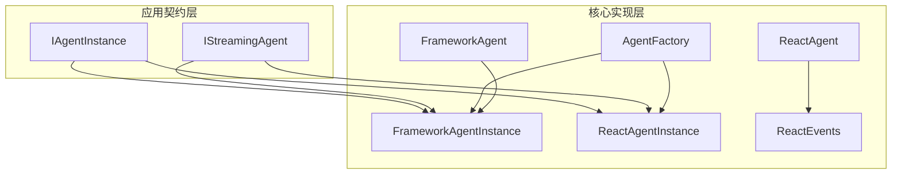
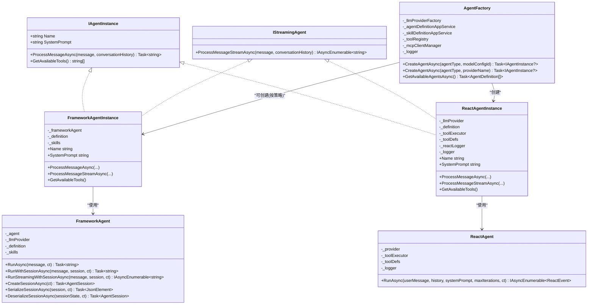
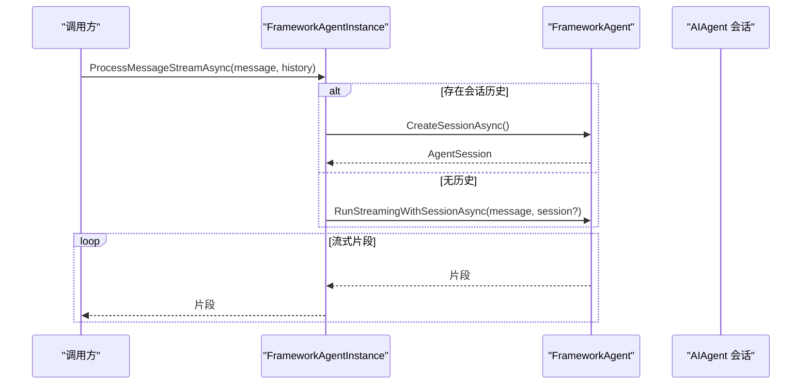
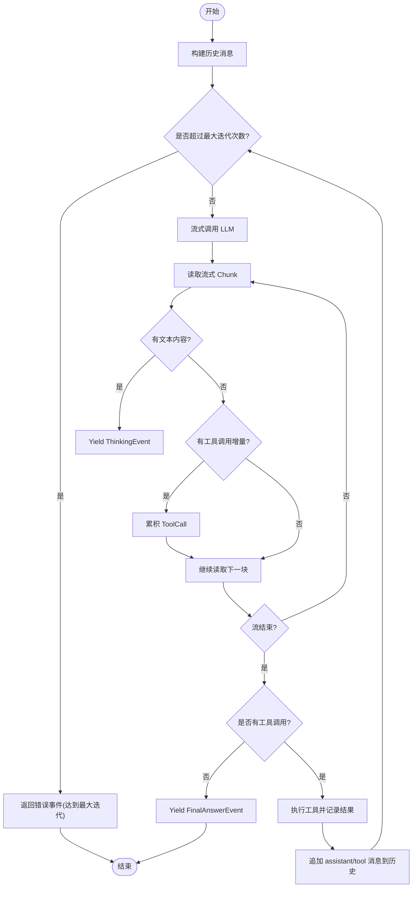
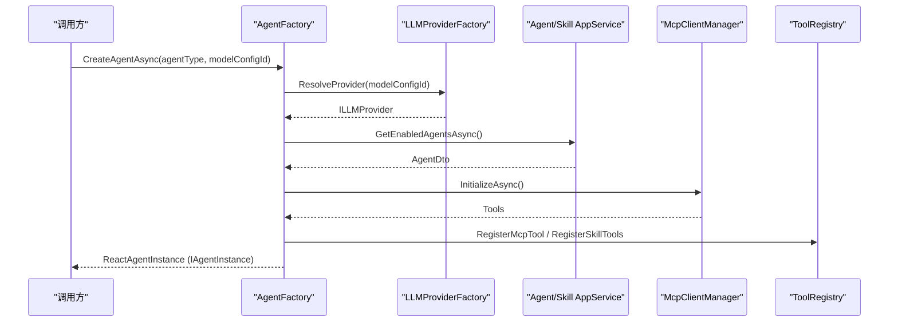
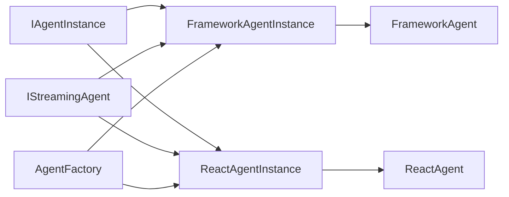

# 智能体框架设计

<cite>
**本文引用的文件**   
- [IAgentInstance.cs](file://src/Agent/Assistant/H.Assistant.Application.Contracts/Services/Agents/IAgentInstance.cs)
- [IStreamingAgent.cs](file://src/Agent/Assistant/H.Assistant.Application.Contracts/Services/Agents/IStreamingAgent.cs)
- [FrameworkAgent.cs](file://src/Agent/Assistant/H.Assistant.Core/Agents/FrameworkAgent.cs)
- [FrameworkAgentInstance.cs](file://src/Agent/Assistant/H.Assistant.Core/Agents/FrameworkAgentInstance.cs)
- [ReactAgent.cs](file://src/Agent/Assistant/H.Assistant.Core/Agents/ReactAgent.cs)
- [ReactAgentInstance.cs](file://src/Agent/Assistant/H.Assistant.Core/Agents/ReactAgentInstance.cs)
- [AgentFactory.cs](file://src/Agent/Assistant/H.Assistant.Core/Agents/AgentFactory.cs)
- [ReactEvents.cs](file://src/Agent/Assistant/H.Assistant.Core/Agents/ReactEvents.cs)
</cite>

## 目录
1. [简介](#简介)
2. [项目结构](#项目结构)
3. [核心组件](#核心组件)
4. [架构总览](#架构总览)
5. [详细组件分析](#详细组件分析)
6. [依赖关系分析](#依赖关系分析)
7. [性能考量](#性能考量)
8. [故障排查指南](#故障排查指南)
9. [结论](#结论)
10. [附录：自定义智能体开发指南与最佳实践](#附录自定义智能体开发指南与最佳实践)

## 简介
本文件面向智能体框架的设计与实现，重点阐述以下要点：
- FrameworkAgent 与 ReactAgent 两种智能体基类的设计原理与实现差异
- IAgentInstance 接口的作用与实例化机制
- IStreamingAgent 接口的流式处理能力与事件驱动架构
- AgentFactory 的智能体工厂模式与生命周期管理
- 智能体的状态管理、上下文传递与错误处理机制
- 自定义智能体开发的完整示例与最佳实践

## 项目结构
智能体相关代码主要位于 Assistant 模块的 Core 与 Application.Contracts 层：
- 接口定义在 Application.Contracts 层，确保跨层契约稳定
- 具体实现与编排逻辑在 Core 层，包含两类智能体与工厂
- 事件模型用于 ReAct 循环的事件驱动输出

图表来源 
- [IAgentInstance.cs:1-13](file://src/Agent/Assistant/H.Assistant.Application.Contracts/Services/Agents/IAgentInstance.cs#L1-L13)
- [IStreamingAgent.cs:1-13](file://src/Agent/Assistant/H.Assistant.Application.Contracts/Services/Agents/IStreamingAgent.cs#L1-L13)
- [FrameworkAgent.cs:1-166](file://src/Agent/Assistant/H.Assistant.Core/Agents/FrameworkAgent.cs#L1-L166)
- [FrameworkAgentInstance.cs:1-72](file://src/Agent/Assistant/H.Assistant.Core/Agents/FrameworkAgentInstance.cs#L1-L72)
- [ReactAgent.cs:1-261](file://src/Agent/Assistant/H.Assistant.Core/Agents/ReactAgent.cs#L1-L261)
- [ReactAgentInstance.cs:1-156](file://src/Agent/Assistant/H.Assistant.Core/Agents/ReactAgentInstance.cs#L1-L156)
- [AgentFactory.cs:1-229](file://src/Agent/Assistant/H.Assistant.Core/Agents/AgentFactory.cs#L1-L229)
- [ReactEvents.cs](file://src/Agent/Assistant/H.Assistant.Core/Agents/ReactEvents.cs)

章节来源
- [IAgentInstance.cs:1-13](file://src/Agent/Assistant/H.Assistant.Application.Contracts/Services/Agents/IAgentInstance.cs#L1-L13)
- [IStreamingAgent.cs:1-13](file://src/Agent/Assistant/H.Assistant.Application.Contracts/Services/Agents/IStreamingAgent.cs#L1-L13)
- [FrameworkAgent.cs:1-166](file://src/Agent/Assistant/H.Assistant.Core/Agents/FrameworkAgent.cs#L1-L166)
- [FrameworkAgentInstance.cs:1-72](file://src/Agent/Assistant/H.Assistant.Core/Agents/FrameworkAgentInstance.cs#L1-L72)
- [ReactAgent.cs:1-261](file://src/Agent/Assistant/H.Assistant.Core/Agents/ReactAgent.cs#L1-L261)
- [ReactAgentInstance.cs:1-156](file://src/Agent/Assistant/H.Assistant.Core/Agents/ReactAgentInstance.cs#L1-L156)
- [AgentFactory.cs:1-229](file://src/Agent/Assistant/H.Assistant.Core/Agents/AgentFactory.cs#L1-L229)
- [ReactEvents.cs](file://src/Agent/Assistant/H.Assistant.Core/Agents/ReactEvents.cs)

## 核心组件
- IAgentInstance：统一智能体实例契约，提供名称、系统提示、消息处理与可用工具查询能力
- IStreamingAgent：扩展 IAgentInstance，增加流式消息处理能力（IAsyncEnumerable）
- FrameworkAgent：基于 Microsoft Agent Framework 的封装，提供会话管理与工具注册
- FrameworkAgentInstance：将 FrameworkAgent 适配为 IAgentInstance/IStreamingAgent
- ReactAgent：ReAct 循环核心，持续“思考→行动→观察”，通过事件驱动输出
- ReactAgentInstance：将 ReactAgent 适配为 IAgentInstance/IStreamingAgent，并负责历史上下文构建与事件序列化
- AgentFactory：智能体工厂，负责 LLM Provider 解析、Agent 定义解析、工具注册与实例创建

章节来源
- [IAgentInstance.cs:1-13](file://src/Agent/Assistant/H.Assistant.Application.Contracts/Services/Agents/IAgentInstance.cs#L1-L13)
- [IStreamingAgent.cs:1-13](file://src/Agent/Assistant/H.Assistant.Application.Contracts/Services/Agents/IStreamingAgent.cs#L1-L13)
- [FrameworkAgent.cs:1-166](file://src/Agent/Assistant/H.Assistant.Core/Agents/FrameworkAgent.cs#L1-L166)
- [FrameworkAgentInstance.cs:1-72](file://src/Agent/Assistant/H.Assistant.Core/Agents/FrameworkAgentInstance.cs#L1-L72)
- [ReactAgent.cs:1-261](file://src/Agent/Assistant/H.Assistant.Core/Agents/ReactAgent.cs#L1-L261)
- [ReactAgentInstance.cs:1-156](file://src/Agent/Assistant/H.Assistant.Core/Agents/ReactAgentInstance.cs#L1-L156)
- [AgentFactory.cs:1-229](file://src/Agent/Assistant/H.Assistant.Core/Agents/AgentFactory.cs#L1-L229)

## 架构总览
整体采用“接口抽象 + 多实现 + 工厂”的分层架构。上层仅依赖 IAgentInstance/IStreamingAgent，运行时由 AgentFactory 根据配置选择具体实现。ReactAgent 以事件驱动方式输出中间过程，便于前端实时渲染与持久化。

图表来源 
- [IAgentInstance.cs:1-13](file://src/Agent/Assistant/H.Assistant.Application.Contracts/Services/Agents/IAgentInstance.cs#L1-L13)
- [IStreamingAgent.cs:1-13](file://src/Agent/Assistant/H.Assistant.Application.Contracts/Services/Agents/IStreamingAgent.cs#L1-L13)
- [FrameworkAgent.cs:1-166](file://src/Agent/Assistant/H.Assistant.Core/Agents/FrameworkAgent.cs#L1-L166)
- [FrameworkAgentInstance.cs:1-72](file://src/Agent/Assistant/H.Assistant.Core/Agents/FrameworkAgentInstance.cs#L1-L72)
- [ReactAgent.cs:1-261](file://src/Agent/Assistant/H.Assistant.Core/Agents/ReactAgent.cs#L1-L261)
- [ReactAgentInstance.cs:1-156](file://src/Agent/Assistant/H.Assistant.Core/Agents/ReactAgentInstance.cs#L1-L156)
- [AgentFactory.cs:1-229](file://src/Agent/Assistant/H.Assistant.Core/Agents/AgentFactory.cs#L1-L229)

## 详细组件分析

### IAgentInstance 与 IStreamingAgent 接口
- IAgentInstance 定义了智能体实例的统一能力：名称、系统提示、消息处理与工具查询
- IStreamingAgent 扩展了流式处理能力，返回 IAsyncEnumerable<string>，适合前端增量渲染
- 两个接口解耦了调用方与具体实现，支持多种智能体并存

章节来源
- [IAgentInstance.cs:1-13](file://src/Agent/Assistant/H.Assistant.Application.Contracts/Services/Agents/IAgentInstance.cs#L1-L13)
- [IStreamingAgent.cs:1-13](file://src/Agent/Assistant/H.Assistant.Application.Contracts/Services/Agents/IStreamingAgent.cs#L1-L13)

### FrameworkAgent 与 FrameworkAgentInstance
- FrameworkAgent 基于 Microsoft Agent Framework，封装 AIAgent、工具系统与会话管理
- 支持单次对话、带会话的多轮对话与流式对话
- 工具通过技能定义动态加载，使用反射与 AIFunctionFactory 创建
- FrameworkAgentInstance 将上述能力适配为 IAgentInstance/IStreamingAgent，并提供降级策略（不支持流式时回退到非流式）

图表来源 
- [FrameworkAgent.cs:1-166](file://src/Agent/Assistant/H.Assistant.Core/Agents/FrameworkAgent.cs#L1-L166)
- [FrameworkAgentInstance.cs:1-72](file://src/Agent/Assistant/H.Assistant.Core/Agents/FrameworkAgentInstance.cs#L1-L72)

章节来源
- [FrameworkAgent.cs:1-166](file://src/Agent/Assistant/H.Assistant.Core/Agents/FrameworkAgent.cs#L1-L166)
- [FrameworkAgentInstance.cs:1-72](file://src/Agent/Assistant/H.Assistant.Core/Agents/FrameworkAgentInstance.cs#L1-L72)

### ReactAgent 与 ReactAgentInstance
- ReactAgent 实现 ReAct 循环：持续迭代“思考→行动→观察”，直到任务完成或达到最大迭代次数
- 通过 Channel 桥接 try-catch 与 yield return，保证异常安全与流式输出
- 事件类型包括 ThinkingEvent、ToolCallingEvent、ToolResultEvent、FinalAnswerEvent、ErrorEvent
- ReactAgentInstance 负责：
  - 非流式：收集所有事件，聚合最终答案
  - 流式：将事件序列化为 JSON 字符串逐块返回
  - 历史上下文：从字符串列表构建 Message 列表，支持 user/assistant/system/tool 角色

图表来源 
- [ReactAgent.cs:1-261](file://src/Agent/Assistant/H.Assistant.Core/Agents/ReactAgent.cs#L1-L261)
- [ReactAgentInstance.cs:1-156](file://src/Agent/Assistant/H.Assistant.Core/Agents/ReactAgentInstance.cs#L1-L156)
- [ReactEvents.cs](file://src/Agent/Assistant/H.Assistant.Core/Agents/ReactEvents.cs)

章节来源
- [ReactAgent.cs:1-261](file://src/Agent/Assistant/H.Assistant.Core/Agents/ReactAgent.cs#L1-L261)
- [ReactAgentInstance.cs:1-156](file://src/Agent/Assistant/H.Assistant.Core/Agents/ReactAgentInstance.cs#L1-L156)
- [ReactEvents.cs](file://src/Agent/Assistant/H.Assistant.Core/Agents/ReactEvents.cs)

### AgentFactory 工厂与生命周期管理
- 职责：
  - 解析 LLM Provider（按 configId/providerName/默认）
  - 解析 Agent 定义（数据库已启用优先，否则使用内置默认）
  - 初始化 MCP 工具并注册到 ToolRegistry
  - 构建 ReactAgentInstance（当前默认实现）
- 生命周期：
  - 首次调用 EnsureMcpInitializedAsync 进行一次性初始化
  - 每次创建实例时注册技能工具与工具定义
  - 提供 GetAvailableAgentsAsync 暴露可用智能体类型

图表来源 
- [AgentFactory.cs:1-229](file://src/Agent/Assistant/H.Assistant.Core/Agents/AgentFactory.cs#L1-L229)

章节来源
- [AgentFactory.cs:1-229](file://src/Agent/Assistant/H.Assistant.Core/Agents/AgentFactory.cs#L1-L229)

## 依赖关系分析
- 接口与实现分离：上层仅依赖 IAgentInstance/IStreamingAgent
- 工厂集中装配：AgentFactory 统一管理 Provider、定义、工具与实例创建
- 事件驱动：ReactAgent 通过事件输出中间状态，降低耦合度
- 外部依赖：Microsoft Agent Framework、LLMProvider、ToolRegistry、MCP 客户端

图表来源 
- [IAgentInstance.cs:1-13](file://src/Agent/Assistant/H.Assistant.Application.Contracts/Services/Agents/IAgentInstance.cs#L1-L13)
- [IStreamingAgent.cs:1-13](file://src/Agent/Assistant/H.Assistant.Application.Contracts/Services/Agents/IStreamingAgent.cs#L1-L13)
- [FrameworkAgent.cs:1-166](file://src/Agent/Assistant/H.Assistant.Core/Agents/FrameworkAgent.cs#L1-L166)
- [FrameworkAgentInstance.cs:1-72](file://src/Agent/Assistant/H.Assistant.Core/Agents/FrameworkAgentInstance.cs#L1-L72)
- [ReactAgent.cs:1-261](file://src/Agent/Assistant/H.Assistant.Core/Agents/ReactAgent.cs#L1-L261)
- [ReactAgentInstance.cs:1-156](file://src/Agent/Assistant/H.Assistant.Core/Agents/ReactAgentInstance.cs#L1-L156)
- [AgentFactory.cs:1-229](file://src/Agent/Assistant/H.Assistant.Core/Agents/AgentFactory.cs#L1-L229)

章节来源
- [IAgentInstance.cs:1-13](file://src/Agent/Assistant/H.Assistant.Application.Contracts/Services/Agents/IAgentInstance.cs#L1-L13)
- [IStreamingAgent.cs:1-13](file://src/Agent/Assistant/H.Assistant.Application.Contracts/Services/Agents/IStreamingAgent.cs#L1-L13)
- [FrameworkAgent.cs:1-166](file://src/Agent/Assistant/H.Assistant.Core/Agents/FrameworkAgent.cs#L1-L166)
- [FrameworkAgentInstance.cs:1-72](file://src/Agent/Assistant/H.Assistant.Core/Agents/FrameworkAgentInstance.cs#L1-L72)
- [ReactAgent.cs:1-261](file://src/Agent/Assistant/H.Assistant.Core/Agents/ReactAgent.cs#L1-L261)
- [ReactAgentInstance.cs:1-156](file://src/Agent/Assistant/H.Assistant.Core/Agents/ReactAgentInstance.cs#L1-L156)
- [AgentFactory.cs:1-229](file://src/Agent/Assistant/H.Assistant.Core/Agents/AgentFactory.cs#L1-L229)

## 性能考量
- 流式处理：ReactAgent 使用 Channel 与 IAsyncEnumerable 避免阻塞，提升响应速度
- 事件去重与最小化传输：ReactAgentInstance 对事件进行精简序列化，减少网络负载
- 会话复用：FrameworkAgent 支持会话对象复用，减少重复初始化开销
- 工具注册延迟：AgentFactory 仅在首次需要时初始化 MCP 工具，避免启动慢
- 最大迭代限制：防止无限循环导致资源耗尽

[本节为通用指导，不直接分析具体文件]

## 故障排查指南
- LLM 调用失败：ReactAgent 捕获异常并返回 ErrorEvent，检查日志与网络配置
- 工具执行错误：ToolResultEvent 标记 IsError，需校验工具输入参数与权限
- 达到最大迭代次数：ErrorEvent.IsFatal=true，调整 Agent 元数据中的 maxIterations
- 流式中断：检查 CancellationToken 与 Channel 写入/读取是否被取消
- 会话状态异常：FrameworkAgent 的会话序列化/反序列化失败时，检查 JsonElement 格式

章节来源
- [ReactAgent.cs:1-261](file://src/Agent/Assistant/H.Assistant.Core/Agents/ReactAgent.cs#L1-L261)
- [ReactAgentInstance.cs:1-156](file://src/Agent/Assistant/H.Assistant.Core/Agents/ReactAgentInstance.cs#L1-L156)
- [FrameworkAgent.cs:1-166](file://src/Agent/Assistant/H.Assistant.Core/Agents/FrameworkAgent.cs#L1-L166)

## 结论
该智能体框架通过清晰的接口抽象、灵活的工厂装配与事件驱动的 ReAct 循环，实现了可扩展、高性能且易于调试的智能体体系。FrameworkAgent 侧重会话与工具集成，ReactAgent 侧重推理与行动闭环；两者均通过统一的 IAgentInstance/IStreamingAgent 对外暴露，便于上层应用按需切换与组合。

[本节为总结性内容，不直接分析具体文件]

## 附录：自定义智能体开发指南与最佳实践
- 实现 IAgentInstance 与 IStreamingAgent：
  - 提供 Name、SystemPrompt、ProcessMessageAsync、ProcessMessageStreamAsync、GetAvailableTools
  - 流式方法应使用 IAsyncEnumerable 逐步返回结果，避免长时间阻塞
- 上下文传递：
  - 使用 conversationHistory 字符串列表维护对话历史，ReactAgentInstance 会将其转换为 Message 列表
  - 对于复杂状态，可在 AgentDto.Metadata 中存储配置（如 maxIterations）
- 错误处理：
  - 在流式处理中捕获异常并通过 ErrorEvent 上报，区分 IsFatal 与非致命错误
  - 对工具执行结果进行校验，必要时返回友好错误信息
- 工具集成：
  - 通过 ToolRegistry 注册技能工具与 MCP 工具
  - 工具函数需具备清晰描述与参数约束，便于 LLM 正确调用
- 工厂扩展：
  - 在 AgentFactory 中添加新的智能体类型创建逻辑，保持向后兼容
  - 提供 GetAvailableAgentsAsync 的扩展，使前端可动态发现能力

章节来源
- [IAgentInstance.cs:1-13](file://src/Agent/Assistant/H.Assistant.Application.Contracts/Services/Agents/IAgentInstance.cs#L1-L13)
- [IStreamingAgent.cs:1-13](file://src/Agent/Assistant/H.Assistant.Application.Contracts/Services/Agents/IStreamingAgent.cs#L1-L13)
- [ReactAgentInstance.cs:1-156](file://src/Agent/Assistant/H.Assistant.Core/Agents/ReactAgentInstance.cs#L1-L156)
- [AgentFactory.cs:1-229](file://src/Agent/Assistant/H.Assistant.Core/Agents/AgentFactory.cs#L1-L229)