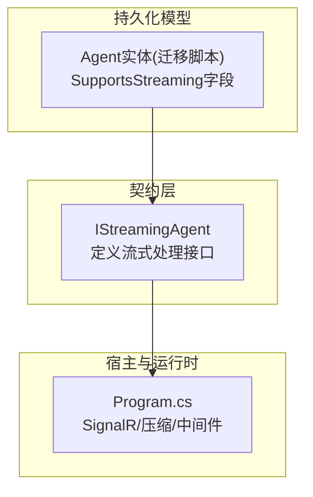
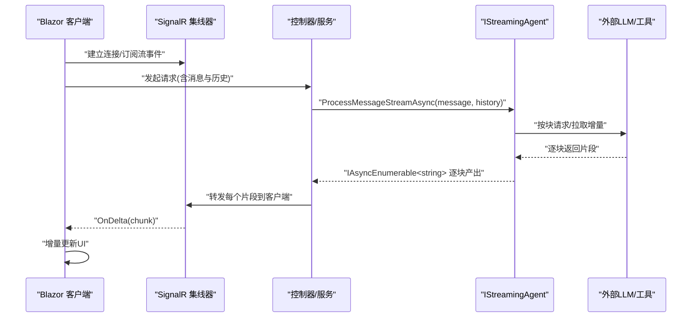
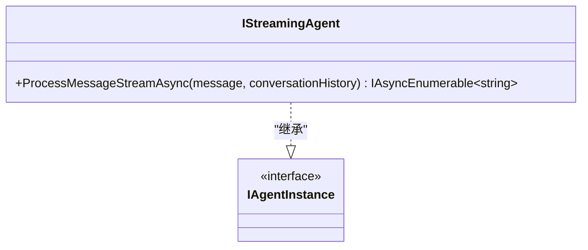
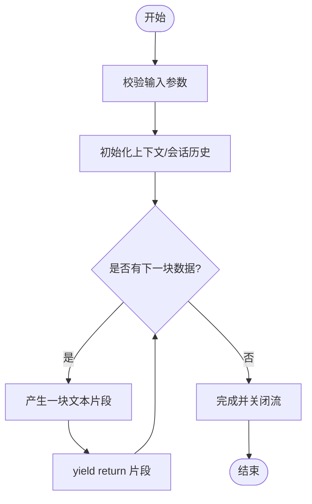
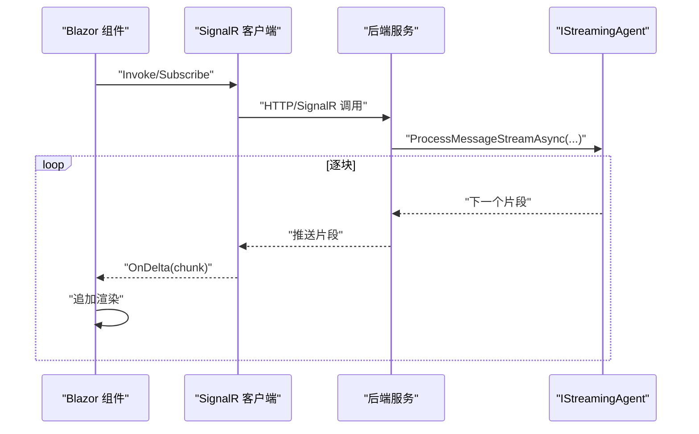
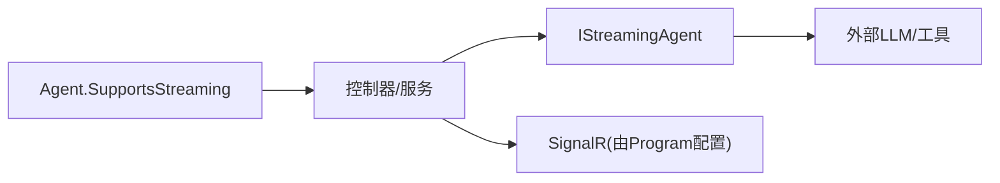

# 流式智能体接口

<cite>
**本文引用的文件**   
- [IStreamingAgent.cs](file://src/Agent/Assistant/H.Assistant.Application.Contracts/Services/Agents/IStreamingAgent.cs)
- [Program.cs](file://src/Host/H.AppLab.Host.All/H.AppLab.Host.All/Program.cs)
- [20260604021506_Init.Designer.cs](file://src/Tools/H.Assistant.DbMigrator/Migrations/20260604021506_Init.Designer.cs)
</cite>

## 目录
1. [简介](#简介)
2. [项目结构](#项目结构)
3. [核心组件](#核心组件)
4. [架构总览](#架构总览)
5. [详细组件分析](#详细组件分析)
6. [依赖关系分析](#依赖关系分析)
7. [性能考量](#性能考量)
8. [故障排查指南](#故障排查指南)
9. [结论](#结论)
10. [附录](#附录)

## 简介
本文件围绕“流式智能体接口”展开，聚焦 IStreamingAgent 的设计目标与使用方式，解释其基于异步枚举器的流式处理能力、事件驱动的数据流、背压与流量控制策略、错误处理与异常传播机制，以及缓冲与缓存策略。同时给出在 Blazor 前端中消费流式响应、实现实时更新的实践建议与优化要点。

## 项目结构
- 接口定义位于应用契约层：H.Assistant.Application.Contracts/Services/Agents/IStreamingAgent.cs
- 宿主服务（Web）配置了 SignalR 与压缩等能力，为流式与实时通信提供基础设施支撑
- 数据库迁移脚本中包含 Agent 实体的 SupportsStreaming 字段，体现对“是否支持流式”的元数据建模

图表来源 
- [IStreamingAgent.cs:1-13](file://src/Agent/Assistant/H.Assistant.Application.Contracts/Services/Agents/IStreamingAgent.cs#L1-L13)
- [Program.cs:14-19](file://src/Host/H.AppLab.Host.All/H.AppLab.Host.All/Program.cs#L14-L19)
- [20260604021506_Init.Designer.cs:96-98](file://src/Tools/H.Assistant.DbMigrator/Migrations/20260604021506_Init.Designer.cs#L96-L98)

章节来源
- [IStreamingAgent.cs:1-13](file://src/Agent/Assistant/H.Assistant.Application.Contracts/Services/Agents/IStreamingAgent.cs#L1-L13)
- [Program.cs:14-19](file://src/Host/H.AppLab.Host.All/H.AppLab.Host.All/Program.cs#L14-L19)
- [20260604021506_Init.Designer.cs:96-98](file://src/Tools/H.Assistant.DbMigrator/Migrations/20260604021506_Init.Designer.cs#L96-L98)

## 核心组件
- IStreamingAgent：定义流式智能体的统一契约，继承自 IAgentInstance，暴露 ProcessMessageStreamAsync，返回 IAsyncEnumerable<string>，用于逐块推送文本片段。
- Program.cs：启用 SignalR 并设置最大消息大小，为实时双向通信奠定基础；同时启用响应压缩，降低传输体积。
- 迁移脚本中的 Agent.SupportsStreaming：表示某类 Agent 是否具备流式能力，便于在服务选择或路由时进行特性判断。

章节来源
- [IStreamingAgent.cs:1-13](file://src/Agent/Assistant/H.Assistant.Application.Contracts/Services/Agents/IStreamingAgent.cs#L1-L13)
- [Program.cs:14-19](file://src/Host/H.AppLab.Host.All/H.AppLab.Host.All/Program.cs#L14-L19)
- [20260604021506_Init.Designer.cs:96-98](file://src/Tools/H.Assistant.DbMigrator/Migrations/20260604021506_Init.Designer.cs#L96-L98)

## 架构总览
IStreamingAgent 通过 IAsyncEnumerable<string> 将生成器驱动的增量数据推送到调用方。结合宿主层的 SignalR，可在 Web 场景中将流式片段实时推送给 Blazor 客户端，形成“服务端流式生成 -> 管道传输 -> 客户端增量渲染”的事件驱动链路。

图表来源 
- [IStreamingAgent.cs:1-13](file://src/Agent/Assistant/H.Assistant.Application.Contracts/Services/Agents/IStreamingAgent.cs#L1-L13)
- [Program.cs:14-19](file://src/Host/H.AppLab.Host.All/H.AppLab.Host.All/Program.cs#L14-L19)

## 详细组件分析

### IStreamingAgent 接口设计
- 设计理念：以“流式优先”的方式暴露智能体能力，避免一次性等待完整结果，提升首字节延迟与用户体验。
- 方法签名：ProcessMessageStreamAsync(string message, List<string>? conversationHistory = null)，返回 IAsyncEnumerable<string>，允许调用方按需消费每一块内容。
- 扩展点：通过 IAgentInstance 基接口可复用实例生命周期、上下文注入等通用能力。

图表来源 
- [IStreamingAgent.cs:1-13](file://src/Agent/Assistant/H.Assistant.Application.Contracts/Services/Agents/IStreamingAgent.cs#L1-L13)

章节来源
- [IStreamingAgent.cs:1-13](file://src/Agent/Assistant/H.Assistant.Application.Contracts/Services/Agents/IStreamingAgent.cs#L1-L13)

### 流式数据流与异步枚举器模式
- 生产者侧：实现类通过 yield return 或异步迭代器逐步产出字符串片段，避免阻塞线程。
- 消费者侧：调用方使用 foreach await 消费，天然支持背压（当消费者暂停读取时，生产端应感知并暂缓产出）。
- 典型流程：消息预处理 -> 分块推理/检索 -> 增量拼接 -> 结束标记。

[该图为概念流程图，不直接映射具体代码文件]

### 事件驱动与实时通信（SignalR）
- 服务端：控制器或服务接收请求后，调用 IStreamingAgent 获取流，并将每块数据通过 SignalR 推送至客户端。
- 客户端：Blazor 组件订阅事件，收到增量片段后即时更新 UI，无需整页刷新。
- 传输优化：启用 Brotli/Gzip 压缩，减少带宽占用。

图表来源 
- [Program.cs:14-19](file://src/Host/H.AppLab.Host.All/H.AppLab.Host.All/Program.cs#L14-L19)
- [IStreamingAgent.cs:1-13](file://src/Agent/Assistant/H.Assistant.Application.Contracts/Services/Agents/IStreamingAgent.cs#L1-L13)

### 背压与流量控制策略
- 消费者驱动：IAsyncEnumerable 天然支持消费端控制速率，若 UI 繁忙或网络拥塞，可降低消费频率，从而间接抑制上游过快产出。
- 缓冲区限制：在生产者侧维护有界队列，超过阈值时暂停产出，防止内存暴涨。
- 超时与取消：为流式处理绑定 CancellationToken，并在长时间无进展时主动中断，释放资源。
- 限流与节流：对高频片段进行合并（如批量发送），降低前端渲染压力。

[本节为通用策略说明，不直接分析具体文件]

### 错误处理与异常传播
- 异常冒泡：在 IAsyncEnumerable 中抛出异常会立即终止流，调用方可捕获并做降级处理。
- 部分失败恢复：对单个片段失败进行重试或跳过，保证整体流的可恢复性。
- 日志与诊断：记录关键节点耗时与错误信息，便于定位问题。
- 前端容错：Blazor 组件需监听连接断开、消息过大等异常，提示用户并重试。

[本节为通用策略说明，不直接分析具体文件]

### 缓冲与缓存策略
- 短期缓冲：在前后端之间采用小窗口缓冲，平滑突发流量，避免抖动。
- 去重与合并：对重复片段进行去重，对相邻短片段进行合并，减少渲染次数。
- 状态缓存：对话历史与系统提示可缓存于服务端，缩短冷启动时间。
- 缓存失效：根据会话 ID 或版本戳进行失效控制，确保一致性。

[本节为通用策略说明，不直接分析具体文件]

### 在 Blazor 前端处理流式响应与实时更新
- 连接管理：使用 SignalR 客户端建立连接，处理重连与断线恢复。
- 事件订阅：订阅增量事件，将片段追加到当前输出区域，保持滚动到底部。
- 渲染优化：使用虚拟列表或增量 DOM 更新，避免全量重绘。
- 错误提示：在网络异常或数据过大时给出友好提示，并提供重试入口。

[本节为通用策略说明，不直接分析具体文件]

## 依赖关系分析
- IStreamingAgent 作为契约，被上层服务/控制器依赖，用于获取流式结果。
- Program.cs 提供的 SignalR 能力被控制器/集线器依赖，用于将流式数据推送给前端。
- 迁移脚本中的 Agent.SupportsStreaming 字段可用于服务发现或路由决策，决定是否需要走流式通道。

图表来源 
- [IStreamingAgent.cs:1-13](file://src/Agent/Assistant/H.Assistant.Application.Contracts/Services/Agents/IStreamingAgent.cs#L1-L13)
- [Program.cs:14-19](file://src/Host/H.AppLab.Host.All/H.AppLab.Host.All/Program.cs#L14-L19)
- [20260604021506_Init.Designer.cs:96-98](file://src/Tools/H.Assistant.DbMigrator/Migrations/20260604021506_Init.Designer.cs#L96-L98)

章节来源
- [IStreamingAgent.cs:1-13](file://src/Agent/Assistant/H.Assistant.Application.Contracts/Services/Agents/IStreamingAgent.cs#L1-L13)
- [Program.cs:14-19](file://src/Host/H.AppLab.Host.All/H.AppLab.Host.All/Program.cs#L14-L19)
- [20260604021506_Init.Designer.cs:96-98](file://src/Tools/H.Assistant.DbMigrator/Migrations/20260604021506_Init.Designer.cs#L96-L98)

## 性能考量
- 首字节延迟：尽量早地产出首个片段，减少端到端等待。
- 吞吐与并发：合理设置并发度与线程池大小，避免过度竞争。
- 序列化与压缩：启用 Brotli/Gzip，降低网络开销。
- 内存占用：使用有界缓冲与流式处理，避免一次性加载大对象。
- 前端渲染：增量更新与虚拟列表，降低主线程压力。

[本节为通用指导，不直接分析具体文件]

## 故障排查指南
- 连接问题：检查 SignalR 中间件是否正确注册，端口与跨域配置是否生效。
- 消息过大：确认 MaximumReceiveMessageSize 设置是否满足需求。
- 流卡住：检查是否存在未消费的 IAsyncEnumerable 导致的背压阻塞，确认取消令牌是否生效。
- 异常定位：查看服务端日志与客户端控制台，关注连接断开、解析失败等错误。

章节来源
- [Program.cs:14-19](file://src/Host/H.AppLab.Host.All/H.AppLab.Host.All/Program.cs#L14-L19)

## 结论
IStreamingAgent 以简洁的异步枚举器接口定义了流式智能体的标准行为，配合宿主层的 SignalR 与压缩能力，可实现低延迟、高吞吐的实时交互体验。通过合理的背压、错误处理与缓存策略，能够在复杂网络与高并发环境下保持稳定与高效。Blazor 前端通过事件驱动的消费模式，能够无缝集成流式数据，提供流畅的用户体验。

## 附录
- 术语
  - 背压：下游消费能力不足时，上游减缓产出的机制
  - 流式：按块逐步产出数据，而非一次性返回完整结果
  - 事件驱动：以事件为中心的消息传递与处理模式
- 最佳实践清单
  - 始终为流式处理绑定取消令牌
  - 使用有界缓冲与合并策略控制内存与渲染压力
  - 在前端实现断线重连与错误提示
  - 在服务端记录关键指标（延迟、吞吐、错误率）

[本节为补充说明，不直接分析具体文件]