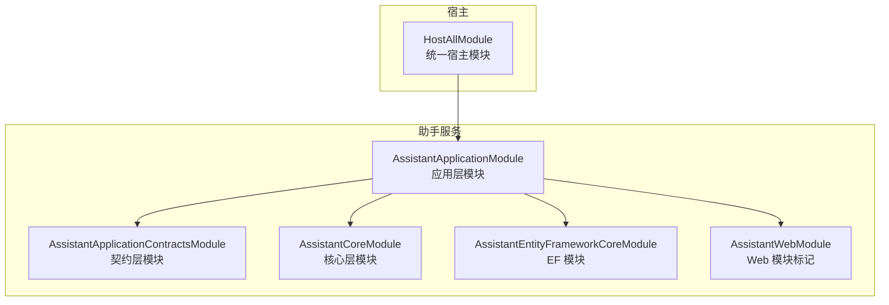
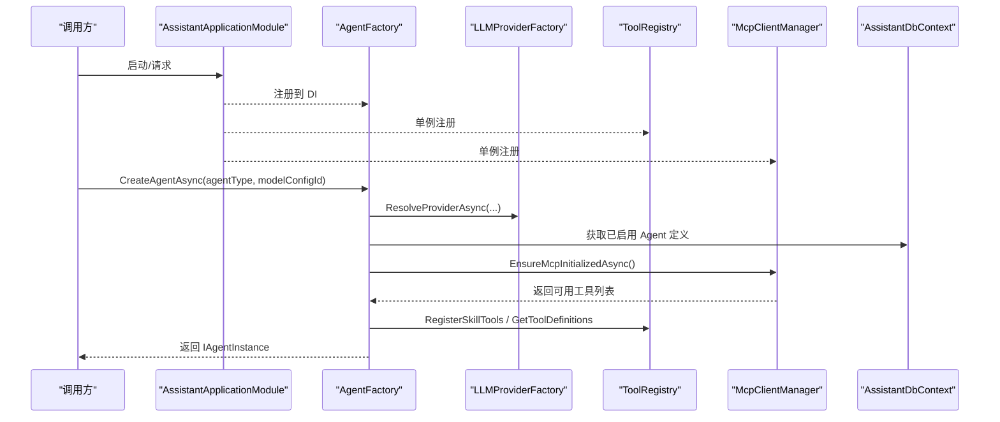
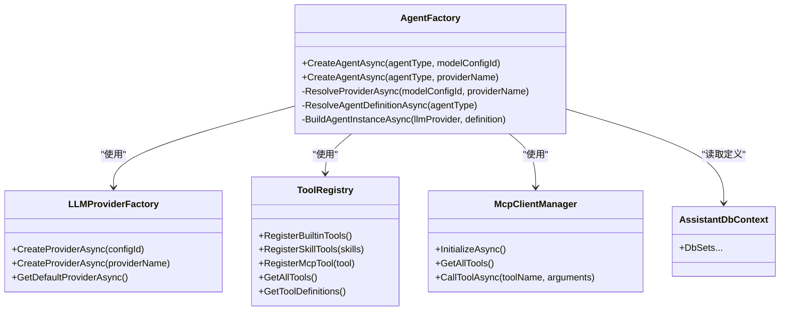
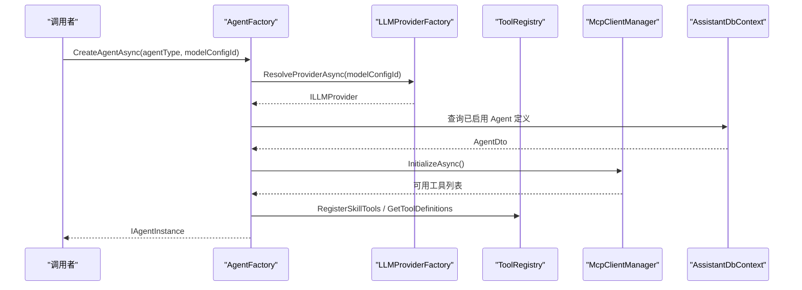
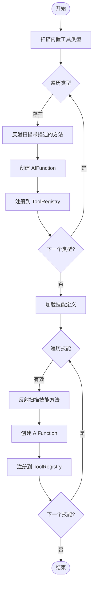
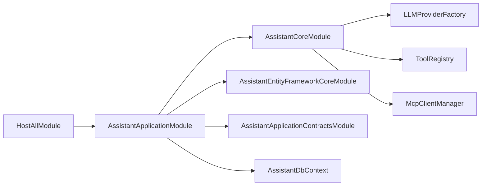

# 核心模块架构

<cite>
**本文引用的文件**   
- [AssistantCoreModule.cs](file://src/Agent/Assistant/H.Assistant.Core/AssistantCoreModule.cs)
- [AssistantApplicationModule.cs](file://src/Agent/Assistant/H.Assistant.Application/AssistantApplicationModule.cs)
- [AssistantApplicationContractsModule.cs](file://src/Agent/Assistant/H.Assistant.Application.Contracts/AssistantApplicationContractsModule.cs)
- [AssistantEntityFrameworkCoreModule.cs](file://src/Agent/Assistant/H.Assistant.EntityFrameworkCore/AssistantEntityFrameworkCoreModule.cs)
- [AssistantDbContext.cs](file://src/Agent/Assistant/H.Assistant.EntityFrameworkCore/AssistantDbContext.cs)
- [LLMProviderFactory.cs](file://src/Agent/Assistant/H.Assistant.Core/LLM/LLMProviderFactory.cs)
- [AgentFactory.cs](file://src/Agent/Assistant/H.Assistant.Core/Agents/AgentFactory.cs)
- [ToolRegistry.cs](file://src/Agent/Assistant/H.Assistant.Core/Tools/ToolRegistry.cs)
- [McpClientManager.cs](file://src/Agent/Assistant/H.Assistant.Core/Mcp/McpClientManager.cs)
- [TaskWorker.cs](file://src/Agent/Assistant/H.Assistant.Application/Workers/TaskWorker.cs)
- [HostAllModule.cs](file://src/Host/H.AppLab.Host.All/H.AppLab.Host.All/HostAllModule.cs)
- [LLMEntity.cs](file://src/Agent/Assistant/H.Assistant.EntityFrameworkCore/Entities/LLMEntity.cs)
</cite>

## 目录
1. [简介](#简介)
2. [项目结构](#项目结构)
3. [核心组件](#核心组件)
4. [架构总览](#架构总览)
5. [详细组件分析](#详细组件分析)
6. [依赖关系分析](#依赖关系分析)
7. [性能考量](#性能考量)
8. [故障排查指南](#故障排查指南)
9. [结论](#结论)
10. [附录：新模块开发指南与最佳实践](#附录新模块开发指南与最佳实践)

## 简介
本文件围绕助手服务的核心模块，系统化阐述基于 ABP 的模块化架构在“助手服务”中的落地方式。重点说明 Core、Application、Contracts 三层的职责边界与依赖方向，模块初始化流程与依赖注入配置，模块间通信机制与数据传递模式，版本管理与兼容性策略，以及新增模块的开发指南与最佳实践。

## 项目结构
助手服务采用典型的 ABP 分层与模块化组织：
- Contracts 层：对外暴露 DTO、接口与程序集标记，供 Application 与 Web/客户端引用。
- Application 层：编排业务用例、注册应用服务、后台任务与映射配置等。
- Core 层：领域能力与基础设施（LLM 工厂、工具注册中心、MCP 客户端管理、Agent 工厂）。
- EntityFrameworkCore 层：数据访问与模型定义。
- Web 层：Web 端模块标记（当前为空，用于扩展）。
- Host 统一宿主：聚合所有应用模块，完成 DI、认证、多租户、控制器发现等。

图表来源 
- [HostAllModule.cs:37-78](file://src/Host/H.AppLab.Host.All/H.AppLab.Host.All/HostAllModule.cs#L37-L78)
- [AssistantApplicationModule.cs:12-16](file://src/Agent/Assistant/H.Assistant.Application/AssistantApplicationModule.cs#L12-L16)
- [AssistantEntityFrameworkCoreModule.cs:8-11](file://src/Agent/Assistant/H.Assistant.EntityFrameworkCore/AssistantEntityFrameworkCoreModule.cs#L8-L11)
- [AssistantCoreModule.cs:5-11](file://src/Agent/Assistant/H.Assistant.Core/AssistantCoreModule.cs#L5-L11)
- [AssistantApplicationContractsModule.cs:6-9](file://src/Agent/Assistant/H.Assistant.Application.Contracts/AssistantApplicationContractsModule.cs#L6-L9)
- [AssistantWebModule.cs:6-8](file://src/Agent/Assistant/H.Assistant.Web/AssistantWebModule.cs#L6-L8)

章节来源
- [HostAllModule.cs:37-78](file://src/Host/H.AppLab.Host.All/H.AppLab.Host.All/HostAllModule.cs#L37-L78)
- [AssistantApplicationModule.cs:12-16](file://src/Agent/Assistant/H.Assistant.Application/AssistantApplicationModule.cs#L12-L16)
- [AssistantEntityFrameworkCoreModule.cs:8-11](file://src/Agent/Assistant/H.Assistant.EntityFrameworkCore/AssistantEntityFrameworkCoreModule.cs#L8-L11)
- [AssistantCoreModule.cs:5-11](file://src/Agent/Assistant/H.Assistant.Core/AssistantCoreModule.cs#L5-L11)
- [AssistantApplicationContractsModule.cs:6-9](file://src/Agent/Assistant/H.Assistant.Application.Contracts/AssistantApplicationContractsModule.cs#L6-L9)
- [AssistantWebModule.cs:6-8](file://src/Agent/Assistant/H.Assistant.Web/AssistantWebModule.cs#L6-L8)

## 核心组件
- 契约层模块：提供程序集标记，便于反射定位与扫描。
- 应用层模块：装配 AutoMapper、注册 LLM 工厂、工具注册中心、MCP 客户端管理器、Agent 工厂与定时 Worker。
- 核心层模块：承载领域与基础能力（当前为占位，后续可在此扩展）。
- EF 模块：注册 DbContext、默认仓储与数据库提供者（SQL Server）。
- 宿主模块：聚合各应用模块，启用 Cookie 认证、多租户、自动 API 控制器发现。

章节来源
- [AssistantApplicationContractsModule.cs:6-9](file://src/Agent/Assistant/H.Assistant.Application.Contracts/AssistantApplicationContractsModule.cs#L6-L9)
- [AssistantApplicationModule.cs:19-46](file://src/Agent/Assistant/H.Assistant.Application/AssistantApplicationModule.cs#L19-L46)
- [AssistantCoreModule.cs:5-11](file://src/Agent/Assistant/H.Assistant.Core/AssistantCoreModule.cs#L5-L11)
- [AssistantEntityFrameworkCoreModule.cs:14-25](file://src/Agent/Assistant/H.Assistant.EntityFrameworkCore/AssistantEntityFrameworkCoreModule.cs#L14-L25)
- [HostAllModule.cs:81-156](file://src/Host/H.AppLab.Host.All/H.AppLab.Host.All/HostAllModule.cs#L81-L156)

## 架构总览
助手服务以 ABP 模块化为核心，通过 DependsOn 声明依赖，由宿主统一装配。运行时关键路径包括：
- Agent 创建：AgentFactory 解析 LLM Provider、加载 Agent 定义、构建 ReactAgentInstance。
- 工具注册：ToolRegistry 扫描内置技能与动态技能，支持 MCP 工具注入。
- MCP 集成：McpClientManager 连接外部 MCP Server，发现并调用工具。
- 定时任务：TaskWorker 周期性扫描并执行待执行任务。

图表来源 
- [AssistantApplicationModule.cs:19-46](file://src/Agent/Assistant/H.Assistant.Application/AssistantApplicationModule.cs#L19-L46)
- [AgentFactory.cs:93-112](file://src/Agent/Assistant/H.Assistant.Core/Agents/AgentFactory.cs#L93-L112)
- [LLMProviderFactory.cs:20-42](file://src/Agent/Assistant/H.Assistant.Core/LLM/LLMProviderFactory.cs#L20-L42)
- [McpClientManager.cs:30-58](file://src/Agent/Assistant/H.Assistant.Core/Mcp/McpClientManager.cs#L30-L58)
- [ToolRegistry.cs:83-140](file://src/Agent/Assistant/H.Assistant.Core/Tools/ToolRegistry.cs#L83-L140)
- [AssistantDbContext.cs:10-19](file://src/Agent/Assistant/H.Assistant.EntityFrameworkCore/AssistantDbContext.cs#L10-L19)

## 详细组件分析

### 契约层（Contracts）
- 职责：定义跨层共享的 DTO、服务接口与程序集标记，避免循环依赖。
- 关键点：程序集标记类用于反射定位，便于宿主或框架扫描。

章节来源
- [AssistantApplicationContractsModule.cs:6-9](file://src/Agent/Assistant/H.Assistant.Application.Contracts/AssistantApplicationContractsModule.cs#L6-L9)

### 应用层（Application）
- 职责：编排用例、注册应用服务、配置映射、注册后台任务与核心服务。
- 关键点：
  - 使用 AbpAutoMapperModule 注册映射。
  - 将 LLMProviderFactory、IToolRegistry、McpClientManager、AgentFactory 注册到 DI。
  - 注册 TaskWorker 作为托管服务。

章节来源
- [AssistantApplicationModule.cs:19-46](file://src/Agent/Assistant/H.Assistant.Application/AssistantApplicationModule.cs#L19-L46)

### 核心层（Core）
- 职责：封装领域能力与通用基础设施，如 LLM 工厂、工具注册中心、MCP 客户端管理、Agent 工厂。
- 关键点：
  - LLMProviderFactory：根据配置 ID、ProviderName 或默认配置创建具体 Provider。
  - ToolRegistry：反射扫描内置与动态技能方法，生成 AIFunction；支持 MCP 工具注入。
  - McpClientManager：连接多个 MCP Server，发现工具并提供统一调用入口。
  - AgentFactory：组合上述能力，按 Agent 类型与模型配置创建实例。

章节来源
- [LLMProviderFactory.cs:20-42](file://src/Agent/Assistant/H.Assistant.Core/LLM/LLMProviderFactory.cs#L20-L42)
- [ToolRegistry.cs:28-78](file://src/Agent/Assistant/H.Assistant.Core/Tools/ToolRegistry.cs#L28-L78)
- [McpClientManager.cs:30-104](file://src/Agent/Assistant/H.Assistant.Core/Mcp/McpClientManager.cs#L30-L104)
- [AgentFactory.cs:93-193](file://src/Agent/Assistant/H.Assistant.Core/Agents/AgentFactory.cs#L93-L193)

### 数据访问层（EntityFrameworkCore）
- 职责：定义实体、上下文与仓储配置，绑定 SQL Server。
- 关键点：
  - AssistantDbContext 包含 LLM、Chat、Task、Agent、Skill、Knowledge、McpServer 等集合。
  - 使用 AddAbpDbContext 与默认仓储，简化 CRUD。

章节来源
- [AssistantEntityFrameworkCoreModule.cs:14-25](file://src/Agent/Assistant/H.Assistant.EntityFrameworkCore/AssistantEntityFrameworkCoreModule.cs#L14-L25)
- [AssistantDbContext.cs:10-19](file://src/Agent/Assistant/H.Assistant.EntityFrameworkCore/AssistantDbContext.cs#L10-L19)

### 宿主（Host）
- 职责：聚合所有应用模块，配置认证、多租户、API 控制器发现等。
- 关键点：
  - 通过 DependsOn 引用 AssistantApplicationModule。
  - 启用 Cookie 认证与多租户，注册自定义租户解析器。
  - 使用 ConventionalControllers 自动发现各模块控制器。

章节来源
- [HostAllModule.cs:37-78](file://src/Host/H.AppLab.Host.All/H.AppLab.Host.All/HostAllModule.cs#L37-L78)
- [HostAllModule.cs:115-156](file://src/Host/H.AppLab.Host.All/H.AppLab.Host.All/HostAllModule.cs#L115-L156)

### 类图（核心对象关系）

图表来源 
- [LLMProviderFactory.cs:20-42](file://src/Agent/Assistant/H.Assistant.Core/LLM/LLMProviderFactory.cs#L20-L42)
- [AgentFactory.cs:93-193](file://src/Agent/Assistant/H.Assistant.Core/Agents/AgentFactory.cs#L93-L193)
- [ToolRegistry.cs:28-140](file://src/Agent/Assistant/H.Assistant.Core/Tools/ToolRegistry.cs#L28-L140)
- [McpClientManager.cs:30-104](file://src/Agent/Assistant/H.Assistant.Core/Mcp/McpClientManager.cs#L30-L104)
- [AssistantDbContext.cs:10-19](file://src/Agent/Assistant/H.Assistant.EntityFrameworkCore/AssistantDbContext.cs#L10-L19)

### 序列图（Agent 创建流程）

图表来源 
- [AgentFactory.cs:93-193](file://src/Agent/Assistant/H.Assistant.Core/Agents/AgentFactory.cs#L93-L193)
- [LLMProviderFactory.cs:20-42](file://src/Agent/Assistant/H.Assistant.Core/LLM/LLMProviderFactory.cs#L20-L42)
- [McpClientManager.cs:30-58](file://src/Agent/Assistant/H.Assistant.Core/Mcp/McpClientManager.cs#L30-L58)
- [ToolRegistry.cs:83-140](file://src/Agent/Assistant/H.Assistant.Core/Tools/ToolRegistry.cs#L83-L140)
- [AssistantDbContext.cs:10-19](file://src/Agent/Assistant/H.Assistant.EntityFrameworkCore/AssistantDbContext.cs#L10-L19)

### 流程图（工具注册与发现）

图表来源 
- [ToolRegistry.cs:28-78](file://src/Agent/Assistant/H.Assistant.Core/Tools/ToolRegistry.cs#L28-L78)
- [ToolRegistry.cs:83-140](file://src/Agent/Assistant/H.Assistant.Core/Tools/ToolRegistry.cs#L83-L140)

## 依赖关系分析
- 模块依赖方向：
  - Application 依赖 Core、EF、Contracts。
  - Host 依赖所有 Application 模块。
  - Core 不依赖 Application（保持低耦合）。
- 运行时依赖：
  - AgentFactory 依赖 LLMProviderFactory、ToolRegistry、McpClientManager、应用服务（通过 Contracts 暴露）。
  - ToolRegistry 依赖 AIFunction 工厂与反射。
  - McpClientManager 依赖外部 MCP Server 协议实现。

图表来源 
- [HostAllModule.cs:37-78](file://src/Host/H.AppLab.Host.All/H.AppLab.Host.All/HostAllModule.cs#L37-L78)
- [AssistantApplicationModule.cs:12-16](file://src/Agent/Assistant/H.Assistant.Application/AssistantApplicationModule.cs#L12-L16)
- [AssistantEntityFrameworkCoreModule.cs:8-11](file://src/Agent/Assistant/H.Assistant.EntityFrameworkCore/AssistantEntityFrameworkCoreModule.cs#L8-L11)
- [AssistantCoreModule.cs:5-11](file://src/Agent/Assistant/H.Assistant.Core/AssistantCoreModule.cs#L5-L11)
- [AssistantApplicationContractsModule.cs:6-9](file://src/Agent/Assistant/H.Assistant.Application.Contracts/AssistantApplicationContractsModule.cs#L6-L9)

章节来源
- [HostAllModule.cs:37-78](file://src/Host/H.AppLab.Host.All/H.AppLab.Host.All/HostAllModule.cs#L37-L78)
- [AssistantApplicationModule.cs:12-16](file://src/Agent/Assistant/H.Assistant.Application/AssistantApplicationModule.cs#L12-L16)

## 性能考量
- 单例与瞬态选择：
  - ToolRegistry、McpClientManager 使用单例，减少重复初始化与连接开销。
  - AgentFactory 使用瞬态，确保每次创建独立上下文。
- 异步与超时：
  - MCP 连接设置超时，避免阻塞启动。
  - 定时任务使用延迟与取消令牌，降低 CPU 占用。
- 反射成本：
  - 工具注册仅在初始化时进行，避免请求路径上的反射开销。
- 数据库索引：
  - 对常用查询字段建立索引（如会话、任务状态、下次执行时间），提升查询性能。

[本节为通用指导，无需代码来源]

## 故障排查指南
- MCP 初始化失败：
  - 现象：日志提示“MCP Client 初始化失败”，不影响其他功能继续运行。
  - 处理：检查 Endpoint、TransportType、Headers 配置；确认服务端可达。
- 工具未注册：
  - 现象：日志显示“注册工具失败”或“没有找到可注册的方法”。
  - 处理：确认方法带有描述属性且签名正确；技能 ImplementationClass 可加载。
- 定时任务未执行：
  - 现象：无任务执行日志。
  - 处理：检查任务 IsEnabled、Status、NextExecutionTime；确认 Worker 已启动。
- 认证与多租户：
  - 现象：Cookie 过期或租户无效导致重定向。
  - 处理：检查 Cookie 配置与 ClaimsTenantResolveContributor 逻辑。

章节来源
- [McpClientManager.cs:30-58](file://src/Agent/Assistant/H.Assistant.Core/Mcp/McpClientManager.cs#L30-L58)
- [ToolRegistry.cs:73-78](file://src/Agent/Assistant/H.Assistant.Core/Tools/ToolRegistry.cs#L73-L78)
- [ToolRegistry.cs:130-139](file://src/Agent/Assistant/H.Assistant.Core/Tools/ToolRegistry.cs#L130-L139)
- [TaskWorker.cs:24-79](file://src/Agent/Assistant/H.Assistant.Application/Workers/TaskWorker.cs#L24-L79)
- [HostAllModule.cs:115-156](file://src/Host/H.AppLab.Host.All/H.AppLab.Host.All/HostAllModule.cs#L115-L156)

## 结论
助手服务通过 ABP 模块化清晰划分了 Core、Application、Contracts 的职责，借助宿主统一装配与 DI 管理，实现了可扩展的 Agent 生命周期、工具注册与 MCP 集成。该架构具备良好的可维护性与演进空间，适合持续添加新模块与新能力。

[本节为总结性内容，无需代码来源]

## 附录：新模块开发指南与最佳实践
- 新建模块建议结构：
  - MyModule.Application.Contracts：DTO、接口、程序集标记。
  - MyModule.Application：应用服务、映射、模块装配。
  - MyModule.Domain（可选）：领域模型与事件。
  - MyModule.EntityFrameworkCore：实体、上下文、仓储。
  - MyModule.Web（可选）：页面与视图。
- 模块装配要点：
  - 在 Application 模块中通过 DependsOn 引用 Core、EF、Contracts。
  - 在宿主模块中通过 DependsOn 引用新模块的 Application 模块。
  - 如需控制器，使用 ConventionalControllers 自动发现。
- 依赖注入最佳实践：
  - 长生命周期对象（如注册中心、客户端管理器）使用单例。
  - 短生命周期对象（如工厂、工作单元）使用瞬态。
- 版本管理与兼容性：
  - 通过 DTO 与接口版本化（新增字段而非修改旧字段）。
  - 向后兼容：保留旧接口，逐步迁移调用方。
  - 配置项变更：提供默认值与迁移脚本。
- 测试与文档：
  - 为关键流程编写单元测试与集成测试。
  - 更新模块 README 与接口文档，便于协作。

[本节为通用指导，无需代码来源]