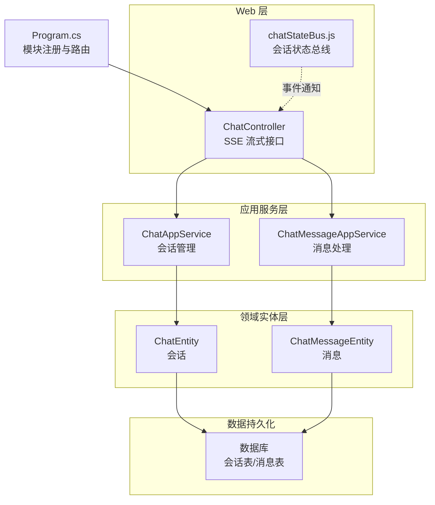
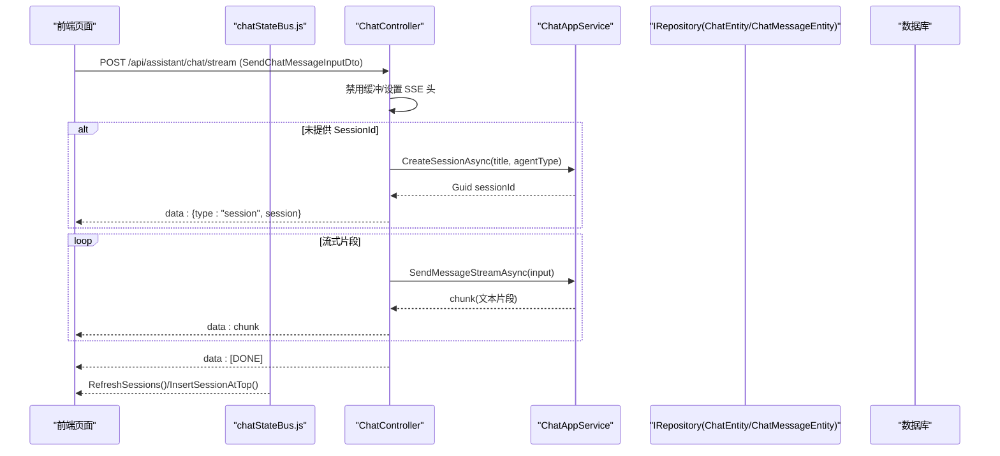
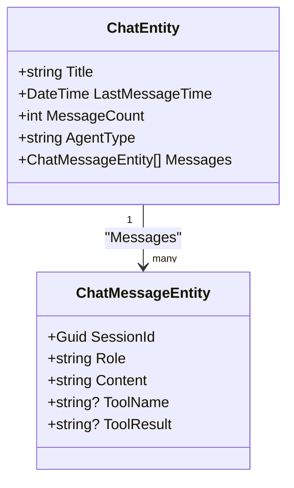
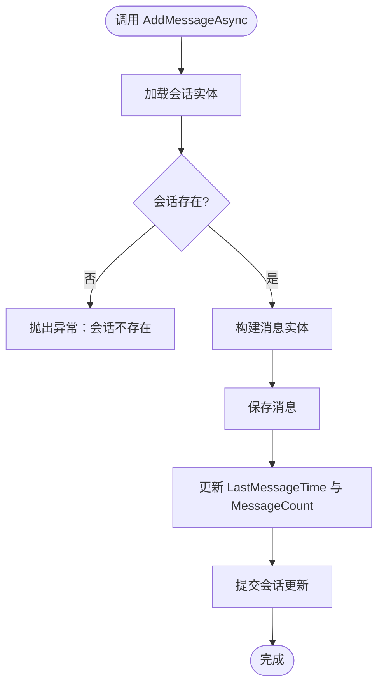
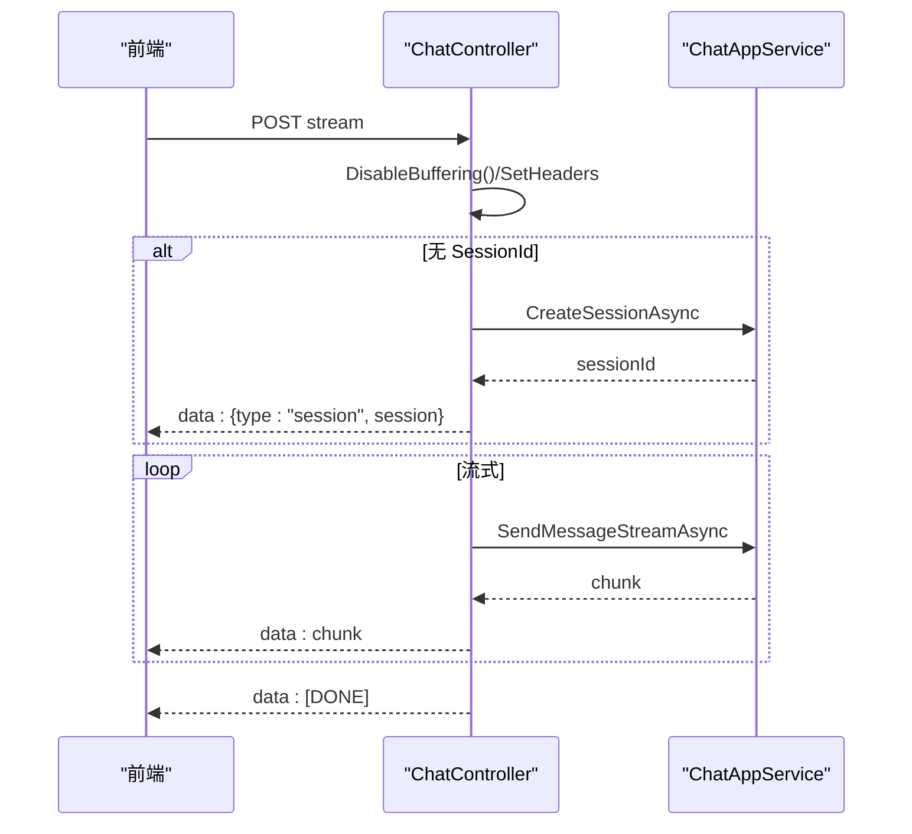
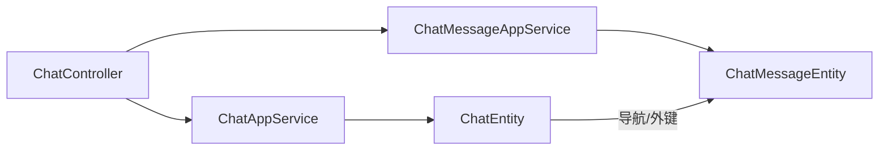
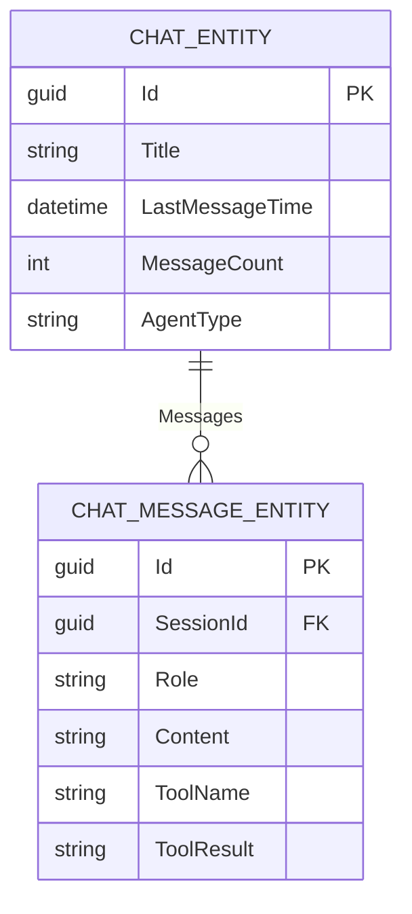

# 对话管理

<cite>
**本文引用的文件**   
- [ChatEntity.cs](file://src/Agent/Assistant/H.Assistant.EntityFrameworkCore/Entities/ChatEntity.cs)
- [ChatMessageEntity.cs](file://src/Agent/Assistant/H.Assistant.EntityFrameworkCore/Entities/ChatMessageEntity.cs)
- [ChatAppService.cs](file://src/Agent/Assistant/H.Assistant.Application/Services/ChatAppService.cs)
- [ChatController.cs](file://src/Agent/Assistant/H.Assistant.Application/Controllers/ChatController.cs)
- [chatStateBus.js](file://src/Agent/Assistant/H.Assistant.Web/wwwroot/js/chatStateBus.js)
- [Program.cs](file://src/Host/H.AppLab.Host.All/H.AppLab.Host.All/Program.cs)
- [20260607032436_Knowledge.Designer.cs](file://src/Tools/H.Assistant.DbMigrator/Migrations/20260607032436_Knowledge.Designer.cs)
- [AssistantDbContextModelSnapshot.cs](file://src/Tools/H.Assistant.DbMigrator/Migrations/AssistantDbContextModelSnapshot.cs)
</cite>

## 目录
1. [简介](#简介)
2. [项目结构](#项目结构)
3. [核心组件](#核心组件)
4. [架构总览](#架构总览)
5. [详细组件分析](#详细组件分析)
6. [依赖关系分析](#依赖关系分析)
7. [性能考虑](#性能考虑)
8. [故障排查指南](#故障排查指南)
9. [结论](#结论)
10. [附录：API 接口与使用示例](#附录api-接口与使用示例)

## 简介
本文件为对话管理系统的全面技术文档，聚焦以下目标：
- 聊天会话的生命周期管理与状态维护
- 消息的存储结构与历史记录查询机制
- 多轮对话的上下文保持与记忆能力
- 流式响应（SSE）实现与前端实时更新
- 对话数据的导入导出方案
- 对话分析与统计、性能监控指标
- 对话管理的 API 接口说明与使用示例

## 项目结构
对话管理功能位于 Agent/Assistant 子域中，采用 ABP 模块化分层：
- 实体层（Entity Framework Core）：会话与消息实体定义
- 应用服务层（Application Services）：会话 CRUD、消息追加、历史查询
- Web 控制器（Controllers）：暴露 REST/SSE 接口
- 前端 JS：会话状态总线，用于跨组件事件通知与缓存更新
- 宿主程序（Host）：模块注册与路由映射

图表来源 
- [ChatController.cs:1-79](file://src/Agent/Assistant/H.Assistant.Application/Controllers/ChatController.cs#L1-L79)
- [ChatAppService.cs:1-129](file://src/Agent/Assistant/H.Assistant.Application/Services/ChatAppService.cs#L1-L129)
- [ChatEntity.cs:1-35](file://src/Agent/Assistant/H.Assistant.EntityFrameworkCore/Entities/ChatEntity.cs#L1-L35)
- [ChatMessageEntity.cs:1-35](file://src/Agent/Assistant/H.Assistant.EntityFrameworkCore/Entities/ChatMessageEntity.cs#L1-L35)
- [chatStateBus.js:1-110](file://src/Agent/Assistant/H.Assistant.Web/wwwroot/js/chatStateBus.js#L1-L110)
- [Program.cs:83-117](file://src/Host/H.AppLab.Host.All/H.AppLab.Host.All/Program.cs#L83-L117)

章节来源
- [ChatController.cs:1-79](file://src/Agent/Assistant/H.Assistant.Application/Controllers/ChatController.cs#L1-L79)
- [ChatAppService.cs:1-129](file://src/Agent/Assistant/H.Assistant.Application/Services/ChatAppService.cs#L1-L129)
- [ChatEntity.cs:1-35](file://src/Agent/Assistant/H.Assistant.EntityFrameworkCore/Entities/ChatEntity.cs#L1-L35)
- [ChatMessageEntity.cs:1-35](file://src/Agent/Assistant/H.Assistant.EntityFrameworkCore/Entities/ChatMessageEntity.cs#L1-L35)
- [chatStateBus.js:1-110](file://src/Agent/Assistant/H.Assistant.Web/wwwroot/js/chatStateBus.js#L1-L110)
- [Program.cs:83-117](file://src/Host/H.AppLab.Host.All/H.AppLab.Host.All/Program.cs#L83-L117)

## 核心组件
- 会话实体 ChatEntity：标题、最后消息时间、消息计数、Agent 类型、导航属性 Messages
- 消息实体 ChatMessageEntity：会话 ID、角色（system/user/assistant）、内容、工具名与结果
- 会话应用服务 ChatAppService：创建会话、获取会话、会话列表过滤与排序、添加消息、按会话查询消息、删除会话（级联清理）
- 聊天控制器 ChatController：SSE 流式发送消息，自动创建会话、推送 session 事件、错误事件、结束标记
- 前端状态总线 chatStateBus.js：注册/注销引用、缓存会话列表、插入新会话到顶部、通知会话变更、选中会话回调

章节来源
- [ChatEntity.cs:1-35](file://src/Agent/Assistant/H.Assistant.EntityFrameworkCore/Entities/ChatEntity.cs#L1-L35)
- [ChatMessageEntity.cs:1-35](file://src/Agent/Assistant/H.Assistant.EntityFrameworkCore/Entities/ChatMessageEntity.cs#L1-L35)
- [ChatAppService.cs:1-129](file://src/Agent/Assistant/H.Assistant.Application/Services/ChatAppService.cs#L1-L129)
- [ChatController.cs:1-79](file://src/Agent/Assistant/H.Assistant.Application/Controllers/ChatController.cs#L1-L79)
- [chatStateBus.js:1-110](file://src/Agent/Assistant/H.Assistant.Web/wwwroot/js/chatStateBus.js#L1-L110)

## 架构总览
系统采用“控制器 -> 应用服务 -> 仓储 -> 实体 -> 数据库”的标准分层。SSE 流式响应由控制器直接驱动，应用服务负责业务编排与数据持久化，前端通过 JS 总线进行实时状态同步。

图表来源 
- [ChatController.cs:25-77](file://src/Agent/Assistant/H.Assistant.Application/Controllers/ChatController.cs#L25-L77)
- [ChatAppService.cs:29-42](file://src/Agent/Assistant/H.Assistant.Application/Services/ChatAppService.cs#L29-L42)
- [chatStateBus.js:83-110](file://src/Agent/Assistant/H.Assistant.Web/wwwroot/js/chatStateBus.js#L83-L110)

## 详细组件分析

### 会话与消息实体模型
- ChatEntity：包含标题、最后消息时间、消息数量、Agent 类型；导航属性 Messages 指向该会话下的所有消息
- ChatMessageEntity：包含会话外键 SessionId、角色 Role、内容 Content、可选 ToolName 与 ToolResult

图表来源 
- [ChatEntity.cs:1-35](file://src/Agent/Assistant/H.Assistant.EntityFrameworkCore/Entities/ChatEntity.cs#L1-L35)
- [ChatMessageEntity.cs:1-35](file://src/Agent/Assistant/H.Assistant.EntityFrameworkCore/Entities/ChatMessageEntity.cs#L1-L35)

章节来源
- [ChatEntity.cs:1-35](file://src/Agent/Assistant/H.Assistant.EntityFrameworkCore/Entities/ChatEntity.cs#L1-L35)
- [ChatMessageEntity.cs:1-35](file://src/Agent/Assistant/H.Assistant.EntityFrameworkCore/Entities/ChatMessageEntity.cs#L1-L35)

### 会话生命周期管理（ChatAppService）
- 创建会话：初始化标题、Agent 类型、时间戳与计数
- 获取会话：按 ID 查询并映射 DTO
- 会话列表：支持按标题模糊过滤，按最后消息时间倒序
- 添加消息：校验会话存在，写入消息实体，更新时间与计数
- 查询历史：按会话 ID 查询并按创建时间排序
- 删除会话：先删除关联消息，再删除会话

图表来源 
- [ChatAppService.cs:73-97](file://src/Agent/Assistant/H.Assistant.Application/Services/ChatAppService.cs#L73-L97)

章节来源
- [ChatAppService.cs:29-127](file://src/Agent/Assistant/H.Assistant.Application/Services/ChatAppService.cs#L29-L127)

### 流式响应（SSE）与前端实时更新
- 控制器在请求开始时禁用响应缓冲，设置 text/event-stream 与 no-cache 等头部
- 若未传入 SessionId，则自动创建会话并返回 session 事件
- 通过异步枚举流式片段，逐块写入 Response.Body 并 Flush
- 结束时发送 [DONE] 标记；异常时发送 error 事件
- 前端通过 chatStateBus.js 接收事件并刷新 UI、更新缓存

图表来源 
- [ChatController.cs:25-77](file://src/Agent/Assistant/H.Assistant.Application/Controllers/ChatController.cs#L25-L77)
- [ChatAppService.cs:29-42](file://src/Agent/Assistant/H.Assistant.Application/Services/ChatAppService.cs#L29-L42)
- [chatStateBus.js:83-110](file://src/Agent/Assistant/H.Assistant.Web/wwwroot/js/chatStateBus.js#L83-L110)

章节来源
- [ChatController.cs:1-79](file://src/Agent/Assistant/H.Assistant.Application/Controllers/ChatController.cs#L1-L79)
- [chatStateBus.js:1-110](file://src/Agent/Assistant/H.Assistant.Web/wwwroot/js/chatStateBus.js#L1-L110)

### 多轮对话上下文与记忆
- 上下文保持：通过 ChatMessageEntity 的 Role 字段区分 system/user/assistant，按 CreationTime 顺序读取形成对话序列
- 记忆能力：可在后续请求中将历史消息作为输入上下文传递给 LLM（由上层服务或客户端组装），当前实体层已具备完整的历史记录支撑
- 工具交互：ToolName 与 ToolResult 可用于记录工具调用链，便于回溯与调试

章节来源
- [ChatMessageEntity.cs:1-35](file://src/Agent/Assistant/H.Assistant.EntityFrameworkCore/Entities/ChatMessageEntity.cs#L1-L35)
- [ChatAppService.cs:99-112](file://src/Agent/Assistant/H.Assistant.Application/Services/ChatAppService.cs#L99-L112)

### 数据导入导出
- 导出建议：基于 ChatAppService.GetSessionsAsync 与 GetMessagesAsync 聚合会话与消息，输出 JSON/CSV；可附加审计字段（CreationTime 等）
- 导入建议：解析外部数据，批量创建 ChatEntity 与 ChatMessageEntity，注意 SessionId 一致性、Role 规范、时间排序与去重策略
- 事务与幂等：导入应使用事务包裹，对重复数据进行幂等判断（如基于唯一键或哈希）

[本节为通用指导，不直接分析具体文件]

### 对话分析与统计
- 基础指标：会话总数、消息总量、平均会话消息数、活跃会话（最近 N 天有消息）
- 质量指标：工具调用成功率、错误率、平均响应时长（需结合日志或扩展指标）
- 可视化：可通过低代码统计组件展示关键指标（参考仓库中的统计组件示例）

[本节为通用指导，不直接分析具体文件]

### 性能监控
- 服务端：启用结构化日志、异常捕获（SSE 错误事件）、慢查询监控（EF Core 日志）
- 前端：记录 SSE 连接建立耗时、首字节延迟、断线重连次数
- 资源：关注数据库连接池、内存占用、GC 压力（长连接场景）

[本节为通用指导，不直接分析具体文件]

## 依赖关系分析
- 控制器依赖两个应用服务：会话管理与消息处理
- 应用服务依赖 EF Core 仓储与 AutoMapper
- 实体间通过导航属性与外键约束关联
- 前端通过 JS 总线与 Blazor/组件通信

图表来源 
- [ChatController.cs:1-79](file://src/Agent/Assistant/H.Assistant.Application/Controllers/ChatController.cs#L1-L79)
- [ChatAppService.cs:1-129](file://src/Agent/Assistant/H.Assistant.Application/Services/ChatAppService.cs#L1-L129)
- [ChatEntity.cs:1-35](file://src/Agent/Assistant/H.Assistant.EntityFrameworkCore/Entities/ChatEntity.cs#L1-L35)
- [ChatMessageEntity.cs:1-35](file://src/Agent/Assistant/H.Assistant.EntityFrameworkCore/Entities/ChatMessageEntity.cs#L1-L35)

章节来源
- [ChatController.cs:1-79](file://src/Agent/Assistant/H.Assistant.Application/Controllers/ChatController.cs#L1-L79)
- [ChatAppService.cs:1-129](file://src/Agent/Assistant/H.Assistant.Application/Services/ChatAppService.cs#L1-L129)

## 性能考虑
- SSE 流式：禁用缓冲、避免中间件压缩、合理分片大小与刷新频率
- 数据库：会话与消息查询使用索引（LastMessageTime、SessionId、CreationTime）
- 并发：会话更新采用短事务，避免长时间持有锁
- 前端：增量渲染、虚拟滚动、断线重连与退避策略

[本节为通用指导，不直接分析具体文件]

## 故障排查指南
- 常见错误
  - 会话不存在：AddMessageAsync 会抛出异常，检查会话创建流程与参数传递
  - SSE 中断：检查网络、代理与中间件是否缓冲或压缩响应
  - 前端未刷新：确认 chatStateBus.js 的事件回调是否正确注册与触发
- 定位方法
  - 查看控制器异常分支，确认 error 事件是否送达前端
  - 检查数据库会话与消息记录是否一致（计数与时间）
  - 使用浏览器开发者工具观察 SSE 事件流

章节来源
- [ChatController.cs:69-77](file://src/Agent/Assistant/H.Assistant.Application/Controllers/ChatController.cs#L69-L77)
- [ChatAppService.cs:73-97](file://src/Agent/Assistant/H.Assistant.Application/Services/ChatAppService.cs#L73-L97)
- [chatStateBus.js:83-110](file://src/Agent/Assistant/H.Assistant.Web/wwwroot/js/chatStateBus.js#L83-L110)

## 结论
本对话管理系统以清晰的实体与服务分层为基础，实现了完整的会话生命周期、消息存储与历史查询，并通过 SSE 提供流畅的实时交互体验。前端状态总线增强了多组件间的协同与缓存一致性。在此基础上，可扩展导入导出、统计分析、性能监控等能力，以满足生产环境需求。

[本节为总结性内容，不直接分析具体文件]

## 附录：API 接口与使用示例

### 接口概览
- 端点：POST /api/assistant/chat/stream
- 请求体：SendChatMessageInputDto（包含 Message、AgentType、SessionId 等）
- 响应：text/event-stream，事件类型包括 session、error、普通文本片段、[DONE]

### 使用示例
- 首次对话（无 SessionId）
  - 客户端发送消息，服务端自动创建会话并返回 session 事件
  - 前端根据 session 事件保存 sessionId，后续请求携带该 ID
- 多轮对话（已有 SessionId）
  - 客户端持续发送消息，服务端流式返回片段
  - 前端增量渲染，收到 [DONE] 后完成一轮回复
- 错误处理
  - 服务端捕获异常并返回 error 事件，前端提示用户并重试

章节来源
- [ChatController.cs:25-77](file://src/Agent/Assistant/H.Assistant.Application/Controllers/ChatController.cs#L25-L77)

### 数据结构与关系
- 会话表与消息表的外键关系由迁移脚本定义，确保级联删除与索引优化

图表来源 
- [20260607032436_Knowledge.Designer.cs:565-576](file://src/Tools/H.Assistant.DbMigrator/Migrations/20260607032436_Knowledge.Designer.cs#L565-L576)
- [AssistantDbContextModelSnapshot.cs:622-634](file://src/Tools/H.Assistant.DbMigrator/Migrations/AssistantDbContextModelSnapshot.cs#L622-L634)

章节来源
- [20260607032436_Knowledge.Designer.cs:565-576](file://src/Tools/H.Assistant.DbMigrator/Migrations/20260607032436_Knowledge.Designer.cs#L565-L576)
- [AssistantDbContextModelSnapshot.cs:622-634](file://src/Tools/H.Assistant.DbMigrator/Migrations/AssistantDbContextModelSnapshot.cs#L622-L634)