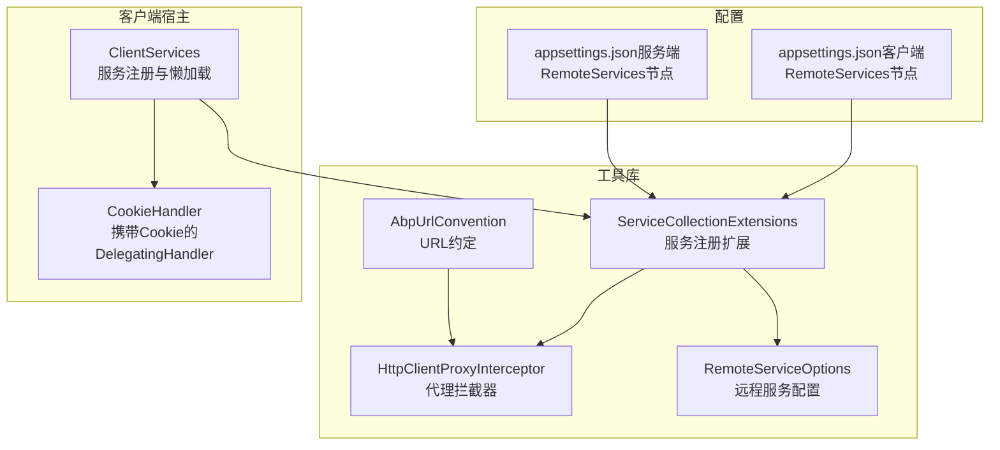
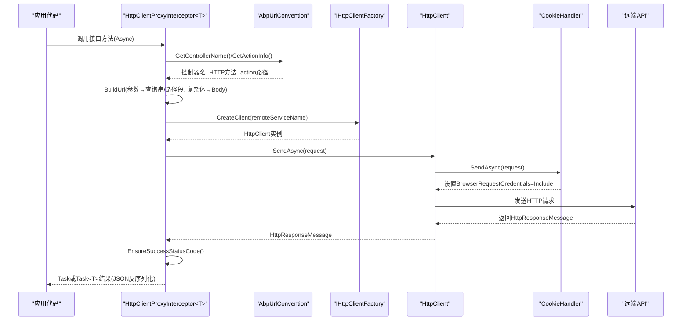
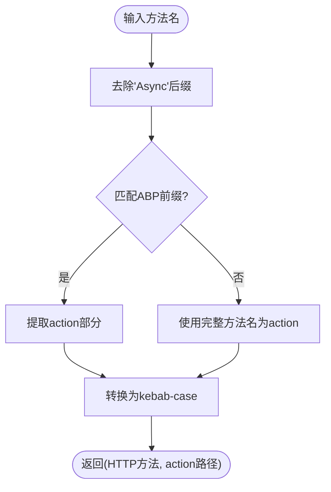
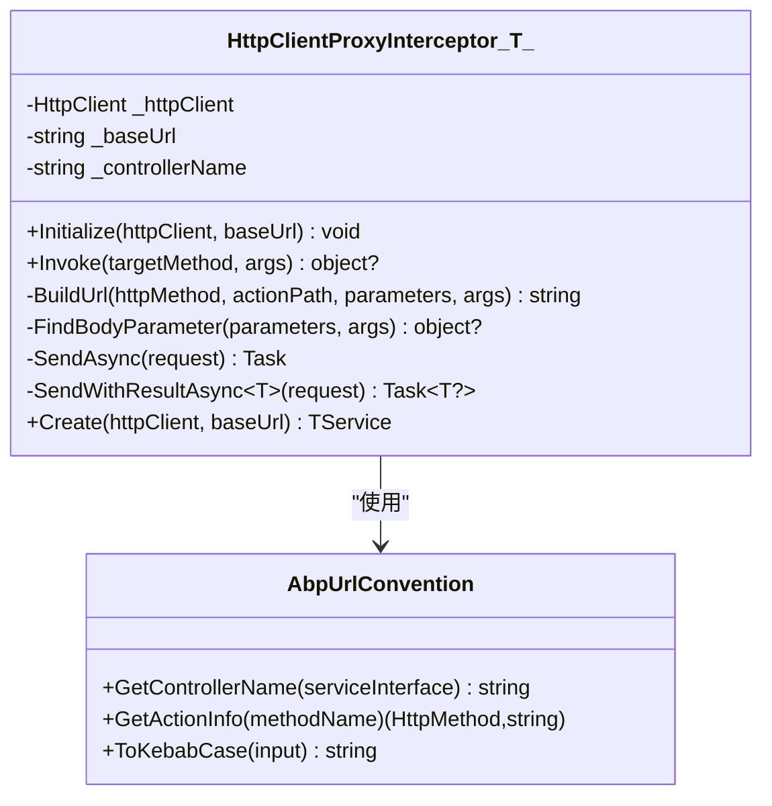
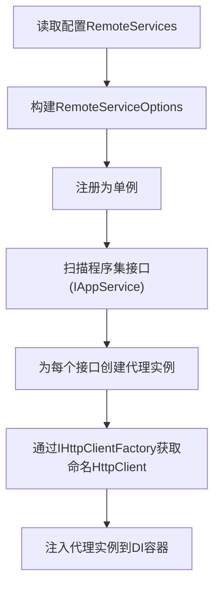
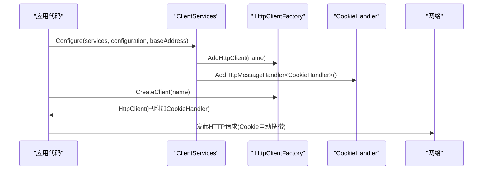
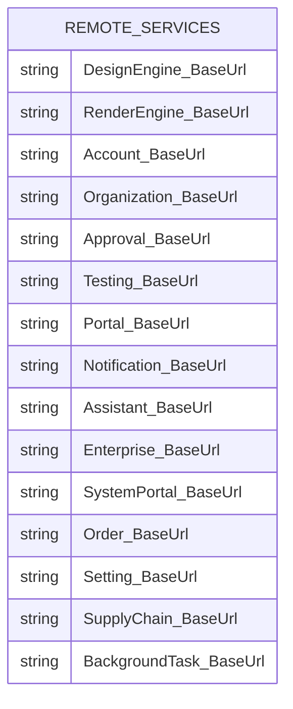
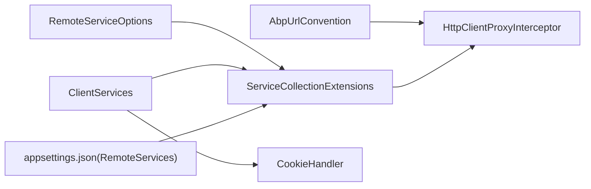

# HTTP客户端工具

<cite>
**本文引用的文件**   
- [HttpClientProxyInterceptor.cs](file://src/Utils/H.Abp.HttpClientProxy/HttpClientProxyInterceptor.cs)
- [RemoteServiceOptions.cs](file://src/Utils/H.Abp.HttpClientProxy/RemoteServiceOptions.cs)
- [ServiceCollectionExtensions.cs](file://src/Utils/H.Abp.HttpClientProxy/ServiceCollectionExtensions.cs)
- [AbpUrlConvention.cs](file://src/Utils/H.Abp.HttpClientProxy/AbpUrlConvention.cs)
- [CookieHandler.cs](file://src/Host/H.AppLab.Host.All/H.AppLab.Host.All.Client/CookieHandler.cs)
- [ClientServices.cs](file://src/Host/H.AppLab.Host.All/H.AppLab.Host.All.Client/ClientServices.cs)
- [appsettings.json（服务端）](file://src/Host/H.AppLab.Host.All/H.AppLab.Host.All/appsettings.json)
- [appsettings.json（客户端）](file://src/Host/H.AppLab.Host.All/H.AppLab.Host.All.Client/wwwroot/appsettings.json)
</cite>

## 目录
1. [简介](#简介)
2. [项目结构](#项目结构)
3. [核心组件](#核心组件)
4. [架构总览](#架构总览)
5. [详细组件分析](#详细组件分析)
6. [依赖关系分析](#依赖关系分析)
7. [性能考虑](#性能考虑)
8. [故障排查指南](#故障排查指南)
9. [结论](#结论)
10. [附录](#附录)

## 简介
本文件为HTTP客户端工具的完整技术文档，聚焦于ABP风格RESTful API的代理调用、请求与响应处理、认证与会话管理、配置与中间件扩展点，以及监控调试能力。该实现基于.NET的DispatchProxy生成类型安全的HTTP客户端代理，结合IHttpClientFactory进行生命周期管理，并通过DelegatingHandler在浏览器端注入Cookie以支持会话认证。

## 项目结构
- 工具库位于 Utils/H.Abp.HttpClientProxy，提供：
  - 代理拦截器：将接口方法调用转换为HTTP请求
  - URL约定：将接口与方法名映射到ABP风格的URL路径
  - 服务注册扩展：从配置加载远程服务Base地址并自动扫描接口注册代理
  - 配置模型：集中管理各远程服务的BaseUrl
- 客户端宿主位于 Host/H.AppLab.Host.All/H.AppLab.Host.All.Client，负责：
  - 注册命名HttpClient并附加CookieHandler
  - 按路由懒加载模块，延迟注册各业务模块的代理
  - 读取RemoteServices配置，统一注入BaseUrl

**图表来源** 
- [AbpUrlConvention.cs:1-87](file://src/Utils/H.Abp.HttpClientProxy/AbpUrlConvention.cs#L1-L87)
- [HttpClientProxyInterceptor.cs:1-219](file://src/Utils/H.Abp.HttpClientProxy/HttpClientProxyInterceptor.cs#L1-L219)
- [ServiceCollectionExtensions.cs:1-64](file://src/Utils/H.Abp.HttpClientProxy/ServiceCollectionExtensions.cs#L1-L64)
- [RemoteServiceOptions.cs:1-34](file://src/Utils/H.Abp.HttpClientProxy/RemoteServiceOptions.cs#L1-L34)
- [ClientServices.cs:1-171](file://src/Host/H.AppLab.Host.All/H.AppLab.Host.All.Client/ClientServices.cs#L1-L171)
- [CookieHandler.cs:1-17](file://src/Host/H.AppLab.Host.All/H.AppLab.Host.All.Client/CookieHandler.cs#L1-L17)
- [appsettings.json（服务端）:22-68](file://src/Host/H.AppLab.Host.All/H.AppLab.Host.All/appsettings.json#L22-L68)
- [appsettings.json（客户端）:1-50](file://src/Host/H.AppLab.Host.All/H.AppLab.Host.All.Client/wwwroot/appsettings.json#L1-L50)

**章节来源**
- [AbpUrlConvention.cs:1-87](file://src/Utils/H.Abp.HttpClientProxy/AbpUrlConvention.cs#L1-L87)
- [HttpClientProxyInterceptor.cs:1-219](file://src/Utils/H.Abp.HttpClientProxy/HttpClientProxyInterceptor.cs#L1-L219)
- [ServiceCollectionExtensions.cs:1-64](file://src/Utils/H.Abp.HttpClientProxy/ServiceCollectionExtensions.cs#L1-L64)
- [RemoteServiceOptions.cs:1-34](file://src/Utils/H.Abp.HttpClientProxy/RemoteServiceOptions.cs#L1-L34)
- [ClientServices.cs:1-171](file://src/Host/H.AppLab.Host.All/H.AppLab.Host.All.Client/ClientServices.cs#L1-L171)
- [CookieHandler.cs:1-17](file://src/Host/H.AppLab.Host.All/H.AppLab.Host.All.Client/CookieHandler.cs#L1-L17)
- [appsettings.json（服务端）:22-68](file://src/Host/H.AppLab.Host.All/H.AppLab.Host.All/appsettings.json#L22-L68)
- [appsettings.json（客户端）:1-50](file://src/Host/H.AppLab.Host.All/H.AppLab.Host.All.Client/wwwroot/appsettings.json#L1-L50)

## 核心组件
- AbpUrlConvention：将接口类型与方法名转换为ABP风格的控制器名与动作路径，支持GetList/GetAll/Get/Put/Update/Delete/Remove/Create/Add/Insert/Post/Patch等前缀，并将PascalCase转为kebab-case。
- HttpClientProxyInterceptor<T>：基于DispatchProxy的代理拦截器，负责：
  - 解析方法签名，构建HTTP方法与URL
  - 简单参数作为查询字符串，复杂类型在POST/PUT时放入JSON Body
  - 发送请求并反序列化返回结果，支持Task与Task<T>
- ServiceCollectionExtensions：提供AddRemoteServices与AddHttpClientProxies扩展：
  - 从配置RemoteServices节点加载BaseUrl
  - 扫描程序集中继承IAppService的接口，注册代理实例
- RemoteServiceOptions：集中管理各远程服务的BaseUrl，支持Configure与索引访问
- CookieHandler：Blazor WASM中让fetch请求携带Cookie，用于会话认证
- ClientServices：集中注册命名HttpClient并附加CookieHandler，按路由懒加载模块代理

**章节来源**
- [AbpUrlConvention.cs:1-87](file://src/Utils/H.Abp.HttpClientProxy/AbpUrlConvention.cs#L1-L87)
- [HttpClientProxyInterceptor.cs:1-219](file://src/Utils/H.Abp.HttpClientProxy/HttpClientProxyInterceptor.cs#L1-L219)
- [ServiceCollectionExtensions.cs:1-64](file://src/Utils/H.Abp.HttpClientProxy/ServiceCollectionExtensions.cs#L1-L64)
- [RemoteServiceOptions.cs:1-34](file://src/Utils/H.Abp.HttpClientProxy/RemoteServiceOptions.cs#L1-L34)
- [CookieHandler.cs:1-17](file://src/Host/H.AppLab.Host.All/H.AppLab.Host.All.Client/CookieHandler.cs#L1-L17)
- [ClientServices.cs:1-171](file://src/Host/H.AppLab.Host.All/H.AppLab.Host.All.Client/ClientServices.cs#L1-L171)

## 架构总览
下图展示了从应用层调用接口到HTTP请求发出与响应处理的完整流程，包括代理拦截、URL构建、Body序列化、Cookie注入与JSON反序列化。

**图表来源** 
- [HttpClientProxyInterceptor.cs:1-219](file://src/Utils/H.Abp.HttpClientProxy/HttpClientProxyInterceptor.cs#L1-L219)
- [AbpUrlConvention.cs:1-87](file://src/Utils/H.Abp.HttpClientProxy/AbpUrlConvention.cs#L1-L87)
- [ServiceCollectionExtensions.cs:1-64](file://src/Utils/H.Abp.HttpClientProxy/ServiceCollectionExtensions.cs#L1-L64)
- [CookieHandler.cs:1-17](file://src/Host/H.AppLab.Host.All/H.AppLab.Host.All.Client/CookieHandler.cs#L1-L17)
- [ClientServices.cs:1-171](file://src/Host/H.AppLab.Host.All/H.AppLab.Host.All.Client/ClientServices.cs#L1-L171)

## 详细组件分析

### 组件A：AbpUrlConvention（URL约定）
- 职责：将接口类型与方法名转换为ABP风格URL
- 关键点：
  - 控制器名：去除“I”前缀与“ApplicationService/AppService”后缀，转kebab-case
  - 动作路径：识别GetList/GetAll/Get/Put/Update/Delete/Remove/Create/Add/Insert/Post/Patch前缀，剩余部分转kebab-case
  - kebab转换：先camelCase再插入连字符，保持与服务端一致

**图表来源** 
- [AbpUrlConvention.cs:1-87](file://src/Utils/H.Abp.HttpClientProxy/AbpUrlConvention.cs#L1-L87)

**章节来源**
- [AbpUrlConvention.cs:1-87](file://src/Utils/H.Abp.HttpClientProxy/AbpUrlConvention.cs#L1-L87)

### 组件B：HttpClientProxyInterceptor<T>（代理拦截器）
- 职责：将接口方法调用转换为HTTP请求并处理响应
- 关键点：
  - 构建URL：id参数作为路径段；GET/DELETE的复杂参数展开为查询参数；其他简单参数进入查询串
  - 请求体：POST/PUT且存在非简单类型参数时，序列化为JSON Body
  - 返回类型：支持Task与Task<T>；NoContent返回默认值；其余JSON反序列化为T
  - JSON选项：驼峰命名策略，属性名大小写不敏感

**图表来源** 
- [HttpClientProxyInterceptor.cs:1-219](file://src/Utils/H.Abp.HttpClientProxy/HttpClientProxyInterceptor.cs#L1-L219)
- [AbpUrlConvention.cs:1-87](file://src/Utils/H.Abp.HttpClientProxy/AbpUrlConvention.cs#L1-L87)

**章节来源**
- [HttpClientProxyInterceptor.cs:1-219](file://src/Utils/H.Abp.HttpClientProxy/HttpClientProxyInterceptor.cs#L1-L219)

### 组件C：服务注册与配置（ServiceCollectionExtensions & RemoteServiceOptions）
- AddRemoteServices：从配置的RemoteServices节点加载BaseUrl并注册为单例
- AddHttpClientProxies：扫描指定程序集内继承IAppService的接口，为每个接口注册代理实例
- RemoteServiceOptions：提供索引与Configure方法，集中管理BaseUrl

**图表来源** 
- [ServiceCollectionExtensions.cs:1-64](file://src/Utils/H.Abp.HttpClientProxy/ServiceCollectionExtensions.cs#L1-L64)
- [RemoteServiceOptions.cs:1-34](file://src/Utils/H.Abp.HttpClientProxy/RemoteServiceOptions.cs#L1-L34)

**章节来源**
- [ServiceCollectionExtensions.cs:1-64](file://src/Utils/H.Abp.HttpClientProxy/ServiceCollectionExtensions.cs#L1-L64)
- [RemoteServiceOptions.cs:1-34](file://src/Utils/H.Abp.HttpClientProxy/RemoteServiceOptions.cs#L1-L34)

### 组件D：认证与会话管理（CookieHandler & ClientServices）
- CookieHandler：在Blazor WASM中将BrowserRequestCredentials设置为Include，使请求携带Cookie
- ClientServices：
  - 注册默认HttpClient与各命名HttpClient
  - 为每个命名HttpClient添加CookieHandler
  - 按路由懒加载模块，延迟注册代理，避免启动时下载全部程序集

**图表来源** 
- [CookieHandler.cs:1-17](file://src/Host/H.AppLab.Host.All/H.AppLab.Host.All.Client/CookieHandler.cs#L1-L17)
- [ClientServices.cs:1-171](file://src/Host/H.AppLab.Host.All/H.AppLab.Host.All.Client/ClientServices.cs#L1-L171)

**章节来源**
- [CookieHandler.cs:1-17](file://src/Host/H.AppLab.Host.All/H.AppLab.Host.All.Client/CookieHandler.cs#L1-L17)
- [ClientServices.cs:1-171](file://src/Host/H.AppLab.Host.All/H.AppLab.Host.All.Client/ClientServices.cs#L1-L171)

### 组件E：配置结构与示例
- appsettings.json（服务端与客户端）均包含RemoteServices节点，定义各服务BaseUrl
- 客户端通过wwwroot/appsettings.json加载RemoteServices，供AddRemoteServices读取

**图表来源** 
- [appsettings.json（服务端）:22-68](file://src/Host/H.AppLab.Host.All/H.AppLab.Host.All/appsettings.json#L22-L68)
- [appsettings.json（客户端）:1-50](file://src/Host/H.AppLab.Host.All/H.AppLab.Host.All.Client/wwwroot/appsettings.json#L1-L50)

**章节来源**
- [appsettings.json（服务端）:22-68](file://src/Host/H.AppLab.Host.All/H.AppLab.Host.All/appsettings.json#L22-L68)
- [appsettings.json（客户端）:1-50](file://src/Host/H.AppLab.Host.All/H.AppLab.Host.All.Client/wwwroot/appsettings.json#L1-L50)

## 依赖关系分析
- 代理拦截器依赖AbpUrlConvention进行URL解析
- 服务注册扩展依赖RemoteServiceOptions与IHttpClientFactory
- 客户端宿主依赖CookieHandler与LazyModuleRegistrations进行认证与懒加载
- 配置来源于appsettings.json的RemoteServices节点

**图表来源** 
- [AbpUrlConvention.cs:1-87](file://src/Utils/H.Abp.HttpClientProxy/AbpUrlConvention.cs#L1-L87)
- [HttpClientProxyInterceptor.cs:1-219](file://src/Utils/H.Abp.HttpClientProxy/HttpClientProxyInterceptor.cs#L1-L219)
- [ServiceCollectionExtensions.cs:1-64](file://src/Utils/H.Abp.HttpClientProxy/ServiceCollectionExtensions.cs#L1-L64)
- [RemoteServiceOptions.cs:1-34](file://src/Utils/H.Abp.HttpClientProxy/RemoteServiceOptions.cs#L1-L34)
- [ClientServices.cs:1-171](file://src/Host/H.AppLab.Host.All/H.AppLab.Host.All.Client/ClientServices.cs#L1-L171)
- [CookieHandler.cs:1-17](file://src/Host/H.AppLab.Host.All/H.AppLab.Host.All.Client/CookieHandler.cs#L1-L17)
- [appsettings.json（客户端）:1-50](file://src/Host/H.AppLab.Host.All/H.AppLab.Host.All.Client/wwwroot/appsettings.json#L1-L50)

**章节来源**
- [AbpUrlConvention.cs:1-87](file://src/Utils/H.Abp.HttpClientProxy/AbpUrlConvention.cs#L1-L87)
- [HttpClientProxyInterceptor.cs:1-219](file://src/Utils/H.Abp.HttpClientProxy/HttpClientProxyInterceptor.cs#L1-L219)
- [ServiceCollectionExtensions.cs:1-64](file://src/Utils/H.Abp.HttpClientProxy/ServiceCollectionExtensions.cs#L1-L64)
- [RemoteServiceOptions.cs:1-34](file://src/Utils/H.Abp.HttpClientProxy/RemoteServiceOptions.cs#L1-L34)
- [ClientServices.cs:1-171](file://src/Host/H.AppLab.Host.All/H.AppLab.Host.All.Client/ClientServices.cs#L1-L171)
- [CookieHandler.cs:1-17](file://src/Host/H.AppLab.Host.All/H.AppLab.Host.All.Client/CookieHandler.cs#L1-L17)
- [appsettings.json（客户端）:1-50](file://src/Host/H.AppLab.Host.All/H.AppLab.Host.All.Client/wwwroot/appsettings.json#L1-L50)

## 性能考虑
- IHttpClientFactory：复用底层连接池，减少Socket耗尽风险
- 懒加载模块：按需下载与注册代理，降低启动时间与内存占用
- JSON序列化：使用System.Text.Json并启用驼峰命名与大小写不敏感，提升兼容性
- 无内置重试与超时：当前实现未包含重试与超时控制，可在IHttpClientFactory层面扩展或使用自定义DelegatingHandler

[本节为通用指导，无需特定文件引用]

## 故障排查指南
- 常见问题
  - 404错误：检查接口方法名前缀是否符合ABP约定（如GetList/Get/Put等），确认控制器名与方法名转换正确
  - 参数未生效：确认简单参数是否被正确编码为查询串；复杂参数仅在POST/PUT时放入Body
  - 认证失败：确保CookieHandler已添加到命名HttpClient，并在WASM环境中允许携带凭据
  - 跨域问题：检查服务端CORS配置与Base地址是否正确
- 调试建议
  - 使用浏览器开发者工具查看网络请求与响应
  - 在服务端启用日志记录，定位异常堆栈
  - 在客户端增加日志输出，观察代理构建的URL与请求体

**章节来源**
- [HttpClientProxyInterceptor.cs:1-219](file://src/Utils/H.Abp.HttpClientProxy/HttpClientProxyInterceptor.cs#L1-L219)
- [CookieHandler.cs:1-17](file://src/Host/H.AppLab.Host.All/H.AppLab.Host.All.Client/CookieHandler.cs#L1-L17)
- [ClientServices.cs:1-171](file://src/Host/H.AppLab.Host.All/H.AppLab.Host.All.Client/ClientServices.cs#L1-L171)

## 结论
该HTTP客户端工具通过代理拦截与URL约定实现了类型安全的ABP风格RESTful API调用，结合IHttpClientFactory与CookieHandler提供了可靠的请求管理与会话认证。当前版本专注于基础功能，未内置重试与超时控制，可通过扩展中间件与工厂模式增强。建议在关键场景引入重试、超时与监控机制，以提升稳定性与可观测性。

[本节为总结，无需特定文件引用]

## 附录
- RESTful API调用说明
  - 接口方法命名需遵循ABP前缀约定（GetList/GetAll/Get/Put/Update/Delete/Remove/Create/Add/Insert/Post/Patch）
  - id参数作为路径段；GET/DELETE的复杂参数展开为查询参数；其他简单参数进入查询串
  - POST/PUT的复杂类型参数序列化为JSON Body
- GraphQL支持
  - 当前实现未包含GraphQL支持；如需支持，可在代理拦截器中扩展特殊方法前缀与请求体格式
- 认证授权与会话管理
  - 使用CookieHandler在WASM中携带Cookie，配合服务端会话机制完成认证
- 请求重试、超时与错误恢复
  - 当前未内置；建议在IHttpClientFactory层添加Resilience管道（如Polly）或自定义DelegatingHandler
- 配置与中间件
  - RemoteServices节点配置BaseUrl；可通过ServiceCollectionExtensions扩展更多中间件
- 监控与调试
  - 使用浏览器开发者工具与服务端日志；可扩展Telemetry或Serilog进行追踪

[本节为概念性内容，无需特定文件引用]