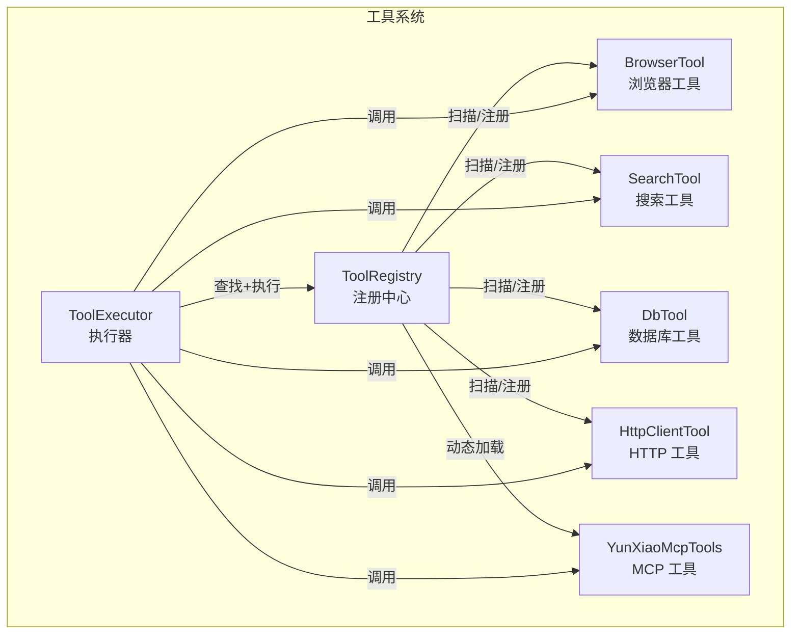
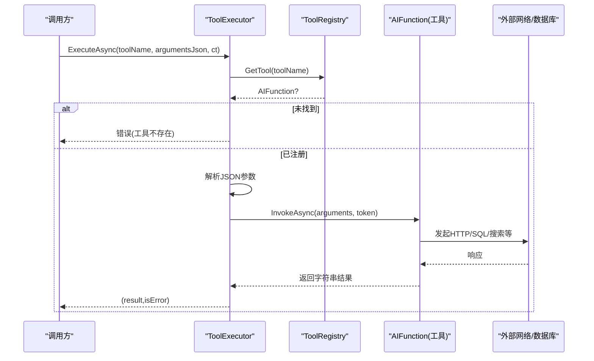
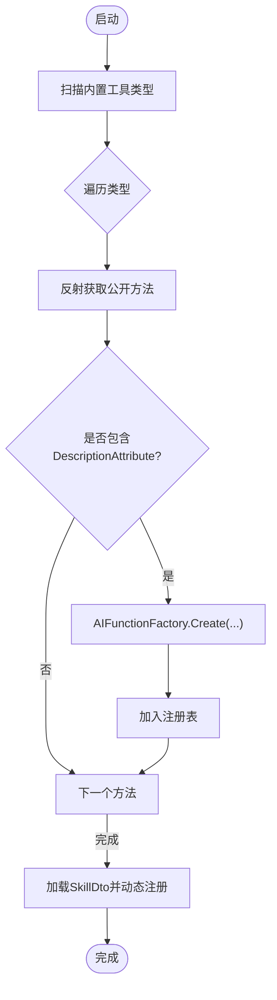
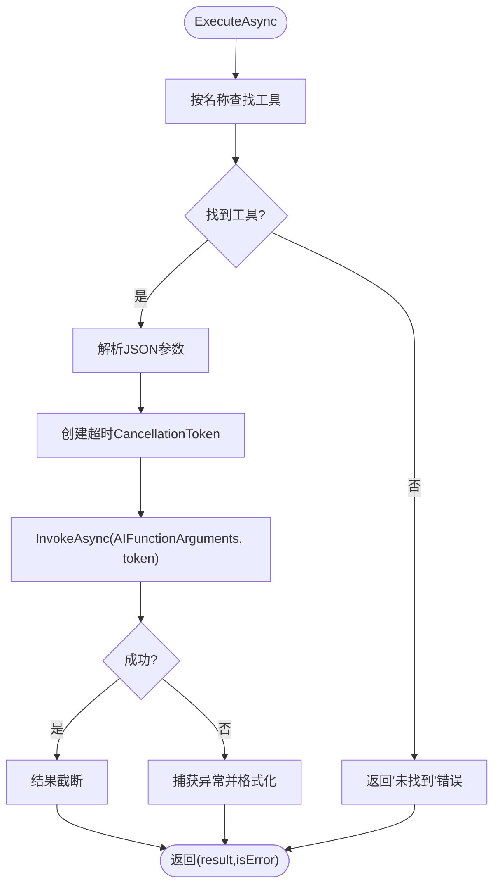
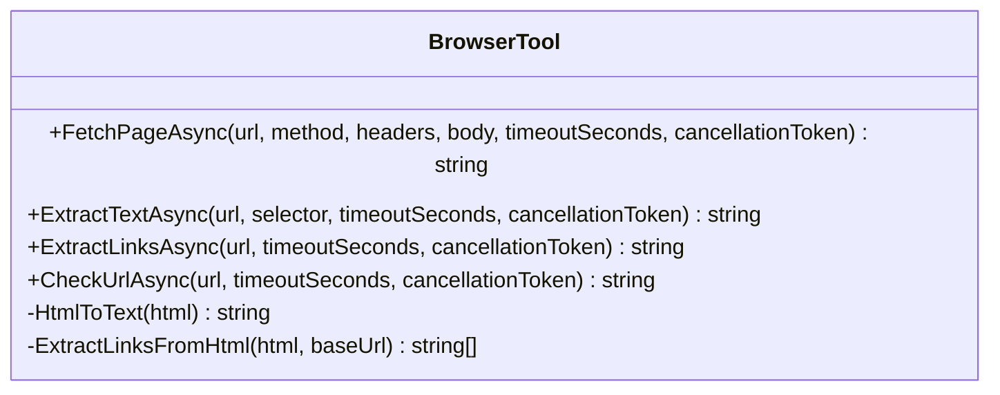
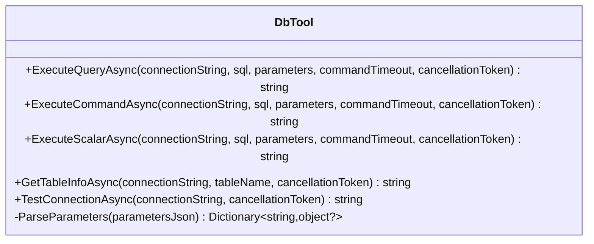
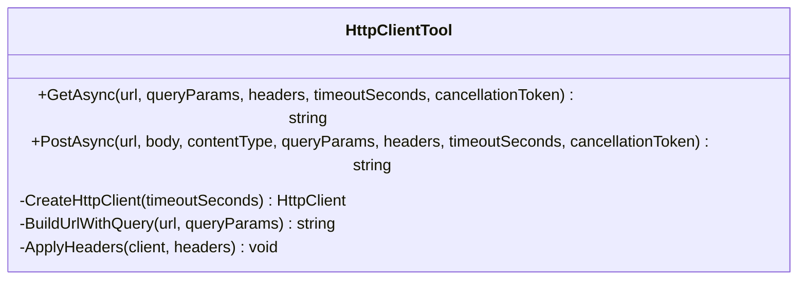
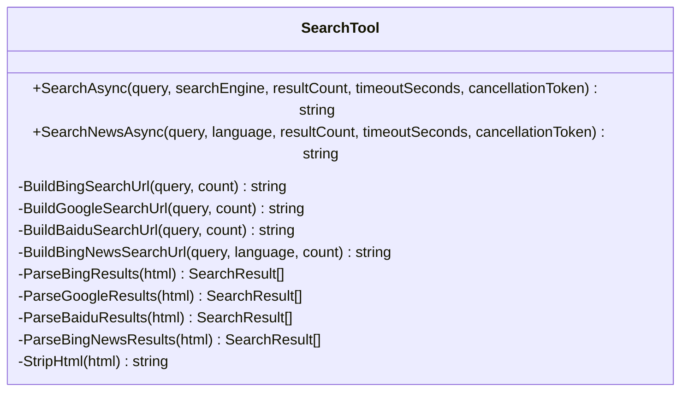
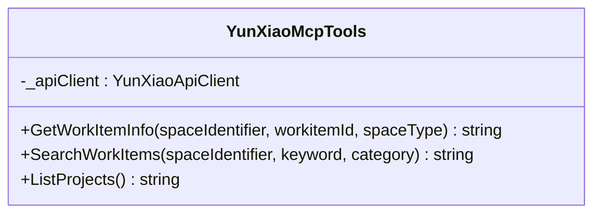
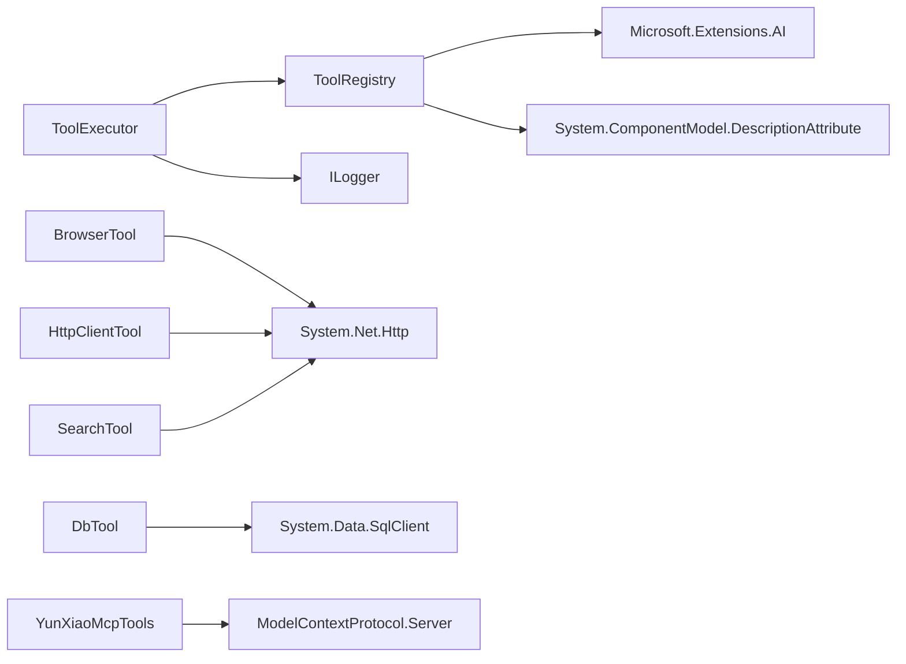

# 工具函数系统

<cite>
**本文引用的文件**   
- [IToolRegistry.cs](file://src/Agent/Assistant/H.Assistant.Core/Tools/IToolRegistry.cs)
- [ToolRegistry.cs](file://src/Agent/Assistant/H.Assistant.Core/Tools/ToolRegistry.cs)
- [ToolExecutor.cs](file://src/Agent/Assistant/H.Assistant.Core/Agents/ToolExecutor.cs)
- [BrowserTool.cs](file://src/Agent/Assistant/H.Assistant.Core/Tools/BrowserTool.cs)
- [DbTool.cs](file://src/Agent/Assistant/H.Assistant.Core/Tools/DbTool.cs)
- [HttpClientTool.cs](file://src/Agent/Assistant/H.Assistant.Core/Tools/HttpClientTool.cs)
- [SearchTool.cs](file://src/Agent/Assistant/H.Assistant.Core/Tools/SearchTool.cs)
- [YunXiaoMcpTools.cs](file://src/Agent/McpServers/H.Mcp.YunXiao/YunXiaoMcpTools.cs)
</cite>

## 目录
1. [简介](#简介)
2. [项目结构](#项目结构)
3. [核心组件](#核心组件)
4. [架构总览](#架构总览)
5. [详细组件分析](#详细组件分析)
6. [依赖关系分析](#依赖关系分析)
7. [性能与并发控制](#性能与并发控制)
8. [自定义工具开发指南](#自定义工具开发指南)
9. [测试与调试](#测试与调试)
10. [使用场景与最佳实践](#使用场景与最佳实践)
11. [故障排查](#故障排查)
12. [结论](#结论)

## 简介
本文件面向“工具函数系统”，系统性说明工具的注册机制与发现方式、内置工具能力（浏览器操作、数据库查询、HTTP 请求、搜索等）、参数定义与验证、执行器调度策略与并发控制，以及自定义工具的开发规范、权限与错误处理、测试与调试方法，并给出典型使用场景与最佳实践建议。

## 项目结构
工具函数系统位于 Agent 子系统中，核心由“注册中心 + 执行器 + 具体工具类”组成：
- 注册中心：负责扫描、注册、暴露工具元数据与可调用实例
- 执行器：统一解析参数、设置超时与取消令牌、调用工具并返回结果
- 内置工具：浏览器访问与内容提取、SQL 查询与表信息、通用 HTTP 客户端、搜索引擎抓取
- MCP 工具：通过 Model Context Protocol 扩展外部工具能力

**图表来源** 
- [IToolRegistry.cs:1-36](file://src/Agent/Assistant/H.Assistant.Core/Tools/IToolRegistry.cs#L1-L36)
- [ToolRegistry.cs:1-204](file://src/Agent/Assistant/H.Assistant.Core/Tools/ToolRegistry.cs#L1-L204)
- [ToolExecutor.cs:1-102](file://src/Agent/Assistant/H.Assistant.Core/Agents/ToolExecutor.cs#L1-L102)
- [BrowserTool.cs:1-278](file://src/Agent/Assistant/H.Assistant.Core/Tools/BrowserTool.cs#L1-L278)
- [DbTool.cs:1-305](file://src/Agent/Assistant/H.Assistant.Core/Tools/DbTool.cs#L1-L305)
- [HttpClientTool.cs:1-121](file://src/Agent/Assistant/H.Assistant.Core/Tools/HttpClientTool.cs#L1-L121)
- [SearchTool.cs:1-362](file://src/Agent/Assistant/H.Assistant.Core/Tools/SearchTool.cs#L1-L362)
- [YunXiaoMcpTools.cs:1-40](file://src/Agent/McpServers/H.Mcp.YunXiao/YunXiaoMcpTools.cs#L1-L40)

**章节来源**
- [IToolRegistry.cs:1-36](file://src/Agent/Assistant/H.Assistant.Core/Tools/IToolRegistry.cs#L1-L36)
- [ToolRegistry.cs:1-204](file://src/Agent/Assistant/H.Assistant.Core/Tools/ToolRegistry.cs#L1-L204)
- [ToolExecutor.cs:1-102](file://src/Agent/Assistant/H.Assistant.Core/Agents/ToolExecutor.cs#L1-L102)

## 核心组件
- IToolRegistry：工具注册中心接口，提供获取全部工具、按名称检索、生成 OpenAI 格式工具定义、注册 MCP 工具、从技能定义批量注册的能力。
- ToolRegistry：实现反射式自动注册，支持内置工具类型集合与基于 DescriptionAttribute 的方法发现；支持从 SkillDto 动态加载类型并注册其公开方法；支持直接注册 AIFunction。
- ToolExecutor：统一入口，解析 JSON 参数、注入 CancellationToken、设置单次执行超时、调用 AIFunction 并截断过长结果，统一异常与日志。

关键职责边界：
- 注册阶段：仅做发现与包装，不执行业务逻辑
- 执行阶段：仅做参数解析、超时控制、调用与结果标准化

**章节来源**
- [IToolRegistry.cs:1-36](file://src/Agent/Assistant/H.Assistant.Core/Tools/IToolRegistry.cs#L1-L36)
- [ToolRegistry.cs:1-204](file://src/Agent/Assistant/H.Assistant.Core/Tools/ToolRegistry.cs#L1-L204)
- [ToolExecutor.cs:1-102](file://src/Agent/Assistant/H.Assistant.Core/Agents/ToolExecutor.cs#L1-L102)

## 架构总览
工具系统的运行时交互如下：

**图表来源** 
- [ToolExecutor.cs:1-102](file://src/Agent/Assistant/H.Assistant.Core/Agents/ToolExecutor.cs#L1-L102)
- [ToolRegistry.cs:1-204](file://src/Agent/Assistant/H.Assistant.Core/Tools/ToolRegistry.cs#L1-L204)

## 详细组件分析

### 注册中心与发现机制
- 反射扫描：对指定类型集合进行静态/实例方法扫描，筛选带 DescriptionAttribute 的公开方法，使用 AIFunctionFactory 包装为 AIFunction，并以方法名为键存入字典。
- 技能动态加载：根据 SkillDto 中的 ImplementationClass 动态 Type.GetType，再次扫描并注册所有带 DescriptionAttribute 的公开方法。
- MCP 工具注册：直接接收 AIFunction 实例进行注册，便于外部协议扩展。
- 工具定义导出：将 AIFunction 的 JsonSchema 反序列化为对象，作为 OpenAI function 的参数定义。

**图表来源** 
- [ToolRegistry.cs:1-204](file://src/Agent/Assistant/H.Assistant.Core/Tools/ToolRegistry.cs#L1-L204)

**章节来源**
- [ToolRegistry.cs:1-204](file://src/Agent/Assistant/H.Assistant.Core/Tools/ToolRegistry.cs#L1-L204)

### 执行器与调度策略
- 参数解析：将 JSON 字符串反序列化为字典，忽略大小写，空串视为无参。
- 超时与取消：创建与传入 Token 关联的 CancellationTokenSource，设置固定秒数超时；捕获 OperationCanceledException 区分外部取消与内部超时。
- 结果截断：超过最大长度则截断并追加提示，避免超长文本影响 LLM 上下文。
- 错误处理：统一捕获异常并返回结构化错误消息，记录警告日志。

**图表来源** 
- [ToolExecutor.cs:1-102](file://src/Agent/Assistant/H.Assistant.Core/Agents/ToolExecutor.cs#L1-L102)

**章节来源**
- [ToolExecutor.cs:1-102](file://src/Agent/Assistant/H.Assistant.Core/Agents/ToolExecutor.cs#L1-L102)

### 内置工具详解

#### 浏览器工具 BrowserTool
- 功能：网页访问（GET/POST）、文本提取、链接提取、URL 可达性检查。
- 特点：预置 User-Agent/Accept/Language；支持自定义请求头与 POST Body；限制返回数量与长度；简单 HTML 转文本与链接提取。
- 适用场景：快速抓取页面内容、校验目标站点可用性、抽取超链接列表。

**图表来源** 
- [BrowserTool.cs:1-278](file://src/Agent/Assistant/H.Assistant.Core/Tools/BrowserTool.cs#L1-L278)

**章节来源**
- [BrowserTool.cs:1-278](file://src/Agent/Assistant/H.Assistant.Core/Tools/BrowserTool.cs#L1-L278)

#### 数据库工具 DbTool
- 功能：SQL 查询、命令执行（INSERT/UPDATE/DELETE）、标量查询、表结构信息获取、连接测试。
- 特点：支持参数化 SQL（JSON 字典）；CommandTimeout 可控；结果以 JSON 序列化返回；失败时返回错误信息。
- 适用场景：临时数据探查、报表取数、DDL/DML 快速执行、连通性自检。

**图表来源** 
- [DbTool.cs:1-305](file://src/Agent/Assistant/H.Assistant.Core/Tools/DbTool.cs#L1-L305)

**章节来源**
- [DbTool.cs:1-305](file://src/Agent/Assistant/H.Assistant.Core/Tools/DbTool.cs#L1-L305)

#### HTTP 工具 HttpClientTool
- 功能：发送 GET/POST 请求，支持查询参数、自定义 Header、Content-Type 与超时控制。
- 特点：自动解压、允许重定向；对单个 Header 添加失败进行容错；返回原始文本。
- 适用场景：调用第三方 REST API、表单提交、轻量级服务集成。

**图表来源** 
- [HttpClientTool.cs:1-121](file://src/Agent/Assistant/H.Assistant.Core/Tools/HttpClientTool.cs#L1-L121)

**章节来源**
- [HttpClientTool.cs:1-121](file://src/Agent/Assistant/H.Assistant.Core/Tools/HttpClientTool.cs#L1-L121)

#### 搜索工具 SearchTool
- 功能：通用搜索（Google/Bing/Baidu）、新闻搜索（Bing News）。
- 特点：按引擎构建 URL；正则解析 HTML 结果；限制返回条数；中文友好输出。
- 适用场景：快速获取公开搜索结果摘要、新闻聚合。

**图表来源** 
- [SearchTool.cs:1-362](file://src/Agent/Assistant/H.Assistant.Core/Tools/SearchTool.cs#L1-L362)

**章节来源**
- [SearchTool.cs:1-362](file://src/Agent/Assistant/H.Assistant.Core/Tools/SearchTool.cs#L1-L362)

#### MCP 工具 YunXiaoMcpTools
- 功能：云效工作项详情获取、工作项搜索、企业项目列表。
- 特点：通过 McpServerTool 特性暴露，依赖外部 ApiClient；适合与企业项目管理平台集成。

**图表来源** 
- [YunXiaoMcpTools.cs:1-40](file://src/Agent/McpServers/H.Mcp.YunXiao/YunXiaoMcpTools.cs#L1-L40)

**章节来源**
- [YunXiaoMcpTools.cs:1-40](file://src/Agent/McpServers/H.Mcp.YunXiao/YunXiaoMcpTools.cs#L1-L40)

## 依赖关系分析
- ToolRegistry 依赖 Microsoft.Extensions.AI 的 AIFunction/AIFunctionFactory 进行方法到函数的转换，并使用 System.ComponentModel.DescriptionAttribute 作为工具描述元数据。
- ToolExecutor 依赖 IToolRegistry 与 ILogger，负责统一的执行流程。
- 各工具类依赖 .NET 基础库（System.Net.Http、System.Data.SqlClient、System.Text.Json、System.Text.RegularExpressions）。

**图表来源** 
- [ToolRegistry.cs:1-204](file://src/Agent/Assistant/H.Assistant.Core/Tools/ToolRegistry.cs#L1-L204)
- [ToolExecutor.cs:1-102](file://src/Agent/Assistant/H.Assistant.Core/Agents/ToolExecutor.cs#L1-L102)
- [BrowserTool.cs:1-278](file://src/Agent/Assistant/H.Assistant.Core/Tools/BrowserTool.cs#L1-L278)
- [DbTool.cs:1-305](file://src/Agent/Assistant/H.Assistant.Core/Tools/DbTool.cs#L1-L305)
- [HttpClientTool.cs:1-121](file://src/Agent/Assistant/H.Assistant.Core/Tools/HttpClientTool.cs#L1-L121)
- [SearchTool.cs:1-362](file://src/Agent/Assistant/H.Assistant.Core/Tools/SearchTool.cs#L1-L362)
- [YunXiaoMcpTools.cs:1-40](file://src/Agent/McpServers/H.Mcp.YunXiao/YunXiaoMcpTools.cs#L1-L40)

**章节来源**
- [ToolRegistry.cs:1-204](file://src/Agent/Assistant/H.Assistant.Core/Tools/ToolRegistry.cs#L1-L204)
- [ToolExecutor.cs:1-102](file://src/Agent/Assistant/H.Assistant.Core/Agents/ToolExecutor.cs#L1-L102)

## 性能与并发控制
- 单次执行超时：默认 60 秒，可通过 CancellationToken 配合外部取消令牌实现灵活控制。
- 结果截断：最大 4000 字符，防止大结果阻塞下游处理。
- 网络层：各工具均设置合理超时与自动解压，减少长尾延迟。
- 并发建议：
  - 多个工具并行调用应在上层编排（如任务队列或并行任务），避免在工具内部自行创建线程池。
  - 数据库连接应短生命周期、及时释放；避免长时间持有连接。
  - 搜索/HTTP 请求建议增加重试与退避策略（可在上层封装）。

[本节为通用指导，不直接分析具体文件]

## 自定义工具开发指南
- 接口实现
  - 新建一个类，在其中定义 public static 或 public 实例方法。
  - 为每个方法添加 DescriptionAttribute，用于工具名与描述。
  - 参数建议使用基本类型与 IDictionary<string,string> 等常见类型，以便 AIFunction 自动生成参数 Schema。
- 注册方式
  - 内置方式：在 ToolRegistry.RegisterBuiltinTools 中添加类型即可。
  - 技能方式：通过 SkillDto 的 ImplementationClass 动态加载并注册。
  - MCP 方式：使用 McpServerTool 特性暴露，并通过 ToolRegistry.RegisterMcpTool 注册。
- 权限控制
  - 建议在调用入口（如应用服务或中间件）对用户角色/资源权限进行校验，再放行至工具执行器。
  - 敏感操作（如数据库写入）需结合白名单与审计日志。
- 错误处理
  - 工具内部尽量返回结构化错误信息（如 JSON 或明确文本），便于上层统一处理。
  - 对于不可恢复的错误，抛出异常并由 ToolExecutor 统一捕获与记录。

**章节来源**
- [ToolRegistry.cs:1-204](file://src/Agent/Assistant/H.Assistant.Core/Tools/ToolRegistry.cs#L1-L204)
- [YunXiaoMcpTools.cs:1-40](file://src/Agent/McpServers/H.Mcp.YunXiao/YunXiaoMcpTools.cs#L1-L40)

## 测试与调试
- 单元测试
  - 针对工具方法构造输入参数，断言返回 JSON 的结构与关键字段。
  - 对网络/数据库调用可使用 Mock 或 Test Server 替代真实依赖。
- 集成测试
  - 使用 ToolExecutor.ExecuteAsync 端到端验证工具注册与执行链路。
  - 覆盖正常路径、参数缺失、非法 JSON、超时、网络异常等分支。
- 调试技巧
  - 启用 ToolExecutor 与 ToolRegistry 的日志，观察工具发现与执行过程。
  - 对网络请求开启抓包（Fiddler/Charles）定位外部接口问题。
  - 对数据库操作先执行 SELECT/TEST 再执行 DML，确保数据安全。

**章节来源**
- [ToolExecutor.cs:1-102](file://src/Agent/Assistant/H.Assistant.Core/Agents/ToolExecutor.cs#L1-L102)
- [ToolRegistry.cs:1-204](file://src/Agent/Assistant/H.Assistant.Core/Tools/ToolRegistry.cs#L1-L204)

## 使用场景与最佳实践
- 典型场景
  - 智能助手调用浏览器工具抓取页面内容，再交给 LLM 总结。
  - 数据分析场景通过数据库工具快速拉取统计结果。
  - 业务系统集成通过 HTTP 工具调用第三方 API。
  - 市场情报收集通过搜索工具获取新闻与资讯。
- 最佳实践
  - 参数校验前置：在工具方法中对必填参数进行校验，尽早失败。
  - 超时与取消：始终传播 CancellationToken，避免僵尸请求。
  - 结果规范化：统一返回 JSON 或明确文本，便于上层解析。
  - 安全加固：对数据库连接字符串、API Key 等敏感信息进行加密存储与最小权限访问。
  - 可观测性：关键路径打点与日志，便于追踪与排障。

[本节为通用指导，不直接分析具体文件]

## 故障排查
- 工具未找到
  - 检查是否正确注册（内置类型是否在列表中、技能 ImplementationClass 是否可加载、MCP 工具是否被 RegisterMcpTool）。
- 参数解析失败
  - 确认传入 JSON 合法且字段名匹配（大小写不敏感），必要时打印原始参数。
- 执行超时
  - 调整 ExecutionTimeoutSeconds 或工具自身超时参数；检查外部依赖延迟。
- 网络/数据库异常
  - 检查目标地址、端口、证书、连接字符串；查看服务端限流与鉴权状态。
- 结果过大
  - 利用结果截断机制，或在工具内分页/过滤后再返回。

**章节来源**
- [ToolExecutor.cs:1-102](file://src/Agent/Assistant/H.Assistant.Core/Agents/ToolExecutor.cs#L1-L102)
- [ToolRegistry.cs:1-204](file://src/Agent/Assistant/H.Assistant.Core/Tools/ToolRegistry.cs#L1-L204)

## 结论
工具函数系统通过“反射发现 + AIFunction 封装 + 统一执行器”的模式，实现了高内聚、低耦合的工具生态。内置工具覆盖 Web、DB、HTTP、搜索等常见能力，MCP 扩展进一步打通外部系统。借助清晰的注册与执行流程、完善的超时与错误处理，开发者可以快速扩展自有工具并安全地融入整体系统。