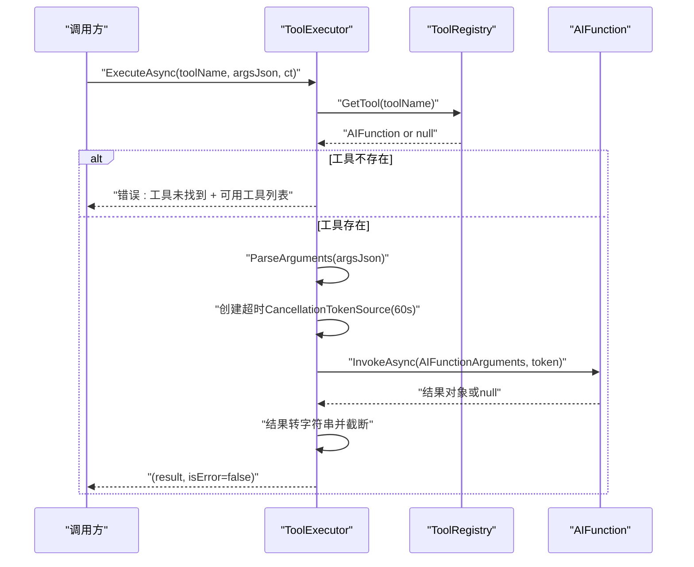
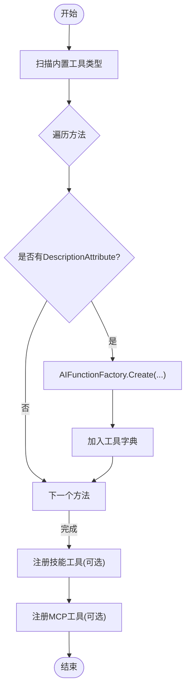
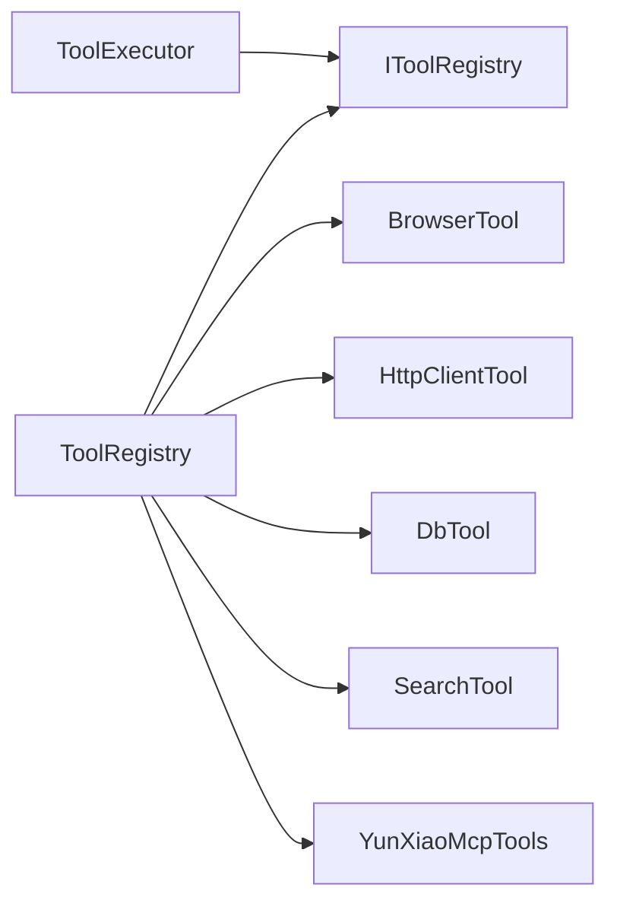

# 工具执行器

<cite>
**本文引用的文件**   
- [ToolExecutor.cs](file://src/Agent/Assistant/H.Assistant.Core/Agents/ToolExecutor.cs)
- [IToolRegistry.cs](file://src/Agent/Assistant/H.Assistant.Core/Tools/IToolRegistry.cs)
- [ToolRegistry.cs](file://src/Agent/Assistant/H.Assistant.Core/Tools/ToolRegistry.cs)
- [BrowserTool.cs](file://src/Agent/Assistant/H.Assistant.Core/Tools/BrowserTool.cs)
- [HttpClientTool.cs](file://src/Agent/Assistant/H.Assistant.Core/Tools/HttpClientTool.cs)
- [DbTool.cs](file://src/Agent/Assistant/H.Assistant.Core/Tools/DbTool.cs)
- [SearchTool.cs](file://src/Agent/Assistant/H.Assistant.Core/Tools/SearchTool.cs)
- [YunXiaoMcpTools.cs](file://src/Agent/McpServers/H.Mcp.YunXiao/YunXiaoMcpTools.cs)
- [BackgroundJobExecutor.cs](file://src/Services/BackgroundTask/H.BackgroundTask.Application/Services/BackgroundJobExecutor.cs)
</cite>

## 目录
1. [简介](#简介)
2. [项目结构](#项目结构)
3. [核心组件](#核心组件)
4. [架构总览](#架构总览)
5. [详细组件分析](#详细组件分析)
6. [依赖关系分析](#依赖关系分析)
7. [性能与并发](#性能与并发)
8. [故障排查指南](#故障排查指南)
9. [结论](#结论)
10. [附录：配置与监控](#附录：配置与监控)

## 简介
本文件面向“工具执行器”子系统，系统性说明其核心功能与调度机制，覆盖工具注册、发现、参数解析、执行生命周期、并发控制、错误处理、资源清理、配置选项、性能调优以及监控日志等关键主题。该子系统基于 Microsoft.Extensions.AI 的 AIFunction 模型，通过反射扫描与 MCP 协议集成实现工具的动态注册与调用，并以统一的执行器进行超时、截断与异常处理。

## 项目结构
工具执行器位于 Agent 子系统中，核心由“执行器 + 注册中心 + 内置工具集 + MCP 工具”构成；同时，后台任务执行器提供跨进程/异步任务的统一执行能力，便于在 Hangfire 环境中安全执行 API/SQL 任务。

```mermaid
graph TB
subgraph "Agent/Assistant/Core"
TE["ToolExecutor<br/>工具执行器"]
TR["ToolRegistry<br/>工具注册中心"]
IT["IToolRegistry<br/>接口"]
BT["BrowserTool<br/>浏览器工具"]
HT["HttpClientTool<br/>HTTP 工具"]
DBT["DbTool<br/>数据库工具"]
ST["SearchTool<br/>搜索工具"]
end
subgraph "Agent/McpServers"
MCP["YunXiaoMcpTools<br/>MCP 工具"]
end
subgraph "Services/BackgroundTask"
BJ["BackgroundJobExecutor<br/>后台任务执行器"]
end
TE --> TR
TR --> IT
TR --> BT
TR --> HT
TR --> DBT
TR --> ST
TR --> MCP
BJ -. 独立于 AI 工具执行 .->|"Hangfire 作业"| 外部系统
```

图表来源 
- [ToolExecutor.cs:1-102](file://src/Agent/Assistant/H.Assistant.Core/Agents/ToolExecutor.cs#L1-L102)
- [IToolRegistry.cs:1-36](file://src/Agent/Assistant/H.Assistant.Core/Tools/IToolRegistry.cs#L1-L36)
- [ToolRegistry.cs:1-204](file://src/Agent/Assistant/H.Assistant.Core/Tools/ToolRegistry.cs#L1-L204)
- [BrowserTool.cs:1-278](file://src/Agent/Assistant/H.Assistant.Core/Tools/BrowserTool.cs#L1-L278)
- [HttpClientTool.cs:1-121](file://src/Agent/Assistant/H.Assistant.Core/Tools/HttpClientTool.cs#L1-L121)
- [DbTool.cs:1-305](file://src/Agent/Assistant/H.Assistant.Core/Tools/DbTool.cs#L1-L305)
- [SearchTool.cs:1-362](file://src/Agent/Assistant/H.Assistant.Core/Tools/SearchTool.cs#L1-L362)
- [YunXiaoMcpTools.cs:1-40](file://src/Agent/McpServers/H.Mcp.YunXiao/YunXiaoMcpTools.cs#L1-L40)
- [BackgroundJobExecutor.cs:1-174](file://src/Services/BackgroundTask/H.BackgroundTask.Application/Services/BackgroundJobExecutor.cs#L1-L174)

章节来源
- [ToolExecutor.cs:1-102](file://src/Agent/Assistant/H.Assistant.Core/Agents/ToolExecutor.cs#L1-L102)
- [ToolRegistry.cs:1-204](file://src/Agent/Assistant/H.Assistant.Core/Tools/ToolRegistry.cs#L1-L204)

## 核心组件
- 工具执行器（ToolExecutor）
  - 职责：根据工具名查找工具、解析 JSON 参数、设置超时令牌、调用 AIFunction.InvokeAsync、结果截断与日志记录、异常分类返回。
  - 关键点：单次执行默认超时 60 秒；结果最大长度限制 4000 字符；支持传入 CancellationToken 以支持上层取消。
- 工具注册中心（ToolRegistry）
  - 职责：维护 AIFunction 字典；反射扫描内置工具类中带有描述特性的方法并注册；从技能定义动态加载类型并注册；注册 MCP 工具；生成 OpenAI 风格的 ToolDefinition。
  - 关键点：使用 AIFunctionFactory.Create 将方法包装为可调用函数；支持大小写不敏感的工具名检索；失败注册会记录警告但不中断启动。
- 内置工具集
  - BrowserTool：网页访问、文本提取、链接提取、URL 可达性检查。
  - HttpClientTool：通用 GET/POST 请求封装，支持查询参数、自定义头、超时控制。
  - DbTool：SQL 查询、命令执行、标量查询、表信息获取、连接测试。
  - SearchTool：网络搜索（Google/Bing/Baidu）、新闻搜索，HTML 简单解析。
- MCP 工具（YunXiaoMcpTools）
  - 职责：通过 ModelContextProtocol.Server 暴露工具，供 MCP 客户端调用云效工作项相关能力。
- 后台任务执行器（BackgroundJobExecutor）
  - 职责：在 Hangfire 环境下执行 API/SQL 任务，记录执行结果与错误，使用 ABP 工作单元保证事务一致性。

章节来源
- [ToolExecutor.cs:1-102](file://src/Agent/Assistant/H.Assistant.Core/Agents/ToolExecutor.cs#L1-L102)
- [IToolRegistry.cs:1-36](file://src/Agent/Assistant/H.Assistant.Core/Tools/IToolRegistry.cs#L1-L36)
- [ToolRegistry.cs:1-204](file://src/Agent/Assistant/H.Assistant.Core/Tools/ToolRegistry.cs#L1-L204)
- [BrowserTool.cs:1-278](file://src/Agent/Assistant/H.Assistant.Core/Tools/BrowserTool.cs#L1-L278)
- [HttpClientTool.cs:1-121](file://src/Agent/Assistant/H.Assistant.Core/Tools/HttpClientTool.cs#L1-L121)
- [DbTool.cs:1-305](file://src/Agent/Assistant/H.Assistant.Core/Tools/DbTool.cs#L1-L305)
- [SearchTool.cs:1-362](file://src/Agent/Assistant/H.Assistant.Core/Tools/SearchTool.cs#L1-L362)
- [YunXiaoMcpTools.cs:1-40](file://src/Agent/McpServers/H.Mcp.YunXiao/YunXiaoMcpTools.cs#L1-L40)
- [BackgroundJobExecutor.cs:1-174](file://src/Services/BackgroundTask/H.BackgroundTask.Application/Services/BackgroundJobExecutor.cs#L1-L174)

## 架构总览
工具执行器采用“执行器 + 注册中心 + 工具实现”的分层设计，结合 AIFunction 抽象统一调用入口，并通过 MCP 扩展外部工具生态。后台任务执行器作为独立执行通道，用于非实时任务。

```mermaid
classDiagram
class IToolRegistry {
+GetAllTools() IReadOnlyList~AIFunction~
+GetTool(name) AIFunction?
+GetToolDefinitions() ToolDefinition[]
+RegisterMcpTool(tool) void
+RegisterSkillTools(skills) void
}
class ToolRegistry {
-_tools : Dictionary~string,AIFunction~
+ToolRegistry(logger)
-RegisterBuiltinTools() void
-RegisterToolsFromType(type) void
+RegisterSkillTools(skills) void
+RegisterMcpTool(tool) void
+GetAllTools() IReadOnlyList~AIFunction~
+GetTool(name) AIFunction?
+GetToolDefinitions() ToolDefinition[]
}
class ToolExecutor {
-_toolRegistry : IToolRegistry
-_logger : ILogger
+ExecuteAsync(toolName, argumentsJson, ct) Task~(string,bool)~
-ParseArguments(argumentsJson) Dictionary~string,object?~?
}
class BrowserTool {
+FetchPageAsync(url, method, headers, body, timeoutSeconds, ct) Task~string~
+ExtractTextAsync(url, selector, timeoutSeconds, ct) Task~string~
+ExtractLinksAsync(url, timeoutSeconds, ct) Task~string~
+CheckUrlAsync(url, timeoutSeconds, ct) Task~string~
}
class HttpClientTool {
+GetAsync(url, queryParams, headers, timeoutSeconds, ct) Task~string~
+PostAsync(url, body, contentType, queryParams, headers, timeoutSeconds, ct) Task~string~
}
class DbTool {
+ExecuteQueryAsync(connectionString, sql, parameters, commandTimeout, ct) Task~string~
+ExecuteCommandAsync(connectionString, sql, parameters, commandTimeout, ct) Task~string~
+ExecuteScalarAsync(connectionString, sql, parameters, commandTimeout, ct) Task~string~
+GetTableInfoAsync(connectionString, tableName, ct) Task~string~
+TestConnectionAsync(connectionString, ct) Task~string~
}
class SearchTool {
+SearchAsync(query, searchEngine, resultCount, timeoutSeconds, ct) Task~string~
+SearchNewsAsync(query, language, resultCount, timeoutSeconds, ct) Task~string~
}
class YunXiaoMcpTools {
+GetWorkItemInfo(spaceIdentifier, workitemId, spaceType) Task~string~
+SearchWorkItems(spaceIdentifier, keyword, category) Task~string~
+ListProjects() Task~string~
}
ToolExecutor --> IToolRegistry : "依赖"
ToolRegistry ..|> IToolRegistry : "实现"
ToolRegistry --> BrowserTool : "反射注册"
ToolRegistry --> HttpClientTool : "反射注册"
ToolRegistry --> DbTool : "反射注册"
ToolRegistry --> SearchTool : "反射注册"
ToolRegistry --> YunXiaoMcpTools : "MCP 注册"
```



图表来源 
- [IToolRegistry.cs:1-36](file://src/Agent/Assistant/H.Assistant.Core/Tools/IToolRegistry.cs#L1-L36)
- [ToolRegistry.cs:1-204](file://src/Agent/Assistant/H.Assistant.Core/Tools/ToolRegistry.cs#L1-L204)
- [ToolExecutor.cs:1-102](file://src/Agent/Assistant/H.Assistant.Core/Agents/ToolExecutor.cs#L1-L102)
- [BrowserTool.cs:1-278](file://src/Agent/Assistant/H.Assistant.Core/Tools/BrowserTool.cs#L1-L278)
- [HttpClientTool.cs:1-121](file://src/Agent/Assistant/H.Assistant.Core/Tools/HttpClientTool.cs#L1-L121)
- [DbTool.cs:1-305](file://src/Agent/Assistant/H.Assistant.Core/Tools/DbTool.cs#L1-L305)
- [SearchTool.cs:1-362](file://src/Agent/Assistant/H.Assistant.Core/Tools/SearchTool.cs#L1-L362)
- [YunXiaoMcpTools.cs:1-40](file://src/Agent/McpServers/H.Mcp.YunXiao/YunXiaoMcpTools.cs#L1-L40)

## 详细组件分析

### 工具执行器（ToolExecutor）
- 功能要点
  - 按名称查找工具，未找到时返回可用工具列表提示。
  - 解析 JSON 参数为字典（大小写不敏感），失败则传 null 给工具。
  - 创建与上游 CancellationToken 关联的超时令牌（默认 60 秒）。
  - 调用 AIFunction.InvokeAsync，捕获 OperationCanceledException 区分超时与外部取消。
  - 结果字符串截断至 4000 字符，记录成功日志。
  - 异常统一捕获并返回错误标志位。
- 并发与资源
  - 无全局锁，线程安全依赖 AIFunction 与工具实现的线程安全性。
  - 通过 CancellationToken 传递取消信号，避免长时间阻塞。
- 错误处理
  - 超时：OperationCanceledException 且非外部取消 → 返回超时消息。
  - 其他异常：记录警告日志并返回错误消息。
- 生命周期
  - 每次 ExecuteAsync 调用独立生命周期，无状态保持。



图表来源 
- [ToolExecutor.cs:1-102](file://src/Agent/Assistant/H.Assistant.Core/Agents/ToolExecutor.cs#L1-L102)
- [ToolRegistry.cs:1-204](file://src/Agent/Assistant/H.Assistant.Core/Tools/ToolRegistry.cs#L1-L204)

章节来源
- [ToolExecutor.cs:1-102](file://src/Agent/Assistant/H.Assistant.Core/Agents/ToolExecutor.cs#L1-L102)

### 工具注册中心（ToolRegistry）
- 功能要点
  - 内置工具反射注册：扫描指定类型的 public/static/instance 方法，读取 DescriptionAttribute，使用 AIFunctionFactory.Create 包装。
  - 技能工具动态注册：从 SkillDto 加载类型，扫描带 DescriptionAttribute 的方法并注册。
  - MCP 工具注册：直接接收 AIFunction 并加入字典。
  - 工具定义导出：生成 OpenAI 风格 ToolDefinition，包含 function.name/description/parameters（来自 JsonSchema）。
- 复杂度与性能
  - 注册阶段 O(N) 扫描方法数；运行时 GetTool 为 O(1) 字典查找。
  - 反射仅在启动或显式调用注册时发生，不影响热路径。
- 错误处理
  - 单个方法注册失败记录警告，不中断整体注册流程。



图表来源 
- [ToolRegistry.cs:1-204](file://src/Agent/Assistant/H.Assistant.Core/Tools/ToolRegistry.cs#L1-L204)

章节来源
- [ToolRegistry.cs:1-204](file://src/Agent/Assistant/H.Assistant.Core/Tools/ToolRegistry.cs#L1-L204)

### 内置工具详解
- BrowserTool
  - 能力：网页抓取、文本提取、链接提取、URL 可达性检测。
  - 超时与取消：每个方法均支持 timeoutSeconds 与 CancellationToken。
  - 输出：JSON 字符串，包含状态码、内容摘要、链接列表等。
- HttpClientTool
  - 能力：GET/POST 请求，支持查询参数拼接、自定义 Header、Content-Type 控制。
  - 超时与取消：构造独立 HttpClient 并设置 Timeout，支持 CancellationToken。
- DbTool
  - 能力：ExecuteQuery/ExecuteCommand/ExecuteScalar/GetTableInfo/TestConnection。
  - 参数化：支持 JSON 参数字典，自动映射为 SQL 参数。
  - 超时与取消：CommandTimeout 与 CancellationToken 双重保护。
- SearchTool
  - 能力：Google/Bing/Baidu 搜索与 Bing 新闻搜索。
  - 解析：正则提取标题/链接/摘要，失败回退提示信息。
  - 超时与取消：请求级超时与取消令牌。

章节来源
- [BrowserTool.cs:1-278](file://src/Agent/Assistant/H.Assistant.Core/Tools/BrowserTool.cs#L1-L278)
- [HttpClientTool.cs:1-121](file://src/Agent/Assistant/H.Assistant.Core/Tools/HttpClientTool.cs#L1-L121)
- [DbTool.cs:1-305](file://src/Agent/Assistant/H.Assistant.Core/Tools/DbTool.cs#L1-L305)
- [SearchTool.cs:1-362](file://src/Agent/Assistant/H.Assistant.Core/Tools/SearchTool.cs#L1-L362)

### MCP 工具（YunXiaoMcpTools）
- 能力：获取工作项详情、搜索工作项、列出项目。
- 集成方式：通过 ModelContextProtocol.Server 暴露工具，由注册中心 RegisterMcpTool 纳入统一工具集合。
- 参数与描述：使用 McpServerTool 与 DescriptionAttribute 标注方法与参数。

章节来源
- [YunXiaoMcpTools.cs:1-40](file://src/Agent/McpServers/H.Mcp.YunXiao/YunXiaoMcpTools.cs#L1-L40)
- [ToolRegistry.cs:145-149](file://src/Agent/Assistant/H.Assistant.Core/Tools/ToolRegistry.cs#L145-L149)

### 后台任务执行器（BackgroundJobExecutor）
- 能力：在 Hangfire 作业服务器中执行 API/SQL 任务，记录执行结果与错误。
- 事务管理：使用 ABP UnitOfWork 确保读写一致性。
- 错误处理：捕获异常并记录，更新 Job 状态与执行记录。
- 适用场景：定时/延迟任务、批量数据处理、对外部系统的可靠调用。

章节来源
- [BackgroundJobExecutor.cs:1-174](file://src/Services/BackgroundTask/H.BackgroundTask.Application/Services/BackgroundJobExecutor.cs#L1-L174)

## 依赖关系分析
- 组件耦合
  - ToolExecutor 仅依赖 IToolRegistry 与 ILogger，低耦合高内聚。
  - ToolRegistry 对具体工具类型解耦，通过反射与工厂模式降低编译期依赖。
- 外部依赖
  - Microsoft.Extensions.AI：AIFunction/AIFunctionFactory/ToolDefinition。
  - System.Text.Json：参数与结果序列化。
  - System.Net.Http：HTTP 请求。
  - Microsoft.Data.SqlClient：SQL Server 访问。
  - ModelContextProtocol.Server：MCP 工具暴露。
- 潜在循环依赖
  - 当前未发现循环引用；工具类之间相互独立。



图表来源 
- [ToolExecutor.cs:1-102](file://src/Agent/Assistant/H.Assistant.Core/Agents/ToolExecutor.cs#L1-L102)
- [IToolRegistry.cs:1-36](file://src/Agent/Assistant/H.Assistant.Core/Tools/IToolRegistry.cs#L1-L36)
- [ToolRegistry.cs:1-204](file://src/Agent/Assistant/H.Assistant.Core/Tools/ToolRegistry.cs#L1-L204)

章节来源
- [ToolExecutor.cs:1-102](file://src/Agent/Assistant/H.Assistant.Core/Agents/ToolExecutor.cs#L1-L102)
- [ToolRegistry.cs:1-204](file://src/Agent/Assistant/H.Assistant.Core/Tools/ToolRegistry.cs#L1-L204)

## 性能与并发
- 并发控制
  - 工具执行器本身无全局锁，适合多线程并发调用；需确保工具实现内部线程安全。
  - 通过 CancellationToken 实现快速取消，避免资源浪费。
- 超时策略
  - 工具执行器默认 60 秒超时；各工具方法支持自定义超时，建议根据业务调整。
- 结果截断
  - 执行器结果上限 4000 字符；工具内部可对大结果做分页或摘要，减少传输与解析开销。
- I/O 优化
  - HTTP 工具复用 HttpClientHandler 并启用压缩；DB 工具使用参数化查询与合理 CommandTimeout。
- 后台任务
  - BackgroundJobExecutor 使用连接池与超时控制，记录耗时与影响行数，便于容量规划。

[本节为通用指导，无需特定文件来源]

## 故障排查指南
- 常见问题定位
  - 工具未找到：检查工具名是否一致（大小写不敏感），确认已正确注册。
  - 参数解析失败：检查 JSON 格式与键名，工具参数解析忽略大小写但需合法 JSON。
  - 执行超时：增大 ExecutionTimeoutSeconds 或工具方法自身超时；检查下游服务响应时间。
  - 网络异常：检查代理、证书、域名解析；查看工具内部日志。
  - SQL 错误：核对连接字符串、权限、SQL 语法与参数映射。
- 日志与诊断
  - 执行器记录工具名、参数片段、结果长度与异常堆栈。
  - 工具类内部有 Console.WriteLine 调试输出，生产环境建议替换为结构化日志。
  - 后台任务执行器记录 Job 状态、耗时、结果与错误信息。

章节来源
- [ToolExecutor.cs:52-81](file://src/Agent/Assistant/H.Assistant.Core/Agents/ToolExecutor.cs#L52-L81)
- [BackgroundJobExecutor.cs:59-98](file://src/Services/BackgroundTask/H.BackgroundTask.Application/Services/BackgroundJobExecutor.cs#L59-L98)

## 结论
工具执行器通过 AIFunction 抽象与反射注册机制，实现了灵活、可扩展的工具生态；配合 MCP 协议可无缝接入外部工具。执行器提供统一的超时、截断与异常处理，保障稳定性与可观测性。后台任务执行器为离线任务提供了可靠的执行通道。建议在大规模部署时关注工具实现的线程安全、I/O 超时与结果大小控制，并结合结构化日志与指标进行监控与调优。

[本节为总结性内容，无需特定文件来源]

## 附录：配置与监控
- 配置选项
  - 工具执行超时：ExecutionTimeoutSeconds（默认 60 秒），可在执行器或工具方法级别调整。
  - 结果截断长度：MaxResultLength（默认 4000 字符），可按 LLM 上下文窗口调整。
  - HTTP 超时与压缩：各工具内部设置 HttpClient 超时与解压策略。
  - SQL 超时：CommandTimeout 与连接超时，建议按查询复杂度配置。
- 监控与日志
  - 执行器日志：工具名、参数片段、结果长度、异常信息。
  - 工具内部日志：Console.WriteLine（建议替换为 ILogger）。
  - 后台任务日志：执行状态、耗时、结果与错误信息。
- 性能调优建议
  - 对高频工具启用连接池与缓存（如 HttpClient 重用、SQL 结果缓存）。
  - 对大结果进行分页或摘要，减少序列化与传输成本。
  - 合理设置超时与取消令牌，避免长尾请求拖垮系统。
  - 使用结构化日志与指标（如执行时长分布、错误率）持续优化。

[本节为通用指导，无需特定文件来源]