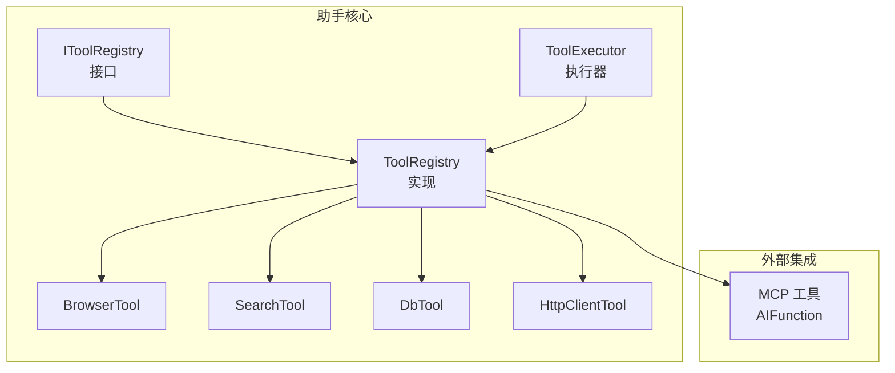
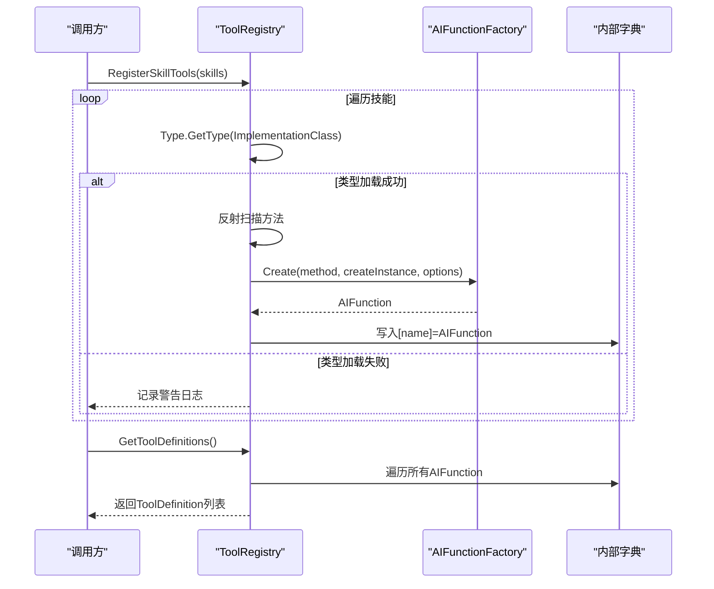
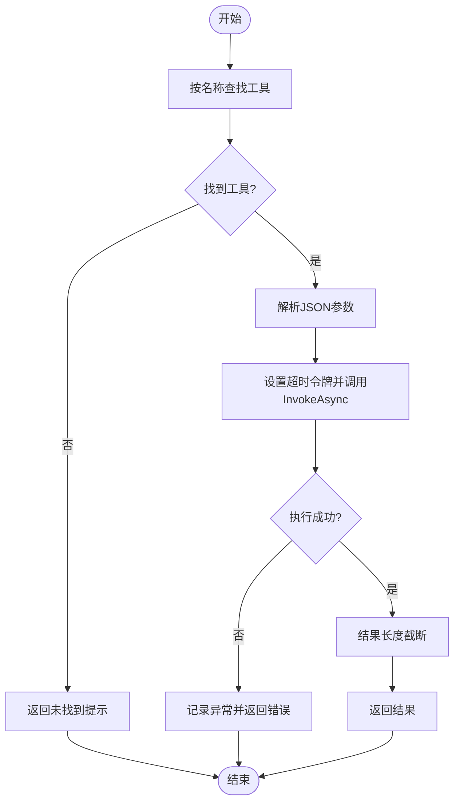
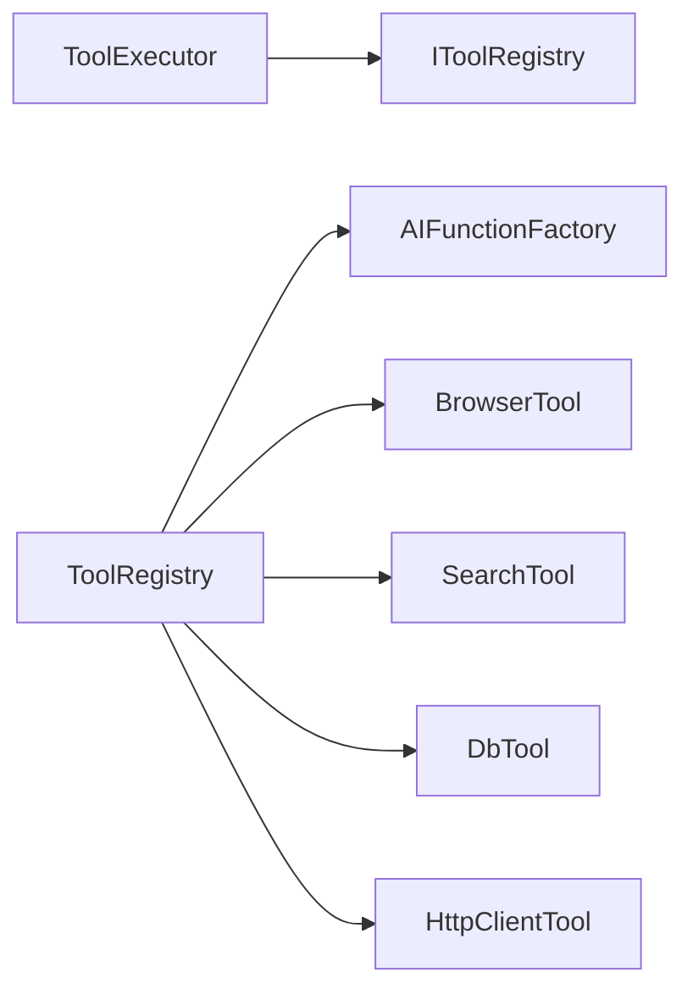

# 工具注册中心

<cite>
**本文引用的文件**   
- [IToolRegistry.cs](file://src/Agent/Assistant/H.Assistant.Core/Tools/IToolRegistry.cs)
- [ToolRegistry.cs](file://src/Agent/Assistant/H.Assistant.Core/Tools/ToolRegistry.cs)
- [ToolExecutor.cs](file://src/Agent/Assistant/H.Assistant.Core/Agents/ToolExecutor.cs)
- [BrowserTool.cs](file://src/Agent/Assistant/H.Assistant.Core/Tools/BrowserTool.cs)
- [SearchTool.cs](file://src/Agent/Assistant/H.Assistant.Core/Tools/SearchTool.cs)
- [DbTool.cs](file://src/Agent/Assistant/H.Assistant.Core/Tools/DbTool.cs)
- [HttpClientTool.cs](file://src/Agent/Assistant/H.Assistant.Core/Tools/HttpClientTool.cs)
- [AssistantCoreModule.cs](file://src/Agent/Assistant/H.Assistant.Core/AssistantCoreModule.cs)
- [YunXiaoMcpTools.cs](file://src/Agent/McpServers/H.Mcp.YunXiao/YunXiaoMcpTools.cs)
- [HostAllModule.cs](file://src/Host/H.AppLab.Host.All/H.AppLab.Host.All/HostAllModule.cs)
- [SystemAccountAppService.cs](file://src/System/SystemPortal/H.SystemPortal.Application/Services/SystemAccountAppService.cs)
</cite>

## 目录
1. [简介](#简介)
2. [项目结构](#项目结构)
3. [核心组件](#核心组件)
4. [架构总览](#架构总览)
5. [详细组件分析](#详细组件分析)
6. [依赖关系分析](#依赖关系分析)
7. [性能与扩展性](#性能与扩展性)
8. [故障排查指南](#故障排查指南)
9. [结论](#结论)
10. [附录：自定义工具开发最佳实践](#附录自定义工具开发最佳实践)

## 简介
本文件面向“工具注册中心”的设计与实现，围绕以下目标展开：
- 工具注册与发现机制的核心原理
- 工具的元数据管理与版本控制
- 工具依赖关系的解析与加载顺序
- 工具权限控制与访问限制的实现
- 自定义工具的注册方法与最佳实践
- 工具的热更新与动态加载能力

该子系统基于反射与 AIFunction 工厂，将方法级工具以“技能（Skill）”为单位进行描述、注册与执行，并通过统一的注册中心对外暴露工具清单与 OpenAI 风格的工具定义。

## 项目结构
工具注册中心位于 Assistant 核心模块中，采用“接口 + 实现 + 内置工具 + 执行器”的分层组织方式：
- 接口层：IToolRegistry 定义注册与发现契约
- 实现层：ToolRegistry 负责扫描、注册、生成工具定义
- 内置工具：BrowserTool、SearchTool、DbTool、HttpClientTool 等
- 执行器：ToolExecutor 负责参数解析、超时控制、结果截断与错误处理
- MCP 集成：支持从外部传入 AIFunction 作为 MCP 工具
- 模块装配：AssistantCoreModule 用于 ABP 模块注册（当前为空壳，可按需扩展）

图表来源
- [IToolRegistry.cs:1-36](file://src/Agent/Assistant/H.Assistant.Core/Tools/IToolRegistry.cs#L1-L36)
- [ToolRegistry.cs:1-204](file://src/Agent/Assistant/H.Assistant.Core/Tools/ToolRegistry.cs#L1-L204)
- [ToolExecutor.cs:1-102](file://src/Agent/Assistant/H.Assistant.Core/Agents/ToolExecutor.cs#L1-L102)
- [BrowserTool.cs:1-278](file://src/Agent/Assistant/H.Assistant.Core/Tools/BrowserTool.cs#L1-L278)
- [SearchTool.cs:1-362](file://src/Agent/Assistant/H.Assistant.Core/Tools/SearchTool.cs#L1-L362)
- [DbTool.cs:1-305](file://src/Agent/Assistant/H.Assistant.Core/Tools/DbTool.cs#L1-L305)
- [HttpClientTool.cs:1-121](file://src/Agent/Assistant/H.Assistant.Core/Tools/HttpClientTool.cs#L1-L121)

章节来源
- [IToolRegistry.cs:1-36](file://src/Agent/Assistant/H.Assistant.Core/Tools/IToolRegistry.cs#L1-L36)
- [ToolRegistry.cs:1-204](file://src/Agent/Assistant/H.Assistant.Core/Tools/ToolRegistry.cs#L1-L204)
- [ToolExecutor.cs:1-102](file://src/Agent/Assistant/H.Assistant.Core/Agents/ToolExecutor.cs#L1-L102)

## 核心组件
- IToolRegistry：定义获取全部工具、按名称查找、导出 OpenAI 风格 ToolDefinition、注册 MCP 工具、从技能列表批量注册的能力。
- ToolRegistry：维护一个大小写不敏感的字典缓存已注册工具；启动时自动注册内置工具；支持从 SkillDto 列表动态加载类型并扫描带 Description 的方法；支持直接注册外部 AIFunction。
- ToolExecutor：根据工具名查找 AIFunction，解析 JSON 参数，设置超时取消令牌，调用 InvokeAsync，并对过长结果进行截断与异常捕获。
- 内置工具：BrowserTool（网页抓取/文本提取/链接抽取/可达性检查）、SearchTool（多引擎搜索与新闻搜索）、DbTool（SQL 查询/命令/标量/表信息/连接测试）、HttpClientTool（GET/POST 请求封装）。

章节来源
- [IToolRegistry.cs:1-36](file://src/Agent/Assistant/H.Assistant.Core/Tools/IToolRegistry.cs#L1-L36)
- [ToolRegistry.cs:1-204](file://src/Agent/Assistant/H.Assistant.Core/Tools/ToolRegistry.cs#L1-L204)
- [ToolExecutor.cs:1-102](file://src/Agent/Assistant/H.Assistant.Core/Agents/ToolExecutor.cs#L1-L102)
- [BrowserTool.cs:1-278](file://src/Agent/Assistant/H.Assistant.Core/Tools/BrowserTool.cs#L1-L278)
- [SearchTool.cs:1-362](file://src/Agent/Assistant/H.Assistant.Core/Tools/SearchTool.cs#L1-L362)
- [DbTool.cs:1-305](file://src/Agent/Assistant/H.Assistant.Core/Tools/DbTool.cs#L1-L305)
- [HttpClientTool.cs:1-121](file://src/Agent/Assistant/H.Assistant.Core/Tools/HttpClientTool.cs#L1-L121)

## 架构总览
工具注册中心通过“反射扫描 + AIFunction 工厂”的方式，将任意带有 [Description] 的公共方法暴露为 LLM 可调用的工具。注册中心提供统一入口，执行器负责运行时调度与容错。

```mermaid
classDiagram
class IToolRegistry {
+GetAllTools() IReadOnlyList~AIFunction~
+GetTool(name) AIFunction?
+GetToolDefinitions() ToolDefinition[]
+RegisterMcpTool(tool) void
+RegisterSkillTools(skills) void
}
class ToolRegistry {
-_tools : Dictionary~string, AIFunction~
-_logger : ILogger
+RegisterBuiltinTools() void
+RegisterToolsFromType(type) void
+RegisterSkillTools(skills) void
+RegisterMcpTool(tool) void
+GetAllTools() IReadOnlyList~AIFunction~
+GetTool(name) AIFunction?
+GetToolDefinitions() ToolDefinition[]
}
class ToolExecutor {
-_toolRegistry : IToolRegistry
-_logger : ILogger
+ExecuteAsync(toolName, argumentsJson, ct) Task~(string,bool)~
-ParseArguments(argumentsJson) Dictionary~string, object?~?
}
class BrowserTool
class SearchTool
class DbTool
class HttpClientTool
IToolRegistry <|.. ToolRegistry
ToolExecutor --> IToolRegistry : "依赖"
ToolRegistry --> BrowserTool : "反射扫描"
ToolRegistry --> SearchTool : "反射扫描"
ToolRegistry --> DbTool : "反射扫描"
ToolRegistry --> HttpClientTool : "反射扫描"
```

图表来源
- [IToolRegistry.cs:1-36](file://src/Agent/Assistant/H.Assistant.Core/Tools/IToolRegistry.cs#L1-L36)
- [ToolRegistry.cs:1-204](file://src/Agent/Assistant/H.Assistant.Core/Tools/ToolRegistry.cs#L1-L204)
- [ToolExecutor.cs:1-102](file://src/Agent/Assistant/H.Assistant.Core/Agents/ToolExecutor.cs#L1-L102)
- [BrowserTool.cs:1-278](file://src/Agent/Assistant/H.Assistant.Core/Tools/BrowserTool.cs#L1-L278)
- [SearchTool.cs:1-362](file://src/Agent/Assistant/H.Assistant.Core/Tools/SearchTool.cs#L1-L362)
- [DbTool.cs:1-305](file://src/Agent/Assistant/H.Assistant.Core/Tools/DbTool.cs#L1-L305)
- [HttpClientTool.cs:1-121](file://src/Agent/Assistant/H.Assistant.Core/Tools/HttpClientTool.cs#L1-L121)

## 详细组件分析

### 工具注册与发现机制
- 注册流程
  - 启动时自动注册内置工具：遍历预置类型集合，对每个类型使用反射扫描所有 public/static/instance 方法，筛选出带有 [Description] 的方法，通过 AIFunctionFactory.Create 创建 AIFunction，并以方法名为键存入字典。
  - 动态技能注册：接收 SkillDto 列表，过滤 IsEnabled 且 ImplementationClass 非空项，通过 Type.GetType 加载类型，再按相同规则扫描并注册。
  - MCP 工具注册：直接接受外部传入的 AIFunction，按名称覆盖式注册。
- 发现流程
  - GetAllTools：返回所有已注册工具列表
  - GetTool：按名称精确查找
  - GetToolDefinitions：将 AIFunction 转换为 OpenAI 风格的 ToolDefinition，包含 function.name、function.description 以及由 JsonSchema 反序列化的参数定义

图表来源
- [ToolRegistry.cs:1-204](file://src/Agent/Assistant/H.Assistant.Core/Tools/ToolRegistry.cs#L1-L204)

章节来源
- [ToolRegistry.cs:1-204](file://src/Agent/Assistant/H.Assistant.Core/Tools/ToolRegistry.cs#L1-L204)

### 工具元数据管理与版本控制
- 元数据来源
  - 方法名：作为工具唯一标识（name）
  - DescriptionAttribute：作为工具描述（description）
  - 方法签名与参数类型：由 AIFunction 自动生成 JsonSchema，映射为 OpenAI 的参数定义
- 版本控制建议
  - 在 SkillDto 中引入 Version 字段（如语义化版本），配合 IsEnabled 控制生效范围
  - 注册前校验版本兼容性（例如主版本变更视为破坏性更新）
  - 保留历史版本的 ToolDefinition 快照，便于回滚与审计

说明：当前代码未显式实现版本字段，建议在 SkillDto 与注册流程中扩展。

章节来源
- [ToolRegistry.cs:1-204](file://src/Agent/Assistant/H.Assistant.Core/Tools/ToolRegistry.cs#L1-L204)

### 工具依赖关系的解析与加载顺序
- 当前实现
  - 工具之间无显式依赖声明，注册顺序不影响最终可用性
  - 内置工具在构造时即完成注册；技能工具按输入列表顺序逐一注册
- 推荐方案
  - 在 SkillDto 中增加 Dependencies 列表（工具名或类名）
  - 注册前进行拓扑排序，确保依赖先于被依赖工具加载
  - 循环依赖检测与告警

章节来源
- [ToolRegistry.cs:1-204](file://src/Agent/Assistant/H.Assistant.Core/Tools/ToolRegistry.cs#L1-L204)

### 工具权限控制与访问限制
- 认证与授权现状
  - 宿主层配置了 Cookie 认证（用户与系统双 Cookie），可用于上层 API 鉴权
  - 工具执行器本身未内置权限校验，默认对所有已注册工具开放
- 建议实现
  - 在 ToolExecutor.ExecuteAsync 入口处注入权限策略，依据当前 ClaimsPrincipal 判断是否允许调用某工具
  - 在 SkillDto 中增加 AllowedRoles/AllowedUsers 白名单
  - 对敏感工具（如数据库操作）强制启用审批或二次确认

章节来源
- [HostAllModule.cs:115-139](file://src/Host/H.AppLab.Host.All/H.AppLab.Host.All/HostAllModule.cs#L115-L139)
- [SystemAccountAppService.cs:68-104](file://src/System/SystemPortal/H.SystemPortal.Application/Services/SystemAccountAppService.cs#L68-L104)
- [ToolExecutor.cs:1-102](file://src/Agent/Assistant/H.Assistant.Core/Agents/ToolExecutor.cs#L1-L102)

### 工具热更新与动态加载
- 现有能力
  - RegisterSkillTools 支持运行时按 SkillDto 列表动态加载类型与方法，实现“热插拔”
  - RegisterMcpTool 支持外部 AIFunction 动态注入
- 注意事项
  - 类型加载依赖 Type.GetType，需要确保程序集可被当前 AppDomain 找到
  - 重复注册同名工具会覆盖旧实例，注意并发安全与幂等性
  - 建议增加注册事件与缓存失效策略，避免频繁反射开销

章节来源
- [ToolRegistry.cs:1-204](file://src/Agent/Assistant/H.Assistant.Core/Tools/ToolRegistry.cs#L1-L204)

### 工具执行流程
- 执行步骤
  - 根据工具名查找 AIFunction
  - 解析 JSON 参数为字典（忽略大小写）
  - 创建超时取消令牌（默认 60 秒）
  - 调用 InvokeAsync，捕获异常与超时，返回字符串结果（超长截断）
- 错误处理
  - 工具不存在：返回可用工具列表提示
  - 参数解析失败：视为无参调用
  - 执行异常：记录警告日志并返回错误消息

图表来源
- [ToolExecutor.cs:1-102](file://src/Agent/Assistant/H.Assistant.Core/Agents/ToolExecutor.cs#L1-L102)

章节来源
- [ToolExecutor.cs:1-102](file://src/Agent/Assistant/H.Assistant.Core/Agents/ToolExecutor.cs#L1-L102)

### MCP 工具集成
- 支持通过 RegisterMcpTool 直接注入 AIFunction，便于与外部 MCP 服务对接
- 示例模块 YunXiaoMcpTools 可作为参考，将 MCP 工具以 AIFunction 形式接入注册中心

章节来源
- [IToolRegistry.cs:1-36](file://src/Agent/Assistant/H.Assistant.Core/Tools/IToolRegistry.cs#L1-L36)
- [ToolRegistry.cs:1-204](file://src/Agent/Assistant/H.Assistant.Core/Tools/ToolRegistry.cs#L1-L204)
- [YunXiaoMcpTools.cs](file://src/Agent/McpServers/H.Mcp.YunXiao/YunXiaoMcpTools.cs)

## 依赖关系分析
- 组件耦合
  - ToolExecutor 仅依赖 IToolRegistry 接口，解耦具体实现
  - ToolRegistry 依赖反射与 AIFunctionFactory，对内置工具类型强引用
- 外部依赖
  - Microsoft.Extensions.AI（AIFunction/AIFunctionFactory）
  - System.Text.Json（参数序列化/反序列化）
  - 网络与数据库客户端（HttpClient、SqlClient）

图表来源
- [ToolExecutor.cs:1-102](file://src/Agent/Assistant/H.Assistant.Core/Agents/ToolExecutor.cs#L1-L102)
- [ToolRegistry.cs:1-204](file://src/Agent/Assistant/H.Assistant.Core/Tools/ToolRegistry.cs#L1-L204)

章节来源
- [ToolExecutor.cs:1-102](file://src/Agent/Assistant/H.Assistant.Core/Agents/ToolExecutor.cs#L1-L102)
- [ToolRegistry.cs:1-204](file://src/Agent/Assistant/H.Assistant.Core/Tools/ToolRegistry.cs#L1-L204)

## 性能与扩展性
- 性能要点
  - 反射仅在注册阶段执行，运行期通过字典 O(1) 查找
  - 工具结果长度限制，避免大对象传递
  - 网络与数据库操作均支持超时与取消令牌
- 扩展建议
  - 引入插件化程序集扫描，减少硬编码类型列表
  - 增加工具元数据缓存（如 JsonSchema 缓存）
  - 支持异步批量注册与增量更新

[本节为通用指导，无需源码引用]

## 故障排查指南
- 常见问题
  - 工具未找到：检查名称一致性与注册顺序
  - 参数解析失败：确认 JSON 格式与键名大小写
  - 执行超时：调整 ExecutionTimeoutSeconds 或工具内部超时
  - 类型加载失败：确认 ImplementationClass 正确且程序集可被加载
- 日志定位
  - ToolRegistry 在注册失败时输出警告日志
  - ToolExecutor 在执行异常与超时时输出警告日志

章节来源
- [ToolRegistry.cs:1-204](file://src/Agent/Assistant/H.Assistant.Core/Tools/ToolRegistry.cs#L1-L204)
- [ToolExecutor.cs:1-102](file://src/Agent/Assistant/H.Assistant.Core/Agents/ToolExecutor.cs#L1-L102)

## 结论
工具注册中心以简洁的反射+工厂模式实现了强大的工具注册与发现能力，结合 ToolExecutor 的统一执行框架，提供了稳定、可扩展的工具生态。通过引入版本控制、依赖解析、权限校验与更完善的动态加载策略，可进一步提升系统的健壮性与可运维性。

[本节为总结性内容，无需源码引用]

## 附录：自定义工具开发最佳实践
- 编写规范
  - 将工具方法声明为 public static，并在方法上添加 [Description] 属性
  - 参数尽量使用简单类型与常见集合，便于 JsonSchema 生成
  - 为耗时操作提供 CancellationToken 参数，支持取消
- 注册方式
  - 内置工具：在 ToolRegistry.RegisterBuiltinTools 中添加类型
  - 动态技能：在 SkillDto 中填写 ImplementationClass 并确保 IsEnabled
  - MCP 工具：通过 RegisterMcpTool 注入 AIFunction
- 安全与治理
  - 对敏感工具增加权限校验与审计日志
  - 限制资源访问（URL 白名单、数据库连接串白名单）
  - 监控工具调用次数与成功率，建立告警

章节来源
- [ToolRegistry.cs:1-204](file://src/Agent/Assistant/H.Assistant.Core/Tools/ToolRegistry.cs#L1-L204)
- [ToolExecutor.cs:1-102](file://src/Agent/Assistant/H.Assistant.Core/Agents/ToolExecutor.cs#L1-L102)