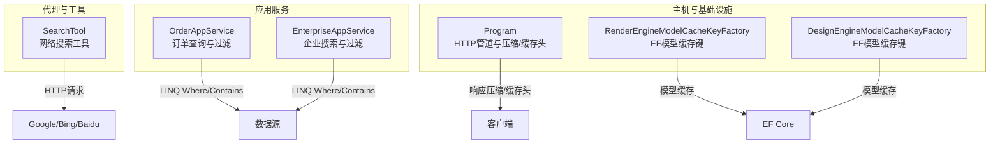
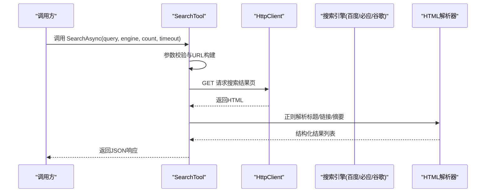
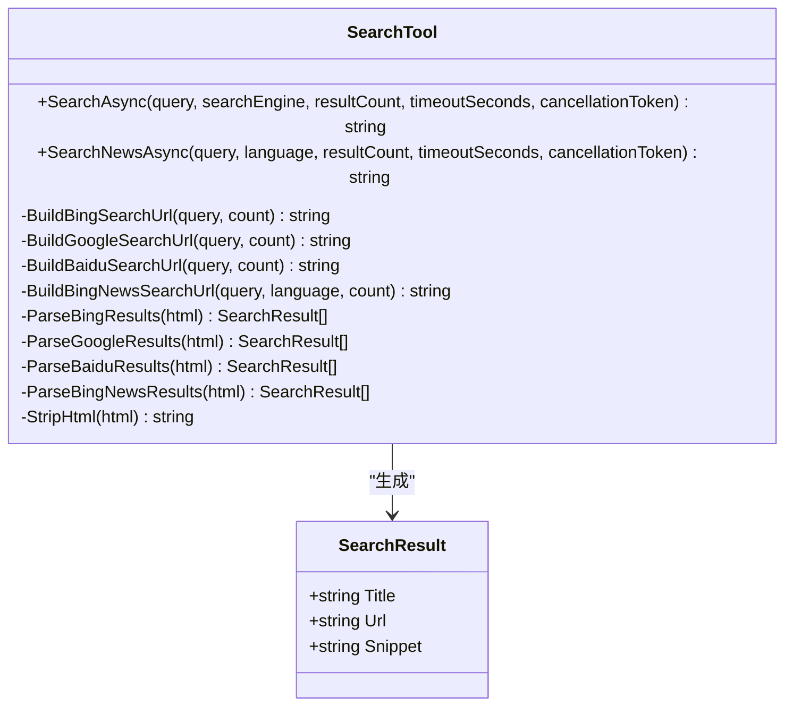
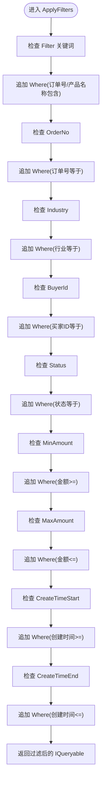
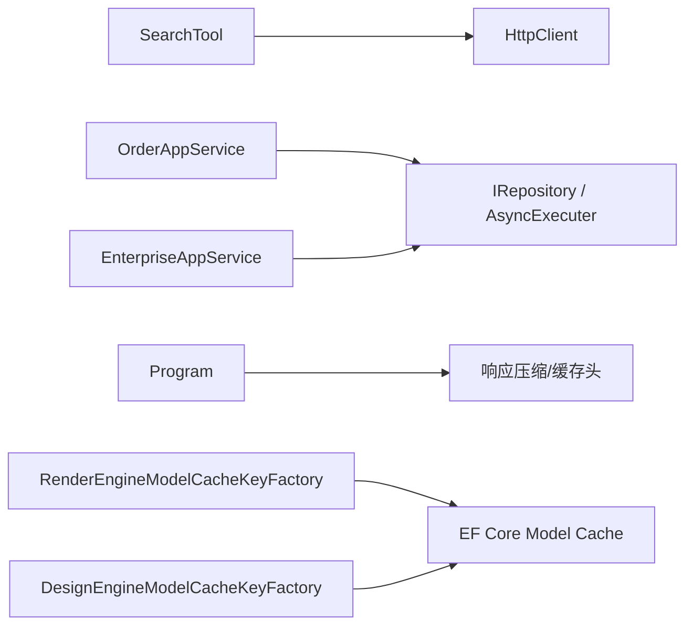

# 搜索工具

<cite>
**本文引用的文件**   
- [SearchTool.cs](file://src/Agent/Assistant/H.Assistant.Core/Tools/SearchTool.cs)
- [OrderAppService.cs](file://src/Services/Order/H.Order.Application/Services/OrderAppService.cs)
- [EnterpriseAppService.cs](file://src/System/Enterprise/H.Enterprise.Application/Services/EnterpriseAppService.cs)
- [Program.cs](file://src/Host/H.AppLab.Host.All/H.AppLab.Host.All/Program.cs)
- [RenderEngineModelCacheKeyFactory.cs](file://src/LowCode/RenderEngine/H.LowCode.RenderEngine.EntityFrameworkCore/EntityFrameworkCore/Extensions/RenderEngineModelCacheKeyFactory.cs)
- [DesignEngineModelCacheKeyFactory.cs](file://src/LowCode/DesignEngine/H.LowCode.DesignEngine.EntityFrameworkCore/EntityFrameworkCore/Extensions/DesignEngineModelCacheKeyFactory.cs)
</cite>

## 目录
1. [简介](#简介)
2. [项目结构](#项目结构)
3. [核心组件](#核心组件)
4. [架构总览](#架构总览)
5. [详细组件分析](#详细组件分析)
6. [依赖关系分析](#依赖关系分析)
7. [性能与缓存策略](#性能与缓存策略)
8. [故障排查指南](#故障排查指南)
9. [结论](#结论)
10. [附录：API 接口定义与使用示例](#附录api-接口定义与使用示例)

## 简介
本文件为“搜索工具”的完整技术文档，聚焦于搜索引擎集成、查询处理、结果排序与过滤、全文搜索与模糊匹配实现方式，以及搜索 API 的接口定义与使用示例。同时给出性能优化与缓存策略建议，帮助开发者在现有代码基础上扩展或替换更强大的搜索引擎能力。

## 项目结构
当前仓库采用多模块分层架构（ABP 风格），搜索相关能力主要位于 Agent 子模块的工具层，业务服务中则包含大量基于 LINQ 的过滤与分页查询模式，可作为本地全文搜索与模糊匹配的参考实现。

图表来源
- [SearchTool.cs:1-362](file://src/Agent/Assistant/H.Assistant.Core/Tools/SearchTool.cs#L1-L362)
- [OrderAppService.cs:60-82](file://src/Services/Order/H.Order.Application/Services/OrderAppService.cs#L60-L82)
- [EnterpriseAppService.cs:35-70](file://src/System/Enterprise/H.Enterprise.Application/Services/EnterpriseAppService.cs#L35-L70)
- [Program.cs:36-88](file://src/Host/H.AppLab.Host.All/H.AppLab.Host.All/Program.cs#L36-L88)
- [RenderEngineModelCacheKeyFactory.cs:1-13](file://src/LowCode/RenderEngine/H.LowCode.RenderEngine.EntityFrameworkCore/EntityFrameworkCore/Extensions/RenderEngineModelCacheKeyFactory.cs#L1-L13)
- [DesignEngineModelCacheKeyFactory.cs:1-13](file://src/LowCode/DesignEngine/H.LowCode.DesignEngine.EntityFrameworkCore/EntityFrameworkCore/Extensions/DesignEngineModelCacheKeyFactory.cs#L1-L13)

章节来源
- [SearchTool.cs:1-362](file://src/Agent/Assistant/H.Assistant.Core/Tools/SearchTool.cs#L1-L362)
- [OrderAppService.cs:60-82](file://src/Services/Order/H.Order.Application/Services/OrderAppService.cs#L60-L82)
- [EnterpriseAppService.cs:35-70](file://src/System/Enterprise/H.Enterprise.Application/Services/EnterpriseAppService.cs#L35-L70)
- [Program.cs:36-88](file://src/Host/H.AppLab.Host.All/H.AppLab.Host.All/Program.cs#L36-L88)
- [RenderEngineModelCacheKeyFactory.cs:1-13](file://src/LowCode/RenderEngine/H.LowCode.RenderEngine.EntityFrameworkCore/EntityFrameworkCore/Extensions/RenderEngineModelCacheKeyFactory.cs#L1-L13)
- [DesignEngineModelCacheKeyFactory.cs:1-13](file://src/LowCode/DesignEngine/H.LowCode.DesignEngine.EntityFrameworkCore/EntityFrameworkCore/Extensions/DesignEngineModelCacheKeyFactory.cs#L1-L13)

## 核心组件
- 网络搜索工具 SearchTool
  - 支持 Google、Bing、Baidu 三种搜索引擎
  - 提供通用搜索与新闻搜索两个入口
  - 通过 HTTP 获取 HTML 并使用正则解析结果
  - 返回统一 JSON 结构，包含成功标志、查询词、引擎名、结果数量与结果列表
- 业务服务中的查询与过滤
  - OrderAppService.ApplyFilters：基于 LINQ 的多条件过滤（关键词、范围、时间等）
  - EnterpriseAppService：按关键字进行多字段 Contains 模糊匹配，并支持枚举与布尔筛选

章节来源
- [SearchTool.cs:27-80](file://src/Agent/Assistant/H.Assistant.Core/Tools/SearchTool.cs#L27-L80)
- [SearchTool.cs:125-143](file://src/Agent/Assistant/H.Assistant.Core/Tools/SearchTool.cs#L125-L143)
- [OrderAppService.cs:61-82](file://src/Services/Order/H.Order.Application/Services/OrderAppService.cs#L61-L82)
- [EnterpriseAppService.cs:35-70](file://src/System/Enterprise/H.Enterprise.Application/Services/EnterpriseAppService.cs#L35-L70)

## 架构总览
搜索工具作为独立工具类，通过 HttpClient 直接访问搜索引擎页面，解析 HTML 后返回结构化结果。业务服务中的查询逻辑展示了如何在数据库侧实现高效过滤与分页，可作为本地全文搜索与相关性排序的基础。

图表来源
- [SearchTool.cs:27-80](file://src/Agent/Assistant/H.Assistant.Core/Tools/SearchTool.cs#L27-L80)
- [SearchTool.cs:125-143](file://src/Agent/Assistant/H.Assistant.Core/Tools/SearchTool.cs#L125-L143)
- [SearchTool.cs:148-198](file://src/Agent/Assistant/H.Assistant.Core/Tools/SearchTool.cs#L148-L198)

## 详细组件分析

### 搜索引擎集成与查询处理（SearchTool）
- 功能要点
  - 支持多搜索引擎 URL 构建与选择
  - 统一的超时控制与取消令牌
  - 针对 Bing、Google、Baidu 的 HTML 解析策略
  - 新闻搜索专用入口
- 数据结构
  - 内部 SearchResult：包含 Title、Url、Snippet
- 错误处理
  - 捕获异常并返回友好错误消息
  - 解析失败时返回提示性结果

图表来源
- [SearchTool.cs:10-80](file://src/Agent/Assistant/H.Assistant.Core/Tools/SearchTool.cs#L10-L80)
- [SearchTool.cs:355-361](file://src/Agent/Assistant/H.Assistant.Core/Tools/SearchTool.cs#L355-L361)

章节来源
- [SearchTool.cs:27-80](file://src/Agent/Assistant/H.Assistant.Core/Tools/SearchTool.cs#L27-L80)
- [SearchTool.cs:125-143](file://src/Agent/Assistant/H.Assistant.Core/Tools/SearchTool.cs#L125-L143)
- [SearchTool.cs:148-198](file://src/Agent/Assistant/H.Assistant.Core/Tools/SearchTool.cs#L148-L198)
- [SearchTool.cs:203-247](file://src/Agent/Assistant/H.Assistant.Core/Tools/SearchTool.cs#L203-L247)
- [SearchTool.cs:252-294](file://src/Agent/Assistant/H.Assistant.Core/Tools/SearchTool.cs#L252-L294)
- [SearchTool.cs:299-342](file://src/Agent/Assistant/H.Assistant.Core/Tools/SearchTool.cs#L299-L342)
- [SearchTool.cs:344-353](file://src/Agent/Assistant/H.Assistant.Core/Tools/SearchTool.cs#L344-L353)
- [SearchTool.cs:355-361](file://src/Agent/Assistant/H.Assistant.Core/Tools/SearchTool.cs#L355-L361)

### 查询处理与过滤（OrderAppService）
- 多条件过滤：关键词、精确匹配、枚举、数值区间、时间范围
- 分页与计数：先 Count 再 Skip/Take 分页
- 可扩展性：ApplyFilters 方法便于继承与扩展

图表来源
- [OrderAppService.cs:61-82](file://src/Services/Order/H.Order.Application/Services/OrderAppService.cs#L61-L82)

章节来源
- [OrderAppService.cs:61-82](file://src/Services/Order/H.Order.Application/Services/OrderAppService.cs#L61-L82)

### 全文搜索与模糊匹配（EnterpriseAppService）
- 关键字模糊匹配：对多个字符串字段执行 Contains
- 枚举与布尔筛选：支持状态、数据库模式、激活状态
- 分页与排序：按创建时间倒序分页

章节来源
- [EnterpriseAppService.cs:35-70](file://src/System/Enterprise/H.Enterprise.Application/Services/EnterpriseAppService.cs#L35-L70)

## 依赖关系分析
- SearchTool 依赖系统级 HttpClient，配置了自动解压、重定向与超时
- 业务服务依赖 ABP 仓储与异步执行器，使用 LINQ 表达式树下推到数据库
- 主机 Program 启用响应压缩与静态资源缓存，影响网络搜索结果的传输效率
- EF Core 模型缓存键工厂确保不同应用上下文下的模型缓存隔离

图表来源
- [SearchTool.cs:12-25](file://src/Agent/Assistant/H.Assistant.Core/Tools/SearchTool.cs#L12-L25)
- [OrderAppService.cs:61-82](file://src/Services/Order/H.Order.Application/Services/OrderAppService.cs#L61-L82)
- [EnterpriseAppService.cs:35-70](file://src/System/Enterprise/H.Enterprise.Application/Services/EnterpriseAppService.cs#L35-L70)
- [Program.cs:36-88](file://src/Host/H.AppLab.Host.All/H.AppLab.Host.All/Program.cs#L36-L88)
- [RenderEngineModelCacheKeyFactory.cs:1-13](file://src/LowCode/RenderEngine/H.LowCode.RenderEngine.EntityFrameworkCore/EntityFrameworkCore/Extensions/RenderEngineModelCacheKeyFactory.cs#L1-L13)
- [DesignEngineModelCacheKeyFactory.cs:1-13](file://src/LowCode/DesignEngine/H.LowCode.DesignEngine.EntityFrameworkCore/EntityFrameworkCore/Extensions/DesignEngineModelCacheKeyFactory.cs#L1-L13)

章节来源
- [SearchTool.cs:12-25](file://src/Agent/Assistant/H.Assistant.Core/Tools/SearchTool.cs#L12-L25)
- [OrderAppService.cs:61-82](file://src/Services/Order/H.Order.Application/Services/OrderAppService.cs#L61-L82)
- [EnterpriseAppService.cs:35-70](file://src/System/Enterprise/H.Enterprise.Application/Services/EnterpriseAppService.cs#L35-L70)
- [Program.cs:36-88](file://src/Host/H.AppLab.Host.All/H.AppLab.Host.All/Program.cs#L36-L88)
- [RenderEngineModelCacheKeyFactory.cs:1-13](file://src/LowCode/RenderEngine/H.LowCode.RenderEngine.EntityFrameworkCore/EntityFrameworkCore/Extensions/RenderEngineModelCacheKeyFactory.cs#L1-L13)
- [DesignEngineModelCacheKeyFactory.cs:1-13](file://src/LowCode/DesignEngine/H.LowCode.DesignEngine.EntityFrameworkCore/EntityFrameworkCore/Extensions/DesignEngineModelCacheKeyFactory.cs#L1-L13)

## 性能与缓存策略
- 网络搜索
  - 合理设置超时与取消令牌，避免长时间阻塞
  - 限制返回结果数量，减少解析与序列化开销
  - 考虑引入服务端缓存（如内存缓存或分布式缓存）以缓存相同查询的结果
- 本地查询
  - 使用 LINQ Where/Contains 将过滤下推到数据库，提升查询性能
  - 分页采用 Count + Skip/Take，避免一次性加载全量数据
  - 对高频查询可引入 Redis 或内存缓存，注意缓存失效策略
- 传输层
  - 启用 Gzip/Brotli 压缩以减少带宽占用
  - 合理设置 Cache-Control 头，避免不必要的重复请求

章节来源
- [SearchTool.cs:27-80](file://src/Agent/Assistant/H.Assistant.Core/Tools/SearchTool.cs#L27-L80)
- [OrderAppService.cs:61-82](file://src/Services/Order/H.Order.Application/Services/OrderAppService.cs#L61-L82)
- [EnterpriseAppService.cs:35-70](file://src/System/Enterprise/H.Enterprise.Application/Services/EnterpriseAppService.cs#L35-L70)
- [Program.cs:36-88](file://src/Host/H.AppLab.Host.All/H.AppLab.Host.All/Program.cs#L36-L88)

## 故障排查指南
- 搜索失败
  - 检查网络连接与目标搜索引擎可达性
  - 确认超时设置是否过短
  - 查看异常信息，定位是网络请求还是解析阶段失败
- 解析结果为空
  - 搜索引擎页面结构可能变化导致正则不匹配
  - 建议在解析失败时返回提示，引导使用官方 API
- 查询性能问题
  - 检查是否存在全表扫描或缺少索引
  - 评估 Contains 的使用场景，必要时引入全文检索引擎

章节来源
- [SearchTool.cs:76-80](file://src/Agent/Assistant/H.Assistant.Core/Tools/SearchTool.cs#L76-L80)
- [SearchTool.cs:186-198](file://src/Agent/Assistant/H.Assistant.Core/Tools/SearchTool.cs#L186-L198)
- [SearchTool.cs:236-247](file://src/Agent/Assistant/H.Assistant.Core/Tools/SearchTool.cs#L236-L247)
- [SearchTool.cs:283-294](file://src/Agent/Assistant/H.Assistant.Core/Tools/SearchTool.cs#L283-L294)

## 结论
当前搜索工具提供了轻量级的网络搜索能力，适用于快速原型与简单场景。对于生产环境的高并发、高可用与复杂检索需求，建议结合专业搜索引擎（如 Elasticsearch、OpenSearch）与全文索引方案，并在应用层引入缓存与重试机制以提升整体性能与稳定性。

## 附录：API 接口定义与使用示例
- 通用搜索接口
  - 方法：SearchAsync
  - 参数：query（搜索关键词）、searchEngine（google/bing/baidu，默认 bing）、resultCount（1-20，默认 10）、timeoutSeconds（默认 30）、cancellationToken
  - 返回：JSON 字符串，包含 Success、Query、Engine、ResultCount、Results
- 新闻搜索接口
  - 方法：SearchNewsAsync
  - 参数：query（新闻关键词）、language（默认 zh-CN）、resultCount（默认 10）、timeoutSeconds（默认 30）、cancellationToken
  - 返回：JSON 字符串，包含 Success、Query、Language、ResultCount、Results

章节来源
- [SearchTool.cs:27-80](file://src/Agent/Assistant/H.Assistant.Core/Tools/SearchTool.cs#L27-L80)
- [SearchTool.cs:82-123](file://src/Agent/Assistant/H.Assistant.Core/Tools/SearchTool.cs#L82-L123)