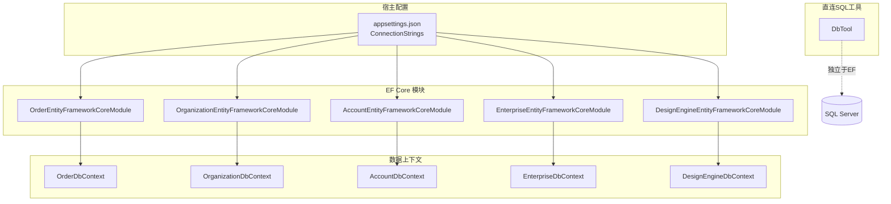
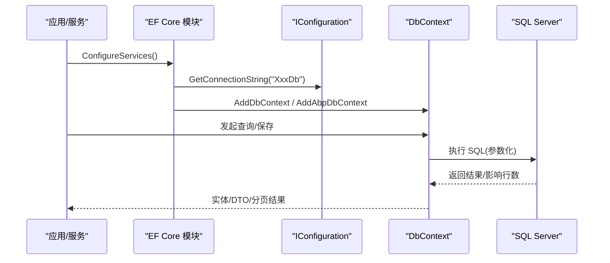
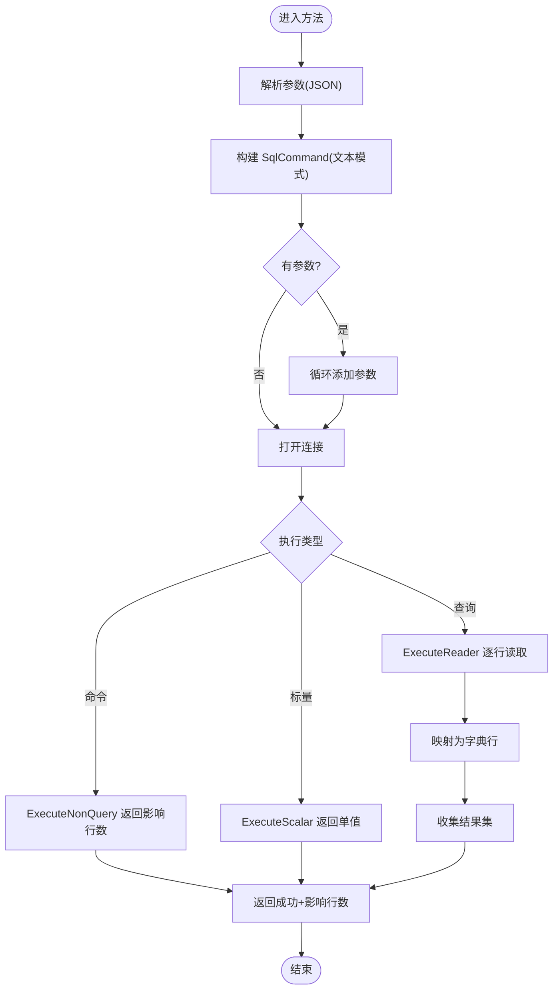
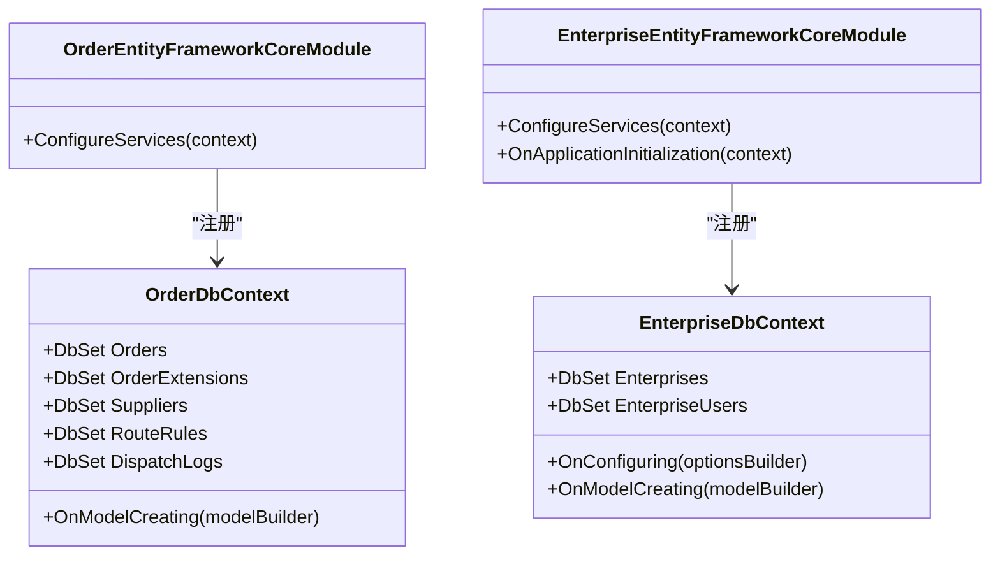
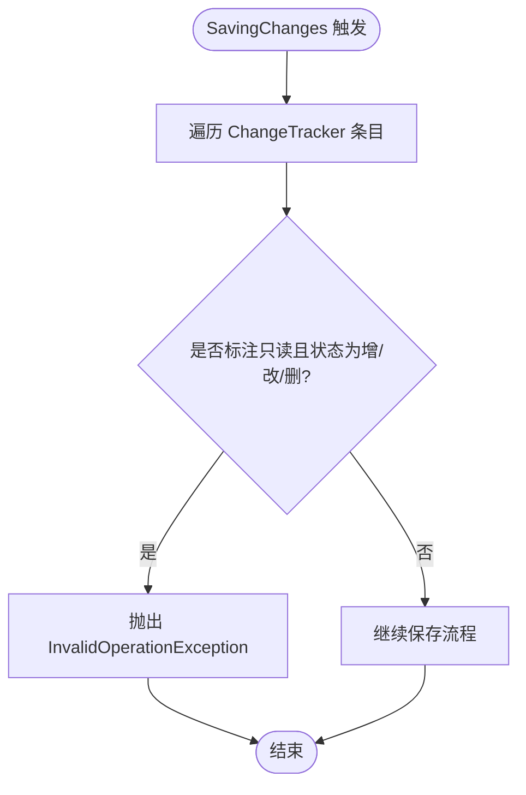
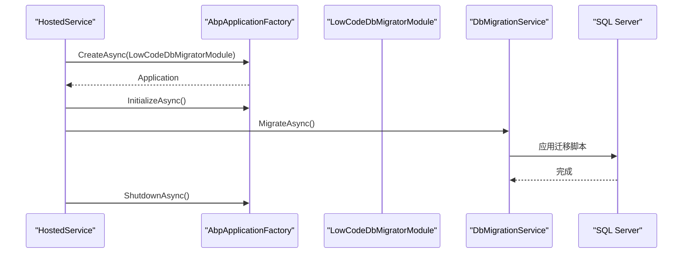
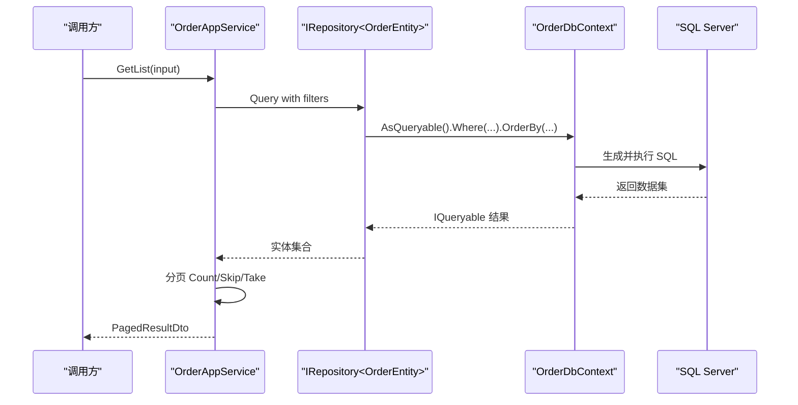
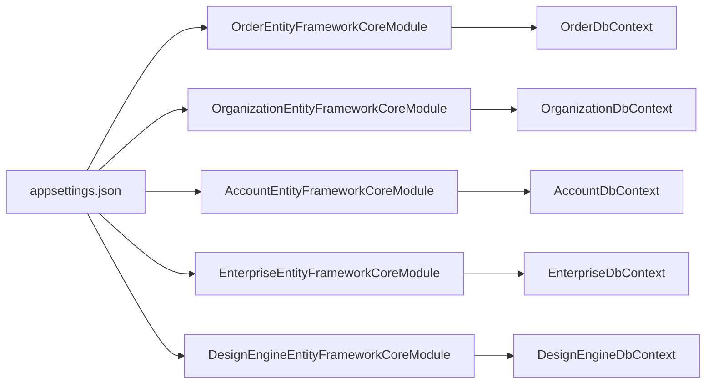

# 数据库工具

<cite>
**本文引用的文件**   
- [DbTool.cs](file://src/Agent/Assistant/H.Assistant.Core/Tools/DbTool.cs)
- [OrderDbContext.cs](file://src/Services/Order/H.Order.EntityFrameworkCore/OrderDbContext.cs)
- [OrderEntityFrameworkCoreModule.cs](file://src/Services/Order/H.Order.EntityFrameworkCore/OrderEntityFrameworkCoreModule.cs)
- [OrganizationEntityFrameworkCoreModule.cs](file://src/Services/Organization/H.Organization.EntityFrameworkCore/OrganizationEntityFrameworkCoreModule.cs)
- [AccountEntityFrameworkCoreModule.cs](file://src/Services/Account/H.Account.EntityFrameworkCore/AccountEntityFrameworkCoreModule.cs)
- [EnterpriseDbContext.cs](file://src/System/Enterprise/H.Enterprise.EntityFrameworkCore/EnterpriseDbContext.cs)
- [EnterpriseEntityFrameworkCoreModule.cs](file://src/System/Enterprise/H.Enterprise.EntityFrameworkCore/EnterpriseEntityFrameworkCoreModule.cs)
- [DesignEngineEntityFrameworkCoreModule.cs](file://src/LowCode/DesignEngine/H.LowCode.DesignEngine.EntityFrameworkCore/DesignEngineEntityFrameworkCoreModule.cs)
- [ReadOnlySaveChangesInterceptor.cs](file://src/LowCode/DesignEngine/H.LowCode.DesignEngine.EntityFrameworkCore/EntityFrameworkCore/Extensions/ReadOnlySaveChangesInterceptor.cs)
- [HostedService.cs](file://src/Tools/H.LowCode.DbMigrator/HostedService.cs)
- [LowCodeDbMigratorModule.cs](file://src/Tools/H.LowCode.DbMigrator/LowCodeDbMigratorModule.cs)
- [appsettings.json](file://src/Host/H.AppLab.Host.All/H.AppLab.Host.All/appsettings.json)
- [ApprovalRepository.cs](file://src/Services/Approval/H.Approval.EntityFrameworkCore/Repositories/ApprovalRepository.cs)
- [OrderAppService.cs](file://src/Services/Order/H.Order.Application/Services/OrderAppService.cs)
</cite>

## 目录
1. [简介](#简介)
2. [项目结构](#项目结构)
3. [核心组件](#核心组件)
4. [架构总览](#架构总览)
5. [详细组件分析](#详细组件分析)
6. [依赖关系分析](#依赖关系分析)
7. [性能考虑](#性能考虑)
8. [故障排查指南](#故障排查指南)
9. [结论](#结论)
10. [附录](#附录)

## 简介
本文件面向“数据库工具”能力，聚焦以下目标：
- 数据库连接管理与查询执行
- SQL 语句执行与结果处理机制
- 参数化查询与防注入安全措施
- 事务处理与批量操作支持
- 数据库连接配置与连接池管理
- 查询性能优化与错误恢复策略

本项目采用 EF Core 作为 ORM，并通过 ABP 框架进行模块化管理；同时提供轻量级 DbTool 用于直接执行 SQL（适用于低代码/智能体场景）。

## 项目结构
- 多领域 DbContext 与模块：每个业务域（如 Order、Organization、Account、Enterprise 等）拥有独立的 DbContext 和 EF Core 模块，负责连接字符串、数据库提供程序与仓储注册。
- 统一配置来源：连接字符串集中定义在宿主 appsettings.json 中，各模块通过 IConfiguration 读取。
- 迁移与初始化：DbMigrator 工具应用 EF 迁移；部分模块在启动时自动创建数据库。
- 直连 SQL 工具：DbTool 封装 SqlConnection/SqlCommand，提供参数化查询、命令执行、标量查询、表信息获取与连接测试。

图表来源
- [appsettings.json:1-18](file://src/Host/H.AppLab.Host.All/H.AppLab.Host.All/appsettings.json#L1-L18)
- [OrderEntityFrameworkCoreModule.cs:11-31](file://src/Services/Order/H.Order.EntityFrameworkCore/OrderEntityFrameworkCoreModule.cs#L11-L31)
- [OrderDbContext.cs:10-31](file://src/Services/Order/H.Order.EntityFrameworkCore/OrderDbContext.cs#L10-L31)

章节来源
- [appsettings.json:1-18](file://src/Host/H.AppLab.Host.All/H.AppLab.Host.All/appsettings.json#L1-L18)
- [OrderEntityFrameworkCoreModule.cs:11-31](file://src/Services/Order/H.Order.EntityFrameworkCore/OrderEntityFrameworkCoreModule.cs#L11-L31)
- [OrderDbContext.cs:10-31](file://src/Services/Order/H.Order.EntityFrameworkCore/OrderDbContext.cs#L10-L31)

## 核心组件
- DbTool：提供 ExecuteQueryAsync、ExecuteCommandAsync、ExecuteScalarAsync、GetTableInfoAsync、TestConnectionAsync 等方法，全部使用参数化方式避免 SQL 注入。
- EF Core 模块：各模块通过 AddAbpDbContext/AddDbContext 注册 DbContext，并配置 UseSqlServer() 与连接字符串。
- DbContext：定义实体集与模型映射，包含索引、唯一约束、关联关系等。
- 拦截器：ReadOnlySaveChangesInterceptor 在 SaveChanges 前检查只读标记，阻止非法写入。
- 迁移工具：DbMigrator 通过 HostedService 启动，调用 AbpApplicationFactory 初始化并执行迁移。

章节来源
- [DbTool.cs:14-71](file://src/Agent/Assistant/H.Assistant.Core/Tools/DbTool.cs#L14-L71)
- [OrderEntityFrameworkCoreModule.cs:11-31](file://src/Services/Order/H.Order.EntityFrameworkCore/OrderEntityFrameworkCoreModule.cs#L11-L31)
- [OrderDbContext.cs:32-109](file://src/Services/Order/H.Order.EntityFrameworkCore/OrderDbContext.cs#L32-L109)
- [ReadOnlySaveChangesInterceptor.cs:11-41](file://src/LowCode/DesignEngine/H.LowCode.DesignEngine.EntityFrameworkCore/EntityFrameworkCore/Extensions/ReadOnlySaveChangesInterceptor.cs#L11-L41)
- [HostedService.cs:23-43](file://src/Tools/H.LowCode.DbMigrator/HostedService.cs#L23-L43)

## 架构总览
下图展示从配置到 EF 模块、DbContext 以及直连 SQL 工具的交互关系。

图表来源
- [OrderEntityFrameworkCoreModule.cs:11-31](file://src/Services/Order/H.Order.EntityFrameworkCore/OrderEntityFrameworkCoreModule.cs#L11-L31)
- [OrderDbContext.cs:10-31](file://src/Services/Order/H.Order.EntityFrameworkCore/OrderDbContext.cs#L10-L31)
- [appsettings.json:1-18](file://src/Host/H.AppLab.Host.All/H.AppLab.Host.All/appsettings.json#L1-L18)

## 详细组件分析

### DbTool：直连 SQL 工具
- 功能
  - 查询：ExecuteQueryAsync 返回行集合（字典列表），支持 JSON 参数。
  - 命令：ExecuteCommandAsync 执行 INSERT/UPDATE/DELETE，返回受影响行数。
  - 标量：ExecuteScalarAsync 返回单个值。
  - 元数据：GetTableInfoAsync 基于 INFORMATION_SCHEMA 获取表结构与列信息。
  - 连接测试：TestConnectionAsync 验证连接并返回服务器版本等信息。
- 安全与健壮性
  - 所有用户输入通过参数化添加（AddWithValue），避免 SQL 注入。
  - 异常捕获后返回结构化失败响应，便于上层统一处理。
  - CommandTimeout 可配置，防止长耗时查询阻塞。
- 结果处理
  - 查询结果以 Dictionary<string, object> 表示，DBNull 转换为 null。
  - 输出统一为 JSON 字符串，便于跨语言/前端消费。

图表来源
- [DbTool.cs:14-71](file://src/Agent/Assistant/H.Assistant.Core/Tools/DbTool.cs#L14-L71)
- [DbTool.cs:73-117](file://src/Agent/Assistant/H.Assistant.Core/Tools/DbTool.cs#L73-L117)
- [DbTool.cs:119-163](file://src/Agent/Assistant/H.Assistant.Core/Tools/DbTool.cs#L119-L163)
- [DbTool.cs:165-247](file://src/Agent/Assistant/H.Assistant.Core/Tools/DbTool.cs#L165-L247)
- [DbTool.cs:249-284](file://src/Agent/Assistant/H.Assistant.Core/Tools/DbTool.cs#L249-L284)

章节来源
- [DbTool.cs:14-71](file://src/Agent/Assistant/H.Assistant.Core/Tools/DbTool.cs#L14-L71)
- [DbTool.cs:73-117](file://src/Agent/Assistant/H.Assistant.Core/Tools/DbTool.cs#L73-L117)
- [DbTool.cs:119-163](file://src/Agent/Assistant/H.Assistant.Core/Tools/DbTool.cs#L119-L163)
- [DbTool.cs:165-247](file://src/Agent/Assistant/H.Assistant.Core/Tools/DbTool.cs#L165-L247)
- [DbTool.cs:249-284](file://src/Agent/Assistant/H.Assistant.Core/Tools/DbTool.cs#L249-L284)

### EF Core 模块与 DbContext：连接与模型
- 连接配置
  - 各模块从 IConfiguration 读取 ConnectionStrings["XxxDb"]，并使用 UseSqlServer() 配置数据库提供程序。
  - 部分模块通过 AbpDbConnectionOptions 注册连接名称与连接字符串。
- 模型映射
  - OrderDbContext 定义了 Orders、OrderExtensions、Suppliers、RouteRules、DispatchLogs 等实体，包含主键、唯一索引、外键与级联删除。
  - EnterpriseDbContext 提供 OnConfiguring 默认连接（开发环境）与实体映射。
- 自动初始化
  - EnterpriseEntityFrameworkCoreModule 在应用初始化时 EnsureCreated，确保数据库存在。

图表来源
- [OrderDbContext.cs:10-109](file://src/Services/Order/H.Order.EntityFrameworkCore/OrderDbContext.cs#L10-L109)
- [OrderEntityFrameworkCoreModule.cs:11-31](file://src/Services/Order/H.Order.EntityFrameworkCore/OrderEntityFrameworkCoreModule.cs#L11-L31)
- [EnterpriseDbContext.cs:10-44](file://src/System/Enterprise/H.Enterprise.EntityFrameworkCore/EnterpriseDbContext.cs#L10-L44)
- [EnterpriseEntityFrameworkCoreModule.cs:11-29](file://src/System/Enterprise/H.Enterprise.EntityFrameworkCore/EnterpriseEntityFrameworkCoreModule.cs#L11-L29)

章节来源
- [OrderDbContext.cs:10-109](file://src/Services/Order/H.Order.EntityFrameworkCore/OrderDbContext.cs#L10-L109)
- [OrderEntityFrameworkCoreModule.cs:11-31](file://src/Services/Order/H.Order.EntityFrameworkCore/OrderEntityFrameworkCoreModule.cs#L11-L31)
- [OrganizationEntityFrameworkCoreModule.cs:12-32](file://src/Services/Organization/H.Organization.EntityFrameworkCore/OrganizationEntityFrameworkCoreModule.cs#L12-L32)
- [AccountEntityFrameworkCoreModule.cs:16-36](file://src/Services/Account/H.Account.EntityFrameworkCore/AccountEntityFrameworkCoreModule.cs#L16-L36)
- [EnterpriseDbContext.cs:10-44](file://src/System/Enterprise/H.Enterprise.EntityFrameworkCore/EnterpriseDbContext.cs#L10-L44)
- [EnterpriseEntityFrameworkCoreModule.cs:11-29](file://src/System/Enterprise/H.Enterprise.EntityFrameworkCore/EnterpriseEntityFrameworkCoreModule.cs#L11-L29)

### 只写保护拦截器：ReadOnlySaveChangesInterceptor
- 作用：在 SaveChanges/SavingChangesAsync 前扫描变更跟踪，若实体标注了只读注解（Custom:ReadOnly），则抛出异常阻止写入。
- 适用场景：对某些只读表或视图强制禁止修改，保障数据一致性。

图表来源
- [ReadOnlySaveChangesInterceptor.cs:11-41](file://src/LowCode/DesignEngine/H.LowCode.DesignEngine.EntityFrameworkCore/EntityFrameworkCore/Extensions/ReadOnlySaveChangesInterceptor.cs#L11-L41)

章节来源
- [ReadOnlySaveChangesInterceptor.cs:11-41](file://src/LowCode/DesignEngine/H.LowCode.DesignEngine.EntityFrameworkCore/EntityFrameworkCore/Extensions/ReadOnlySaveChangesInterceptor.cs#L11-L41)

### 迁移与初始化：DbMigrator
- HostedService 启动 AbpApplicationFactory，加载 LowCodeDbMigratorModule，调用 DbMigrationService.MigrateAsync 执行迁移。
- LowCodeDbMigratorModule 配置 UseSqlServer 并指定 MigrationsAssembly，使运行时能找到生成的迁移。

图表来源
- [HostedService.cs:23-43](file://src/Tools/H.LowCode.DbMigrator/HostedService.cs#L23-L43)
- [LowCodeDbMigratorModule.cs:31-40](file://src/Tools/H.LowCode.DbMigrator/LowCodeDbMigratorModule.cs#L31-L40)

章节来源
- [HostedService.cs:23-43](file://src/Tools/H.LowCode.DbMigrator/HostedService.cs#L23-L43)
- [LowCodeDbMigratorModule.cs:31-40](file://src/Tools/H.LowCode.DbMigrator/LowCodeDbMigratorModule.cs#L31-L40)

### 仓储与分页查询示例
- ApprovalRepository：实现 CRUD 基本操作，使用 EF 的 Add/Update/Remove 与 SaveChangesAsync。
- OrderAppService：演示条件过滤、分页（Skip/Take）、计数（CountAsync）与 DTO 转换。

图表来源
- [OrderAppService.cs:56-81](file://src/Services/Order/H.Order.Application/Services/OrderAppService.cs#L56-L81)
- [ApprovalRepository.cs:12-56](file://src/Services/Approval/H.Approval.EntityFrameworkCore/Repositories/ApprovalRepository.cs#L12-L56)

章节来源
- [OrderAppService.cs:56-81](file://src/Services/Order/H.Order.Application/Services/OrderAppService.cs#L56-L81)
- [ApprovalRepository.cs:12-56](file://src/Services/Approval/H.Approval.EntityFrameworkCore/Repositories/ApprovalRepository.cs#L12-L56)

## 依赖关系分析
- 模块耦合度：各 EF Core 模块仅依赖 IConfiguration 与 ABP/EF Core 基础设施，彼此解耦。
- 连接字符串来源：统一由 appsettings.json 提供，便于环境与部署管理。
- 外部依赖：Microsoft.Data.SqlClient、Microsoft.EntityFrameworkCore、Volo.Abp.*。

图表来源
- [appsettings.json:1-18](file://src/Host/H.AppLab.Host.All/H.AppLab.Host.All/appsettings.json#L1-L18)
- [OrderEntityFrameworkCoreModule.cs:11-31](file://src/Services/Order/H.Order.EntityFrameworkCore/OrderEntityFrameworkCoreModule.cs#L11-L31)
- [OrganizationEntityFrameworkCoreModule.cs:12-32](file://src/Services/Organization/H.Organization.EntityFrameworkCore/OrganizationEntityFrameworkCoreModule.cs#L12-L32)
- [AccountEntityFrameworkCoreModule.cs:16-36](file://src/Services/Account/H.Account.EntityFrameworkCore/AccountEntityFrameworkCoreModule.cs#L16-L36)
- [EnterpriseEntityFrameworkCoreModule.cs:11-29](file://src/System/Enterprise/H.Enterprise.EntityFrameworkCore/EnterpriseEntityFrameworkCoreModule.cs#L11-L29)
- [DesignEngineEntityFrameworkCoreModule.cs:11-26](file://src/LowCode/DesignEngine/H.LowCode.DesignEngine.EntityFrameworkCore/DesignEngineEntityFrameworkCoreModule.cs#L11-L26)

章节来源
- [appsettings.json:1-18](file://src/Host/H.AppLab.Host.All/H.AppLab.Host.All/appsettings.json#L1-L18)
- [OrderEntityFrameworkCoreModule.cs:11-31](file://src/Services/Order/H.Order.EntityFrameworkCore/OrderEntityFrameworkCoreModule.cs#L11-L31)
- [OrganizationEntityFrameworkCoreModule.cs:12-32](file://src/Services/Organization/H.Organization.EntityFrameworkCore/OrganizationEntityFrameworkCoreModule.cs#L12-L32)
- [AccountEntityFrameworkCoreModule.cs:16-36](file://src/Services/Account/H.Account.EntityFrameworkCore/AccountEntityFrameworkCoreModule.cs#L16-L36)
- [EnterpriseEntityFrameworkCoreModule.cs:11-29](file://src/System/Enterprise/H.Enterprise.EntityFrameworkCore/EnterpriseEntityFrameworkCoreModule.cs#L11-L29)
- [DesignEngineEntityFrameworkCoreModule.cs:11-26](file://src/LowCode/DesignEngine/H.LowCode.DesignEngine.EntityFrameworkCore/DesignEngineEntityFrameworkCoreModule.cs#L11-L26)

## 性能考虑
- 连接与生命周期
  - EF Core 默认按请求生命周期注册 DbContext，适合 Web 场景；如需更高并发控制，可使用 DbContextFactory（如 RenderEngine 模块所示）。
  - DbTool 每次调用新建连接，适合一次性任务；高并发场景建议复用连接或使用连接池（SqlClient 默认启用连接池）。
- 查询优化
  - 使用 Where/OrderBy/Skip/Take 组合减少数据传输；必要时选择投影（Select）减少字段。
  - 合理使用 Include 与按需加载，避免 N+1 问题。
  - 为常用筛选字段建立索引（已在 OrderDbContext 中体现）。
- 超时与重试
  - DbTool 支持 CommandTimeout；可在上游增加重试与退避策略。
- 批处理
  - EF Core 批量插入可通过第三方库（如 EFCore.BulkExtensions）或在 DbTool 中使用批量命令（需自行实现）。

[本节为通用指导，不直接分析具体文件]

## 故障排查指南
- 连接失败
  - 检查 appsettings.json 中的 ConnectionStrings 是否正确，网络可达性与凭据。
  - 使用 DbTool.TestConnectionAsync 快速定位连接问题。
- 查询异常
  - 确认 SQL 语法与参数格式（JSON 键名需与 @param 一致）。
  - 查看异常消息，必要时开启 EF 日志或 SqlClient 诊断。
- 只写保护异常
  - 若出现“只读实体”异常，检查实体是否被标注 Custom:ReadOnly 注解。
- 迁移失败
  - 确认 MigrationsAssembly 指向正确的项目；检查数据库权限与现有迁移状态。

章节来源
- [DbTool.cs:249-284](file://src/Agent/Assistant/H.Assistant.Core/Tools/DbTool.cs#L249-L284)
- [ReadOnlySaveChangesInterceptor.cs:11-41](file://src/LowCode/DesignEngine/H.LowCode.DesignEngine.EntityFrameworkCore/EntityFrameworkCore/Extensions/ReadOnlySaveChangesInterceptor.cs#L11-L41)
- [LowCodeDbMigratorModule.cs:31-40](file://src/Tools/H.LowCode.DbMigrator/LowCodeDbMigratorModule.cs#L31-L40)

## 结论
- 本项目提供了两套数据访问路径：EF Core（推荐用于领域建模与复杂查询）与 DbTool（灵活直连 SQL，适合低代码/智能体工具）。
- 连接配置集中化、模块化解耦，便于扩展与维护。
- 安全性方面，DbTool 全面参数化，EF Core 天然防注入；通过拦截器可实现强一致的只读保护。
- 性能方面，结合索引、投影、分页与合理的连接生命周期管理，可满足大多数业务需求。

[本节为总结性内容，不直接分析具体文件]

## 附录
- 连接字符串配置位置：见 appsettings.json 的 ConnectionStrings 节点。
- 模块注册要点：各模块在 ConfigureServices 中注册 DbContext 与连接字符串。
- 迁移入口：DbMigrator 的 HostedService 与 LowCodeDbMigratorModule。

章节来源
- [appsettings.json:1-18](file://src/Host/H.AppLab.Host.All/H.AppLab.Host.All/appsettings.json#L1-L18)
- [OrderEntityFrameworkCoreModule.cs:11-31](file://src/Services/Order/H.Order.EntityFrameworkCore/OrderEntityFrameworkCoreModule.cs#L11-L31)
- [HostedService.cs:23-43](file://src/Tools/H.LowCode.DbMigrator/HostedService.cs#L23-L43)
- [LowCodeDbMigratorModule.cs:31-40](file://src/Tools/H.LowCode.DbMigrator/LowCodeDbMigratorModule.cs#L31-L40)