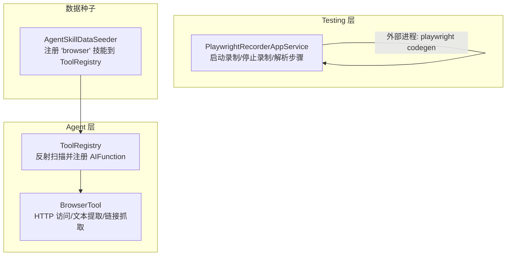
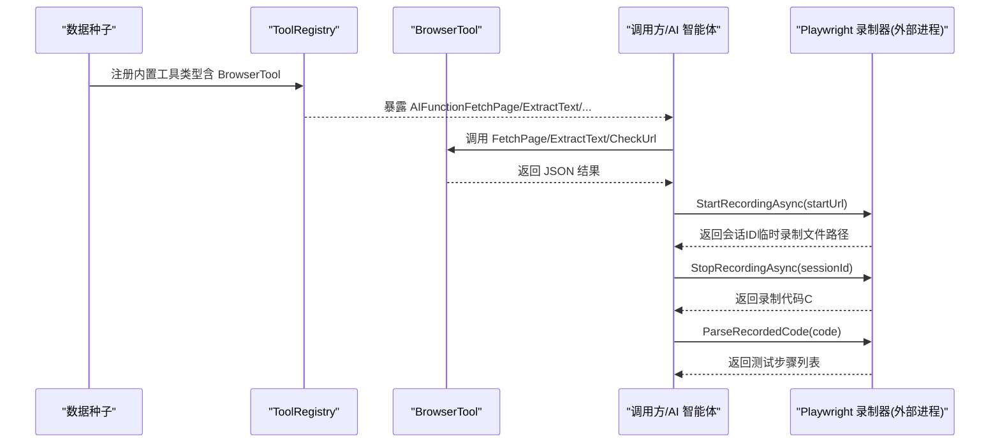
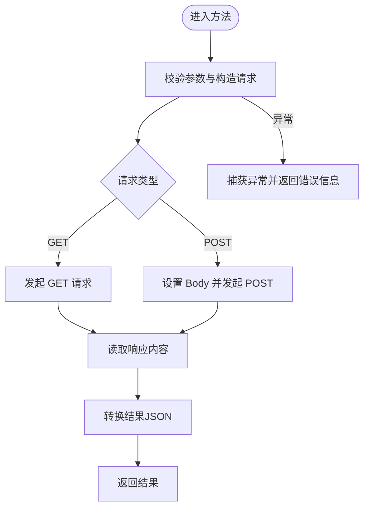
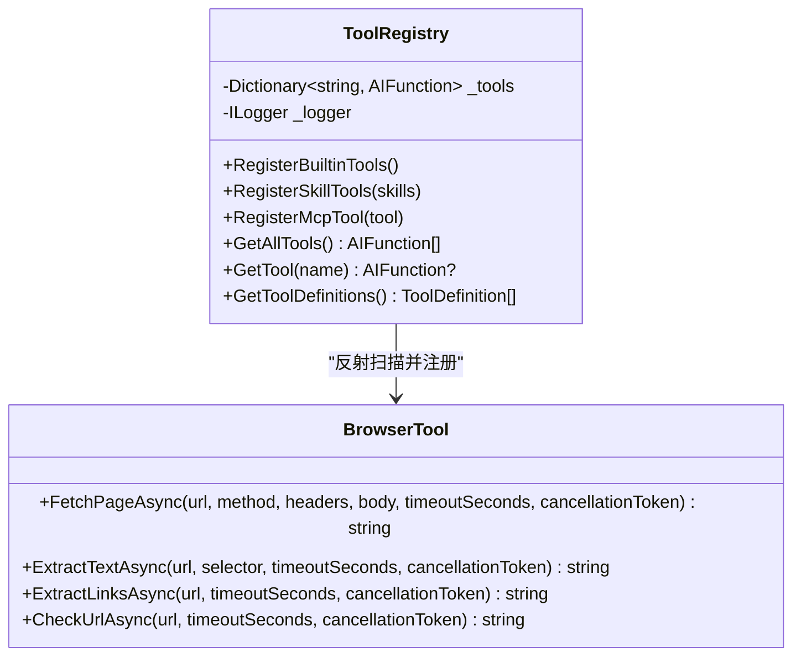
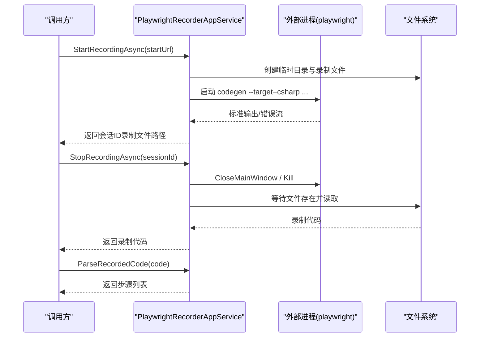
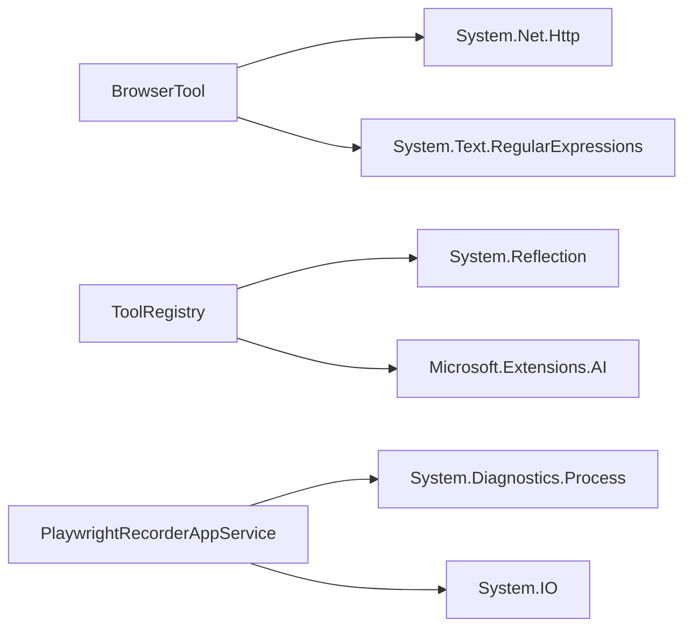

# 浏览器工具

<cite>
**本文引用的文件**   
- [BrowserTool.cs](file://src/Agent/Assistant/H.Assistant.Core/Tools/BrowserTool.cs)
- [ToolRegistry.cs](file://src/Agent/Assistant/H.Assistant.Core/Tools/ToolRegistry.cs)
- [PlaywrightRecorderAppService.cs](file://src/Services/Testing/H.Testing.Application/Services/PlaywrightRecorderAppService.cs)
- [AgentSkillDataSeeder.cs](file://src/Agent/Assistant/H.Assistant.Application/Data/AgentSkillDataSeeder.cs)
</cite>

## 目录
1. [简介](#简介)
2. [项目结构](#项目结构)
3. [核心组件](#核心组件)
4. [架构总览](#架构总览)
5. [详细组件分析](#详细组件分析)
6. [依赖关系分析](#依赖关系分析)
7. [性能考量](#性能考量)
8. [故障排查指南](#故障排查指南)
9. [结论](#结论)
10. [附录：API 与使用示例](#附录api-与使用示例)

## 简介
本文件为“浏览器工具”的完整技术文档，聚焦于以下能力：
- 页面访问与内容提取（HTTP 方式）
- 链接抓取与可用性检查
- Playwright 录制与代码生成（用于自动化测试脚本生成）
- 工具注册与 AI 函数暴露（供智能体调用）
- 浏览器实例生命周期管理（录制器进程与资源清理）
- 兼容性处理与异常策略

说明：当前仓库中的“浏览器工具”主要提供两类能力：
- 轻量级 HTTP 网页访问与文本/链接提取（BrowserTool）
- 基于 Playwright 的录制器服务（PlaywrightRecorderAppService），用于生成 C# 自动化脚本

注意：当前实现未包含完整的无头浏览器控制（如截图、元素点击、表单填写等直接操作）。如需这些能力，可基于现有录制器或扩展 BrowserTool 进行增强。

## 项目结构
与浏览器工具相关的核心位置如下：
- Agent 层：工具定义与注册（BrowserTool、ToolRegistry）
- Testing 层：Playwright 录制服务（PlaywrightRecorderAppService）
- 数据种子：技能注册（AgentSkillDataSeeder）

图表来源
- [BrowserTool.cs:1-278](file://src/Agent/Assistant/H.Assistant.Core/Tools/BrowserTool.cs#L1-L278)
- [ToolRegistry.cs:1-204](file://src/Agent/Assistant/H.Assistant.Core/Tools/ToolRegistry.cs#L1-L204)
- [PlaywrightRecorderAppService.cs:1-556](file://src/Services/Testing/H.Testing.Application/Services/PlaywrightRecorderAppService.cs#L1-L556)
- [AgentSkillDataSeeder.cs:39-43](file://src/Agent/Assistant/H.Assistant.Application/Data/AgentSkillDataSeeder.cs#L39-L43)

章节来源
- [BrowserTool.cs:1-278](file://src/Agent/Assistant/H.Assistant.Core/Tools/BrowserTool.cs#L1-L278)
- [ToolRegistry.cs:1-204](file://src/Agent/Assistant/H.Assistant.Core/Tools/ToolRegistry.cs#L1-L204)
- [PlaywrightRecorderAppService.cs:1-556](file://src/Services/Testing/H.Testing.Application/Services/PlaywrightRecorderAppService.cs#L1-L556)
- [AgentSkillDataSeeder.cs:39-43](file://src/Agent/Assistant/H.Assistant.Application/Data/AgentSkillDataSeeder.cs#L39-L43)

## 核心组件
- BrowserTool：提供静态方法封装 HTTP 请求、HTML 转文本、链接提取、URL 可达性检查。所有方法均支持超时与取消令牌，返回结构化 JSON 字符串。
- ToolRegistry：通过反射扫描带描述属性的公共静态方法，将其包装为 AIFunction 并注册，供 AI 智能体调用。
- PlaywrightRecorderAppService：以外部进程方式启动 Playwright CLI 进行录制，输出 C# 代码；支持解析录制的代码行，转换为测试步骤模型。

章节来源
- [BrowserTool.cs:1-278](file://src/Agent/Assistant/H.Assistant.Core/Tools/BrowserTool.cs#L1-L278)
- [ToolRegistry.cs:1-204](file://src/Agent/Assistant/H.Assistant.Core/Tools/ToolRegistry.cs#L1-L204)
- [PlaywrightRecorderAppService.cs:1-556](file://src/Services/Testing/H.Testing.Application/Services/PlaywrightRecorderAppService.cs#L1-L556)

## 架构总览
下图展示从“技能注册”到“AI 函数暴露”，再到“录制器进程”的整体交互。

图表来源
- [AgentSkillDataSeeder.cs:39-43](file://src/Agent/Assistant/H.Assistant.Application/Data/AgentSkillDataSeeder.cs#L39-L43)
- [ToolRegistry.cs:1-204](file://src/Agent/Assistant/H.Assistant.Core/Tools/ToolRegistry.cs#L1-L204)
- [BrowserTool.cs:1-278](file://src/Agent/Assistant/H.Assistant.Core/Tools/BrowserTool.cs#L1-L278)
- [PlaywrightRecorderAppService.cs:1-556](file://src/Services/Testing/H.Testing.Application/Services/PlaywrightRecorderAppService.cs#L1-L556)

## 详细组件分析

### BrowserTool：HTTP 网页访问与内容提取
- 功能要点
  - FetchPageAsync：支持 GET/POST、自定义请求头、超时与取消令牌，返回状态码、描述、内容与最终 URL。
  - ExtractTextAsync：获取 HTML 并简单转为文本（移除 script/style、标签与实体解码），可选 CSS 选择器提示（当前为占位逻辑）。
  - ExtractLinksAsync：正则提取 href，自动转为绝对 URL，限制返回数量。
  - CheckUrlAsync：HEAD 请求检测 URL 可达性。
- 设计模式与复杂度
  - 单例 HttpClient（启用自动解压、重定向、Cookie 容器），默认 User-Agent 模拟主流浏览器。
  - 时间复杂度：文本提取 O(n)，链接提取 O(n)（n 为 HTML 长度）。
  - 空间复杂度：O(n) 存储 HTML 与结果集合。
- 错误处理
  - 统一 try/catch，失败时返回结构化错误消息；CheckUrlAsync 返回 Success=false 与 Error 字段。
- 可扩展点
  - 引入 HTML 解析库（如 AngleSharp）以实现精确 CSS 选择器与 DOM 操作。
  - 增加截图、滚动、等待、元素定位等操作（需切换至无头浏览器方案）。

图表来源
- [BrowserTool.cs:31-89](file://src/Agent/Assistant/H.Assistant.Core/Tools/BrowserTool.cs#L31-L89)
- [BrowserTool.cs:91-136](file://src/Agent/Assistant/H.Assistant.Core/Tools/BrowserTool.cs#L91-L136)
- [BrowserTool.cs:138-176](file://src/Agent/Assistant/H.Assistant.Core/Tools/BrowserTool.cs#L138-L176)
- [BrowserTool.cs:178-222](file://src/Agent/Assistant/H.Assistant.Core/Tools/BrowserTool.cs#L178-L222)

章节来源
- [BrowserTool.cs:1-278](file://src/Agent/Assistant/H.Assistant.Core/Tools/BrowserTool.cs#L1-L278)

### ToolRegistry：工具注册与 AI 函数暴露
- 功能要点
  - 反射扫描指定类型中带有 Description 属性的公共静态方法，包装为 AIFunction 并注册。
  - 支持从技能定义动态注册（按 ImplementationClass 加载类型并扫描方法）。
  - 提供 GetAllTools、GetTool、GetToolDefinitions 等方法供上层使用。
- 设计模式与复杂度
  - 反射 + 工厂模式（AIFunctionFactory.Create），将 .NET 方法映射为 AI 可调用的函数。
  - 时间复杂度：注册阶段 O(m)（m 为方法数），查询 O(1)。
- 错误处理
  - 注册失败记录警告日志，不影响整体注册流程。

图表来源
- [ToolRegistry.cs:1-204](file://src/Agent/Assistant/H.Assistant.Core/Tools/ToolRegistry.cs#L1-L204)
- [BrowserTool.cs:1-278](file://src/Agent/Assistant/H.Assistant.Core/Tools/BrowserTool.cs#L1-L278)

章节来源
- [ToolRegistry.cs:1-204](file://src/Agent/Assistant/H.Assistant.Core/Tools/ToolRegistry.cs#L1-L204)

### PlaywrightRecorderAppService：录制器与步骤解析
- 功能要点
  - StartRecordingAsync：创建临时目录与录制文件，构建命令行参数（viewport-size、timeout、ignore-https-errors），启动外部进程（node.exe 或全局 playwright）。
  - StopRecordingAsync：优雅关闭进程，等待文件写入完成，读取录制代码并清理临时文件。
  - ParseRecordedCode：逐行解析录制代码，识别导航、点击、输入、选择、等待、断言等模式，转换为测试步骤模型。
  - GetSelectorType：根据选择器前缀判断类型（id、css、xpath、text）。
- 设计模式与复杂度
  - 进程管理与异步 I/O（StandardOutput/Error 流读取），超时与重试策略。
  - 时间复杂度：解析 O(k)（k 为代码行数）。
- 错误处理
  - 进程启动失败、退出码异常、文件不存在等情况均有日志与异常抛出。

图表来源
- [PlaywrightRecorderAppService.cs:34-165](file://src/Services/Testing/H.Testing.Application/Services/PlaywrightRecorderAppService.cs#L34-L165)
- [PlaywrightRecorderAppService.cs:172-256](file://src/Services/Testing/H.Testing.Application/Services/PlaywrightRecorderAppService.cs#L172-L256)
- [PlaywrightRecorderAppService.cs:263-490](file://src/Services/Testing/H.Testing.Application/Services/PlaywrightRecorderAppService.cs#L263-L490)

章节来源
- [PlaywrightRecorderAppService.cs:1-556](file://src/Services/Testing/H.Testing.Application/Services/PlaywrightRecorderAppService.cs#L1-L556)

### 概念性概览：浏览器自动化能力矩阵
- 已实现
  - HTTP 访问与内容提取（BrowserTool）
  - URL 可达性检查（BrowserTool）
  - 录制器进程启动与代码生成（PlaywrightRecorderAppService）
  - 录制代码解析为测试步骤（PlaywrightRecorderAppService）
- 待扩展（建议）
  - 无头浏览器控制（打开/关闭浏览器、页面导航、等待、截图）
  - 元素定位与操作（点击、输入、选择、拖拽）
  - 表单填写与文件上传
  - 跨域与认证 Cookie 同步
  - 并发与资源池管理

[本节为概念性内容，不直接分析具体文件]

## 依赖关系分析
- BrowserTool 依赖系统网络栈（HttpClient）与正则表达式。
- ToolRegistry 依赖反射与 Microsoft.Extensions.AI（AIFunctionFactory）。
- PlaywrightRecorderAppService 依赖外部进程（playwright/codegen）与文件系统。

图表来源
- [BrowserTool.cs:1-278](file://src/Agent/Assistant/H.Assistant.Core/Tools/BrowserTool.cs#L1-L278)
- [ToolRegistry.cs:1-204](file://src/Agent/Assistant/H.Assistant.Core/Tools/ToolRegistry.cs#L1-L204)
- [PlaywrightRecorderAppService.cs:1-556](file://src/Services/Testing/H.Testing.Application/Services/PlaywrightRecorderAppService.cs#L1-L556)

章节来源
- [BrowserTool.cs:1-278](file://src/Agent/Assistant/H.Assistant.Core/Tools/BrowserTool.cs#L1-L278)
- [ToolRegistry.cs:1-204](file://src/Agent/Assistant/H.Assistant.Core/Tools/ToolRegistry.cs#L1-L204)
- [PlaywrightRecorderAppService.cs:1-556](file://src/Services/Testing/H.Testing.Application/Services/PlaywrightRecorderAppService.cs#L1-L556)

## 性能考量
- HttpClient 复用：BrowserTool 使用静态 HttpClient，减少连接开销。
- 超时与取消：所有异步方法支持超时与取消令牌，避免长时间阻塞。
- 文本与链接提取：采用正则表达式，适合快速处理；若需复杂 DOM 操作，建议引入专用解析库。
- 录制器进程：外部进程启动有延迟，建议缓存进程或复用会话；输出流异步读取避免阻塞。
- 内存占用：大页面内容截取（如 10000 字符限制）防止内存膨胀。

[本节为通用指导，不直接分析具体文件]

## 故障排查指南
- 无法访问目标 URL
  - 检查网络连通性与代理设置；确认 TimeoutSeconds 是否过小。
  - 查看 BrowserTool 返回的错误消息与状态码。
- 录制器启动失败
  - 确认 playwright 可执行文件路径（本地 node.exe 或全局 playwright）。
  - 检查临时目录权限与磁盘空间；查看标准错误流日志。
- 录制文件未生成
  - 确认进程是否正常退出；适当延长等待时间；检查文件是否存在。
- 解析录制代码为空
  - 检查录制代码格式是否符合预期（GotoAsync、ClickAsync、FillAsync 等模式）。
  - 查看解析日志与正则匹配结果。

章节来源
- [BrowserTool.cs:85-89](file://src/Agent/Assistant/H.Assistant.Core/Tools/BrowserTool.cs#L85-L89)
- [BrowserTool.cs:132-136](file://src/Agent/Assistant/H.Assistant.Core/Tools/BrowserTool.cs#L132-L136)
- [BrowserTool.cs:172-176](file://src/Agent/Assistant/H.Assistant.Core/Tools/BrowserTool.cs#L172-L176)
- [BrowserTool.cs:209-222](file://src/Agent/Assistant/H.Assistant.Core/Tools/BrowserTool.cs#L209-L222)
- [PlaywrightRecorderAppService.cs:160-165](file://src/Services/Testing/H.Testing.Application/Services/PlaywrightRecorderAppService.cs#L160-L165)
- [PlaywrightRecorderAppService.cs:176-256](file://src/Services/Testing/H.Testing.Application/Services/PlaywrightRecorderAppService.cs#L176-L256)
- [PlaywrightRecorderAppService.cs:263-490](file://src/Services/Testing/H.Testing.Application/Services/PlaywrightRecorderAppService.cs#L263-L490)

## 结论
当前仓库提供了两种互补的浏览器相关能力：
- 轻量级 HTTP 网页访问与内容提取（BrowserTool），适合快速抓取与检查。
- Playwright 录制器服务（PlaywrightRecorderAppService），用于生成自动化测试脚本。

若需要更完整的浏览器自动化（截图、元素操作、表单填写、文件上传等），建议在现有基础上扩展无头浏览器控制能力，并结合 ToolRegistry 暴露为 AI 可调用的工具函数。

[本节为总结性内容，不直接分析具体文件]

## 附录：API 与使用示例

### BrowserTool API
- FetchPageAsync(url, method="GET", headers=null, body=null, timeoutSeconds=30, cancellationToken=default)
  - 用途：访问网页并获取内容，支持 GET/POST 与自定义请求头。
  - 返回：JSON 字符串，包含 StatusCode、StatusDescription、Content、Url。
- ExtractTextAsync(url, selector=null, timeoutSeconds=30, cancellationToken=default)
  - 用途：提取网页文本内容，selector 为可选 CSS 选择器（当前为占位逻辑）。
  - 返回：JSON 字符串，包含 Success、Text、Url。
- ExtractLinksAsync(url, timeoutSeconds=30, cancellationToken=default)
  - 用途：提取网页链接列表，限制返回数量。
  - 返回：JSON 字符串，包含 Success、LinkCount、Links、Url。
- CheckUrlAsync(url, timeoutSeconds=10, cancellationToken=default)
  - 用途：检查 URL 是否可访问（HEAD 请求）。
  - 返回：JSON 字符串，包含 Success、StatusCode、StatusDescription、Url。

章节来源
- [BrowserTool.cs:31-89](file://src/Agent/Assistant/H.Assistant.Core/Tools/BrowserTool.cs#L31-L89)
- [BrowserTool.cs:91-136](file://src/Agent/Assistant/H.Assistant.Core/Tools/BrowserTool.cs#L91-L136)
- [BrowserTool.cs:138-176](file://src/Agent/Assistant/H.Assistant.Core/Tools/BrowserTool.cs#L138-L176)
- [BrowserTool.cs:178-222](file://src/Agent/Assistant/H.Assistant.Core/Tools/BrowserTool.cs#L178-L222)

### PlaywrightRecorderAppService API
- StartRecordingAsync(startUrl="")
  - 用途：启动 Playwright 录制器，返回会话ID（临时录制文件路径）。
  - 返回：StartRecordingResponse（SessionId、IsSuccess、Message）。
- StopRecordingAsync(sessionId)
  - 用途：停止录制，读取并清理临时文件，返回录制代码。
  - 返回：StopRecordingResponse（RecordedCode、IsSuccess、Message）。
- ParseRecordedCode(recordedCode)
  - 用途：解析录制代码为测试步骤列表。
  - 返回：List<ProjectCaseStep>。

章节来源
- [PlaywrightRecorderAppService.cs:34-165](file://src/Services/Testing/H.Testing.Application/Services/PlaywrightRecorderAppService.cs#L34-L165)
- [PlaywrightRecorderAppService.cs:172-256](file://src/Services/Testing/H.Testing.Application/Services/PlaywrightRecorderAppService.cs#L172-L256)
- [PlaywrightRecorderAppService.cs:263-490](file://src/Services/Testing/H.Testing.Application/Services/PlaywrightRecorderAppService.cs#L263-L490)

### 使用示例（概念性）
- 访问网页并提取文本
  - 调用 BrowserTool.FetchPageAsync("https://example.com", "GET")
  - 调用 BrowserTool.ExtractTextAsync("https://example.com")
- 检查 URL 可达性
  - 调用 BrowserTool.CheckUrlAsync("https://example.com", timeoutSeconds=10)
- 启动录制并生成脚本
  - 调用 PlaywrightRecorderAppService.StartRecordingAsync("https://example.com")
  - 在录制窗口中进行操作后，调用 StopRecordingAsync(sessionId)
  - 调用 ParseRecordedCode(recordedCode) 得到测试步骤

[本节为概念性示例，不直接分析具体文件]