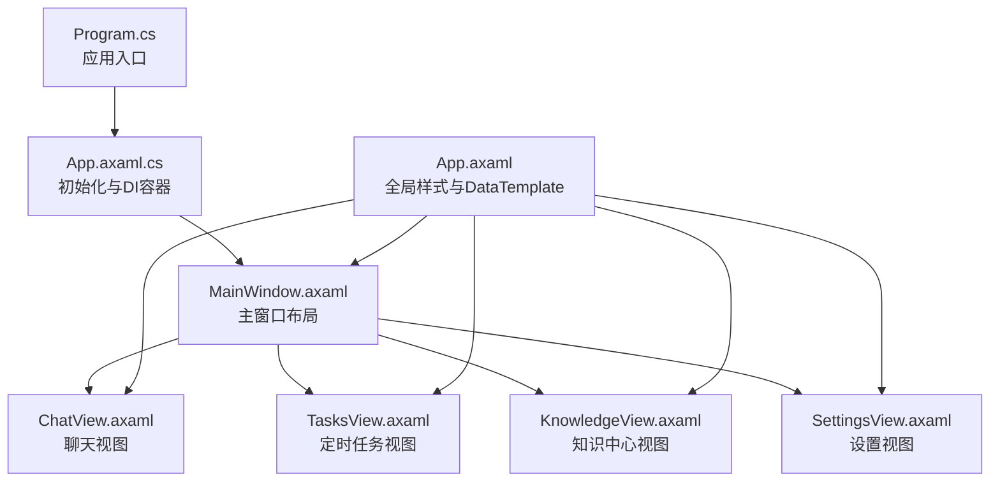
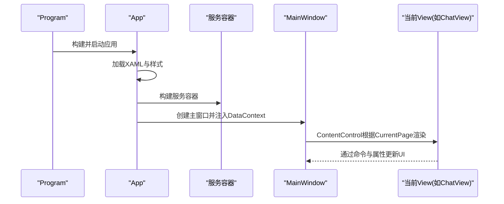
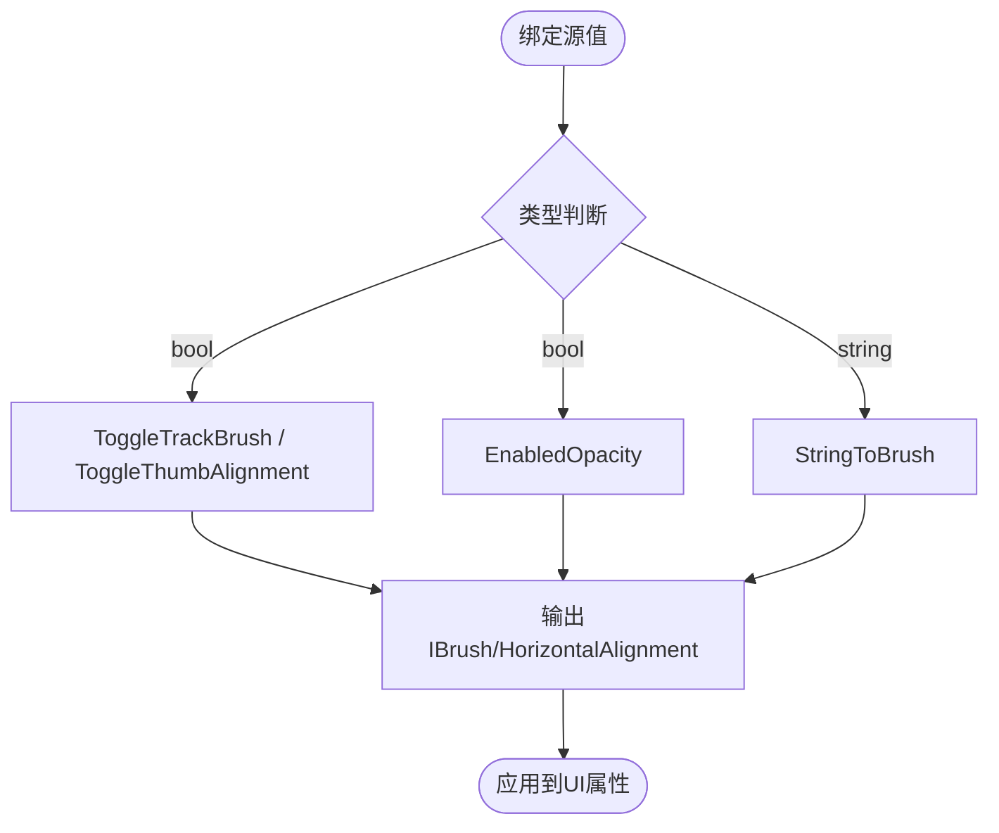
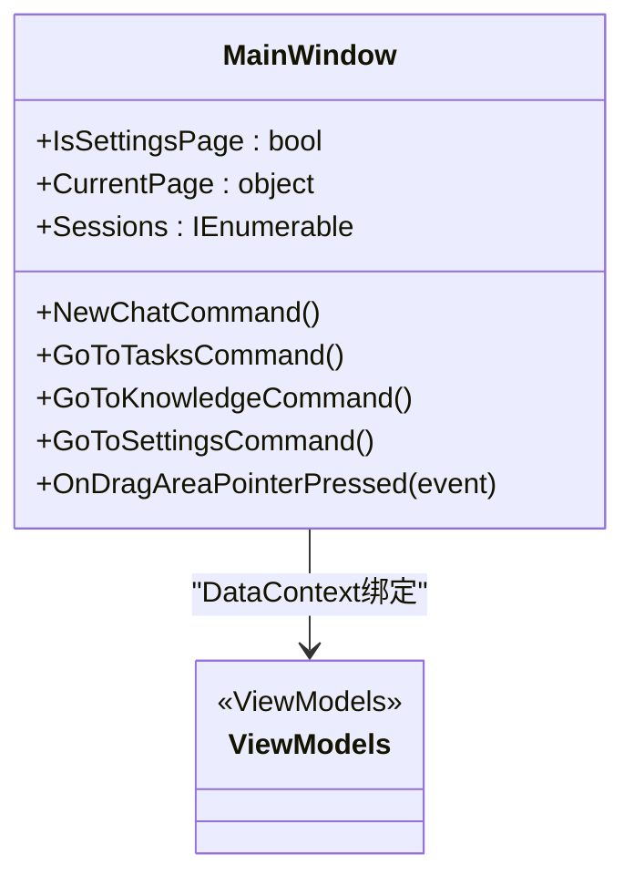
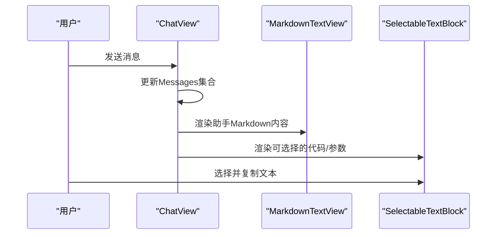
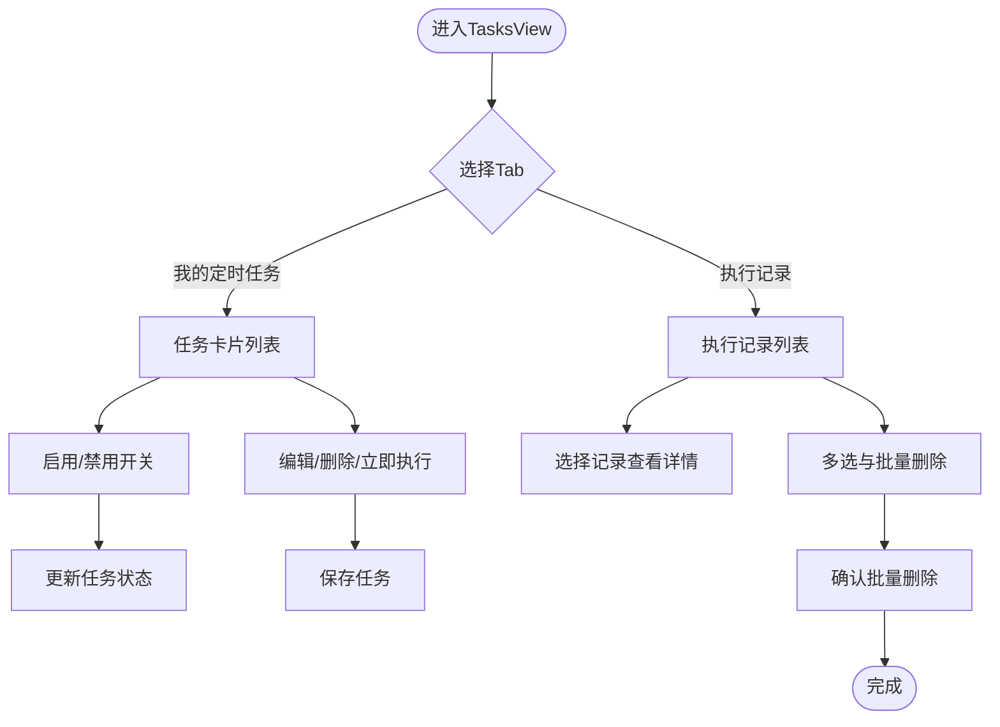
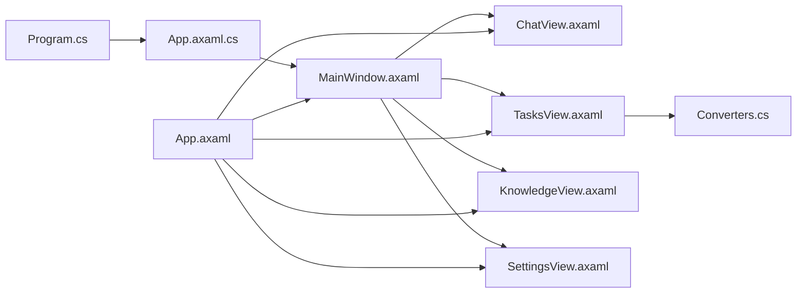

# UI界面组件

<cite>
**本文引用的文件**   
- [Program.cs](file://src/Agent/Assistant/H.Assistant.Desktop/Program.cs)
- [App.axaml.cs](file://src/Agent/Assistant/H.Assistant.Desktop/App.axaml.cs)
- [App.axaml](file://src/Agent/Assistant/H.Assistant.Desktop/App.axaml)
- [MainWindow.axaml](file://src/Agent/Assistant/H.Assistant.Desktop/Views/MainWindow.axaml)
- [ChatView.axaml](file://src/Agent/Assistant/H.Assistant.Desktop/Views/ChatView.axaml)
- [TasksView.axaml](file://src/Agent/Assistant/H.Assistant.Desktop/Views/TasksView.axaml)
- [KnowledgeView.axaml](file://src/Agent/Assistant/H.Assistant.Desktop/Views/KnowledgeView.axaml)
- [SettingsView.axaml](file://src/Agent/Assistant/H.Assistant.Desktop/Views/SettingsView.axaml)
- [Converters.cs](file://src/Agent/Assistant/H.Assistant.Desktop/Converters.cs)
</cite>

## 目录
1. [简介](#简介)
2. [项目结构](#项目结构)
3. [核心组件](#核心组件)
4. [架构总览](#架构总览)
5. [详细组件分析](#详细组件分析)
6. [依赖关系分析](#依赖关系分析)
7. [性能考量](#性能考量)
8. [故障排查指南](#故障排查指南)
9. [结论](#结论)
10. [附录](#附录)

## 简介
本文件面向桌面端应用的UI界面组件，基于Avalonia XAML进行说明。内容涵盖：
- 各View的实现与布局结构（主窗口、聊天、任务、知识中心、设置）
- 自定义控件MarkdownTextView的使用方式与渲染场景
- 数据转换器Converters的作用与实现
- 响应式设计与主题适配（浅色/深色、字体、样式）
- 用户交互处理与事件绑定（命令、拖拽、菜单、对话框）
- 界面定制与样式扩展指南（全局样式、局部样式、类选择器）

## 项目结构
该桌面应用采用Avalonia框架，入口程序负责构建并启动应用生命周期；App负责加载XAML资源、注册样式与DataTemplate，并创建主窗口及其DataContext；Views目录下为各页面UserControl或Window的XAML定义，ViewModel通过依赖注入提供。

图表来源 
- [Program.cs:1-20](file://src/Agent/Assistant/H.Assistant.Desktop/Program.cs#L1-L20)
- [App.axaml.cs:1-37](file://src/Agent/Assistant/H.Assistant.Desktop/App.axaml.cs#L1-L37)
- [App.axaml:1-286](file://src/Agent/Assistant/H.Assistant.Desktop/App.axaml#L1-L286)
- [MainWindow.axaml:1-191](file://src/Agent/Assistant/H.Assistant.Desktop/Views/MainWindow.axaml#L1-L191)
- [ChatView.axaml:1-184](file://src/Agent/Assistant/H.Assistant.Desktop/Views/ChatView.axaml#L1-L184)
- [TasksView.axaml:1-381](file://src/Agent/Assistant/H.Assistant.Desktop/Views/TasksView.axaml#L1-L381)
- [KnowledgeView.axaml:1-46](file://src/Agent/Assistant/H.Assistant.Desktop/Views/KnowledgeView.axaml#L1-L46)
- [SettingsView.axaml:1-94](file://src/Agent/Assistant/H.Assistant.Desktop/Views/SettingsView.axaml#L1-L94)

章节来源
- [Program.cs:1-20](file://src/Agent/Assistant/H.Assistant.Desktop/Program.cs#L1-L20)
- [App.axaml.cs:1-37](file://src/Agent/Assistant/H.Assistant.Desktop/App.axaml.cs#L1-L37)
- [App.axaml:1-286](file://src/Agent/Assistant/H.Assistant.Desktop/App.axaml#L1-L286)

## 核心组件
- 应用入口与生命周期
  - Program负责构建Avalonia应用并启动经典桌面生命周期。
  - App在OnFrameworkInitializationCompleted中构建服务容器，创建MainWindow并注入其DataContext。
- 全局样式与模板
  - App.axaml集中定义FluentTheme基础样式、按钮、标签、表单、卡片、Tab项等通用样式，并通过DataTemplate将ViewModel映射到对应View。
- 主窗口布局
  - MainWindow.axaml使用Grid划分侧栏与内容区，ContentControl承载当前页面；支持无标题栏扩展与OffScreenMargin修正。
- 聊天视图
  - ChatView.axaml包含头部拖拽区、消息列表、输入区、ReAct步骤可视化与流式回复展示，使用自定义MarkdownTextView渲染富文本。
- 定时任务视图
  - TasksView.axaml包含Tab切换、任务卡片网格、执行记录左右分栏、多选批量删除确认对话框，以及任务创建/编辑模态框。
- 知识中心视图
  - KnowledgeView.axaml以Tab切换知识库与记忆两个子页，通过ContentControl动态显示。
- 设置视图
  - SettingsView.axaml左侧菜单导航，右侧按模块显示通用设置与子设置页（模型、智能体、MCP、技能）。

章节来源
- [App.axaml.cs:1-37](file://src/Agent/Assistant/H.Assistant.Desktop/App.axaml.cs#L1-L37)
- [App.axaml:1-286](file://src/Agent/Assistant/H.Assistant.Desktop/App.axaml#L1-L286)
- [MainWindow.axaml:1-191](file://src/Agent/Assistant/H.Assistant.Desktop/Views/MainWindow.axaml#L1-L191)
- [ChatView.axaml:1-184](file://src/Agent/Assistant/H.Assistant.Desktop/Views/ChatView.axaml#L1-L184)
- [TasksView.axaml:1-381](file://src/Agent/Assistant/H.Assistant.Desktop/Views/TasksView.axaml#L1-L381)
- [KnowledgeView.axaml:1-46](file://src/Agent/Assistant/H.Assistant.Desktop/Views/KnowledgeView.axaml#L1-L46)
- [SettingsView.axaml:1-94](file://src/Agent/Assistant/H.Assistant.Desktop/Views/SettingsView.axaml#L1-L94)

## 架构总览
整体采用MVVM模式：XAML仅声明结构与样式，业务逻辑由ViewModel驱动，数据通过Binding与Converter转换，事件通过Command与Pointer事件处理。

图表来源 
- [Program.cs:1-20](file://src/Agent/Assistant/H.Assistant.Desktop/Program.cs#L1-L20)
- [App.axaml.cs:1-37](file://src/Agent/Assistant/H.Assistant.Desktop/App.axaml.cs#L1-L37)
- [MainWindow.axaml:1-191](file://src/Agent/Assistant/H.Assistant.Desktop/Views/MainWindow.axaml#L1-L191)
- [ChatView.axaml:1-184](file://src/Agent/Assistant/H.Assistant.Desktop/Views/ChatView.axaml#L1-L184)

## 详细组件分析

### MarkdownTextView自定义控件
- 用途：在聊天消息、ReAct思考过程、执行结果等处渲染Markdown文本，提升可读性。
- 使用位置：
  - 助手消息气泡内渲染Markdown内容
  - ReAct步骤中的“思考中”内容
  - 执行记录的Markdown结果
- 特点：
  - 作为UserControl被引用，避免重复实现解析与渲染逻辑
  - 与SelectableTextBlock配合，便于复制富文本内容

章节来源
- [ChatView.axaml:1-184](file://src/Agent/Assistant/H.Assistant.Desktop/Views/ChatView.axaml#L1-L184)
- [TasksView.axaml:1-381](file://src/Agent/Assistant/H.Assistant.Desktop/Views/TasksView.axaml#L1-L381)

### 数据转换器Converters
- ToggleTrackBrush：根据布尔值切换开关轨道颜色（开/关）
- ToggleThumbAlignment：根据布尔值切换滑块对齐（左/右）
- EnabledOpacity：根据启用状态调整透明度（禁用时降低不透明度）
- StringToBrush：将字符串颜色值转换为画刷，空值回退默认色

图表来源 
- [Converters.cs:1-31](file://src/Agent/Assistant/H.Assistant.Desktop/Converters.cs#L1-L31)

章节来源
- [Converters.cs:1-31](file://src/Agent/Assistant/H.Assistant.Desktop/Converters.cs#L1-L31)
- [TasksView.axaml:1-381](file://src/Agent/Assistant/H.Assistant.Desktop/Views/TasksView.axaml#L1-L381)

### 主窗口MainWindow
- 布局结构：
  - Grid两列：左侧会话侧栏（DockPanel），右侧内容区（ContentControl）
  - 顶部新建会话按钮兼作拖拽区域，底部用户信息与设置菜单
  - 会话列表ItemsControl，支持选中高亮与删除操作
  - Toast提示浮层
- 交互与事件：
  - PointerPressed用于窗口拖拽
  - Command绑定导航与新建会话
  - MenuFlyout提供上下文菜单

图表来源 
- [MainWindow.axaml:1-191](file://src/Agent/Assistant/H.Assistant.Desktop/Views/MainWindow.axaml#L1-L191)

章节来源
- [MainWindow.axaml:1-191](file://src/Agent/Assistant/H.Assistant.Desktop/Views/MainWindow.axaml#L1-L191)

### 聊天视图ChatView
- 布局结构：
  - DockPanel：顶部头部（拖拽）、中部消息ScrollViewer、底部输入区
  - ItemsControl渲染消息列表，区分用户与助手消息气泡
  - ReAct步骤可视化：思考中、工具调用、最终回答
  - 纯流式回复展示
- 交互与事件：
  - Header拖拽移动窗口
  - MarkdownTextView渲染富文本
  - SelectableTextBlock支持文本选择与复制

图表来源 
- [ChatView.axaml:1-184](file://src/Agent/Assistant/H.Assistant.Desktop/Views/ChatView.axaml#L1-L184)

章节来源
- [ChatView.axaml:1-184](file://src/Agent/Assistant/H.Assistant.Desktop/Views/ChatView.axaml#L1-L184)

### 定时任务视图TasksView
- 布局结构：
  - Tab切换“我的定时任务”与“执行记录”
  - 任务卡片UniformGrid两列布局，支持启用开关、更多操作菜单
  - 执行记录左右分栏：左侧摘要列表，右侧详情面板
  - 任务创建/编辑模态框，含时间配置与Cron表达式
  - 批量删除确认对话框
- 交互与事件：
  - SwitchTabCommand切换Tab
  - ToggleEnableCommand启用/禁用任务
  - 多选模式下的批量删除流程

图表来源 
- [TasksView.axaml:1-381](file://src/Agent/Assistant/H.Assistant.Desktop/Views/TasksView.axaml#L1-L381)

章节来源
- [TasksView.axaml:1-381](file://src/Agent/Assistant/H.Assistant.Desktop/Views/TasksView.axaml#L1-L381)

### 知识中心视图KnowledgeView
- 布局结构：
  - Tab切换“知识库”与“记忆”
  - ContentControl根据当前Tab显示对应子视图
- 交互与事件：
  - SwitchTabCommand切换Tab

章节来源
- [KnowledgeView.axaml:1-46](file://src/Agent/Assistant/H.Assistant.Desktop/Views/KnowledgeView.axaml#L1-L46)

### 设置视图SettingsView
- 布局结构：
  - 左侧菜单ItemsControl，右侧内容区按模块显示
  - 通用设置：主题模式（浅色/深色）、界面语言（中文/英文）
  - 子设置页：模型、智能体、MCP、技能
- 交互与事件：
  - NavigateCommand导航到不同设置页
  - SetThemeModeCommand/SetLanguageCommand更新主题与语言

章节来源
- [SettingsView.axaml:1-94](file://src/Agent/Assistant/H.Assistant.Desktop/Views/SettingsView.axaml#L1-L94)

## 依赖关系分析
- 入口依赖：
  - Program依赖Avalonia框架，构建App并启动
  - App依赖ClientServices构建服务容器，创建MainWindow并注入DataContext
- 视图依赖：
  - MainWindow依赖多个View（ChatView、TasksView、KnowledgeView、SettingsView）
  - ChatView依赖MarkdownTextView与SelectableTextBlock
  - TasksView依赖Converters进行数据转换
- 样式依赖：
  - App.axaml集中定义全局样式，各View可通过Classes复用样式

图表来源 
- [Program.cs:1-20](file://src/Agent/Assistant/H.Assistant.Desktop/Program.cs#L1-L20)
- [App.axaml.cs:1-37](file://src/Agent/Assistant/H.Assistant.Desktop/App.axaml.cs#L1-L37)
- [App.axaml:1-286](file://src/Agent/Assistant/H.Assistant.Desktop/App.axaml#L1-L286)
- [MainWindow.axaml:1-191](file://src/Agent/Assistant/H.Assistant.Desktop/Views/MainWindow.axaml#L1-L191)
- [ChatView.axaml:1-184](file://src/Agent/Assistant/H.Assistant.Desktop/Views/ChatView.axaml#L1-L184)
- [TasksView.axaml:1-381](file://src/Agent/Assistant/H.Assistant.Desktop/Views/TasksView.axaml#L1-L381)
- [KnowledgeView.axaml:1-46](file://src/Agent/Assistant/H.Assistant.Desktop/Views/KnowledgeView.axaml#L1-L46)
- [SettingsView.axaml:1-94](file://src/Agent/Assistant/H.Assistant.Desktop/Views/SettingsView.axaml#L1-L94)
- [Converters.cs:1-31](file://src/Agent/Assistant/H.Assistant.Desktop/Converters.cs#L1-L31)

章节来源
- [Program.cs:1-20](file://src/Agent/Assistant/H.Assistant.Desktop/Program.cs#L1-L20)
- [App.axaml.cs:1-37](file://src/Agent/Assistant/H.Assistant.Desktop/App.axaml.cs#L1-L37)
- [App.axaml:1-286](file://src/Agent/Assistant/H.Assistant.Desktop/App.axaml#L1-L286)

## 性能考量
- 列表渲染优化：
  - 使用ItemsControl与DataTemplate，避免手动管理大量UI元素
  - 对长列表考虑虚拟化（Avalonia默认支持）
- 文本渲染：
  - MarkdownTextView仅在需要时渲染，避免频繁重建
  - SelectableTextBlock用于代码片段，减少不必要的富文本开销
- 样式与主题：
  - 全局样式集中管理，减少重复定义
  - 主题切换通过FluentTheme与RequestedThemeVariant控制，避免运行时重绘过多元素

[本节为通用指导，无需特定文件来源]

## 故障排查指南
- 主题与样式问题：
  - 检查App.axaml中FluentTheme是否加载
  - 确认Classes命名与Selector匹配
- 数据绑定失效：
  - 检查ViewModel属性是否正确实现INotifyPropertyChanged
  - 验证Converter输入类型与返回值类型
- 事件未触发：
  - 确认PointerPressed或Command绑定正确
  - 检查IsHitTestVisible与可见性影响
- Markdown渲染异常：
  - 确保MarkdownTextView已正确引用
  - 检查Markdown内容格式合法性

章节来源
- [App.axaml:1-286](file://src/Agent/Assistant/H.Assistant.Desktop/App.axaml#L1-L286)
- [Converters.cs:1-31](file://src/Agent/Assistant/H.Assistant.Desktop/Converters.cs#L1-L31)
- [MainWindow.axaml:1-191](file://src/Agent/Assistant/H.Assistant.Desktop/Views/MainWindow.axaml#L1-L191)
- [ChatView.axaml:1-184](file://src/Agent/Assistant/H.Assistant.Desktop/Views/ChatView.axaml#L1-L184)

## 结论
本UI组件体系基于Avalonia XAML与MVVM模式，通过集中样式管理、自定义控件与数据转换器，实现了清晰的职责分离与良好的可扩展性。主窗口与各视图通过ContentControl与DataTemplate灵活组合，支持丰富的用户交互与主题适配。建议在后续开发中继续遵循现有模式，保持样式与逻辑的解耦，提升可维护性与用户体验。

[本节为总结性内容，无需特定文件来源]

## 附录
- 界面定制与样式扩展指南：
  - 在全局样式App.axaml中添加新Classes，供各View复用
  - 使用Selector精确匹配控件类型与状态（如:pointerover、:focus）
  - 通过DataTemplate将ViewModel与View解耦，便于替换与测试
- 主题适配最佳实践：
  - 使用FluentTheme与RequestedThemeVariant统一主题
  - 避免硬编码颜色，优先使用语义化样式类
- 用户交互处理建议：
  - 优先使用Command而非事件处理复杂逻辑
  - 合理使用Pointer事件处理拖拽、手势等原生交互
- 数据转换器设计原则：
  - 单一职责，每个Converter只处理一种转换
  - 提供默认值与错误处理，保证UI稳定性

[本节为通用指导，无需特定文件来源]