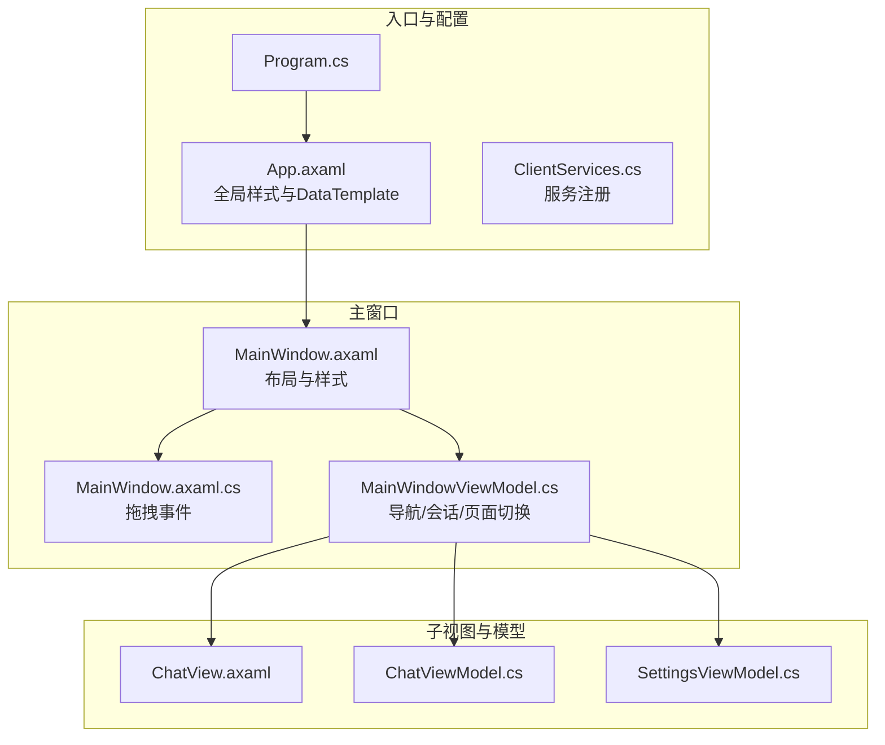
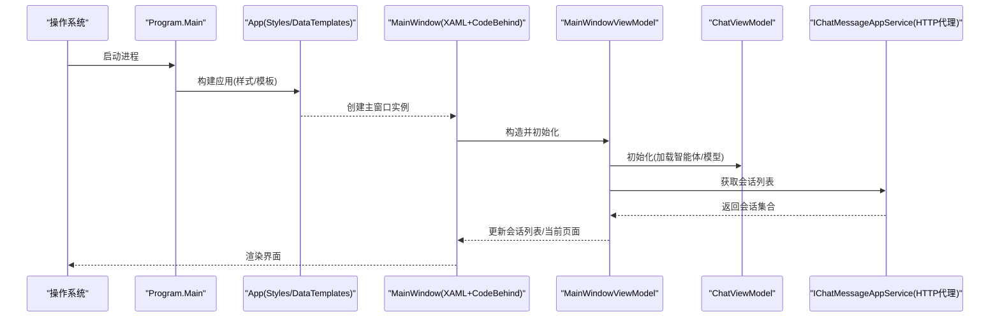
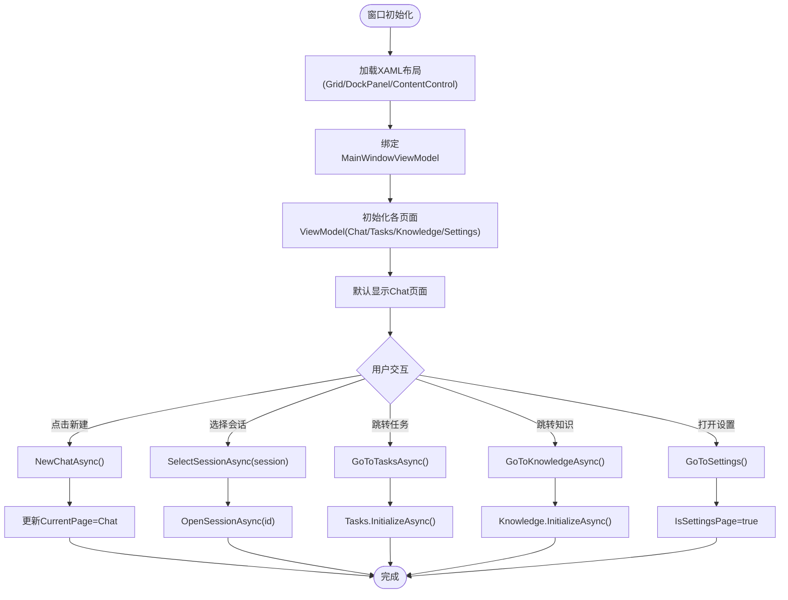
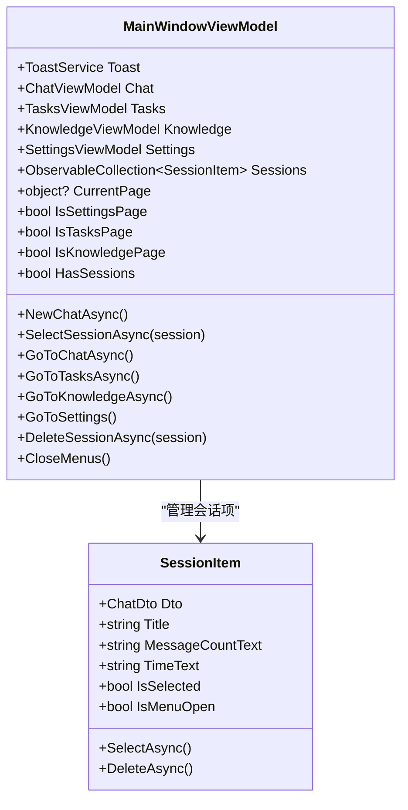
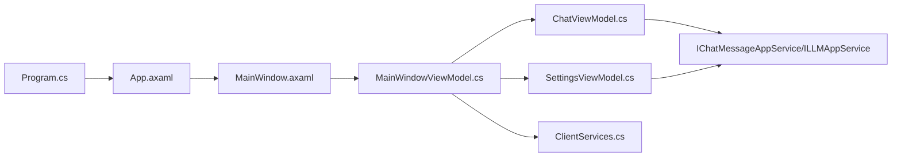

# 主窗口组件

<cite>
**本文引用的文件**   
- [MainWindow.axaml](file://src/Agent/Assistant/H.Assistant.Desktop/Views/MainWindow.axaml)
- [MainWindow.axaml.cs](file://src/Agent/Assistant/H.Assistant.Desktop/Views/MainWindow.axaml.cs)
- [MainWindowViewModel.cs](file://src/Agent/Assistant/H.Assistant.Desktop/ViewModels/MainWindowViewModel.cs)
- [App.axaml](file://src/Agent/Assistant/H.Assistant.Desktop/App.axaml)
- [Program.cs](file://src/Agent/Assistant/H.Assistant.Desktop/Program.cs)
- [ClientServices.cs](file://src/Agent/Assistant/H.Assistant.Desktop/ClientServices.cs)
- [ChatView.axaml](file://src/Agent/Assistant/H.Assistant.Desktop/Views/ChatView.axaml)
- [ChatViewModel.cs](file://src/Agent/Assistant/H.Assistant.Desktop/ViewModels/ChatViewModel.cs)
- [SettingsViewModel.cs](file://src/Agent/Assistant/H.Assistant.Desktop/ViewModels/SettingsViewModel.cs)
</cite>

## 目录
1. [简介](#简介)
2. [项目结构](#项目结构)
3. [核心组件](#核心组件)
4. [架构总览](#架构总览)
5. [详细组件分析](#详细组件分析)
6. [依赖关系分析](#依赖关系分析)
7. [性能考虑](#性能考虑)
8. [故障排查指南](#故障排查指南)
9. [结论](#结论)
10. [附录](#附录)

## 简介
本文件围绕 Avalonia 桌面应用的主窗口组件进行系统化文档说明，覆盖 XAML 界面定义、代码后置事件处理、窗口初始化流程、菜单与工具栏（以侧边栏按钮和弹出菜单形式实现）、状态提示（Toast）机制、窗口大小调整策略、多标签页（会话/任务/知识中心/设置）管理以及用户交互响应。同时提供主题定制与样式扩展指南，帮助开发者快速理解并扩展主窗口功能。

## 项目结构
主窗口位于 Assistant 桌面客户端模块中，采用 MVVM 模式：XAML 负责布局与样式，ViewModel 负责数据与命令，View 的 Code-Behind 仅处理少量 UI 事件（如拖拽移动）。

图表来源 
- [Program.cs:1-20](file://src/Agent/Assistant/H.Assistant.Desktop/Program.cs#L1-L20)
- [App.axaml:1-286](file://src/Agent/Assistant/H.Assistant.Desktop/App.axaml#L1-L286)
- [ClientServices.cs:1-61](file://src/Agent/Assistant/H.Assistant.Desktop/ClientServices.cs#L1-L61)
- [MainWindow.axaml:1-191](file://src/Agent/Assistant/H.Assistant.Desktop/Views/MainWindow.axaml#L1-L191)
- [MainWindow.axaml.cs:1-24](file://src/Agent/Assistant/H.Assistant.Desktop/Views/MainWindow.axaml.cs#L1-L24)
- [MainWindowViewModel.cs:1-270](file://src/Agent/Assistant/H.Assistant.Desktop/ViewModels/MainWindowViewModel.cs#L1-L270)
- [ChatView.axaml:1-184](file://src/Agent/Assistant/H.Assistant.Desktop/Views/ChatView.axaml#L1-L184)
- [ChatViewModel.cs:1-200](file://src/Agent/Assistant/H.Assistant.Desktop/ViewModels/ChatViewModel.cs#L1-L200)
- [SettingsViewModel.cs:1-121](file://src/Agent/Assistant/H.Assistant.Desktop/ViewModels/SettingsViewModel.cs#L1-L121)

章节来源
- [Program.cs:1-20](file://src/Agent/Assistant/H.Assistant.Desktop/Program.cs#L1-L20)
- [App.axaml:1-286](file://src/Agent/Assistant/H.Assistant.Desktop/App.axaml#L1-L286)
- [ClientServices.cs:1-61](file://src/Agent/Assistant/H.Assistant.Desktop/ClientServices.cs#L1-L61)

## 核心组件
- 主窗口（MainWindow）
  - XAML 定义窗口尺寸、最小尺寸、启动位置、字体与主题色；使用 Grid 划分“会话侧栏 + 内容区”，并通过 ContentControl 动态绑定当前页面。
  - 代码后置文件处理无标题栏下的顶部拖拽区域，支持鼠标左键拖动窗口。
- 主窗口 ViewModel（MainWindowViewModel）
  - 管理会话列表、页面导航（聊天/任务/知识中心/设置），维护 Toast 提示、选中态与可见性。
  - 通过命令（RelayCommand）驱动新建会话、选择会话、跳转页面、删除会话等交互。
- 应用级样式与模板（App.axaml）
  - 集中定义按钮、标签、表单、卡片、Tab 项等通用样式，并提供 DataTemplate 将 ViewModel 类型映射到对应 View。
- 子视图与模型
  - ChatView/ChatViewModel：聊天消息展示、流式回复、ReAct 步骤可视化、模型与智能体选择。
  - SettingsViewModel：设置页左侧菜单与右侧内容切换，包含主题与语言选项（本地状态）。

章节来源
- [MainWindow.axaml:1-191](file://src/Agent/Assistant/H.Assistant.Desktop/Views/MainWindow.axaml#L1-L191)
- [MainWindow.axaml.cs:1-24](file://src/Agent/Assistant/H.Assistant.Desktop/Views/MainWindow.axaml.cs#L1-L24)
- [MainWindowViewModel.cs:1-270](file://src/Agent/Assistant/H.Assistant.Desktop/ViewModels/MainWindowViewModel.cs#L1-L270)
- [App.axaml:1-286](file://src/Agent/Assistant/H.Assistant.Desktop/App.axaml#L1-L286)
- [ChatView.axaml:1-184](file://src/Agent/Assistant/H.Assistant.Desktop/Views/ChatView.axaml#L1-L184)
- [ChatViewModel.cs:1-200](file://src/Agent/Assistant/H.Assistant.Desktop/ViewModels/ChatViewModel.cs#L1-L200)
- [SettingsViewModel.cs:1-121](file://src/Agent/Assistant/H.Assistant.Desktop/ViewModels/SettingsViewModel.cs#L1-L121)

## 架构总览
主窗口采用 Avalonia + MVVM 架构，结合 HttpClient 代理访问后端服务，UI 层通过 DataTemplate 自动解析 ViewModel 对应的 View。

图表来源 
- [Program.cs:1-20](file://src/Agent/Assistant/H.Assistant.Desktop/Program.cs#L1-L20)
- [App.axaml:1-286](file://src/Agent/Assistant/H.Assistant.Desktop/App.axaml#L1-L286)
- [MainWindow.axaml:1-191](file://src/Agent/Assistant/H.Assistant.Desktop/Views/MainWindow.axaml#L1-L191)
- [MainWindowViewModel.cs:1-270](file://src/Agent/Assistant/H.Assistant.Desktop/ViewModels/MainWindowViewModel.cs#L1-L270)
- [ChatViewModel.cs:1-200](file://src/Agent/Assistant/H.Assistant.Desktop/ViewModels/ChatViewModel.cs#L1-L200)

## 详细组件分析

### 主窗口（MainWindow）
- 布局结构
  - 使用 Grid 两列布局：左侧为会话侧栏（DockPanel），右侧为内容区（ContentControl 绑定 CurrentPage）。
  - 顶部新增会话按钮兼作窗口拖拽区；底部为用户区域与知识中心入口。
  - 设置页全屏显示，通过 IsSettingsPage 控制可见性。
  - Toast 提示居中置顶显示，背景与消息文本由绑定属性控制。
- 样式系统
  - 在 Window.Styles 中定义侧栏菜单项、分区标题、会话项等样式，包括悬停与激活态。
- 事件处理
  - 代码后置文件处理 PointerPressed 事件，调用 BeginMoveDrag 实现无标题栏拖拽。

图表来源 
- [MainWindow.axaml:1-191](file://src/Agent/Assistant/H.Assistant.Desktop/Views/MainWindow.axaml#L1-L191)
- [MainWindowViewModel.cs:1-270](file://src/Agent/Assistant/H.Assistant.Desktop/ViewModels/MainWindowViewModel.cs#L1-L270)

章节来源
- [MainWindow.axaml:1-191](file://src/Agent/Assistant/H.Assistant.Desktop/Views/MainWindow.axaml#L1-L191)
- [MainWindow.axaml.cs:1-24](file://src/Agent/Assistant/H.Assistant.Desktop/Views/MainWindow.axaml.cs#L1-L24)

### 主窗口 ViewModel（MainWindowViewModel）
- 职责
  - 管理会话列表（ObservableCollection<SessionItem>）、当前页面（object? CurrentPage）、页面标志位（IsSettingsPage/IsTasksPage/IsKnowledgePage）。
  - 提供命令：新建会话、选择会话、跳转聊天/任务/知识/设置、删除会话、切换菜单等。
  - 订阅 ChatViewModel 的事件（会话创建、会话列表变更）与 SettingsViewModel 的返回事件。
- 数据加载
  - 通过 IChatMessageAppService.GetSessionsAsync 加载会话，失败时通过 ToastService 提示错误。
- 交互逻辑
  - 切换页面时关闭其他菜单；删除会话后刷新列表并在必要时回到新会话。

图表来源 
- [MainWindowViewModel.cs:1-270](file://src/Agent/Assistant/H.Assistant.Desktop/ViewModels/MainWindowViewModel.cs#L1-L270)

章节来源
- [MainWindowViewModel.cs:1-270](file://src/Agent/Assistant/H.Assistant.Desktop/ViewModels/MainWindowViewModel.cs#L1-L270)

### 应用样式与模板（App.axaml）
- 全局样式
  - 定义按钮（btn/primary/link/danger/small/iconBtn/ghostIcon/modalPrimary/modalCancel）、标签（tag/tagGreen/tagBlue/tagDefault）、表单控件（modalInput/modalSelect/NumericUpDown）、菜单项（menuItem/menuItemDanger）、卡片（card）、Tab 项（tabItem/tabItemActive）等样式。
- DataTemplate
  - 将 ChatViewModel/TasksViewModel/KnowledgeViewModel/KnowledgeSectionViewModel/SettingsViewModel 映射到对应 View，实现自动视图解析。

章节来源
- [App.axaml:1-286](file://src/Agent/Assistant/H.Assistant.Desktop/App.axaml#L1-L286)

### 聊天视图与模型（ChatView/ChatViewModel）
- ChatView
  - 头部作为拖拽区；消息区滚动容器；输入区固定底部；支持 ReAct 步骤可视化与纯流式回复。
- ChatViewModel
  - 管理会话 ID、消息集合、ReAct 步骤、可用智能体与模型；提供发送、流式响应、加载历史消息等方法。
  - 暴露事件：SessionCreated、SessionsChanged、ScrollToBottomRequested。

章节来源
- [ChatView.axaml:1-184](file://src/Agent/Assistant/H.Assistant.Desktop/Views/ChatView.axaml#L1-L184)
- [ChatViewModel.cs:1-200](file://src/Agent/Assistant/H.Assistant.Desktop/ViewModels/ChatViewModel.cs#L1-L200)

### 设置页（SettingsViewModel）
- 左侧菜单项（通用/智能体/技能/模型/MCP），通过 ActiveMenu 控制右侧内容。
- 主题与语言选项为本地状态（light/dark, zh/en），不持久化。
- 支持返回聊天页（BackRequested 事件）。

章节来源
- [SettingsViewModel.cs:1-121](file://src/Agent/Assistant/H.Assistant.Desktop/ViewModels/SettingsViewModel.cs#L1-L121)

## 依赖关系分析
- 入口与配置
  - Program.Main 启动 Avalonia 应用，配置平台检测、字体与日志。
  - App.axaml 注册全局样式与 DataTemplate。
  - ClientServices 注册远程服务代理、HttpClient、ToastService、ChatStreamClient 与各 ViewModel。
- 主窗口依赖
  - MainWindowViewModel 依赖 IChatMessageAppService、ChatViewModel、TasksViewModel、KnowledgeViewModel、SettingsViewModel、ToastService。
  - ChatViewModel 依赖 IChatMessageAppService、ILLMAppService、ChatStreamClient、ToastService。
  - SettingsViewModel 依赖 ILLMAppService、IAgentAppService、ISkillAppService、IMcpServerAppService、ToastService。

图表来源 
- [Program.cs:1-20](file://src/Agent/Assistant/H.Assistant.Desktop/Program.cs#L1-L20)
- [App.axaml:1-286](file://src/Agent/Assistant/H.Assistant.Desktop/App.axaml#L1-L286)
- [ClientServices.cs:1-61](file://src/Agent/Assistant/H.Assistant.Desktop/ClientServices.cs#L1-L61)
- [MainWindowViewModel.cs:1-270](file://src/Agent/Assistant/H.Assistant.Desktop/ViewModels/MainWindowViewModel.cs#L1-L270)
- [ChatViewModel.cs:1-200](file://src/Agent/Assistant/H.Assistant.Desktop/ViewModels/ChatViewModel.cs#L1-L200)
- [SettingsViewModel.cs:1-121](file://src/Agent/Assistant/H.Assistant.Desktop/ViewModels/SettingsViewModel.cs#L1-L121)

章节来源
- [ClientServices.cs:1-61](file://src/Agent/Assistant/H.Assistant.Desktop/ClientServices.cs#L1-L61)

## 性能考虑
- 列表渲染优化
  - 会话列表使用 ItemsControl 与 DataTemplate，避免不必要的重绘；仅在数据变化时更新。
- 流式响应
  - ChatViewModel 使用流式客户端接收响应，减少等待时间；注意及时取消未完成的流（_streamCts.Cancel()）。
- 异步初始化
  - 会话加载、模型与智能体加载均异步执行，避免阻塞 UI 线程。
- 样式与资源
  - 全局样式集中在 App.axaml，减少重复定义；按需启用 DataTemplate，避免多余视图实例化。

[本节为通用指导，无需特定文件引用]

## 故障排查指南
- 会话加载失败
  - 检查 IChatMessageAppService 网络连通性与证书配置（ClientServices 中的 AllowInvalidCertificates）。
  - 查看 Toast 错误提示，定位具体异常信息。
- 页面切换无效
  - 确认 MainWindowViewModel 的命令是否被正确绑定；检查 IsSettingsPage/IsTasksPage/IsKnowledgePage 标志位。
- 拖拽移动失效
  - 确保 OnDragAreaPointerPressed 事件已绑定且左键按下；验证 ExtendClientAreaTitleBarHeightHint 配置。
- 样式未生效
  - 检查 App.axaml 中样式 Selector 是否正确；确认元素 Classes 名称匹配。

章节来源
- [ClientServices.cs:1-61](file://src/Agent/Assistant/H.Assistant.Desktop/ClientServices.cs#L1-L61)
- [MainWindowViewModel.cs:1-270](file://src/Agent/Assistant/H.Assistant.Desktop/ViewModels/MainWindowViewModel.cs#L1-L270)
- [MainWindow.axaml.cs:1-24](file://src/Agent/Assistant/H.Assistant.Desktop/Views/MainWindow.axaml.cs#L1-L24)
- [App.axaml:1-286](file://src/Agent/Assistant/H.Assistant.Desktop/App.axaml#L1-L286)

## 结论
主窗口组件通过清晰的 MVVM 分层与 Avalonia 样式系统，实现了可扩展的桌面界面。会话侧栏与内容区的解耦设计便于后续功能扩展；统一的样式与模板提升了开发效率。建议在实际使用中关注网络请求的错误处理与流式响应的资源释放，以确保应用的稳定性与性能。

[本节为总结性内容，无需特定文件引用]

## 附录
- 窗口大小调整
  - Width/Height 设定初始尺寸，MinWidth/MinHeight 限制最小尺寸；运行时可通过代码修改这些属性实现动态调整。
- 多标签页管理
  - 通过 CurrentPage 绑定与 Is*Page 标志位控制不同页面的显示；建议在切换前清理旧页面状态。
- 用户交互响应
  - 所有交互通过 RelayCommand 驱动，确保 UI 与逻辑分离；ToastService 用于统一的用户反馈。
- 主题定制与样式扩展
  - 在 App.axaml 中扩展或覆盖现有样式；可使用 FluentTheme 作为基础，按需调整颜色、圆角与阴影。
  - 自定义控件样式时，优先复用已有 Classes（如 btn/primary/link/modalPrimary 等），保持视觉一致性。

[本节为概念性内容，无需特定文件引用]