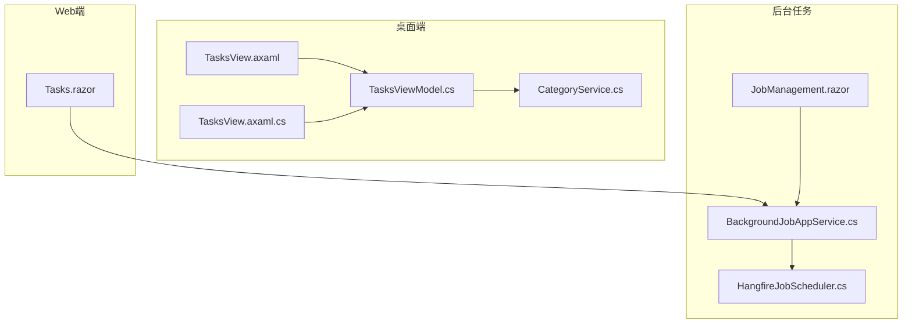
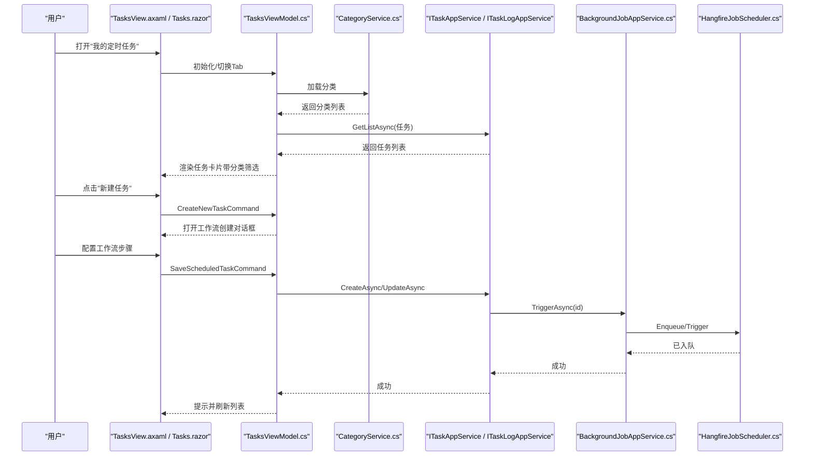
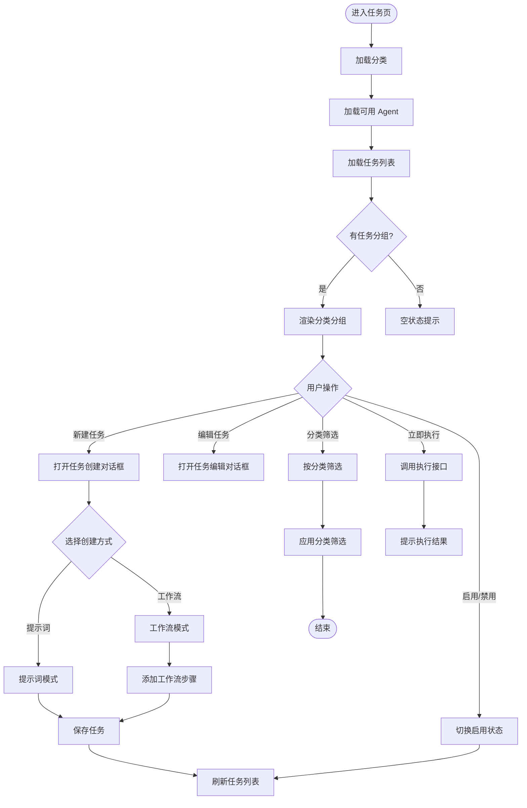
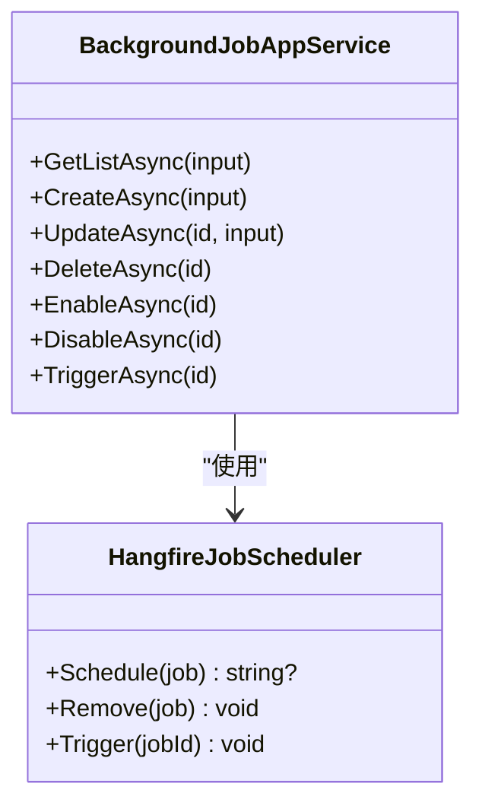
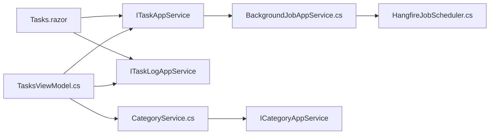

# 任务界面组件

<cite>
**本文引用的文件**   
- [TasksView.axaml](file://src/Host/H.AppLab.Desktop/Views/TasksView.axaml)
- [TasksViewModel.cs](file://src/Host/H.AppLab.Desktop/ViewModels/TasksViewModel.cs)
- [CategoryService.cs](file://src/Host/H.AppLab.Desktop/Services/CategoryService.cs)
- [Tasks.razor](file://src/Agent/Assistant/H.Assistant.Web/Pages/Tasks.razor)
- [BackgroundJobAppService.cs](file://src/Services/BackgroundTask/H.BackgroundTask.Application/Services/BackgroundJobAppService.cs)
- [HangfireJobScheduler.cs](file://src/Services/BackgroundTask/H.BackgroundTask.Application/Services/HangfireJobScheduler.cs)
- [JobManagement.razor](file://src/Services/BackgroundTask/H.BackgroundTask.Web/Pages/JobManagement.razor)
</cite>

## 更新摘要
**变更内容**   
- 新增工作流创建界面，支持多步骤工作流配置
- 实现基于分类的筛选功能，采用芯片式按钮设计
- 改进任务卡片布局，显示来源类型指示器（💬提示词、🔀工作流）
- 增强执行模式显示（手动/自动）
- 完善工作流步骤管理，支持添加、删除和步骤排序功能
- 优化分类管理，支持动态添加、编辑和删除分类

## 目录
1. [简介](#简介)
2. [项目结构](#项目结构)
3. [核心组件](#核心组件)
4. [架构总览](#架构总览)
5. [详细组件分析](#详细组件分析)
6. [依赖关系分析](#依赖关系分析)
7. [性能与实时性](#性能与实时性)
8. [故障排查指南](#故障排查指南)
9. [结论](#结论)
10. [附录：扩展与定制指南](#附录：扩展与定制指南)

## 简介
本文件面向"任务界面组件"，聚焦 TasksView 的任务列表展示与管理能力，包括任务状态监控、进度与执行记录查看、日志查看器、任务调度、批量操作、筛选排序、实时状态更新、错误重试与任务取消机制，以及界面定制与业务流程扩展建议。文档同时覆盖桌面端（Avalonia）与 Web 端（Blazor）两套实现，并关联后台任务调度子系统（Hangfire）以说明任务的触发与执行链路。

**更新** 新增了工作流创建界面、分类筛选、来源类型指示器和执行模式显示等增强功能。

## 项目结构
- 桌面端（Avalonia）
  - 视图层：TasksView.axaml（UI 布局与交互绑定）
  - 代码后置：TasksView.axaml.cs（事件处理，如遮罩关闭对话框）
  - 视图模型：TasksViewModel.cs（数据加载、CRUD、多选删除、Tab 切换等）
  - 服务层：CategoryService.cs（分类管理服务）
- Web 端（Blazor）
  - 页面：Tasks.razor（与桌面端功能对齐的 Web 实现）
- 后台任务调度（通用）
  - 应用服务：BackgroundJobAppService.cs（任务增删改查、启用/停用、触发、与调度器集成）
  - 调度器：HangfireJobScheduler.cs（基于 Hangfire 的一次性与周期任务注册、移除、触发）
  - 管理页：JobManagement.razor（后台任务管理 UI）

**图表来源**
- [TasksView.axaml:1-589](file://src/Host/H.AppLab.Desktop/Views/TasksView.axaml#L1-L589)
- [TasksViewModel.cs:1-1082](file://src/Host/H.AppLab.Desktop/ViewModels/TasksViewModel.cs#L1-L1082)
- [CategoryService.cs:1-90](file://src/Host/H.AppLab.Desktop/Services/CategoryService.cs#L1-L90)

章节来源
- [TasksView.axaml:1-589](file://src/Host/H.AppLab.Desktop/Views/TasksView.axaml#L1-L589)
- [TasksViewModel.cs:1-1082](file://src/Host/H.AppLab.Desktop/ViewModels/TasksViewModel.cs#L1-L1082)
- [CategoryService.cs:1-90](file://src/Host/H.AppLab.Desktop/Services/CategoryService.cs#L1-L90)

## 核心组件
- **增强的任务列表展示与管理（桌面端）**
  - 通过 ItemsControl 渲染两列卡片，显示任务名称、描述、调度信息、下次执行时间、启用开关与更多操作菜单（编辑、立即执行、删除）。
  - **新增** 基于分类的筛选功能，采用芯片式按钮设计，支持"全部"和自定义分类。
  - **新增** 来源类型指示器：💬表示提示词任务，🔀表示工作流任务。
  - **新增** 执行模式显示：👆手动模式和🤖自动模式。
  - 支持创建/编辑任务弹窗，包含 Agent 类型选择、调度类型（仅一次/每天/每周/每月/Cron）、时间与 Cron 配置。
- **工作流创建界面**
  - **新增** 支持多步骤工作流配置，每个步骤包含名称和提示词。
  - **新增** 步骤管理功能：添加新步骤、删除现有步骤。
  - **新增** 工作流步骤验证，确保至少有一个有效步骤。
- **执行记录与日志查看器（桌面端）**
  - 左右分栏：左侧摘要列表（含状态色点、开始时间、耗时），右侧详情面板（结果 Markdown、错误信息、状态标签）。
  - 支持多选模式、全选/取消全选、批量删除确认与执行。
- Web 端任务页（Tasks.razor）
  - 与桌面端功能对齐：任务卡片、启用开关、更多菜单、创建/编辑弹窗、执行记录分栏与多选删除。
- 后台任务调度（通用）
  - BackgroundJobAppService 提供任务 CRUD、启用/停用、触发，并与 HangfireJobScheduler 协作完成一次性或周期任务注册。
  - HangfireJobScheduler 根据任务类型与 Cron 表达式注册到 Hangfire，支持立即入队、定时入队与周期性任务。

章节来源
- [TasksView.axaml:1-589](file://src/Host/H.AppLab.Desktop/Views/TasksView.axaml#L1-L589)
- [TasksViewModel.cs:1-1082](file://src/Host/H.AppLab.Desktop/ViewModels/TasksViewModel.cs#L1-L1082)
- [CategoryService.cs:1-90](file://src/Host/H.AppLab.Desktop/Services/CategoryService.cs#L1-L90)

## 架构总览
任务界面采用 MVVM（桌面端）与 Blazor（Web端）分层，UI 层通过 AppService 调用后端接口；后台任务由 Hangfire 驱动，统一通过 IJobScheduler 抽象进行调度。

**图表来源**
- [TasksView.axaml:1-589](file://src/Host/H.AppLab.Desktop/Views/TasksView.axaml#L1-L589)
- [TasksViewModel.cs:1-1082](file://src/Host/H.AppLab.Desktop/ViewModels/TasksViewModel.cs#L1-L1082)
- [CategoryService.cs:1-90](file://src/Host/H.AppLab.Desktop/Services/CategoryService.cs#L1-L90)

## 详细组件分析

### 桌面端 TasksView（Avalonia）- 增强版
- **增强的任务列表**
  - 使用 UniformGrid 两列布局，ItemsSource 绑定 Tasks 集合。
  - **新增** 分类筛选区域，采用 WrapPanel 布局的芯片式按钮。
  - 每个卡片显示任务名、描述、来源类型指示器（💬/🔀）、执行模式（👆/🤖）、调度文本、下次执行时间（启用时可见），并提供启用开关与更多操作菜单。
- **工作流创建界面**
  - **新增** 创建方式选择：提示词（💬）和工作流（🔀）两种模式。
  - **新增** 工作流步骤管理：支持添加多个步骤，每个步骤包含名称和提示词输入框。
  - **新增** 执行模式选择：手动（👆）和自动（🤖）两种模式。
- **执行记录**
  - 左栏为摘要列表，右栏为详情面板，支持 Markdown 结果与错误信息展示。
  - 多选模式下可全选/取消全选，批量删除前弹出确认框。
- **弹窗**
  - 创建/编辑任务弹窗包含表单字段与调度配置（时间或 Cron）。
  - 遮罩点击关闭对话框（代码后置中处理）。

**图表来源**
- [TasksView.axaml:1-589](file://src/Host/H.AppLab.Desktop/Views/TasksView.axaml#L1-L589)
- [TasksViewModel.cs:1-1082](file://src/Host/H.AppLab.Desktop/ViewModels/TasksViewModel.cs#L1-L1082)

章节来源
- [TasksView.axaml:1-589](file://src/Host/H.AppLab.Desktop/Views/TasksView.axaml#L1-L589)
- [TasksViewModel.cs:1-1082](file://src/Host/H.AppLab.Desktop/ViewModels/TasksViewModel.cs#L1-L1082)

### Web 端 Tasks（Blazor）
- 与桌面端一致的功能映射：任务卡片、启用开关、更多菜单、创建/编辑弹窗、执行记录分栏、多选删除。
- 通过 ITaskAppService 与 ITaskLogAppService 获取数据，JSRuntime 用于提示与图标渲染。

章节来源
- [Tasks.razor:1-800](file://src/Agent/Assistant/H.Assistant.Web/Pages/Tasks.razor#L1-L800)

### 后台任务调度（Hangfire）
- BackgroundJobAppService
  - 提供 GetListAsync、CreateAsync、UpdateAsync、DeleteAsync、EnableAsync、DisableAsync、TriggerAsync。
  - 在创建/更新/启用时调用调度器注册任务；停用/删除时移除调度。
- HangfireJobScheduler
  - Schedule：根据任务类型（一次性/周期）与 Cron 表达式注册到 Hangfire；未指定时间或已过则立即入队。
  - Remove：按约定 ID 或存储的 JobId 移除调度。
  - Trigger：直接入队执行。

**图表来源**
- [BackgroundJobAppService.cs:1-135](file://src/Services/BackgroundTask/H.BackgroundTask.Application/Services/BackgroundJobAppService.cs#L1-L135)
- [HangfireJobScheduler.cs:1-90](file://src/Services/BackgroundTask/H.BackgroundTask.Application/Services/HangfireJobScheduler.cs#L1-L90)

章节来源
- [BackgroundJobAppService.cs:1-135](file://src/Services/BackgroundTask/H.BackgroundTask.Application/Services/BackgroundJobAppService.cs#L1-L135)
- [HangfireJobScheduler.cs:1-90](file://src/Services/BackgroundTask/H.BackgroundTask.Application/Services/HangfireJobScheduler.cs#L1-L90)

### 后台任务管理页（JobManagement.razor）
- 提供任务查询（名称过滤、调度方式、类型）、新增/编辑弹窗（一次性/周期、API/SQL 配置）、启用/停用、删除、触发执行等操作。
- 与 BackgroundJobAppService 对接，完成数据持久化与调度管理。

章节来源
- [JobManagement.razor:1-364](file://src/Services/BackgroundTask/H.BackgroundTask.Web/Pages/JobManagement.razor#L1-L364)

### 分类管理服务（CategoryService）
- **新增** 独立的分类管理服务，负责分类的 CRUD 操作。
- 支持分类的加载、添加、更新和删除。
- 与 TasksViewModel 集成，实现动态分类筛选和管理。

章节来源
- [CategoryService.cs:1-90](file://src/Host/H.AppLab.Desktop/Services/CategoryService.cs#L1-L90)

## 依赖关系分析
- 界面层依赖 AppService 接口（ITaskAppService、ITaskLogAppService），不直接访问数据库。
- 桌面端 ViewModel 通过依赖注入获取服务，封装业务逻辑与 UI 状态。
- **新增** CategoryService 独立管理分类数据，与 TasksViewModel 解耦。
- 后台任务模块通过 IJobScheduler 抽象解耦具体调度实现（当前为 Hangfire）。

**图表来源**
- [TasksViewModel.cs:1-1082](file://src/Host/H.AppLab.Desktop/ViewModels/TasksViewModel.cs#L1-L1082)
- [CategoryService.cs:1-90](file://src/Host/H.AppLab.Desktop/Services/CategoryService.cs#L1-L90)

章节来源
- [TasksViewModel.cs:1-1082](file://src/Host/H.AppLab.Desktop/ViewModels/TasksViewModel.cs#L1-L1082)
- [CategoryService.cs:1-90](file://src/Host/H.AppLab.Desktop/Services/CategoryService.cs#L1-L90)

## 性能与实时性
- 列表加载
  - 默认限制 MaxResultCount=50，避免一次性加载过多数据。
  - 桌面端与 Web 端均在 finally 中重置 loading 状态，确保 UI 响应。
- 分页与筛选
  - 后台任务管理页支持 Filter、TriggerKind、ExecuteType 筛选，服务端侧查询优化。
  - **新增** 客户端分类筛选，减少服务器压力。
- 实时状态更新
  - 当前实现为手动刷新（切换 Tab、保存后刷新、执行后刷新）。如需实时推送，可在 AppService 层引入 SignalR 或轮询策略。
- 进度条显示
  - 任务执行进度需结合执行器与日志记录，在日志详情中展示阶段性结果；当前 UI 侧重结果与错误展示。

## 故障排查指南
- 加载失败
  - 检查 AppService 调用是否抛出异常，UI 层通过 Toast 或 alert 提示错误信息。
- 任务无法触发
  - 确认任务已启用且调度已注册（Hangfire 作业存在）；检查 Cron 表达式与时间配置。
- 批量删除无效
  - 确认多选模式已开启且至少选中一条记录；确认删除接口返回成功。
- 日志为空
  - 确认任务执行后写入日志；检查日志查询参数与最大数量限制。
- **新增** 分类筛选问题
  - 检查 CategoryService 是否正确加载分类数据。
  - 确认 FilterCategories 集合正确更新。
- **新增** 工作流创建问题
  - 验证工作流步骤至少包含一个有效步骤。
  - 检查 WorkflowContent JSON 序列化是否正确。

章节来源
- [TasksViewModel.cs:1-1082](file://src/Host/H.AppLab.Desktop/ViewModels/TasksViewModel.cs#L1-L1082)
- [CategoryService.cs:1-90](file://src/Host/H.AppLab.Desktop/Services/CategoryService.cs#L1-L90)

## 结论
TasksView 提供了完整的任务管理与执行记录查看能力，桌面端与 Web 端功能对齐，并通过后台任务调度子系统实现稳定可靠的触发与执行。**新增的工作流创建界面、分类筛选功能和来源类型指示器显著提升了用户体验和操作效率**。通过合理的分页、筛选与批量操作，满足日常运维与自动化需求。未来可扩展实时推送、进度可视化与更丰富的错误重试策略。

## 附录：扩展与定制指南
- 界面定制
  - 桌面端：修改 TasksView.axaml 的样式与布局（UniformGrid 列数、卡片样式、颜色主题）。
  - Web 端：调整 Tasks.razor 的 CSS 与组件结构，保持与桌面端一致的交互体验。
- 业务流程扩展
  - 在 AppService 层增加新的任务类型或执行动作（例如新增执行参数校验、结果格式化）。
  - 在调度器层扩展 IJobScheduler 实现（替换或并行使用其他调度框架）。
  - **新增** 扩展工作流步骤类型，支持更多类型的步骤配置。
- 实时状态更新
  - 引入 SignalR 或轮询机制，在任务状态变化时主动推送至前端，减少手动刷新。
- 错误重试与取消
  - 在执行器层增加重试策略（指数退避、最大重试次数）；对长耗时任务提供取消令牌支持。
- 日志查看器增强
  - 支持分页加载、关键字搜索、导出日志、结构化日志解析与高亮显示。
- **新增** 分类管理扩展
  - 支持分类层级结构（父子分类）。
  - 添加分类图标和颜色自定义。
  - 实现分类导入/导出功能。