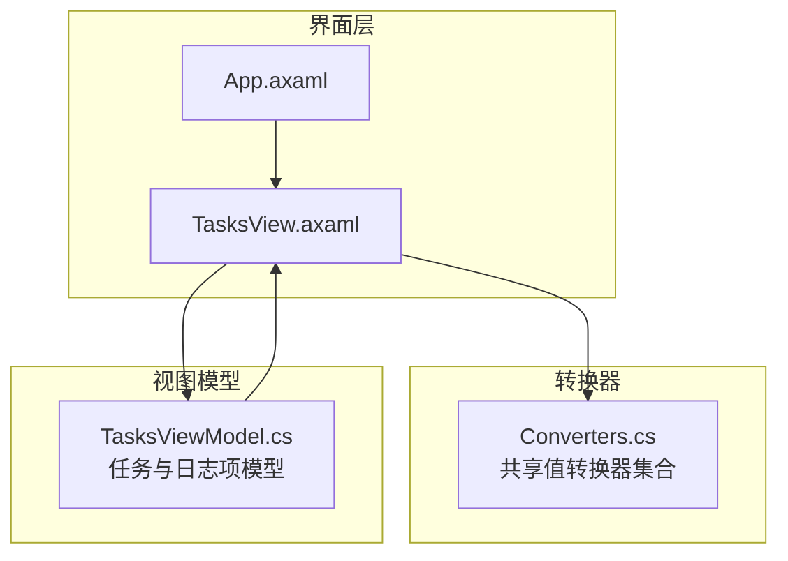
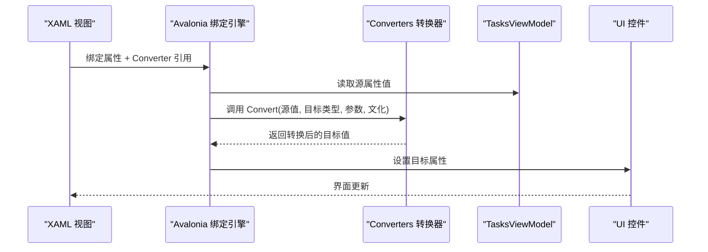
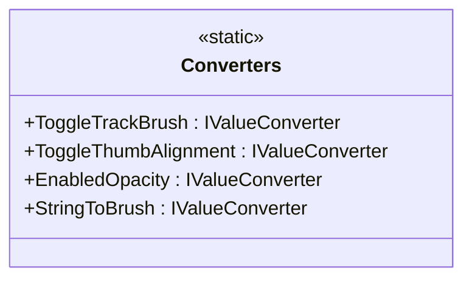
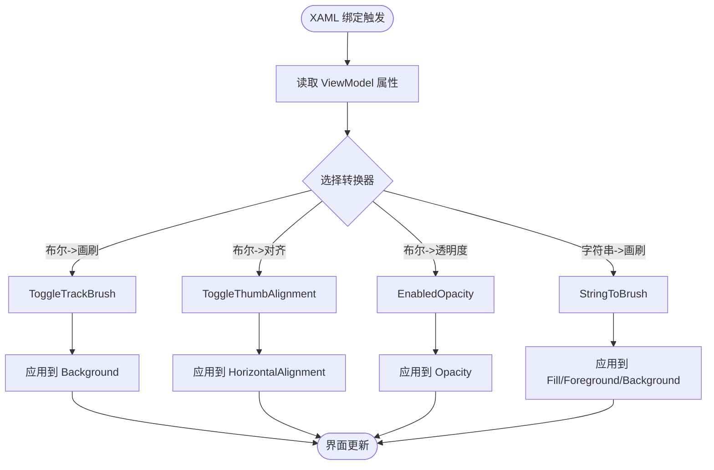
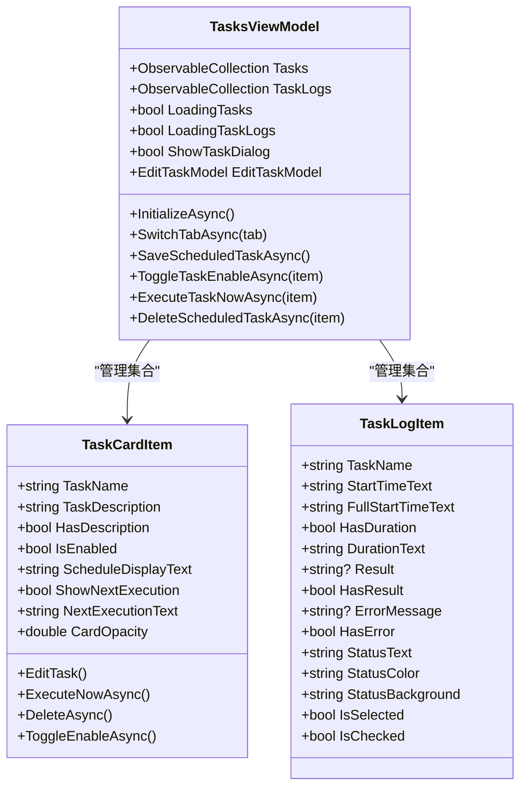
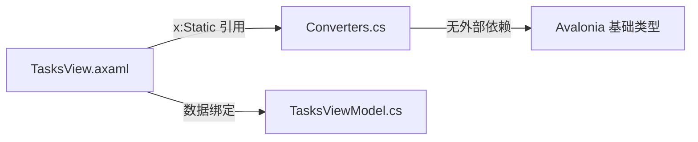

# 数据转换器

<cite>
**本文引用的文件**   
- [Converters.cs](file://src/Agent/Assistant/H.Assistant.Desktop/Converters.cs)
- [TasksView.axaml](file://src/Agent/Assistant/H.Assistant.Desktop/Views/TasksView.axaml)
- [App.axaml](file://src/Agent/Assistant/H.Assistant.Desktop/App.axaml)
- [TasksViewModel.cs](file://src/Agent/Assistant/H.Assistant.Desktop/ViewModels/TasksViewModel.cs)
</cite>

## 目录
1. [简介](#简介)
2. [项目结构](#项目结构)
3. [核心组件](#核心组件)
4. [架构总览](#架构总览)
5. [详细组件分析](#详细组件分析)
6. [依赖关系分析](#依赖关系分析)
7. [性能考虑](#性能考虑)
8. [故障排查指南](#故障排查指南)
9. [结论](#结论)
10. [附录](#附录)

## 简介
本文件围绕 Avalonia 桌面应用中的“数据转换器”进行系统化说明，重点解析 Converters.cs 中提供的值转换器及其在 XAML 绑定中的使用方式。内容涵盖：
- 类型转换与格式化（布尔到画刷、枚举到对齐、字符串颜色到画刷、启用状态透明度）
- 条件显示逻辑（多值布尔组合）
- XAML 绑定中的转换器用法、参数传递与错误处理
- 自定义转换器开发、性能优化与调试技巧
- 数据转换最佳实践与常见问题解决方案

## 项目结构
本项目为 Avalonia 桌面应用，转换器集中在 H.Assistant.Desktop 模块中，XAML 视图通过静态引用将 ViewModel 属性映射到 UI 属性，转换器作为中间层完成类型与格式转换。

图表来源 
- [TasksView.axaml:1-381](file://src/Agent/Assistant/H.Assistant.Desktop/Views/TasksView.axaml#L1-L381)
- [App.axaml:1-286](file://src/Agent/Assistant/H.Assistant.Desktop/App.axaml#L1-L286)
- [Converters.cs:1-31](file://src/Agent/Assistant/H.Assistant.Desktop/Converters.cs#L1-L31)
- [TasksViewModel.cs:1-647](file://src/Agent/Assistant/H.Assistant.Desktop/ViewModels/TasksViewModel.cs#L1-L647)

章节来源
- [TasksView.axaml:1-381](file://src/Agent/Assistant/H.Assistant.Desktop/Views/TasksView.axaml#L1-L381)
- [App.axaml:1-286](file://src/Agent/Assistant/H.Assistant.Desktop/App.axaml#L1-L286)

## 核心组件
- 共享转换器类 Converters：提供四个常用 IValueConverter 实例，用于布尔到画刷、布尔到对齐、布尔到透明度、字符串颜色到画刷的转换。
- XAML 视图 TasksView：通过 x:Static 引用 Converters 中的转换器，将 ViewModel 的属性直接绑定到 UI 属性，实现样式与可见性的动态控制。
- 视图模型 TasksViewModel：暴露布尔、字符串等基础类型属性，供 XAML 绑定；同时提供派生属性用于 UI 展示（如状态文本、颜色、背景）。

章节来源
- [Converters.cs:1-31](file://src/Agent/Assistant/H.Assistant.Desktop/Converters.cs#L1-L31)
- [TasksView.axaml:1-381](file://src/Agent/Assistant/H.Assistant.Desktop/Views/TasksView.axaml#L1-L381)
- [TasksViewModel.cs:1-647](file://src/Agent/Assistant/H.Assistant.Desktop/ViewModels/TasksViewModel.cs#L1-L647)

## 架构总览
Avalonia 的数据绑定流程如下：
- XAML 声明绑定表达式，指定 Converter 引用
- 运行时由 Avalonia 数据绑定引擎调用对应 IValueConverter 的 Convert 方法
- 转换器返回目标类型的值（如 IBrush、double、HorizontalAlignment）
- UI 控件根据返回值更新视觉表现或行为

图表来源 
- [TasksView.axaml:51-64](file://src/Agent/Assistant/H.Assistant.Desktop/Views/TasksView.axaml#L51-L64)
- [Converters.cs:12-30](file://src/Agent/Assistant/H.Assistant.Desktop/Converters.cs#L12-L30)

## 详细组件分析

### 转换器类 Converters
- ToggleTrackBrush：布尔到画刷，开为绿色，关为灰色
- ToggleThumbAlignment：布尔到水平对齐，开为右，关为左
- EnabledOpacity：布尔到透明度，禁用时降低不透明度
- StringToBrush：字符串颜色值到画刷，空值回退为默认灰

图表来源 
- [Converters.cs:10-30](file://src/Agent/Assistant/H.Assistant.Desktop/Converters.cs#L10-L30)

章节来源
- [Converters.cs:1-31](file://src/Agent/Assistant/H.Assistant.Desktop/Converters.cs#L1-L31)

### XAML 绑定与转换器使用
- 开关轨道颜色：Background="{Binding IsEnabled, Converter={x:Static ui:Converters.ToggleTrackBrush}}"
- 滑块位置：HorizontalAlignment="{Binding IsEnabled, Converter={x:Static ui:Converters.ToggleThumbAlignment}}"
- 卡片透明度：Opacity="{Binding IsEnabled, Converter={x:Static ui:Converters.EnabledOpacity}}"
- 颜色字符串转画刷：Fill/Foreground/Background 使用 StringToBrush
- 多值布尔组合：MultiBinding + BoolConverters.And 控制空状态显示

图表来源 
- [TasksView.axaml:51-64](file://src/Agent/Assistant/H.Assistant.Desktop/Views/TasksView.axaml#L51-L64)
- [TasksView.axaml:149-176](file://src/Agent/Assistant/H.Assistant.Desktop/Views/TasksView.axaml#L149-L176)
- [TasksView.axaml:97-102](file://src/Agent/Assistant/H.Assistant.Desktop/Views/TasksView.axaml#L97-L102)

章节来源
- [TasksView.axaml:1-381](file://src/Agent/Assistant/H.Assistant.Desktop/Views/TasksView.axaml#L1-L381)

### 视图模型与数据模型
- TaskCardItem：封装任务卡片展示信息，包含 IsEnabled、调度显示文本、下次执行时间等
- TaskLogItem：封装执行日志展示信息，包含状态文本、颜色、背景色、时长等
- TasksViewModel：管理任务与日志集合、对话框状态、多选删除等交互逻辑

图表来源 
- [TasksViewModel.cs:424-525](file://src/Agent/Assistant/H.Assistant.Desktop/ViewModels/TasksViewModel.cs#L424-L525)
- [TasksViewModel.cs:530-647](file://src/Agent/Assistant/H.Assistant.Desktop/ViewModels/TasksViewModel.cs#L530-L647)

章节来源
- [TasksViewModel.cs:1-647](file://src/Agent/Assistant/H.Assistant.Desktop/ViewModels/TasksViewModel.cs#L1-L647)

## 依赖关系分析
- XAML 视图依赖转换器静态引用，通过 xmlns:ui="using:H.Assistant.Desktop" 引入命名空间
- 转换器无外部依赖，仅依赖 Avalonia 基础类型（IBrush、Color、HorizontalAlignment）
- 视图模型与视图通过数据绑定松耦合，转换器作为纯函数式中间层，便于测试与维护

图表来源 
- [TasksView.axaml:1-10](file://src/Agent/Assistant/H.Assistant.Desktop/Views/TasksView.axaml#L1-L10)
- [Converters.cs:1-10](file://src/Agent/Assistant/H.Assistant.Desktop/Converters.cs#L1-L10)

章节来源
- [TasksView.axaml:1-381](file://src/Agent/Assistant/H.Assistant.Desktop/Views/TasksView.axaml#L1-L381)
- [Converters.cs:1-31](file://src/Agent/Assistant/H.Assistant.Desktop/Converters.cs#L1-L31)

## 性能考虑
- 转换器应为无副作用的纯函数，避免在 Convert 中执行耗时操作
- 使用 FuncValueConverter 创建轻量级转换器实例，避免重复分配
- 对于频繁更新的属性（如 IsEnabled），确保转换器逻辑简单高效
- 合理使用 MultiBinding，避免过多绑定导致渲染开销
- 在 ViewModel 中预计算派生属性（如 StatusColor、StatusBackground），减少转换器负担

[本节为通用指导，无需特定文件来源]

## 故障排查指南
- 颜色字符串无效：StringToBrush 对空值提供默认灰色，但仍需确保输入为合法颜色格式
- 布尔值异常：检查 ViewModel 中 IsEnabled 等属性的更新是否触发了 PropertyChanged
- 多值绑定失败：确认 BoolConverters.And 的所有输入均为布尔类型
- 转换器未生效：检查 XAML 命名空间引用是否正确，Converter 路径是否准确
- 性能问题：使用性能分析工具定位频繁调用的转换器，优化其内部逻辑

章节来源
- [Converters.cs:27-30](file://src/Agent/Assistant/H.Assistant.Desktop/Converters.cs#L27-L30)
- [TasksView.axaml:97-102](file://src/Agent/Assistant/H.Assistant.Desktop/Views/TasksView.axaml#L97-L102)

## 结论
Converters.cs 提供了简洁高效的值转换器集合，配合 Avalonia 的数据绑定机制，实现了类型转换、格式化和条件显示的解耦设计。通过合理的转换器设计与 ViewModel 属性规划，可以构建出高性能、易维护的用户界面。建议遵循最佳实践，持续优化转换器逻辑与绑定性能。

[本节为总结性内容，无需特定文件来源]

## 附录

### 自定义转换器开发指南
- 实现 IValueConverter 接口，重写 Convert 和 ConvertBack 方法
- 使用 FuncValueConverter 简化单行转换逻辑
- 添加参数支持时，注意 Convert 方法的 parameter 参数
- 提供默认值和错误处理，确保转换器健壮性

### XAML 绑定最佳实践
- 优先使用单向绑定（OneWay）提升性能
- 复杂逻辑放在 ViewModel 中，转换器仅做简单转换
- 合理使用 RelativeSource 和 ElementName 进行跨元素绑定
- 避免在转换器中执行异步操作

### 调试技巧
- 使用 Avalonia 调试工具查看绑定链路
- 在转换器中添加日志输出，追踪数据流
- 使用单元测试验证转换器逻辑
- 利用 Visual Studio 断点调试 XAML 绑定过程

[本节为通用指导，无需特定文件来源]