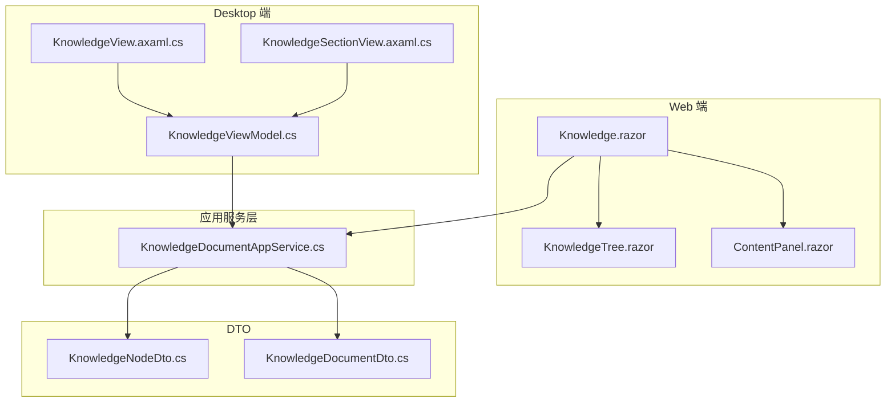
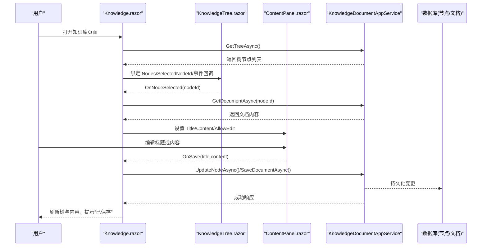
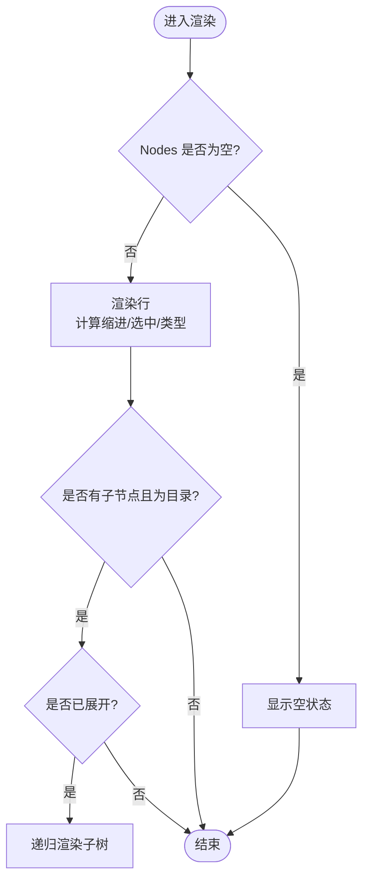
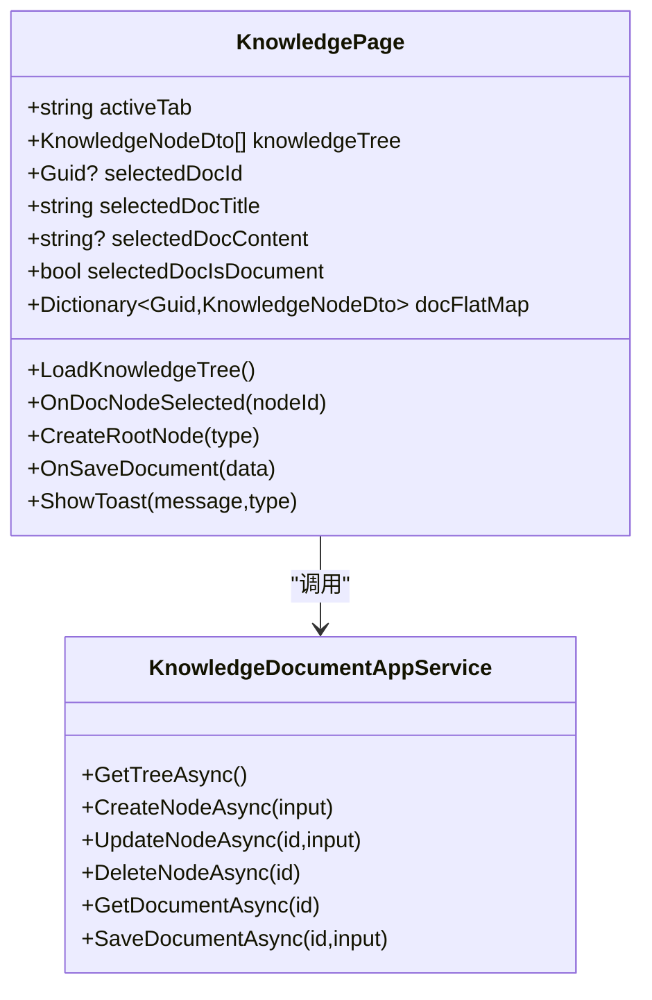
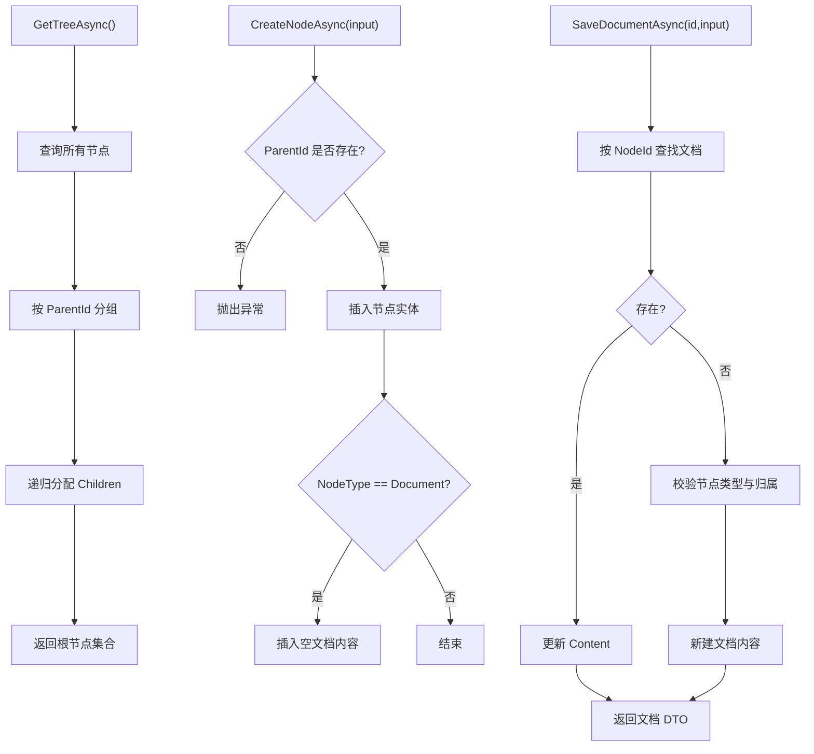
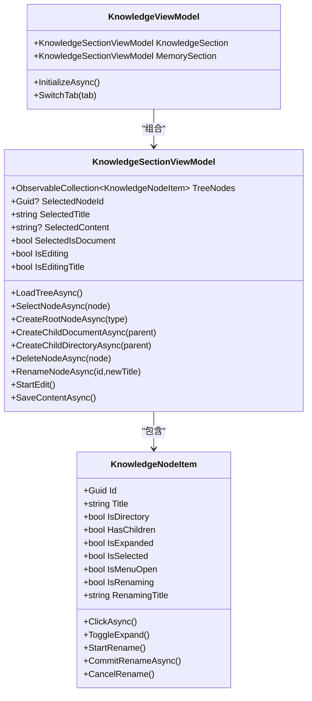
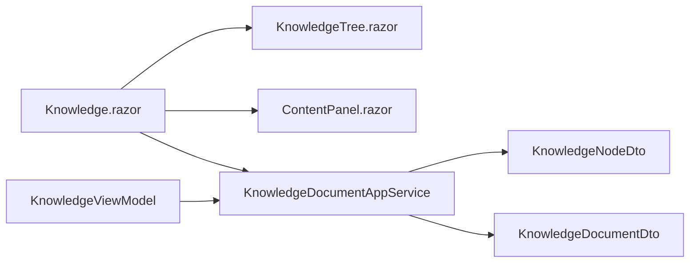

# 知识库界面组件

<cite>
**本文引用的文件**   
- [Knowledge.razor](file://src/Agent/Assistant/H.Assistant.Web/Pages/Knowledge.razor)
- [KnowledgeTree.razor](file://src/Agent/Assistant/H.Assistant.Web/Components/KnowledgeTree.razor)
- [ContentPanel.razor](file://src/Agent/Assistant/H.Assistant.Web/Components/ContentPanel.razor)
- [KnowledgeDocumentAppService.cs](file://src/Agent/Assistant/H.Assistant.Application/Services/KnowledgeDocumentAppService.cs)
- [KnowledgeNodeDto.cs](file://src/Agent/Assistant/H.Assistant.Application.Contracts/Dtos/Knowledge/KnowledgeNodeDto.cs)
- [KnowledgeDocumentDto.cs](file://src/Agent/Assistant/H.Assistant.Application.Contracts/Dtos/Knowledge/KnowledgeDocumentDto.cs)
- [KnowledgeViewModel.cs](file://src/Agent/Assistant/H.Assistant.Desktop/ViewModels/KnowledgeViewModel.cs)
- [KnowledgeView.axaml.cs](file://src/Agent/Assistant/H.Assistant.Desktop/Views/KnowledgeView.axaml.cs)
- [KnowledgeSectionView.axaml.cs](file://src/Agent/Assistant/H.Assistant.Desktop/Views/KnowledgeSectionView.axaml.cs)
</cite>

## 目录
1. [简介](#简介)
2. [项目结构](#项目结构)
3. [核心组件](#核心组件)
4. [架构总览](#架构总览)
5. [详细组件分析](#详细组件分析)
6. [依赖关系分析](#依赖关系分析)
7. [性能与异步加载](#性能与异步加载)
8. [故障排查指南](#故障排查指南)
9. [结论](#结论)
10. [附录：扩展与定制指南](#附录扩展与定制指南)

## 简介
本文件面向“知识库”界面组件，围绕 Web 端的 Knowledge.razor、KnowledgeTree.razor、ContentPanel.razor 以及桌面端 Avalonia 的 KnowledgeView/KnowledgeSectionView 进行系统化说明。重点覆盖：
- 树形结构的展示与数据绑定（节点展开/折叠、选中态）
- 知识节点的增删改查（创建目录/文档、重命名、删除、选择并加载内容）
- 文档预览与编辑（标题与内容分离保存）
- 搜索过滤与分类管理（可扩展点）
- 异步数据加载、进度显示与用户反馈（Toast/提示）
- 界面定制与业务逻辑扩展建议

## 项目结构
知识库功能横跨 Web 与 Desktop 两端：
- Web 端页面与组件：Knowledge.razor（页面）、KnowledgeTree.razor（树组件）、ContentPanel.razor（内容面板）
- 应用服务层：KnowledgeDocumentAppService（节点与文档内容的 CRUD）
- DTO 模型：KnowledgeNodeDto、KnowledgeDocumentDto
- Desktop 端视图与 ViewModel：KnowledgeView/KnowledgeSectionView（Avalonia），KnowledgeViewModel（双 Tab 编排与复用逻辑）

图表来源
- [Knowledge.razor:1-667](file://src/Agent/Assistant/H.Assistant.Web/Pages/Knowledge.razor#L1-L667)
- [KnowledgeTree.razor:1-356](file://src/Agent/Assistant/H.Assistant.Web/Components/KnowledgeTree.razor#L1-L356)
- [ContentPanel.razor](file://src/Agent/Assistant/H.Assistant.Web/Components/ContentPanel.razor)
- [KnowledgeDocumentAppService.cs:1-227](file://src/Agent/Assistant/H.Assistant.Application/Services/KnowledgeDocumentAppService.cs#L1-L227)
- [KnowledgeNodeDto.cs:1-16](file://src/Agent/Assistant/H.Assistant.Application.Contracts/Dtos/Knowledge/KnowledgeNodeDto.cs#L1-L16)
- [KnowledgeDocumentDto.cs:1-13](file://src/Agent/Assistant/H.Assistant.Application.Contracts/Dtos/Knowledge/KnowledgeDocumentDto.cs#L1-L13)
- [KnowledgeViewModel.cs:1-537](file://src/Agent/Assistant/H.Assistant.Desktop/ViewModels/KnowledgeViewModel.cs#L1-L537)
- [KnowledgeView.axaml.cs:1-12](file://src/Agent/Assistant/H.Assistant.Desktop/Views/KnowledgeView.axaml.cs#L1-L12)
- [KnowledgeSectionView.axaml.cs:1-98](file://src/Agent/Assistant/H.Assistant.Desktop/Views/KnowledgeSectionView.axaml.cs#L1-L98)

章节来源
- [Knowledge.razor:1-667](file://src/Agent/Assistant/H.Assistant.Web/Pages/Knowledge.razor#L1-L667)
- [KnowledgeTree.razor:1-356](file://src/Agent/Assistant/H.Assistant.Web/Components/KnowledgeTree.razor#L1-L356)
- [KnowledgeDocumentAppService.cs:1-227](file://src/Agent/Assistant/H.Assistant.Application/Services/KnowledgeDocumentAppService.cs#L1-L227)
- [KnowledgeNodeDto.cs:1-16](file://src/Agent/Assistant/H.Assistant.Application.Contracts/Dtos/Knowledge/KnowledgeNodeDto.cs#L1-L16)
- [KnowledgeDocumentDto.cs:1-13](file://src/Agent/Assistant/H.Assistant.Application.Contracts/Dtos/Knowledge/KnowledgeDocumentDto.cs#L1-L13)
- [KnowledgeViewModel.cs:1-537](file://src/Agent/Assistant/H.Assistant.Desktop/ViewModels/KnowledgeViewModel.cs#L1-L537)
- [KnowledgeView.axaml.cs:1-12](file://src/Agent/Assistant/H.Assistant.Desktop/Views/KnowledgeView.axaml.cs#L1-L12)
- [KnowledgeSectionView.axaml.cs:1-98](file://src/Agent/Assistant/H.Assistant.Desktop/Views/KnowledgeSectionView.axaml.cs#L1-L98)

## 核心组件
- Knowledge.razor：页面级容器，负责“知识库/记忆”双 Tab 切换、树与内容面板的数据绑定、事件分发与错误提示。
- KnowledgeTree.razor：递归渲染的知识树组件，支持展开/折叠、选中、重命名、新建子目录/文档、删除等交互。
- ContentPanel.razor：右侧内容面板，提供标题与内容编辑/预览模式切换与保存。
- KnowledgeDocumentAppService.cs：后端应用服务，实现节点树构建、节点 CRUD、文档内容读取与保存。
- KnowledgeViewModel.cs（Desktop）：以适配器模式统一封装 IKnowledgeDocumentAppService 与 IMemoryAppService，驱动 KnowledgeSectionViewModel 完成相同操作。
- KnowledgeView.axaml.cs / KnowledgeSectionView.axaml.cs（Desktop）：Avalonia 视图代码后置，处理树选择、双击重命名、键盘事件等。

章节来源
- [Knowledge.razor:1-667](file://src/Agent/Assistant/H.Assistant.Web/Pages/Knowledge.razor#L1-L667)
- [KnowledgeTree.razor:1-356](file://src/Agent/Assistant/H.Assistant.Web/Components/KnowledgeTree.razor#L1-L356)
- [ContentPanel.razor](file://src/Agent/Assistant/H.Assistant.Web/Components/ContentPanel.razor)
- [KnowledgeDocumentAppService.cs:1-227](file://src/Agent/Assistant/H.Assistant.Application/Services/KnowledgeDocumentAppService.cs#L1-L227)
- [KnowledgeViewModel.cs:1-537](file://src/Agent/Assistant/H.Assistant.Desktop/ViewModels/KnowledgeViewModel.cs#L1-L537)
- [KnowledgeView.axaml.cs:1-12](file://src/Agent/Assistant/H.Assistant.Desktop/Views/KnowledgeView.axaml.cs#L1-L12)
- [KnowledgeSectionView.axaml.cs:1-98](file://src/Agent/Assistant/H.Assistant.Desktop/Views/KnowledgeSectionView.axaml.cs#L1-L98)

## 架构总览
知识库采用“页面 + 组件 + 服务 + DTO”的分层设计。Web 端通过 Razor 组件组织 UI，调用应用服务获取树与文档；Desktop 端通过 ViewModel 与服务适配器复用同一套接口。

图表来源
- [Knowledge.razor:1-667](file://src/Agent/Assistant/H.Assistant.Web/Pages/Knowledge.razor#L1-L667)
- [KnowledgeTree.razor:1-356](file://src/Agent/Assistant/H.Assistant.Web/Components/KnowledgeTree.razor#L1-L356)
- [ContentPanel.razor](file://src/Agent/Assistant/H.Assistant.Web/Components/ContentPanel.razor)
- [KnowledgeDocumentAppService.cs:1-227](file://src/Agent/Assistant/H.Assistant.Application/Services/KnowledgeDocumentAppService.cs#L1-L227)

## 详细组件分析

### KnowledgeTree.razor（树组件）
- 数据结构：接收 List<KnowledgeNodeDto>，递归渲染 Children。
- 交互能力：
  - 点击节点：触发 OnNodeSelected，目录自动展开。
  - 展开/折叠：维护 expandedNodes 字典。
  - 重命名：双击标题进入编辑，Enter 确认，Esc 取消。
  - 更多菜单：新建子目录/文档、重命名、删除（受 IsReadOnly/AllowDirectoryEdit 控制）。
- 性能：使用 @key="node.Id" 提升渲染稳定性；按需展开减少初始渲染压力。

图表来源
- [KnowledgeTree.razor:1-356](file://src/Agent/Assistant/H.Assistant.Web/Components/KnowledgeTree.razor#L1-L356)

章节来源
- [KnowledgeTree.razor:1-356](file://src/Agent/Assistant/H.Assistant.Web/Components/KnowledgeTree.razor#L1-L356)

### Knowledge.razor（页面）
- 双 Tab：知识库与记忆共用一套树+内容面板逻辑，通过不同服务实例区分。
- 数据流：
  - 初始化时加载树，构建扁平映射表（docFlatMap/memFlatMap）加速查找。
  - 选择节点后，若为文档则异步加载内容；否则清空内容。
  - 保存时先更新节点标题（如有变化），再保存文档内容，最后刷新树。
- 用户反馈：通过 JSRuntime 调用 ChatStateBus.showToast 显示成功/失败消息。

图表来源
- [Knowledge.razor:1-667](file://src/Agent/Assistant/H.Assistant.Web/Pages/Knowledge.razor#L1-L667)
- [KnowledgeDocumentAppService.cs:1-227](file://src/Agent/Assistant/H.Assistant.Application/Services/KnowledgeDocumentAppService.cs#L1-L227)

章节来源
- [Knowledge.razor:1-667](file://src/Agent/Assistant/H.Assistant.Web/Pages/Knowledge.razor#L1-L667)

### ContentPanel.razor（内容面板）
- 职责：展示与编辑文档标题和内容，支持预览/编辑模式切换。
- 事件：OnSave、OnTitleChanged 回传给父页面执行持久化。
- 行为：仅当节点类型为 Document 时才允许编辑内容与标题。

章节来源
- [ContentPanel.razor](file://src/Agent/Assistant/H.Assistant.Web/Components/ContentPanel.razor)

### KnowledgeDocumentAppService.cs（应用服务）
- 树构建：查询所有节点并按 ParentId 分组，递归分配 Children。
- 节点操作：
  - CreateNodeAsync：创建节点，若是文档则同时创建空文档内容。
  - UpdateNodeAsync：更新标题与排序；类型转换时同步清理/创建文档内容。
  - DeleteNodeAsync：递归收集后代节点，自底向上删除。
- 文档操作：
  - GetDocumentAsync：按 NodeId 查询内容。
  - SaveDocumentAsync：存在则更新，不存在则校验节点类型后新建。

图表来源
- [KnowledgeDocumentAppService.cs:1-227](file://src/Agent/Assistant/H.Assistant.Application/Services/KnowledgeDocumentAppService.cs#L1-L227)

章节来源
- [KnowledgeDocumentAppService.cs:1-227](file://src/Agent/Assistant/H.Assistant.Application/Services/KnowledgeDocumentAppService.cs#L1-L227)

### Desktop 端：KnowledgeViewModel/KnowledgeSectionViewModel
- 适配器模式：KnowledgeServiceAdapter 将 IKnowledgeDocumentAppService 与 IMemoryAppService 的方法签名统一，使 KnowledgeSectionViewModel 可复用。
- 状态管理：TreeNodes 为 ObservableCollection，配合 IsExpanded/IsSelected/IsRenaming 等属性驱动 UI。
- 操作一致性：创建/删除/重命名/保存内容流程与 Web 端一致，并通过 ToastService 反馈结果。

图表来源
- [KnowledgeViewModel.cs:1-537](file://src/Agent/Assistant/H.Assistant.Desktop/ViewModels/KnowledgeViewModel.cs#L1-L537)

章节来源
- [KnowledgeViewModel.cs:1-537](file://src/Agent/Assistant/H.Assistant.Desktop/ViewModels/KnowledgeViewModel.cs#L1-L537)

### Desktop 视图：KnowledgeView.axaml.cs / KnowledgeSectionView.axaml.cs
- KnowledgeView：基础 UserControl，承载页面布局。
- KnowledgeSectionView：处理树选择、双击重命名、输入框聚焦、键盘 Enter/Esc 提交/取消、标题编辑生命周期。

章节来源
- [KnowledgeView.axaml.cs:1-12](file://src/Agent/Assistant/H.Assistant.Desktop/Views/KnowledgeView.axaml.cs#L1-L12)
- [KnowledgeSectionView.axaml.cs:1-98](file://src/Agent/Assistant/H.Assistant.Desktop/Views/KnowledgeSectionView.axaml.cs#L1-L98)

## 依赖关系分析
- 组件耦合：
  - Knowledge.razor 依赖 KnowledgeTree.razor 与 ContentPanel.razor，通过参数与事件回调解耦。
  - KnowledgeTree.razor 内部状态独立（展开、重命名、菜单），对外暴露 EventCallback。
- 服务依赖：
  - KnowledgeDocumentAppService 依赖 EF Core Repository 与 AutoMapper。
  - Desktop 端通过 KnowledgeServiceAdapter 屏蔽不同服务的差异。
- 数据契约：
  - KnowledgeNodeDto 描述树节点（含 Children）。
  - KnowledgeDocumentDto 描述文档内容（Content）。

图表来源
- [Knowledge.razor:1-667](file://src/Agent/Assistant/H.Assistant.Web/Pages/Knowledge.razor#L1-L667)
- [KnowledgeTree.razor:1-356](file://src/Agent/Assistant/H.Assistant.Web/Components/KnowledgeTree.razor#L1-L356)
- [ContentPanel.razor](file://src/Agent/Assistant/H.Assistant.Web/Components/ContentPanel.razor)
- [KnowledgeDocumentAppService.cs:1-227](file://src/Agent/Assistant/H.Assistant.Application/Services/KnowledgeDocumentAppService.cs#L1-L227)
- [KnowledgeNodeDto.cs:1-16](file://src/Agent/Assistant/H.Assistant.Application.Contracts/Dtos/Knowledge/KnowledgeNodeDto.cs#L1-L16)
- [KnowledgeDocumentDto.cs:1-13](file://src/Agent/Assistant/H.Assistant.Application.Contracts/Dtos/Knowledge/KnowledgeDocumentDto.cs#L1-L13)
- [KnowledgeViewModel.cs:1-537](file://src/Agent/Assistant/H.Assistant.Desktop/ViewModels/KnowledgeViewModel.cs#L1-L537)

章节来源
- [Knowledge.razor:1-667](file://src/Agent/Assistant/H.Assistant.Web/Pages/Knowledge.razor#L1-L667)
- [KnowledgeTree.razor:1-356](file://src/Agent/Assistant/H.Assistant.Web/Components/KnowledgeTree.razor#L1-L356)
- [KnowledgeDocumentAppService.cs:1-227](file://src/Agent/Assistant/H.Assistant.Application/Services/KnowledgeDocumentAppService.cs#L1-L227)
- [KnowledgeViewModel.cs:1-537](file://src/Agent/Assistant/H.Assistant.Desktop/ViewModels/KnowledgeViewModel.cs#L1-L537)

## 性能与异步加载
- 树加载策略：一次性拉取全量节点并在内存中构建树，适合中小规模知识库；大数据量时可考虑分页懒加载。
- 内容懒加载：仅在选中文档节点时请求内容，避免不必要的网络开销。
- 渲染优化：KnowledgeTree 使用 @key 与条件渲染，减少无效重绘。
- 用户体验：
  - 加载中状态：页面级 loading 标志位控制。
  - 操作反馈：通过 Toast 提示成功/失败。
  - 进度显示：当前未实现上传/下载进度条，可在后续扩展。

[本节为通用指导，不直接分析具体文件]

## 故障排查指南
- 常见问题定位：
  - 树为空：检查 GetTreeAsync 是否抛错、OwnerType 是否正确。
  - 无法保存内容：确认节点类型为 Document 且属于知识库。
  - 删除失败：检查父子关系与级联删除逻辑。
- 调试建议：
  - 在 Knowledge.razor 的 ShowToast 中捕获并打印异常信息。
  - 在 KnowledgeDocumentAppService 的关键分支添加日志（如类型转换、级联删除）。
  - Desktop 端通过 ToastService 观察错误提示。

章节来源
- [Knowledge.razor:1-667](file://src/Agent/Assistant/H.Assistant.Web/Pages/Knowledge.razor#L1-L667)
- [KnowledgeDocumentAppService.cs:1-227](file://src/Agent/Assistant/H.Assistant.Application/Services/KnowledgeDocumentAppService.cs#L1-L227)
- [KnowledgeViewModel.cs:1-537](file://src/Agent/Assistant/H.Assistant.Desktop/ViewModels/KnowledgeViewModel.cs#L1-L537)

## 结论
知识库界面组件通过清晰的分层与组件化设计，实现了树形导航与文档编辑的完整闭环。Web 与 Desktop 两端共享一致的交互语义与数据契约，便于跨平台扩展与维护。建议在后续迭代中补充搜索过滤、分类管理与文件上传下载的进度反馈，以提升用户体验与业务能力。

[本节为总结性内容，不直接分析具体文件]

## 附录：扩展与定制指南
- 搜索与过滤
  - 在 KnowledgeTree.razor 增加搜索框，对 Nodes 进行前缀匹配过滤，必要时保留展开状态。
  - 在 Knowledge.razor 中维护过滤后的临时树副本，避免破坏原始数据。
- 分类管理
  - 利用 NodeType 与 SortOrder 实现多级分类；可在服务层增加批量排序接口。
- 文件上传/下载
  - 在 ContentPanel.razor 集成上传控件，调用新增的文件服务接口，支持断点续传与进度回调。
  - 下载可通过浏览器原生下载或后端生成流式响应。
- 异步与进度
  - 引入全局 LoadingManager 或局部进度条，结合 Task.WhenAll 并行加载多个文档。
- 界面定制
  - 调整 KnowledgeTree.razor 的样式类与缩进算法，适配不同主题。
  - 在 Knowledge.razor 中扩展工具栏按钮，对接自定义业务动作。

[本节为概念性指导，不直接分析具体文件]