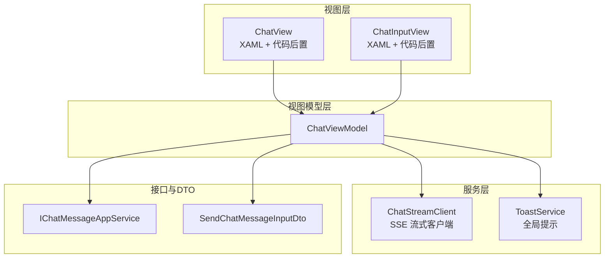
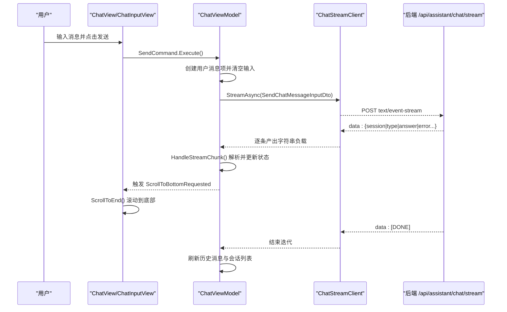
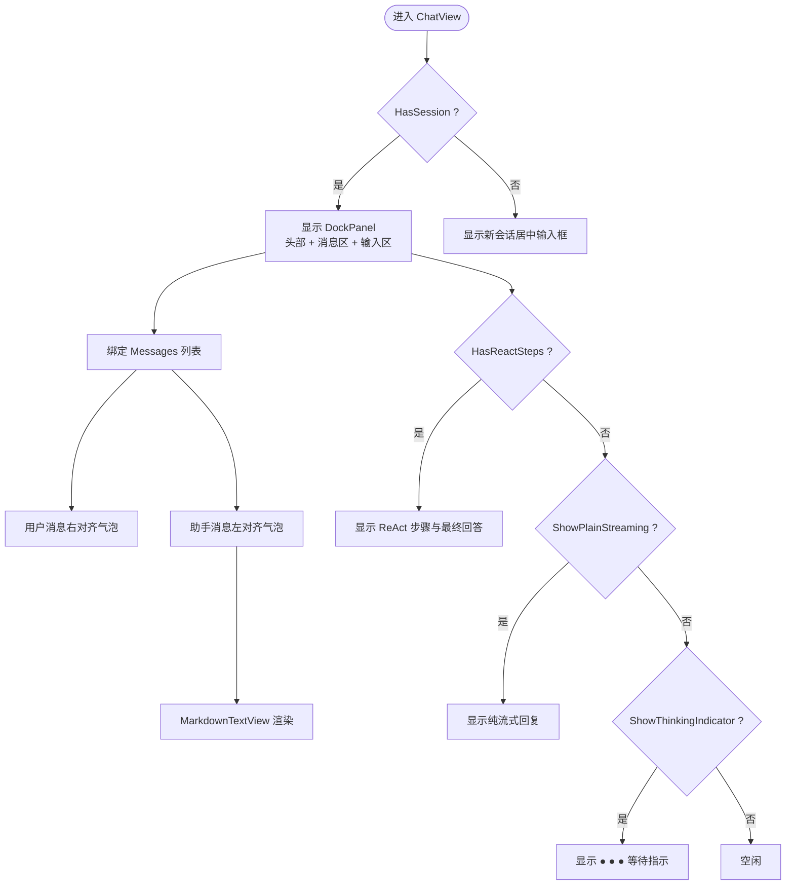
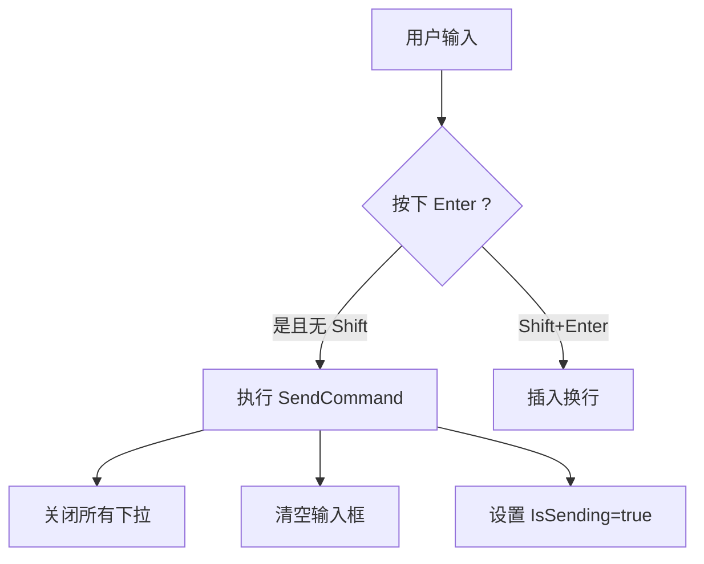
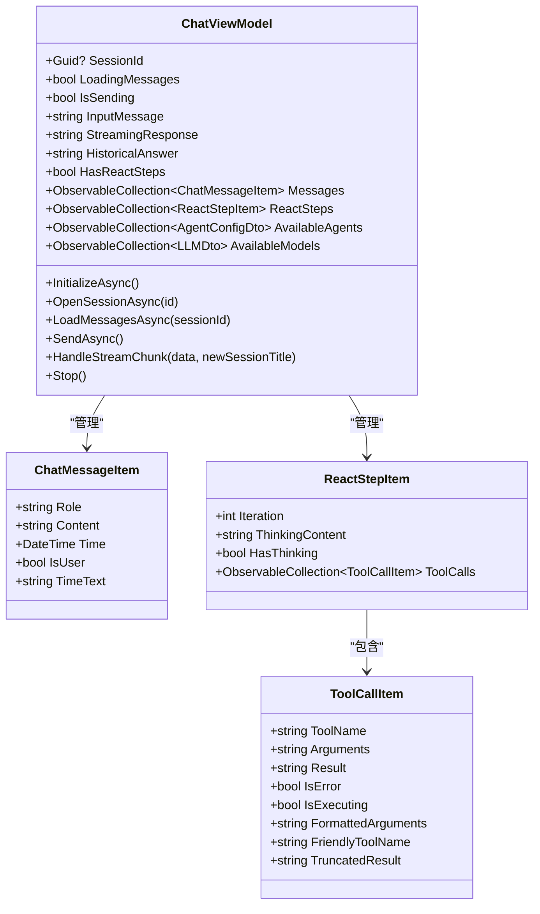
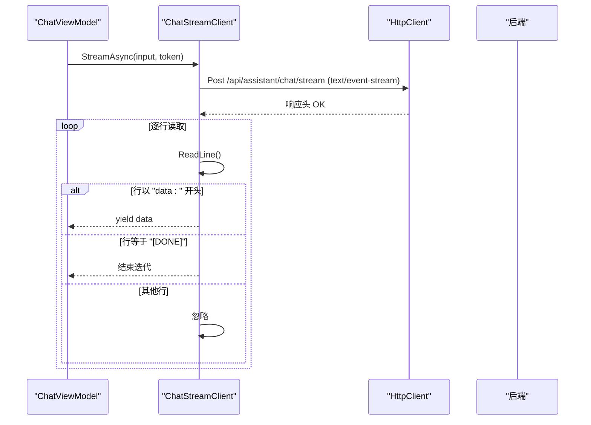
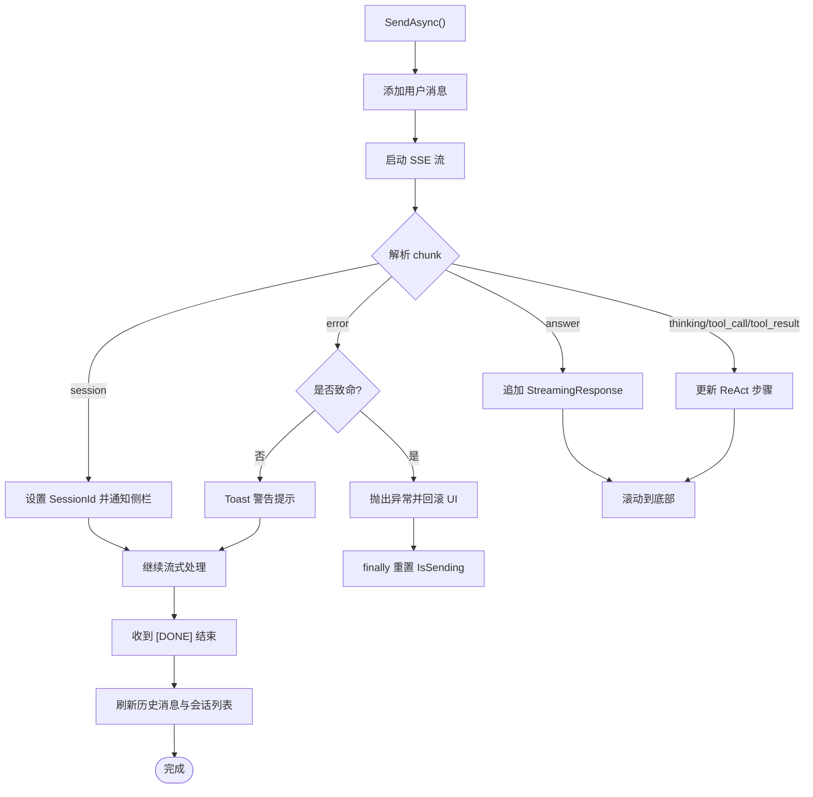
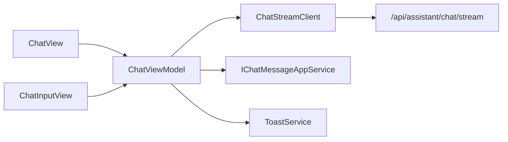

# 聊天界面组件

<cite>
**本文引用的文件**   
- [ChatView.axaml](file://src/Agent/Assistant/H.Assistant.Desktop/Views/ChatView.axaml)
- [ChatView.axaml.cs](file://src/Agent/Assistant/H.Assistant.Desktop/Views/ChatView.axaml.cs)
- [ChatInputView.axaml](file://src/Agent/Assistant/H.Assistant.Desktop/Views/ChatInputView.axaml)
- [ChatInputView.axaml.cs](file://src/Agent/Assistant/H.Assistant.Desktop/Views/ChatInputView.axaml.cs)
- [ChatViewModel.cs](file://src/Agent/Assistant/H.Assistant.Desktop/ViewModels/ChatViewModel.cs)
- [ChatStreamClient.cs](file://src/Agent/Assistant/H.Assistant.Desktop/Services/ChatStreamClient.cs)
- [ToastService.cs](file://src/Agent/Assistant/H.Assistant.Desktop/Services/ToastService.cs)
- [IChatMessageAppService.cs](file://src/Agent/Assistant/H.Assistant.Application.Contracts/Services/Chats/IChatMessageAppService.cs)
- [SendChatMessageInputDto.cs](file://src/Agent/Assistant/H.Assistant.Application.Contracts/Dtos/Chats/SendChatMessageInputDto.cs)
</cite>

## 目录
1. [简介](#简介)
2. [项目结构](#项目结构)
3. [核心组件](#核心组件)
4. [架构总览](#架构总览)
5. [详细组件分析](#详细组件分析)
6. [依赖关系分析](#依赖关系分析)
7. [性能考量](#性能考量)
8. [故障排查指南](#故障排查指南)
9. [结论](#结论)
10. [附录：定制与样式修改指南](#附录定制与样式修改指南)

## 简介
本文件面向 Avalonia Desktop 端的聊天界面组件，聚焦 ChatView 与 ChatInputView 的 XAML 布局设计与 C# 业务逻辑。内容涵盖消息列表展示、输入框处理、实时消息更新机制（SSE 流式响应）、Markdown 渲染集成、消息发送接收流程、错误处理与用户反馈，并提供界面定制与样式修改指南。

## 项目结构
聊天界面位于 H.Assistant.Desktop 模块中，采用 MVVM 模式：
- View：ChatView.axaml / ChatView.axaml.cs、ChatInputView.axaml / ChatInputView.axaml.cs
- ViewModel：ChatViewModel.cs
- Services：ChatStreamClient.cs（SSE 客户端）、ToastService.cs（全局提示）
- Contracts：IChatMessageAppService.cs、SendChatMessageInputDto.cs（与后端交互契约）

图表来源
- [ChatView.axaml:1-184](file://src/Agent/Assistant/H.Assistant.Desktop/Views/ChatView.axaml#L1-L184)
- [ChatView.axaml.cs:1-56](file://src/Agent/Assistant/H.Assistant.Desktop/Views/ChatView.axaml.cs#L1-L56)
- [ChatInputView.axaml:1-161](file://src/Agent/Assistant/H.Assistant.Desktop/Views/ChatInputView.axaml#L1-L161)
- [ChatInputView.axaml.cs:1-31](file://src/Agent/Assistant/H.Assistant.Desktop/Views/ChatInputView.axaml.cs#L1-L31)
- [ChatViewModel.cs:1-632](file://src/Agent/Assistant/H.Assistant.Desktop/ViewModels/ChatViewModel.cs#L1-L632)
- [ChatStreamClient.cs:1-63](file://src/Agent/Assistant/H.Assistant.Desktop/Services/ChatStreamClient.cs#L1-L63)
- [ToastService.cs:1-50](file://src/Agent/Assistant/H.Assistant.Desktop/Services/ToastService.cs#L1-L50)
- [IChatMessageAppService.cs:1-40](file://src/Agent/Assistant/H.Assistant.Application.Contracts/Services/Chats/IChatMessageAppService.cs#L1-L40)
- [SendChatMessageInputDto.cs:1-24](file://src/Agent/Assistant/H.Assistant.Application.Contracts/Dtos/Chats/SendChatMessageInputDto.cs#L1-L24)

章节来源
- [ChatView.axaml:1-184](file://src/Agent/Assistant/H.Assistant.Desktop/Views/ChatView.axaml#L1-L184)
- [ChatInputView.axaml:1-161](file://src/Agent/Assistant/H.Assistant.Desktop/Views/ChatInputView.axaml#L1-L161)
- [ChatViewModel.cs:1-632](file://src/Agent/Assistant/H.Assistant.Desktop/ViewModels/ChatViewModel.cs#L1-L632)

## 核心组件
- ChatView：会话主视图，包含头部拖拽区、消息滚动区、ReAct 步骤可视化、纯流式回复区域、等待指示器；支持自动滚动到底部。
- ChatInputView：底部输入控件，支持智能体/模型选择下拉、发送/停止按钮、Enter 发送与 Shift+Enter 换行。
- ChatViewModel：绑定数据与命令，管理会话状态、消息集合、流式响应、ReAct 步骤解析、错误提示与 UI 事件。
- ChatStreamClient：基于 HttpClient 的 SSE 流式读取，按 data: 行解析负载，遇到 [DONE] 结束。
- ToastService：统一的用户提示，支持 success/warning/error 类型与自动消失。

章节来源
- [ChatView.axaml:1-184](file://src/Agent/Assistant/H.Assistant.Desktop/Views/ChatView.axaml#L1-L184)
- [ChatInputView.axaml:1-161](file://src/Agent/Assistant/H.Assistant.Desktop/Views/ChatInputView.axaml#L1-L161)
- [ChatViewModel.cs:1-632](file://src/Agent/Assistant/H.Assistant.Desktop/ViewModels/ChatViewModel.cs#L1-L632)
- [ChatStreamClient.cs:1-63](file://src/Agent/Assistant/H.Assistant.Desktop/Services/ChatStreamClient.cs#L1-L63)
- [ToastService.cs:1-50](file://src/Agent/Assistant/H.Assistant.Desktop/Services/ToastService.cs#L1-L50)

## 架构总览
聊天界面的数据流遵循“视图 → 视图模型 → 服务 → 后端”的单向流，UI 通过 ObservableObject 属性变更驱动刷新。

图表来源
- [ChatInputView.axaml.cs:14-29](file://src/Agent/Assistant/H.Assistant.Desktop/Views/ChatInputView.axaml.cs#L14-L29)
- [ChatViewModel.cs:306-366](file://src/Agent/Assistant/H.Assistant.Desktop/ViewModels/ChatViewModel.cs#L306-L366)
- [ChatStreamClient.cs:24-61](file://src/Agent/Assistant/H.Assistant.Desktop/Services/ChatStreamClient.cs#L24-L61)
- [ChatView.axaml.cs:36-42](file://src/Agent/Assistant/H.Assistant.Desktop/Views/ChatView.axaml.cs#L36-L42)

## 详细组件分析

### ChatView（会话视图）
- 布局要点
  - DockPanel 顶部为可拖拽头部，显示当前 Agent 名称。
  - 中间为 ScrollViewer 包裹的消息列表 ItemsControl，区分用户与助手消息样式。
  - 底部固定 ChatInputView。
  - ReAct 步骤可视化区域与纯流式回复区域根据状态切换显示。
  - 新会话模式下居中显示输入框。
- 行为要点
  - 监听 DataContext 变化，订阅 ScrollToBottomRequested 事件，在后台优先级调度滚动到底部。
  - 提供结果标签颜色转换器（错误红/成功绿）。

图表来源
- [ChatView.axaml:7-175](file://src/Agent/Assistant/H.Assistant.Desktop/Views/ChatView.axaml#L7-L175)
- [ChatView.axaml.cs:19-42](file://src/Agent/Assistant/H.Assistant.Desktop/Views/ChatView.axaml.cs#L19-L42)

章节来源
- [ChatView.axaml:1-184](file://src/Agent/Assistant/H.Assistant.Desktop/Views/ChatView.axaml#L1-L184)
- [ChatView.axaml.cs:1-56](file://src/Agent/Assistant/H.Assistant.Desktop/Views/ChatView.axaml.cs#L1-L56)

### ChatInputView（输入控件）
- 布局要点
  - 无边框 TextBox 作为输入框，支持多行与水印提示。
  - 底部工具栏：智能体选择、模型选择、更多功能按钮；右侧发送/停止按钮。
  - 向上弹出的智能体与模型下拉面板，使用 ItemsControl 渲染选项。
- 行为要点
  - 拦截 KeyDown 事件：Enter 发送，Shift+Enter 换行。
  - 通过 DataContext 调用 ChatViewModel 的命令。

图表来源
- [ChatInputView.axaml:54-66](file://src/Agent/Assistant/H.Assistant.Desktop/Views/ChatInputView.axaml#L54-L66)
- [ChatInputView.axaml.cs:14-29](file://src/Agent/Assistant/H.Assistant.Desktop/Views/ChatInputView.axaml.cs#L14-L29)

章节来源
- [ChatInputView.axaml:1-161](file://src/Agent/Assistant/H.Assistant.Desktop/Views/ChatInputView.axaml#L1-L161)
- [ChatInputView.axaml.cs:1-31](file://src/Agent/Assistant/H.Assistant.Desktop/Views/ChatInputView.axaml.cs#L1-L31)

### ChatViewModel（业务逻辑中枢）
- 关键职责
  - 初始化可用智能体与模型配置，默认选中策略。
  - 打开/新建会话，加载历史消息，解析最后一条助手消息中的 ReAct 富内容。
  - 发送消息：追加用户消息、启动 SSE 流、增量更新 StreamingResponse 或 ReAct 步骤。
  - 错误处理：捕获异常并通过 ToastService 提示，必要时回滚 UI。
  - 停止生成：取消流式任务并重置状态。
- 数据结构
  - Messages：ObservableCollection<ChatMessageItem>
  - ReactSteps：ObservableCollection<ReactStepItem>
  - AvailableAgents / AvailableModels：下拉选项集合
  - StreamingResponse / HistoricalAnswer：流式与历史答案
- 重要方法
  - InitializeAsync、OpenSessionAsync、LoadMessagesAsync、SendAsync、HandleStreamChunk、Stop

图表来源
- [ChatViewModel.cs:14-114](file://src/Agent/Assistant/H.Assistant.Desktop/ViewModels/ChatViewModel.cs#L14-L114)
- [ChatViewModel.cs:522-632](file://src/Agent/Assistant/H.Assistant.Desktop/ViewModels/ChatViewModel.cs#L522-L632)

章节来源
- [ChatViewModel.cs:1-632](file://src/Agent/Assistant/H.Assistant.Desktop/ViewModels/ChatViewModel.cs#L1-L632)

### ChatStreamClient（SSE 流式客户端）
- 实现要点
  - 使用 HttpClientFactory 创建客户端，POST 到 /api/assistant/chat/stream，Accept: text/event-stream。
  - 逐行读取 StreamReader，过滤以 "data: " 开头的行，遇到 "[DONE]" 结束。
  - 返回 IAsyncEnumerable<string>，供 ViewModel 异步消费。

图表来源
- [ChatStreamClient.cs:24-61](file://src/Agent/Assistant/H.Assistant.Desktop/Services/ChatStreamClient.cs#L24-L61)

章节来源
- [ChatStreamClient.cs:1-63](file://src/Agent/Assistant/H.Assistant.Desktop/Services/ChatStreamClient.cs#L1-L63)

### Markdown 渲染集成
- ChatView 中使用 controls:MarkdownTextView 组件渲染助手消息与 ReAct 最终回答。
- 该组件在 XAML 中以 Markdown 属性绑定内容，由 Avalonia 自定义控件负责渲染。

章节来源
- [ChatView.axaml:60-66](file://src/Agent/Assistant/H.Assistant.Desktop/Views/ChatView.axaml#L60-L66)
- [ChatView.axaml:148-150](file://src/Agent/Assistant/H.Assistant.Desktop/Views/ChatView.axaml#L148-L150)

### 消息发送接收流程与错误处理
- 发送流程
  - 用户输入后触发 SendCommand，ViewModel 立即追加用户消息并清空输入。
  - 启动 SSE 流，逐条处理 JSON 事件（session、thinking、tool_call、tool_result、answer、error），更新 UI。
  - 完成后刷新历史消息并通知侧边栏刷新。
- 错误处理
  - 非致命错误通过 ToastService 提示（warning）。
  - 致命错误抛出异常并在 catch 中恢复输入与消息列表。
  - 用户主动停止时捕获 OperationCanceledException 并重置状态。

图表来源
- [ChatViewModel.cs:306-366](file://src/Agent/Assistant/H.Assistant.Desktop/ViewModels/ChatViewModel.cs#L306-L366)
- [ChatViewModel.cs:368-475](file://src/Agent/Assistant/H.Assistant.Desktop/ViewModels/ChatViewModel.cs#L368-L475)
- [ToastService.cs:23-48](file://src/Agent/Assistant/H.Assistant.Desktop/Services/ToastService.cs#L23-L48)

章节来源
- [ChatViewModel.cs:306-475](file://src/Agent/Assistant/H.Assistant.Desktop/ViewModels/ChatViewModel.cs#L306-L475)
- [ToastService.cs:1-50](file://src/Agent/Assistant/H.Assistant.Desktop/Services/ToastService.cs#L1-L50)

## 依赖关系分析
- 视图与视图模型：通过 DataContext 绑定，命令与属性变更驱动 UI。
- 视图模型与服务：依赖 ChatStreamClient 进行 SSE 通信，依赖 IChatMessageAppService 获取元数据（智能体、模型、历史消息）。
- 服务与接口：ChatStreamClient 使用 RemoteServiceOptions 与 ClientServices 确定后端地址。
- 提示服务：ToastService 被 ViewModel 用于错误与警告提示。

图表来源
- [ChatViewModel.cs:100-114](file://src/Agent/Assistant/H.Assistant.Desktop/ViewModels/ChatViewModel.cs#L100-L114)
- [ChatStreamClient.cs:13-31](file://src/Agent/Assistant/H.Assistant.Desktop/Services/ChatStreamClient.cs#L13-L31)
- [IChatMessageAppService.cs:8-39](file://src/Agent/Assistant/H.Assistant.Application.Contracts/Services/Chats/IChatMessageAppService.cs#L8-L39)

章节来源
- [ChatViewModel.cs:1-114](file://src/Agent/Assistant/H.Assistant.Desktop/ViewModels/ChatViewModel.cs#L1-L114)
- [ChatStreamClient.cs:1-63](file://src/Agent/Assistant/H.Assistant.Desktop/Services/ChatStreamClient.cs#L1-L63)
- [IChatMessageAppService.cs:1-40](file://src/Agent/Assistant/H.Assistant.Application.Contracts/Services/Chats/IChatMessageAppService.cs#L1-L40)

## 性能考量
- 流式渲染：SSE 逐条推送，避免一次性大文本导致卡顿；UI 仅在必要处滚动到底部。
- 集合操作：使用 ObservableCollection 增量更新，减少全量重绘。
- 文本截断：工具调用结果过长时进行截断显示，降低渲染压力。
- 异步与取消：流式处理支持 CancellationToken，及时中断无效请求。

[本节为通用指导，不直接分析具体文件]

## 故障排查指南
- 无法加载模型或智能体
  - 检查 IChatMessageAppService 调用是否成功，失败时静默处理或提示。
- 流式响应未出现
  - 确认 ChatStreamClient 是否正确设置 Accept: text/event-stream 与 baseUrl。
  - 查看后端是否返回 data: 前缀与 [DONE] 结束标记。
- 错误提示未显示
  - 检查 ToastService.Show 的类型参数与 UI 线程调度。
- 停止生成无效
  - 确认 _streamCts 是否被正确创建与取消，IsSending 是否重置。

章节来源
- [ChatViewModel.cs:139-161](file://src/Agent/Assistant/H.Assistant.Desktop/ViewModels/ChatViewModel.cs#L139-L161)
- [ChatStreamClient.cs:24-61](file://src/Agent/Assistant/H.Assistant.Desktop/Services/ChatStreamClient.cs#L24-L61)
- [ToastService.cs:23-48](file://src/Agent/Assistant/H.Assistant.Desktop/Services/ToastService.cs#L23-L48)
- [ChatViewModel.cs:477-482](file://src/Agent/Assistant/H.Assistant.Desktop/ViewModels/ChatViewModel.cs#L477-L482)

## 结论
ChatView 与 ChatInputView 通过清晰的 XAML 布局与 MVVM 架构实现了完整的聊天界面能力：消息列表展示、输入框交互、SSE 流式响应、ReAct 步骤可视化与 Markdown 渲染。结合 ChatStreamClient 与 ToastService，提供了稳定可靠的错误处理与用户反馈机制。整体设计易于扩展与定制，满足桌面端聊天场景需求。

[本节为总结性内容，不直接分析具体文件]

## 附录：定制与样式修改指南
- 主题与颜色
  - 修改 ChatView 中消息气泡背景色、头像背景色、时间文字颜色等，可在 XAML 中直接调整 Brush 值。
  - 结果标签颜色转换器 ResultLabelBrushConverter 支持错误/成功两种颜色，可按需扩展。
- 输入框样式
  - ChatInputView 内置 Style 去除边框与高亮，保持简洁外观；如需恢复边框，移除对应 Style 或覆盖 BorderThickness/BorderBrush。
  - 下拉面板样式可通过 Button.selectorBtn 与 Button.dropdownItem 的样式进行修改。
- 布局调整
  - 调整 DockPanel 的 Padding、Spacing、MaxWidth 等属性改变间距与宽度限制。
  - 新会话居中输入框的 Border 与 Padding 可调整以适配不同屏幕尺寸。
- Markdown 渲染
  - 若需自定义 Markdown 渲染效果，替换 controls:MarkdownTextView 的实现或在其外层包裹自定义容器。
- 交互行为
  - 键盘快捷键：Enter 发送、Shift+Enter 换行，可在 ChatInputView.axaml.cs 中扩展更多组合键。
  - 滚动行为：ScrollToBottomRequested 事件可在 ChatView 中增加惯性滚动或动画效果。

章节来源
- [ChatView.axaml:40-66](file://src/Agent/Assistant/H.Assistant.Desktop/Views/ChatView.axaml#L40-L66)
- [ChatView.axaml.cs:12-16](file://src/Agent/Assistant/H.Assistant.Desktop/Views/ChatView.axaml.cs#L12-L16)
- [ChatInputView.axaml:117-159](file://src/Agent/Assistant/H.Assistant.Desktop/Views/ChatInputView.axaml#L117-L159)
- [ChatInputView.axaml.cs:14-29](file://src/Agent/Assistant/H.Assistant.Desktop/Views/ChatInputView.axaml.cs#L14-L29)