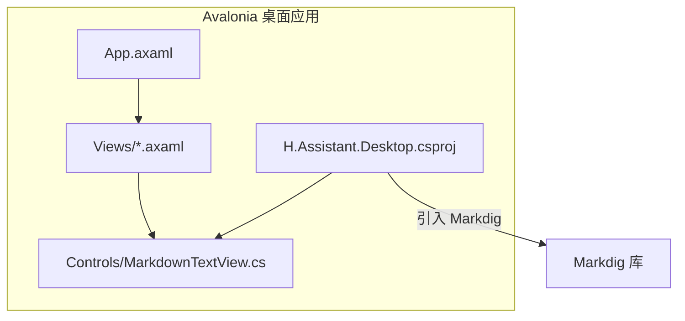
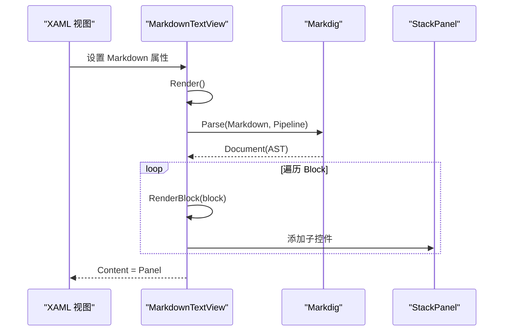
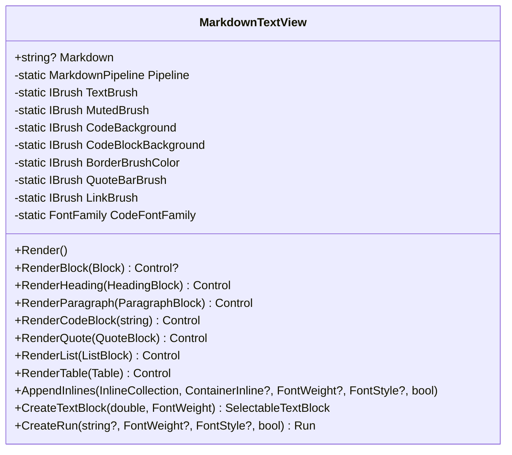
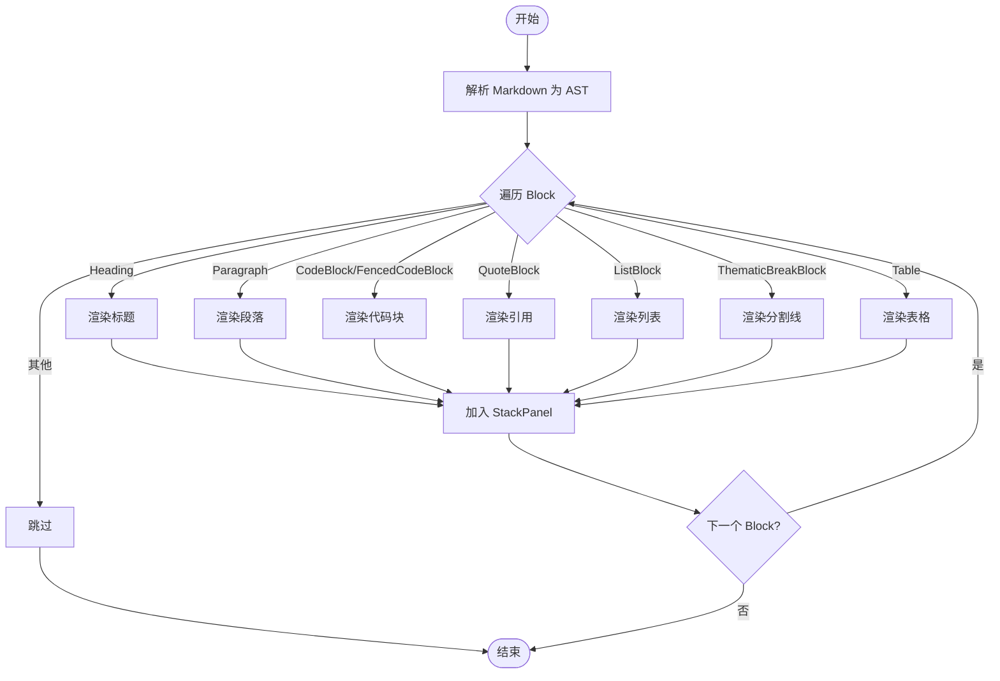
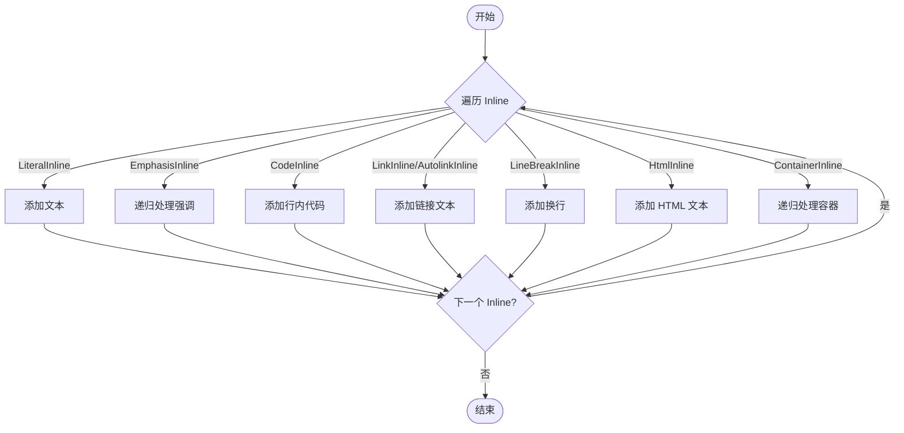
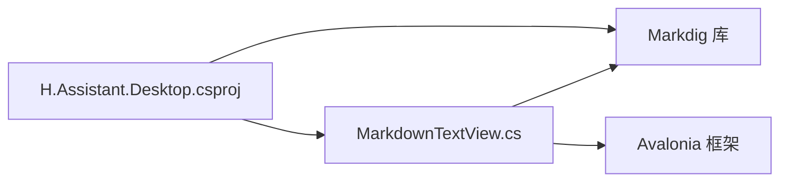

# 自定义控件

<cite>
**本文引用的文件**   
- [MarkdownTextView.cs](file://src/Agent/Assistant/H.Assistant.Desktop/Controls/MarkdownTextView.cs)
- [ChatView.axaml](file://src/Agent/Assistant/H.Assistant.Desktop/Views/ChatView.axaml)
- [KnowledgeSectionView.axaml](file://src/Agent/Assistant/H.Assistant.Desktop/Views/KnowledgeSectionView.axaml)
- [H.Assistant.Desktop.csproj](file://src/Agent/Assistant/H.Assistant.Desktop/H.Assistant.Desktop.csproj)
- [App.axaml](file://src/Agent/Assistant/H.Assistant.Desktop/App.axaml)
</cite>

## 目录
1. [简介](#简介)
2. [项目结构](#项目结构)
3. [核心组件](#核心组件)
4. [架构总览](#架构总览)
5. [详细组件分析](#详细组件分析)
6. [依赖关系分析](#依赖关系分析)
7. [性能与内存优化](#性能与内存优化)
8. [故障排查指南](#故障排查指南)
9. [结论](#结论)
10. [附录：使用示例与扩展指南](#附录使用示例与扩展指南)

## 简介
本文件面向开发者，系统化说明 Avalonia 桌面端自定义控件 MarkdownTextView 的设计、实现与使用方法。该控件基于 Markdig 解析 Markdown 文本，将 AST（抽象语法树）转换为 Avalonia UI 元素，支持标题、段落、代码块、引用、列表、表格、行内代码、链接等常见 Markdown 语法，并提供一致的视觉风格。文档涵盖属性绑定、事件处理、样式定制、性能优化、内存管理与跨平台兼容性建议，并给出扩展规范与最佳实践。

## 项目结构
MarkdownTextView 位于 Avalonia 桌面应用项目中，作为 Controls 命名空间下的自定义控件；在多个视图页面中通过 XAML 进行数据绑定与展示。

图表来源
- [App.axaml:1-286](file://src/Agent/Assistant/H.Assistant.Desktop/App.axaml#L1-L286)
- [ChatView.axaml:55-184](file://src/Agent/Assistant/H.Assistant.Desktop/Views/ChatView.axaml#L55-L184)
- [MarkdownTextView.cs:1-355](file://src/Agent/Assistant/H.Assistant.Desktop/Controls/MarkdownTextView.cs#L1-L355)
- [H.Assistant.Desktop.csproj:1-27](file://src/Agent/Assistant/H.Assistant.Desktop/H.Assistant.Desktop.csproj#L1-L27)

章节来源
- [H.Assistant.Desktop.csproj:1-27](file://src/Agent/Assistant/H.Assistant.Desktop/H.Assistant.Desktop.csproj#L1-L27)
- [App.axaml:1-286](file://src/Agent/Assistant/H.Assistant.Desktop/App.axaml#L1-L286)

## 核心组件
MarkdownTextView 是一个轻量级 Markdown 渲染控件，继承自 Avalonia 的 ContentControl，核心职责包括：
- 暴露 Markdown 属性用于双向或单向绑定
- 基于 Markdig Pipeline 解析 Markdown 为 AST
- 将 AST 节点映射为 Avalonia 控件树（StackPanel、TextBlock、Border、Grid 等）
- 提供统一的字体、颜色、间距等视觉风格

关键要点
- 使用静态 MarkdownPipeline，避免重复构建开销
- 使用 AvaloniaProperty 注册可绑定属性
- 通过属性变更回调触发渲染

章节来源
- [MarkdownTextView.cs:17-45](file://src/Agent/Assistant/H.Assistant.Desktop/Controls/MarkdownTextView.cs#L17-L45)
- [MarkdownTextView.cs:47-66](file://src/Agent/Assistant/H.Assistant.Desktop/Controls/MarkdownTextView.cs#L47-L66)

## 架构总览
MarkdownTextView 的渲染流程如下：
- 当 Markdown 属性变化时，触发 Render()
- Render() 调用 Markdig.Parse() 生成 Document（AST）
- 遍历 Block 节点，根据类型分派到对应渲染方法（标题、段落、代码块、引用、列表、表格等）
- 每个 Block 渲染为 Avalonia 控件并加入 StackPanel
- 最终将 StackPanel 设置为 Content

图表来源
- [MarkdownTextView.cs:47-66](file://src/Agent/Assistant/H.Assistant.Desktop/Controls/MarkdownTextView.cs#L47-L66)
- [MarkdownTextView.cs:68-91](file://src/Agent/Assistant/H.Assistant.Desktop/Controls/MarkdownTextView.cs#L68-L91)

章节来源
- [MarkdownTextView.cs:47-91](file://src/Agent/Assistant/H.Assistant.Desktop/Controls/MarkdownTextView.cs#L47-L91)

## 详细组件分析

### MarkdownTextView 类设计
- 继承 ContentControl，暴露 Markdown 属性
- 静态字段定义常用画笔与字体族，保证一致视觉风格
- 静态 MarkdownPipeline 复用，提升解析性能
- 属性变更监听，自动重绘

图表来源
- [MarkdownTextView.cs:17-355](file://src/Agent/Assistant/H.Assistant.Desktop/Controls/MarkdownTextView.cs#L17-L355)

章节来源
- [MarkdownTextView.cs:17-355](file://src/Agent/Assistant/H.Assistant.Desktop/Controls/MarkdownTextView.cs#L17-L355)

### Markdown 渲染与语法高亮
- 标题：按级别设置字号与加粗，前两级带下边框分隔
- 段落：普通文本，行内内容递归处理
- 代码块：使用 SelectableTextBlock 显示，固定等宽字体与背景色
- 引用：左侧竖线+浅灰背景，嵌套块递归渲染
- 列表：有序/无序列表，编号起始值支持，标记与内容分列布局
- 表格：动态行列定义，表头加粗与浅色背景，单元格内联内容渲染
- 行内代码：等宽字体、背景色与强调色
- 链接与图片：链接文本着色，图片以占位文本提示

图表来源
- [MarkdownTextView.cs:47-91](file://src/Agent/Assistant/H.Assistant.Desktop/Controls/MarkdownTextView.cs#L47-L91)
- [MarkdownTextView.cs:93-263](file://src/Agent/Assistant/H.Assistant.Desktop/Controls/MarkdownTextView.cs#L93-L263)

章节来源
- [MarkdownTextView.cs:93-263](file://src/Agent/Assistant/H.Assistant.Desktop/Controls/MarkdownTextView.cs#L93-L263)

### 行内内容与链接处理
- AppendInlines 递归处理 Inline 节点：
  - LiteralInline：直接添加文本
  - EmphasisInline：根据分隔符数量决定加粗/斜体
  - CodeInline：等宽字体、背景色与强调色
  - LinkInline/AutolinkInline：链接文本着色
  - LineBreakInline：换行
  - HtmlInline：HTML 片段转文本
  - ContainerInline：递归处理子容器
- CreateRun 统一创建 Run，支持权重、样式与链接颜色

图表来源
- [MarkdownTextView.cs:279-335](file://src/Agent/Assistant/H.Assistant.Desktop/Controls/MarkdownTextView.cs#L279-L335)
- [MarkdownTextView.cs:337-353](file://src/Agent/Assistant/H.Assistant.Desktop/Controls/MarkdownTextView.cs#L337-L353)

章节来源
- [MarkdownTextView.cs:279-353](file://src/Agent/Assistant/H.Assistant.Desktop/Controls/MarkdownTextView.cs#L279-L353)

### 属性绑定与事件处理
- 属性绑定：Markdown 属性通过 AvaloniaProperty 注册，XAML 中可直接绑定 ViewModel 字符串属性
- 事件处理：当前控件未暴露事件回调；如需交互（如点击链接），可在上层视图捕获并处理，或在控件内部扩展事件

使用示例路径
- ChatView.axaml 中多处绑定 Markdown 属性
- KnowledgeSectionView.axaml 中预览模式绑定 SelectedContent

章节来源
- [ChatView.axaml:55-184](file://src/Agent/Assistant/H.Assistant.Desktop/Views/ChatView.axaml#L55-L184)
- [KnowledgeSectionView.axaml:100-156](file://src/Agent/Assistant/H.Assistant.Desktop/Views/KnowledgeSectionView.axaml#L100-L156)

### 样式定制
- 控件内部使用硬编码颜色与字体族，便于快速统一风格
- 可通过外层样式覆盖 TextBlock、Border、Grid 等元素的样式
- 建议在 App.axaml 中定义全局样式，保持主题一致性

章节来源
- [MarkdownTextView.cs:27-35](file://src/Agent/Assistant/H.Assistant.Desktop/Controls/MarkdownTextView.cs#L27-L35)
- [App.axaml:25-286](file://src/Agent/Assistant/H.Assistant.Desktop/App.axaml#L25-L286)

## 依赖关系分析
- 外部依赖：Markdig 库用于 Markdown 解析与 AST 生成
- Avalonia 框架：UI 控件与属性系统
- 项目配置：csproj 中引入 Markdig 包

图表来源
- [MarkdownTextView.cs:1-10](file://src/Agent/Assistant/H.Assistant.Desktop/Controls/MarkdownTextView.cs#L1-L10)
- [H.Assistant.Desktop.csproj:1-27](file://src/Agent/Assistant/H.Assistant.Desktop/H.Assistant.Desktop.csproj#L1-L27)

章节来源
- [H.Assistant.Desktop.csproj:1-27](file://src/Agent/Assistant/H.Assistant.Desktop/H.Assistant.Desktop.csproj#L1-L27)

## 性能与内存优化
- 使用静态 MarkdownPipeline，避免每次解析重复构建管道
- 控制 Markdown 文本长度，避免超大文档导致 UI 卡顿
- 合理使用 ScrollViewer 包裹长内容，减少一次性渲染压力
- 避免频繁更新 Markdown 属性，必要时合并更新或使用防抖
- 注意 Avalonia 行高测量差异，控件已避免设置 LineSpacing，改用 LineHeight

章节来源
- [MarkdownTextView.cs:22-25](file://src/Agent/Assistant/H.Assistant.Desktop/Controls/MarkdownTextView.cs#L22-L25)
- [MarkdownTextView.cs:265-277](file://src/Agent/Assistant/H.Assistant.Desktop/Controls/MarkdownTextView.cs#L265-L277)

## 故障排查指南
- 渲染空白：检查 Markdown 是否为空或格式错误
- 链接无效果：当前控件未实现链接点击事件，需在上层视图处理
- 表格错位：确认表格列数与内容对齐，避免单元格缺失
- 代码块换行异常：确保文本包含换行符，控件会 TrimEnd('\n')
- 滚动区域底部内容不可见：避免设置 LineSpacing，控件已采用 LineHeight

章节来源
- [MarkdownTextView.cs:47-53](file://src/Agent/Assistant/H.Assistant.Desktop/Controls/MarkdownTextView.cs#L47-L53)
- [MarkdownTextView.cs:128-145](file://src/Agent/Assistant/H.Assistant.Desktop/Controls/MarkdownTextView.cs#L128-L145)
- [MarkdownTextView.cs:265-277](file://src/Agent/Assistant/H.Assistant.Desktop/Controls/MarkdownTextView.cs#L265-L277)

## 结论
MarkdownTextView 提供了简洁高效的 Markdown 渲染能力，适用于桌面端聊天、知识库预览、日志展示等场景。其基于 Markdig 的 AST 转换方式保证了语法兼容性与可扩展性。通过合理的属性绑定、样式定制与性能优化，可以在多平台上获得一致的阅读体验。未来可考虑增加链接点击事件、主题切换与更丰富的语法支持。

## 附录：使用示例与扩展指南

### 使用示例
- 在 XAML 中引入控件并绑定 Markdown 属性
- 在 ViewModel 中维护字符串属性，实时更新渲染内容
- 将控件置于 ScrollViewer 中以支持长内容滚动

示例路径
- [ChatView.axaml:55-184](file://src/Agent/Assistant/H.Assistant.Desktop/Views/ChatView.axaml#L55-L184)
- [KnowledgeSectionView.axaml:100-156](file://src/Agent/Assistant/H.Assistant.Desktop/Views/KnowledgeSectionView.axaml#L100-L156)

### 扩展指南
- 新增语法支持：在 RenderBlock 中添加新 Block 类型的分支，实现对应渲染逻辑
- 行内语法扩展：在 AppendInlines 中处理新的 Inline 类型
- 事件处理：为链接或代码块添加点击事件回调，并在上层视图订阅
- 主题定制：将颜色与字体族提取为可配置属性，支持运行时切换

章节来源
- [MarkdownTextView.cs:68-91](file://src/Agent/Assistant/H.Assistant.Desktop/Controls/MarkdownTextView.cs#L68-L91)
- [MarkdownTextView.cs:279-335](file://src/Agent/Assistant/H.Assistant.Desktop/Controls/MarkdownTextView.cs#L279-L335)