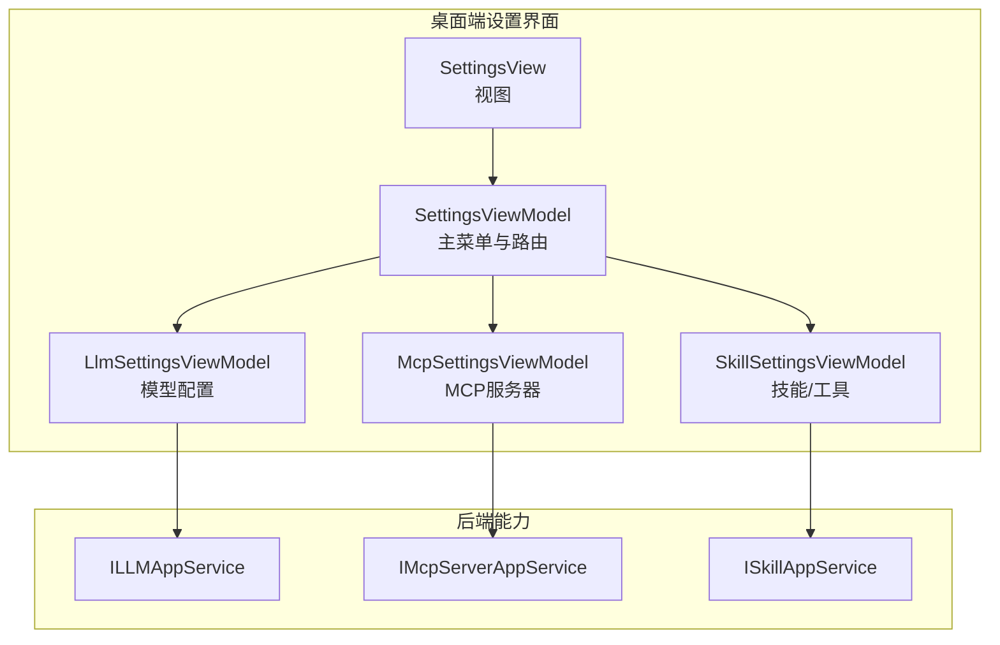
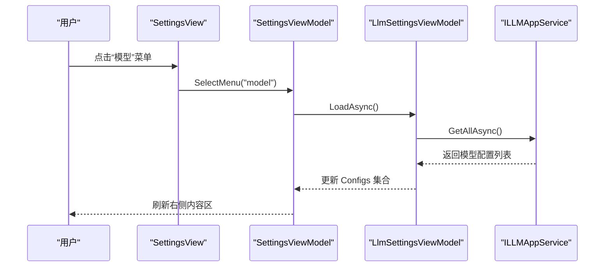
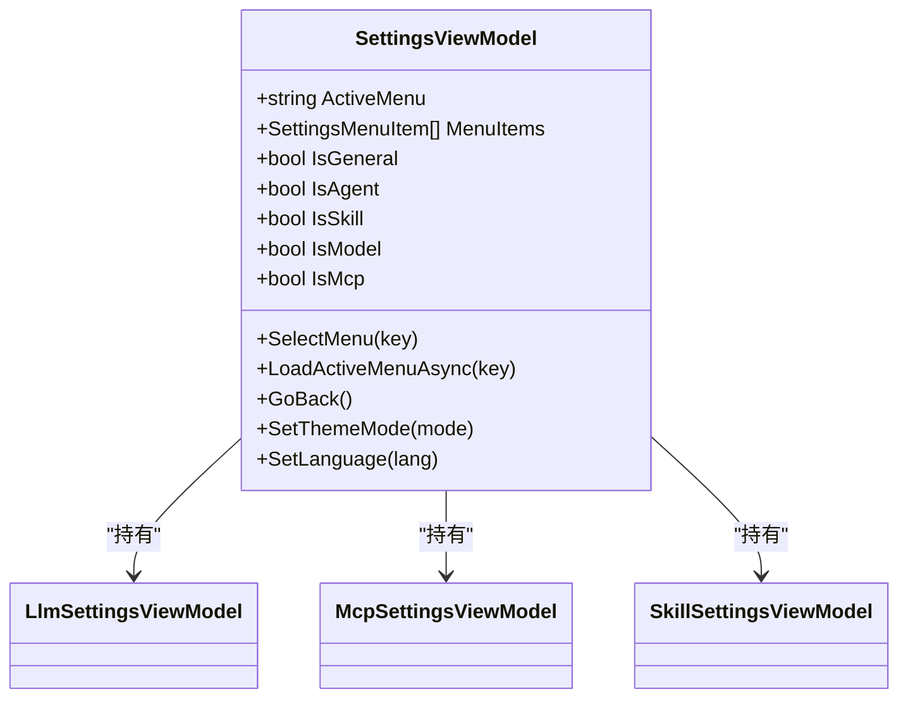
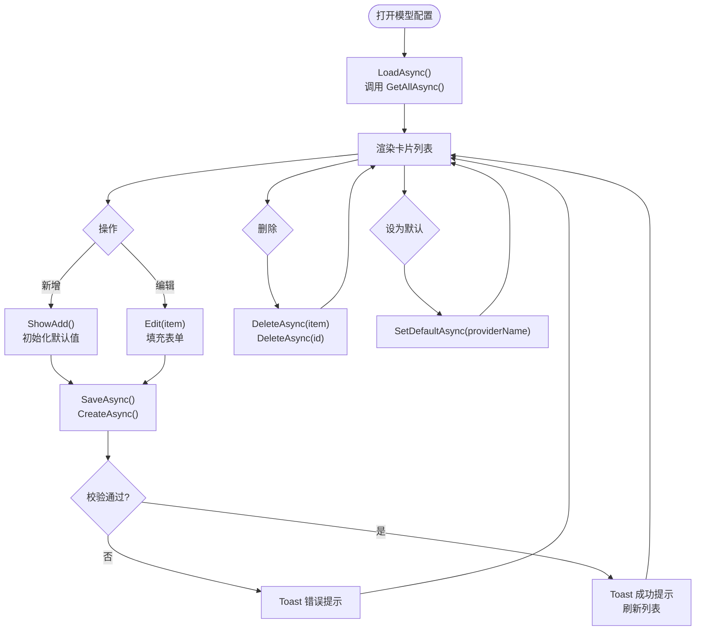
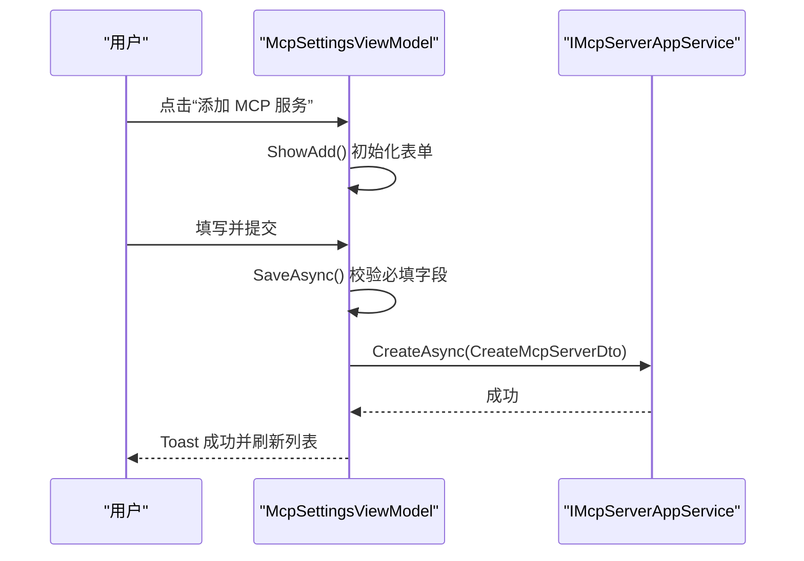
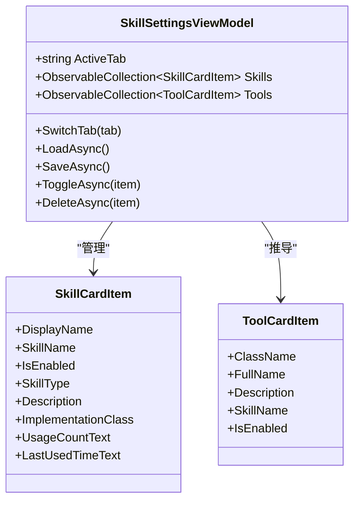
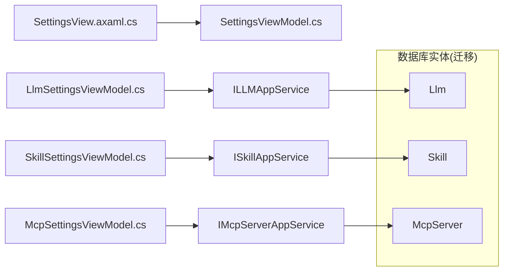

# 设置界面组件

<cite>
**本文引用的文件**   
- [SettingsView.axaml.cs](file://src/Agent/Assistant/H.Assistant.Desktop/Views/SettingsView.axaml.cs)
- [SettingsViewModel.cs](file://src/Agent/Assistant/H.Assistant.Desktop/ViewModels/SettingsViewModel.cs)
- [LlmSettingsView.axaml.cs](file://src/Agent/Assistant/H.Assistant.Desktop/Views/LlmSettingsView.axaml.cs)
- [LlmSettingsViewModel.cs](file://src/Agent/Assistant/H.Assistant.Desktop/ViewModels/LlmSettingsViewModel.cs)
- [McpSettingsView.axaml.cs](file://src/Agent/Assistant/H.Assistant.Desktop/Views/McpSettingsView.axaml.cs)
- [McpSettingsViewModel.cs](file://src/Agent/Assistant/H.Assistant.Desktop/ViewModels/McpSettingsViewModel.cs)
- [SkillSettingsView.axaml.cs](file://src/Agent/Assistant/H.Assistant.Desktop/Views/SkillSettingsView.axaml.cs)
- [SkillSettingsViewModel.cs](file://src/Agent/Assistant/H.Assistant.Desktop/ViewModels/SkillSettingsViewModel.cs)
- [20260604021506_Init.cs](file://src/Tools/H.Assistant.DbMigrator/Migrations/20260604021506_Init.cs)
- [AssistantDbContextModelSnapshot.cs](file://src/Tools/H.Assistant.DbMigrator/Migrations/AssistantDbContextModelSnapshot.cs)
</cite>

## 目录
1. [简介](#简介)
2. [项目结构](#项目结构)
3. [核心组件](#核心组件)
4. [架构总览](#架构总览)
5. [详细组件分析](#详细组件分析)
6. [依赖关系分析](#依赖关系分析)
7. [性能考虑](#性能考虑)
8. [故障排查指南](#故障排查指南)
9. [结论](#结论)
10. [附录：扩展与自定义配置项指南](#附录扩展与自定义配置项指南)

## 简介
本文件面向“设置界面组件”的完整说明，覆盖桌面端 Avalonia 设置页（SettingsView）及其子页面（LLM、MCP、技能等）的布局与交互、配置管理、验证与保存恢复、默认值处理、动态表单生成、热重载与错误提示。同时提供扩展与自定义配置项的实操指南，帮助开发者快速接入新的设置模块。

## 项目结构
设置界面采用 MVVM 模式：
- 视图层（Avalonia UserControl）：负责 XAML 布局与事件转发
- 视图模型层（CommunityToolkit.Mvvm ObservableObject + RelayCommand）：承载状态、命令、数据加载与校验
- 应用服务层（AppService 接口）：通过远程服务或本地仓储完成配置的持久化与查询

图表来源
- [SettingsViewModel.cs:11-68](file://src/Agent/Assistant/H.Assistant.Desktop/ViewModels/SettingsViewModel.cs#L11-L68)
- [LlmSettingsViewModel.cs:91-95](file://src/Agent/Assistant/H.Assistant.Desktop/ViewModels/LlmSettingsViewModel.cs#L91-L95)
- [McpSettingsViewModel.cs:77-81](file://src/Agent/Assistant/H.Assistant.Desktop/ViewModels/McpSettingsViewModel.cs#L77-L81)
- [SkillSettingsViewModel.cs:88-92](file://src/Agent/Assistant/H.Assistant.Desktop/ViewModels/SkillSettingsViewModel.cs#L88-L92)

章节来源
- [SettingsView.axaml.cs:1-12](file://src/Agent/Assistant/H.Assistant.Desktop/Views/SettingsView.axaml.cs#L1-L12)
- [SettingsViewModel.cs:1-121](file://src/Agent/Assistant/H.Assistant.Desktop/ViewModels/SettingsViewModel.cs#L1-L121)

## 核心组件
- SettingsViewModel：设置页主控制器，维护左侧菜单、当前激活项、通用主题与语言切换；按菜单键懒加载对应子模块数据。
- LlmSettingsViewModel：模型提供商与模型实例的配置管理，包含预设 Provider 定义、添加/编辑/删除/设默认、参数校验与 Toast 反馈。
- McpSettingsViewModel：MCP 服务器的增删改查、启用/禁用、传输类型选择、超时与认证信息配置。
- SkillSettingsViewModel：技能与工具的 Tab 管理，支持 Function/Plugin/Workflow 类型，基于实现类推导 Tool 列表，支持启用/禁用、审批开关与参数 Schema。

章节来源
- [SettingsViewModel.cs:11-121](file://src/Agent/Assistant/H.Assistant.Desktop/ViewModels/SettingsViewModel.cs#L11-L121)
- [LlmSettingsViewModel.cs:12-310](file://src/Agent/Assistant/H.Assistant.Desktop/ViewModels/LlmSettingsViewModel.cs#L12-L310)
- [McpSettingsViewModel.cs:12-256](file://src/Agent/Assistant/H.Assistant.Desktop/ViewModels/McpSettingsViewModel.cs#L12-L256)
- [SkillSettingsViewModel.cs:12-298](file://src/Agent/Assistant/H.Assistant.Desktop/ViewModels/SkillSettingsViewModel.cs#L12-L298)

## 架构总览
设置界面通过 ViewModel 调用 AppService 接口完成数据的读取与持久化。UI 层仅负责展示与用户交互，业务逻辑集中在 ViewModel 中，便于测试与维护。

图表来源
- [SettingsViewModel.cs:70-93](file://src/Agent/Assistant/H.Assistant.Desktop/ViewModels/SettingsViewModel.cs#L70-L93)
- [LlmSettingsViewModel.cs:113-134](file://src/Agent/Assistant/H.Assistant.Desktop/ViewModels/LlmSettingsViewModel.cs#L113-L134)

## 详细组件分析

### SettingsView 与 SettingsViewModel
- 职责
  - 左侧菜单渲染与选中态切换
  - 根据 ActiveMenu 懒加载各子模块数据
  - 通用设置（主题、语言）为本地状态，不持久化
- 关键行为
  - SelectMenu(key) 触发 LoadActiveMenuAsync，按 key 分发到对应子模块 LoadAsync
  - GoBack 用于返回上一级页面
  - SetThemeMode/SetLanguage 更新本地状态并驱动 UI 变化

图表来源
- [SettingsViewModel.cs:11-68](file://src/Agent/Assistant/H.Assistant.Desktop/ViewModels/SettingsViewModel.cs#L11-L68)

章节来源
- [SettingsView.axaml.cs:1-12](file://src/Agent/Assistant/H.Assistant.Desktop/Views/SettingsView.axaml.cs#L1-L12)
- [SettingsViewModel.cs:11-121](file://src/Agent/Assistant/H.Assistant.Desktop/ViewModels/SettingsViewModel.cs#L11-L121)

### LLM 配置（模型管理）
- 功能要点
  - 预设 Provider 定义（名称、显示名、默认 Endpoint、API Key 获取链接、可用模型类型与模型列表）
  - 新增/编辑弹窗，支持选择 Provider、类型、模型建议、自定义 BaseUrl、API Key/Secret、MaxTokens、Temperature、是否启用
  - 列表展示卡片，支持设为默认、删除、启用/禁用
  - 输入校验与错误提示（Toast），保存后自动刷新
- 数据流
  - LoadAsync 调用 ILLMAppService.GetAllAsync 拉取配置
  - SaveAsync 根据 IsEditing 决定 CreateAsync 或 UpdateAsync
  - SetDefaultAsync/DeleteAsync 分别调用对应接口

图表来源
- [LlmSettingsViewModel.cs:113-134](file://src/Agent/Assistant/H.Assistant.Desktop/ViewModels/LlmSettingsViewModel.cs#L113-L134)
- [LlmSettingsViewModel.cs:136-175](file://src/Agent/Assistant/H.Assistant.Desktop/ViewModels/LlmSettingsViewModel.cs#L136-L175)
- [LlmSettingsViewModel.cs:177-251](file://src/Agent/Assistant/H.Assistant.Desktop/ViewModels/LlmSettingsViewModel.cs#L177-L251)
- [LlmSettingsViewModel.cs:253-281](file://src/Agent/Assistant/H.Assistant.Desktop/ViewModels/LlmSettingsViewModel.cs#L253-L281)

章节来源
- [LlmSettingsView.axaml.cs:1-19](file://src/Agent/Assistant/H.Assistant.Desktop/Views/LlmSettingsView.axaml.cs#L1-L19)
- [LlmSettingsViewModel.cs:12-310](file://src/Agent/Assistant/H.Assistant.Desktop/ViewModels/LlmSettingsViewModel.cs#L12-L310)

### MCP 服务器设置
- 功能要点
  - 传输类型选项：SSE、HTTP、Stdio
  - 新增/编辑弹窗：名称、显示名、Endpoint、传输类型、Auth Token、API Key、Headers、超时秒数、是否启用
  - 列表操作：启用/禁用、删除
- 数据流
  - LoadAsync 调用 IMcpServerAppService.GetAllAsync
  - SaveAsync 根据 IsEditing 调用 CreateAsync 或 UpdateAsync
  - ToggleAsync 调用 ToggleEnabledAsync

图表来源
- [McpSettingsViewModel.cs:83-104](file://src/Agent/Assistant/H.Assistant.Desktop/ViewModels/McpSettingsViewModel.cs#L83-L104)
- [McpSettingsViewModel.cs:106-121](file://src/Agent/Assistant/H.Assistant.Desktop/ViewModels/McpSettingsViewModel.cs#L106-L121)
- [McpSettingsViewModel.cs:147-199](file://src/Agent/Assistant/H.Assistant.Desktop/ViewModels/McpSettingsViewModel.cs#L147-L199)
- [McpSettingsViewModel.cs:201-229](file://src/Agent/Assistant/H.Assistant.Desktop/ViewModels/McpSettingsViewModel.cs#L201-L229)

章节来源
- [McpSettingsView.axaml.cs:1-19](file://src/Agent/Assistant/H.Assistant.Desktop/Views/McpSettingsView.axaml.cs#L1-L19)
- [McpSettingsViewModel.cs:12-256](file://src/Agent/Assistant/H.Assistant.Desktop/ViewModels/McpSettingsViewModel.cs#L12-L256)

### 技能管理（Skill/Tool）
- 功能要点
  - 双 Tab：Skill 与 Tool
  - 技能类型：Function、Plugin、Workflow
  - Tool 列表由技能的 ImplementationClass 分组推导
  - 支持启用/禁用、审批开关、参数 Schema、描述与实现类配置
- 数据流
  - LoadAsync 调用 ISkillAppService.GetListAsync，构建 Skills 与 Tools
  - SaveAsync 根据 IsEditing 调用 CreateAsync 或 UpdateAsync
  - ToggleAsync 调用 ToggleEnabledAsync

图表来源
- [SkillSettingsViewModel.cs:12-92](file://src/Agent/Assistant/H.Assistant.Desktop/ViewModels/SkillSettingsViewModel.cs#L12-L92)
- [SkillSettingsViewModel.cs:100-140](file://src/Agent/Assistant/H.Assistant.Desktop/ViewModels/SkillSettingsViewModel.cs#L100-L140)
- [SkillSettingsViewModel.cs:184-234](file://src/Agent/Assistant/H.Assistant.Desktop/ViewModels/SkillSettingsViewModel.cs#L184-L234)
- [SkillSettingsViewModel.cs:270-298](file://src/Agent/Assistant/H.Assistant.Desktop/ViewModels/SkillSettingsViewModel.cs#L270-L298)

章节来源
- [SkillSettingsView.axaml.cs:1-19](file://src/Agent/Assistant/H.Assistant.Desktop/Views/SkillSettingsView.axaml.cs#L1-L19)
- [SkillSettingsViewModel.cs:12-298](file://src/Agent/Assistant/H.Assistant.Desktop/ViewModels/SkillSettingsViewModel.cs#L12-L298)

## 依赖关系分析
- 视图与视图模型解耦：UserControl 仅处理初始化与事件转发，业务逻辑在 ViewModel
- ViewModel 依赖 AppService 接口，屏蔽具体实现（远程服务或本地仓储）
- 数据实体与数据库迁移脚本映射了 LLM、Skill、MCP Server 等实体的结构与约束

图表来源
- [SettingsViewModel.cs:11-68](file://src/Agent/Assistant/H.Assistant.Desktop/ViewModels/SettingsViewModel.cs#L11-L68)
- [20260604021506_Init.cs:81-99](file://src/Tools/H.Assistant.DbMigrator/Migrations/20260604021506_Init.cs#L81-L99)
- [AssistantDbContextModelSnapshot.cs:368-385](file://src/Tools/H.Assistant.DbMigrator/Migrations/AssistantDbContextModelSnapshot.cs#L368-L385)

章节来源
- [20260604021506_Init.cs:81-99](file://src/Tools/H.Assistant.DbMigrator/Migrations/20260604021506_Init.cs#L81-L99)
- [AssistantDbContextModelSnapshot.cs:368-385](file://src/Tools/H.Assistant.DbMigrator/Migrations/AssistantDbContextModelSnapshot.cs#L368-L385)

## 性能考虑
- 懒加载：SettingsViewModel 仅在菜单切换时加载对应子模块数据，避免一次性加载全部
- 列表渲染：使用 ObservableCollection 绑定，增量更新减少重绘
- 网络请求：所有 LoadAsync 均包裹 Loading 状态，防止重复提交与频繁刷新
- 错误处理：异常捕获后以 Toast 提示，避免阻塞 UI

[本节为通用指导，无需特定文件引用]

## 故障排查指南
- 常见问题
  - 列表为空：检查 LoadAsync 是否被调用、AppService 是否返回空、Loading 状态是否正确重置
  - 保存失败：确认必填字段校验逻辑（如模型名称、API Key、MCP 名称/端点、技能名称/显示名/描述）
  - 权限或网络错误：查看 Toast 错误消息，定位具体接口调用位置
- 调试建议
  - 在 ViewModel 的 SaveAsync/ToggleAsync/DeleteAsync 中增加日志输出
  - 检查 AppService 接口的返回值与异常信息
  - 对 LLM 的 API Key 掩码显示进行核对，确保敏感信息不被泄露

章节来源
- [LlmSettingsViewModel.cs:199-251](file://src/Agent/Assistant/H.Assistant.Desktop/ViewModels/LlmSettingsViewModel.cs#L199-L251)
- [McpSettingsViewModel.cs:147-199](file://src/Agent/Assistant/H.Assistant.Desktop/ViewModels/McpSettingsViewModel.cs#L147-L199)
- [SkillSettingsViewModel.cs:184-234](file://src/Agent/Assistant/H.Assistant.Desktop/ViewModels/SkillSettingsViewModel.cs#L184-L234)

## 结论
设置界面组件通过清晰的 MVVM 分层与统一的 AppService 抽象，实现了 LLM、MCP、技能等配置模块的可扩展管理与良好用户体验。通过预设 Provider、动态表单、校验与 Toast 反馈，以及懒加载与错误处理，整体具备高可维护性与可扩展性。

[本节为总结，无需特定文件引用]

## 附录：扩展与自定义配置项指南
- 新增设置模块步骤
  - 创建 ViewModel：继承 ObservableObject，使用 [ObservableProperty]/[RelayCommand] 声明状态与命令
  - 创建 View：Avalonia UserControl，仅处理初始化与事件转发（如关闭弹窗）
  - 集成到 SettingsViewModel：在 MenuItems 中添加新菜单项，并在 LoadActiveMenuAsync 中分发加载
  - 对接 AppService：定义或复用 IAppService 接口，实现 Create/Update/Delete/GetAll 等方法
  - 数据持久化：若涉及数据库，需补充 Entity 与迁移脚本（参考现有 LLM/Skill/MCP 迁移）
- 动态表单生成
  - 对于复杂配置（如 ParameterSchema），可在前端按 Schema 动态渲染表单控件，并在提交前执行校验
  - 校验规则建议在 AppService 层统一实现，保证前后端一致性
- 配置热重载
  - 在 AppService 层监听配置文件变更或数据库变更事件，通知前端重新加载对应模块
  - 前端可通过事件总线或订阅机制触发 LoadAsync 刷新
- 错误提示与默认值
  - 所有保存/删除/切换操作均需捕获异常并以 Toast 反馈
  - 默认值应在 ShowAdd 中初始化，确保首次使用体验一致

[本节为通用指导，无需特定文件引用]