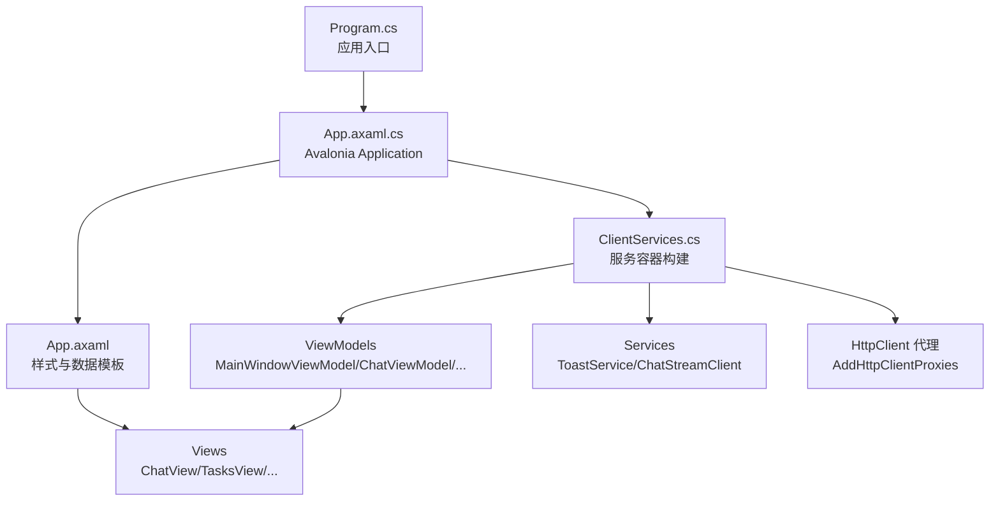
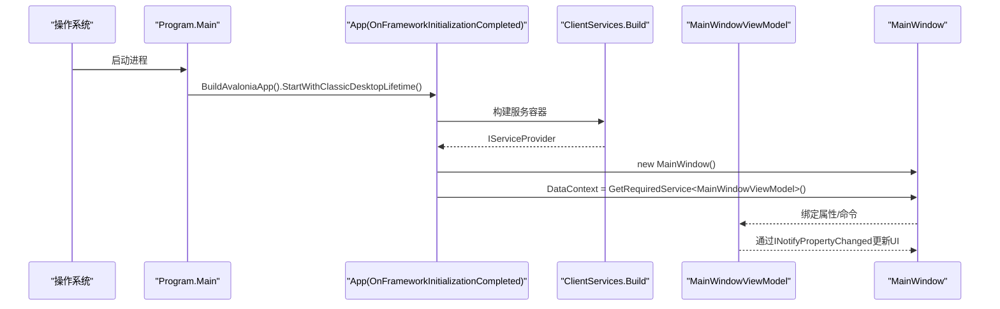
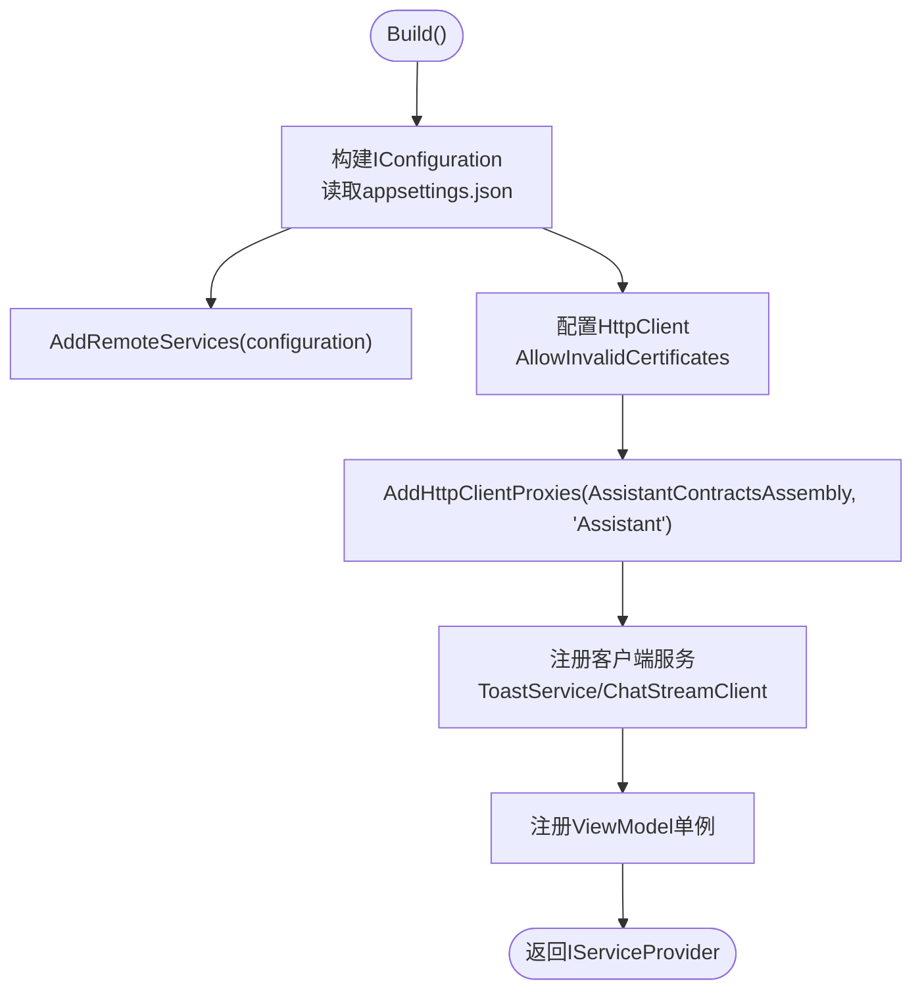
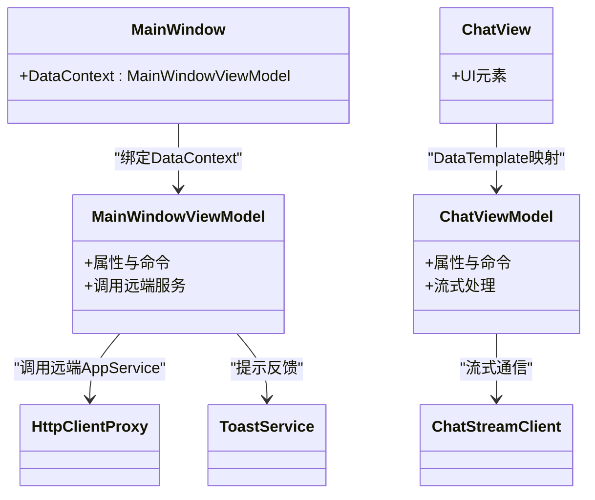
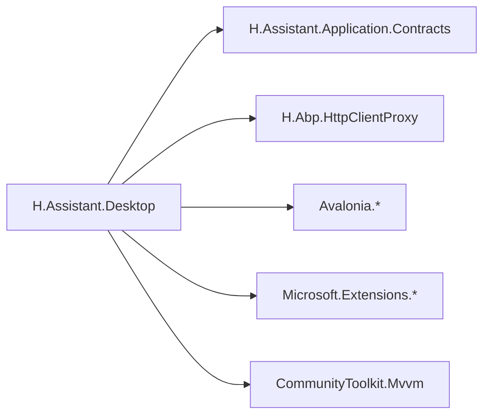

# 应用架构设计

<cite>
**本文引用的文件**   
- [Program.cs](file://src/Agent/Assistant/H.Assistant.Desktop/Program.cs)
- [App.axaml.cs](file://src/Agent/Assistant/H.Assistant.Desktop/App.axaml.cs)
- [App.axaml](file://src/Agent/Assistant/H.Assistant.Desktop/App.axaml)
- [ClientServices.cs](file://src/Agent/Assistant/H.Assistant.Desktop/ClientServices.cs)
- [Converters.cs](file://src/Agent/Assistant/H.Assistant.Desktop/Converters.cs)
- [appsettings.json](file://src/Agent/Assistant/H.Assistant.Desktop/appsettings.json)
- [H.Assistant.Desktop.csproj](file://src/Agent/Assistant/H.Assistant.Desktop/H.Assistant.Desktop.csproj)
</cite>

## 目录
1. [简介](#简介)
2. [项目结构](#项目结构)
3. [核心组件](#核心组件)
4. [架构总览](#架构总览)
5. [详细组件分析](#详细组件分析)
6. [依赖关系分析](#依赖关系分析)
7. [性能考虑](#性能考虑)
8. [故障排查指南](#故障排查指南)
9. [结论](#结论)
10. [附录](#附录)

## 简介
本文件面向AI助手桌面端应用的架构设计说明，聚焦基于Avalonia框架的MVVM模式实现。文档覆盖应用程序启动流程、依赖注入配置与模块组织；详解App.axaml中的全局配置与样式定义；解释Program.cs中的应用初始化逻辑与服务注册；阐述视图模型与视图的绑定机制和数据流管理；并给出跨平台兼容性考虑、资源管理策略、扩展点与自定义组件集成方案。

## 项目结构
桌面客户端位于 Agent/Assistant/H.Assistant.Desktop 目录下，采用Avalonia + MVVM + 依赖注入（Microsoft.Extensions.DependencyInjection）的组织方式：
- Program.cs：进程入口，构建Avalonia AppBuilder并启动经典桌面生命周期。
- App.axaml / App.axaml.cs：应用XAML与代码后置，负责加载样式、数据模板、创建主窗口并注入DataContext。
- ClientServices.cs：集中注册服务、HTTP代理、ViewModel与基础能力（如Toast、ChatStream）。
- Converters.cs：共享值转换器，用于UI状态到视觉属性的转换。
- appsettings.json：远程服务地址、HTTP证书策略等运行时配置。
- H.Assistant.Desktop.csproj：项目引用与打包配置，启用Avalonia相关包与Abp HttpClientProxy。

**图表来源** 
- [Program.cs:1-20](file://src/Agent/Assistant/H.Assistant.Desktop/Program.cs#L1-L20)
- [App.axaml.cs:1-37](file://src/Agent/Assistant/H.Assistant.Desktop/App.axaml.cs#L1-L37)
- [App.axaml:1-286](file://src/Agent/Assistant/H.Assistant.Desktop/App.axaml#L1-L286)
- [ClientServices.cs:1-61](file://src/Agent/Assistant/H.Assistant.Desktop/ClientServices.cs#L1-L61)

**章节来源**
- [Program.cs:1-20](file://src/Agent/Assistant/H.Assistant.Desktop/Program.cs#L1-L20)
- [App.axaml.cs:1-37](file://src/Agent/Assistant/H.Assistant.Desktop/App.axaml.cs#L1-L37)
- [App.axaml:1-286](file://src/Agent/Assistant/H.Assistant.Desktop/App.axaml#L1-L286)
- [ClientServices.cs:1-61](file://src/Agent/Assistant/H.Assistant.Desktop/ClientServices.cs#L1-L61)
- [H.Assistant.Desktop.csproj:1-27](file://src/Agent/Assistant/H.Assistant.Desktop/H.Assistant.Desktop.csproj#L1-L27)

## 核心组件
- 应用入口与生命周期
  - Program.Main 调用 BuildAvaloniaApp 并启动经典桌面生命周期。
  - App.OnFrameworkInitializationCompleted 中构建服务容器，设置 MainWindow 的 DataContext。
- 依赖注入与服务注册
  - ClientServices.Build 构建 ServiceCollection，注册 IConfiguration、RemoteServices、HttpClient、Abp HttpClientProxy、ViewModel与客户端服务。
- 样式与数据模板
  - App.axaml 声明 FluentTheme、按钮/标签/表单/卡片/Tab等样式，以及 ViewModel 到 View 的数据模板映射。
- 值转换器
  - Converters.cs 提供开关颜色、滑块位置、透明度、字符串转画刷等常用转换器。

**章节来源**
- [Program.cs:1-20](file://src/Agent/Assistant/H.Assistant.Desktop/Program.cs#L1-L20)
- [App.axaml.cs:1-37](file://src/Agent/Assistant/H.Assistant.Desktop/App.axaml.cs#L1-L37)
- [ClientServices.cs:1-61](file://src/Agent/Assistant/H.Assistant.Desktop/ClientServices.cs#L1-L61)
- [App.axaml:1-286](file://src/Agent/Assistant/H.Assistant.Desktop/App.axaml#L1-L286)
- [Converters.cs:1-31](file://src/Agent/Assistant/H.Assistant.Desktop/Converters.cs#L1-L31)

## 架构总览
整体遵循“入口 -> Avalonia应用 -> 依赖注入 -> 视图模型 -> 视图”的单向数据流，结合Abp HttpClientProxy对远端AppService进行透明调用。

**图表来源** 
- [Program.cs:1-20](file://src/Agent/Assistant/H.Assistant.Desktop/Program.cs#L1-L20)
- [App.axaml.cs:1-37](file://src/Agent/Assistant/H.Assistant.Desktop/App.axaml.cs#L1-L37)
- [ClientServices.cs:1-61](file://src/Agent/Assistant/H.Assistant.Desktop/ClientServices.cs#L1-L61)

## 详细组件分析

### 应用启动流程（Program.cs）
- 使用STAThread确保COM线程模型正确。
- BuildAvaloniaApp 配置App类、平台检测、Inter字体、日志输出。
- StartWithClassicDesktopLifetime 启动Windows经典桌面生命周期。

**章节来源**
- [Program.cs:1-20](file://src/Agent/Assistant/H.Assistant.Desktop/Program.cs#L1-L20)

### 应用初始化与主窗口装配（App.axaml.cs）
- Initialize 加载XAML资源。
- OnFrameworkInitializationCompleted 中：
  - 通过 ClientServices.Build 构建服务容器。
  - 将 MainWindow 的 DataContext 设置为 MainWindowViewModel。
- 暴露静态 Services 供全局访问。

**章节来源**
- [App.axaml.cs:1-37](file://src/Agent/Assistant/H.Assistant.Desktop/App.axaml.cs#L1-L37)

### 依赖注入与服务注册（ClientServices.cs）
- 读取 appsettings.json 构建 IConfiguration。
- 注册 RemoteServices（基于 Abp.HttpClientProxy），统一远程服务名称为 Assistant。
- 配置 HttpClient，支持允许自签名证书（开发环境）。
- 通过 AddHttpClientProxies 自动为 AssistantApplicationContractsModule 所在程序集中的所有AppService生成HTTP代理。
- 注册客户端服务：ToastService、ChatStreamClient。
- 注册ViewModel：MainWindowViewModel、ChatViewModel、TasksViewModel、KnowledgeViewModel、SettingsViewModel。

**图表来源** 
- [ClientServices.cs:1-61](file://src/Agent/Assistant/H.Assistant.Desktop/ClientServices.cs#L1-L61)
- [appsettings.json:1-11](file://src/Agent/Assistant/H.Assistant.Desktop/appsettings.json#L1-L11)

**章节来源**
- [ClientServices.cs:1-61](file://src/Agent/Assistant/H.Assistant.Desktop/ClientServices.cs#L1-L61)
- [appsettings.json:1-11](file://src/Agent/Assistant/H.Assistant.Desktop/appsettings.json#L1-L11)

### 样式与数据模板（App.axaml）
- 主题与数据模板：
  - 引入FluentTheme。
  - 为 ChatViewModel、TasksViewModel、KnowledgeViewModel、KnowledgeSectionViewModel、SettingsViewModel 分别映射对应View。
- 样式体系：
  - 按钮族：btn、primary、assistantPrimary、link、danger、small、iconBtn、ghostIcon、modalPrimary、modalCancel。
  - 标签：tag、tagGreen、tagBlue、tagDefault。
  - 表单：formLabel、modalInput、modalSelect、NumericUpDown.modalInput。
  - 菜单项：menuItem、menuItemDanger。
  - 卡片：card。
  - Tab项：tabItem、tabItemActive。
- 这些样式与Web端保持一致，便于跨端风格统一。

**章节来源**
- [App.axaml:1-286](file://src/Agent/Assistant/H.Assistant.Desktop/App.axaml#L1-L286)

### 值转换器（Converters.cs）
- ToggleTrackBrush：根据布尔值切换轨道颜色。
- ToggleThumbAlignment：根据布尔值切换滑块对齐方向。
- EnabledOpacity：禁用态降低透明度。
- StringToBrush：字符串颜色值转换为画刷。

**章节来源**
- [Converters.cs:1-31](file://src/Agent/Assistant/H.Assistant.Desktop/Converters.cs#L1-L31)

### 视图模型与视图绑定机制与数据流
- 绑定机制：
  - App.axaml 中通过 DataTemplate 将 ViewModel 类型映射到具体 View。
  - App.axaml.cs 中将 MainWindow 的 DataContext 设置为 MainWindowViewModel。
- 数据流：
  - 视图通过双向绑定或命令驱动ViewModel状态变化。
  - ViewModel通过INotifyPropertyChanged（CommunityToolkit.Mvvm）通知UI刷新。
  - 业务数据通过Abp HttpClientProxy调用远端AppService获取。

**图表来源** 
- [App.axaml:1-286](file://src/Agent/Assistant/H.Assistant.Desktop/App.axaml#L1-L286)
- [App.axaml.cs:1-37](file://src/Agent/Assistant/H.Assistant.Desktop/App.axaml.cs#L1-L37)
- [ClientServices.cs:1-61](file://src/Agent/Assistant/H.Assistant.Desktop/ClientServices.cs#L1-L61)

**章节来源**
- [App.axaml:1-286](file://src/Agent/Assistant/H.Assistant.Desktop/App.axaml#L1-L286)
- [App.axaml.cs:1-37](file://src/Agent/Assistant/H.Assistant.Desktop/App.axaml.cs#L1-L37)
- [ClientServices.cs:1-61](file://src/Agent/Assistant/H.Assistant.Desktop/ClientServices.cs#L1-L61)

### 跨平台兼容性考虑
- PlatformDetect：在BuildAvaloniaApp中使用UsePlatformDetect以适配不同平台。
- Inter字体：WithInterFont保证多平台一致的字体渲染。
- 日志：LogToTrace便于跨平台调试。
- 项目输出：WinExe表明当前目标为Windows桌面，但Avalonia本身具备跨平台能力，可进一步扩展至Linux/macOS。

**章节来源**
- [Program.cs:1-20](file://src/Agent/Assistant/H.Assistant.Desktop/Program.cs#L1-L20)
- [H.Assistant.Desktop.csproj:1-27](file://src/Agent/Assistant/H.Assistant.Desktop/H.Assistant.Desktop.csproj#L1-L27)

### 资源管理策略
- 配置文件：appsettings.json 作为运行时配置源，包含远程服务BaseUrl与HTTP证书策略。
- 资源复制：csproj中配置appsettings.json复制到输出目录，确保运行期可用。
- 样式与模板：集中在App.axaml中维护，避免分散导致不一致。

**章节来源**
- [appsettings.json:1-11](file://src/Agent/Assistant/H.Assistant.Desktop/appsettings.json#L1-L11)
- [H.Assistant.Desktop.csproj:1-27](file://src/Agent/Assistant/H.Assistant.Desktop/H.Assistant.Desktop.csproj#L1-L27)
- [App.axaml:1-286](file://src/Agent/Assistant/H.Assistant.Desktop/App.axaml#L1-L286)

### 架构扩展点与自定义组件集成
- 新增ViewModel：
  - 在ClientServices中注册为单例。
  - 在App.axaml中添加DataTemplate映射到对应View。
- 新增服务：
  - 在ClientServices.Build中注册到ServiceCollection。
- 新增样式：
  - 在App.axaml的Styles中追加Selector与Setter。
- 新增转换器：
  - 在Converters.cs中增加新的IValueConverter实例。
- 扩展远程服务：
  - 通过Abp HttpClientProxy自动扫描Contracts程序集，无需手动注册每个AppService。

**章节来源**
- [ClientServices.cs:1-61](file://src/Agent/Assistant/H.Assistant.Desktop/ClientServices.cs#L1-L61)
- [App.axaml:1-286](file://src/Agent/Assistant/H.Assistant.Desktop/App.axaml#L1-L286)
- [Converters.cs:1-31](file://src/Agent/Assistant/H.Assistant.Desktop/Converters.cs#L1-L31)

## 依赖关系分析
- 外部依赖：
  - Avalonia、Avalonia.Desktop、Avalonia.Themes.Fluent、Avalonia.Fonts.Inter。
  - CommunityToolkit.Mvvm（MVVM基础）、Markdig（Markdown解析）。
  - Microsoft.Extensions.Http、Microsoft.Extensions.Configuration.Json。
  - Abp HttpClientProxy（远程服务代理）。
- 内部依赖：
  - H.Assistant.Application.Contracts（AppService接口）。
  - H.Abp.HttpClientProxy（代理实现）。

**图表来源** 
- [H.Assistant.Desktop.csproj:1-27](file://src/Agent/Assistant/H.Assistant.Desktop/H.Assistant.Desktop.csproj#L1-L27)

**章节来源**
- [H.Assistant.Desktop.csproj:1-27](file://src/Agent/Assistant/H.Assistant.Desktop/H.Assistant.Desktop.csproj#L1-L27)

## 性能考虑
- 编译时绑定：项目中关闭了AvaloniaCompiledBindings（默认false），如需提升绑定性能可在Release构建中开启。
- 单例服务：ViewModel与关键服务采用单例，减少重复创建开销。
- HTTP代理：Abp HttpClientProxy复用HttpClient，避免连接池问题。
- 流式处理：ChatStreamClient适合长连接与增量渲染，注意背压与取消令牌的使用。

[本节为通用指导，不直接分析具体文件]

## 故障排查指南
- 远程服务不可达：
  - 检查 appsettings.json 中 RemoteServices.Assistant.BaseUrl 是否正确。
  - 确认网络连通性与防火墙策略。
- 证书错误：
  - 本地开发可将 Http.AllowInvalidCertificates 设为 true。
- 样式未生效：
  - 确认App.axaml中样式Selector与类名一致。
  - 检查DataTemplate是否覆盖了默认行为。
- 绑定无响应：
  - 确认ViewModel实现了INotifyPropertyChanged或使用CommunityToolkit.Mvvm的属性通知。
  - 检查DataContext是否正确设置。

**章节来源**
- [appsettings.json:1-11](file://src/Agent/Assistant/H.Assistant.Desktop/appsettings.json#L1-L11)
- [App.axaml:1-286](file://src/Agent/Assistant/H.Assistant.Desktop/App.axaml#L1-L286)
- [ClientServices.cs:1-61](file://src/Agent/Assistant/H.Assistant.Desktop/ClientServices.cs#L1-L61)

## 结论
该桌面端应用基于Avalonia与MVVM模式，通过清晰的启动流程、集中化的依赖注入与统一的样式体系，实现了高内聚、低耦合的可扩展架构。借助Abp HttpClientProxy，客户端与后端服务解耦，便于独立演进。通过本文档的扩展点说明，团队可以快速添加功能模块与自定义组件，保持风格一致与可维护性。

[本节为总结，不直接分析具体文件]

## 附录
- 关键路径参考：
  - 应用入口：Program.Main
  - 应用初始化：App.OnFrameworkInitializationCompleted
  - 服务注册：ClientServices.Build
  - 样式与模板：App.axaml
  - 值转换器：Converters.cs
  - 配置：appsettings.json

[本节为索引，不直接分析具体文件]