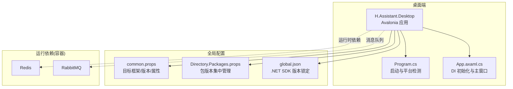
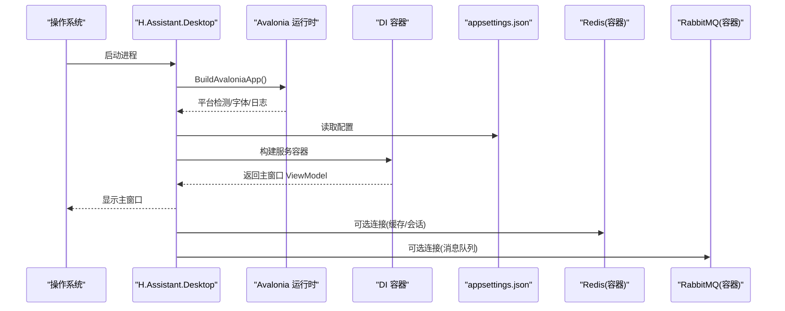
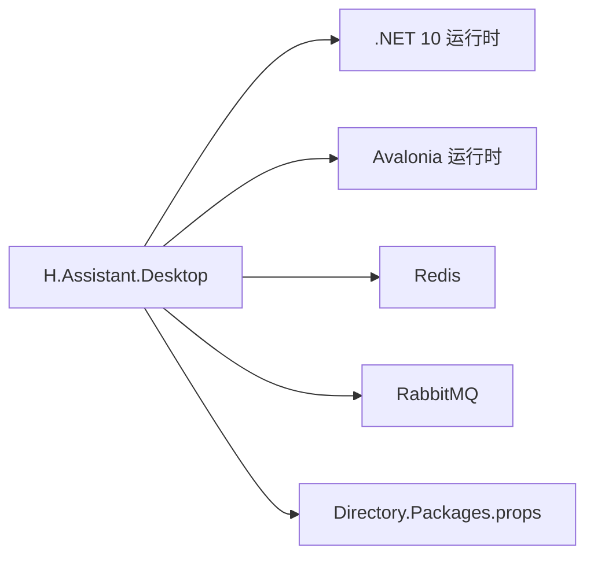

# 打包部署

<cite>
**本文引用的文件**   
- [H.Assistant.Desktop.csproj](file://src/Agent/Assistant/H.Assistant.Desktop/H.Assistant.Desktop.csproj)
- [Program.cs](file://src/Agent/Assistant/H.Assistant.Desktop/Program.cs)
- [App.axaml.cs](file://src/Agent/Assistant/H.Assistant.Desktop/App.axaml.cs)
- [common.props](file://src/common.props)
- [Directory.Packages.props](file://src/Directory.Packages.props)
- [global.json](file://src/global.json)
- [docker-compose.yml](file://cd/docker-compose.yml)
</cite>

## 目录
1. [简介](#简介)
2. [项目结构](#项目结构)
3. [核心组件](#核心组件)
4. [架构总览](#架构总览)
5. [详细组件分析](#详细组件分析)
6. [依赖分析](#依赖分析)
7. [性能考虑](#性能考虑)
8. [故障排查指南](#故障排查指南)
9. [结论](#结论)
10. [附录](#附录)

## 简介
本指南面向基于 .NET 10 与 Avalonia 的桌面端应用（H.Assistant.Desktop）的打包、发布与部署。内容涵盖：
- 发布配置与依赖管理（跨平台 SDK、包版本集中管理）
- Windows、macOS、Linux 平台的打包流程与注意事项
- Docker 容器化与 docker-compose 编排（Redis、RabbitMQ）
- 应用签名、代码混淆与安全加固建议
- 自动更新机制与版本管理策略
- CI/CD 流水线与自动化部署方案

## 项目结构
本项目采用多项目解决方案，桌面端入口位于 Agent/Assistant/H.Assistant.Desktop，使用 Avalonia 构建跨平台桌面应用；全局目标框架、语言版本、版本号等通过 common.props 统一管理；SDK 版本由 global.json 锁定；包版本通过 Directory.Packages.props 集中管理；服务编排通过 cd/docker-compose.yml 提供 Redis 与 RabbitMQ 的本地开发环境。

图表来源
- [H.Assistant.Desktop.csproj:1-27](file://src/Agent/Assistant/H.Assistant.Desktop/H.Assistant.Desktop.csproj#L1-L27)
- [Program.cs:1-20](file://src/Agent/Assistant/H.Assistant.Desktop/Program.cs#L1-L20)
- [App.axaml.cs:1-37](file://src/Agent/Assistant/H.Assistant.Desktop/App.axaml.cs#L1-L37)
- [common.props:1-15](file://src/common.props#L1-L15)
- [Directory.Packages.props:1-99](file://src/Directory.Packages.props#L1-L99)
- [global.json:1-7](file://src/global.json#L1-L7)
- [docker-compose.yml:1-32](file://cd/docker-compose.yml#L1-L32)

章节来源
- [H.Assistant.Desktop.csproj:1-27](file://src/Agent/Assistant/H.Assistant.Desktop/H.Assistant.Desktop.csproj#L1-L27)
- [Program.cs:1-20](file://src/Agent/Assistant/H.Assistant.Desktop/Program.cs#L1-L20)
- [App.axaml.cs:1-37](file://src/Agent/Assistant/H.Assistant.Desktop/App.axaml.cs#L1-L37)
- [common.props:1-15](file://src/common.props#L1-L15)
- [Directory.Packages.props:1-99](file://src/Directory.Packages.props#L1-L99)
- [global.json:1-7](file://src/global.json#L1-L7)
- [docker-compose.yml:1-32](file://cd/docker-compose.yml#L1-L32)

## 核心组件
- 桌面应用项目（H.Assistant.Desktop）
  - 输出类型为 WinExe，启用 Avalonia 相关包与 Fluent 主题、Inter 字体，调试时包含 Avalonia.Diagnostics
  - 引用 HttpClient、JSON 配置等扩展，并引用应用契约与 HTTP 客户端代理库
  - appsettings.json 复制到输出目录，便于运行时配置
- 启动器（Program.cs）
  - 使用 Avalonia 的 AppBuilder 构建应用，启用平台检测、Inter 字体与日志追踪
- 应用初始化（App.axaml.cs）
  - 在 OnFrameworkInitializationCompleted 中构建 DI 容器，设置主窗口与 ViewModel

章节来源
- [H.Assistant.Desktop.csproj:1-27](file://src/Agent/Assistant/H.Assistant.Desktop/H.Assistant.Desktop.csproj#L1-L27)
- [Program.cs:1-20](file://src/Agent/Assistant/H.Assistant.Desktop/Program.cs#L1-L20)
- [App.axaml.cs:1-37](file://src/Agent/Assistant/H.Assistant.Desktop/App.axaml.cs#L1-L37)

## 架构总览
桌面端应用通过 Avalonia 跨平台运行，依赖 .NET 10 运行时与 Avalonia 运行时。应用启动后加载配置、注册服务并创建主窗口。运行期可能依赖 Redis（缓存/会话）与 RabbitMQ（消息队列），可通过 docker-compose 快速拉起。

图表来源
- [Program.cs:1-20](file://src/Agent/Assistant/H.Assistant.Desktop/Program.cs#L1-L20)
- [App.axaml.cs:1-37](file://src/Agent/Assistant/H.Assistant.Desktop/App.axaml.cs#L1-L37)
- [H.Assistant.Desktop.csproj:1-27](file://src/Agent/Assistant/H.Assistant.Desktop/H.Assistant.Desktop.csproj#L1-L27)
- [docker-compose.yml:1-32](file://cd/docker-compose.yml#L1-L32)

## 详细组件分析

### 发布与打包配置
- 目标框架与版本
  - 统一目标框架 net10.0，语言版本 preview，Nullable 开启，版本号 0.7.0，集中定义于 common.props
  - SDK 版本锁定为 10.0.0，rollForward latestFeature，确保构建一致性
- 包版本集中管理
  - Directory.Packages.props 统一管理 Avalonia、HttpClient、Serilog、EF Core、ABP 等包版本
- 桌面项目特性
  - OutputType=WinExe，AvaloniaUseCompiledBindingsByDefault=false，ApplicationTitle 设置
  - 引入 Avalonia.Desktop、Fluent 主题、Inter 字体、Diagnostics（Debug）
  - 复制 appsettings.json 到输出目录

章节来源
- [common.props:1-15](file://src/common.props#L1-L15)
- [global.json:1-7](file://src/global.json#L1-L7)
- [Directory.Packages.props:1-99](file://src/Directory.Packages.props#L1-L99)
- [H.Assistant.Desktop.csproj:1-27](file://src/Agent/Assistant/H.Assistant.Desktop/H.Assistant.Desktop.csproj#L1-L27)

### Windows 打包与发布
- 自包含发布（推荐）
  - 使用 dotnet publish -c Release -r win-x64 --self-contained 生成独立可执行文件，避免目标机器缺少运行时
  - 若需最小体积，可使用 Trim 与 ReadyToRun（注意 Avalonia 兼容性验证）
- 安装包制作
  - 使用 WiX Toolset 或 Inno Setup 将发布产物打包为 MSI/EXE 安装包
  - 添加卸载、快捷方式、安装路径选择、权限提示等
- 签名与公证
  - 使用 Authenticode 对 EXE 进行签名，提升可信度与防篡改能力
  - 结合时间戳服务器确保证书过期后仍有效

章节来源
- [H.Assistant.Desktop.csproj:1-27](file://src/Agent/Assistant/H.Assistant.Desktop/H.Assistant.Desktop.csproj#L1-L27)

### macOS 打包与发布
- 自包含发布
  - 使用 dotnet publish -c Release -r osx-arm64 或 osx-x64 生成 .app 或可执行文件
- 应用签名与公证
  - 使用 codesign 对二进制与资源签名，配合 xcrun altool 提交 Apple Notarization
  - 使用 spctl 验证签名有效性
- 安装包制作
  - 使用 pkgbuild 或 create-dmg 生成 .pkg 或 .dmg 安装包
- 注意事项
  - 确认 Avalonia 与第三方库支持对应架构（arm64/x64）
  - 处理沙盒限制与权限请求（如文件系统访问）

章节来源
- [Directory.Packages.props:1-99](file://src/Directory.Packages.props#L1-L99)

### Linux 打包与发布
- 自包含发布
  - 使用 dotnet publish -c Release -r linux-x64 生成可执行文件
- 依赖检查
  - 确保系统具备必要的系统库（如 libssl、libicu 等）
- 安装包制作
  - 使用 dpkg/deb 或 rpm 打包 .deb/.rpm 安装包
- 注意事项
  - 不同发行版依赖差异较大，建议在基础镜像中预装依赖

章节来源
- [Directory.Packages.props:1-99](file://src/Directory.Packages.props#L1-L99)

### Docker 容器化与编排
- 容器化思路
  - 将后端服务（如 Web API、Worker）放入容器；桌面端通常不直接容器化，但可在容器中运行测试或辅助工具
- 现有编排
  - cd/docker-compose.yml 提供 Redis 与 RabbitMQ 的本地开发环境，包含端口映射、环境变量、数据卷等
- 建议
  - 为后端服务编写 Dockerfile，使用多阶段构建减小镜像体积
  - 使用 .env 管理敏感信息，避免硬编码密码

章节来源
- [docker-compose.yml:1-32](file://cd/docker-compose.yml#L1-L32)

### 应用签名、代码混淆与安全加固
- 应用签名
  - Windows：Authenticode 签名；macOS：codesign + Notarization；Linux：可选 RPM/DEB 签名
- 代码混淆
  - 使用 ConfuserEx 或 Obfuscar 对托管程序集进行混淆（注意 Avalonia XAML 与反射场景）
- 安全加固
  - 禁用 Debug 符号与诊断包（Release 构建）
  - 启用 HTTPS、HSTS、CSP（针对 Web 部分）
  - 输入校验、错误信息脱敏、日志去敏感化
  - 最小权限原则与依赖最小化

章节来源
- [H.Assistant.Desktop.csproj:1-27](file://src/Agent/Assistant/H.Assistant.Desktop/H.Assistant.Desktop.csproj#L1-L27)

### 自动更新机制与版本管理
- 版本管理
  - 使用 common.props 中的 Version 字段作为应用版本，CI 中根据 Git Tag 自动生成
- 自动更新
  - 桌面端可采用自定义更新器：服务端暴露版本清单（含下载链接、哈希校验）
  - 客户端启动时检查版本，下载增量或全量包，校验哈希后替换并重启
- 回滚策略
  - 保留上一版本，失败时自动回滚

章节来源
- [common.props:1-15](file://src/common.props#L1-L15)

### CI/CD 流水线与自动化部署
- 构建阶段
  - 安装 .NET 10 SDK，恢复 NuGet 包，执行 dotnet build/publish
  - 生成各平台产物（win-x64、osx-arm64/osx-x64、linux-x64）
- 测试阶段
  - 运行单元测试与集成测试，必要时启动 Redis/RabbitMQ（参考 docker-compose）
- 打包与签名
  - 生成安装包（MSI/EXE、pkg/dmg、deb/rpm），执行签名与公证
- 发布阶段
  - 上传制品到制品库（NuGet/GitHub Releases/Nexus）
  - 触发下游部署（Web 服务容器化部署、桌面端分发）

章节来源
- [Directory.Packages.props:1-99](file://src/Directory.Packages.props#L1-L99)
- [docker-compose.yml:1-32](file://cd/docker-compose.yml#L1-L32)

## 依赖分析
- 运行时依赖
  - .NET 10 运行时（跨平台）
  - Avalonia 运行时与主题/字体包
- 外部服务依赖
  - Redis（缓存/会话）
  - RabbitMQ（消息队列）
- 包依赖管理
  - Directory.Packages.props 集中管理所有包版本，避免冲突

图表来源
- [H.Assistant.Desktop.csproj:1-27](file://src/Agent/Assistant/H.Assistant.Desktop/H.Assistant.Desktop.csproj#L1-L27)
- [Directory.Packages.props:1-99](file://src/Directory.Packages.props#L1-L99)
- [docker-compose.yml:1-32](file://cd/docker-compose.yml#L1-L32)

章节来源
- [H.Assistant.Desktop.csproj:1-27](file://src/Agent/Assistant/H.Assistant.Desktop/H.Assistant.Desktop.csproj#L1-L27)
- [Directory.Packages.props:1-99](file://src/Directory.Packages.props#L1-L99)
- [docker-compose.yml:1-32](file://cd/docker-compose.yml#L1-L32)

## 性能考虑
- 发布优化
  - 使用 Trim 减少托管程序集大小（注意 Avalonia 反射需求）
  - 启用 ReadyToRun 加速冷启动
- 资源优化
  - 压缩静态资源（Gzip/Brotli，针对 Web 部分）
  - 按需加载模块与视图模型
- 网络优化
  - 合理设置 HttpClient 超时与重试策略
  - 使用连接池与 Keep-Alive

[本节为通用指导，不直接分析具体文件]

## 故障排查指南
- 启动失败
  - 检查 .NET 10 运行时是否安装，平台架构是否匹配
  - 查看 Avalonia 日志（LogToTrace）定位初始化问题
- 配置加载失败
  - 确认 appsettings.json 已复制到输出目录且路径正确
- 依赖缺失
  - 使用 ldd（Linux）或依赖检查工具确认系统库完整性
- 容器依赖
  - 检查 Redis/RabbitMQ 容器状态与端口占用
  - 核对环境变量与密码配置

章节来源
- [Program.cs:1-20](file://src/Agent/Assistant/H.Assistant.Desktop/Program.cs#L1-L20)
- [H.Assistant.Desktop.csproj:1-27](file://src/Agent/Assistant/H.Assistant.Desktop/H.Assistant.Desktop.csproj#L1-L27)
- [docker-compose.yml:1-32](file://cd/docker-compose.yml#L1-L32)

## 结论
通过统一的 SDK 与包版本管理、清晰的发布配置与跨平台打包流程，结合容器化依赖与 CI/CD 自动化，可实现稳定高效的桌面端应用交付。签名、混淆与安全加固进一步提升产品可信度与安全性；完善的自动更新与版本管理策略保障用户体验与运维效率。

[本节为总结性内容，不直接分析具体文件]

## 附录
- 常用命令参考
  - 构建与发布（示例）
    - dotnet build -c Release
    - dotnet publish -c Release -r win-x64 --self-contained
    - dotnet publish -c Release -r osx-arm64
    - dotnet publish -c Release -r linux-x64
  - 容器编排
    - docker compose up -d
    - docker compose down
- 关键配置文件位置
  - 全局属性与版本：common.props
  - SDK 版本锁定：global.json
  - 包版本集中管理：Directory.Packages.props
  - 桌面项目配置：H.Assistant.Desktop.csproj
  - 容器编排：cd/docker-compose.yml

章节来源
- [common.props:1-15](file://src/common.props#L1-L15)
- [global.json:1-7](file://src/global.json#L1-L7)
- [Directory.Packages.props:1-99](file://src/Directory.Packages.props#L1-L99)
- [H.Assistant.Desktop.csproj:1-27](file://src/Agent/Assistant/H.Assistant.Desktop/H.Assistant.Desktop.csproj#L1-L27)
- [docker-compose.yml:1-32](file://cd/docker-compose.yml#L1-L32)