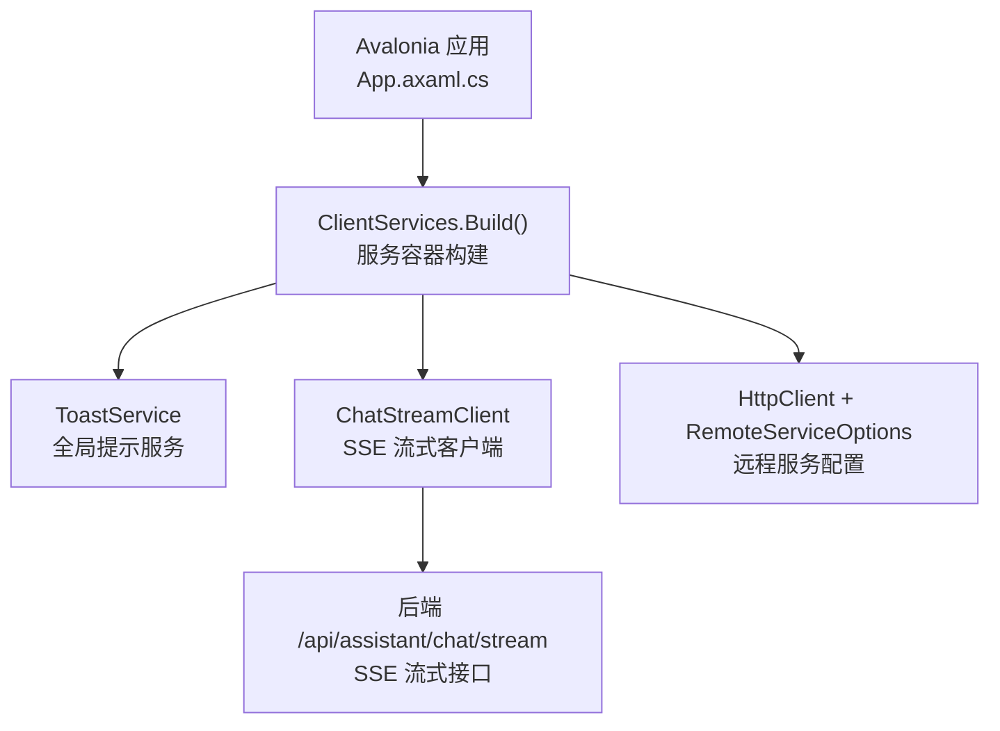
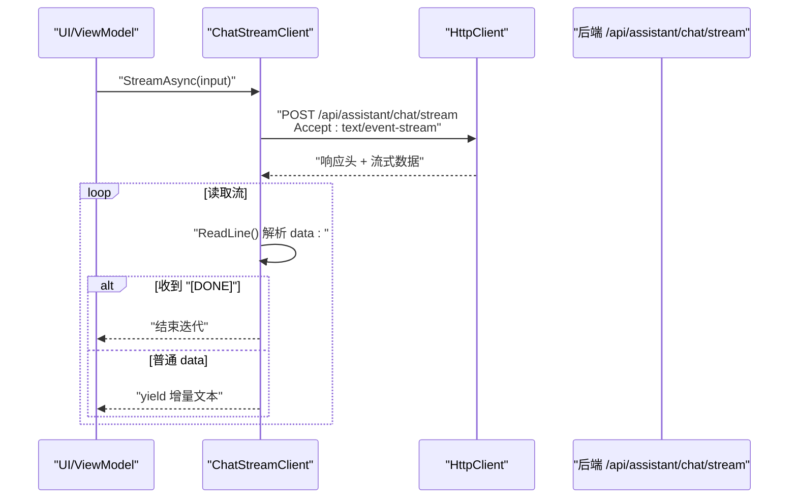
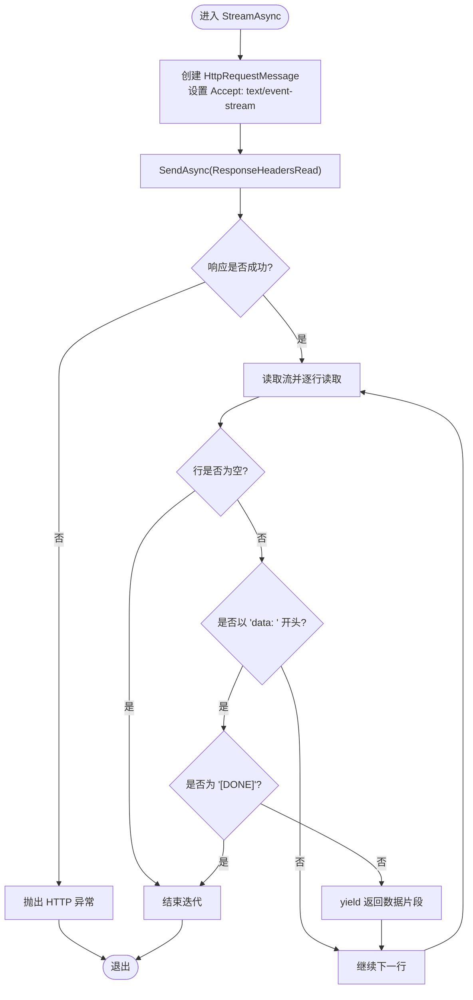
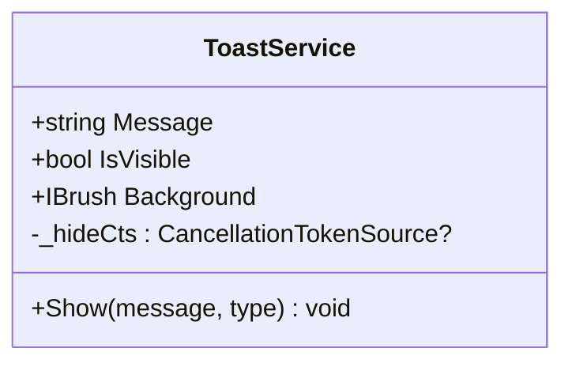
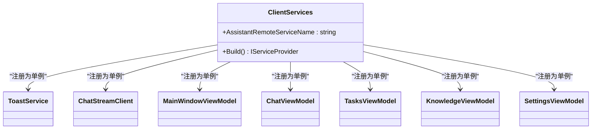
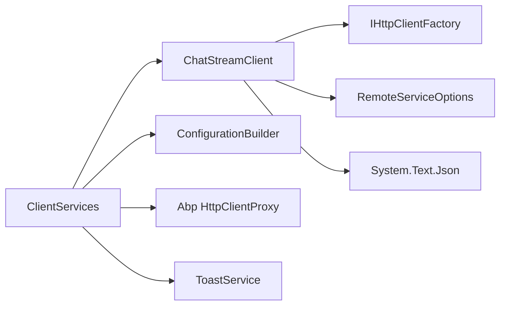

# 服务通信机制

<cite>
**本文引用的文件**   
- [ClientServices.cs](file://src/Agent/Assistant/H.Assistant.Desktop/ClientServices.cs)
- [ChatStreamClient.cs](file://src/Agent/Assistant/H.Assistant.Desktop/Services/ChatStreamClient.cs)
- [ToastService.cs](file://src/Agent/Assistant/H.Assistant.Desktop/Services/ToastService.cs)
- [App.axaml.cs](file://src/Agent/Assistant/H.Assistant.Desktop/App.axaml.cs)
</cite>

## 目录
1. [简介](#简介)
2. [项目结构](#项目结构)
3. [核心组件](#核心组件)
4. [架构总览](#架构总览)
5. [详细组件分析](#详细组件分析)
6. [依赖关系分析](#依赖关系分析)
7. [性能与内存管理建议](#性能与内存管理建议)
8. [故障排查指南](#故障排查指南)
9. [结论](#结论)

## 简介
本文件面向桌面端应用（Avalonia）的服务通信机制，重点围绕以下方面展开：
- 基于 SignalR 的实时通信实现说明（当前代码采用 SSE 流式接口，后续可平滑迁移至 SignalR）
- ChatStreamClient 的连接管理与消息处理流程
- ToastService 通知系统的实现与 UI 线程调度
- ClientServices 中的服务注册与依赖注入配置
- WebSocket/SSE 连接生命周期与重连策略（概念性指导）
- 错误处理与异常恢复策略
- 性能优化与内存管理建议

## 项目结构
桌面端入口通过 Avalonia 应用初始化时构建服务容器，并将关键服务以单例形式注册。客户端远程服务通过 HttpClient 代理访问后端 API，聊天流式数据通过 SSE 接口获取。

图表来源
- [App.axaml.cs:22-35](file://src/Agent/Assistant/H.Assistant.Desktop/App.axaml.cs#L22-L35)
- [ClientServices.cs:17-59](file://src/Agent/Assistant/H.Assistant.Desktop/ClientServices.cs#L17-L59)
- [ChatStreamClient.cs:13-33](file://src/Agent/Assistant/H.Assistant.Desktop/Services/ChatStreamClient.cs#L13-L33)

章节来源
- [App.axaml.cs:10-36](file://src/Agent/Assistant/H.Assistant.Desktop/App.axaml.cs#L10-L36)
- [ClientServices.cs:10-60](file://src/Agent/Assistant/H.Assistant.Desktop/ClientServices.cs#L10-L60)

## 核心组件
- ClientServices：负责构建 IServiceProvider，注册远程服务、HTTP 客户端、ViewModel 以及核心服务（ToastService、ChatStreamClient）。
- ChatStreamClient：封装 SSE 流式请求，逐行读取 data 负载并产出异步枚举，遇到 [DONE] 结束。
- ToastService：提供全局提示能力，支持类型化背景色与自动隐藏，使用 Dispatcher 确保 UI 线程安全更新。
- App.axaml.cs：在应用启动时创建服务容器，并设置主窗口 DataContext。

章节来源
- [ClientServices.cs:17-59](file://src/Agent/Assistant/H.Assistant.Desktop/ClientServices.cs#L17-L59)
- [ChatStreamClient.cs:13-62](file://src/Agent/Assistant/H.Assistant.Desktop/Services/ChatStreamClient.cs#L13-L62)
- [ToastService.cs:10-49](file://src/Agent/Assistant/H.Assistant.Desktop/Services/ToastService.cs#L10-L49)
- [App.axaml.cs:22-35](file://src/Agent/Assistant/H.Assistant.Desktop/App.axaml.cs#L22-L35)

## 架构总览
整体通信链路如下：UI 层通过 ViewModel 调用 ChatStreamClient，后者使用 IHttpClientFactory 创建的 HttpClient 向后端发送 POST 请求到 /api/assistant/chat/stream，服务端返回 text/event-stream 流；客户端逐行解析 data 字段，将增量内容推送给 UI。ToastService 用于统一展示系统提示。

图表来源
- [ChatStreamClient.cs:24-61](file://src/Agent/Assistant/H.Assistant.Desktop/Services/ChatStreamClient.cs#L24-L61)

## 详细组件分析

### ChatStreamClient 分析与流程图
- 职责：发起 SSE 流式请求，按行读取并过滤 data 前缀，遇到 [DONE] 终止。
- 关键点：
  - 使用 IHttpClientFactory 获取命名 HttpClient，便于复用与配置。
  - 通过 RemoteServiceOptions 动态拼接 BaseUrl，避免硬编码。
  - 使用 IAsyncEnumerable 进行流式消费，降低内存占用。
  - 支持 CancellationToken 取消操作。
- 错误处理：EnsureSuccessStatusCode 抛出非成功状态码异常；流读取过程中需捕获 IO 或网络异常并在上层重试。

图表来源
- [ChatStreamClient.cs:24-61](file://src/Agent/Assistant/H.Assistant.Desktop/Services/ChatStreamClient.cs#L24-L61)

章节来源
- [ChatStreamClient.cs:13-62](file://src/Agent/Assistant/H.Assistant.Desktop/Services/ChatStreamClient.cs#L13-L62)

### ToastService 分析与类图
- 职责：提供统一的提示框显示与自动隐藏，支持 success/warning/error/info 类型。
- 关键点：
  - 使用 Avalonia.Dispatcher 确保 UI 线程更新。
  - 使用 CancellationTokenSource 控制自动隐藏任务的生命周期。
  - 暴露 IsVisible、Message、Background 属性供 UI 绑定。

图表来源
- [ToastService.cs:10-49](file://src/Agent/Assistant/H.Assistant.Desktop/Services/ToastService.cs#L10-L49)

章节来源
- [ToastService.cs:10-49](file://src/Agent/Assistant/H.Assistant.Desktop/Services/ToastService.cs#L10-L49)

### ClientServices 服务注册与依赖注入
- 功能：
  - 加载 appsettings.json 配置。
  - 注册 IConfiguration、RemoteServices、HttpClient（允许自签名证书）。
  - 为 Assistant 远程服务生成 HTTP 代理。
  - 注册 ToastService、ChatStreamClient 及多个 ViewModel。
- 扩展点：
  - 可通过修改 AllowInvalidCertificates 控制证书校验。
  - 可在 Build 中追加更多服务或中间件。

图表来源
- [ClientServices.cs:17-59](file://src/Agent/Assistant/H.Assistant.Desktop/ClientServices.cs#L17-L59)

章节来源
- [ClientServices.cs:17-59](file://src/Agent/Assistant/H.Assistant.Desktop/ClientServices.cs#L17-L59)

### App 启动与服务容器
- 在 OnFrameworkInitializationCompleted 中构建服务容器，并设置主窗口的 DataContext。
- 保证所有服务在应用生命周期内可用。

章节来源
- [App.axaml.cs:22-35](file://src/Agent/Assistant/H.Assistant.Desktop/App.axaml.cs#L22-L35)

## 依赖关系分析
- ChatStreamClient 依赖：
  - IHttpClientFactory：用于创建命名 HttpClient。
  - RemoteServiceOptions：用于获取 BaseUrl。
  - System.Text.Json：用于序列化输入 DTO。
- ClientServices 依赖：
  - Microsoft.Extensions.Configuration：加载配置文件。
  - H.Abp.HttpClientProxy：添加远程服务代理。
  - Avalonia 相关服务：ToastService 使用 UI 线程调度。

图表来源
- [ChatStreamClient.cs:13-33](file://src/Agent/Assistant/H.Assistant.Desktop/Services/ChatStreamClient.cs#L13-L33)
- [ClientServices.cs:17-46](file://src/Agent/Assistant/H.Assistant.Desktop/ClientServices.cs#L17-L46)

章节来源
- [ChatStreamClient.cs:13-33](file://src/Agent/Assistant/H.Assistant.Desktop/Services/ChatStreamClient.cs#L13-L33)
- [ClientServices.cs:17-46](file://src/Agent/Assistant/H.Assistant.Desktop/ClientServices.cs#L17-L46)

## 性能与内存管理建议
- 流式处理：
  - 使用 IAsyncEnumerable 逐条产出数据，避免一次性加载大响应体。
  - 合理设置 HttpCompletionOption.ResponseHeadersRead，减少首字节延迟。
- 资源释放：
  - 确保 HttpRequestMessage、HttpResponseContent 等 IDisposable 对象在使用后释放。
  - 及时取消 CancellationToken，避免后台任务泄漏。
- 连接池与复用：
  - 通过 IHttpClientFactory 管理 HttpClient 实例，避免 Socket 耗尽。
- UI 线程调度：
  - ToastService 使用 Dispatcher 更新 UI，避免跨线程异常。
- 序列化开销：
  - 复用 JsonSerializerOptions，避免重复分配。
- 重连策略（概念性）：
  - 对网络异常进行指数退避重试，限制最大重试次数。
  - 区分可恢复与不可恢复错误，避免无效重试。
- 监控与诊断：
  - 记录流式数据的吞吐量和错误率，定位瓶颈。

[本节为通用建议，不直接分析具体文件]

## 故障排查指南
- 常见错误：
  - 非 2xx 状态码：检查后端接口路径、认证与权限。
  - 流提前关闭：确认服务端是否正确发送 [DONE] 标记。
  - UI 线程异常：确保所有 UI 更新通过 Dispatcher 执行。
- 调试步骤：
  - 启用 HttpClient 日志输出，查看请求与响应头。
  - 在 ChatStreamClient 中增加断点，观察逐行解析逻辑。
  - 使用 ToastService 展示关键状态信息，辅助定位问题。
- 恢复策略：
  - 对瞬时网络错误进行有限次重试。
  - 对认证失败引导用户重新登录。
  - 对服务端错误提示用户稍后重试。

章节来源
- [ChatStreamClient.cs:34-61](file://src/Agent/Assistant/H.Assistant.Desktop/Services/ChatStreamClient.cs#L34-L61)
- [ToastService.cs:23-49](file://src/Agent/Assistant/H.Assistant.Desktop/Services/ToastService.cs#L23-L49)

## 结论
当前桌面端应用通过 ClientServices 集中管理服务依赖，ChatStreamClient 实现了高效的 SSE 流式通信，ToastService 提供了统一的提示能力。尽管未直接使用 SignalR，但现有架构具备良好的扩展性，可平滑迁移至 SignalR 以实现双向实时通信。建议在重连策略、错误处理与性能监控方面进一步完善，以提升用户体验与系统稳定性。