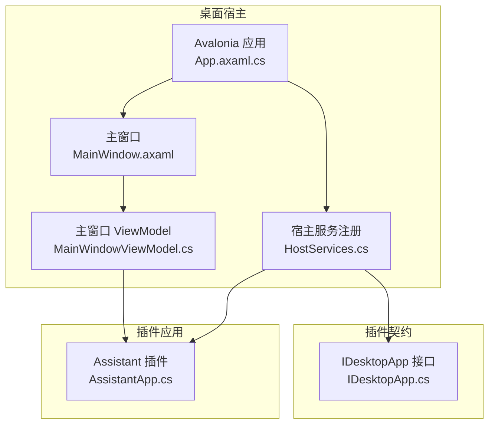
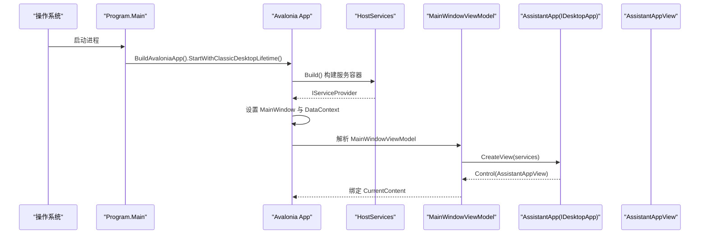
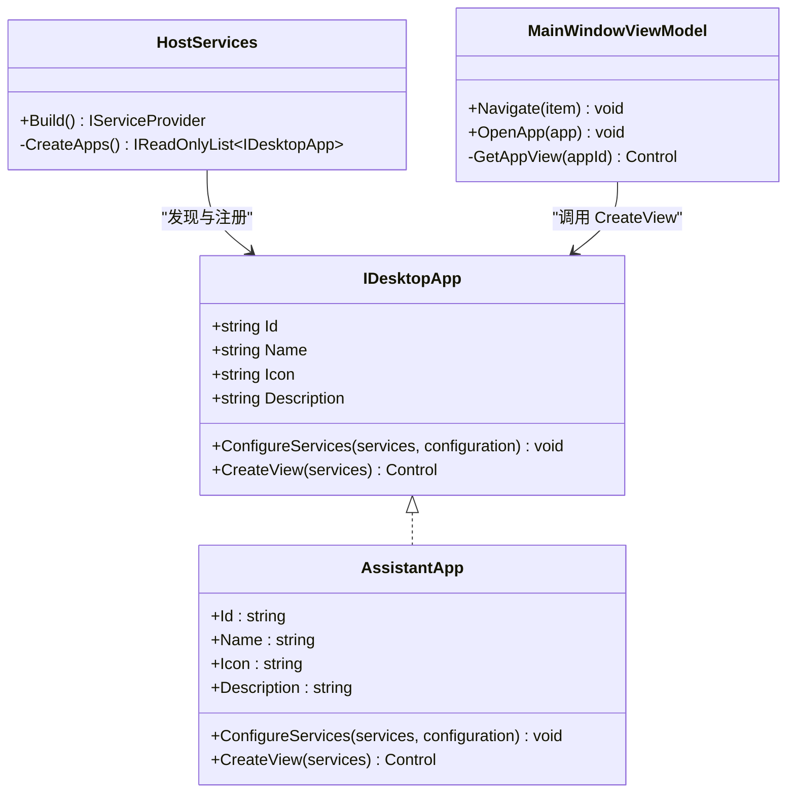
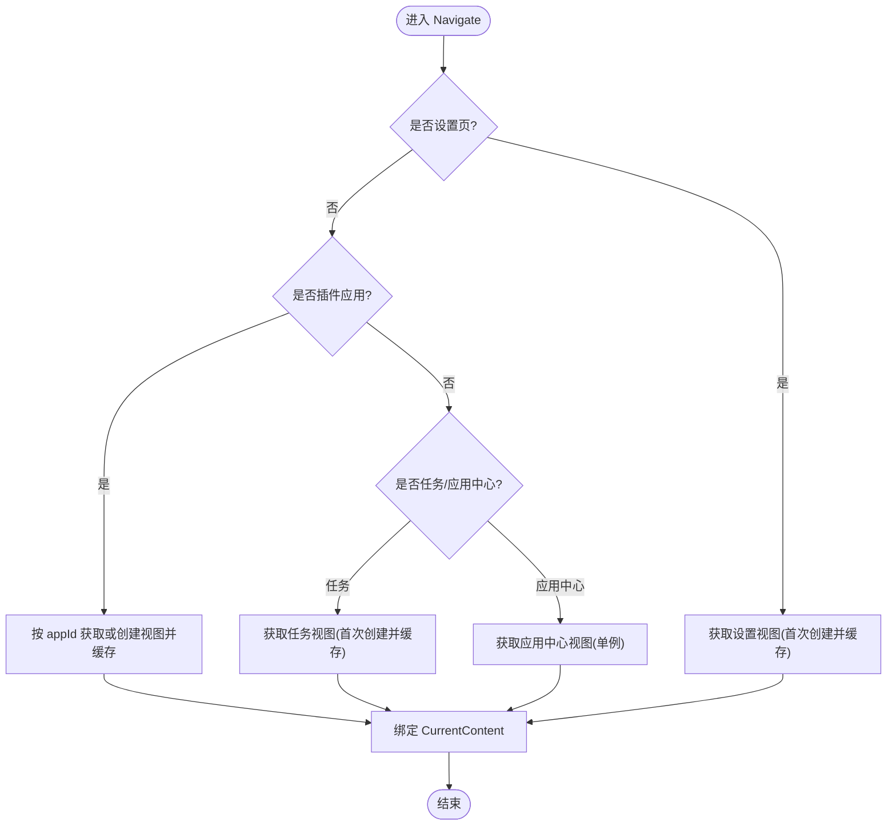
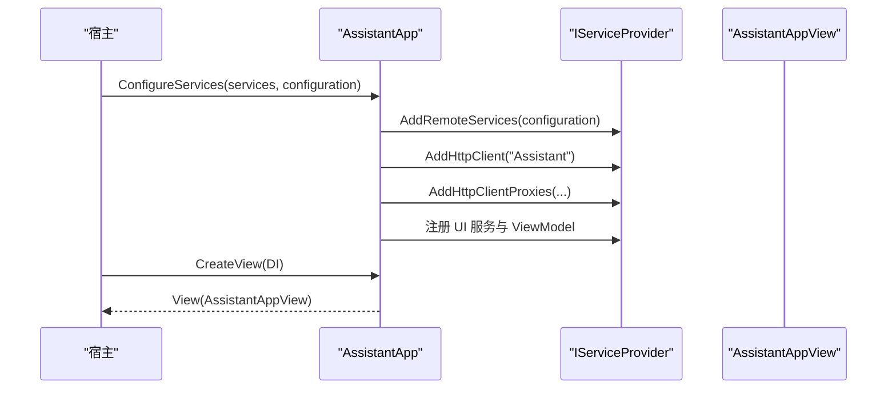
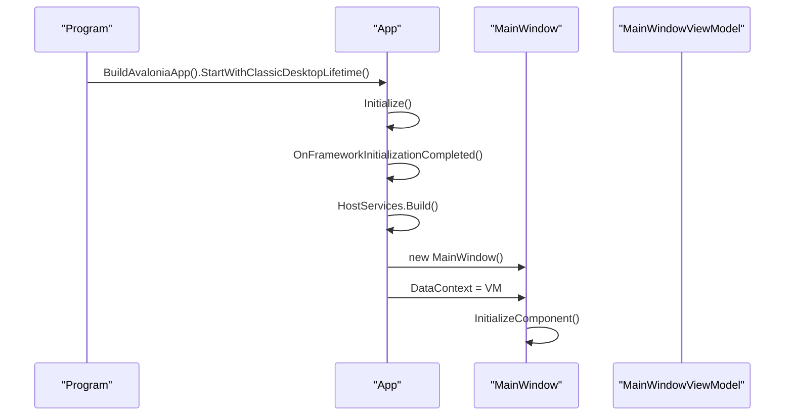
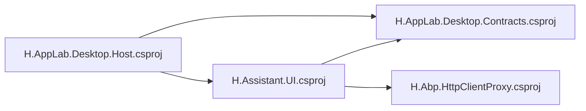

# 桌面主机架构

<cite>
**本文引用的文件**   
- [README.md](file://README.md)
- [Program.cs](file://src/Host/H.AppLab.Desktop.Host/Program.cs)
- [App.axaml.cs](file://src/Host/H.AppLab.Desktop.Host/App.axaml.cs)
- [IDesktopApp.cs](file://src/Host/H.AppLab.Desktop.Contracts/IDesktopApp.cs)
- [HostServices.cs](file://src/Host/H.AppLab.Desktop.Host/HostServices.cs)
- [MainWindowViewModel.cs](file://src/Host/H.AppLab.Desktop.Host/ViewModels/MainWindowViewModel.cs)
- [AssistantApp.cs](file://src/Agent/Assistant/H.Assistant.UI/AssistantApp.cs)
- [MainWindow.axaml.cs](file://src/Host/H.AppLab.Desktop.Host/Views/MainWindow.axaml.cs)
- [AppsView.axaml.cs](file://src/Host/H.AppLab.Desktop.Host/Views/AppsView.axaml.cs)
- [appsettings.json](file://src/Host/H.AppLab.Desktop.Host/appsettings.json)
- [H.AppLab.Desktop.Host.csproj](file://src/Host/H.AppLab.Desktop.Host/H.AppLab.Desktop.Host.csproj)
- [H.Assistant.UI.csproj](file://src/Agent/Assistant/H.Assistant.UI/H.Assistant.UI.csproj)
- [H.AppLab.Desktop.Contracts.csproj](file://src/Host/H.AppLab.Desktop.Contracts/H.AppLab.Desktop.Contracts.csproj)
- [MainWindow.axaml](file://src/Host/H.AppLab.Desktop.Host/Views/MainWindow.axaml)
- [App.axaml](file://src/Host/H.AppLab.Desktop.Host/App.axaml)
</cite>

## 目录
1. [简介](#简介)
2. [项目结构](#项目结构)
3. [核心组件](#核心组件)
4. [架构总览](#架构总览)
5. [详细组件分析](#详细组件分析)
6. [依赖关系分析](#依赖关系分析)
7. [性能考量](#性能考量)
8. [故障排查指南](#故障排查指南)
9. [结论](#结论)
10. [附录](#附录)

## 简介
本仓库采用模块化架构，支持单体与按服务独立部署。桌面端以 Avalonia 作为宿主外壳，通过统一的插件契约将多个客户端应用（如“会话”）接入到同一窗口中，实现左侧快捷菜单、应用中心、设置页等统一体验。远程服务通过基于 IAppService 的动态 HTTP 代理进行调用，前端无需手写 HttpClient 调用代码。

## 项目结构
- Host：宿主程序入口与外壳，不包含业务逻辑，仅负责服务注册与视图编排
  - H.AppLab.Desktop.Host：Avalonia 桌面宿主，提供主窗口、菜单与应用容器
  - H.AppLab.Desktop.Contracts：桌面插件契约定义
- Agent/Assistant：助手应用，包含 UI、ViewModel、与服务端的 AppService 契约及 HTTP 代理配置
- Components：共享 UI 组件（如 AppDrawer）
- LowCode：低代码设计/渲染引擎与元数据
- Services：企业级服务模块（Account、Organization、Approval 等）
- System：系统级应用（Enterprise、SystemPortal）
- Tools：各服务的数据库迁移工具
- Utils：通用工具库（HttpClient 动态代理、Blazor 工具、ID 生成等）

图表来源
- [App.axaml.cs:1-37](file://src/Host/H.AppLab.Desktop.Host/App.axaml.cs#L1-L37)
- [MainWindow.axaml:1-67](file://src/Host/H.AppLab.Desktop.Host/Views/MainWindow.axaml#L1-L67)
- [MainWindowViewModel.cs:1-210](file://src/Host/H.AppLab.Desktop.Host/ViewModels/MainWindowViewModel.cs#L1-L210)
- [HostServices.cs:1-45](file://src/Host/H.AppLab.Desktop.Host/HostServices.cs#L1-L45)
- [IDesktopApp.cs:1-32](file://src/Host/H.AppLab.Desktop.Contracts/IDesktopApp.cs#L1-L32)
- [AssistantApp.cs:1-71](file://src/Agent/Assistant/H.Assistant.UI/AssistantApp.cs#L1-L71)

章节来源
- [README.md:1-74](file://README.md#L1-L74)
- [H.AppLab.Desktop.Host.csproj:1-25](file://src/Host/H.AppLab.Desktop.Host/H.AppLab.Desktop.Host.csproj#L1-L25)
- [H.Assistant.UI.csproj:1-18](file://src/Agent/Assistant/H.Assistant.UI/H.Assistant.UI.csproj#L1-L18)
- [H.AppLab.Desktop.Contracts.csproj:1-9](file://src/Host/H.AppLab.Desktop.Contracts/H.AppLab.Desktop.Contracts.csproj#L1-L9)

## 核心组件
- 桌面插件契约 IDesktopApp：定义应用的 Id、Name、Icon、Description、ConfigureServices、CreateView 等能力，使宿主可统一发现、注册并创建应用根视图
- 宿主服务注册 HostServices：构建配置、聚合所有插件应用实例、注入宿主 ViewModel，返回统一 IServiceProvider
- 主窗口与导航 MainWindowViewModel：维护左侧快捷菜单、应用卡片集合、当前内容区；按需创建并缓存应用视图，保持应用内状态
- 插件应用 AssistantApp：实现 IDesktopApp，注册远程服务、HTTP 代理、UI 相关服务与 ViewModel，并提供根视图
- Avalonia 应用与窗口：Program 启动 ClassicDesktopLifetime；App 初始化 DI 容器并设置 MainWindow；MainWindow 承载侧边栏与内容区

章节来源
- [IDesktopApp.cs:1-32](file://src/Host/H.AppLab.Desktop.Contracts/IDesktopApp.cs#L1-L32)
- [HostServices.cs:1-45](file://src/Host/H.AppLab.Desktop.Host/HostServices.cs#L1-L45)
- [MainWindowViewModel.cs:1-210](file://src/Host/H.AppLab.Desktop.Host/ViewModels/MainWindowViewModel.cs#L1-L210)
- [AssistantApp.cs:1-71](file://src/Agent/Assistant/H.Assistant.UI/AssistantApp.cs#L1-L71)
- [Program.cs:1-20](file://src/Host/H.AppLab.Desktop.Host/Program.cs#L1-L20)
- [App.axaml.cs:1-37](file://src/Host/H.AppLab.Desktop.Host/App.axaml.cs#L1-L37)

## 架构总览
桌面端采用“宿主 + 插件”的扩展模式：
- 宿主负责生命周期管理、DI 容器、窗口布局与导航
- 插件通过 IDesktopApp 暴露自身信息与服务注册、视图创建能力
- 应用视图由宿主按需创建并缓存，切换时保留状态
- 远程服务通过 Abp HttpClient 动态代理访问，遵循 ABP 路由约定

图表来源
- [Program.cs:1-20](file://src/Host/H.AppLab.Desktop.Host/Program.cs#L1-L20)
- [App.axaml.cs:1-37](file://src/Host/H.AppLab.Desktop.Host/App.axaml.cs#L1-L37)
- [HostServices.cs:1-45](file://src/Host/H.AppLab.Desktop.Host/HostServices.cs#L1-L45)
- [MainWindowViewModel.cs:1-210](file://src/Host/H.AppLab.Desktop.Host/ViewModels/MainWindowViewModel.cs#L1-L210)
- [AssistantApp.cs:1-71](file://src/Agent/Assistant/H.Assistant.UI/AssistantApp.cs#L1-L71)

## 详细组件分析

### 插件契约与宿主集成
- IDesktopApp 定义了插件的最小能力集：标识、展示信息、服务注册与视图创建
- HostServices.CreateApps 集中声明可用插件列表，便于新增插件即插即用
- 宿主在 OnFrameworkInitializationCompleted 中构建容器并设置主窗口

图表来源
- [IDesktopApp.cs:1-32](file://src/Host/H.AppLab.Desktop.Contracts/IDesktopApp.cs#L1-L32)
- [AssistantApp.cs:1-71](file://src/Agent/Assistant/H.Assistant.UI/AssistantApp.cs#L1-L71)
- [HostServices.cs:1-45](file://src/Host/H.AppLab.Desktop.Host/HostServices.cs#L1-L45)
- [MainWindowViewModel.cs:1-210](file://src/Host/H.AppLab.Desktop.Host/ViewModels/MainWindowViewModel.cs#L1-L210)

章节来源
- [IDesktopApp.cs:1-32](file://src/Host/H.AppLab.Desktop.Contracts/IDesktopApp.cs#L1-L32)
- [HostServices.cs:1-45](file://src/Host/H.AppLab.Desktop.Host/HostServices.cs#L1-L45)
- [AssistantApp.cs:1-71](file://src/Agent/Assistant/H.Assistant.UI/AssistantApp.cs#L1-L71)

### 主窗口与导航流程
- MainWindowViewModel 维护 NavItems（快捷菜单）、Apps（应用卡片）、SettingsNav（设置）
- Navigate 根据选中项决定显示内置页面或插件应用视图；对插件视图进行懒加载与缓存
- OpenApp 支持从首页/应用中心打开应用并联动菜单高亮

图表来源
- [MainWindowViewModel.cs:1-210](file://src/Host/H.AppLab.Desktop.Host/ViewModels/MainWindowViewModel.cs#L1-L210)

章节来源
- [MainWindowViewModel.cs:1-210](file://src/Host/H.AppLab.Desktop.Host/ViewModels/MainWindowViewModel.cs#L1-L210)

### 插件应用 AssistantApp
- 实现 IDesktopApp，提供 Id/Name/Icon/Description
- ConfigureServices 中：
  - 添加远程服务配置（RemoteServices:Assistant:BaseUrl）
  - 配置 HttpClient（允许自签名证书用于本地开发）
  - 扫描并注册 IAppService 的 HTTP 代理（与 Blazor WASM 一致）
  - 注册 UI 层服务与 ViewModel
- CreateView 返回 AssistantAppView 并绑定 ViewModel

图表来源
- [AssistantApp.cs:1-71](file://src/Agent/Assistant/H.Assistant.UI/AssistantApp.cs#L1-L71)
- [appsettings.json:1-11](file://src/Host/H.AppLab.Desktop.Host/appsettings.json#L1-L11)

章节来源
- [AssistantApp.cs:1-71](file://src/Agent/Assistant/H.Assistant.UI/AssistantApp.cs#L1-L71)
- [appsettings.json:1-11](file://src/Host/H.AppLab.Desktop.Host/appsettings.json#L1-L11)

### Avalonia 应用与窗口
- Program.Main 使用 ClassicDesktopLifetime 启动
- App 初始化 XAML、构建服务容器、设置 MainWindow 与 DataContext
- MainWindow.axaml 定义无标题栏布局，顶部 Logo 区域兼作拖拽区，左侧为快捷菜单，右侧为内容区

图表来源
- [Program.cs:1-20](file://src/Host/H.AppLab.Desktop.Host/Program.cs#L1-L20)
- [App.axaml.cs:1-37](file://src/Host/H.AppLab.Desktop.Host/App.axaml.cs#L1-L37)
- [MainWindow.axaml.cs:1-24](file://src/Host/H.AppLab.Desktop.Host/Views/MainWindow.axaml.cs#L1-L24)
- [MainWindow.axaml:1-67](file://src/Host/H.AppLab.Desktop.Host/Views/MainWindow.axaml#L1-L67)

章节来源
- [Program.cs:1-20](file://src/Host/H.AppLab.Desktop.Host/Program.cs#L1-L20)
- [App.axaml.cs:1-37](file://src/Host/H.AppLab.Desktop.Host/App.axaml.cs#L1-L37)
- [MainWindow.axaml.cs:1-24](file://src/Host/H.AppLab.Desktop.Host/Views/MainWindow.axaml.cs#L1-L24)
- [MainWindow.axaml:1-67](file://src/Host/H.AppLab.Desktop.Host/Views/MainWindow.axaml#L1-L67)

## 依赖关系分析
- 宿主工程引用了插件契约与具体插件 UI 工程
- 插件工程引用契约与 HttpClient 动态代理工具库
- 配置文件 appsettings.json 提供远程服务地址与 HTTP 安全策略

图表来源
- [H.AppLab.Desktop.Host.csproj:1-25](file://src/Host/H.AppLab.Desktop.Host/H.AppLab.Desktop.Host.csproj#L1-L25)
- [H.Assistant.UI.csproj:1-18](file://src/Agent/Assistant/H.Assistant.UI/H.Assistant.UI.csproj#L1-L18)
- [H.AppLab.Desktop.Contracts.csproj:1-9](file://src/Host/H.AppLab.Desktop.Contracts/H.AppLab.Desktop.Contracts.csproj#L1-L9)

章节来源
- [H.AppLab.Desktop.Host.csproj:1-25](file://src/Host/H.AppLab.Desktop.Host/H.AppLab.Desktop.Host.csproj#L1-L25)
- [H.Assistant.UI.csproj:1-18](file://src/Agent/Assistant/H.Assistant.UI/H.Assistant.UI.csproj#L1-L18)
- [H.AppLab.Desktop.Contracts.csproj:1-9](file://src/Host/H.AppLab.Desktop.Contracts/H.AppLab.Desktop.Contracts.csproj#L1-L9)

## 性能考量
- 视图懒加载与缓存：插件视图按需创建并缓存，避免重复实例化，提升切换性能
- 服务一次性注册：宿主在启动时完成服务容器构建，减少运行时开销
- 远程代理复用：HttpClient 与代理按命名服务注册，避免频繁创建连接
- 可选裁剪与 AOT：WebAssembly 客户端可在 Release 启用 AOT 与裁剪（参考 README），桌面端可按需优化资源体积

[本节为通用指导，不直接分析具体文件]

## 故障排查指南
- 无法连接远程服务
  - 检查 appsettings.json 中 RemoteServices:Assistant:BaseUrl 是否正确
  - 本地开发允许自签名证书：Http:AllowInvalidCertificates 设置为 true
- 插件未显示或未激活
  - 确认 HostServices.CreateApps 已包含该插件实例
  - 检查插件是否实现了 IDesktopApp 且 ConfigureServices/CreateView 正常执行
- 视图未更新或状态丢失
  - 确保 MainWindowViewModel 中对视图进行了缓存（_appViews）
  - 检查导航命令与 IsActive 绑定是否正确

章节来源
- [appsettings.json:1-11](file://src/Host/H.AppLab.Desktop.Host/appsettings.json#L1-L11)
- [HostServices.cs:1-45](file://src/Host/H.AppLab.Desktop.Host/HostServices.cs#L1-L45)
- [MainWindowViewModel.cs:1-210](file://src/Host/H.AppLab.Desktop.Host/ViewModels/MainWindowViewModel.cs#L1-L210)

## 结论
桌面主机架构通过 Avalonia 宿主与 IDesktopApp 插件契约，实现了多应用的统一管理与灵活扩展。结合 Abp HttpClient 动态代理，前后端接口保持一致，降低开发成本。视图懒加载与缓存机制提升了用户体验，配置驱动的服务注册使得新增插件简单直观。

## 附录
- 快速启动
  - 运行桌面宿主：dotnet run --project src/Host/H.AppLab.Desktop.Host
  - 默认端口与地址参见宿主配置与 README
- 新增插件步骤
  - 实现 IDesktopApp，注册服务与视图
  - 在 HostServices.CreateApps 中添加插件实例
  - 如需远程服务，确保 appsettings.json 配置正确

[本节为补充说明，不直接分析具体文件]