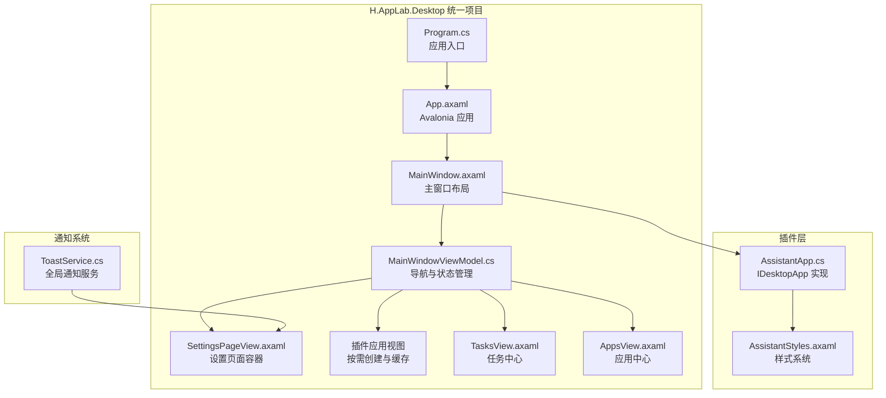
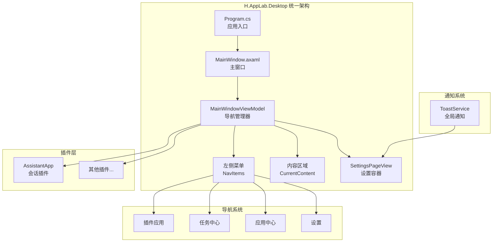
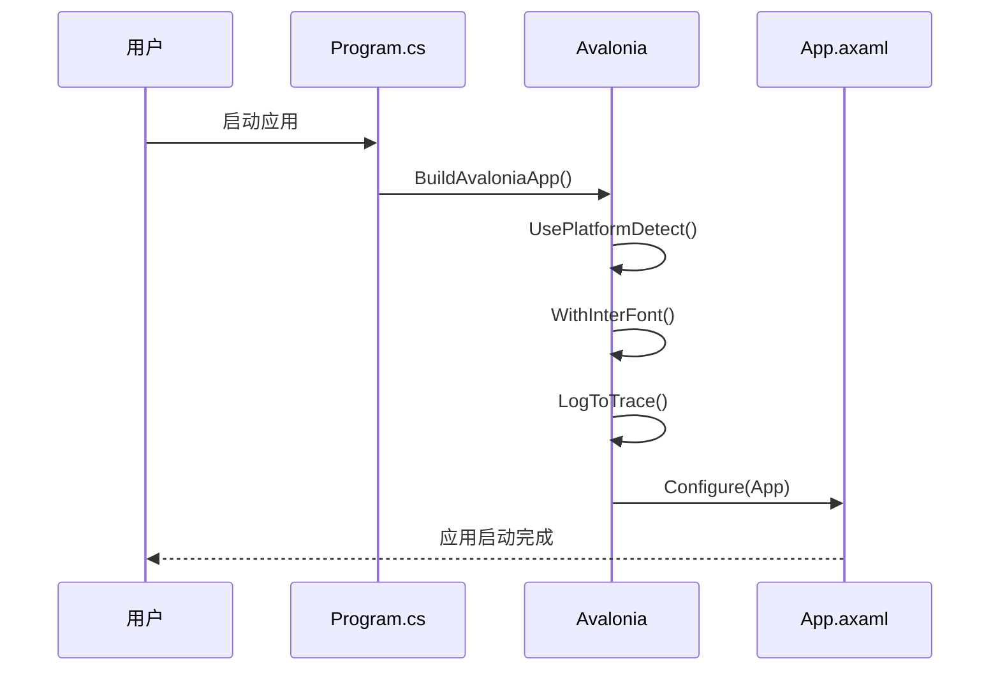
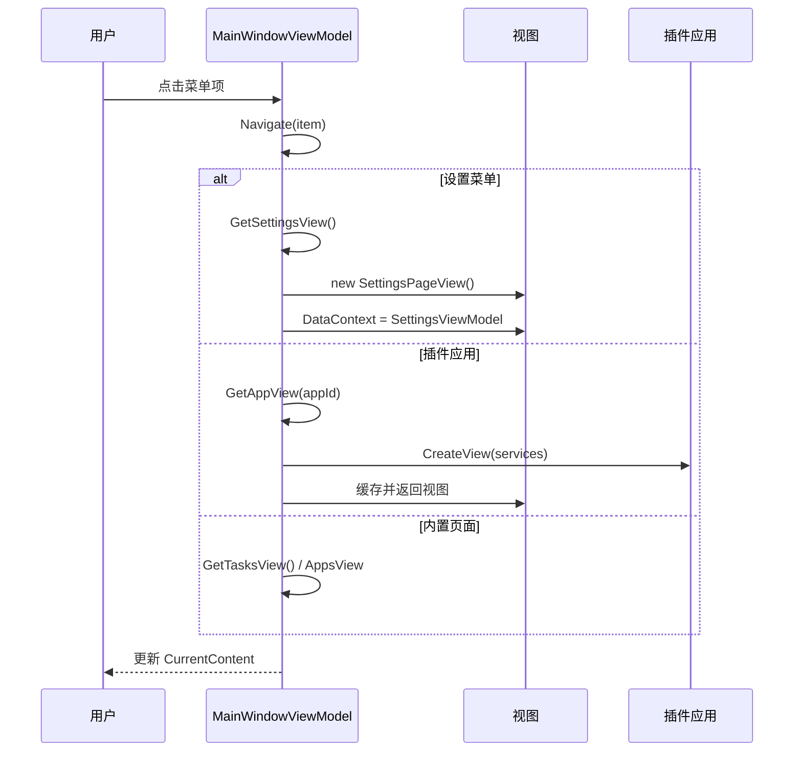
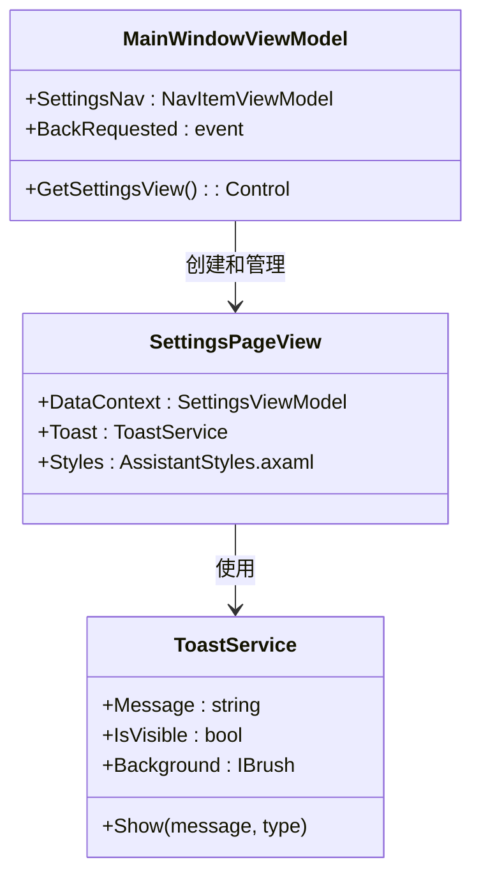
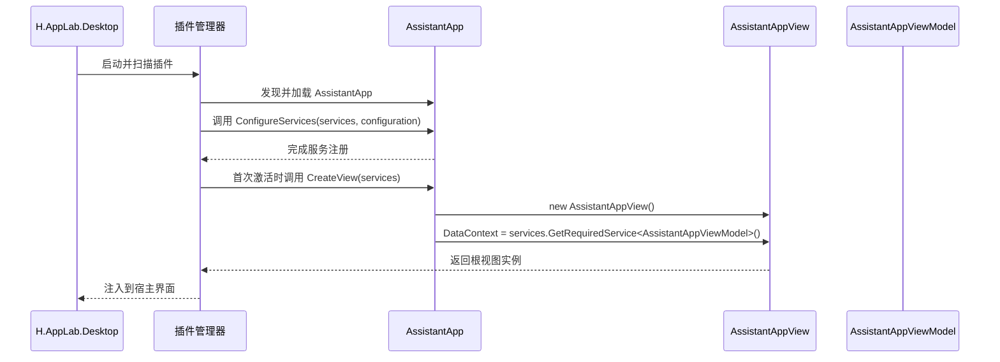
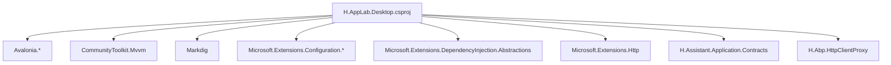
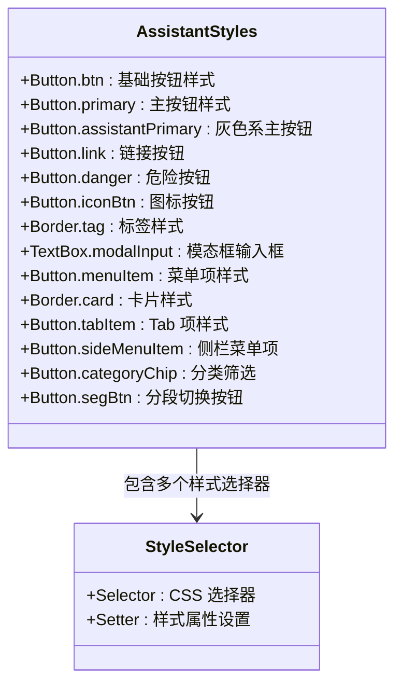
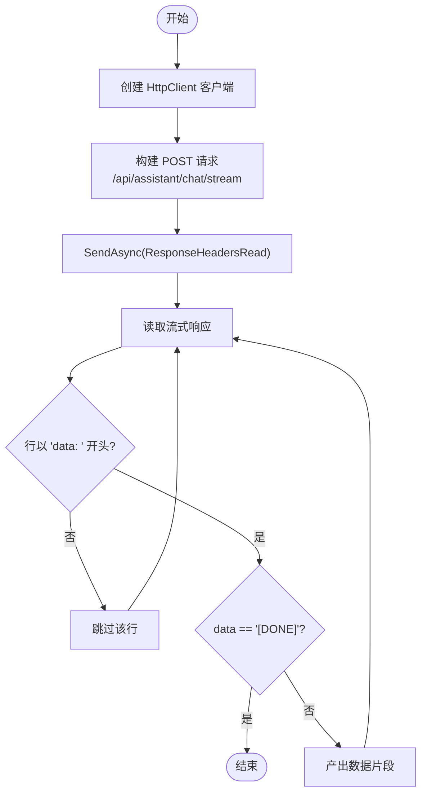
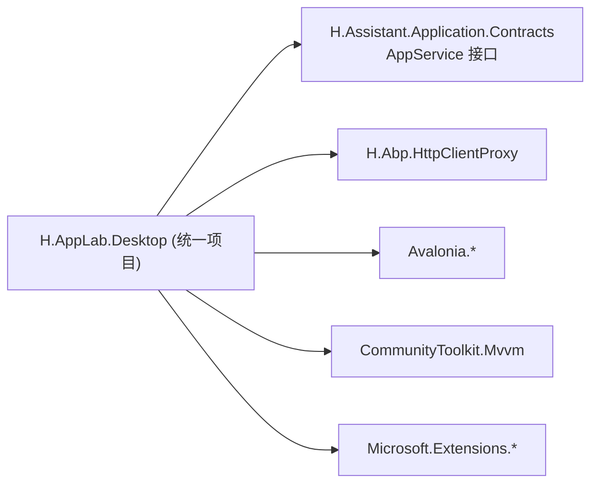

# 桌面端应用

<cite>
**本文引用的文件**
- [MainWindowViewModel.cs](file://src/Host/H.AppLab.Desktop/ViewModels/MainWindowViewModel.cs)
- [SettingsPageView.axaml](file://src/Host/H.AppLab.Desktop/Views/SettingsPageView.axaml)
- [ToastService.cs](file://src/Host/H.AppLab.Desktop/Services/ToastService.cs)
- [MainWindow.axaml](file://src/Host/H.AppLab.Desktop/Views/MainWindow.axaml)
- [IDesktopApp.cs](file://src/Host/H.AppLab.Desktop/IDesktopApp.cs)
- [Program.cs](file://src/Host/H.AppLab.Desktop/Program.cs)
- [H.AppLab.Desktop.csproj](file://src/Host/H.AppLab.Desktop/H.AppLab.Desktop.csproj)
- [AssistantStyles.axaml](file://src/Host/H.AppLab.Desktop/Themes/AssistantStyles.axaml)
</cite>

## 更新摘要
**变更内容**
- 项目重构：从 H.AppLab.Desktop.Host 重构为 H.AppLab.Desktop，移除了独立的 Contracts 项目
- 架构简化：所有 UI 组件、视图模型和服务已统一迁移到 H.AppLab.Desktop 项目中
- 依赖关系更新：项目直接引用 Assistant Application Contracts，不再通过中间层
- 部署配置优化：简化了项目结构和依赖管理

## 目录
1. [简介](#简介)
2. [项目结构](#项目结构)
3. [核心组件](#核心组件)
4. [架构总览](#架构总览)
5. [详细组件分析](#详细组件分析)
6. [依赖关系分析](#依赖关系分析)
7. [性能考虑](#性能考虑)
8. [故障排查指南](#故障排查指南)
9. [结论](#结论)
10. [附录](#附录)

## 简介
本文件为 AI 助手桌面端应用的开发文档，基于 Avalonia 框架实现跨平台桌面 UI，采用 MVVM 模式组织视图与视图模型。应用已从独立的桌面应用程序重构为统一的 H.AppLab.Desktop 项目，移除了 H.AppLab.Desktop.Contracts 独立项目，所有 UI 组件、视图模型和服务已整合到新项目中。应用通过 IDesktopApp 接口提供插件化架构，支持多应用统一管理。本文档涵盖：
- 重构后的项目结构与依赖关系
- IDesktopApp 插件接口规范
- 插件生命周期管理与服务容器配置
- MVVM 视图模型职责与交互逻辑
- 界面组件设计与数据绑定
- 与后端服务的通信机制（HTTP + SSE）
- 主题系统与样式管理
- 打包部署流程与跨平台兼容性
- 开发环境搭建与调试指南

## 项目结构
桌面端应用位于 H.AppLab.Desktop 项目中，作为统一的宿主应用存在，主要包含：
- 主窗口视图模型：MainWindowViewModel.cs（应用导航与状态管理）
- 设置页面：SettingsPageView.axaml（专用设置界面容器）
- 通知服务：ToastService.cs（全局 Toast 提示服务）
- 主窗口界面：MainWindow.axaml（宿主外壳布局）
- 插件接口：IDesktopApp.cs（插件契约定义）
- 程序入口：Program.cs（Avalonia 应用启动）
- 项目配置：H.AppLab.Desktop.csproj（依赖管理）
- 主题样式：AssistantStyles.axaml（统一样式系统）

**图表来源**
- [MainWindowViewModel.cs:14-150](file://src/Host/H.AppLab.Desktop/ViewModels/MainWindowViewModel.cs#L14-L150)
- [SettingsPageView.axaml:1-28](file://src/Host/H.AppLab.Desktop/Views/SettingsPageView.axaml#L1-L28)
- [ToastService.cs:10-49](file://src/Host/H.AppLab.Desktop/Services/ToastService.cs#L10-L49)
- [Program.cs:8-19](file://src/Host/H.AppLab.Desktop/Program.cs#L8-L19)

**章节来源**
- [MainWindowViewModel.cs:1-207](file://src/Host/H.AppLab.Desktop/ViewModels/MainWindowViewModel.cs#L1-L207)
- [SettingsPageView.axaml:1-28](file://src/Host/H.AppLab.Desktop/Views/SettingsPageView.axaml#L1-L28)
- [ToastService.cs:1-50](file://src/Host/H.AppLab.Desktop/Services/ToastService.cs#L1-L50)
- [Program.cs:1-20](file://src/Host/H.AppLab.Desktop/Program.cs#L1-L20)
- [H.AppLab.Desktop.csproj:1-29](file://src/Host/H.AppLab.Desktop/H.AppLab.Desktop.csproj#L1-L29)

## 核心组件
- 主窗口视图模型
  - MainWindowViewModel：应用导航、插件管理、设置页面控制
  - NavItemViewModel：左侧菜单项，支持应用、任务、应用中心导航
  - AppCardViewModel：应用卡片，用于首页和应用中心展示
- 设置页面系统
  - SettingsPageView.axaml：专用设置界面容器，集成 Toast 通知
  - SettingsViewModel：设置业务逻辑（来自插件）
- 通知服务
  - ToastService：全局 Toast 提示，支持成功、警告、错误类型
- 插件架构
  - IDesktopApp：插件接口规范
  - AssistantApp：Assistant 应用插件实现

**章节来源**
- [MainWindowViewModel.cs:14-207](file://src/Host/H.AppLab.Desktop/ViewModels/MainWindowViewModel.cs#L14-L207)
- [SettingsPageView.axaml:1-28](file://src/Host/H.AppLab.Desktop/Views/SettingsPageView.axaml#L1-L28)
- [ToastService.cs:10-49](file://src/Host/H.AppLab.Desktop/Services/ToastService.cs#L10-L49)
- [IDesktopApp.cs:12-31](file://src/Host/H.AppLab.Desktop/IDesktopApp.cs#L12-L31)

## 架构总览
桌面端采用统一的 H.AppLab.Desktop 项目架构，集成了原 Host 和 Contracts 的功能。MainWindowViewModel 负责应用导航、插件生命周期管理和设置页面控制。UI 层由 Axaml 视图与代码后置组成，业务状态由 ObservableObject 派生的 ViewModel 管理。ToastService 提供全局通知服务，确保用户反馈的一致性。Program.cs 作为 Avalonia 应用入口，统一启动整个桌面应用。

**图表来源**
- [MainWindowViewModel.cs:42-92](file://src/Host/H.AppLab.Desktop/ViewModels/MainWindowViewModel.cs#L42-L92)
- [Program.cs:14-19](file://src/Host/H.AppLab.Desktop/Program.cs#L14-L19)

## 详细组件分析

### 程序入口与应用启动
- Program.cs 核心功能
  - Avalonia 应用入口点，使用 STAThread 属性确保单线程单元
  - BuildAvaloniaApp() 方法配置 Avalonia 应用实例
  - StartWithClassicDesktopLifetime() 提供经典桌面应用生命周期
  - UsePlatformDetect() 自动检测运行平台
  - WithInterFont() 启用 Inter 字体支持
  - LogToTrace() 启用日志跟踪

**图表来源**
- [Program.cs:10-19](file://src/Host/H.AppLab.Desktop/Program.cs#L10-L19)

**章节来源**
- [Program.cs:1-20](file://src/Host/H.AppLab.Desktop/Program.cs#L1-L20)

### 主窗口视图模型与导航系统
- MainWindowViewModel 核心功能
  - 插件应用管理：扫描并注册所有 IDesktopApp 插件
  - 导航管理：维护 NavItems 集合，支持应用、任务、应用中心、设置导航
  - 视图缓存：缓存已创建的插件视图，避免重复创建开销
  - 设置页面控制：集成 SettingsPageView，支持返回导航
- 导航逻辑
  - Navigate() 方法处理不同菜单项的导航
  - 设置页面特殊处理：记录上一个内容页，支持返回功能
  - 插件应用视图懒加载：首次访问时创建并缓存

**图表来源**
- [MainWindowViewModel.cs:65-92](file://src/Host/H.AppLab.Desktop/ViewModels/MainWindowViewModel.cs#L65-L92)
- [MainWindowViewModel.cs:112-123](file://src/Host/H.AppLab.Desktop/ViewModels/MainWindowViewModel.cs#L112-L123)

**章节来源**
- [MainWindowViewModel.cs:42-150](file://src/Host/H.AppLab.Desktop/ViewModels/MainWindowViewModel.cs#L42-L150)

### 设置页面系统与 Toast 通知
- SettingsPageView.axaml 设计
  - 专用设置容器：承载 SettingsView 并提供独立样式
  - Toast 通知集成：底部居中显示，支持自动消失
  - 样式引用：使用 AssistantStyles.axaml 统一样式
- ToastService 功能特性
  - 三种通知类型：success（绿色）、warning（黄色）、error（红色）
  - 自动消失：3秒后自动隐藏
  - 线程安全：使用 Dispatcher.UIThread.Post 确保 UI 线程操作
  - 取消机制：支持中断当前通知显示

**图表来源**
- [SettingsPageView.axaml:14-26](file://src/Host/H.AppLab.Desktop/Views/SettingsPageView.axaml#L14-L26)
- [ToastService.cs:23-48](file://src/Host/H.AppLab.Desktop/Services/ToastService.cs#L23-L48)
- [MainWindowViewModel.cs:112-123](file://src/Host/H.AppLab.Desktop/ViewModels/MainWindowViewModel.cs#L112-L123)

**章节来源**
- [SettingsPageView.axaml:1-28](file://src/Host/H.AppLab.Desktop/Views/SettingsPageView.axaml#L1-L28)
- [ToastService.cs:1-50](file://src/Host/H.AppLab.Desktop/Services/ToastService.cs#L1-L50)

### 插件架构与生命周期
- IDesktopApp 接口规范
  - Id：应用唯一标识（如 "assistant"）
  - Name：应用显示名称（如 "会话"）
  - Icon：应用图标（emoji 字符，如 "💬"）
  - Description：应用描述（应用中心展示）
  - ConfigureServices：注册应用自身的服务
  - CreateView：创建应用根视图
- AssistantApp 插件实现
  - 实现 IDesktopApp 接口的所有属性与方法
  - ConfigureServices 方法中注册远程服务、HttpClient、ToastService、ChatStreamClient 与各 ViewModel
  - CreateView 方法返回 AssistantAppView 实例，设置 DataContext 为 AssistantAppViewModel

**图表来源**
- [IDesktopApp.cs:26-30](file://src/Host/H.AppLab.Desktop/IDesktopApp.cs#L26-L30)

**章节来源**
- [IDesktopApp.cs:12-31](file://src/Host/H.AppLab.Desktop/IDesktopApp.cs#L12-L31)

### 项目依赖与配置管理
- H.AppLab.Desktop.csproj 配置
  - OutputType: WinExe（Windows 可执行文件）
  - AvaloniaUseCompiledBindingsByDefault: false（禁用编译时绑定）
  - ApplicationTitle: AppLab（应用标题）
- 包依赖
  - Avalonia 生态：Avalonia、Avalonia.Desktop、Avalonia.Themes.Fluent、Avalonia.Fonts.Inter
  - MVVM 框架：CommunityToolkit.Mvvm
  - Markdown 渲染：Markdig
  - 配置管理：Microsoft.Extensions.Configuration.Abstractions、Microsoft.Extensions.Configuration.Json
  - 依赖注入：Microsoft.Extensions.DependencyInjection.Abstractions
  - HTTP 客户端：Microsoft.Extensions.Http
- 项目引用
  - H.Assistant.Application.Contracts：Assistant 应用服务契约
  - H.Abp.HttpClientProxy：HTTP 代理生成器

**图表来源**
- [H.AppLab.Desktop.csproj:8-27](file://src/Host/H.AppLab.Desktop/H.AppLab.Desktop.csproj#L8-L27)

**章节来源**
- [H.AppLab.Desktop.csproj:1-29](file://src/Host/H.AppLab.Desktop/H.AppLab.Desktop.csproj#L1-L29)

### 主题系统与样式管理
- AssistantStyles.axaml 提供完整的 UI 样式体系
- 支持的样式类型：
  - 按钮样式：btn、primary、assistantPrimary、link、danger、small、iconBtn、ghostIcon、modalPrimary、modalCancel
  - 标签样式：tag、tagGreen、tagBlue、tagDefault
  - 表单样式：formLabel、modalInput、modalSelect、numericUpDown.modalInput
  - 菜单样式：menuItem、menuItemDanger
  - 卡片样式：card
  - Tab 样式：tabItem、tabItemActive
  - 侧栏样式：sideMenuItem、sideMenuActive、sectionTitle、sessionItem、sessionItemActive
  - 分类筛选：categoryChip、categoryChipActive
  - 分段切换：segBtn、segBtnActive

**图表来源**
- [AssistantStyles.axaml:6-373](file://src/Host/H.AppLab.Desktop/Themes/AssistantStyles.axaml#L6-L373)

**章节来源**
- [AssistantStyles.axaml:1-375](file://src/Host/H.AppLab.Desktop/Themes/AssistantStyles.axaml#L1-L375)

### 与后端服务的通信机制（HTTP + SSE）
- HTTP 代理：通过 Abp.HttpClientProxy 将 AssistantApplicationContracts 中的 AppService 自动生成为 HttpClient 代理，统一通过 AssistantRemoteServiceName 访问
- SSE 流式：ChatStreamClient 使用 IHttpClientFactory 创建客户端，POST 到 /api/assistant/chat/stream，Accept: text/event-stream，逐行解析 data: 前缀，遇到 [DONE] 结束
- 配置：BaseUrl 来自宿主提供的 IConfiguration；Http.AllowInvalidCertificates 控制本地开发自签名证书

**图表来源**
- [AssistantApp.cs:34-46](file://src/Agent/Assistant/H.Assistant.UI/AssistantApp.cs#L34-L46)

**章节来源**
- [AssistantApp.cs:34-46](file://src/Agent/Assistant/H.Assistant.UI/AssistantApp.cs#L34-L46)

### 应用配置管理与设置持久化
- 配置来源：宿主通过 IConfiguration 提供配置，包括 RemoteServices 与 Http 配置
- 配置加载：AssistantApp.ConfigureServices 使用传入的 configuration 参数进行服务注册
- 设置持久化：建议在 ViewModel 或专用 SettingsService 中将设置序列化到本地文件或系统设置（如 JSON 文件），并在应用启动时加载；可结合 Microsoft.Extensions.Configuration 的 FileProvider 实现热重载

[本节为通用指导，不直接分析具体文件]

### 打包部署与跨平台兼容
- 项目类型：H.AppLab.Desktop.csproj 指定为 WinExe，生成 Windows 可执行文件
- 依赖包：Avalonia、Avalonia.Desktop、CommunityToolkit.Mvvm、Markdig、Microsoft.Extensions.*、Abp.HttpClientProxy
- 发布建议：使用 dotnet publish -c Release 生成独立可执行文件；确保依赖的 Avalonia 运行时可用；支持跨平台部署

**章节来源**
- [H.AppLab.Desktop.csproj:1-29](file://src/Host/H.AppLab.Desktop/H.AppLab.Desktop.csproj#L1-L29)

### 开发环境搭建与调试指南
- 环境要求：.NET SDK（与 common.props/global.json 一致）、Avalonia 工具链
- 启动步骤：
  - 恢复 NuGet 包与项目引用
  - 配置 appsettings.json 指向后端服务地址
  - 运行 H.AppLab.Desktop 项目，应用直接启动
- 调试要点：
  - 在 MainWindowViewModel 中设置断点调试导航逻辑
  - 检查 HttpClient 证书策略（AllowInvalidCertificates=true 仅用于本地开发）
  - 使用浏览器或 Postman 验证 /api/assistant/chat/stream 接口返回 SSE 流

**章节来源**
- [Program.cs:10-19](file://src/Host/H.AppLab.Desktop/Program.cs#L10-L19)

## 依赖关系分析
- 外部依赖
  - Avalonia 生态：UI 框架、控件库、主题和字体
  - CommunityToolkit.Mvvm：ObservableObject、命令与属性通知
  - Markdig：Markdown 渲染
  - Microsoft.Extensions.*：配置、HTTP 客户端、DI
  - Abp.HttpClientProxy：远程服务代理生成
- 内部依赖
  - H.Assistant.Application.Contracts：AppService 接口定义
  - H.Abp.HttpClientProxy：HTTP 代理拦截器与扩展

**图表来源**
- [H.AppLab.Desktop.csproj:24-27](file://src/Host/H.AppLab.Desktop/H.AppLab.Desktop.csproj#L24-L27)

**章节来源**
- [H.AppLab.Desktop.csproj:24-27](file://src/Host/H.AppLab.Desktop/H.AppLab.Desktop.csproj#L24-L27)

## 性能考虑
- 插件加载：宿主缓存插件实例，避免重复创建和销毁开销
- 流式渲染：SSE 增量推送避免整段等待，提升首字延迟与用户体验
- 异步与取消：ChatStreamClient.StreamAsync 支持 CancellationToken，避免长时间阻塞
- 资源管理：使用 using 与 IAsyncEnumerable 确保流与连接释放
- UI 线程：ViewModel 属性变更应在 UI 线程触发，避免跨线程异常
- 缓存与去重：对频繁查询的设置或元数据可加入内存缓存
- 视图缓存：MainWindowViewModel 缓存已创建的插件视图，减少重复创建开销

[本节为通用指导，不直接分析具体文件]

## 故障排查指南
- 应用无法启动
  - 检查 .NET SDK 版本是否与 global.json 一致
  - 确认 Avalonia 包是否正确安装
- 插件无法加载
  - 检查 IDesktopApp 接口实现是否正确
  - 确认插件 DLL 是否在输出目录中
- 服务配置错误
  - 检查 appsettings.json 配置是否正确
  - 验证 RemoteServices 配置项是否存在
- SSE 流无数据
  - 验证后端 /api/assistant/chat/stream 接口是否返回 text/event-stream
  - 检查 Accept 头与 data: 前缀解析逻辑
- 样式未生效
  - 确认 AssistantStyles.axaml 是否正确引用
  - 检查样式选择器语法是否正确
- 视图未更新
  - 确认 ViewModel 属性变更触发了 PropertyChanged
  - 检查值转换器与绑定路径
- 设置页面导航问题
  - 检查 SettingsPageView 的 DataContext 是否正确设置
  - 验证 BackRequested 事件是否正确订阅
- Toast 通知不显示
  - 确认 ToastService 已正确注册到服务容器
  - 检查 IsVisible 属性绑定是否正确

**章节来源**
- [MainWindowViewModel.cs:112-123](file://src/Host/H.AppLab.Desktop/ViewModels/MainWindowViewModel.cs#L112-L123)
- [ToastService.cs:23-48](file://src/Host/H.AppLab.Desktop/Services/ToastService.cs#L23-L48)

## 结论
桌面端应用已成功从 H.AppLab.Desktop.Host 重构为统一的 H.AppLab.Desktop 项目，移除了独立的 Contracts 项目，简化了项目结构和依赖关系。新的架构提供了更好的模块化程度和可扩展性，便于多应用共存和统一管理。MainWindowViewModel 提供了强大的导航功能，支持插件应用、任务中心、应用中心和设置的统一入口。新的 SettingsPageView.axaml 提供了专用的设置界面容器，集成了 Toast 通知服务，提升了用户体验。这种设计提高了系统的可维护性和扩展性，清晰的职责划分与模块化设计便于后续开发和维护。建议在生产环境关闭自签名证书允许策略，完善设置持久化与错误处理，确保跨平台稳定运行。

[本节为总结性内容，不直接分析具体文件]

## 附录
- 常用命令
  - 还原与构建：dotnet restore、dotnet build
  - 运行应用：dotnet run --project src/Host/H.AppLab.Desktop
  - 发布应用：dotnet publish -c Release
- 相关参考
  - Avalonia 官方文档
  - CommunityToolkit.Mvvm 文档
  - Abp.HttpClientProxy 使用示例
  - IDesktopApp 插件接口规范

[本节为补充信息，不直接分析具体文件]