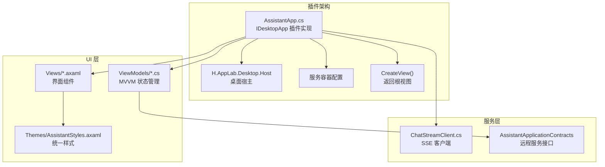
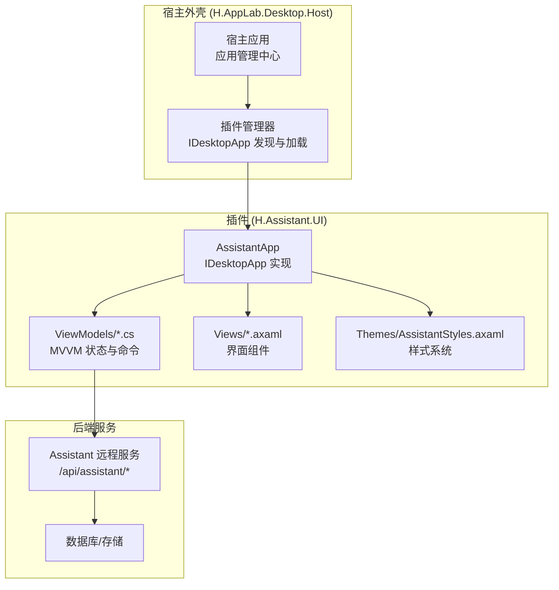
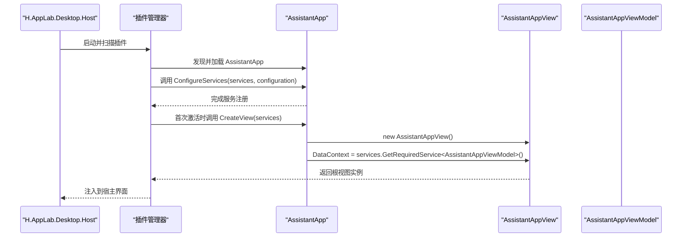
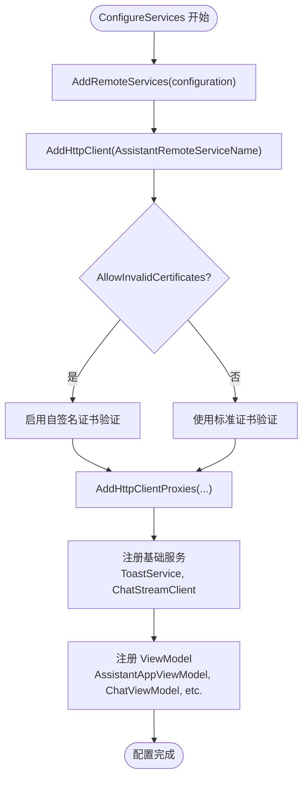
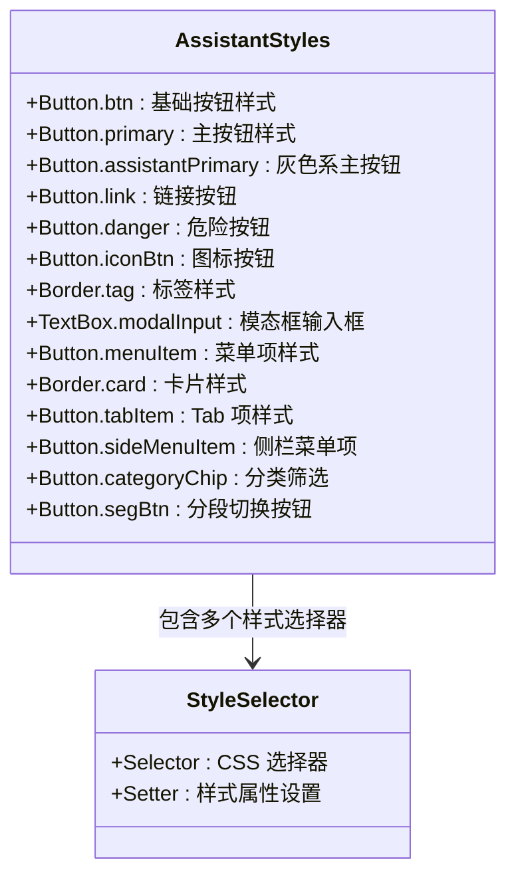
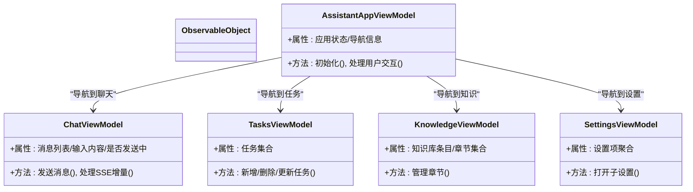
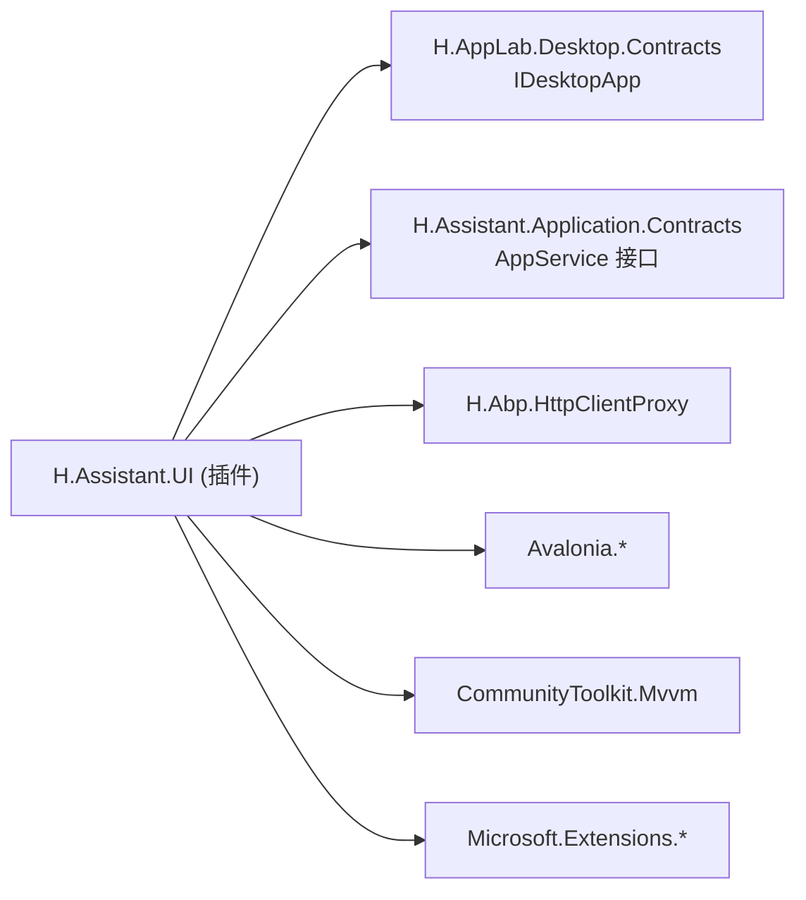

# 桌面端应用

<cite>
**本文引用的文件**
- [IDesktopApp.cs](file://src/Host/H.AppLab.Desktop.Contracts/IDesktopApp.cs)
- [AssistantApp.cs](file://src/Agent/Assistant/H.Assistant.UI/AssistantApp.cs)
- [AssistantStyles.axaml](file://src/Agent/Assistant/H.Assistant.UI/Themes/AssistantStyles.axaml)
- [H.Assistant.UI.csproj](file://src/Agent/Assistant/H.Assistant.UI/H.Assistant.UI.csproj)
</cite>

## 更新摘要
**变更内容**
- H.Assistant.Desktop 已重构为 H.Assistant.UI，实现 IDesktopApp 接口成为插件
- 项目结构从独立桌面应用转变为可被桌面主机托管的插件形式
- 新增 AssistantApp.cs 插件实现类，提供应用配置与视图创建
- 引入主题系统 AssistantStyles.axaml，统一界面样式
- 移除原有的 Program.cs、App.axaml.cs、ClientServices.cs 等独立应用入口文件

## 目录
1. [简介](#简介)
2. [项目结构](#项目结构)
3. [核心组件](#核心组件)
4. [架构总览](#架构总览)
5. [详细组件分析](#详细组件分析)
6. [依赖关系分析](#依赖关系分析)
7. [性能考虑](#性能考虑)
8. [故障排查指南](#故障排查指南)
9. [结论](#结论)
10. [附录](#附录)

## 简介
本文件为 AI 助手桌面端应用的开发文档，基于 Avalonia 框架实现跨平台桌面 UI，采用 MVVM 模式组织视图与视图模型。应用已从独立的桌面应用程序重构为可被 H.AppLab.Desktop.Host 宿主托管的插件形式，通过实现 IDesktopApp 接口提供统一的插件接入机制。应用通过 HTTP 客户端代理与后端 Assistant 服务通信，并支持 SSE（Server-Sent Events）流式响应以实现实时对话体验。本文档涵盖：
- 插件架构设计与 IDesktopApp 接口规范
- 插件生命周期管理与服务容器配置
- MVVM 视图模型职责与交互逻辑
- 界面组件设计与数据绑定
- 与后端服务的通信机制（HTTP + SSE）
- 主题系统与样式管理
- 打包部署流程与跨平台兼容性
- 开发环境搭建与调试指南

## 项目结构
桌面端应用位于 H.Assistant.UI 项目中，作为插件形式存在，主要包含：
- 插件实现：AssistantApp.cs（实现 IDesktopApp 接口）
- 主题系统：Themes/AssistantStyles.axaml（统一样式定义）
- 视图模型：ViewModels 目录下的各类 ViewModel
- 视图与控件：Views 目录下的 Axaml 及代码后置
- 服务层：Services/ChatStreamClient.cs（SSE 流式客户端）
- 项目文件：H.Assistant.UI.csproj（插件依赖与配置）

**图表来源**
- [AssistantApp.cs:17-70](file://src/Agent/Assistant/H.Assistant.UI/AssistantApp.cs#L17-L70)
- [IDesktopApp.cs:12-31](file://src/Host/H.AppLab.Desktop.Contracts/IDesktopApp.cs#L12-L31)
- [AssistantStyles.axaml:1-375](file://src/Agent/Assistant/H.Assistant.UI/Themes/AssistantStyles.axaml#L1-L375)

**章节来源**
- [AssistantApp.cs:1-71](file://src/Agent/Assistant/H.Assistant.UI/AssistantApp.cs#L1-L71)
- [IDesktopApp.cs:1-32](file://src/Host/H.AppLab.Desktop.Contracts/IDesktopApp.cs#L1-L32)
- [AssistantStyles.axaml:1-375](file://src/Agent/Assistant/H.Assistant.UI/Themes/AssistantStyles.axaml#L1-L375)
- [H.Assistant.UI.csproj](file://src/Agent/Assistant/H.Assistant.UI/H.Assistant.UI.csproj)

## 核心组件
- 插件契约与实现
  - IDesktopApp：定义插件接口规范，包括应用标识、名称、图标、描述和服务配置
  - AssistantApp：实现 IDesktopApp 接口，提供 Assistant 应用的完整功能
- 服务容器配置
  - ConfigureServices：注册远程服务、HttpClient、ToastService、ChatStreamClient 与各 ViewModel
  - CreateView：创建并返回根视图 AssistantAppView
- 主题系统
  - AssistantStyles.axaml：定义完整的 UI 样式体系，包括按钮、标签、表单、卡片等组件样式
- 视图模型（MVVM）
  - AssistantAppViewModel：插件主视图模型
  - ChatViewModel：聊天会话、消息列表、发送与流式渲染
  - TasksViewModel：任务管理
  - KnowledgeViewModel：知识库管理与章节视图
  - SettingsViewModel：全局设置入口
- 网络与服务
  - ChatStreamClient.cs：SSE 流式客户端，对接 /api/assistant/chat/stream

**章节来源**
- [AssistantApp.cs:17-70](file://src/Agent/Assistant/H.Assistant.UI/AssistantApp.cs#L17-L70)
- [IDesktopApp.cs:12-31](file://src/Host/H.AppLab.Desktop.Contracts/IDesktopApp.cs#L12-L31)
- [AssistantStyles.axaml:1-375](file://src/Agent/Assistant/H.Assistant.UI/Themes/AssistantStyles.axaml#L1-L375)

## 架构总览
桌面端采用插件化架构，H.Assistant.UI 作为插件实现 IDesktopApp 接口，由 H.AppLab.Desktop.Host 宿主统一管理生命周期。UI 层由 Axaml 视图与代码后置组成，业务状态由 ObservableObject 派生的 ViewModel 管理，服务层通过 Abp.HttpClientProxy 生成远程服务代理，统一通过 HttpClient 访问后端 Assistant 服务。SSE 用于流式响应，提升对话体验。

**图表来源**
- [AssistantApp.cs:17-70](file://src/Agent/Assistant/H.Assistant.UI/AssistantApp.cs#L17-L70)
- [IDesktopApp.cs:12-31](file://src/Host/H.AppLab.Desktop.Contracts/IDesktopApp.cs#L12-L31)

## 详细组件分析

### 插件架构与生命周期
- IDesktopApp 接口规范
  - Id：应用唯一标识（如 "assistant"）
  - Name：应用显示名称（如 "会话"）
  - Icon：应用图标（emoji 字符，如 "💬"）
  - Description：应用描述（应用中心展示）
  - ConfigureServices：注册应用自身的服务（配置由宿主统一提供）
  - CreateView：创建应用根视图
- AssistantApp 插件实现
  - 实现 IDesktopApp 接口的所有属性与方法
  - ConfigureServices 方法中注册远程服务、HttpClient、ToastService、ChatStreamClient 与各 ViewModel
  - CreateView 方法返回 AssistantAppView 实例，设置 DataContext 为 AssistantAppViewModel

**图表来源**
- [AssistantApp.cs:29-69](file://src/Agent/Assistant/H.Assistant.UI/AssistantApp.cs#L29-L69)
- [IDesktopApp.cs:26-30](file://src/Host/H.AppLab.Desktop.Contracts/IDesktopApp.cs#L26-L30)

**章节来源**
- [AssistantApp.cs:17-70](file://src/Agent/Assistant/H.Assistant.UI/AssistantApp.cs#L17-L70)
- [IDesktopApp.cs:12-31](file://src/Host/H.AppLab.Desktop.Contracts/IDesktopApp.cs#L12-L31)

### 服务容器配置
- 远程服务配置
  - AddRemoteServices(configuration)：注册远程服务基础配置
  - AddHttpClient(AssistantRemoteServiceName)：配置 HttpClient，支持自签名证书验证
  - AddHttpClientProxies(...)：为 Assistant Application Contracts 中的所有 AppService 生成 HTTP 代理
- 客户端基础服务
  - ToastService：通知服务
  - ChatStreamClient：SSE 流式客户端
- ViewModel 注册
  - AssistantAppViewModel、ChatViewModel、TasksViewModel、KnowledgeViewModel、SettingsViewModel

**图表来源**
- [AssistantApp.cs:29-61](file://src/Agent/Assistant/H.Assistant.UI/AssistantApp.cs#L29-L61)

**章节来源**
- [AssistantApp.cs:29-61](file://src/Agent/Assistant/H.Assistant.UI/AssistantApp.cs#L29-L61)

### 主题系统与样式管理
- AssistantStyles.axaml 提供完整的 UI 样式体系
- 支持的样式类型：
  - 按钮样式：btn、primary、assistantPrimary、link、danger、small、iconBtn、ghostIcon、modalPrimary、modalCancel
  - 标签样式：tag、tagGreen、tagBlue、tagDefault
  - 表单样式：formLabel、modalInput、modalSelect、numericUpDown.modalInput
  - 菜单样式：menuItem、menuItemDanger
  - 卡片样式：card
  - Tab 样式：tabItem、tabItemActive
  - 侧栏样式：sideMenuItem、sideMenuActive、sectionTitle、sessionItem、sessionItemActive
  - 分类筛选：categoryChip、categoryChipActive
  - 分段切换：segBtn、segBtnActive

**图表来源**
- [AssistantStyles.axaml:6-373](file://src/Agent/Assistant/H.Assistant.UI/Themes/AssistantStyles.axaml#L6-L373)

**章节来源**
- [AssistantStyles.axaml:1-375](file://src/Agent/Assistant/H.Assistant.UI/Themes/AssistantStyles.axaml#L1-L375)

### 视图模型（MVVM）
- 基类与模式：所有 ViewModel 继承自 CommunityToolkit.Mvvm 的 ObservableObject，提供属性变更通知与命令支持
- 关键职责
  - AssistantAppViewModel：插件主视图模型，管理整体应用状态
  - ChatViewModel：消息集合、输入内容、发送消息、接收 SSE 流式增量更新
  - TasksViewModel：任务列表、增删改查、状态同步
  - KnowledgeViewModel：知识库条目与章节管理，内部包含 KnowledgeSectionViewModel
  - SettingsViewModel：设置入口与聚合子设置

**图表来源**
- [AssistantApp.cs:55-60](file://src/Agent/Assistant/H.Assistant.UI/AssistantApp.cs#L55-L60)

**章节来源**
- [AssistantApp.cs:55-60](file://src/Agent/Assistant/H.Assistant.UI/AssistantApp.cs#L55-L60)

### 与后端服务的通信机制（HTTP + SSE）
- HTTP 代理：通过 Abp.HttpClientProxy 将 AssistantApplicationContracts 中的 AppService 自动生成为 HttpClient 代理，统一通过 AssistantRemoteServiceName 访问
- SSE 流式：ChatStreamClient 使用 IHttpClientFactory 创建客户端，POST 到 /api/assistant/chat/stream，Accept: text/event-stream，逐行解析 data: 前缀，遇到 [DONE] 结束
- 配置：BaseUrl 来自宿主提供的 IConfiguration；Http.AllowInvalidCertificates 控制本地开发自签名证书

**图表来源**
- [AssistantApp.cs:34-46](file://src/Agent/Assistant/H.Assistant.UI/AssistantApp.cs#L34-L46)

**章节来源**
- [AssistantApp.cs:34-46](file://src/Agent/Assistant/H.Assistant.UI/AssistantApp.cs#L34-L46)

### 应用配置管理与设置持久化
- 配置来源：宿主通过 IConfiguration 提供配置，包括 RemoteServices 与 Http 配置
- 配置加载：AssistantApp.ConfigureServices 使用传入的 configuration 参数进行服务注册
- 设置持久化：建议在 ViewModel 或专用 SettingsService 中将设置序列化到本地文件或系统设置（如 JSON 文件），并在应用启动时加载；可结合 Microsoft.Extensions.Configuration 的 FileProvider 实现热重载

[本节为通用指导，不直接分析具体文件]

### 打包部署与跨平台兼容
- 项目类型：H.Assistant.UI.csproj 指定为 ClassLibrary，作为插件库存在
- 依赖包：Avalonia、Avalonia.Controls、CommunityToolkit.Mvvm、Markdig、Microsoft.Extensions.*、Abp.HttpClientProxy
- 发布建议：使用 dotnet publish -c Release 生成插件 DLL；确保依赖的 Avalonia 运行时可用；插件由 H.AppLab.Desktop.Host 动态加载

**章节来源**
- [H.Assistant.UI.csproj](file://src/Agent/Assistant/H.Assistant.UI/H.Assistant.UI.csproj)

### 开发环境搭建与调试指南
- 环境要求：.NET SDK（与 common.props/global.json 一致）、Avalonia 工具链
- 启动步骤：
  - 恢复 NuGet 包与项目引用
  - 配置 H.AppLab.Desktop.Host 的 appsettings.json 指向后端服务地址
  - 运行 H.AppLab.Desktop.Host 项目，插件会自动发现和加载
- 调试要点：
  - 在 AssistantApp 中设置断点调试插件生命周期
  - 检查 HttpClient 证书策略（AllowInvalidCertificates=true 仅用于本地开发）
  - 使用浏览器或 Postman 验证 /api/assistant/chat/stream 接口返回 SSE 流

**章节来源**
- [AssistantApp.cs:29-61](file://src/Agent/Assistant/H.Assistant.UI/AssistantApp.cs#L29-L61)

## 依赖关系分析
- 外部依赖
  - Avalonia 生态：UI 框架、控件库
  - CommunityToolkit.Mvvm：ObservableObject、命令与属性通知
  - Markdig：Markdown 渲染
  - Microsoft.Extensions.*：配置、HTTP 客户端、DI
  - Abp.HttpClientProxy：远程服务代理生成
- 内部依赖
  - H.AppLab.Desktop.Contracts：IDesktopApp 接口定义
  - H.Assistant.Application.Contracts：AppService 接口定义
  - H.Abp.HttpClientProxy：HTTP 代理拦截器与扩展

**图表来源**
- [AssistantApp.cs:1-10](file://src/Agent/Assistant/H.Assistant.UI/AssistantApp.cs#L1-L10)

**章节来源**
- [AssistantApp.cs:1-10](file://src/Agent/Assistant/H.Assistant.UI/AssistantApp.cs#L1-L10)

## 性能考虑
- 插件加载：宿主缓存插件实例，避免重复创建和销毁开销
- 流式渲染：SSE 增量推送避免整段等待，提升首字延迟与用户体验
- 异步与取消：ChatStreamClient.StreamAsync 支持 CancellationToken，避免长时间阻塞
- 资源管理：使用 using 与 IAsyncEnumerable 确保流与连接释放
- UI 线程：ViewModel 属性变更应在 UI 线程触发，避免跨线程异常
- 缓存与去重：对频繁查询的设置或元数据可加入内存缓存

[本节为通用指导，不直接分析具体文件]

## 故障排查指南
- 插件无法加载
  - 检查 H.AppLab.Desktop.Host 是否正确引用 H.Assistant.UI.dll
  - 确认 IDesktopApp 接口实现正确
- 服务配置错误
  - 检查宿主传递的 IConfiguration 是否正确
  - 验证 RemoteServices 配置项是否存在
- SSE 流无数据
  - 验证后端 /api/assistant/chat/stream 接口是否返回 text/event-stream
  - 检查 Accept 头与 data: 前缀解析逻辑
- 样式未生效
  - 确认 AssistantStyles.axaml 是否正确引用
  - 检查样式选择器语法是否正确
- 视图未更新
  - 确认 ViewModel 属性变更触发了 PropertyChanged
  - 检查值转换器与绑定路径

**章节来源**
- [AssistantApp.cs:29-69](file://src/Agent/Assistant/H.Assistant.UI/AssistantApp.cs#L29-L69)

## 结论
本桌面端应用已从独立的桌面应用程序重构为插件化架构，H.Assistant.UI 通过实现 IDesktopApp 接口成为可被 H.AppLab.Desktop.Host 宿主管理的插件。这种设计提高了系统的模块化程度和可扩展性，便于多应用共存和统一管理。清晰的职责划分与模块化设计便于扩展与维护。建议在生产环境关闭自签名证书允许策略，完善设置持久化与错误处理，确保跨平台稳定运行。

[本节为总结性内容，不直接分析具体文件]

## 附录
- 常用命令
  - 还原与构建：dotnet restore、dotnet build
  - 运行宿主：dotnet run --project src/Host/H.AppLab.Desktop.Host
  - 发布插件：dotnet publish -c Release
- 相关参考
  - Avalonia 官方文档
  - CommunityToolkit.Mvvm 文档
  - Abp.HttpClientProxy 使用示例
  - IDesktopApp 插件接口规范

[本节为补充信息，不直接分析具体文件]