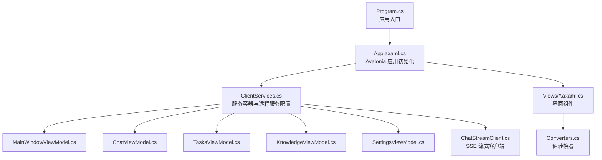
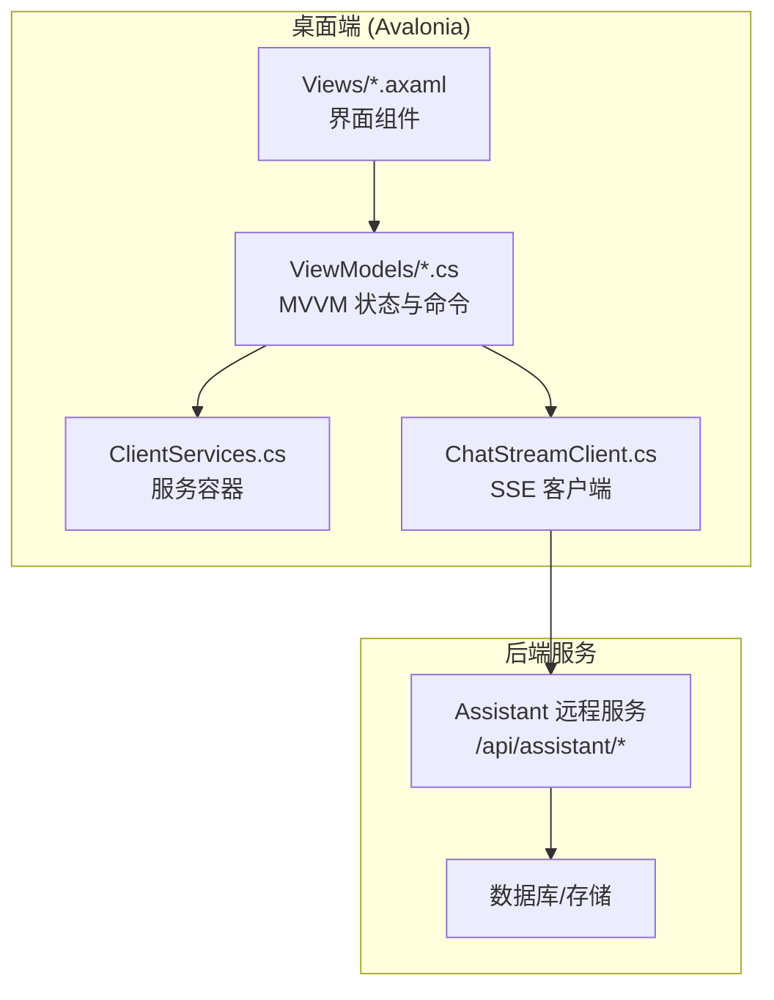
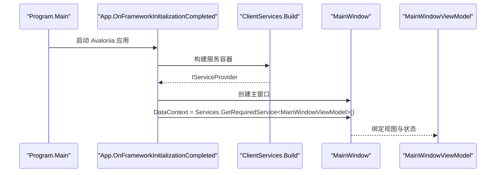
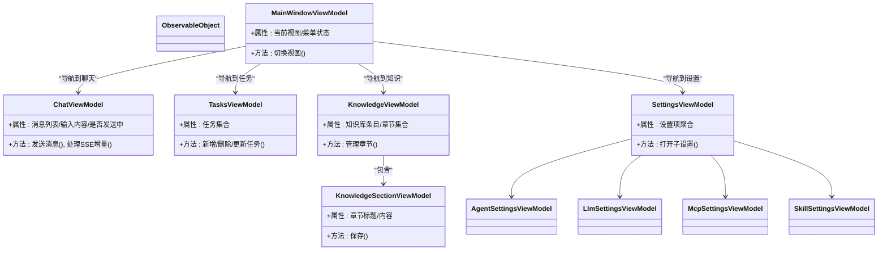
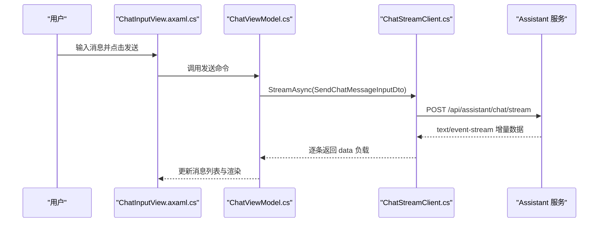
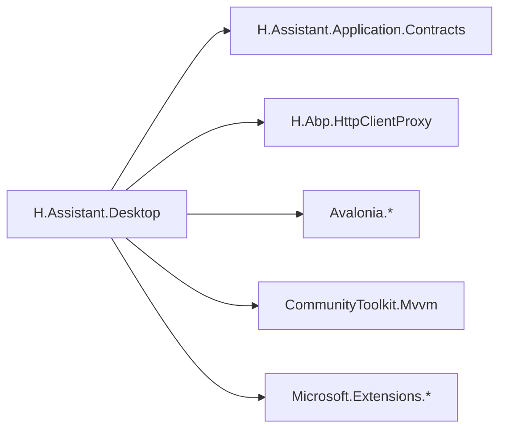

# 桌面端应用

<cite>
**本文引用的文件**   
- [Program.cs](file://src/Agent/Assistant/H.Assistant.Desktop/Program.cs)
- [App.axaml.cs](file://src/Agent/Assistant/H.Assistant.Desktop/App.axaml.cs)
- [ClientServices.cs](file://src/Agent/Assistant/H.Assistant.Desktop/ClientServices.cs)
- [appsettings.json](file://src/Agent/Assistant/H.Assistant.Desktop/appsettings.json)
- [H.Assistant.Desktop.csproj](file://src/Agent/Assistant/H.Assistant.Desktop/H.Assistant.Desktop.csproj)
- [Converters.cs](file://src/Agent/Assistant/H.Assistant.Desktop/Converters.cs)
- [ChatStreamClient.cs](file://src/Agent/Assistant/H.Assistant.Desktop/Services/ChatStreamClient.cs)
- [MainWindowViewModel.cs](file://src/Agent/Assistant/H.Assistant.Desktop/ViewModels/MainWindowViewModel.cs)
- [ChatViewModel.cs](file://src/Agent/Assistant/H.Assistant.Desktop/ViewModels/ChatViewModel.cs)
- [TasksViewModel.cs](file://src/Agent/Assistant/H.Assistant.Desktop/ViewModels/TasksViewModel.cs)
- [KnowledgeViewModel.cs](file://src/Agent/Assistant/H.Assistant.Desktop/ViewModels/KnowledgeViewModel.cs)
- [SettingsViewModel.cs](file://src/Agent/Assistant/H.Assistant.Desktop/ViewModels/SettingsViewModel.cs)
- [AgentSettingsViewModel.cs](file://src/Agent/Assistant/H.Assistant.Desktop/ViewModels/AgentSettingsViewModel.cs)
- [LlmSettingsViewModel.cs](file://src/Agent/Assistant/H.Assistant.Desktop/ViewModels/LlmSettingsViewModel.cs)
- [McpSettingsViewModel.cs](file://src/Agent/Assistant/H.Assistant.Desktop/ViewModels/McpSettingsViewModel.cs)
- [SkillSettingsViewModel.cs](file://src/Agent/Assistant/H.Assistant.Desktop/ViewModels/SkillSettingsViewModel.cs)
- [ChatView.axaml.cs](file://src/Agent/Assistant/H.Assistant.Desktop/Views/ChatView.axaml.cs)
- [ChatInputView.axaml.cs](file://src/Agent/Assistant/H.Assistant.Desktop/Views/ChatInputView.axaml.cs)
- [AgentSettingsView.axaml.cs](file://src/Agent/Assistant/H.Assistant.Desktop/Views/AgentSettingsView.axaml.cs)
- [LlmSettingsView.axaml.cs](file://src/Agent/Assistant/H.Assistant.Desktop/Views/LlmSettingsView.axaml.cs)
- [McpSettingsView.axaml.cs](file://src/Agent/Assistant/H.Assistant.Desktop/Views/McpSettingsView.axaml.cs)
- [SkillSettingsView.axaml.cs](file://src/Agent/Assistant/H.Assistant.Desktop/Views/SkillSettingsView.axaml.cs)
- [KnowledgeView.axaml.cs](file://src/Agent/Assistant/H.Assistant.Desktop/Views/KnowledgeView.axaml.cs)
- [KnowledgeSectionView.axaml.cs](file://src/Agent/Assistant/H.Assistant.Desktop/Views/KnowledgeSectionView.axaml.cs)
- [TasksView.axaml.cs](file://src/Agent/Assistant/H.Assistant.Desktop/Views/TasksView.axaml.cs)
- [SettingsView.axaml.cs](file://src/Agent/Assistant/H.Assistant.Desktop/Views/SettingsView.axaml.cs)
</cite>

## 目录
1. [简介](#简介)
2. [项目结构](#项目结构)
3. [核心组件](#核心组件)
4. [架构总览](#架构总览)
5. [详细组件分析](#详细组件分析)
6. [依赖关系分析](#依赖关系分析)
7. [性能考虑](#性能考虑)
8. [故障排查指南](#故障排查指南)
9. [结论](#结论)
10. [附录](#附录)

## 简介
本文件为 AI 助手桌面端应用的开发文档，基于 Avalonia 框架实现跨平台桌面 UI，采用 MVVM 模式组织视图与视图模型。应用通过 HTTP 客户端代理与后端 Assistant 服务通信，并支持 SSE（Server-Sent Events）流式响应以实现实时对话体验。本文档涵盖：
- 应用启动、服务容器与配置管理
- MVVM 视图模型职责与交互逻辑
- 界面组件设计与数据绑定
- 与后端服务的通信机制（HTTP + SSE）
- 设置持久化方案
- 打包部署流程与跨平台兼容性
- 开发环境搭建与调试指南

## 项目结构
桌面端应用位于 H.Assistant.Desktop 项目中，主要包含：
- 入口与生命周期：Program.cs、App.axaml.cs
- 服务注册与配置：ClientServices.cs、appsettings.json
- 视图模型：ViewModels 目录下的各类 ViewModel
- 视图与控件：Views 目录下的 Axaml 及代码后置、Controls 自定义控件
- 转换器：Converters.cs
- 网络与服务：Services/ChatStreamClient.cs（SSE 流式客户端）
- 项目文件：H.Assistant.Desktop.csproj（依赖与输出配置）

**图表来源** 
- [Program.cs:1-20](file://src/Agent/Assistant/H.Assistant.Desktop/Program.cs#L1-L20)
- [App.axaml.cs:1-37](file://src/Agent/Assistant/H.Assistant.Desktop/App.axaml.cs#L1-L37)
- [ClientServices.cs:1-61](file://src/Agent/Assistant/H.Assistant.Desktop/ClientServices.cs#L1-L61)
- [ChatStreamClient.cs:1-63](file://src/Agent/Assistant/H.Assistant.Desktop/Services/ChatStreamClient.cs#L1-L63)
- [Converters.cs:1-31](file://src/Agent/Assistant/H.Assistant.Desktop/Converters.cs#L1-L31)

**章节来源**
- [Program.cs:1-20](file://src/Agent/Assistant/H.Assistant.Desktop/Program.cs#L1-L20)
- [App.axaml.cs:1-37](file://src/Agent/Assistant/H.Assistant.Desktop/App.axaml.cs#L1-L37)
- [ClientServices.cs:1-61](file://src/Agent/Assistant/H.Assistant.Desktop/ClientServices.cs#L1-L61)
- [H.Assistant.Desktop.csproj:1-27](file://src/Agent/Assistant/H.Assistant.Desktop/H.Assistant.Desktop.csproj#L1-L27)

## 核心组件
- 应用入口与生命周期
  - Program.cs：构建 Avalonia 应用并启动经典桌面生命周期
  - App.axaml.cs：加载 XAML、创建服务容器、设置主窗口 DataContext
- 服务容器与配置
  - ClientServices.cs：读取 appsettings.json，注册 HttpClient、远程服务代理、ToastService、ChatStreamClient 与各 ViewModel
  - appsettings.json：定义远程服务 BaseUrl 与证书校验策略
- 视图模型（MVVM）
  - MainWindowViewModel：主窗口状态与导航
  - ChatViewModel：聊天会话、消息列表、发送与流式渲染
  - TasksViewModel：任务管理
  - KnowledgeViewModel：知识库管理与章节视图
  - SettingsViewModel：全局设置入口
  - AgentSettingsViewModel、LlmSettingsViewModel、McpSettingsViewModel、SkillSettingsViewModel：各模块设置
- 视图与控件
  - Views/*.axaml.cs：页面与用户控件的代码后置，负责事件处理与数据绑定
  - Controls/MarkdownTextView.cs：Markdown 文本展示控件
  - Converters.cs：开关颜色、透明度等值转换器
- 网络与服务
  - ChatStreamClient.cs：SSE 流式客户端，对接 /api/assistant/chat/stream

**章节来源**
- [App.axaml.cs:1-37](file://src/Agent/Assistant/H.Assistant.Desktop/App.axaml.cs#L1-L37)
- [ClientServices.cs:1-61](file://src/Agent/Assistant/H.Assistant.Desktop/ClientServices.cs#L1-L61)
- [appsettings.json:1-11](file://src/Agent/Assistant/H.Assistant.Desktop/appsettings.json#L1-L11)
- [ChatStreamClient.cs:1-63](file://src/Agent/Assistant/H.Assistant.Desktop/Services/ChatStreamClient.cs#L1-L63)
- [Converters.cs:1-31](file://src/Agent/Assistant/H.Assistant.Desktop/Converters.cs#L1-L31)

## 架构总览
桌面端采用 Avalonia + MVVM 架构，UI 层由 Axaml 视图与代码后置组成，业务状态由 ObservableObject 派生的 ViewModel 管理，服务层通过 Abp.HttpClientProxy 生成远程服务代理，统一通过 HttpClient 访问后端 Assistant 服务。SSE 用于流式响应，提升对话体验。

**图表来源** 
- [App.axaml.cs:1-37](file://src/Agent/Assistant/H.Assistant.Desktop/App.axaml.cs#L1-L37)
- [ClientServices.cs:1-61](file://src/Agent/Assistant/H.Assistant.Desktop/ClientServices.cs#L1-L61)
- [ChatStreamClient.cs:1-63](file://src/Agent/Assistant/H.Assistant.Desktop/Services/ChatStreamClient.cs#L1-L63)

## 详细组件分析

### 应用启动与服务容器
- Program.cs：使用 BuildAvaloniaApp 配置平台检测、字体与日志
- App.axaml.cs：在 OnFrameworkInitializationCompleted 中构建服务容器，设置 MainWindow 的 DataContext 为主窗口 ViewModel
- ClientServices.cs：集中注册配置、HttpClient、远程服务代理、ToastService、ChatStreamClient 与各 ViewModel；从 appsettings.json 读取 RemoteServices.Assistant.BaseUrl 与 Http.AllowInvalidCertificates

**图表来源** 
- [Program.cs:1-20](file://src/Agent/Assistant/H.Assistant.Desktop/Program.cs#L1-L20)
- [App.axaml.cs:1-37](file://src/Agent/Assistant/H.Assistant.Desktop/App.axaml.cs#L1-L37)
- [ClientServices.cs:1-61](file://src/Agent/Assistant/H.Assistant.Desktop/ClientServices.cs#L1-L61)

**章节来源**
- [Program.cs:1-20](file://src/Agent/Assistant/H.Assistant.Desktop/Program.cs#L1-L20)
- [App.axaml.cs:1-37](file://src/Agent/Assistant/H.Assistant.Desktop/App.axaml.cs#L1-L37)
- [ClientServices.cs:1-61](file://src/Agent/Assistant/H.Assistant.Desktop/ClientServices.cs#L1-L61)
- [appsettings.json:1-11](file://src/Agent/Assistant/H.Assistant.Desktop/appsettings.json#L1-L11)

### 视图模型（MVVM）
- 基类与模式：所有 ViewModel 继承自 CommunityToolkit.Mvvm 的 ObservableObject，提供属性变更通知与命令支持
- 关键职责
  - MainWindowViewModel：主窗口布局、菜单切换、当前页签状态
  - ChatViewModel：消息集合、输入内容、发送消息、接收 SSE 流式增量更新
  - TasksViewModel：任务列表、增删改查、状态同步
  - KnowledgeViewModel：知识库条目与章节管理，内部包含 KnowledgeSectionViewModel
  - SettingsViewModel：设置入口与聚合子设置
  - AgentSettingsViewModel、LlmSettingsViewModel、McpSettingsViewModel、SkillSettingsViewModel：对应模块的配置项与保存逻辑

**图表来源** 
- [MainWindowViewModel.cs](file://src/Agent/Assistant/H.Assistant.Desktop/ViewModels/MainWindowViewModel.cs)
- [ChatViewModel.cs](file://src/Agent/Assistant/H.Assistant.Desktop/ViewModels/ChatViewModel.cs)
- [TasksViewModel.cs](file://src/Agent/Assistant/H.Assistant.Desktop/ViewModels/TasksViewModel.cs)
- [KnowledgeViewModel.cs](file://src/Agent/Assistant/H.Assistant.Desktop/ViewModels/KnowledgeViewModel.cs)
- [SettingsViewModel.cs](file://src/Agent/Assistant/H.Assistant.Desktop/ViewModels/SettingsViewModel.cs)
- [AgentSettingsViewModel.cs](file://src/Agent/Assistant/H.Assistant.Desktop/ViewModels/AgentSettingsViewModel.cs)
- [LlmSettingsViewModel.cs](file://src/Agent/Assistant/H.Assistant.Desktop/ViewModels/LlmSettingsViewModel.cs)
- [McpSettingsViewModel.cs](file://src/Agent/Assistant/H.Assistant.Desktop/ViewModels/McpSettingsViewModel.cs)
- [SkillSettingsViewModel.cs](file://src/Agent/Assistant/H.Assistant.Desktop/ViewModels/SkillSettingsViewModel.cs)

**章节来源**
- [ChatViewModel.cs](file://src/Agent/Assistant/H.Assistant.Desktop/ViewModels/ChatViewModel.cs)
- [KnowledgeViewModel.cs](file://src/Agent/Assistant/H.Assistant.Desktop/ViewModels/KnowledgeViewModel.cs)
- [SettingsViewModel.cs](file://src/Agent/Assistant/H.Assistant.Desktop/ViewModels/SettingsViewModel.cs)
- [AgentSettingsViewModel.cs](file://src/Agent/Assistant/H.Assistant.Desktop/ViewModels/AgentSettingsViewModel.cs)
- [LlmSettingsViewModel.cs](file://src/Agent/Assistant/H.Assistant.Desktop/ViewModels/LlmSettingsViewModel.cs)
- [McpSettingsViewModel.cs](file://src/Agent/Assistant/H.Assistant.Desktop/ViewModels/McpSettingsViewModel.cs)
- [SkillSettingsViewModel.cs](file://src/Agent/Assistant/H.Assistant.Desktop/ViewModels/SkillSettingsViewModel.cs)

### 界面组件与交互逻辑
- 视图与代码后置
  - ChatView.axaml.cs：聊天区域，显示消息与流式增量
  - ChatInputView.axaml.cs：输入框与发送按钮，触发 ChatViewModel 发送命令
  - AgentSettingsView.axaml.cs、LlmSettingsView.axaml.cs、McpSettingsView.axaml.cs、SkillSettingsView.axaml.cs：各模块设置页
  - KnowledgeView.axaml.cs、KnowledgeSectionView.axaml.cs：知识库与章节管理
  - TasksView.axaml.cs：任务列表与操作
  - SettingsView.axaml.cs：设置入口
- 值转换器
  - Converters.cs：ToggleTrackBrush、ToggleThumbAlignment、EnabledOpacity、StringToBrush 等，简化样式绑定

**图表来源** 
- [ChatInputView.axaml.cs](file://src/Agent/Assistant/H.Assistant.Desktop/Views/ChatInputView.axaml.cs)
- [ChatView.axaml.cs](file://src/Agent/Assistant/H.Assistant.Desktop/Views/ChatView.axaml.cs)
- [ChatViewModel.cs](file://src/Agent/Assistant/H.Assistant.Desktop/ViewModels/ChatViewModel.cs)
- [ChatStreamClient.cs:1-63](file://src/Agent/Assistant/H.Assistant.Desktop/Services/ChatStreamClient.cs#L1-L63)

**章节来源**
- [ChatView.axaml.cs](file://src/Agent/Assistant/H.Assistant.Desktop/Views/ChatView.axaml.cs)
- [ChatInputView.axaml.cs](file://src/Agent/Assistant/H.Assistant.Desktop/Views/ChatInputView.axaml.cs)
- [AgentSettingsView.axaml.cs](file://src/Agent/Assistant/H.Assistant.Desktop/Views/AgentSettingsView.axaml.cs)
- [LlmSettingsView.axaml.cs](file://src/Agent/Assistant/H.Assistant.Desktop/Views/LlmSettingsView.axaml.cs)
- [McpSettingsView.axaml.cs](file://src/Agent/Assistant/H.Assistant.Desktop/Views/McpSettingsView.axaml.cs)
- [SkillSettingsView.axaml.cs](file://src/Agent/Assistant/H.Assistant.Desktop/Views/SkillSettingsView.axaml.cs)
- [KnowledgeView.axaml.cs](file://src/Agent/Assistant/H.Assistant.Desktop/Views/KnowledgeView.axaml.cs)
- [KnowledgeSectionView.axaml.cs](file://src/Agent/Assistant/H.Assistant.Desktop/Views/KnowledgeSectionView.axaml.cs)
- [TasksView.axaml.cs](file://src/Agent/Assistant/H.Assistant.Desktop/Views/TasksView.axaml.cs)
- [SettingsView.axaml.cs](file://src/Agent/Assistant/H.Assistant.Desktop/Views/SettingsView.axaml.cs)
- [Converters.cs:1-31](file://src/Agent/Assistant/H.Assistant.Desktop/Converters.cs#L1-L31)

### 与后端服务的通信机制（HTTP + SSE）
- HTTP 代理：通过 Abp.HttpClientProxy 将 AssistantApplicationContracts 中的 AppService 自动生成为 HttpClient 代理，统一通过 ClientServices.AssistantRemoteServiceName 访问
- SSE 流式：ChatStreamClient 使用 IHttpClientFactory 创建客户端，POST 到 /api/assistant/chat/stream，Accept: text/event-stream，逐行解析 data: 前缀，遇到 [DONE] 结束
- 配置：BaseUrl 来自 appsettings.json 的 RemoteServices.Assistant.BaseUrl；Http.AllowInvalidCertificates 控制本地开发自签名证书

**图表来源** 
- [ChatStreamClient.cs:1-63](file://src/Agent/Assistant/H.Assistant.Desktop/Services/ChatStreamClient.cs#L1-L63)
- [ClientServices.cs:1-61](file://src/Agent/Assistant/H.Assistant.Desktop/ClientServices.cs#L1-L61)
- [appsettings.json:1-11](file://src/Agent/Assistant/H.Assistant.Desktop/appsettings.json#L1-L11)

**章节来源**
- [ChatStreamClient.cs:1-63](file://src/Agent/Assistant/H.Assistant.Desktop/Services/ChatStreamClient.cs#L1-L63)
- [ClientServices.cs:1-61](file://src/Agent/Assistant/H.Assistant.Desktop/ClientServices.cs#L1-L61)
- [appsettings.json:1-11](file://src/Agent/Assistant/H.Assistant.Desktop/appsettings.json#L1-L11)

### 应用配置管理与设置持久化
- 配置文件：appsettings.json 提供 RemoteServices 与 Http 配置
- 配置加载：ClientServices 使用 ConfigurationBuilder 加载 JSON 配置，注入 IConfiguration 供 DI 使用
- 设置持久化：建议在 ViewModel 或专用 SettingsService 中将设置序列化到本地文件或系统设置（如 JSON 文件），并在应用启动时加载；可结合 Microsoft.Extensions.Configuration 的 FileProvider 实现热重载

[本节为通用指导，不直接分析具体文件]

### 打包部署与跨平台兼容
- 项目类型：H.Assistant.Desktop.csproj 指定 OutputType=WinExe，适用于 Windows；Avalonia 支持跨平台（Windows、macOS、Linux）
- 依赖包：Avalonia、Avalonia.Desktop、Avalonia.Themes.Fluent、Avalonia.Fonts.Inter、CommunityToolkit.Mvvm、Markdig、Microsoft.Extensions.*
- 发布建议：使用 dotnet publish -c Release -r <RID> 生成自包含或框架依赖包；确保 appsettings.json 随输出复制；如需 Linux/macOS 运行，安装相应运行时与字体

**章节来源**
- [H.Assistant.Desktop.csproj:1-27](file://src/Agent/Assistant/H.Assistant.Desktop/H.Assistant.Desktop.csproj#L1-L27)

### 开发环境搭建与调试指南
- 环境要求：.NET SDK（与 common.props/global.json 一致）、Avalonia 工具链
- 启动步骤：
  - 恢复 NuGet 包与项目引用
  - 配置 appsettings.json 的 RemoteServices.Assistant.BaseUrl 指向后端服务地址
  - 运行 H.Assistant.Desktop 项目
- 调试要点：
  - 启用 Avalonia.Diagnostics（Debug 配置已引入）
  - 检查 HttpClient 证书策略（AllowInvalidCertificates=true 仅用于本地开发）
  - 使用浏览器或 Postman 验证 /api/assistant/chat/stream 接口返回 SSE 流

**章节来源**
- [Program.cs:1-20](file://src/Agent/Assistant/H.Assistant.Desktop/Program.cs#L1-L20)
- [appsettings.json:1-11](file://src/Agent/Assistant/H.Assistant.Desktop/appsettings.json#L1-L11)
- [H.Assistant.Desktop.csproj:1-27](file://src/Agent/Assistant/H.Assistant.Desktop/H.Assistant.Desktop.csproj#L1-L27)

## 依赖关系分析
- 外部依赖
  - Avalonia 生态：UI 框架、主题与字体
  - CommunityToolkit.Mvvm：ObservableObject、命令与属性通知
  - Markdig：Markdown 渲染
  - Microsoft.Extensions.*：配置、HTTP 客户端、DI
  - Abp.HttpClientProxy：远程服务代理生成
- 内部依赖
  - H.Assistant.Application.Contracts：AppService 接口定义
  - H.Abp.HttpClientProxy：HTTP 代理拦截器与扩展

**图表来源** 
- [H.Assistant.Desktop.csproj:1-27](file://src/Agent/Assistant/H.Assistant.Desktop/H.Assistant.Desktop.csproj#L1-L27)

**章节来源**
- [H.Assistant.Desktop.csproj:1-27](file://src/Agent/Assistant/H.Assistant.Desktop/H.Assistant.Desktop.csproj#L1-L27)

## 性能考虑
- 流式渲染：SSE 增量推送避免整段等待，提升首字延迟与用户体验
- 异步与取消：ChatStreamClient.StreamAsync 支持 CancellationToken，避免长时间阻塞
- 资源管理：使用 using 与 IAsyncEnumerable 确保流与连接释放
- UI 线程：ViewModel 属性变更应在 UI 线程触发，避免跨线程异常
- 缓存与去重：对频繁查询的设置或元数据可加入内存缓存

[本节为通用指导，不直接分析具体文件]

## 故障排查指南
- 无法连接后端服务
  - 检查 appsettings.json 的 RemoteServices.Assistant.BaseUrl 是否正确
  - 确认防火墙与代理设置允许出站 HTTPS
- SSE 流无数据
  - 验证后端 /api/assistant/chat/stream 接口是否返回 text/event-stream
  - 检查 Accept 头与 data: 前缀解析逻辑
- 证书错误
  - 本地开发可将 Http.AllowInvalidCertificates 设为 true
- 视图未更新
  - 确认 ViewModel 属性变更触发了 PropertyChanged
  - 检查值转换器与绑定路径

**章节来源**
- [appsettings.json:1-11](file://src/Agent/Assistant/H.Assistant.Desktop/appsettings.json#L1-L11)
- [ChatStreamClient.cs:1-63](file://src/Agent/Assistant/H.Assistant.Desktop/Services/ChatStreamClient.cs#L1-L63)

## 结论
本桌面端应用基于 Avalonia 与 MVVM 模式，通过 Abp.HttpClientProxy 与后端 Assistant 服务进行 HTTP 通信，并使用 SSE 实现流式对话。清晰的职责划分与模块化设计便于扩展与维护。建议在生产环境关闭自签名证书允许策略，完善设置持久化与错误处理，确保跨平台稳定运行。

[本节为总结性内容，不直接分析具体文件]

## 附录
- 常用命令
  - 还原与构建：dotnet restore、dotnet build
  - 运行：dotnet run --project src/Agent/Assistant/H.Assistant.Desktop
  - 发布：dotnet publish -c Release -r win-x64
- 相关参考
  - Avalonia 官方文档
  - CommunityToolkit.Mvvm 文档
  - Abp.HttpClientProxy 使用示例

[本节为补充信息，不直接分析具体文件]