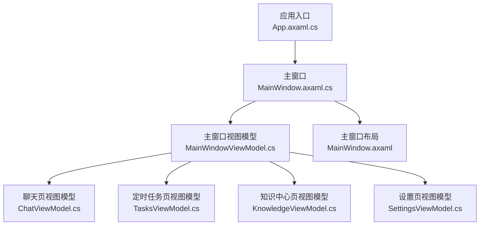
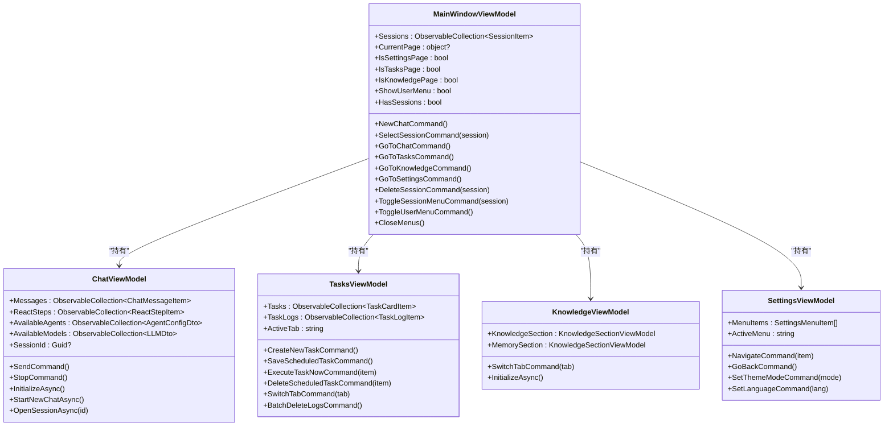
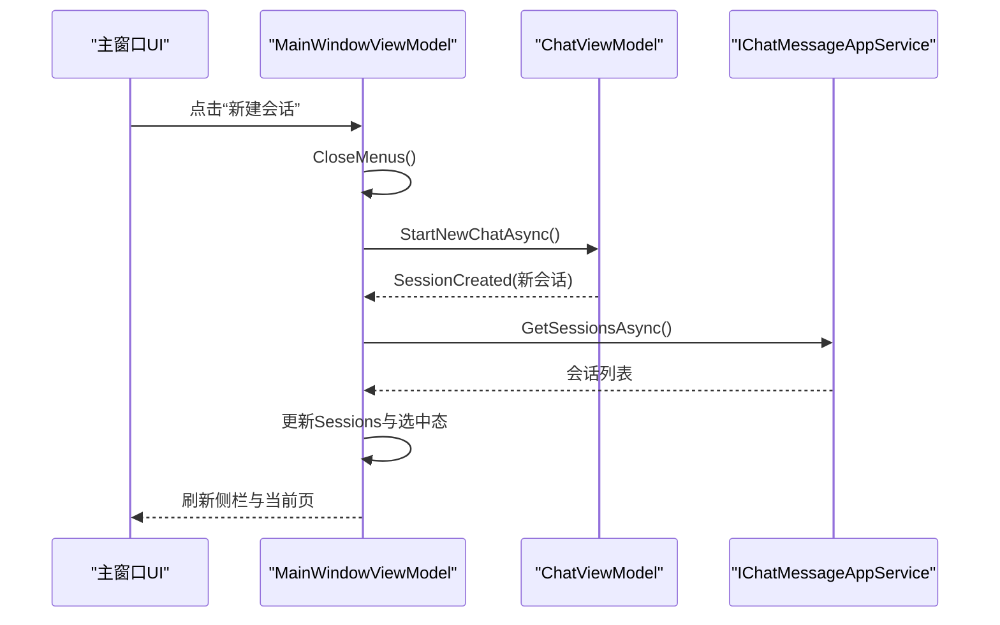
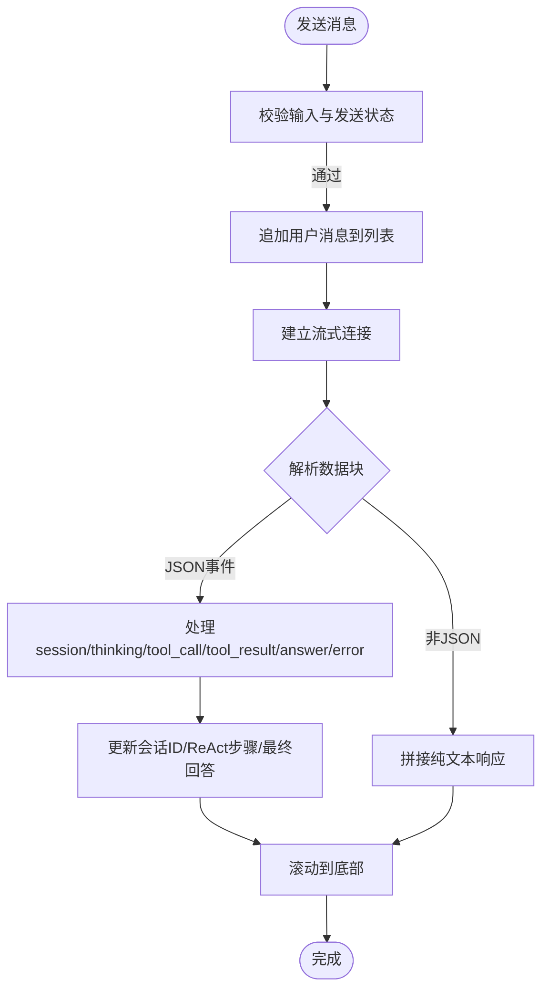
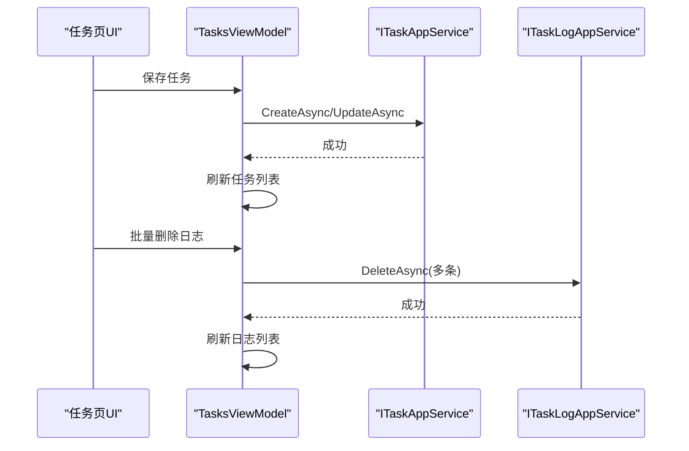
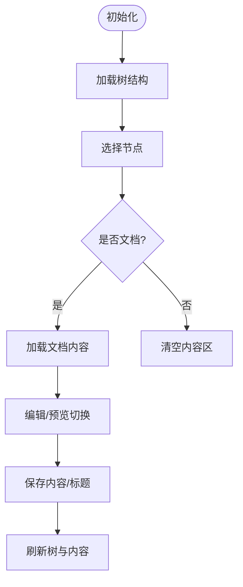
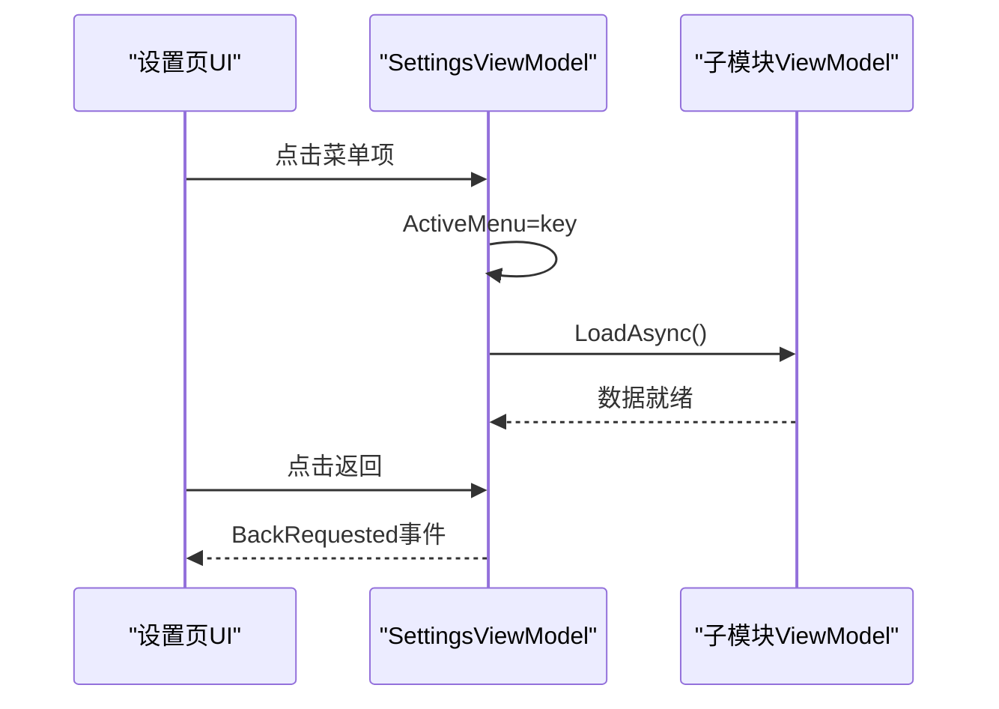
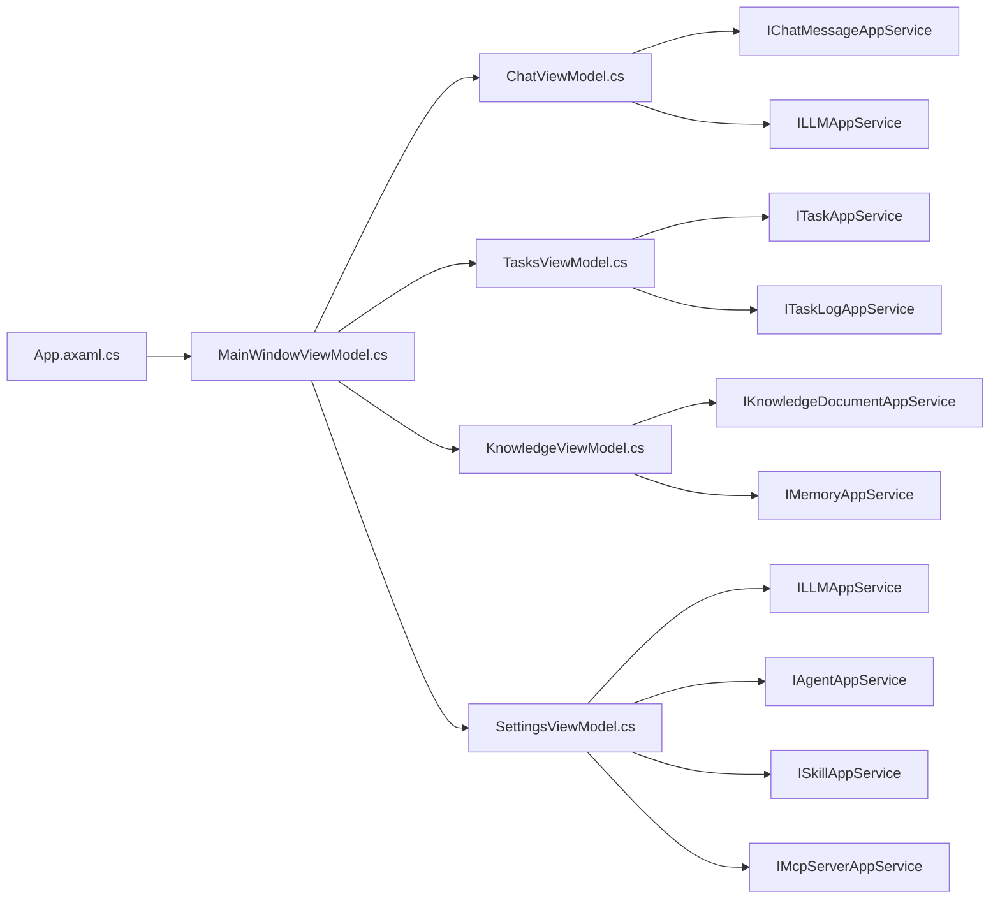

# 主窗口视图模型

<cite>
**本文引用的文件**   
- [MainWindowViewModel.cs](file://src/Agent/Assistant/H.Assistant.Desktop/ViewModels/MainWindowViewModel.cs)
- [MainWindow.axaml.cs](file://src/Agent/Assistant/H.Assistant.Desktop/Views/MainWindow.axaml.cs)
- [MainWindow.axaml](file://src/Agent/Assistant/H.Assistant.Desktop/Views/MainWindow.axaml)
- [App.axaml.cs](file://src/Agent/Assistant/H.Assistant.Desktop/App.axaml.cs)
- [ChatViewModel.cs](file://src/Agent/Assistant/H.Assistant.Desktop/ViewModels/ChatViewModel.cs)
- [TasksViewModel.cs](file://src/Agent/Assistant/H.Assistant.Desktop/ViewModels/TasksViewModel.cs)
- [KnowledgeViewModel.cs](file://src/Agent/Assistant/H.Assistant.Desktop/ViewModels/KnowledgeViewModel.cs)
- [SettingsViewModel.cs](file://src/Agent/Assistant/H.Assistant.Desktop/ViewModels/SettingsViewModel.cs)
</cite>

## 目录
1. [简介](#简介)
2. [项目结构](#项目结构)
3. [核心组件](#核心组件)
4. [架构总览](#架构总览)
5. [详细组件分析](#详细组件分析)
6. [依赖关系分析](#依赖关系分析)
7. [性能考虑](#性能考虑)
8. [故障排查指南](#故障排查指南)
9. [结论](#结论)
10. [附录](#附录)

## 简介
本文件为“主窗口视图模型”（MainWindowViewModel）的详细开发文档，聚焦于桌面端 Avalonia 应用的主窗口控制逻辑。内容涵盖：
- 窗口状态管理：当前页面切换、设置页全屏显示、会话列表与选中态
- 菜单操作：侧栏导航、用户菜单、会话项右键菜单
- 页面导航：聊天页、定时任务页、知识中心页、设置页之间的跳转与初始化
- 应用程序生命周期：启动时服务注入、数据初始化、事件订阅与清理
- 窗口事件处理：无标题栏拖拽移动
- 快捷键支持：基于命令绑定（RelayCommand）的交互扩展点
- 系统托盘集成：当前未实现，提供扩展建议
- 窗口大小调整与位置记忆：当前未实现，提供扩展建议
- 多显示器支持：Avalonia 默认支持，结合窗口初始定位策略
- 行为定制与扩展方法：通过新增页面 ViewModel、命令与 UI 模板扩展

## 项目结构
主窗口由 Avalonia 的 Window 承载，DataContext 指向 MainWindowViewModel；视图层使用 XAML 布局，包含左侧会话侧栏与右侧 ContentControl 动态渲染当前页面。设置页以全屏 ContentControl 覆盖显示。

图示来源
- [App.axaml.cs:1-37](file://src/Agent/Assistant/H.Assistant.Desktop/App.axaml.cs#L1-L37)
- [MainWindow.axaml.cs:1-24](file://src/Agent/Assistant/H.Assistant.Desktop/Views/MainWindow.axaml.cs#L1-L24)
- [MainWindow.axaml:1-191](file://src/Agent/Assistant/H.Assistant.Desktop/Views/MainWindow.axaml#L1-L191)
- [MainWindowViewModel.cs:1-270](file://src/Agent/Assistant/H.Assistant.Desktop/ViewModels/MainWindowViewModel.cs#L1-L270)

章节来源
- [App.axaml.cs:1-37](file://src/Agent/Assistant/H.Assistant.Desktop/App.axaml.cs#L1-L37)
- [MainWindow.axaml.cs:1-24](file://src/Agent/Assistant/H.Assistant.Desktop/Views/MainWindow.axaml.cs#L1-L24)
- [MainWindow.axaml:1-191](file://src/Agent/Assistant/H.Assistant.Desktop/Views/MainWindow.axaml#L1-L191)

## 核心组件
- MainWindowViewModel：主窗口状态与导航中枢，维护 Sessions、CurrentPage、各子页 ViewModel 引用，以及 Toast 提示
- ChatViewModel：聊天会话、消息流式响应、ReAct 步骤展示、模型与智能体选择
- TasksViewModel：定时任务 CRUD、执行日志多选删除、Tab 切换
- KnowledgeViewModel：知识库与记忆双 Tab，树形节点与文档编辑
- SettingsViewModel：设置页左侧菜单与通用主题/语言选项

章节来源
- [MainWindowViewModel.cs:1-270](file://src/Agent/Assistant/H.Assistant.Desktop/ViewModels/MainWindowViewModel.cs#L1-L270)
- [ChatViewModel.cs:1-632](file://src/Agent/Assistant/H.Assistant.Desktop/ViewModels/ChatViewModel.cs#L1-L632)
- [TasksViewModel.cs:1-647](file://src/Agent/Assistant/H.Assistant.Desktop/ViewModels/TasksViewModel.cs#L1-L647)
- [KnowledgeViewModel.cs:1-537](file://src/Agent/Assistant/H.Assistant.Desktop/ViewModels/KnowledgeViewModel.cs#L1-L537)
- [SettingsViewModel.cs:1-121](file://src/Agent/Assistant/H.Assistant.Desktop/ViewModels/SettingsViewModel.cs#L1-L121)

## 架构总览
主窗口采用 MVVM 模式，Avalonia 负责 UI 渲染，CommunityToolkit.Mvvm 提供 ObservableObject 与 RelayCommand 能力。应用启动时通过 DI 容器解析 MainWindowViewModel，并赋值给 MainWindow 的 DataContext。

图示来源
- [MainWindowViewModel.cs:1-270](file://src/Agent/Assistant/H.Assistant.Desktop/ViewModels/MainWindowViewModel.cs#L1-L270)
- [ChatViewModel.cs:1-632](file://src/Agent/Assistant/H.Assistant.Desktop/ViewModels/ChatViewModel.cs#L1-L632)
- [TasksViewModel.cs:1-647](file://src/Agent/Assistant/H.Assistant.Desktop/ViewModels/TasksViewModel.cs#L1-L647)
- [KnowledgeViewModel.cs:1-537](file://src/Agent/Assistant/H.Assistant.Desktop/ViewModels/KnowledgeViewModel.cs#L1-L537)
- [SettingsViewModel.cs:1-121](file://src/Agent/Assistant/H.Assistant.Desktop/ViewModels/SettingsViewModel.cs#L1-L121)

## 详细组件分析

### 主窗口视图模型（MainWindowViewModel）
- 职责
  - 维护会话集合与选中态，驱动侧栏渲染
  - 管理当前页面（聊天、任务、知识、设置）切换
  - 协调子页初始化与事件回调（如会话创建后刷新侧栏）
  - 统一关闭菜单（用户菜单与会话项菜单）
- 关键属性与方法
  - CurrentPage：用于 ContentControl 绑定，决定右侧渲染页面
  - IsSettingsPage/IsTasksPage/IsKnowledgePage：控制不同区域可见性
  - NewChatAsync/SelectSessionAsync/GoToChatAsync/GoToTasksAsync/GoToKnowledgeAsync/GoToSettings：导航命令
  - DeleteSessionAsync：删除会话并刷新列表
  - ToggleSessionMenu/ToggleUserMenu/CloseMenus：菜单状态管理
- 生命周期
  - 构造函数中订阅 Chat.SessionCreated、Chat.SessionsChanged、Settings.BackRequested
  - InitializeAsync 调用 Chat.InitializeAsync 与 LoadSessionsAsync

图示来源
- [MainWindowViewModel.cs:109-121](file://src/Agent/Assistant/H.Assistant.Desktop/ViewModels/MainWindowViewModel.cs#L109-L121)
- [MainWindowViewModel.cs:76-97](file://src/Agent/Assistant/H.Assistant.Desktop/ViewModels/MainWindowViewModel.cs#L76-L97)
- [ChatViewModel.cs:166-177](file://src/Agent/Assistant/H.Assistant.Desktop/ViewModels/ChatViewModel.cs#L166-L177)

章节来源
- [MainWindowViewModel.cs:1-270](file://src/Agent/Assistant/H.Assistant.Desktop/ViewModels/MainWindowViewModel.cs#L1-L270)

### 聊天页视图模型（ChatViewModel）
- 职责
  - 加载可用智能体与模型配置
  - 发送消息、流式接收响应、处理 ReAct 步骤
  - 会话打开与历史消息加载
- 关键流程
  - SendAsync：构造输入、追加用户消息、建立流式连接、处理 JSON 事件与纯文本
  - HandleStreamChunk：解析 session、thinking、tool_call、tool_result、answer、error 等事件
  - OpenSessionAsync：切换会话并加载历史消息，尝试解析最后一条助手消息中的 ReAct 数据

图示来源
- [ChatViewModel.cs:306-366](file://src/Agent/Assistant/H.Assistant.Desktop/ViewModels/ChatViewModel.cs#L306-L366)
- [ChatViewModel.cs:368-475](file://src/Agent/Assistant/H.Assistant.Desktop/ViewModels/ChatViewModel.cs#L368-L475)

章节来源
- [ChatViewModel.cs:1-632](file://src/Agent/Assistant/H.Assistant.Desktop/ViewModels/ChatViewModel.cs#L1-L632)

### 定时任务页视图模型（TasksViewModel）
- 职责
  - 任务 CRUD、立即执行、启用/禁用、删除
  - 执行日志多选批量删除
  - Tab 切换（任务/日志）
- 关键流程
  - SwitchTabAsync：根据 Tab 加载对应数据
  - SaveScheduledTaskAsync：创建或更新任务，成功后刷新列表
  - BatchDeleteLogsAsync：遍历选中日志进行删除并刷新

图示来源
- [TasksViewModel.cs:255-283](file://src/Agent/Assistant/H.Assistant.Desktop/ViewModels/TasksViewModel.cs#L255-L283)
- [TasksViewModel.cs:395-405](file://src/Agent/Assistant/H.Assistant.Desktop/ViewModels/TasksViewModel.cs#L395-L405)

章节来源
- [TasksViewModel.cs:1-647](file://src/Agent/Assistant/H.Assistant.Desktop/ViewModels/TasksViewModel.cs#L1-L647)

### 知识中心页视图模型（KnowledgeViewModel）
- 职责
  - 知识库与记忆双 Tab，复用同一套树形节点与文档操作
  - 节点增删改、文档编辑与保存
- 关键流程
  - InitializeAsync：首次加载知识库与记忆树
  - SelectNodeAsync：选择节点并加载文档内容
  - SaveContentAsync：保存文档内容与可能的标题变更

图示来源
- [KnowledgeViewModel.cs:66-75](file://src/Agent/Assistant/H.Assistant.Desktop/ViewModels/KnowledgeViewModel.cs#L66-L75)
- [KnowledgeViewModel.cs:217-246](file://src/Agent/Assistant/H.Assistant.Desktop/ViewModels/KnowledgeViewModel.cs#L217-L246)
- [KnowledgeViewModel.cs:403-441](file://src/Agent/Assistant/H.Assistant.Desktop/ViewModels/KnowledgeViewModel.cs#L403-L441)

章节来源
- [KnowledgeViewModel.cs:1-537](file://src/Agent/Assistant/H.Assistant.Desktop/ViewModels/KnowledgeViewModel.cs#L1-L537)

### 设置页视图模型（SettingsViewModel）
- 职责
  - 左侧菜单导航（通用、智能体、技能、模型、MCP）
  - 通用设置（主题、语言）本地状态管理
  - 返回聊天页事件 BackRequested
- 关键流程
  - SelectMenu：切换菜单并异步加载对应模块数据
  - GoBack：触发返回聊天页

图示来源
- [SettingsViewModel.cs:70-93](file://src/Agent/Assistant/H.Assistant.Desktop/ViewModels/SettingsViewModel.cs#L70-L93)
- [SettingsViewModel.cs:101-105](file://src/Agent/Assistant/H.Assistant.Desktop/ViewModels/SettingsViewModel.cs#L101-L105)

章节来源
- [SettingsViewModel.cs:1-121](file://src/Agent/Assistant/H.Assistant.Desktop/ViewModels/SettingsViewModel.cs#L1-L121)

### 窗口事件与拖拽（MainWindow.axaml.cs）
- 无标题栏模式下，顶部区域作为拖拽区，PointerPressed 事件中调用 BeginMoveDrag 实现窗口拖动

章节来源
- [MainWindow.axaml.cs:16-22](file://src/Agent/Assistant/H.Assistant.Desktop/Views/MainWindow.axaml.cs#L16-L22)

## 依赖关系分析
- 应用启动阶段
  - App.OnFrameworkInitializationCompleted 构建服务容器，实例化 MainWindow 并注入 MainWindowViewModel
- 视图模型依赖
  - MainWindowViewModel 依赖 IChatMessageAppService、ToastService 与各子页 ViewModel
  - ChatViewModel 依赖 IChatMessageAppService、ILLMAppService、ChatStreamClient、ToastService
  - TasksViewModel 依赖 ITaskAppService、ITaskLogAppService、IChatMessageAppService、ToastService
  - KnowledgeViewModel 依赖 IKnowledgeDocumentAppService、IMemoryAppService、ToastService
  - SettingsViewModel 依赖 ILLMAppService、IAgentAppService、ISkillAppService、IMcpServerAppService、ToastService

图示来源
- [App.axaml.cs:22-35](file://src/Agent/Assistant/H.Assistant.Desktop/App.axaml.cs#L22-L35)
- [MainWindowViewModel.cs:48-64](file://src/Agent/Assistant/H.Assistant.Desktop/ViewModels/MainWindowViewModel.cs#L48-L64)
- [ChatViewModel.cs:100-107](file://src/Agent/Assistant/H.Assistant.Desktop/ViewModels/ChatViewModel.cs#L100-L107)
- [TasksViewModel.cs:103-110](file://src/Agent/Assistant/H.Assistant.Desktop/ViewModels/TasksViewModel.cs#L103-L110)
- [KnowledgeViewModel.cs:27-64](file://src/Agent/Assistant/H.Assistant.Desktop/ViewModels/KnowledgeViewModel.cs#L27-L64)
- [SettingsViewModel.cs:61-68](file://src/Agent/Assistant/H.Assistant.Desktop/ViewModels/SettingsViewModel.cs#L61-L68)

章节来源
- [App.axaml.cs:1-37](file://src/Agent/Assistant/H.Assistant.Desktop/App.axaml.cs#L1-L37)
- [MainWindowViewModel.cs:1-270](file://src/Agent/Assistant/H.Assistant.Desktop/ViewModels/MainWindowViewModel.cs#L1-L270)

## 性能考虑
- 会话列表加载：分页参数 MaxResultCount=50，避免一次性加载过多数据
- 流式响应：使用 CancellationTokenSource 取消长时间请求，减少内存占用
- ReAct 历史解析：仅在最后一条助手消息存在时解析 JSON，降低不必要的开销
- 视图模型初始化：按需加载（如 KnowledgeSectionViewModel 的 _initialized 标志），避免重复请求
- UI 更新：通过 ObservableCollection 与 ObservableProperty 增量更新，减少全量重绘

[本节为通用指导，不直接分析具体文件]

## 故障排查指南
- 会话加载失败
  - 现象：Toast 提示“加载会话失败”
  - 可能原因：网络异常或服务不可用
  - 处理：检查 IChatMessageAppService.GetSessionsAsync 返回值与异常信息
- 发送消息失败
  - 现象：Toast 提示“Send failed”
  - 可能原因：流式客户端异常、服务端错误
  - 处理：查看 ChatViewModel.SendAsync 的 catch 分支与异常堆栈
- 任务保存失败
  - 现象：Toast 提示“保存失败”
  - 可能原因：表单校验失败或后端约束冲突
  - 处理：检查 TasksViewModel.SaveScheduledTaskAsync 的参数与 DTO 映射
- 知识保存失败
  - 现象：Toast 提示“保存失败”
  - 可能原因：文档内容或标题为空、权限不足
  - 处理：检查 KnowledgeSectionViewModel.SaveContentAsync 的校验逻辑

章节来源
- [MainWindowViewModel.cs:76-97](file://src/Agent/Assistant/H.Assistant.Desktop/ViewModels/MainWindowViewModel.cs#L76-L97)
- [ChatViewModel.cs:355-366](file://src/Agent/Assistant/H.Assistant.Desktop/ViewModels/ChatViewModel.cs#L355-L366)
- [TasksViewModel.cs:279-283](file://src/Agent/Assistant/H.Assistant.Desktop/ViewModels/TasksViewModel.cs#L279-L283)
- [KnowledgeViewModel.cs:432-435](file://src/Agent/Assistant/H.Assistant.Desktop/ViewModels/KnowledgeViewModel.cs#L432-L435)

## 结论
MainWindowViewModel 作为主窗口控制中枢，通过清晰的 MVVM 结构与命令绑定实现了会话管理、页面导航与子页协调。结合 Avalonia 的 UI 能力与 CommunityToolkit.Mvvm 的响应式特性，提供了良好的可扩展性与可维护性。未来可在窗口持久化、快捷键与系统托盘方面进一步扩展。

[本节为总结，不直接分析具体文件]

## 附录

### 窗口行为定制与扩展方法
- 新增页面
  - 在 MainWindowViewModel 中添加新的 PageViewModel 属性与导航命令
  - 在 MainWindow.axaml 中增加对应的 ContentControl 或区域可见性绑定
- 快捷键支持
  - 使用 Avalonia.Input.KeyBinding 绑定到 MainWindowViewModel 的 RelayCommand
  - 示例：Ctrl+N 新建会话、Ctrl+S 保存文档等
- 系统托盘集成
  - 引入 Avalonia.Tray 或第三方库，在 App.axaml.cs 中注册托盘图标与菜单
  - 将最小化、退出等操作与 MainWindowViewModel 的命令关联
- 窗口大小调整与位置记忆
  - 在 MainWindow.axaml 中设置 Width/Height/MinWidth/MinHeight
  - 在应用关闭时保存窗口位置与尺寸到配置文件，启动时恢复
- 多显示器支持
  - 使用 WindowStartupLocation="CenterScreen" 或自定义屏幕检测
  - 结合 OffScreenMargin 修正无标题栏最大化时的裁剪问题

[本节为概念性指导，不直接分析具体文件]