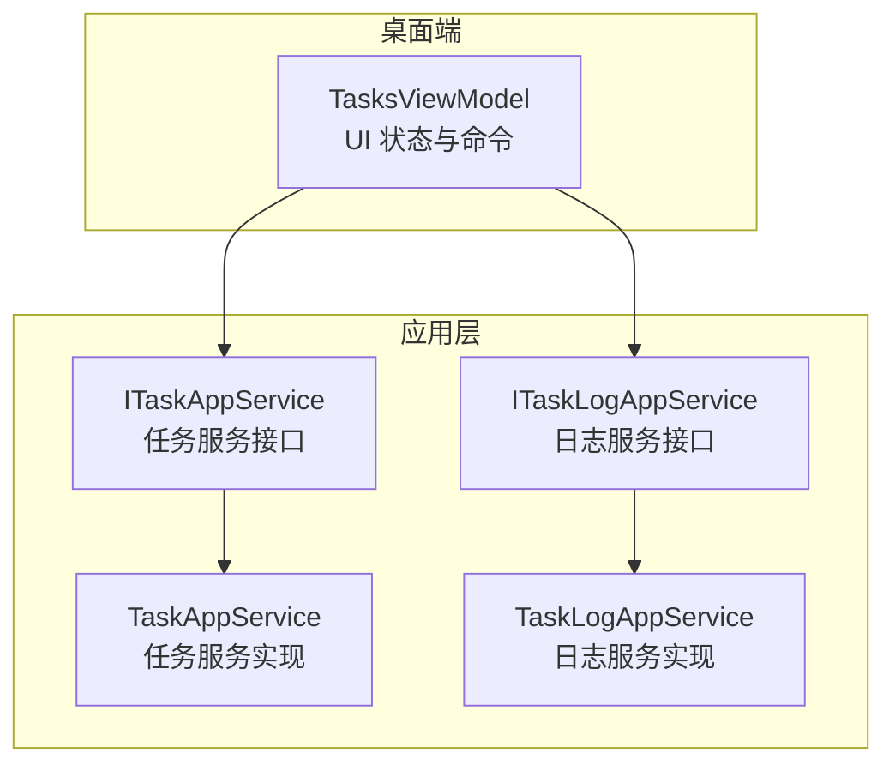
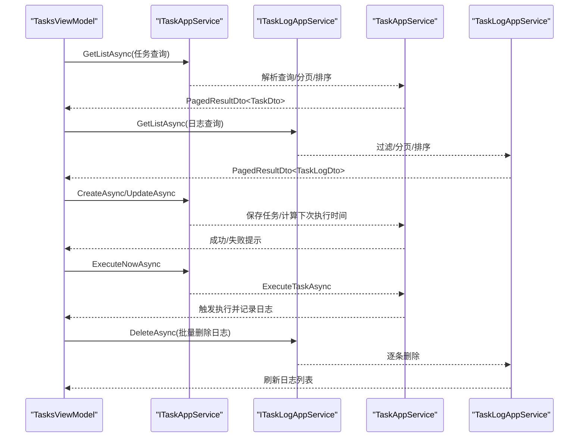
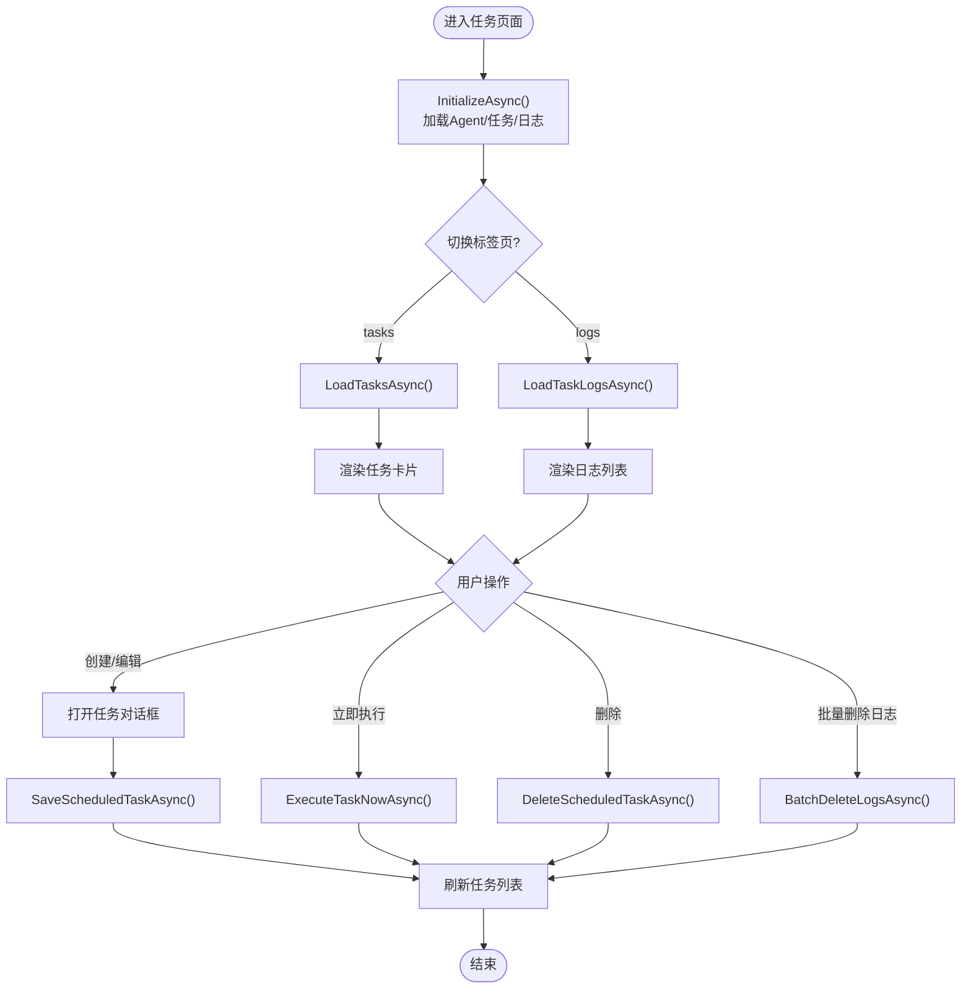
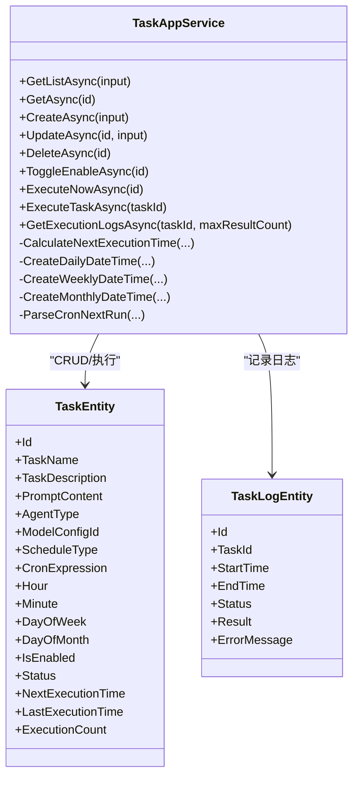
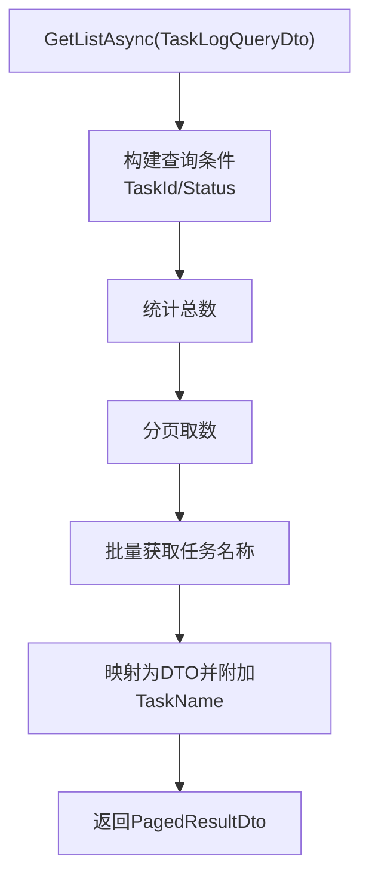
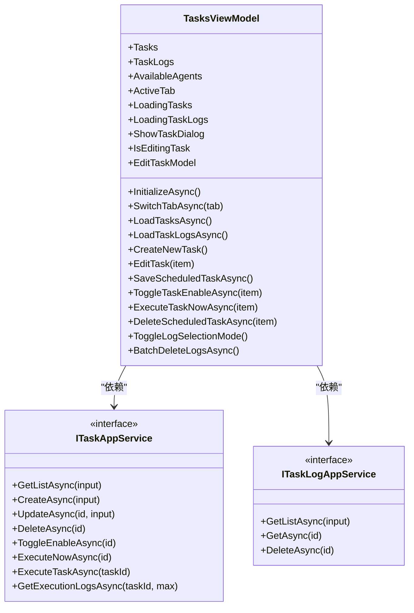
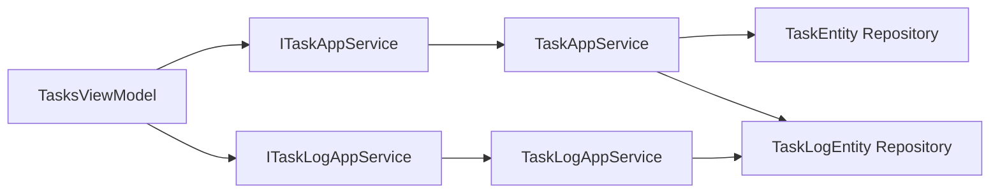

# 任务管理视图模型

<cite>
**本文引用的文件**   
- [TasksViewModel.cs](file://src/Agent/Assistant/H.Assistant.Desktop/ViewModels/TasksViewModel.cs)
- [TaskAppService.cs](file://src/Agent/Assistant/H.Assistant.Application/Services/TaskAppService.cs)
- [TaskLogAppService.cs](file://src/Agent/Assistant/H.Assistant.Application/Services/TaskLogAppService.cs)
- [ITaskAppService.cs](file://src/Agent/Assistant/H.Assistant.Application.Contracts/Services/Tasks/ITaskAppService.cs)
- [ITaskLogAppService.cs](file://src/Agent/Assistant/H.Assistant.Application.Contracts/Services/Tasks/ITaskLogAppService.cs)
</cite>

## 目录
1. [简介](#简介)
2. [项目结构](#项目结构)
3. [核心组件](#核心组件)
4. [架构总览](#架构总览)
5. [详细组件分析](#详细组件分析)
6. [依赖关系分析](#依赖关系分析)
7. [性能考虑](#性能考虑)
8. [故障排查指南](#故障排查指南)
9. [结论](#结论)
10. [附录](#附录)

## 简介
本文件为“任务管理视图模型”（TasksViewModel）的详细开发文档，聚焦后台任务的监控与管理能力，包括任务创建、执行状态跟踪、日志查看与错误处理。同时解释任务调度机制、并发控制、资源管理与性能监控，并给出任务队列管理、优先级设置和执行计划配置的实现建议。文末提供调试、故障排查与性能优化的实用指南，帮助开发者快速定位问题并优化系统表现。

## 项目结构
围绕 TasksViewModel 的相关代码分布在桌面端 ViewModel、应用层服务与接口契约中：
- 桌面端视图模型：负责 UI 交互、数据绑定、命令与状态管理
- 应用层服务：封装任务与日志的 CRUD、执行与调度计算逻辑
- 接口契约：定义前后端交互的服务方法签名

**图表来源** 
- [TasksViewModel.cs](file://src/Agent/Assistant/H.Assistant.Desktop/ViewModels/TasksViewModel.cs)
- [ITaskAppService.cs](file://src/Agent/Assistant/H.Assistant.Application.Contracts/Services/Tasks/ITaskAppService.cs)
- [ITaskLogAppService.cs](file://src/Agent/Assistant/H.Assistant.Application.Contracts/Services/Tasks/ITaskLogAppService.cs)
- [TaskAppService.cs](file://src/Agent/Assistant/H.Assistant.Application/Services/TaskAppService.cs)
- [TaskLogAppService.cs](file://src/Agent/Assistant/H.Assistant.Application/Services/TaskLogAppService.cs)

**章节来源**
- [TasksViewModel.cs](file://src/Agent/Assistant/H.Assistant.Desktop/ViewModels/TasksViewModel.cs)
- [TaskAppService.cs](file://src/Agent/Assistant/H.Assistant.Application/Services/TaskAppService.cs)
- [TaskLogAppService.cs](file://src/Agent/Assistant/H.Assistant.Application/Services/TaskLogAppService.cs)
- [ITaskAppService.cs](file://src/Agent/Assistant/H.Assistant.Application.Contracts/Services/Tasks/ITaskAppService.cs)
- [ITaskLogAppService.cs](file://src/Agent/Assistant/H.Assistant.Application.Contracts/Services/Tasks/ITaskLogAppService.cs)

## 核心组件
- TasksViewModel：桌面端任务管理的主视图模型，负责加载任务与日志、切换标签页、打开/编辑任务对话框、批量删除日志等。
- TaskAppService：任务生命周期管理，包含分页查询、创建/更新/删除、启用/禁用、立即执行、执行日志获取、下次执行时间计算等。
- TaskLogAppService：执行日志的分页查询、按任务过滤、按状态过滤、单条日志获取与删除。
- 接口契约：ITaskAppService 与 ITaskLogAppService 定义了前端可调用方法，保证前后端解耦。

关键职责划分：
- 视图模型：仅负责 UI 状态、命令与用户交互；不直接访问数据库
- 应用服务：业务编排、数据持久化、调度计算、异常记录
- 契约：明确 API 边界与返回类型

**章节来源**
- [TasksViewModel.cs](file://src/Agent/Assistant/H.Assistant.Desktop/ViewModels/TasksViewModel.cs)
- [TaskAppService.cs](file://src/Agent/Assistant/H.Assistant.Application/Services/TaskAppService.cs)
- [TaskLogAppService.cs](file://src/Agent/Assistant/H.Assistant.Application/Services/TaskLogAppService.cs)
- [ITaskAppService.cs](file://src/Agent/Assistant/H.Assistant.Application.Contracts/Services/Tasks/ITaskAppService.cs)
- [ITaskLogAppService.cs](file://src/Agent/Assistant/H.Assistant.Application.Contracts/Services/Tasks/ITaskLogAppService.cs)

## 架构总览
下图展示了从 UI 到服务的调用链路与数据流向，涵盖任务列表加载、日志加载、任务创建/更新、立即执行与日志删除等典型流程。

**图表来源** 
- [TasksViewModel.cs](file://src/Agent/Assistant/H.Assistant.Desktop/ViewModels/TasksViewModel.cs)
- [TaskAppService.cs](file://src/Agent/Assistant/H.Assistant.Application/Services/TaskAppService.cs)
- [TaskLogAppService.cs](file://src/Agent/Assistant/H.Assistant.Application/Services/TaskLogAppService.cs)
- [ITaskAppService.cs](file://src/Agent/Assistant/H.Assistant.Application.Contracts/Services/Tasks/ITaskAppService.cs)
- [ITaskLogAppService.cs](file://src/Agent/Assistant/H.Assistant.Application.Contracts/Services/Tasks/ITaskLogAppService.cs)

## 详细组件分析

### TasksViewModel 分析
- 功能要点
  - 初始化：加载可用 Agent、任务列表、日志列表
  - 标签页切换：根据 activeTab 决定加载任务或日志
  - 任务卡片：支持编辑、立即执行、删除、启用/禁用
  - 日志多选：全选/取消全选、批量删除确认与执行
  - 表单模型：任务创建/编辑的数据绑定与校验（名称、提示词、调度类型等）
- 数据结构
  - Tasks：ObservableCollection<TaskCardItem>
  - TaskLogs：ObservableCollection<TaskLogItem>
  - AvailableAgents：用于选择 Agent 类型
  - EditTaskModel：封装任务字段与调度参数，转换为 DTO
- 交互流程
  - 切换标签页时按需加载数据
  - 打开任务对话框时根据编辑/新建模式填充默认值
  - 保存后刷新任务列表并提示结果
  - 日志多选模式下统计选中数量并支持批量删除

**图表来源** 
- [TasksViewModel.cs](file://src/Agent/Assistant/H.Assistant.Desktop/ViewModels/TasksViewModel.cs)

**章节来源**
- [TasksViewModel.cs](file://src/Agent/Assistant/H.Assistant.Desktop/ViewModels/TasksViewModel.cs)

### TaskAppService 分析
- 功能要点
  - 分页查询：支持关键词过滤、状态过滤、是否启用过滤
  - 创建/更新：维护任务基本信息、调度参数、下次执行时间计算
  - 删除：级联删除关联的执行日志
  - 启用/禁用：切换 IsEnabled，必要时重置状态与下次执行时间
  - 立即执行：调用内部执行逻辑，记录成功/失败日志，更新执行统计
  - 执行日志：按任务 ID 获取最近执行记录，附带任务名称
- 调度计算
  - 支持 Once/Daily/Weekly/Monthly/Cron 五种调度类型
  - Daily/Weekly/Monthly 通过时间计算得到下次执行时间
  - Cron 表达式解析由占位实现，实际应由 Worker 处理
- 执行流程
  - 创建 Agent 实例并执行 Prompt
  - 成功：写入成功日志，更新 LastExecutionTime、ExecutionCount、NextExecutionTime
  - 失败：写入失败日志并记录错误信息
  - Once 类型执行完成后自动禁用并标记完成

**图表来源** 
- [TaskAppService.cs](file://src/Agent/Assistant/H.Assistant.Application/Services/TaskAppService.cs)

**章节来源**
- [TaskAppService.cs](file://src/Agent/Assistant/H.Assistant.Application/Services/TaskAppService.cs)

### TaskLogAppService 分析
- 功能要点
  - 分页查询：支持按任务 ID 与状态过滤
  - 单条日志：按 ID 获取并附加任务名称
  - 删除：按 ID 删除日志记录
- 数据增强
  - 批量获取日志对应的任务名称，避免 N+1 查询
  - 使用映射器将实体转换为 DTO

**图表来源** 
- [TaskLogAppService.cs](file://src/Agent/Assistant/H.Assistant.Application/Services/TaskLogAppService.cs)

**章节来源**
- [TaskLogAppService.cs](file://src/Agent/Assistant/H.Assistant.Application/Services/TaskLogAppService.cs)

### 类关系图（视图模型与服务）

**图表来源** 
- [TasksViewModel.cs](file://src/Agent/Assistant/H.Assistant.Desktop/ViewModels/TasksViewModel.cs)
- [ITaskAppService.cs](file://src/Agent/Assistant/H.Assistant.Application.Contracts/Services/Tasks/ITaskAppService.cs)
- [ITaskLogAppService.cs](file://src/Agent/Assistant/H.Assistant.Application.Contracts/Services/Tasks/ITaskLogAppService.cs)

**章节来源**
- [TasksViewModel.cs](file://src/Agent/Assistant/H.Assistant.Desktop/ViewModels/TasksViewModel.cs)
- [ITaskAppService.cs](file://src/Agent/Assistant/H.Assistant.Application.Contracts/Services/Tasks/ITaskAppService.cs)
- [ITaskLogAppService.cs](file://src/Agent/Assistant/H.Assistant.Application.Contracts/Services/Tasks/ITaskLogAppService.cs)

## 依赖关系分析
- 耦合与内聚
  - TasksViewModel 仅依赖服务接口，保持高内聚低耦合
  - TaskAppService 与 TaskLogAppService 分别关注任务与日志领域，职责清晰
- 外部依赖
  - AutoMapper：实体与 DTO 映射
  - ABP 框架：IRepository、PagedResultDto、ApplicationService 等基础设施
  - 日志与异常：通过 Logger 记录执行与错误信息
- 潜在循环依赖
  - 当前未见循环引用，服务之间通过接口解耦

**图表来源** 
- [TasksViewModel.cs](file://src/Agent/Assistant/H.Assistant.Desktop/ViewModels/TasksViewModel.cs)
- [TaskAppService.cs](file://src/Agent/Assistant/H.Assistant.Application/Services/TaskAppService.cs)
- [TaskLogAppService.cs](file://src/Agent/Assistant/H.Assistant.Application/Services/TaskLogAppService.cs)

**章节来源**
- [TasksViewModel.cs](file://src/Agent/Assistant/H.Assistant.Desktop/ViewModels/TasksViewModel.cs)
- [TaskAppService.cs](file://src/Agent/Assistant/H.Assistant.Application/Services/TaskAppService.cs)
- [TaskLogAppService.cs](file://src/Agent/Assistant/H.Assistant.Application/Services/TaskLogAppService.cs)

## 性能考虑
- 分页与限制
  - 任务与日志查询均使用分页，限制 MaxResultCount，避免一次性加载大量数据
- 批量操作
  - 日志查询时批量获取任务名称，减少多次数据库往返
- 异步与并发
  - 所有 IO 操作均为异步，提升响应性
  - 立即执行采用同步调用服务方法，建议在后台 Worker 中异步执行以避免阻塞请求线程
- 缓存策略
  - 可用 Agent 列表可考虑短期缓存，降低频繁查询开销
- 索引建议
  - 任务表：按 CreationTime、Status、IsEnabled 建立索引以优化分页与过滤
  - 日志表：按 TaskId、StartTime 建立索引以优化按任务与时间排序查询

[本节为通用指导，无需特定文件来源]

## 故障排查指南
- 常见问题
  - 任务无法创建：检查必填字段（任务名称、提示词），确认 Agent 类型有效
  - 立即执行无日志：确认服务已正确记录成功/失败日志，检查数据库连接与权限
  - 日志为空：确认查询条件是否正确，检查是否有分页限制导致未显示
- 定位步骤
  - 查看服务日志输出（Logger）中的执行与错误信息
  - 检查任务状态与下次执行时间计算是否符合预期
  - 验证数据库记录是否存在，确认删除与更新操作生效
- 恢复措施
  - 重新启用任务并调整调度参数
  - 清理无效日志记录，确保数据一致性
  - 对 Agent 工厂进行健康检查，确保能创建所需类型的实例

**章节来源**
- [TaskAppService.cs](file://src/Agent/Assistant/H.Assistant.Application/Services/TaskAppService.cs)
- [TaskLogAppService.cs](file://src/Agent/Assistant/H.Assistant.Application/Services/TaskLogAppService.cs)

## 结论
TasksViewModel 作为桌面端任务管理的核心视图模型，提供了完整的任务与日志管理能力。配合 TaskAppService 与 TaskLogAppService，实现了任务的生命周期管理、调度计算与执行日志追踪。通过清晰的职责划分与接口契约，系统具备良好的扩展性与可维护性。未来可在后台 Worker 中完善 Cron 解析与并发调度，进一步提升系统的稳定性与性能。

[本节为总结，无需特定文件来源]

## 附录
- 任务调度机制建议
  - 使用后台工作进程（如 Windows Service/Worker）轮询待执行任务
  - 基于 NextExecutionTime 与当前时间比较，筛选即将执行的任务
  - 引入分布式锁避免重复执行
- 并发控制与资源管理
  - 为每个 Agent 类型配置线程池大小，限制并发度
  - 使用限流与退避策略，防止外部服务过载
- 性能监控
  - 采集任务执行时长、成功率、失败率等指标
  - 对慢查询与高频错误进行告警
- 任务队列与优先级
  - 引入优先级字段，优先执行高优先级任务
  - 支持任务重试与死信队列，提高可靠性

[本节为概念性内容，无需特定文件来源]