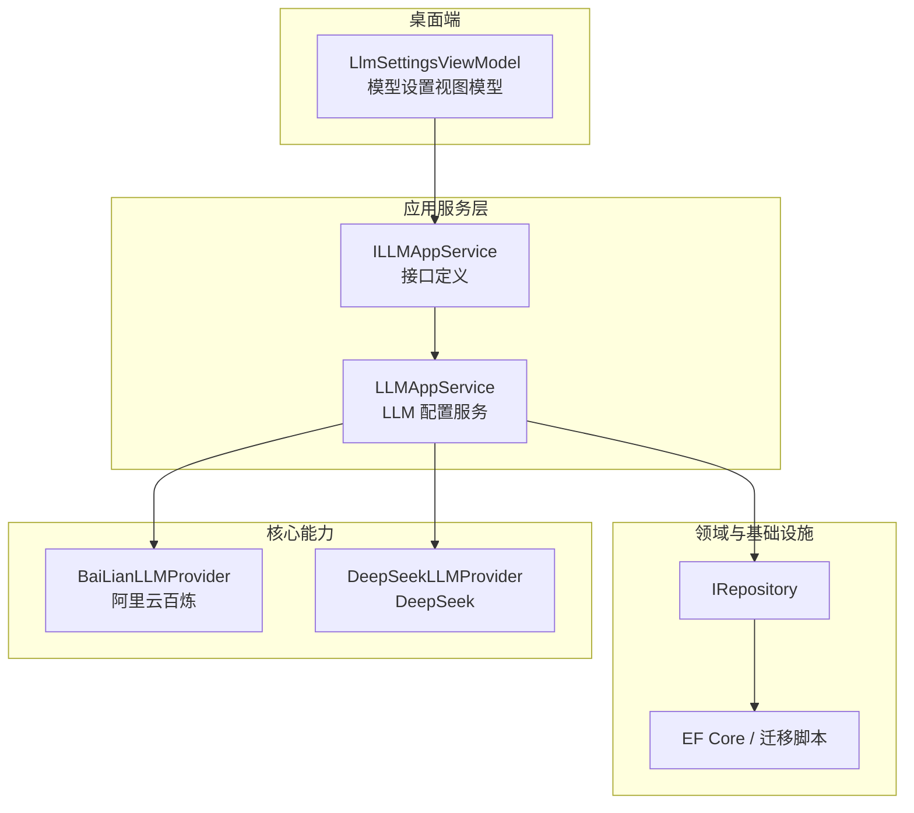
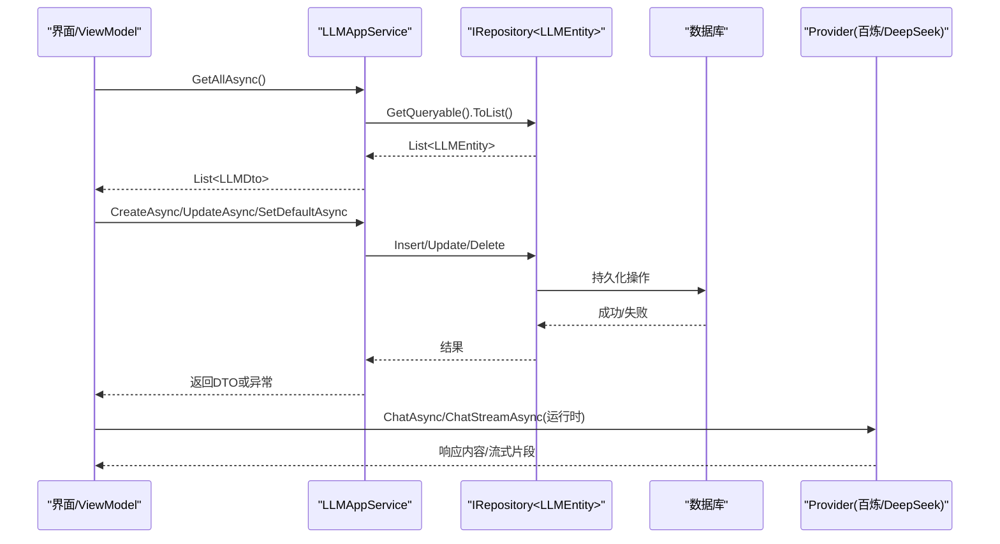
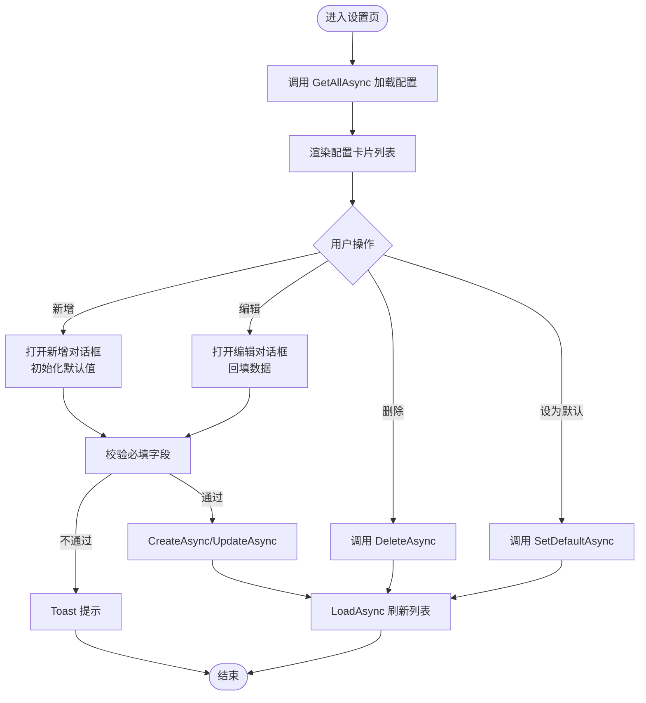
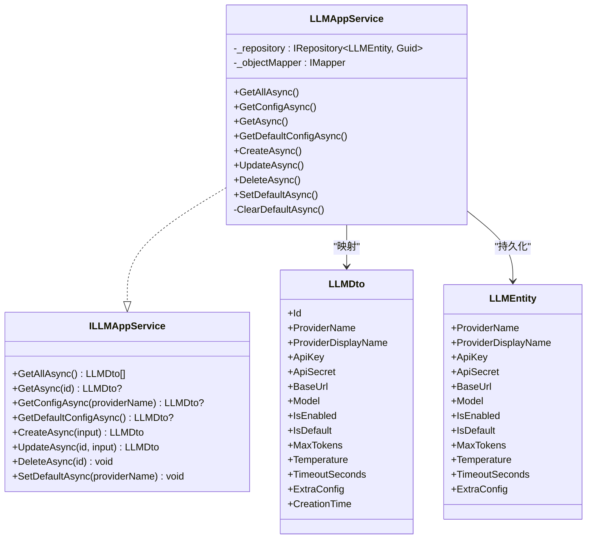
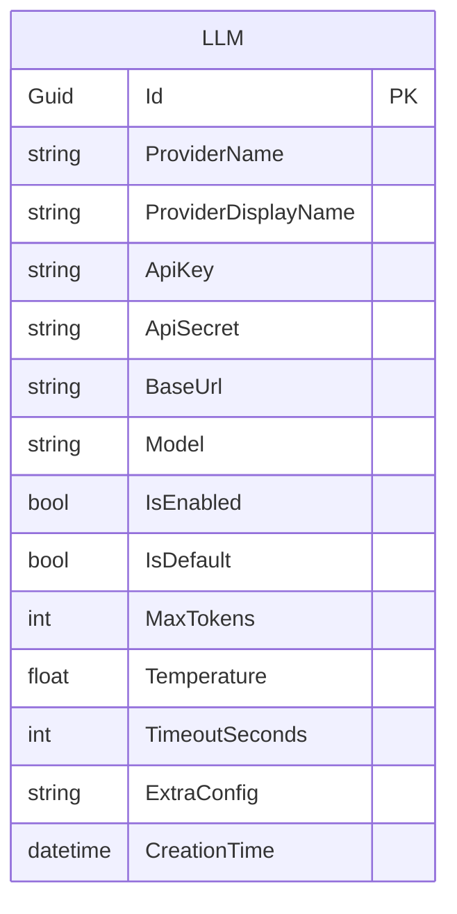
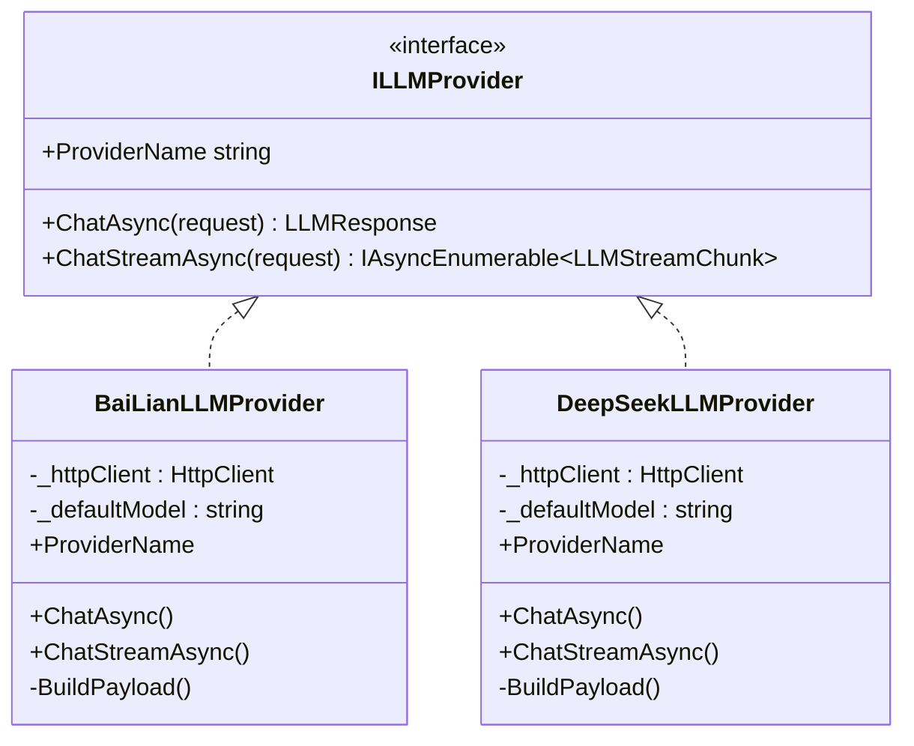
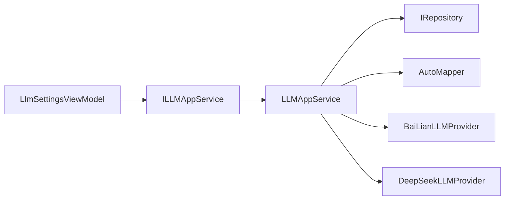

# 大模型设置视图模型

<cite>
**本文引用的文件**
- [LlmSettingsViewModel.cs](file://src/Agent/Assistant/H.Assistant.Desktop/ViewModels/LlmSettingsViewModel.cs)
- [ILLMAppService.cs](file://src/Agent/Assistant/H.Assistant.Application.Contracts/Services/Llms/ILLMAppService.cs)
- [LLMAppService.cs](file://src/Agent/Assistant/H.Assistant.Application/Services/LLMAppService.cs)
- [CreateLLMDto.cs](file://src/Agent/Assistant/H.Assistant.Application.Contracts/Dtos/Llms/CreateLLMDto.cs)
- [UpdateLLMDto.cs](file://src/Agent/Assistant/H.Assistant.Application.Contracts/Dtos/Llms/UpdateLLMDto.cs)
- [LLMDto.cs](file://src/Agent/Assistant/H.Assistant.Application.Contracts/Dtos/Llms/LLMDto.cs)
- [LLMEntity.cs](file://src/Agent/Assistant/H.Assistant.EntityFrameworkCore/Entities/LLMEntity.cs)
- [BaiLianLLMProvider.cs](file://src/Agent/Assistant/H.Assistant.Core/LLM/Providers/BaiLianLLMProvider.cs)
- [DeepSeekLLMProvider.cs](file://src/Agent/Assistant/H.Assistant.Core/LLM/Providers/DeepSeekLLMProvider.cs)
- [20260604021506_Init.cs](file://src/Tools/H.Assistant.DbMigrator/Migrations/20260604021506_Init.cs)
</cite>

## 目录
1. [简介](#简介)
2. [项目结构](#项目结构)
3. [核心组件](#核心组件)
4. [架构总览](#架构总览)
5. [详细组件分析](#详细组件分析)
6. [依赖关系分析](#依赖关系分析)
7. [性能与调优](#性能与调优)
8. [故障排查指南](#故障排查指南)
9. [结论](#结论)
10. [附录：最佳实践与常见问题](#附录最佳实践与常见问题)

## 简介
本文件为 LlmSettingsViewModel 的详细开发文档，围绕大语言模型配置的管理体系展开，涵盖模型提供商配置、API 密钥管理、连接测试、性能调优、配置验证、安全存储、多提供商支持与动态加载机制。同时提供模型切换、负载均衡与故障转移策略建议，并给出最佳实践与常见问题解决方案，帮助开发者快速理解与扩展该模块。

## 项目结构
LlmSettingsViewModel 位于桌面端 ViewModel 层，负责“模型设置”页面的交互与状态管理；其数据持久化通过 ILLMAppService 调用应用服务，最终由 Entity Framework Core 实体映射到数据库表。核心 Provider 实现位于 Core 层，支持阿里云百炼与 DeepSeek 等提供商。

图表来源
- [LlmSettingsViewModel.cs:1-310](file://src/Agent/Assistant/H.Assistant.Desktop/ViewModels/LlmSettingsViewModel.cs#L1-L310)
- [ILLMAppService.cs:1-51](file://src/Agent/Assistant/H.Assistant.Application.Contracts/Services/Llms/ILLMAppService.cs#L1-L51)
- [LLMAppService.cs:1-128](file://src/Agent/Assistant/H.Assistant.Application/Services/LLMAppService.cs#L1-L128)
- [LLMEntity.cs:1-70](file://src/Agent/Assistant/H.Assistant.EntityFrameworkCore/Entities/LLMEntity.cs#L1-L70)
- [BaiLianLLMProvider.cs:1-228](file://src/Agent/Assistant/H.Assistant.Core/LLM/Providers/BaiLianLLMProvider.cs#L1-L228)
- [DeepSeekLLMProvider.cs:1-228](file://src/Agent/Assistant/H.Assistant.Core/LLM/Providers/DeepSeekLLMProvider.cs#L1-L228)

章节来源
- [LlmSettingsViewModel.cs:1-310](file://src/Agent/Assistant/H.Assistant.Desktop/ViewModels/LlmSettingsViewModel.cs#L1-L310)
- [ILLMAppService.cs:1-51](file://src/Agent/Assistant/H.Assistant.Application.Contracts/Services/Llms/ILLMAppService.cs#L1-L51)
- [LLMAppService.cs:1-128](file://src/Agent/Assistant/H.Assistant.Application/Services/LLMAppService.cs#L1-L128)
- [LLMEntity.cs:1-70](file://src/Agent/Assistant/H.Assistant.EntityFrameworkCore/Entities/LLMEntity.cs#L1-L70)

## 核心组件
- LlmSettingsViewModel：负责 UI 状态、表单校验、保存/删除/设为默认等操作，以及提供商预设与模型建议。
- ILLMAppService / LLMAppService：定义并实现 LLM 配置的 CRUD、默认 Provider 设置、按名称获取配置等能力。
- DTO/Entity：CreateLLMDto、UpdateLLMDto、LLMDto、LLMEntity 描述配置项结构与持久化字段。
- Provider 实现：BaiLianLLMProvider、DeepSeekLLMProvider 提供统一的 ChatAsync/ChatStreamAsync 接口。

章节来源
- [LlmSettingsViewModel.cs:1-310](file://src/Agent/Assistant/H.Assistant.Desktop/ViewModels/LlmSettingsViewModel.cs#L1-L310)
- [ILLMAppService.cs:1-51](file://src/Agent/Assistant/H.Assistant.Application.Contracts/Services/Llms/ILLMAppService.cs#L1-L51)
- [LLMAppService.cs:1-128](file://src/Agent/Assistant/H.Assistant.Application/Services/LLMAppService.cs#L1-L128)
- [CreateLLMDto.cs:1-20](file://src/Agent/Assistant/H.Assistant.Application.Contracts/Dtos/Llms/CreateLLMDto.cs#L1-L20)
- [UpdateLLMDto.cs:1-19](file://src/Agent/Assistant/H.Assistant.Application.Contracts/Dtos/Llms/UpdateLLMDto.cs#L1-L19)
- [LLMDto.cs:1-23](file://src/Agent/Assistant/H.Assistant.Application.Contracts/Dtos/Llms/LLMDto.cs#L1-L23)
- [LLMEntity.cs:1-70](file://src/Agent/Assistant/H.Assistant.EntityFrameworkCore/Entities/LLMEntity.cs#L1-L70)

## 架构总览
下图展示从 UI 到数据持久化的完整调用链，以及 Provider 的抽象与实现关系。

图表来源
- [LlmSettingsViewModel.cs:113-134](file://src/Agent/Assistant/H.Assistant.Desktop/ViewModels/LlmSettingsViewModel.cs#L113-L134)
- [LLMAppService.cs:24-54](file://src/Agent/Assistant/H.Assistant.Application/Services/LLMAppService.cs#L24-L54)
- [LLMAppService.cs:56-127](file://src/Agent/Assistant/H.Assistant.Application/Services/LLMAppService.cs#L56-L127)
- [BaiLianLLMProvider.cs:29-136](file://src/Agent/Assistant/H.Assistant.Core/LLM/Providers/BaiLianLLMProvider.cs#L29-L136)
- [DeepSeekLLMProvider.cs:29-136](file://src/Agent/Assistant/H.Assistant.Core/LLM/Providers/DeepSeekLLMProvider.cs#L29-L136)

## 详细组件分析

### LlmSettingsViewModel（模型设置视图模型）
- 职责
  - 维护提供商预设（ProviderDefs），包含显示名、默认端点、API Key 获取链接、类型与模型建议。
  - 管理配置列表（Configs）、对话框状态（添加/编辑）、保存与删除、设为默认。
  - 前端校验：必填字段（提供商、模型名、API Key）与提示。
  - 打开 API Key 页面、选择建议模型、填充默认 BaseUrl。
- 关键流程
  - 加载：调用 GetAllAsync，转换为卡片项集合，处理异常与 Loading 状态。
  - 新增/编辑：构建 CreateLLMDto/UpdateLLMDto，调用服务层保存后刷新列表。
  - 删除/设默认：调用服务层方法并刷新列表。
- 数据绑定与计算属性
  - SelectedProvider/SelectedType 变化时自动更新 CurrentModels、CurrentApiKeyUrl。
  - HasConfigs、DialogTitle、DialogSaveText 根据状态派生。
- 安全与体验
  - 对 ApiKey 进行掩码显示，避免泄露。
  - 错误统一通过 ToastService 提示。

图表来源
- [LlmSettingsViewModel.cs:113-134](file://src/Agent/Assistant/H.Assistant.Desktop/ViewModels/LlmSettingsViewModel.cs#L113-L134)
- [LlmSettingsViewModel.cs:136-170](file://src/Agent/Assistant/H.Assistant.Desktop/ViewModels/LlmSettingsViewModel.cs#L136-L170)
- [LlmSettingsViewModel.cs:200-251](file://src/Agent/Assistant/H.Assistant.Desktop/ViewModels/LlmSettingsViewModel.cs#L200-L251)
- [LlmSettingsViewModel.cs:254-281](file://src/Agent/Assistant/H.Assistant.Desktop/ViewModels/LlmSettingsViewModel.cs#L254-L281)

章节来源
- [LlmSettingsViewModel.cs:1-310](file://src/Agent/Assistant/H.Assistant.Desktop/ViewModels/LlmSettingsViewModel.cs#L1-L310)

### ILLMAppService 与 LLMAppService（配置服务）
- 接口能力
  - 获取全部、按 ID、按 ProviderName、获取默认配置。
  - 创建、更新、删除、设置为默认。
- 实现要点
  - 使用 AutoMapper 在 Entity 与 DTO 之间转换。
  - SetDefaultAsync 会先清除其他默认，再设置目标为默认。
  - CreateAsync 若启用则视为默认，并清理其他默认。
  - UpdateAsync 仅覆盖非空字段（如 ApiKey、ApiSecret、BaseUrl）。
- 事务与一致性
  - 通过 ABP AsyncExecuter 执行查询，保证上下文一致性与取消令牌支持。

图表来源
- [ILLMAppService.cs:1-51](file://src/Agent/Assistant/H.Assistant.Application.Contracts/Services/Llms/ILLMAppService.cs#L1-L51)
- [LLMAppService.cs:1-128](file://src/Agent/Assistant/H.Assistant.Application/Services/LLMAppService.cs#L1-L128)
- [LLMDto.cs:1-23](file://src/Agent/Assistant/H.Assistant.Application.Contracts/Dtos/Llms/LLMDto.cs#L1-L23)
- [LLMEntity.cs:1-70](file://src/Agent/Assistant/H.Assistant.EntityFrameworkCore/Entities/LLMEntity.cs#L1-L70)

章节来源
- [ILLMAppService.cs:1-51](file://src/Agent/Assistant/H.Assistant.Application.Contracts/Services/Llms/ILLMAppService.cs#L1-L51)
- [LLMAppService.cs:1-128](file://src/Agent/Assistant/H.Assistant.Application/Services/LLMAppService.cs#L1-L128)

### 数据模型与持久化（DTO/Entity/迁移）
- DTO
  - CreateLLMDto：创建配置所需字段（含超时、额外配置等）。
  - UpdateLLMDto：更新配置所需字段（可选更新）。
  - LLMDto：返回给前端的完整配置信息（含 IsDefault、CreationTime）。
- Entity
  - LLMEntity：对应数据库表字段，包含审计基类（CreationAuditedEntity<Guid>）。
- 迁移脚本
  - 定义了 LLM 表的列定义与主键约束，确保字段长度与可空性。

图表来源
- [LLMDto.cs:1-23](file://src/Agent/Assistant/H.Assistant.Application.Contracts/Dtos/Llms/LLMDto.cs#L1-L23)
- [LLMEntity.cs:1-70](file://src/Agent/Assistant/H.Assistant.EntityFrameworkCore/Entities/LLMEntity.cs#L1-L70)
- [20260604021506_Init.cs:66-84](file://src/Tools/H.Assistant.DbMigrator/Migrations/20260604021506_Init.cs#L66-L84)

章节来源
- [CreateLLMDto.cs:1-20](file://src/Agent/Assistant/H.Assistant.Application.Contracts/Dtos/Llms/CreateLLMDto.cs#L1-L20)
- [UpdateLLMDto.cs:1-19](file://src/Agent/Assistant/H.Assistant.Application.Contracts/Dtos/Llms/UpdateLLMDto.cs#L1-L19)
- [LLMDto.cs:1-23](file://src/Agent/Assistant/H.Assistant.Application.Contracts/Dtos/Llms/LLMDto.cs#L1-L23)
- [LLMEntity.cs:1-70](file://src/Agent/Assistant/H.Assistant.EntityFrameworkCore/Entities/LLMEntity.cs#L1-L70)
- [20260604021506_Init.cs:66-84](file://src/Tools/H.Assistant.DbMigrator/Migrations/20260604021506_Init.cs#L66-L84)

### 提供商实现（BaiLianLLMProvider / DeepSeekLLMProvider）
- 共同特性
  - 均实现 ILLMProvider，暴露 ChatAsync 与 ChatStreamAsync。
  - 使用 HttpClient 发送请求，Authorization Bearer 注入 ApiKey。
  - 支持流式响应（SSE-like data: ... 行解析），支持 tool_calls 增量。
- 差异点
  - 端点路径不同：百炼使用 chat/completions，DeepSeek 使用 v1/chat/completions。
  - 响应体结构不同，各自定义了对应的 JSON 类型。
- 可扩展性
  - 新增提供商只需实现 ILLMProvider，并在上层工厂或路由中注册。

图表来源
- [BaiLianLLMProvider.cs:1-228](file://src/Agent/Assistant/H.Assistant.Core/LLM/Providers/BaiLianLLMProvider.cs#L1-L228)
- [DeepSeekLLMProvider.cs:1-228](file://src/Agent/Assistant/H.Assistant.Core/LLM/Providers/DeepSeekLLMProvider.cs#L1-L228)

章节来源
- [BaiLianLLMProvider.cs:1-228](file://src/Agent/Assistant/H.Assistant.Core/LLM/Providers/BaiLianLLMProvider.cs#L1-L228)
- [DeepSeekLLMProvider.cs:1-228](file://src/Agent/Assistant/H.Assistant.Core/LLM/Providers/DeepSeekLLMProvider.cs#L1-L228)

## 依赖关系分析
- 组件耦合
  - LlmSettingsViewModel 依赖 ILLMAppService（解耦具体实现）。
  - LLMAppService 依赖 IRepository<LLMEntity> 与 AutoMapper。
  - Provider 实现独立于 UI 与服务层，便于替换与扩展。
- 外部依赖
  - HTTP 客户端用于调用第三方 API。
  - EF Core 用于数据持久化。
- 潜在循环依赖
  - 当前分层清晰，未见循环引用风险。

图表来源
- [LlmSettingsViewModel.cs:1-310](file://src/Agent/Assistant/H.Assistant.Desktop/ViewModels/LlmSettingsViewModel.cs#L1-L310)
- [LLMAppService.cs:1-128](file://src/Agent/Assistant/H.Assistant.Application/Services/LLMAppService.cs#L1-L128)

章节来源
- [LlmSettingsViewModel.cs:1-310](file://src/Agent/Assistant/H.Assistant.Desktop/ViewModels/LlmSettingsViewModel.cs#L1-L310)
- [LLMAppService.cs:1-128](file://src/Agent/Assistant/H.Assistant.Application/Services/LLMAppService.cs#L1-L128)

## 性能与调优
- 网络与并发
  - 使用 HttpClient 单例或池化（建议在宿主层注册）以减少端口占用与握手开销。
  - 流式响应降低首字节延迟，提升用户体验。
- 参数调优
  - MaxTokens 与 Temperature 影响输出长度与创造性，需结合业务场景调整。
  - TimeoutSeconds 防止长时间阻塞，建议根据模型与网络状况设定。
- 缓存与重试
  - 对频繁读取的配置（如默认 Provider）可引入内存缓存。
  - 对网络请求增加指数退避重试，提高鲁棒性。
- 资源释放
  - 确保 HttpClient 与流式读取的资源正确释放，避免内存泄漏。

[本节为通用指导，无需特定文件引用]

## 故障排查指南
- 常见错误
  - 未选择提供商/未填写模型名/API Key：前端校验拦截并提示。
  - 保存失败：捕获异常并通过 ToastService 提示。
  - 删除/设为默认失败：检查 ProviderName 是否存在及权限。
- 调试建议
  - 查看服务端日志与 HTTP 响应体（Provider 已记录错误详情）。
  - 确认 BaseUrl 是否正确拼接（末尾带斜杠）。
  - 检查数据库记录是否被正确更新（IsDefault 唯一性）。

章节来源
- [LlmSettingsViewModel.cs:200-251](file://src/Agent/Assistant/H.Assistant.Desktop/ViewModels/LlmSettingsViewModel.cs#L200-L251)
- [LlmSettingsViewModel.cs:254-281](file://src/Agent/Assistant/H.Assistant.Desktop/ViewModels/LlmSettingsViewModel.cs#L254-L281)
- [BaiLianLLMProvider.cs:29-70](file://src/Agent/Assistant/H.Assistant.Core/LLM/Providers/BaiLianLLMProvider.cs#L29-L70)
- [DeepSeekLLMProvider.cs:29-70](file://src/Agent/Assistant/H.Assistant.Core/LLM/Providers/DeepSeekLLMProvider.cs#L29-L70)

## 结论
LlmSettingsViewModel 提供了完整的 LLM 配置管理能力，配合 ILLMAppService 与 Provider 抽象，实现了多提供商支持与灵活的运行时调用。通过清晰的层次划分、完善的校验与错误处理，以及可扩展的 Provider 设计，系统具备良好的可维护性与扩展性。建议在生产环境中加强安全存储、连接测试与监控告警，以提升稳定性与可观测性。

[本节为总结性内容，无需特定文件引用]

## 附录：最佳实践与常见问题

- 配置验证
  - 前端必填校验（提供商、模型名、API Key）；后端可对字段长度与格式进行二次校验。
  - 建议增加连接测试接口（调用 Provider 的轻量接口验证连通性与鉴权）。
- 安全存储
  - 敏感字段（ApiKey、ApiSecret）建议使用加密存储或密钥管理服务（如 Vault）。
  - 前端仅展示掩码，避免明文泄露。
- 多提供商支持与动态加载
  - 新增 Provider 仅需实现 ILLMProvider，并在上层注册。
  - 可在启动时扫描程序集动态加载 Provider，减少硬编码。
- 模型切换、负载均衡与故障转移
  - 模型切换：通过 SetDefaultAsync 指定默认 Provider，或在调用时按 ProviderName 选择。
  - 负载均衡：可按权重轮询多个 Provider，或基于 Token 用量/延迟动态调度。
  - 故障转移：当某 Provider 连续失败时，自动切换到备用 Provider，并记录告警。
- 常见问题解决方案
  - BaseUrl 拼接问题：确保以斜杠结尾，避免相对路径丢失。
  - 流式解析失败：检查 data: 行格式与 [DONE] 终止条件。
  - 超时与限流：合理设置 TimeoutSeconds，必要时增加重试与熔断。

[本节为通用指导，无需特定文件引用]