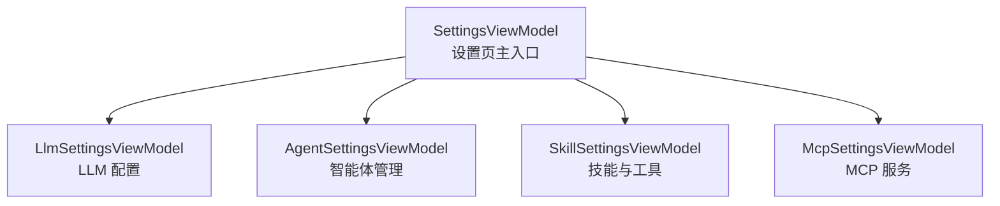
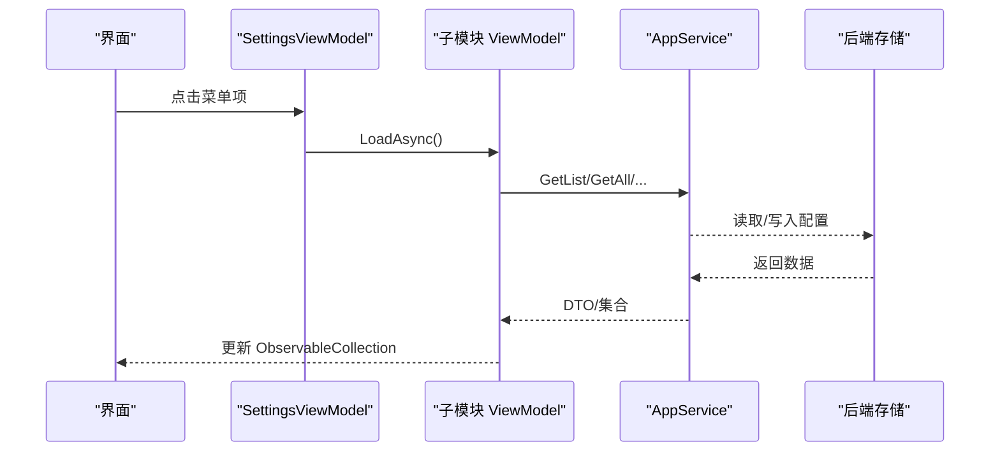
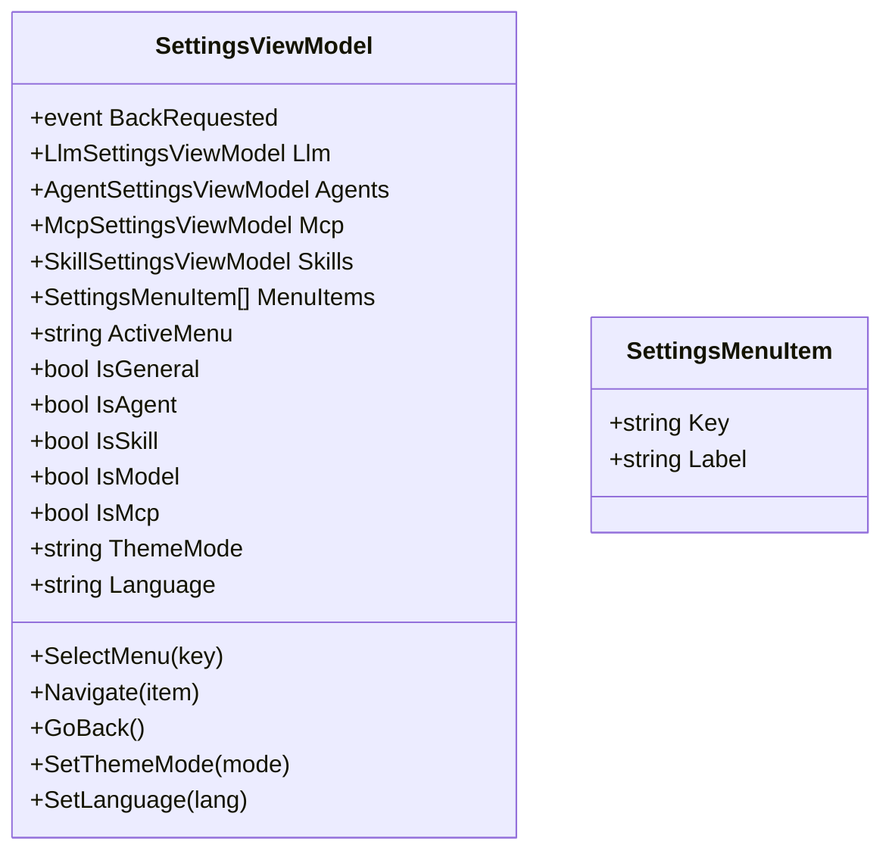
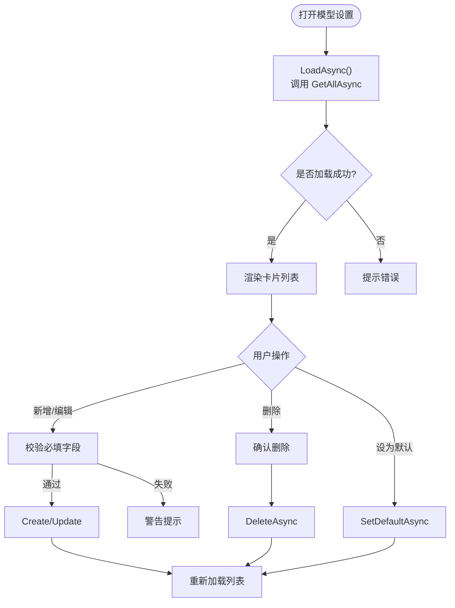
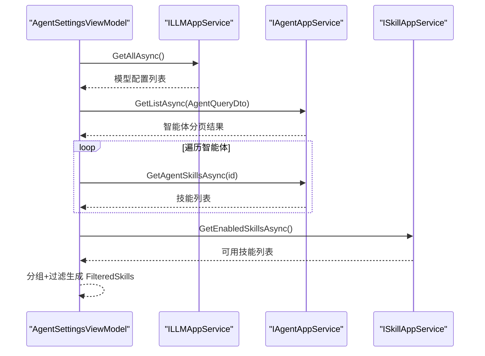
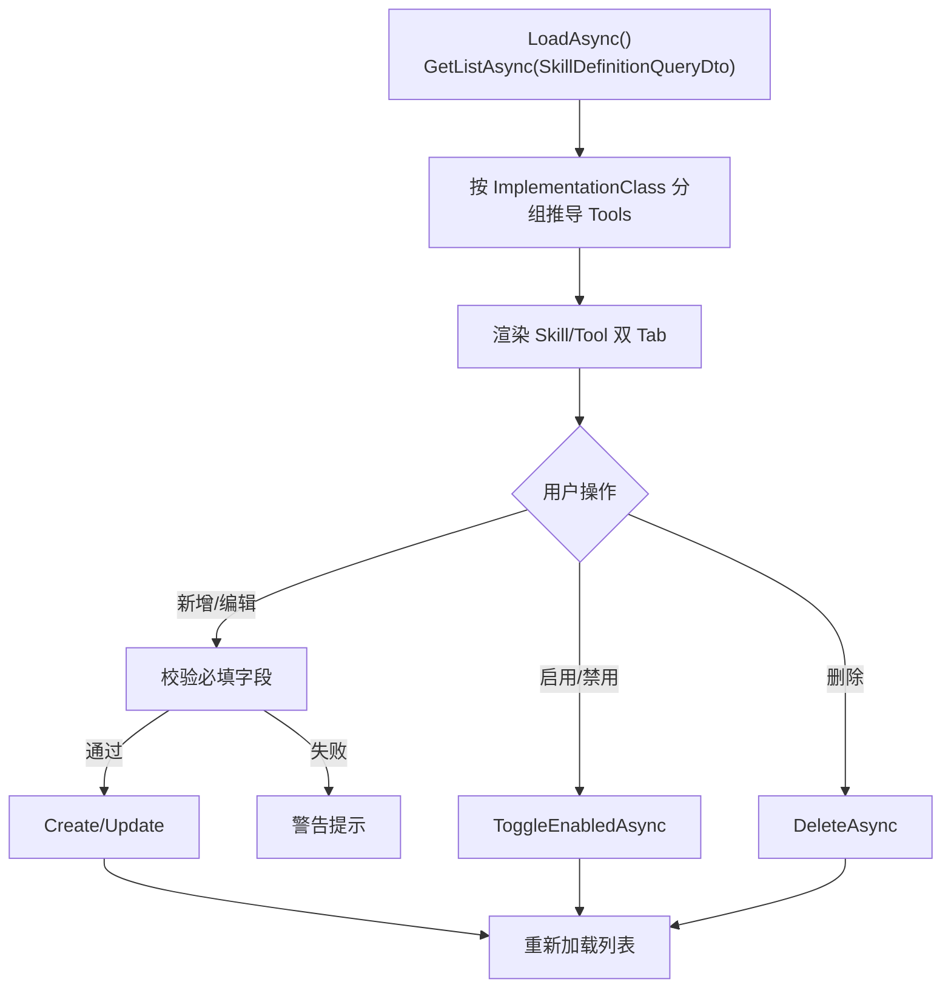
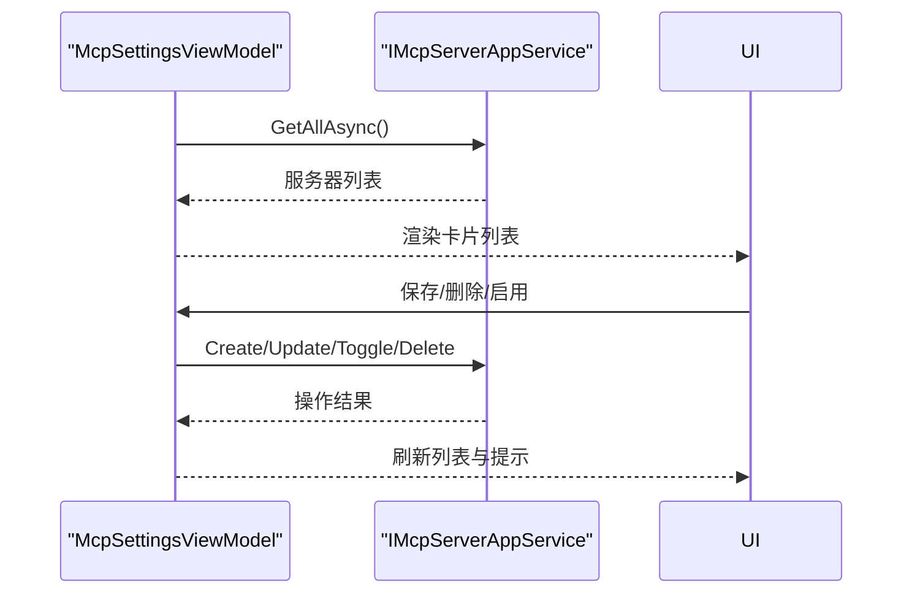
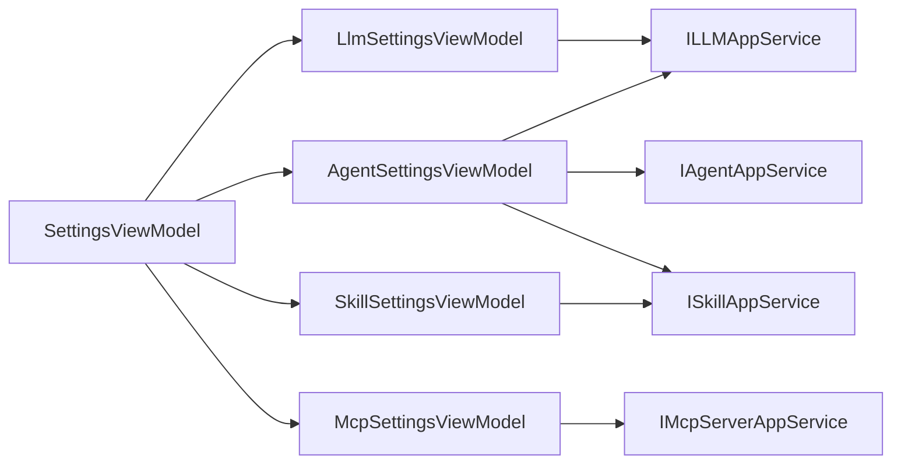

# 应用设置视图模型

<cite>
**本文引用的文件**   
- [SettingsViewModel.cs](file://src/Agent/Assistant/H.Assistant.Desktop/ViewModels/SettingsViewModel.cs)
- [LlmSettingsViewModel.cs](file://src/Agent/Assistant/H.Assistant.Desktop/ViewModels/LlmSettingsViewModel.cs)
- [AgentSettingsViewModel.cs](file://src/Agent/Assistant/H.Assistant.Desktop/ViewModels/AgentSettingsViewModel.cs)
- [McpSettingsViewModel.cs](file://src/Agent/Assistant/H.Assistant.Desktop/ViewModels/McpSettingsViewModel.cs)
- [SkillSettingsViewModel.cs](file://src/Agent/Assistant/H.Assistant.Desktop/ViewModels/SkillSettingsViewModel.cs)
</cite>

## 目录
1. [简介](#简介)
2. [项目结构](#项目结构)
3. [核心组件](#核心组件)
4. [架构总览](#架构总览)
5. [详细组件分析](#详细组件分析)
6. [依赖分析](#依赖分析)
7. [性能考虑](#性能考虑)
8. [故障排查指南](#故障排查指南)
9. [结论](#结论)
10. [附录](#附录)

## 简介
本文件为 SettingsViewModel 及其相关设置子模块的详细开发文档，聚焦于“应用程序全局设置的统一管理”，涵盖：
- 用户偏好配置（主题、语言）
- 模型提供商与 LLM 配置管理
- 智能体（Agent）与技能（Skill）管理
- MCP 服务连接配置
- 配置持久化、验证、默认值与迁移机制
- 设置分组、搜索过滤与批量操作
- 扩展自定义配置项的方法

该实现基于 CommunityToolkit.Mvvm，采用 MVVM 模式，通过 AppService 接口与后端交互，UI 层仅负责展示与交互。

## 项目结构
设置相关的视图模型集中在 Desktop 端 ViewModel 目录中，按功能域拆分为多个独立 ViewModel：
- SettingsViewModel：设置页主入口，左侧菜单 + 右侧内容切换
- LlmSettingsViewModel：模型提供商与 LLM 配置
- AgentSettingsViewModel：智能体定义与关联技能
- SkillSettingsViewModel：技能与工具（Tool）列表
- McpSettingsViewModel：MCP 服务端点与传输方式配置

图表来源
- [SettingsViewModel.cs:11-28](file://src/Agent/Assistant/H.Assistant.Desktop/ViewModels/SettingsViewModel.cs#L11-L28)

章节来源
- [SettingsViewModel.cs:11-28](file://src/Agent/Assistant/H.Assistant.Desktop/ViewModels/SettingsViewModel.cs#L11-L28)

## 核心组件
- SettingsViewModel：维护当前激活菜单、通用设置（主题、语言），并委派加载各子模块数据。
- LlmSettingsViewModel：提供模型配置的增删改查、默认模型设置、密钥掩码显示、预设提供商与模型建议。
- AgentSettingsViewModel：智能体的增删改查、启用/禁用、默认模型选择、技能多选与分组筛选。
- SkillSettingsViewModel：技能与工具的增删改查、启用/禁用、类型选项、实现类分组推导 Tool 列表。
- McpSettingsViewModel：MCP 服务的增删改查、启用/禁用、传输方式选择、超时与头信息配置。

章节来源
- [SettingsViewModel.cs:11-121](file://src/Agent/Assistant/H.Assistant.Desktop/ViewModels/SettingsViewModel.cs#L11-L121)
- [LlmSettingsViewModel.cs:12-310](file://src/Agent/Assistant/H.Assistant.Desktop/ViewModels/LlmSettingsViewModel.cs#L12-L310)
- [AgentSettingsViewModel.cs:12-420](file://src/Agent/Assistant/H.Assistant.Desktop/ViewModels/AgentSettingsViewModel.cs#L12-L420)
- [SkillSettingsViewModel.cs:12-298](file://src/Agent/Assistant/H.Assistant.Desktop/ViewModels/SkillSettingsViewModel.cs#L12-L298)
- [McpSettingsViewModel.cs:12-256](file://src/Agent/Assistant/H.Assistant.Desktop/ViewModels/McpSettingsViewModel.cs#L12-L256)

## 架构总览
整体采用“视图模型 + 应用服务”的解耦架构：
- 视图模型负责 UI 状态、命令与交互逻辑
- 应用服务（AppService）负责业务编排与数据访问
- 数据持久化由后端存储（数据库或远程服务）承担
- 前端不直接持久化设置（通用设置如主题、语言为本地状态）

图表来源
- [SettingsViewModel.cs:70-93](file://src/Agent/Assistant/H.Assistant.Desktop/ViewModels/SettingsViewModel.cs#L70-L93)
- [LlmSettingsViewModel.cs:113-134](file://src/Agent/Assistant/H.Assistant.Desktop/ViewModels/LlmSettingsViewModel.cs#L113-L134)
- [AgentSettingsViewModel.cs:91-146](file://src/Agent/Assistant/H.Assistant.Desktop/ViewModels/AgentSettingsViewModel.cs#L91-L146)
- [SkillSettingsViewModel.cs:100-140](file://src/Agent/Assistant/H.Assistant.Desktop/ViewModels/SkillSettingsViewModel.cs#L100-L140)
- [McpSettingsViewModel.cs:83-104](file://src/Agent/Assistant/H.Assistant.Desktop/ViewModels/McpSettingsViewModel.cs#L83-L104)

## 详细组件分析

### SettingsViewModel（设置页主入口）
职责
- 维护左侧菜单项与激活状态
- 暴露通用设置（主题、语言）属性与切换命令
- 根据激活菜单异步加载对应子模块数据
- 提供返回导航事件

关键特性
- 使用 ObservableProperty 驱动 UI 更新
- 使用 RelayCommand 绑定按钮/输入命令
- 通用设置（主题、语言）为本地状态，不做持久化

图表来源
- [SettingsViewModel.cs:11-121](file://src/Agent/Assistant/H.Assistant.Desktop/ViewModels/SettingsViewModel.cs#L11-L121)

章节来源
- [SettingsViewModel.cs:11-121](file://src/Agent/Assistant/H.Assistant.Desktop/ViewModels/SettingsViewModel.cs#L11-L121)

### LlmSettingsViewModel（模型提供商与 LLM 配置）
职责
- 维护提供商预设（名称、默认端点、API Key 获取链接、可用模型）
- 提供模型配置的增删改查、默认设置、密钥掩码显示
- 支持模型建议与快速选择

数据处理
- 加载时调用 GetAllAsync，填充 ObservableCollection<LlmCardItem>
- 保存时根据编辑/新增分支调用 UpdateAsync/CreateAsync
- 删除与设为默认分别调用 DeleteAsync/SetDefaultAsync

图表来源
- [LlmSettingsViewModel.cs:113-134](file://src/Agent/Assistant/H.Assistant.Desktop/ViewModels/LlmSettingsViewModel.cs#L113-L134)
- [LlmSettingsViewModel.cs:200-251](file://src/Agent/Assistant/H.Assistant.Desktop/ViewModels/LlmSettingsViewModel.cs#L200-L251)
- [LlmSettingsViewModel.cs:254-281](file://src/Agent/Assistant/H.Assistant.Desktop/ViewModels/LlmSettingsViewModel.cs#L254-L281)

章节来源
- [LlmSettingsViewModel.cs:12-310](file://src/Agent/Assistant/H.Assistant.Desktop/ViewModels/LlmSettingsViewModel.cs#L12-L310)

### AgentSettingsViewModel（智能体管理）
职责
- 维护智能体列表、默认模型选项、技能选择器（分组+搜索）
- 提供智能体的增删改查、启用/禁用、默认模型绑定
- 加载技能时按 SkillType 分组，支持关键字过滤

数据处理
- 先加载 LLM 配置作为默认模型选项
- 再加载智能体列表，并尝试拉取每个智能体的已关联技能
- 技能选择器支持分组标题与复选框联动

图表来源
- [AgentSettingsViewModel.cs:91-146](file://src/Agent/Assistant/H.Assistant.Desktop/ViewModels/AgentSettingsViewModel.cs#L91-L146)
- [AgentSettingsViewModel.cs:148-195](file://src/Agent/Assistant/H.Assistant.Desktop/ViewModels/AgentSettingsViewModel.cs#L148-L195)

章节来源
- [AgentSettingsViewModel.cs:12-420](file://src/Agent/Assistant/H.Assistant.Desktop/ViewModels/AgentSettingsViewModel.cs#L12-L420)

### SkillSettingsViewModel（技能与工具）
职责
- 维护技能与工具两个 Tab 页
- 技能支持增删改查、启用/禁用、类型选项、实现类与参数 Schema
- 工具列表由技能的 ImplementationClass 分组推导

数据处理
- 加载技能列表后，按实现类分组生成 ToolCardItem
- 新增/编辑时校验必填字段，调用 Create/Update
- 支持 ToggleEnabled 与 Delete 操作

图表来源
- [SkillSettingsViewModel.cs:100-140](file://src/Agent/Assistant/H.Assistant.Desktop/ViewModels/SkillSettingsViewModel.cs#L100-L140)
- [SkillSettingsViewModel.cs:184-234](file://src/Agent/Assistant/H.Assistant.Desktop/ViewModels/SkillSettingsViewModel.cs#L184-L234)

章节来源
- [SkillSettingsViewModel.cs:12-298](file://src/Agent/Assistant/H.Assistant.Desktop/ViewModels/SkillSettingsViewModel.cs#L12-L298)

### McpSettingsViewModel（MCP 服务）
职责
- 维护传输方式选项（SSE/HTTP/Stdio）
- 提供 MCP 服务的增删改查、启用/禁用、超时与头信息配置
- 支持 Token/ApiKey 掩码显示

数据处理
- 加载时调用 GetAllAsync，填充 Servers 集合
- 新增/编辑时校验必填字段，调用 Create/Update
- 支持 ToggleEnabled 与 Delete 操作

图表来源
- [McpSettingsViewModel.cs:83-104](file://src/Agent/Assistant/H.Assistant.Desktop/ViewModels/McpSettingsViewModel.cs#L83-L104)
- [McpSettingsViewModel.cs:148-199](file://src/Agent/Assistant/H.Assistant.Desktop/ViewModels/McpSettingsViewModel.cs#L148-L199)

章节来源
- [McpSettingsViewModel.cs:12-256](file://src/Agent/Assistant/H.Assistant.Desktop/ViewModels/McpSettingsViewModel.cs#L12-L256)

## 依赖分析
视图模型之间的依赖关系清晰，SettingsViewModel 作为聚合根持有各子模块实例；各子模块依赖对应的 AppService 接口进行数据交互。

图表来源
- [SettingsViewModel.cs:61-68](file://src/Agent/Assistant/H.Assistant.Desktop/ViewModels/SettingsViewModel.cs#L61-L68)
- [LlmSettingsViewModel.cs:91-95](file://src/Agent/Assistant/H.Assistant.Desktop/ViewModels/LlmSettingsViewModel.cs#L91-L95)
- [AgentSettingsViewModel.cs:80-87](file://src/Agent/Assistant/H.Assistant.Desktop/ViewModels/AgentSettingsViewModel.cs#L80-L87)
- [SkillSettingsViewModel.cs:88-92](file://src/Agent/Assistant/H.Assistant.Desktop/ViewModels/SkillSettingsViewModel.cs#L88-L92)
- [McpSettingsViewModel.cs:77-81](file://src/Agent/Assistant/H.Assistant.Desktop/ViewModels/McpSettingsViewModel.cs#L77-L81)

章节来源
- [SettingsViewModel.cs:61-68](file://src/Agent/Assistant/H.Assistant.Desktop/ViewModels/SettingsViewModel.cs#L61-L68)

## 性能考虑
- 列表加载采用一次性拉取（MaxResultCount=100），适合中小规模配置场景；若数据量增长，可引入分页与懒加载。
- 使用 ObservableCollection 提升 UI 响应性，避免频繁全量重建。
- 异常处理统一捕获并提示，避免阻塞主流程。
- 敏感字段（API Key、Token）在前端进行掩码显示，减少泄露风险。

[本节为通用指导，不直接分析具体文件]

## 故障排查指南
常见问题与定位要点：
- 列表加载失败：检查 AppService 调用是否抛出异常，查看 Toast 提示中的错误信息。
- 保存失败：核对必填字段校验逻辑，确保 ProviderName、Model、ApiKey、Endpoint 等不为空。
- 默认设置未生效：确认 SetDefaultAsync 调用成功，并重新加载列表。
- 技能筛选无效：检查 SkillSearchText 是否为空，以及 DisplayName/SkillName 是否包含关键字。

章节来源
- [LlmSettingsViewModel.cs:113-134](file://src/Agent/Assistant/H.Assistant.Desktop/ViewModels/LlmSettingsViewModel.cs#L113-L134)
- [AgentSettingsViewModel.cs:91-146](file://src/Agent/Assistant/H.Assistant.Desktop/ViewModels/AgentSettingsViewModel.cs#L91-L146)
- [SkillSettingsViewModel.cs:100-140](file://src/Agent/Assistant/H.Assistant.Desktop/ViewModels/SkillSettingsViewModel.cs#L100-L140)
- [McpSettingsViewModel.cs:83-104](file://src/Agent/Assistant/H.Assistant.Desktop/ViewModels/McpSettingsViewModel.cs#L83-L104)

## 结论
SettingsViewModel 体系以清晰的职责划分与 MVVM 模式实现了应用设置的统一管理。通过 AppService 抽象，前后端解耦良好；通过统一的错误处理与提示机制，提升了用户体验。未来可在大数据量场景下引入分页与缓存策略，进一步增强性能与可扩展性。

[本节为总结，不直接分析具体文件]

## 附录

### 配置持久化与迁移机制
- 当前实现中，通用设置（主题、语言）为本地状态，不做持久化。
- 模型、智能体、技能、MCP 等配置通过 AppService 与后端交互，持久化由后端存储承担。
- 如需前端持久化（例如首次运行默认值），可在 SettingsViewModel 中增加本地存储封装，并在初始化时合并默认值。

章节来源
- [SettingsViewModel.cs:44-59](file://src/Agent/Assistant/H.Assistant.Desktop/ViewModels/SettingsViewModel.cs#L44-L59)

### 设置分组、搜索过滤与批量操作
- 分组：技能选择器按 SkillType 分组，便于快速定位。
- 搜索过滤：SkillSearchText 支持按 DisplayName/SkillName 模糊匹配。
- 批量操作：当前以单条增删改为主；如需批量启用/禁用，可在 ViewModel 中增加批量命令与确认对话框。

章节来源
- [AgentSettingsViewModel.cs:162-195](file://src/Agent/Assistant/H.Assistant.Desktop/ViewModels/AgentSettingsViewModel.cs#L162-L195)

### 设置扩展与自定义配置项
- 扩展新设置项：在对应 ViewModel 中添加属性与命令，并在 UI 中绑定。
- 新增提供商或传输方式：在 ProviderDefs/TransportOptions 中追加选项。
- 新增数据源类型：参考 DataSourcePropertyItem 的实现，扩展枚举与渲染逻辑。

章节来源
- [LlmSettingsViewModel.cs:20-34](file://src/Agent/Assistant/H.Assistant.Desktop/ViewModels/LlmSettingsViewModel.cs#L20-L34)
- [McpSettingsViewModel.cs:17-22](file://src/Agent/Assistant/H.Assistant.Desktop/ViewModels/McpSettingsViewModel.cs#L17-L22)
- [SkillSettingsViewModel.cs:17-22](file://src/Agent/Assistant/H.Assistant.Desktop/ViewModels/SkillSettingsViewModel.cs#L17-L22)