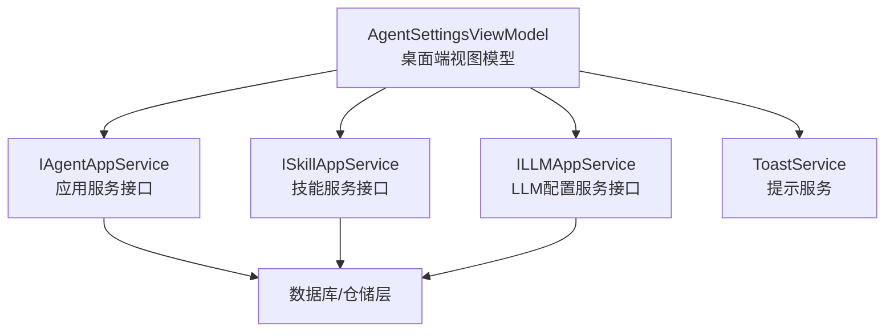
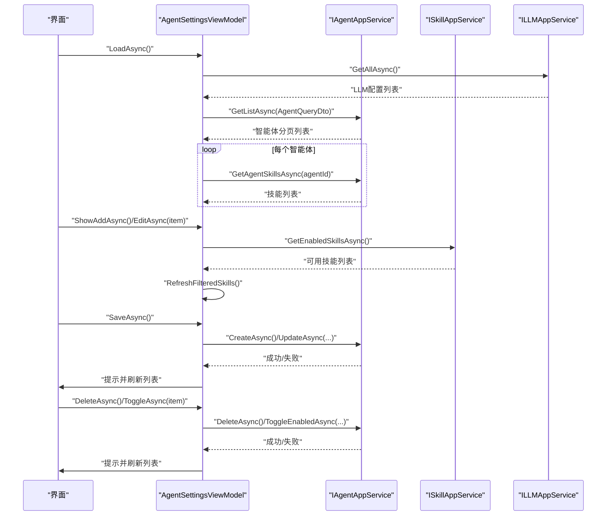
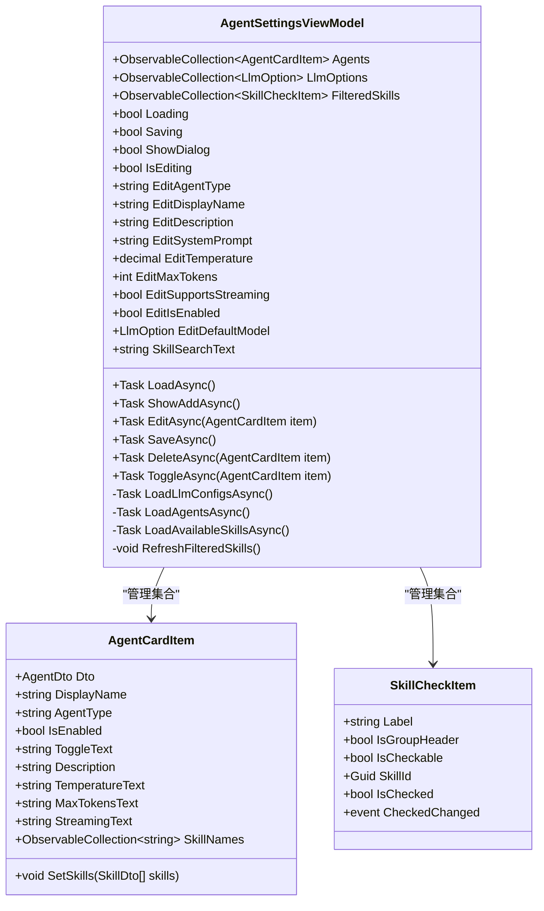
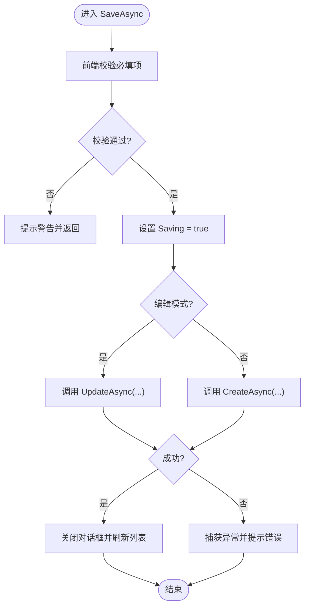
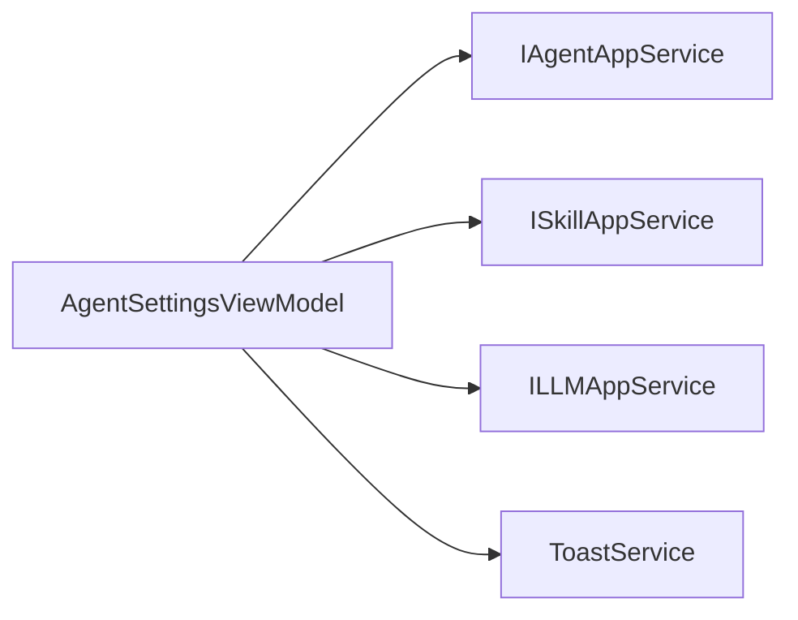

# 智能体设置视图模型

<cite>
**本文引用的文件**
- [AgentSettingsViewModel.cs](file://src/Agent/Assistant/H.Assistant.Desktop/ViewModels/AgentSettingsViewModel.cs)
- [AgentAppService.cs](file://src/Agent/Assistant/H.Assistant.Application/Services/AgentAppService.cs)
- [AgentConfigDto.cs](file://src/Agent/Assistant/H.Assistant.Application.Contracts/Dtos/Agents/AgentConfigDto.cs)
- [AgentDefinition.cs](file://src/Agent/Assistant/H.Assistant.Application.Contracts/Dtos/Agents/AgentDefinition.cs)
</cite>

## 目录
1. [简介](#简介)
2. [项目结构](#项目结构)
3. [核心组件](#核心组件)
4. [架构总览](#架构总览)
5. [详细组件分析](#详细组件分析)
6. [依赖关系分析](#依赖关系分析)
7. [性能考虑](#性能考虑)
8. [故障排查指南](#故障排查指南)
9. [结论](#结论)
10. [附录](#附录)

## 简介
本文件为 AgentSettingsViewModel 的详细开发文档，聚焦智能体配置管理的前端视图模型实现。内容涵盖：
- 智能体的增删改查与状态切换（启用/禁用）
- 配置校验、错误处理与用户反馈
- 与后端服务的交互方式（应用服务接口）
- 数据同步机制与 UI 更新逻辑
- 技能选择与分组过滤
- 批量操作与导入导出扩展建议
- 使用示例与最佳实践

## 项目结构
AgentSettingsViewModel 位于桌面客户端的 ViewModel 层，负责：
- 加载 LLM 模型配置列表
- 加载智能体列表并附带技能信息
- 打开新建/编辑对话框，收集表单数据
- 调用应用服务完成创建、更新、删除、启用/禁用等操作
- 维护技能选择集合与搜索过滤

图表来源
- [AgentSettingsViewModel.cs](file://src/Agent/Assistant/H.Assistant.Desktop/ViewModels/AgentSettingsViewModel.cs)
- [AgentAppService.cs](file://src/Agent/Assistant/H.Assistant.Application/Services/AgentAppService.cs)

章节来源
- [AgentSettingsViewModel.cs](file://src/Agent/Assistant/H.Assistant.Desktop/ViewModels/AgentSettingsViewModel.cs)
- [AgentAppService.cs](file://src/Agent/Assistant/H.Assistant.Application/Services/AgentAppService.cs)

## 核心组件
- AgentSettingsViewModel
  - 职责：承载智能体配置的展示与编辑状态，协调各服务完成 CRUD 与状态切换，维护技能选择与过滤结果。
  - 关键属性：
    - Agents：智能体卡片集合
    - LlmOptions：LLM 模型选项
    - FilteredSkills：技能筛选后的列表（含分组标题与复选项）
    - Loading/Saving/ShowDialog/IsEditing：加载、保存、对话框显示与编辑模式状态
    - Edit*：编辑表单绑定字段（类型、名称、描述、系统提示词、温度、最大令牌、流式支持、是否启用、默认模型等）
    - SkillSearchText：技能搜索文本
  - 关键方法：
    - LoadAsync：初始化加载 LLM 配置与智能体列表
    - ShowAddAsync/EditAsync：打开新建/编辑对话框并填充数据
    - SaveAsync：执行创建或更新，包含前端校验与异常处理
    - DeleteAsync/ToggleAsync：删除与启用/禁用切换
    - RefreshFilteredSkills：根据搜索文本对技能进行分组与过滤

- AgentCardItem
  - 职责：封装单个智能体的展示信息与技能名称集合，提供 ToggleText 等派生属性。

- SkillCheckItem
  - 职责：表示技能选择项（分组标题或可勾选项），通过事件通知选中状态变化。

- DTO 与定义
  - AgentConfigDto：智能体配置 DTO（用于契约层）
  - AgentDefinition：智能体定义（用于契约层）

章节来源
- [AgentSettingsViewModel.cs](file://src/Agent/Assistant/H.Assistant.Desktop/ViewModels/AgentSettingsViewModel.cs)
- [AgentConfigDto.cs](file://src/Agent/Assistant/H.Assistant.Application.Contracts/Dtos/Agents/AgentConfigDto.cs)
- [AgentDefinition.cs](file://src/Agent/Assistant/H.Assistant.Application.Contracts/Dtos/Agents/AgentDefinition.cs)

## 架构总览
AgentSettingsViewModel 作为桌面端视图模型，遵循 MVVM 模式，通过注入的应用服务接口与后端交互。数据流如下：
- 初始化阶段：加载 LLM 配置与智能体列表，同时加载可用技能并构建分组过滤列表。
- 编辑阶段：新建时清空表单；编辑时回填现有值与已选技能。
- 保存阶段：前端校验必填项，调用应用服务完成创建或更新，成功后刷新列表并关闭对话框。
- 删除/切换阶段：直接调用对应接口，成功后刷新列表。

图表来源
- [AgentSettingsViewModel.cs](file://src/Agent/Assistant/H.Assistant.Desktop/ViewModels/AgentSettingsViewModel.cs)
- [AgentAppService.cs](file://src/Agent/Assistant/H.Assistant.Application/Services/AgentAppService.cs)

## 详细组件分析

### AgentSettingsViewModel 类图

图表来源
- [AgentSettingsViewModel.cs](file://src/Agent/Assistant/H.Assistant.Desktop/ViewModels/AgentSettingsViewModel.cs)

章节来源
- [AgentSettingsViewModel.cs](file://src/Agent/Assistant/H.Assistant.Desktop/ViewModels/AgentSettingsViewModel.cs)

### 保存流程流程图（创建/更新）

图表来源
- [AgentSettingsViewModel.cs](file://src/Agent/Assistant/H.Assistant.Desktop/ViewModels/AgentSettingsViewModel.cs)

章节来源
- [AgentSettingsViewModel.cs](file://src/Agent/Assistant/H.Assistant.Desktop/ViewModels/AgentSettingsViewModel.cs)

### 技能选择与过滤逻辑
- 可用技能通过 ISkillAppService.GetEnabledSkillsAsync 获取。
- 按 SkillType 分组，生成分组标题与可勾选项。
- 根据 SkillSearchText 进行大小写不敏感的名称匹配。
- 勾选/取消勾选通过事件回调更新 _selectedSkillIds 集合。

章节来源
- [AgentSettingsViewModel.cs](file://src/Agent/Assistant/H.Assistant.Desktop/ViewModels/AgentSettingsViewModel.cs)

### 与后端服务的交互
- IAgentAppService：提供 GetListAsync、CreateAsync、UpdateAsync、DeleteAsync、ToggleEnabledAsync、GetAgentSkillsAsync 等方法。
- ISkillAppService：提供 GetEnabledSkillsAsync 获取启用的技能。
- ILLMAppService：提供 GetAllAsync 获取 LLM 配置列表。
- 所有网络调用均包裹 try/catch，并通过 ToastService 向用户反馈成功或错误信息。

章节来源
- [AgentSettingsViewModel.cs](file://src/Agent/Assistant/H.Assistant.Desktop/ViewModels/AgentSettingsViewModel.cs)
- [AgentAppService.cs](file://src/Agent/Assistant/H.Assistant.Application/Services/AgentAppService.cs)

### 数据同步与 UI 更新
- 列表刷新：在创建/更新/删除/切换状态后调用 LoadAgentsAsync 重新拉取数据。
- 技能刷新：在打开新建/编辑对话框时加载可用技能并重建 FilteredSkills。
- 状态属性：Loading/Saving/ShowDialog/IsEditing 等属性通过 ObservableObject 触发 UI 更新。

章节来源
- [AgentSettingsViewModel.cs](file://src/Agent/Assistant/H.Assistant.Desktop/ViewModels/AgentSettingsViewModel.cs)

## 依赖关系分析
- 视图模型依赖三个应用服务接口：IAgentAppService、ISkillAppService、ILLMAppService。
- 通过依赖注入在构造函数中传入实例。
- 内部还依赖 ToastService 进行用户提示。

图表来源
- [AgentSettingsViewModel.cs](file://src/Agent/Assistant/H.Assistant.Desktop/ViewModels/AgentSettingsViewModel.cs)

章节来源
- [AgentSettingsViewModel.cs](file://src/Agent/Assistant/H.Assistant.Desktop/ViewModels/AgentSettingsViewModel.cs)

## 性能考虑
- 列表加载限制：GetListAsync 使用 MaxResultCount=100 限制单次加载数量，避免大数据量导致卡顿。
- 异步操作：所有 IO 操作均为异步，避免阻塞 UI 线程。
- 局部刷新：仅在必要操作后刷新列表，减少不必要的重渲染。
- 技能过滤：在前端内存中进行字符串匹配与分组，降低服务端压力。

[本节为通用指导，无需引用具体文件]

## 故障排查指南
- 加载 LLM 配置失败：检查 ILLMAppService.GetAllAsync 的网络连通性与权限，查看 Toast 错误消息。
- 加载智能体列表失败：确认 IAgentAppService.GetListAsync 参数与后端接口一致，检查异常堆栈。
- 技能加载失败：ISkillAppService.GetEnabledSkillsAsync 失败时，UI 会降级为空列表并提示错误。
- 保存失败：前端校验通过后仍可能因后端约束（如唯一性）抛出异常，需查看错误详情。
- 删除/切换失败：确认目标智能体存在且未被其他业务锁定，检查后端返回的错误信息。

章节来源
- [AgentSettingsViewModel.cs](file://src/Agent/Assistant/H.Assistant.Desktop/ViewModels/AgentSettingsViewModel.cs)

## 结论
AgentSettingsViewModel 以清晰的职责边界与良好的错误处理策略，实现了智能体配置的完整生命周期管理。通过与服务层的解耦与前端状态管理，保证了 UI 的一致性与用户体验。建议在后续迭代中补充批量操作与导入导出能力，进一步提升运维效率。

[本节为总结性内容，无需引用具体文件]

## 附录

### 使用示例（步骤说明）
- 初始化页面：调用 LoadAsync，自动加载 LLM 配置与智能体列表。
- 新建智能体：点击“新建”，填写类型标识、显示名称、描述、系统提示词等，选择默认模型与技能，点击“创建”。
- 编辑智能体：点击“编辑”，修改字段与技能选择，点击“保存”。
- 删除智能体：点击“删除”，确认后移除记录并刷新列表。
- 启用/禁用：点击“启用/禁用”按钮，快速切换状态。

[本节为概念性说明，无需引用具体文件]

### 批量操作与导入导出（扩展建议）
- 批量操作：可在 ViewModel 中增加批量选择集合，提供 BatchDeleteAsync/BatchEnableAsync 等方法，统一调用后端批量接口。
- 导入导出：
  - 导出：将 Agents 集合序列化为 JSON/CSV，提供下载功能。
  - 导入：解析上传文件，映射到 CreateAgentDto/UpdateAgentDto，批量调用后端接口并汇总错误结果。

[本节为概念性说明，无需引用具体文件]

### 配置验证与错误处理策略
- 前端校验：必填项非空、类型格式正确（如温度范围、最大令牌为正整数）。
- 后端校验：唯一性约束（如 AgentType）、关联完整性（如 DefaultModelConfigId 存在）。
- 错误反馈：统一通过 ToastService 提示，区分 success/warning/error 级别。

章节来源
- [AgentSettingsViewModel.cs](file://src/Agent/Assistant/H.Assistant.Desktop/ViewModels/AgentSettingsViewModel.cs)