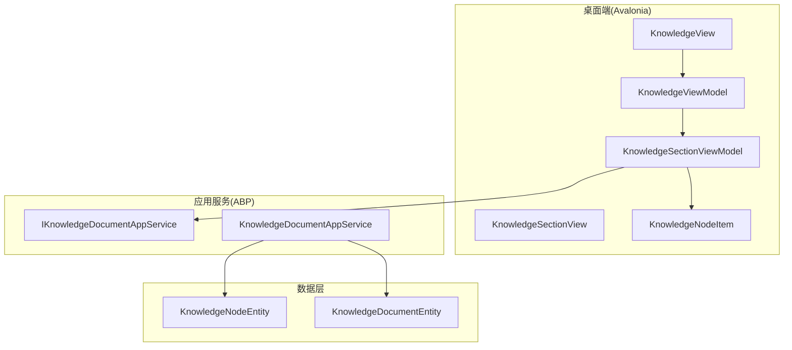
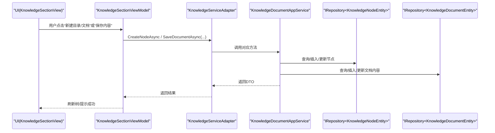
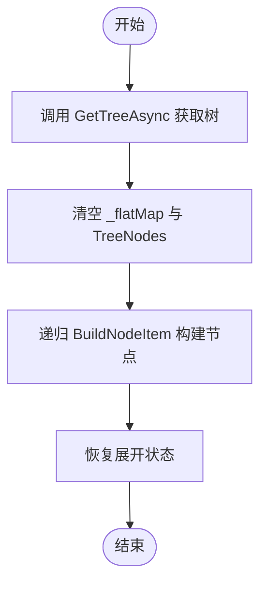
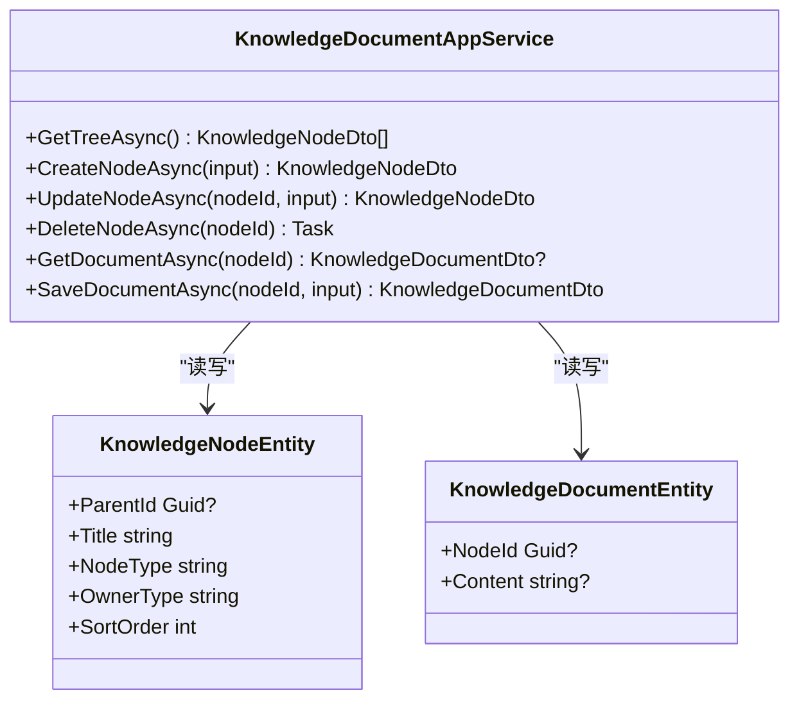
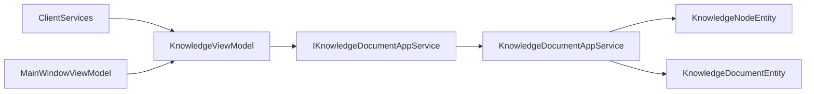
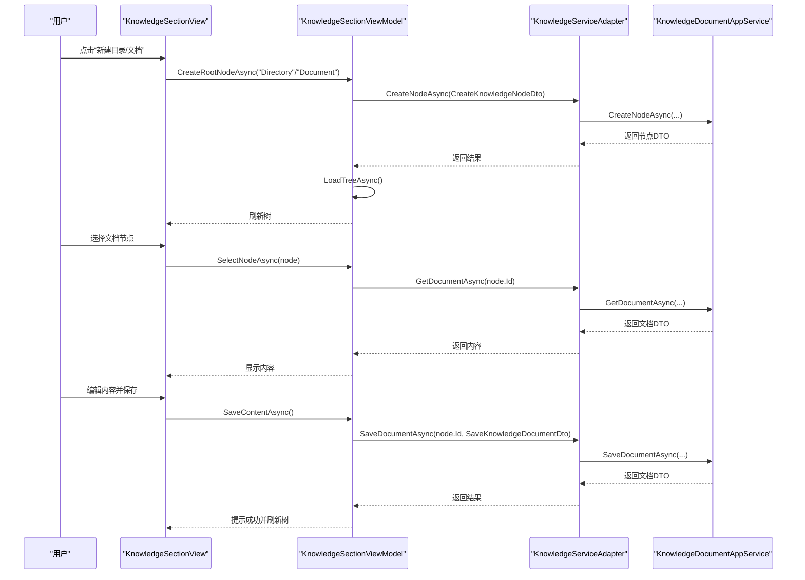

# 知识库视图模型

<cite>
**本文引用的文件**
- [KnowledgeViewModel.cs](file://src/Agent/Assistant/H.Assistant.Desktop/ViewModels/KnowledgeViewModel.cs)
- [IKnowledgeDocumentAppService.cs](file://src/Agent/Assistant/H.Assistant.Application.Contracts/Services/Knowledge/IKnowledgeDocumentAppService.cs)
- [KnowledgeDocumentAppService.cs](file://src/Agent/Assistant/H.Assistant.Application/Services/KnowledgeDocumentAppService.cs)
- [KnowledgeNodeDto.cs](file://src/Agent/Assistant/H.Assistant.Application.Contracts/Dtos/Knowledge/KnowledgeNodeDto.cs)
- [CreateKnowledgeNodeDto.cs](file://src/Agent/Assistant/H.Assistant.Application.Contracts/Dtos/Knowledge/CreateKnowledgeNodeDto.cs)
- [UpdateKnowledgeNodeDto.cs](file://src/Agent/Assistant/H.Assistant.Application.Contracts/Dtos/Knowledge/UpdateKnowledgeNodeDto.cs)
- [KnowledgeDocumentDto.cs](file://src/Agent/Assistant/H.Assistant.Application.Contracts/Dtos/Knowledge/KnowledgeDocumentDto.cs)
- [SaveKnowledgeDocumentDto.cs](file://src/Agent/Assistant/H.Assistant.Application.Contracts/Dtos/Knowledge/SaveKnowledgeDocumentDto.cs)
- [KnowledgeNodeEntity.cs](file://src/Agent/Assistant/H.Assistant.EntityFrameworkCore/Entities/KnowledgeNodeEntity.cs)
- [KnowledgeDocumentEntity.cs](file://src/Agent/Assistant/H.Assistant.EntityFrameworkCore/Entities/KnowledgeDocumentEntity.cs)
- [KnowledgeSectionView.axaml.cs](file://src/Agent/Assistant/H.Assistant.Desktop/Views/KnowledgeSectionView.axaml.cs)
- [KnowledgeView.axaml.cs](file://src/Agent/Assistant/H.Assistant.Desktop/Views/KnowledgeView.axaml.cs)
- [ClientServices.cs](file://src/Agent/Assistant/H.Assistant.Desktop/ClientServices.cs)
- [MainWindowViewModel.cs](file://src/Agent/Assistant/H.Assistant.Desktop/ViewModels/MainWindowViewModel.cs)
</cite>

## 目录
1. [简介](#简介)
2. [项目结构](#项目结构)
3. [核心组件](#核心组件)
4. [架构总览](#架构总览)
5. [详细组件分析](#详细组件分析)
6. [依赖关系分析](#依赖关系分析)
7. [性能与缓存策略](#性能与缓存策略)
8. [权限控制与版本管理](#权限控制与版本管理)
9. [完整使用示例](#完整使用示例)
10. [故障排除指南](#故障排除指南)
11. [结论](#结论)

## 简介
本文件为 KnowledgeViewModel（知识库视图模型）的详细开发文档，覆盖知识节点的树形结构管理、文档内容编辑与保存、搜索能力扩展点、文件操作与目录管理、权限控制、版本管理以及与后端服务的同步机制、缓存策略和性能优化。面向前端桌面端（Avalonia）与后端 ABP 应用服务之间的交互，提供从 UI 到数据层的端到端说明。

## 项目结构
- 视图层（Avalonia Desktop）
  - KnowledgeView：页面容器
  - KnowledgeSectionView：知识树与内容面板的交互逻辑
  - KnowledgeViewModel：顶层 ViewModel，包含“知识库”和“记忆”两个区块
- 应用服务层（ABP Application）
  - IKnowledgeDocumentAppService：定义节点与文档操作的契约
  - KnowledgeDocumentAppService：实现树构建、CRUD、文档内容读写
- 领域实体与 DTO
  - KnowledgeNodeEntity / KnowledgeDocumentEntity：持久化模型
  - KnowledgeNodeDto / KnowledgeDocumentDto / CreateKnowledgeNodeDto / UpdateKnowledgeNodeDto / SaveKnowledgeDocumentDto：传输模型
- 依赖注入与绑定
  - ClientServices：注册 KnowledgeViewModel
  - MainWindowViewModel：聚合 KnowledgeViewModel

图表来源
- [KnowledgeView.axaml.cs:1-12](file://src/Agent/Assistant/H.Assistant.Desktop/Views/KnowledgeView.axaml.cs#L1-L12)
- [KnowledgeSectionView.axaml.cs:1-98](file://src/Agent/Assistant/H.Assistant.Desktop/Views/KnowledgeSectionView.axaml.cs#L1-L98)
- [KnowledgeViewModel.cs:1-537](file://src/Agent/Assistant/H.Assistant.Desktop/ViewModels/KnowledgeViewModel.cs#L1-L537)
- [IKnowledgeDocumentAppService.cs:1-17](file://src/Agent/Assistant/H.Assistant.Application.Contracts/Services/Knowledge/IKnowledgeDocumentAppService.cs#L1-L17)
- [KnowledgeDocumentAppService.cs:1-227](file://src/Agent/Assistant/H.Assistant.Application/Services/KnowledgeDocumentAppService.cs#L1-L227)
- [KnowledgeNodeEntity.cs:1-25](file://src/Agent/Assistant/H.Assistant.EntityFrameworkCore/Entities/KnowledgeNodeEntity.cs#L1-L25)
- [KnowledgeDocumentEntity.cs:1-16](file://src/Agent/Assistant/H.Assistant.EntityFrameworkCore/Entities/KnowledgeDocumentEntity.cs#L1-L16)

章节来源
- [KnowledgeView.axaml.cs:1-12](file://src/Agent/Assistant/H.Assistant.Desktop/Views/KnowledgeView.axaml.cs#L1-L12)
- [KnowledgeSectionView.axaml.cs:1-98](file://src/Agent/Assistant/H.Assistant.Desktop/Views/KnowledgeSectionView.axaml.cs#L1-L98)
- [KnowledgeViewModel.cs:1-537](file://src/Agent/Assistant/H.Assistant.Desktop/ViewModels/KnowledgeViewModel.cs#L1-L537)
- [IKnowledgeDocumentAppService.cs:1-17](file://src/Agent/Assistant/H.Assistant.Application.Contracts/Services/Knowledge/IKnowledgeDocumentAppService.cs#L1-L17)
- [KnowledgeDocumentAppService.cs:1-227](file://src/Agent/Assistant/H.Assistant.Application/Services/KnowledgeDocumentAppService.cs#L1-L227)
- [KnowledgeNodeEntity.cs:1-25](file://src/Agent/Assistant/H.Assistant.EntityFrameworkCore/Entities/KnowledgeNodeEntity.cs#L1-L25)
- [KnowledgeDocumentEntity.cs:1-16](file://src/Agent/Assistant/H.Assistant.EntityFrameworkCore/Entities/KnowledgeDocumentEntity.cs#L1-L16)

## 核心组件
- KnowledgeViewModel
  - 负责“知识库”和“记忆”两个 Tab 的切换与初始化
  - 通过适配器委托复用同一套树与文档操作逻辑
- KnowledgeSectionViewModel
  - 维护树形结构、展开状态、选中项、编辑态
  - 封装创建/删除/重命名节点、加载树、选择节点、预览/编辑内容、保存内容等
- KnowledgeNodeItem
  - 递归树节点项，封装节点属性与交互命令（展开、菜单、重命名）
- KnowledgeServiceAdapter
  - 将 IKnowledgeDocumentAppService 与 IMemoryAppService 的统一方法签名适配给 KnowledgeSectionViewModel

章节来源
- [KnowledgeViewModel.cs:1-537](file://src/Agent/Assistant/H.Assistant.Desktop/ViewModels/KnowledgeViewModel.cs#L1-L537)

## 架构总览
下图展示从 UI 到服务再到数据实体的调用链，以及树构建与文档内容读写的流程。

图表来源
- [KnowledgeSectionView.axaml.cs:1-98](file://src/Agent/Assistant/H.Assistant.Desktop/Views/KnowledgeSectionView.axaml.cs#L1-L98)
- [KnowledgeViewModel.cs:1-537](file://src/Agent/Assistant/H.Assistant.Desktop/ViewModels/KnowledgeViewModel.cs#L1-L537)
- [KnowledgeDocumentAppService.cs:1-227](file://src/Agent/Assistant/H.Assistant.Application/Services/KnowledgeDocumentAppService.cs#L1-L227)

## 详细组件分析

### KnowledgeViewModel
- 职责
  - 维护 ActiveTab 并暴露 IsKnowledgeTab / IsMemoryTab
  - 初始化时分别加载“知识库”和“记忆”的树
  - 通过 KnowledgeServiceAdapter 统一两种业务的数据访问
- 关键行为
  - InitializeAsync：确保仅首次加载
  - SwitchTab：切换 Tab 并触发 UI 更新

章节来源
- [KnowledgeViewModel.cs:1-82](file://src/Agent/Assistant/H.Assistant.Desktop/ViewModels/KnowledgeViewModel.cs#L1-L82)

### KnowledgeSectionViewModel
- 职责
  - 树加载与扁平映射（_flatMap）加速查找
  - 展开状态持久化（_expandedState）避免刷新丢失
  - 节点 CRUD：根目录/子目录/子文档创建、删除、重命名
  - 内容面板：预览/编辑标题与内容、保存并刷新
- 关键算法
  - 树构建：LoadTreeAsync 调用 GetTreeAsync，BuildNodeItem 递归构建
  - 选择更新：UpdateSelection 遍历树同步选中态
  - 保存内容：先判断标题是否变更再更新节点，再保存文档内容

图表来源
- [KnowledgeViewModel.cs:159-205](file://src/Agent/Assistant/H.Assistant.Desktop/ViewModels/KnowledgeViewModel.cs#L159-L205)

章节来源
- [KnowledgeViewModel.cs:98-444](file://src/Agent/Assistant/H.Assistant.Desktop/ViewModels/KnowledgeViewModel.cs#L98-L444)

### KnowledgeNodeItem
- 职责
  - 表示单个树节点，持有 Dto 与 Section 引用
  - 提供展开、菜单、重命名等命令
- 交互
  - ClickAsync：触发选中并切换目录展开
  - StartRename / CommitRename / CancelRename：本地编辑后提交到服务端

章节来源
- [KnowledgeViewModel.cs:449-537](file://src/Agent/Assistant/H.Assistant.Desktop/ViewModels/KnowledgeViewModel.cs#L449-L537)

### KnowledgeServiceAdapter
- 作用
  - 将 IKnowledgeDocumentAppService 与 IMemoryAppService 的方法签名统一为 Func 委托集合
  - 使 KnowledgeSectionViewModel 无需关心具体业务域（知识库/记忆）

章节来源
- [KnowledgeViewModel.cs:84-94](file://src/Agent/Assistant/H.Assistant.Desktop/ViewModels/KnowledgeViewModel.cs#L84-L94)

### 应用服务层（KnowledgeDocumentAppService）
- 树操作
  - GetTreeAsync：按 OwnerType=Knowledge 过滤，排序后内存中构建树
  - CreateNodeAsync：校验父节点，插入节点；若为 Document 则创建空文档
  - UpdateNodeAsync：支持类型切换（Directory/Document），自动清理或创建文档内容
  - DeleteNodeAsync：递归收集所有后代节点，自底向上删除
- 文档内容
  - GetDocumentAsync：按 NodeId 查询文档内容
  - SaveDocumentAsync：不存在则创建，存在则更新；同时校验节点类型与归属

图表来源
- [KnowledgeDocumentAppService.cs:1-227](file://src/Agent/Assistant/H.Assistant.Application/Services/KnowledgeDocumentAppService.cs#L1-L227)
- [KnowledgeNodeEntity.cs:1-25](file://src/Agent/Assistant/H.Assistant.EntityFrameworkCore/Entities/KnowledgeNodeEntity.cs#L1-L25)
- [KnowledgeDocumentEntity.cs:1-16](file://src/Agent/Assistant/H.Assistant.EntityFrameworkCore/Entities/KnowledgeDocumentEntity.cs#L1-L16)

章节来源
- [KnowledgeDocumentAppService.cs:1-227](file://src/Agent/Assistant/H.Assistant.Application/Services/KnowledgeDocumentAppService.cs#L1-L227)

### 数据传输对象（DTO）
- KnowledgeNodeDto：树节点（含 Children）
- KnowledgeDocumentDto：文档内容（NodeId, Content）
- CreateKnowledgeNodeDto：创建节点（ParentId, Title, NodeType, SortOrder）
- UpdateKnowledgeNodeDto：更新节点（Title, SortOrder, NodeType）
- SaveKnowledgeDocumentDto：保存内容（Content）

章节来源
- [KnowledgeNodeDto.cs:1-16](file://src/Agent/Assistant/H.Assistant.Application.Contracts/Dtos/Knowledge/KnowledgeNodeDto.cs#L1-L16)
- [KnowledgeDocumentDto.cs:1-13](file://src/Agent/Assistant/H.Assistant.Application.Contracts/Dtos/Knowledge/KnowledgeDocumentDto.cs#L1-L13)
- [CreateKnowledgeNodeDto.cs:1-22](file://src/Agent/Assistant/H.Assistant.Application.Contracts/Dtos/Knowledge/CreateKnowledgeNodeDto.cs#L1-L22)
- [UpdateKnowledgeNodeDto.cs:1-19](file://src/Agent/Assistant/H.Assistant.Application.Contracts/Dtos/Knowledge/UpdateKnowledgeNodeDto.cs#L1-L19)
- [SaveKnowledgeDocumentDto.cs:1-10](file://src/Agent/Assistant/H.Assistant.Application.Contracts/Dtos/Knowledge/SaveKnowledgeDocumentDto.cs#L1-L10)

### 视图与交互（Avalonia）
- KnowledgeSectionView
  - 处理树选择、双击标题进入重命名、键盘事件（Enter/Esc）、失焦提交
- KnowledgeView
  - 页面容器，无额外逻辑

章节来源
- [KnowledgeSectionView.axaml.cs:1-98](file://src/Agent/Assistant/H.Assistant.Desktop/Views/KnowledgeSectionView.axaml.cs#L1-L98)
- [KnowledgeView.axaml.cs:1-12](file://src/Agent/Assistant/H.Assistant.Desktop/Views/KnowledgeView.axaml.cs#L1-L12)

## 依赖关系分析
- 依赖注入
  - ClientServices 注册 KnowledgeViewModel
  - MainWindowViewModel 聚合 KnowledgeViewModel
- 接口契约
  - IKnowledgeDocumentAppService 定义树与文档操作
- 实体与 DTO
  - 通过 AutoMapper 在 Entity 与 DTO 之间转换

图表来源
- [ClientServices.cs:54-54](file://src/Agent/Assistant/H.Assistant.Desktop/ClientServices.cs#L54-L54)
- [MainWindowViewModel.cs:18-48](file://src/Agent/Assistant/H.Assistant.Desktop/ViewModels/MainWindowViewModel.cs#L18-L48)
- [IKnowledgeDocumentAppService.cs:1-17](file://src/Agent/Assistant/H.Assistant.Application.Contracts/Services/Knowledge/IKnowledgeDocumentAppService.cs#L1-L17)
- [KnowledgeDocumentAppService.cs:1-227](file://src/Agent/Assistant/H.Assistant.Application/Services/KnowledgeDocumentAppService.cs#L1-L227)

章节来源
- [ClientServices.cs:54-54](file://src/Agent/Assistant/H.Assistant.Desktop/ClientServices.cs#L54-L54)
- [MainWindowViewModel.cs:18-48](file://src/Agent/Assistant/H.Assistant.Desktop/ViewModels/MainWindowViewModel.cs#L18-L48)
- [IKnowledgeDocumentAppService.cs:1-17](file://src/Agent/Assistant/H.Assistant.Application.Contracts/Services/Knowledge/IKnowledgeDocumentAppService.cs#L1-L17)

## 性能与缓存策略
- 前端缓存
  - _flatMap：以 Id 为键的节点映射，O(1) 查找，避免重复查询
  - _expandedState：保留展开状态，减少 UI 抖动
- 后端优化
  - GetTreeAsync：一次性拉取并按 ParentId 分组构建，避免 N+1 查询
  - SaveDocumentAsync：存在即更新，不存在则创建，减少多余往返
- 建议
  - 对大文档内容可考虑分页或懒加载（按需请求）
  - 对频繁读取的树结构可增加短期缓存（如内存字典带过期）

[本节为通用指导，不直接分析具体文件]

## 权限控制与版本管理
- 权限控制
  - 当前实现未包含细粒度权限校验，可在 Update/Delete 前增加基于角色/资源的授权检查
  - OwnerType 字段可用于区分不同业务域（Knowledge/Memory），可作为权限边界
- 版本管理
  - 当前文档内容无版本字段，如需版本回溯，可在 KnowledgeDocumentEntity 增加版本号或时间戳，并在 SaveDocumentAsync 中追加历史版本记录

[本节为通用指导，不直接分析具体文件]

## 完整使用示例
以下示例描述典型操作流程（以“新建目录/文档、编辑内容、保存”为例）：

图表来源
- [KnowledgeSectionView.axaml.cs:1-98](file://src/Agent/Assistant/H.Assistant.Desktop/Views/KnowledgeSectionView.axaml.cs#L1-L98)
- [KnowledgeViewModel.cs:248-441](file://src/Agent/Assistant/H.Assistant.Desktop/ViewModels/KnowledgeViewModel.cs#L248-L441)
- [KnowledgeDocumentAppService.cs:54-223](file://src/Agent/Assistant/H.Assistant.Application/Services/KnowledgeDocumentAppService.cs#L54-L223)

## 故障排除指南
- 常见问题
  - 加载失败：检查 GetTreeAsync 异常捕获与 Toast 提示
  - 创建失败：确认 ParentId 存在且属于正确 OwnerType
  - 删除失败：确认节点存在且属于知识库；注意级联删除顺序
  - 保存失败：校验节点类型为 Document 且属于知识库；内容非空
- 调试建议
  - 在服务端抛出明确异常信息（已实现）
  - 在前端通过 Toast 反馈错误原因
  - 检查 AutoMapper 配置是否正确映射 DTO 与 Entity

章节来源
- [KnowledgeViewModel.cs:159-181](file://src/Agent/Assistant/H.Assistant.Desktop/ViewModels/KnowledgeViewModel.cs#L159-L181)
- [KnowledgeDocumentAppService.cs:54-223](file://src/Agent/Assistant/H.Assistant.Application/Services/KnowledgeDocumentAppService.cs#L54-L223)

## 结论
KnowledgeViewModel 通过清晰的职责划分与适配器模式，实现了知识库与记忆的统一树管理与文档编辑能力。后端服务采用高效的树构建与文档读写策略，前端通过扁平映射与展开状态缓存提升交互体验。建议在后续迭代中补充权限控制与版本管理，并根据实际规模引入更完善的缓存与懒加载策略。