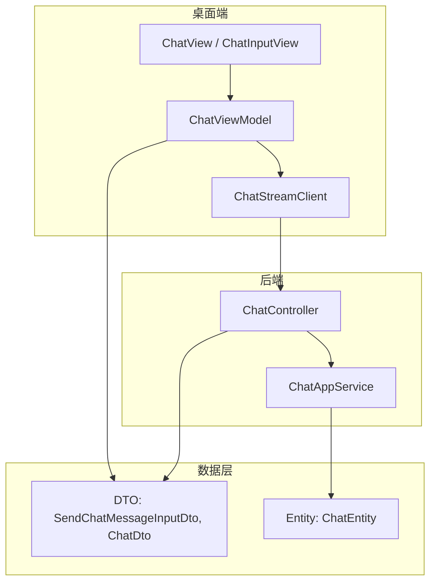
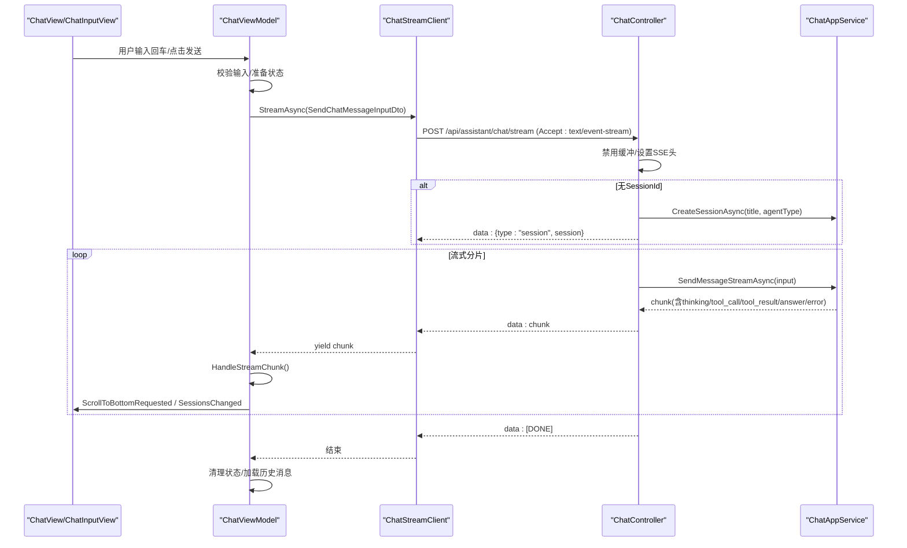
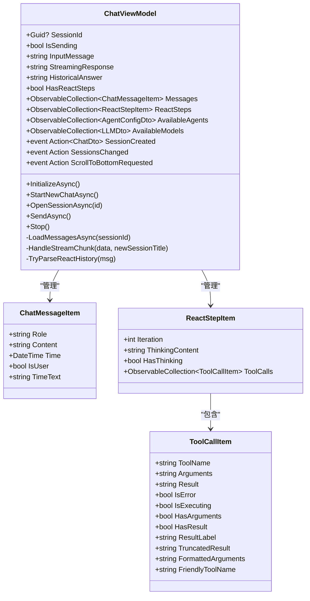
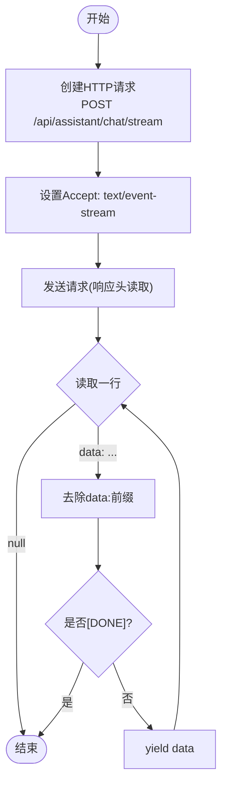
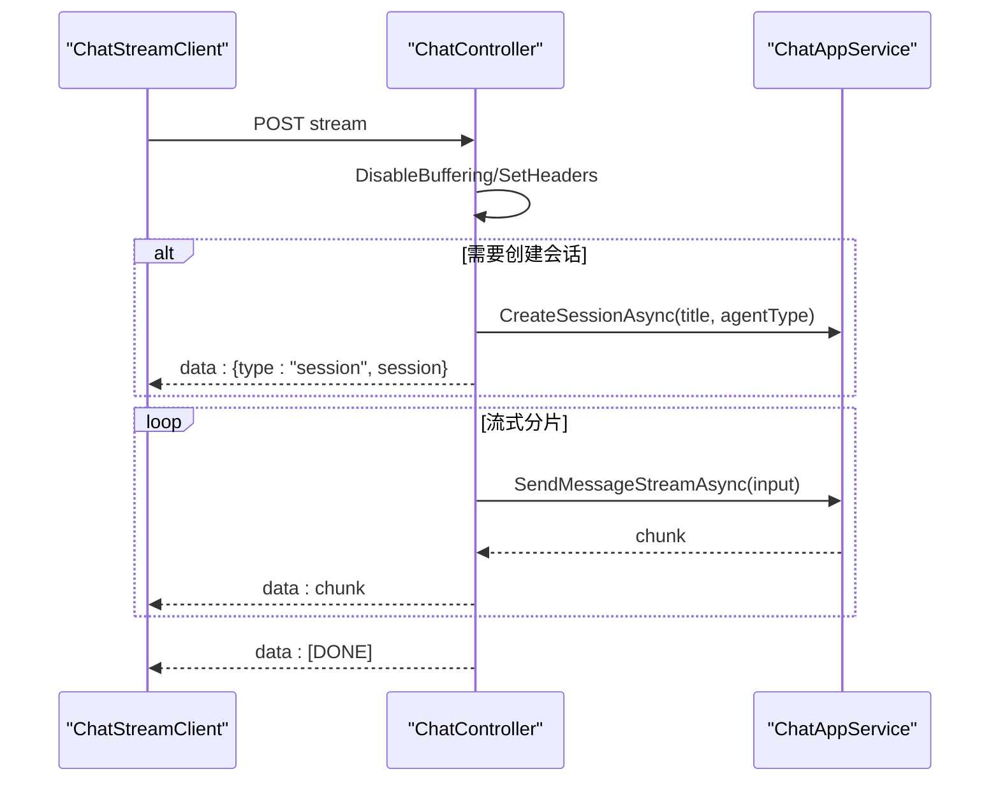
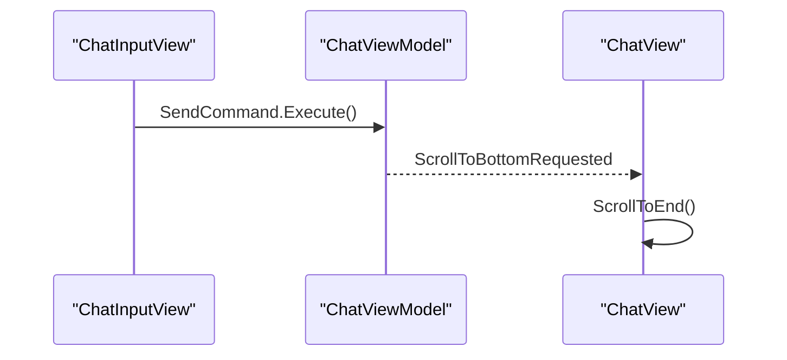
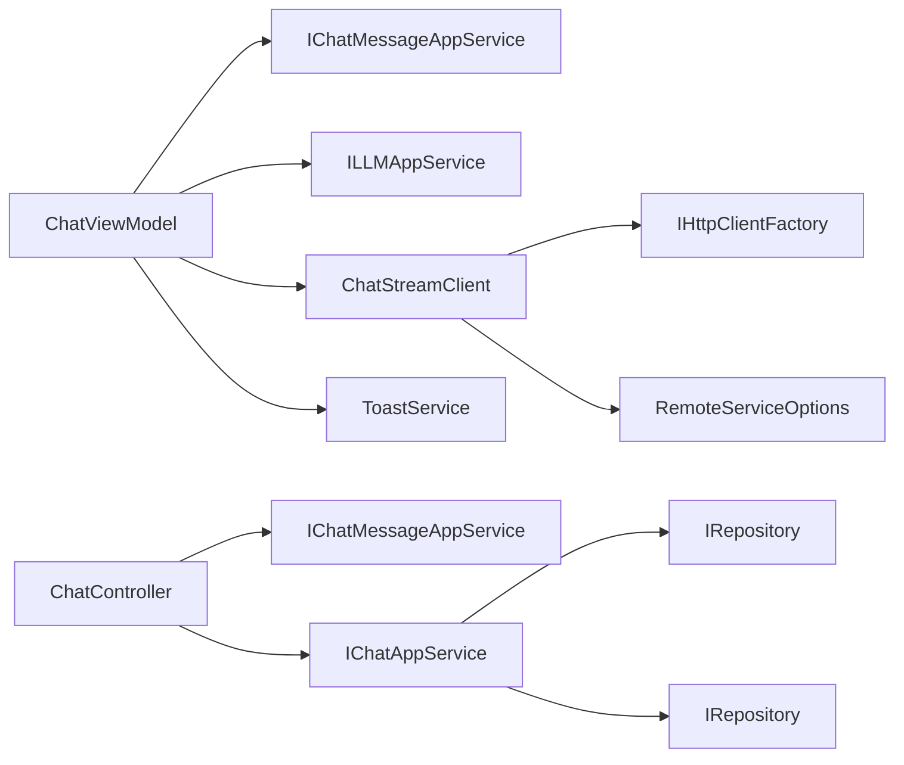

# 聊天视图模型

<cite>
**本文引用的文件**   
- [ChatViewModel.cs](file://src/Agent/Assistant/H.Assistant.Desktop/ViewModels/ChatViewModel.cs)
- [ChatStreamClient.cs](file://src/Agent/Assistant/H.Assistant.Desktop/Services/ChatStreamClient.cs)
- [ChatController.cs](file://src/Agent/Assistant/H.Assistant.Application/Controllers/ChatController.cs)
- [ChatAppService.cs](file://src/Agent/Assistant/H.Assistant.Application/Services/ChatAppService.cs)
- [SendChatMessageInputDto.cs](file://src/Agent/Assistant/H.Assistant.Application.Contracts/Dtos/Chats/SendChatMessageInputDto.cs)
- [ChatDto.cs](file://src/Agent/Assistant/H.Assistant.Application.Contracts/Dtos/Chats/ChatDto.cs)
- [ChatEntity.cs](file://src/Agent/Assistant/H.Assistant.EntityFrameworkCore/Entities/ChatEntity.cs)
- [ChatView.axaml.cs](file://src/Agent/Assistant/H.Assistant.Desktop/Views/ChatView.axaml.cs)
- [ChatInputView.axaml.cs](file://src/Agent/Assistant/H.Assistant.Desktop/Views/ChatInputView.axaml.cs)
</cite>

## 目录
1. [简介](#简介)
2. [项目结构](#项目结构)
3. [核心组件](#核心组件)
4. [架构总览](#架构总览)
5. [详细组件分析](#详细组件分析)
6. [依赖关系分析](#依赖关系分析)
7. [性能考虑](#性能考虑)
8. [故障排查指南](#故障排查指南)
9. [结论](#结论)
10. [附录：数据模型与事件契约](#附录数据模型与事件契约)

## 简介
本文件面向 ChatViewModel 的开发与维护，系统性阐述聊天功能的核心实现，包括会话管理、消息处理、流式响应（SSE）处理、ReAct 步骤解析、数据绑定机制、命令处理与属性变更通知、异步操作与错误处理策略、状态管理、与后端服务的交互方式、事件处理与 UI 更新机制，并提供具体使用模式与参考路径。

## 项目结构
围绕聊天功能的代码分布在桌面端 ViewModel、流式客户端、后端控制器与应用服务以及 DTO/实体层：
- 桌面端
  - ChatViewModel：UI 状态、命令、事件、流式数据处理与 ReAct 解析
  - ChatStreamClient：SSE 流式读取与协议适配
  - ChatView / ChatInputView：Avalonia 视图与键盘交互
- 后端
  - ChatController：SSE 接口、会话创建、错误事件推送
  - ChatAppService：会话与消息的持久化与查询
- 契约与实体
  - SendChatMessageInputDto、ChatDto：前后端传输模型
  - ChatEntity：会话实体

图表来源
- [ChatViewModel.cs](file://src/Agent/Assistant/H.Assistant.Desktop/ViewModels/ChatViewModel.cs)
- [ChatStreamClient.cs](file://src/Agent/Assistant/H.Assistant.Desktop/Services/ChatStreamClient.cs)
- [ChatController.cs](file://src/Agent/Assistant/H.Assistant.Application/Controllers/ChatController.cs)
- [ChatAppService.cs](file://src/Agent/Assistant/H.Assistant.Application/Services/ChatAppService.cs)
- [SendChatMessageInputDto.cs](file://src/Agent/Assistant/H.Assistant.Application.Contracts/Dtos/Chats/SendChatMessageInputDto.cs)
- [ChatDto.cs](file://src/Agent/Assistant/H.Assistant.Application.Contracts/Dtos/Chats/ChatDto.cs)
- [ChatEntity.cs](file://src/Agent/Assistant/H.Assistant.EntityFrameworkCore/Entities/ChatEntity.cs)

章节来源
- [ChatViewModel.cs](file://src/Agent/Assistant/H.Assistant.Desktop/ViewModels/ChatViewModel.cs)
- [ChatStreamClient.cs](file://src/Agent/Assistant/H.Assistant.Desktop/Services/ChatStreamClient.cs)
- [ChatController.cs](file://src/Agent/Assistant/H.Assistant.Application/Controllers/ChatController.cs)
- [ChatAppService.cs](file://src/Agent/Assistant/H.Assistant.Application/Services/ChatAppService.cs)
- [SendChatMessageInputDto.cs](file://src/Agent/Assistant/H.Assistant.Application.Contracts/Dtos/Chats/SendChatMessageInputDto.cs)
- [ChatDto.cs](file://src/Agent/Assistant/H.Assistant.Application.Contracts/Dtos/Chats/ChatDto.cs)
- [ChatEntity.cs](file://src/Agent/Assistant/H.Assistant.EntityFrameworkCore/Entities/ChatEntity.cs)

## 核心组件
- ChatViewModel
  - 职责：维护会话与消息状态、驱动发送流程、解析 SSE 事件与 ReAct 步骤、暴露命令与事件、触发 UI 滚动与刷新。
  - 关键能力：
    - 会话管理：新建会话、打开历史会话、清空状态、会话列表刷新事件。
    - 消息处理：用户消息入队、助手回复渲染、最后一条助手消息的富内容降级。
    - 流式响应：基于 IAsyncEnumerable 的逐块处理，支持 thinking/tool_call/tool_result/answer/error/session 事件。
    - ReAct 解析：将结构化事件聚合为迭代步骤，维护工具调用链路与结果。
    - 数据绑定：ObservableProperty + NotifyPropertyChangedFor，派生属性控制显示逻辑。
    - 命令与输入：RelayCommand 驱动发送、停止、下拉选择等；输入校验与 CanExecute。
    - 异步与错误：CancellationToken 取消流、异常捕获与 Toast 提示、失败回滚。
- ChatStreamClient
  - 职责：封装 HTTP 请求、设置 Accept 头、按行读取 SSE data、过滤 [DONE] 结束标记。
- ChatController
  - 职责：禁用响应缓冲、设置 SSE 响应头、按需创建会话并推送 session 事件、转发流式分片、统一错误事件推送。
- ChatAppService
  - 职责：会话 CRUD、消息增删查、会话统计更新。
- DTO/Entity
  - SendChatMessageInputDto：携带 SessionId、Message、AgentType、ModelConfigId、ProviderName。
  - ChatDto：会话标题、时间、计数等。
  - ChatEntity：会话实体，包含 AgentType、Messages 导航。

章节来源
- [ChatViewModel.cs](file://src/Agent/Assistant/H.Assistant.Desktop/ViewModels/ChatViewModel.cs)
- [ChatStreamClient.cs](file://src/Agent/Assistant/H.Assistant.Desktop/Services/ChatStreamClient.cs)
- [ChatController.cs](file://src/Agent/Assistant/H.Assistant.Application/Controllers/ChatController.cs)
- [ChatAppService.cs](file://src/Agent/Assistant/H.Assistant.Application/Services/ChatAppService.cs)
- [SendChatMessageInputDto.cs](file://src/Agent/Assistant/H.Assistant.Application.Contracts/Dtos/Chats/SendChatMessageInputDto.cs)
- [ChatDto.cs](file://src/Agent/Assistant/H.Assistant.Application.Contracts/Dtos/Chats/ChatDto.cs)
- [ChatEntity.cs](file://src/Agent/Assistant/H.Assistant.EntityFrameworkCore/Entities/ChatEntity.cs)

## 架构总览
下图展示从 UI 到后端的完整调用链与事件流，强调 SSE 流式传输与 ReAct 步骤在 ViewModel 中的组装。

图表来源
- [ChatViewModel.cs](file://src/Agent/Assistant/H.Assistant.Desktop/ViewModels/ChatViewModel.cs)
- [ChatStreamClient.cs](file://src/Agent/Assistant/H.Assistant.Desktop/Services/ChatStreamClient.cs)
- [ChatController.cs](file://src/Agent/Assistant/H.Assistant.Application/Controllers/ChatController.cs)
- [ChatAppService.cs](file://src/Agent/Assistant/H.Assistant.Application/Services/ChatAppService.cs)

## 详细组件分析

### ChatViewModel 分析
- 状态与数据绑定
  - 使用 ObservableProperty 声明 sessionId、isSending、inputMessage、streamingResponse、historicalAnswer、hasReactSteps 等，并通过 NotifyPropertyChangedFor 派生 HasSession、HasStreamingResponse、ShowThinkingIndicator、ShowPlainStreaming、ReactAnswerContent 等计算属性。
  - 集合属性 Messages、ReactSteps、AvailableAgents、AvailableModels 使用 ObservableCollection，确保 UI 自动刷新。
- 会话管理
  - StartNewChatAsync：重置所有状态并重新加载可用模型。
  - OpenSessionAsync：切换会话并加载历史消息，尝试解析最后一条助手消息的 ReAct 富内容。
  - LoadMessagesAsync：拉取消息列表，若存在 ReAct 富内容则替换最后一条助手消息的显示为纯文本答案。
- 消息发送与流式处理
  - SendAsync：构造 SendChatMessageInputDto，启动流式读取，增量渲染 Thinking/ToolCall/ToolResult/Answer，必要时创建新会话并广播 SessionCreated。
  - HandleStreamChunk：解析 JSON 事件，区分 type=session/type=thinking/tool_call/tool_result/answer/error，兼容旧格式 error 字段与非 JSON 纯文本。
  - Stop：通过 CancellationTokenSource 取消流。
- ReAct 步骤解析
  - 将 thinking/tool_call/tool_result 三类事件聚合为 ReactStepItem，维护 ToolCalls 列表与执行状态，最终 answer 作为 HistoricalAnswer 或覆盖 StreamingResponse。
- 事件与 UI 联动
  - SessionCreated：侧栏插入新会话。
  - SessionsChanged：刷新会话列表。
  - ScrollToBottomRequested：滚动到底部。
- 错误处理
  - 发送失败时回滚输入与消息，Toast 提示；流中 fatal 错误抛出异常终止；非致命错误以 warning 提示。

图表来源
- [ChatViewModel.cs](file://src/Agent/Assistant/H.Assistant.Desktop/ViewModels/ChatViewModel.cs)

章节来源
- [ChatViewModel.cs](file://src/Agent/Assistant/H.Assistant.Desktop/ViewModels/ChatViewModel.cs)

### ChatStreamClient 分析
- 职责：创建 HttpClient 请求，设置 Accept: text/event-stream，逐行读取 data: 前缀，跳过非 data 行，遇到 [DONE] 结束枚举。
- 关键点：
  - 使用 IHttpClientFactory 获取命名客户端。
  - 使用 RemoteServiceOptions 拼接 BaseUrl。
  - 使用 EnumeratorCancellation 传递取消令牌。

图表来源
- [ChatStreamClient.cs](file://src/Agent/Assistant/H.Assistant.Desktop/Services/ChatStreamClient.cs)

章节来源
- [ChatStreamClient.cs](file://src/Agent/Assistant/H.Assistant.Desktop/Services/ChatStreamClient.cs)

### ChatController 分析
- 职责：
  - 禁用响应缓冲，设置 SSE 响应头（no-cache、no-transform、keep-alive）。
  - 若无 SessionId，先创建会话并推送 session 事件。
  - 调用应用服务流式方法，逐条写入 data: 分片。
  - 结束时写入 [DONE]。
  - 异常时推送 type=error 事件（含 isFatal）。

图表来源
- [ChatController.cs](file://src/Agent/Assistant/H.Assistant.Application/Controllers/ChatController.cs)
- [ChatAppService.cs](file://src/Agent/Assistant/H.Assistant.Application/Services/ChatAppService.cs)

章节来源
- [ChatController.cs](file://src/Agent/Assistant/H.Assistant.Application/Controllers/ChatController.cs)
- [ChatAppService.cs](file://src/Agent/Assistant/H.Assistant.Application/Services/ChatAppService.cs)

### 视图与交互（Avalonia）
- ChatView：订阅 ScrollToBottomRequested 事件，在 UI 线程滚动到底部；提供拖拽头部行为。
- ChatInputView：拦截 Enter/Shift+Enter，调用 ChatViewModel.SendCommand。

图表来源
- [ChatView.axaml.cs](file://src/Agent/Assistant/H.Assistant.Desktop/Views/ChatView.axaml.cs)
- [ChatInputView.axaml.cs](file://src/Agent/Assistant/H.Assistant.Desktop/Views/ChatInputView.axaml.cs)
- [ChatViewModel.cs](file://src/Agent/Assistant/H.Assistant.Desktop/ViewModels/ChatViewModel.cs)

章节来源
- [ChatView.axaml.cs](file://src/Agent/Assistant/H.Assistant.Desktop/Views/ChatView.axaml.cs)
- [ChatInputView.axaml.cs](file://src/Agent/Assistant/H.Assistant.Desktop/Views/ChatInputView.axaml.cs)
- [ChatViewModel.cs](file://src/Agent/Assistant/H.Assistant.Desktop/ViewModels/ChatViewModel.cs)

## 依赖关系分析
- ChatViewModel 依赖：
  - IChatMessageAppService：获取可用智能体、消息列表。
  - ILLMAppService：获取模型配置。
  - ChatStreamClient：SSE 流式读取。
  - ToastService：提示。
- ChatStreamClient 依赖：
  - IHttpClientFactory、RemoteServiceOptions。
- ChatController 依赖：
  - IChatMessageAppService、IChatAppService。
- ChatAppService 依赖：
  - IRepository<ChatEntity>、IRepository<ChatMessageEntity>、IMapper、IAsyncQueryableExecuter。

图表来源
- [ChatViewModel.cs](file://src/Agent/Assistant/H.Assistant.Desktop/ViewModels/ChatViewModel.cs)
- [ChatStreamClient.cs](file://src/Agent/Assistant/H.Assistant.Desktop/Services/ChatStreamClient.cs)
- [ChatController.cs](file://src/Agent/Assistant/H.Assistant.Application/Controllers/ChatController.cs)
- [ChatAppService.cs](file://src/Agent/Assistant/H.Assistant.Application/Services/ChatAppService.cs)

章节来源
- [ChatViewModel.cs](file://src/Agent/Assistant/H.Assistant.Desktop/ViewModels/ChatViewModel.cs)
- [ChatStreamClient.cs](file://src/Agent/Assistant/H.Assistant.Desktop/Services/ChatStreamClient.cs)
- [ChatController.cs](file://src/Agent/Assistant/H.Assistant.Application/Controllers/ChatController.cs)
- [ChatAppService.cs](file://src/Agent/Assistant/H.Assistant.Application/Services/ChatAppService.cs)

## 性能考虑
- SSE 流式传输
  - 禁用响应缓冲与 no-transform，避免中间件压缩导致延迟。
  - 逐行读取与即时 Flush，降低首字节延迟。
- 前端渲染
  - 仅追加增量内容，避免全量重绘。
  - 滚动调度使用后台优先级，减少卡顿。
- 数据加载
  - 首次初始化静默失败，避免阻塞 UI。
  - 模型列表启用过滤与默认选择，减少无效请求。
- 内存与对象
  - 使用 IAsyncEnumerable 避免一次性加载大响应。
  - 集合 Clear 后再 Add，避免重复项。

[本节为通用指导，不直接分析具体文件]

## 故障排查指南
- 常见问题
  - 流未结束：检查 [DONE] 是否到达；确认服务端正常写入。
  - 会话未创建：确认 session 事件是否返回；检查后端 CreateSessionAsync。
  - ReAct 步骤不显示：检查 lastAssistantMsg.Content 是否为富内容 JSON；查看 TryParseReactHistory 分支。
  - 错误提示：fatal 错误会中断流；非 fatal 错误通过 Toast 提示。
- 定位建议
  - 在 HandleStreamChunk 中打印事件类型与关键字段。
  - 在 ChatStreamClient 中记录读取到的原始行。
  - 在 ChatController 中确认响应头与缓冲禁用生效。

章节来源
- [ChatViewModel.cs](file://src/Agent/Assistant/H.Assistant.Desktop/ViewModels/ChatViewModel.cs)
- [ChatStreamClient.cs](file://src/Agent/Assistant/H.Assistant.Desktop/Services/ChatStreamClient.cs)
- [ChatController.cs](file://src/Agent/Assistant/H.Assistant.Application/Controllers/ChatController.cs)

## 结论
ChatViewModel 通过清晰的 MVVM 分层与事件驱动，实现了完整的聊天体验：会话管理、消息渲染、流式响应与 ReAct 步骤可视化。配合 ChatStreamClient 与后端控制器/服务，形成低延迟、可观测、可扩展的聊天系统。建议在后续迭代中继续完善错误恢复、重试策略与更丰富的 ReAct 可视化能力。

[本节为总结性内容，不直接分析具体文件]

## 附录：数据模型与事件契约
- 输入模型
  - SendChatMessageInputDto：SessionId、Message、AgentType、ModelConfigId、ProviderName。
- 会话模型
  - ChatDto：Id、Title、CreationTime、LastMessageTime、MessageCount。
- 实体
  - ChatEntity：Title、AgentType、LastMessageTime、MessageCount、Messages。
- SSE 事件契约
  - session：{type:"session", session: Guid}
  - thinking：{type:"thinking", iteration:int, content:string}
  - tool_call：{type:"tool_call", iteration:int, toolName:string, arguments:string}
  - tool_result：{type:"tool_result", toolName:string, result:string, isError:boolean}
  - answer：{type:"answer", content:string}
  - error：{type:"error", message:string, isFatal:boolean}
  - 结束标记：[DONE]

章节来源
- [SendChatMessageInputDto.cs](file://src/Agent/Assistant/H.Assistant.Application.Contracts/Dtos/Chats/SendChatMessageInputDto.cs)
- [ChatDto.cs](file://src/Agent/Assistant/H.Assistant.Application.Contracts/Dtos/Chats/ChatDto.cs)
- [ChatEntity.cs](file://src/Agent/Assistant/H.Assistant.EntityFrameworkCore/Entities/ChatEntity.cs)
- [ChatController.cs](file://src/Agent/Assistant/H.Assistant.Application/Controllers/ChatController.cs)
- [ChatViewModel.cs](file://src/Agent/Assistant/H.Assistant.Desktop/ViewModels/ChatViewModel.cs)