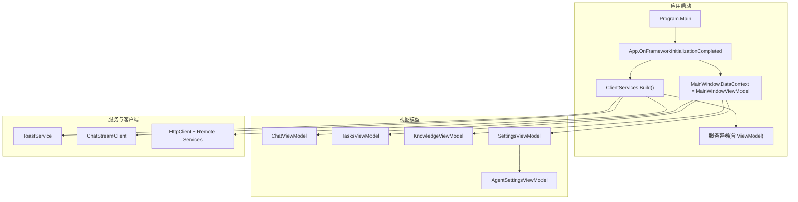
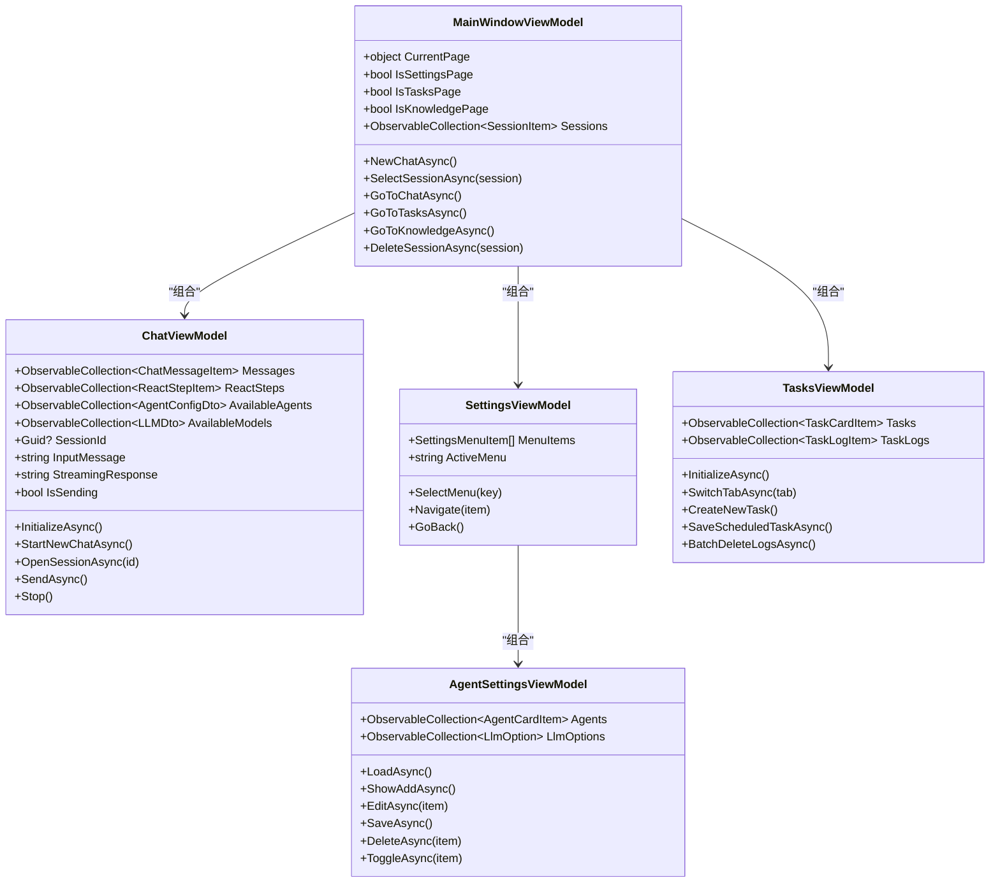
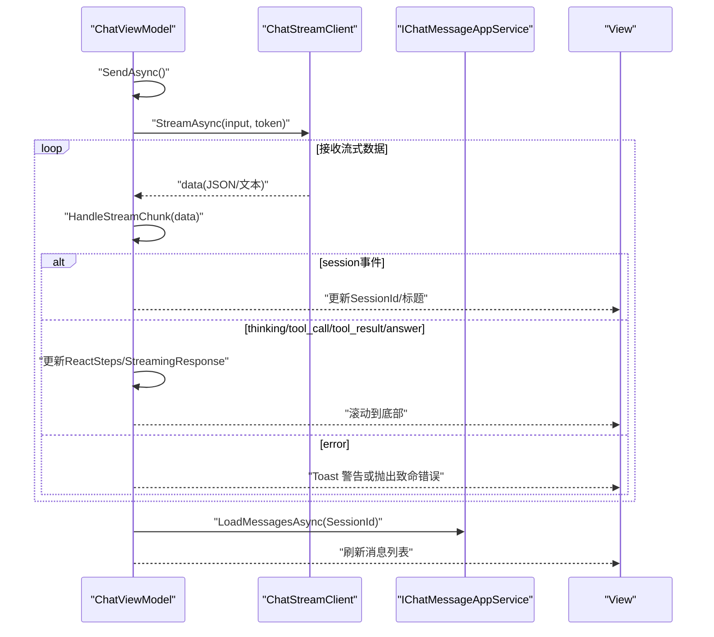
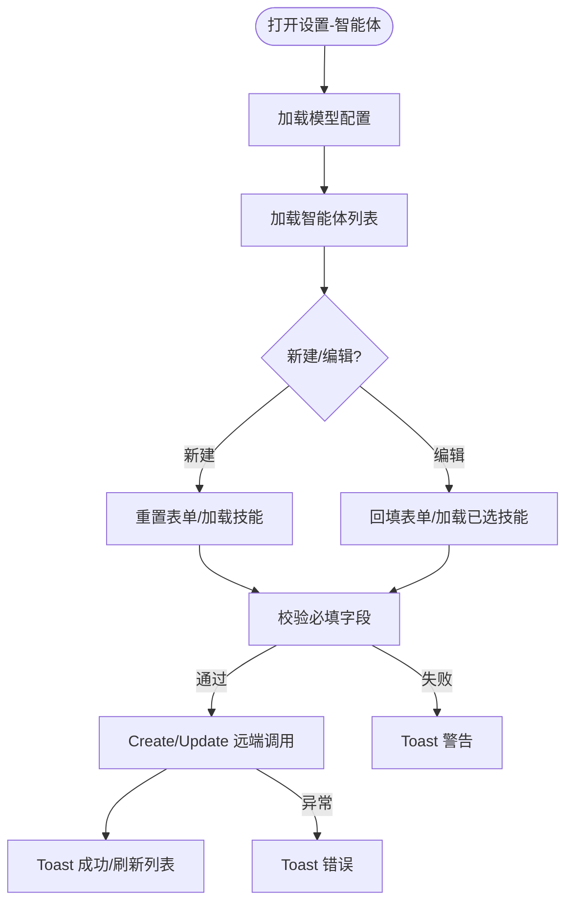
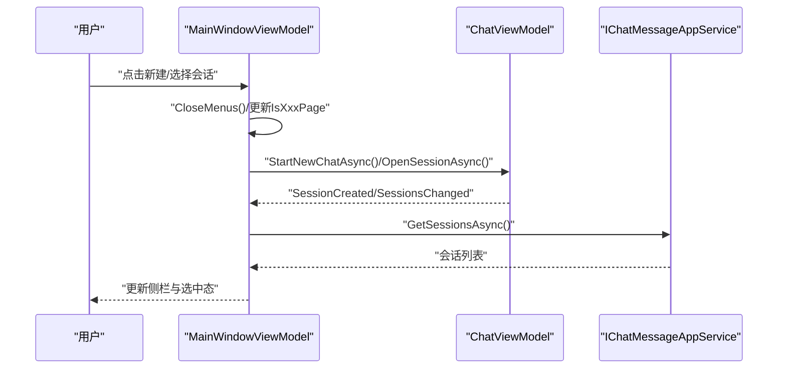
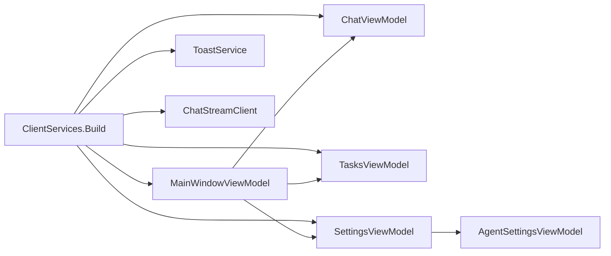

# 视图模型层

<cite>
**本文引用的文件**   
- [App.axaml.cs](file://src/Agent/Assistant/H.Assistant.Desktop/App.axaml.cs)
- [Program.cs](file://src/Agent/Assistant/H.Assistant.Desktop/Program.cs)
- [ClientServices.cs](file://src/Agent/Assistant/H.Assistant.Desktop/ClientServices.cs)
- [ChatViewModel.cs](file://src/Agent/Assistant/H.Assistant.Desktop/ViewModels/ChatViewModel.cs)
- [MainWindowViewModel.cs](file://src/Agent/Assistant/H.Assistant.Desktop/ViewModels/MainWindowViewModel.cs)
- [SettingsViewModel.cs](file://src/Agent/Assistant/H.Assistant.Desktop/ViewModels/SettingsViewModel.cs)
- [AgentSettingsViewModel.cs](file://src/Agent/Assistant/H.Assistant.Desktop/ViewModels/AgentSettingsViewModel.cs)
- [TasksViewModel.cs](file://src/Agent/Assistant/H.Assistant.Desktop/ViewModels/TasksViewModel.cs)
</cite>

## 目录
1. [简介](#简介)
2. [项目结构](#项目结构)
3. [核心组件](#核心组件)
4. [架构总览](#架构总览)
5. [详细组件分析](#详细组件分析)
6. [依赖关系分析](#依赖关系分析)
7. [性能考虑](#性能考虑)
8. [故障排查指南](#故障排查指南)
9. [结论](#结论)
10. [附录：测试与最佳实践](#附录测试与最佳实践)

## 简介
本文件面向桌面端应用（Avalonia）的视图模型层，系统化阐述各 ViewModel 的职责、数据绑定机制、命令处理、属性变更通知、状态管理与业务逻辑封装，以及异步操作与错误处理策略。重点覆盖 ChatViewModel 的聊天流式交互、AgentSettingsViewModel 的智能体设置管理、MainWindowViewModel 的主窗口控制与页面导航等。

## 项目结构
- 入口与初始化
  - Program.cs：Avalonia 应用启动配置
  - App.axaml.cs：应用生命周期中构建服务容器并注入 MainWindowViewModel
  - ClientServices.cs：注册 HttpClient、远程服务代理、ToastService、ChatStreamClient 与各 ViewModel
- 视图模型
  - MainWindowViewModel：主窗口与侧栏会话管理、页面切换
  - ChatViewModel：聊天会话、消息列表、ReAct 步骤、流式响应
  - SettingsViewModel：设置页菜单与子模块编排
  - AgentSettingsViewModel：智能体的增删改查与技能选择
  - TasksViewModel：定时任务与执行日志的多选删除

**图表来源** 
- [Program.cs:1-20](file://src/Agent/Assistant/H.Assistant.Desktop/Program.cs#L1-L20)
- [App.axaml.cs:17-35](file://src/Agent/Assistant/H.Assistant.Desktop/App.axaml.cs#L17-L35)
- [ClientServices.cs:17-58](file://src/Agent/Assistant/H.Assistant.Desktop/ClientServices.cs#L17-L58)

**章节来源**
- [Program.cs:1-20](file://src/Agent/Assistant/H.Assistant.Desktop/Program.cs#L1-L20)
- [App.axaml.cs:17-35](file://src/Agent/Assistant/H.Assistant.Desktop/App.axaml.cs#L17-L35)
- [ClientServices.cs:17-58](file://src/Agent/Assistant/H.Assistant.Desktop/ClientServices.cs#L17-L58)

## 核心组件
- MainWindowViewModel
  - 职责：维护当前页面、会话集合、用户菜单；协调 Chat/Tasks/Knowledge/Settings 子视图模型；订阅 Chat 的事件以同步会话列表。
  - 关键特性：使用 ObservableObject 与 [RelayCommand]；通过事件驱动更新侧栏会话；提供页面导航与新建/打开/删除会话能力。
- ChatViewModel
  - 职责：加载可用智能体与模型；管理会话与消息；处理流式响应与 ReAct 步骤；发送/停止消息；下拉框状态管理。
  - 关键特性：ObservableCollection 承载消息与步骤；[ObservableProperty] 驱动 UI 刷新；[RelayCommand(CanExecute)] 控制发送按钮；CancellationTokenSource 支持取消流式请求。
- SettingsViewModel
  - 职责：设置页左侧菜单与右侧内容编排；懒加载对应子模块（LLM/Agent/Skill/MCP）。
  - 关键特性：ActiveMenu 驱动 IsXxx 计算属性；BackRequested 事件返回聊天页。
- AgentSettingsViewModel
  - 职责：智能体列表加载、创建/编辑/删除/启用禁用；技能分组筛选与多选；默认模型选择。
  - 关键特性：SkillCheckItem 分组与 CheckedChanged 事件；保存时校验与 Toast 反馈。
- TasksViewModel
  - 职责：定时任务 CRUD、立即执行、启用/禁用；执行日志查看与批量删除；表单模型 TaskEditModel 负责数据转换。
  - 关键特性：Tab 切换、多选模式、全选/清空、确认对话框；异常统一 Toast 提示。

**章节来源**
- [MainWindowViewModel.cs:1-270](file://src/Agent/Assistant/H.Assistant.Desktop/ViewModels/MainWindowViewModel.cs#L1-L270)
- [ChatViewModel.cs:1-632](file://src/Agent/Assistant/H.Assistant.Desktop/ViewModels/ChatViewModel.cs#L1-L632)
- [SettingsViewModel.cs:1-121](file://src/Agent/Assistant/H.Assistant.Desktop/ViewModels/SettingsViewModel.cs#L1-L121)
- [AgentSettingsViewModel.cs:1-420](file://src/Agent/Assistant/H.Assistant.Desktop/ViewModels/AgentSettingsViewModel.cs#L1-L420)
- [TasksViewModel.cs:1-647](file://src/Agent/Assistant/H.Assistant.Desktop/ViewModels/TasksViewModel.cs#L1-L647)

## 架构总览
视图模型层基于 Avalonia + CommunityToolkit.Mvvm 实现 MVVM 模式。应用启动时由 App.axaml.cs 构建服务容器，将 MainWindowViewModel 作为主窗口的 DataContext。各 ViewModel 通过依赖注入获取 IChatMessageAppService、ILLMAppService、ITaskAppService 等远端服务代理，并使用 ChatStreamClient 进行流式通信。UI 通过 [ObservableProperty]、[RelayCommand] 和 ObservableCollection 完成双向绑定与命令触发。

**图表来源** 
- [MainWindowViewModel.cs:1-270](file://src/Agent/Assistant/H.Assistant.Desktop/ViewModels/MainWindowViewModel.cs#L1-L270)
- [ChatViewModel.cs:1-632](file://src/Agent/Assistant/H.Assistant.Desktop/ViewModels/ChatViewModel.cs#L1-L632)
- [SettingsViewModel.cs:1-121](file://src/Agent/Assistant/H.Assistant.Desktop/ViewModels/SettingsViewModel.cs#L1-L121)
- [AgentSettingsViewModel.cs:1-420](file://src/Agent/Assistant/H.Assistant.Desktop/ViewModels/AgentSettingsViewModel.cs#L1-L420)
- [TasksViewModel.cs:1-647](file://src/Agent/Assistant/H.Assistant.Desktop/ViewModels/TasksViewModel.cs#L1-L647)

## 详细组件分析

### ChatViewModel 分析
- 数据绑定与状态
  - 使用 [ObservableProperty] 声明 SessionId、IsSending、InputMessage、StreamingResponse、HasReactSteps 等，配合 NotifyPropertyChangedFor 派生属性（如 HasSession、ShowThinkingIndicator、ReactAnswerContent）。
  - 消息与步骤使用 ObservableCollection 保证 UI 自动刷新。
- 命令处理
  - SendAsync 使用 [RelayCommand(CanExecute=CanSend)] 确保输入非空且未发送中；Stop 用于取消流式请求。
  - ToggleAgentDropdown/ToggleModelDropdown/SelectAgent/SelectModel 管理下拉状态。
- 异步与流式处理
  - InitializeAsync 加载可用智能体与模型；OpenSessionAsync 加载历史消息并解析 ReAct 步骤。
  - SendAsync 调用 ChatStreamClient.StreamAsync，按块处理 JSON 事件（session、thinking、tool_call、tool_result、answer、error），兼容纯文本流。
  - 使用 CancellationTokenSource 支持用户中断；异常捕获后回滚输入并 Toast 提示。
- 错误处理
  - 网络或解析异常统一捕获，失败时恢复输入与消息状态，并通过 ToastService 展示错误信息。

**图表来源** 
- [ChatViewModel.cs:306-366](file://src/Agent/Assistant/H.Assistant.Desktop/ViewModels/ChatViewModel.cs#L306-L366)
- [ChatViewModel.cs:368-475](file://src/Agent/Assistant/H.Assistant.Desktop/ViewModels/ChatViewModel.cs#L368-L475)

**章节来源**
- [ChatViewModel.cs:1-632](file://src/Agent/Assistant/H.Assistant.Desktop/ViewModels/ChatViewModel.cs#L1-L632)

### AgentSettingsViewModel 分析
- 数据与界面
  - Agents、LlmOptions、FilteredSkills 为 ObservableCollection，支持分组与搜索过滤。
  - SkillCheckItem 支持分组头与复选项，CheckedChanged 事件维护选中集合。
- 业务流程
  - LoadAsync 加载模型配置与智能体列表；编辑/新增时加载可用技能并回填已选。
  - SaveAsync 校验必填项，区分 Create/Update，成功后刷新列表并 Toast。
  - DeleteAsync/ToggleAsync 直接调用远端服务并刷新。
- 错误处理
  - 所有远端调用均 try/catch 并 Toast 提示；技能加载失败忽略以保证可用性。

**图表来源** 
- [AgentSettingsViewModel.cs:91-146](file://src/Agent/Assistant/H.Assistant.Desktop/ViewModels/AgentSettingsViewModel.cs#L91-L146)
- [AgentSettingsViewModel.cs:197-313](file://src/Agent/Assistant/H.Assistant.Desktop/ViewModels/AgentSettingsViewModel.cs#L197-L313)

**章节来源**
- [AgentSettingsViewModel.cs:1-420](file://src/Agent/Assistant/H.Assistant.Desktop/ViewModels/AgentSettingsViewModel.cs#L1-L420)

### MainWindowViewModel 分析
- 页面与状态
  - CurrentPage 决定显示 Chat/Tasks/Knowledge/Settings；IsXxxPage 控制导航高亮。
  - Sessions 集合与 SessionItem 管理选中态与菜单展开。
- 事件协作
  - 订阅 Chat.SessionCreated 与 Chat.SessionsChanged，保持侧栏会话同步。
  - Settings.BackRequested 返回聊天页。
- 导航与操作
  - NewChatAsync/SelectSessionAsync/GoToXxx 方法统一关闭菜单并切换页面。
  - DeleteSessionAsync 删除后刷新并处理选中项。

**图表来源** 
- [MainWindowViewModel.cs:48-97](file://src/Agent/Assistant/H.Assistant.Desktop/ViewModels/MainWindowViewModel.cs#L48-L97)
- [MainWindowViewModel.cs:99-152](file://src/Agent/Assistant/H.Assistant.Desktop/ViewModels/MainWindowViewModel.cs#L99-L152)

**章节来源**
- [MainWindowViewModel.cs:1-270](file://src/Agent/Assistant/H.Assistant.Desktop/ViewModels/MainWindowViewModel.cs#L1-L270)

### SettingsViewModel 与子模块
- 职责：维护菜单项与 ActiveMenu，按需加载 LLM/Agent/Skill/MCP 子模块。
- 行为：SelectMenu 触发 LoadActiveMenuAsync；GoBack 通过 BackRequested 返回聊天页。

**章节来源**
- [SettingsViewModel.cs:1-121](file://src/Agent/Assistant/H.Assistant.Desktop/ViewModels/SettingsViewModel.cs#L1-L121)

### TasksViewModel 分析
- 功能：任务 CRUD、立即执行、启用/禁用；日志查看与批量删除；表单模型 TaskEditModel 负责 DTO 转换。
- 交互：Tab 切换、多选模式、全选/清空、确认对话框；异常统一 Toast。

**章节来源**
- [TasksViewModel.cs:1-647](file://src/Agent/Assistant/H.Assistant.Desktop/ViewModels/TasksViewModel.cs#L1-L647)

## 依赖关系分析
- 服务注册
  - ClientServices.Build 注册 IConfiguration、RemoteServices、HttpClient、ToastService、ChatStreamClient 与各 ViewModel（单例）。
- 依赖注入
  - App.axaml.cs 在 OnFrameworkInitializationCompleted 中从服务容器解析 MainWindowViewModel 并赋值给 MainWindow.DataContext。
- 外部依赖
  - IChatMessageAppService、ILLMAppService、ITaskAppService、ITaskLogAppService、IAgentAppService、ISkillAppService、IMcpServerAppService 均为远端服务代理（HTTP 客户端生成）。

**图表来源** 
- [ClientServices.cs:17-58](file://src/Agent/Assistant/H.Assistant.Desktop/ClientServices.cs#L17-L58)
- [App.axaml.cs:22-35](file://src/Agent/Assistant/H.Assistant.Desktop/App.axaml.cs#L22-L35)

**章节来源**
- [ClientServices.cs:17-58](file://src/Agent/Assistant/H.Assistant.Desktop/ClientServices.cs#L17-L58)
- [App.axaml.cs:22-35](file://src/Agent/Assistant/H.Assistant.Desktop/App.axaml.cs#L22-L35)

## 性能考虑
- 集合更新
  - 使用 ObservableCollection 增量更新，避免全量重建；必要时先 Clear 再批量 Add。
- 流式渲染
  - ChatViewModel 逐块追加 StreamingResponse，减少 UI 重绘频率；仅在需要时滚动到底部。
- 异步初始化
  - 延迟加载（如 Settings 子模块、Tasks 首次 Tab）避免启动阻塞。
- 取消与超时
  - 使用 CancellationTokenSource 及时取消流式请求，防止资源泄漏。
- 错误快速失败
  - 网络异常捕获后立即回滚状态并提示，避免脏数据滞留。

## 故障排查指南
- 常见问题
  - 模型加载失败：检查 ILLMAppService 配置与网络连通性；查看 Toast 错误信息。
  - 流式响应卡住：确认 ChatStreamClient 是否被正确注入；检查 Stop 命令是否触发取消。
  - 会话不同步：确认 Chat.SessionCreated/SessionsChanged 事件是否被 MainWindowViewModel 订阅。
- 定位手段
  - 在 App.axaml.cs 中检查服务容器是否正确构建。
  - 在 ClientServices.cs 中验证 RemoteServices 与 HttpClient 配置。
  - 在各 ViewModel 的 try/catch 分支添加日志输出（生产环境建议集中化日志）。

**章节来源**
- [App.axaml.cs:22-35](file://src/Agent/Assistant/H.Assistant.Desktop/App.axaml.cs#L22-L35)
- [ClientServices.cs:27-45](file://src/Agent/Assistant/H.Assistant.Desktop/ClientServices.cs#L27-L45)
- [ChatViewModel.cs:351-366](file://src/Agent/Assistant/H.Assistant.Desktop/ViewModels/ChatViewModel.cs#L351-L366)

## 结论
该视图模型层采用清晰的 MVVM 分层与依赖注入，结合 CommunityToolkit.Mvvm 的属性与命令机制，实现了良好的可维护性与可扩展性。ChatViewModel 的流式处理与 ReAct 步骤解析体现了复杂交互场景的最佳实践；MainWindowViewModel 的事件驱动与会话管理保证了 UI 一致性；SettingsViewModel 与 AgentSettingsViewModel/TasksViewModel 展现了模块化与可复用性。整体设计兼顾了用户体验与健壮性。

## 附录：测试与最佳实践
- 单元测试建议
  - 对 ChatViewModel.SendAsync 的流式处理路径进行模拟（Mock ChatStreamClient 与 IChatMessageAppService），验证 JSON 事件解析与 UI 状态变化。
  - 对 AgentSettingsViewModel.SaveAsync 的校验与远端调用进行断言，确保异常路径 Toast 提示。
  - 对 MainWindowViewModel 的导航与事件订阅进行集成测试，确保会话列表同步。
- 最佳实践
  - 属性变更：优先使用 [ObservableProperty] 与 [NotifyPropertyChangedFor]，减少样板代码。
  - 命令处理：使用 [RelayCommand] 与 CanExecute 控制可用性；避免在命令中直接操作 UI。
  - 异步与取消：所有耗时操作使用 async/await；对外部流式请求使用 CancellationTokenSource。
  - 错误处理：统一通过 ToastService 反馈；对不可恢复错误抛出明确异常以便上层处理。
  - 数据绑定：使用 ObservableCollection 与只读集合暴露数据；避免在 UI 线程外修改集合。